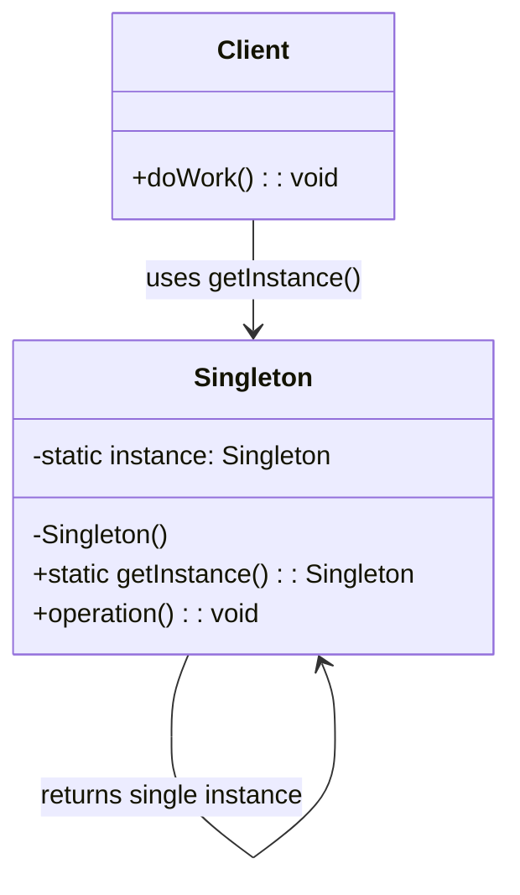

# Singleton Pattern

The Singleton pattern ensures that a class has only one instance throughout the application lifecycle and provides a global point of access to that instance. It is particularly useful for managing shared resources like configuration managers, connection pools, and caches where multiple instances would cause inconsistency or resource waste.

## Intent

Restrict a class to a single instance and provide a well-known access point to it. This is critical in systems where exactly one object is needed to coordinate actions across the system — such as a centralized configuration, a connection pool, or a hardware interface controller.

## Class Diagram



## Key Characteristics

- Guarantees only one instance of a class exists in a running process
- Provides a global access point, often via a static method
- Lazy initialization can defer creation until first use, saving resources
- Thread safety must be explicitly handled in concurrent environments
- Can make unit testing harder due to global state — consider dependency injection as a complement
- Overuse leads to hidden coupling; prefer it only when a single coordination point is genuinely required

---

## Example 1: Fintech — Payment Gateway Configuration Manager

**Problem:** A payment processing platform connects to multiple acquirers (Visa, Mastercard, local banks). Gateway credentials, retry policies, and routing rules must be loaded once from a secure vault and shared across all transaction handlers. Creating multiple config instances risks stale credentials and race conditions during hot-reload.

**Solution:** A Singleton `PaymentGatewayConfig` loads credentials at startup, exposes them read-only, and handles atomic hot-reload. Every transaction handler references the same instance.

```python
import threading

class PaymentGatewayConfig:
    _instance = None
    _lock = threading.Lock()

    def __init__(self):
        self.api_key: str = ""
        self.retry_limit: int = 3
        self.gateway_url: str = ""

    @classmethod
    def get_instance(cls) -> "PaymentGatewayConfig":
        if cls._instance is None:
            with cls._lock:
                if cls._instance is None:
                    cls._instance = cls()
                    cls._instance._load_from_vault()
        return cls._instance

    def _load_from_vault(self):
        self.api_key = "sk_live_abc123"
        self.gateway_url = "https://acquirer.bank/api/v2"
        self.retry_limit = 5

config = PaymentGatewayConfig.get_instance()
print(config.gateway_url, config.retry_limit)
```

```go
package main

import (
	"fmt"
	"sync"
)

type PaymentGatewayConfig struct {
	APIKey     string
	GatewayURL string
	RetryLimit int
}

var (
	pgcInstance *PaymentGatewayConfig
	pgcOnce    sync.Once
)

func GetPaymentGatewayConfig() *PaymentGatewayConfig {
	pgcOnce.Do(func() {
		pgcInstance = &PaymentGatewayConfig{
			APIKey:     "sk_live_abc123",
			GatewayURL: "https://acquirer.bank/api/v2",
			RetryLimit: 5,
		}
	})
	return pgcInstance
}

func main() {
	cfg := GetPaymentGatewayConfig()
	fmt.Println(cfg.GatewayURL, cfg.RetryLimit)
}
```

```java
public final class PaymentGatewayConfig {
    private static volatile PaymentGatewayConfig instance;
    private String apiKey;
    private String gatewayUrl;
    private int retryLimit;

    private PaymentGatewayConfig() {
        this.apiKey = "sk_live_abc123";
        this.gatewayUrl = "https://acquirer.bank/api/v2";
        this.retryLimit = 5;
    }

    public static PaymentGatewayConfig getInstance() {
        if (instance == null) {
            synchronized (PaymentGatewayConfig.class) {
                if (instance == null) {
                    instance = new PaymentGatewayConfig();
                }
            }
        }
        return instance;
    }

    public String getGatewayUrl() { return gatewayUrl; }
    public int getRetryLimit() { return retryLimit; }
}
```

```typescript
class PaymentGatewayConfig {
  private static instance: PaymentGatewayConfig;
  readonly apiKey: string;
  readonly gatewayUrl: string;
  readonly retryLimit: number;

  private constructor() {
    this.apiKey = "sk_live_abc123";
    this.gatewayUrl = "https://acquirer.bank/api/v2";
    this.retryLimit = 5;
  }

  static getInstance(): PaymentGatewayConfig {
    if (!PaymentGatewayConfig.instance) {
      PaymentGatewayConfig.instance = new PaymentGatewayConfig();
    }
    return PaymentGatewayConfig.instance;
  }
}

const cfg = PaymentGatewayConfig.getInstance();
console.log(cfg.gatewayUrl, cfg.retryLimit);
```

```rust
use std::sync::OnceLock;

struct PaymentGatewayConfig {
    api_key: String,
    gateway_url: String,
    retry_limit: u32,
}

static CONFIG: OnceLock<PaymentGatewayConfig> = OnceLock::new();

fn get_payment_gateway_config() -> &'static PaymentGatewayConfig {
    CONFIG.get_or_init(|| PaymentGatewayConfig {
        api_key: "sk_live_abc123".into(),
        gateway_url: "https://acquirer.bank/api/v2".into(),
        retry_limit: 5,
    })
}

fn main() {
    let cfg = get_payment_gateway_config();
    println!("{} {}", cfg.gateway_url, cfg.retry_limit);
}
```

---

## Example 2: Healthcare — Electronic Health Record (EHR) System Configuration

**Problem:** A hospital's EHR system must connect to HL7 FHIR endpoints, lab integrations, and pharmacy systems using a unified configuration. Multiple configuration instances could serve different versions of endpoint URLs, violating HIPAA audit requirements for consistent access logging.

**Solution:** A Singleton `EHRSystemConfig` is initialized once from the hospital's configuration server, ensuring all modules — scheduling, charting, prescriptions — read the same FHIR base URL, TLS settings, and facility identifiers.

```python
import threading

class EHRSystemConfig:
    _instance = None
    _lock = threading.Lock()

    def __init__(self):
        self.fhir_base_url: str = ""
        self.facility_id: str = ""
        self.tls_cert_path: str = ""

    @classmethod
    def get_instance(cls) -> "EHRSystemConfig":
        if cls._instance is None:
            with cls._lock:
                if cls._instance is None:
                    cls._instance = cls()
                    cls._instance._load_config()
        return cls._instance

    def _load_config(self):
        self.fhir_base_url = "https://ehr.hospital.org/fhir/r4"
        self.facility_id = "HOSP-NE-0042"
        self.tls_cert_path = "/etc/ssl/ehr/client.pem"

cfg = EHRSystemConfig.get_instance()
print(cfg.fhir_base_url, cfg.facility_id)
```

```go
package main

import (
	"fmt"
	"sync"
)

type EHRSystemConfig struct {
	FHIRBaseURL string
	FacilityID  string
	TLSCertPath string
}

var (
	ehrInstance *EHRSystemConfig
	ehrOnce    sync.Once
)

func GetEHRSystemConfig() *EHRSystemConfig {
	ehrOnce.Do(func() {
		ehrInstance = &EHRSystemConfig{
			FHIRBaseURL: "https://ehr.hospital.org/fhir/r4",
			FacilityID:  "HOSP-NE-0042",
			TLSCertPath: "/etc/ssl/ehr/client.pem",
		}
	})
	return ehrInstance
}

func main() {
	cfg := GetEHRSystemConfig()
	fmt.Println(cfg.FHIRBaseURL, cfg.FacilityID)
}
```

```java
public final class EHRSystemConfig {
    private static volatile EHRSystemConfig instance;
    private final String fhirBaseUrl;
    private final String facilityId;
    private final String tlsCertPath;

    private EHRSystemConfig() {
        this.fhirBaseUrl = "https://ehr.hospital.org/fhir/r4";
        this.facilityId = "HOSP-NE-0042";
        this.tlsCertPath = "/etc/ssl/ehr/client.pem";
    }

    public static EHRSystemConfig getInstance() {
        if (instance == null) {
            synchronized (EHRSystemConfig.class) {
                if (instance == null) {
                    instance = new EHRSystemConfig();
                }
            }
        }
        return instance;
    }

    public String getFhirBaseUrl() { return fhirBaseUrl; }
    public String getFacilityId() { return facilityId; }
}
```

```typescript
class EHRSystemConfig {
  private static instance: EHRSystemConfig;
  readonly fhirBaseUrl: string;
  readonly facilityId: string;
  readonly tlsCertPath: string;

  private constructor() {
    this.fhirBaseUrl = "https://ehr.hospital.org/fhir/r4";
    this.facilityId = "HOSP-NE-0042";
    this.tlsCertPath = "/etc/ssl/ehr/client.pem";
  }

  static getInstance(): EHRSystemConfig {
    if (!EHRSystemConfig.instance) {
      EHRSystemConfig.instance = new EHRSystemConfig();
    }
    return EHRSystemConfig.instance;
  }
}

const ehrCfg = EHRSystemConfig.getInstance();
console.log(ehrCfg.fhirBaseUrl, ehrCfg.facilityId);
```

```rust
use std::sync::OnceLock;

struct EHRSystemConfig {
    fhir_base_url: String,
    facility_id: String,
    tls_cert_path: String,
}

static EHR_CONFIG: OnceLock<EHRSystemConfig> = OnceLock::new();

fn get_ehr_config() -> &'static EHRSystemConfig {
    EHR_CONFIG.get_or_init(|| EHRSystemConfig {
        fhir_base_url: "https://ehr.hospital.org/fhir/r4".into(),
        facility_id: "HOSP-NE-0042".into(),
        tls_cert_path: "/etc/ssl/ehr/client.pem".into(),
    })
}

fn main() {
    let cfg = get_ehr_config();
    println!("{} {}", cfg.fhir_base_url, cfg.facility_id);
}
```

---

## Example 3: E-Commerce — Inventory Cache Manager

**Problem:** An e-commerce platform with millions of SKUs needs a centralized in-memory cache for inventory counts. Multiple cache instances would cause overselling during flash sales because each instance could hold stale stock counts independently.

**Solution:** A Singleton `InventoryCacheManager` maintains a single source of truth for stock levels, backed by Redis, and provides thread-safe decrement operations during checkout.

```python
import threading
from typing import Dict

class InventoryCacheManager:
    _instance = None
    _lock = threading.Lock()

    def __init__(self):
        self._stock: Dict[str, int] = {}

    @classmethod
    def get_instance(cls) -> "InventoryCacheManager":
        if cls._instance is None:
            with cls._lock:
                if cls._instance is None:
                    cls._instance = cls()
                    cls._instance._warm_cache()
        return cls._instance

    def _warm_cache(self):
        self._stock = {"SKU-8821": 150, "SKU-4410": 42, "SKU-7763": 0}

    def reserve_stock(self, sku: str, qty: int) -> bool:
        with self._lock:
            if self._stock.get(sku, 0) >= qty:
                self._stock[sku] -= qty
                return True
            return False

cache = InventoryCacheManager.get_instance()
print(cache.reserve_stock("SKU-8821", 2))
```

```go
package main

import (
	"fmt"
	"sync"
)

type InventoryCacheManager struct {
	stock map[string]int
	mu    sync.Mutex
}

var (
	invInstance *InventoryCacheManager
	invOnce    sync.Once
)

func GetInventoryCache() *InventoryCacheManager {
	invOnce.Do(func() {
		invInstance = &InventoryCacheManager{
			stock: map[string]int{"SKU-8821": 150, "SKU-4410": 42},
		}
	})
	return invInstance
}

func (ic *InventoryCacheManager) ReserveStock(sku string, qty int) bool {
	ic.mu.Lock()
	defer ic.mu.Unlock()
	if ic.stock[sku] >= qty {
		ic.stock[sku] -= qty
		return true
	}
	return false
}

func main() {
	cache := GetInventoryCache()
	fmt.Println(cache.ReserveStock("SKU-8821", 2))
}
```

```java
import java.util.concurrent.ConcurrentHashMap;
import java.util.concurrent.atomic.AtomicInteger;

public final class InventoryCacheManager {
    private static volatile InventoryCacheManager instance;
    private final ConcurrentHashMap<String, AtomicInteger> stock = new ConcurrentHashMap<>();

    private InventoryCacheManager() {
        stock.put("SKU-8821", new AtomicInteger(150));
        stock.put("SKU-4410", new AtomicInteger(42));
    }

    public static InventoryCacheManager getInstance() {
        if (instance == null) {
            synchronized (InventoryCacheManager.class) {
                if (instance == null) instance = new InventoryCacheManager();
            }
        }
        return instance;
    }

    public boolean reserveStock(String sku, int qty) {
        AtomicInteger current = stock.get(sku);
        if (current == null) return false;
        return current.addAndGet(-qty) >= 0 || (current.addAndGet(qty) >= 0 && false);
    }
}
```

```typescript
class InventoryCacheManager {
  private static instance: InventoryCacheManager;
  private stock: Map<string, number>;

  private constructor() {
    this.stock = new Map([
      ["SKU-8821", 150],
      ["SKU-4410", 42],
    ]);
  }

  static getInstance(): InventoryCacheManager {
    if (!InventoryCacheManager.instance) {
      InventoryCacheManager.instance = new InventoryCacheManager();
    }
    return InventoryCacheManager.instance;
  }

  reserveStock(sku: string, qty: number): boolean {
    const current = this.stock.get(sku) ?? 0;
    if (current >= qty) {
      this.stock.set(sku, current - qty);
      return true;
    }
    return false;
  }
}

const cache = InventoryCacheManager.getInstance();
console.log(cache.reserveStock("SKU-8821", 2));
```

```rust
use std::collections::HashMap;
use std::sync::{Mutex, OnceLock};

struct InventoryCacheManager {
    stock: Mutex<HashMap<String, i32>>,
}

static INV_CACHE: OnceLock<InventoryCacheManager> = OnceLock::new();

fn get_inventory_cache() -> &'static InventoryCacheManager {
    INV_CACHE.get_or_init(|| {
        let mut s = HashMap::new();
        s.insert("SKU-8821".into(), 150);
        s.insert("SKU-4410".into(), 42);
        InventoryCacheManager { stock: Mutex::new(s) }
    })
}

fn reserve_stock(sku: &str, qty: i32) -> bool {
    let cache = get_inventory_cache();
    let mut stock = cache.stock.lock().unwrap();
    if let Some(v) = stock.get_mut(sku) {
        if *v >= qty { *v -= qty; return true; }
    }
    false
}

fn main() {
    println!("{}", reserve_stock("SKU-8821", 2));
}
```

---

## Example 4: Media Streaming — Content Delivery Network Configuration

**Problem:** A streaming service delivers content through multiple CDN edge nodes. Each microservice (transcoder, DRM licenser, manifest generator) must reference the same CDN origin URL, signing keys, and edge-selection policy. Divergent configs cause broken playback and cache-miss storms.

**Solution:** A Singleton `CDNConfig` holds the authoritative CDN topology and signing credentials, loaded once from a central config store and used by all streaming pipeline components.

```python
import threading

class CDNConfig:
    _instance = None
    _lock = threading.Lock()

    def __init__(self):
        self.origin_url: str = ""
        self.signing_key: str = ""
        self.edge_policy: str = ""

    @classmethod
    def get_instance(cls) -> "CDNConfig":
        if cls._instance is None:
            with cls._lock:
                if cls._instance is None:
                    cls._instance = cls()
                    cls._instance._load()
        return cls._instance

    def _load(self):
        self.origin_url = "https://origin.streamcdn.io"
        self.signing_key = "cdnkey_prod_9f3a1b"
        self.edge_policy = "latency-optimized"

cdn = CDNConfig.get_instance()
print(cdn.origin_url, cdn.edge_policy)
```

```go
package main

import (
	"fmt"
	"sync"
)

type CDNConfig struct {
	OriginURL  string
	SigningKey  string
	EdgePolicy string
}

var (
	cdnInstance *CDNConfig
	cdnOnce    sync.Once
)

func GetCDNConfig() *CDNConfig {
	cdnOnce.Do(func() {
		cdnInstance = &CDNConfig{
			OriginURL:  "https://origin.streamcdn.io",
			SigningKey:  "cdnkey_prod_9f3a1b",
			EdgePolicy: "latency-optimized",
		}
	})
	return cdnInstance
}

func main() {
	cfg := GetCDNConfig()
	fmt.Println(cfg.OriginURL, cfg.EdgePolicy)
}
```

```java
public final class CDNConfig {
    private static volatile CDNConfig instance;
    private final String originUrl;
    private final String signingKey;
    private final String edgePolicy;

    private CDNConfig() {
        this.originUrl = "https://origin.streamcdn.io";
        this.signingKey = "cdnkey_prod_9f3a1b";
        this.edgePolicy = "latency-optimized";
    }

    public static CDNConfig getInstance() {
        if (instance == null) {
            synchronized (CDNConfig.class) {
                if (instance == null) instance = new CDNConfig();
            }
        }
        return instance;
    }

    public String getOriginUrl() { return originUrl; }
    public String getEdgePolicy() { return edgePolicy; }
}
```

```typescript
class CDNConfig {
  private static instance: CDNConfig;
  readonly originUrl: string;
  readonly signingKey: string;
  readonly edgePolicy: string;

  private constructor() {
    this.originUrl = "https://origin.streamcdn.io";
    this.signingKey = "cdnkey_prod_9f3a1b";
    this.edgePolicy = "latency-optimized";
  }

  static getInstance(): CDNConfig {
    if (!CDNConfig.instance) {
      CDNConfig.instance = new CDNConfig();
    }
    return CDNConfig.instance;
  }
}

const cdn = CDNConfig.getInstance();
console.log(cdn.originUrl, cdn.edgePolicy);
```

```rust
use std::sync::OnceLock;

struct CDNConfig {
    origin_url: String,
    signing_key: String,
    edge_policy: String,
}

static CDN_CFG: OnceLock<CDNConfig> = OnceLock::new();

fn get_cdn_config() -> &'static CDNConfig {
    CDN_CFG.get_or_init(|| CDNConfig {
        origin_url: "https://origin.streamcdn.io".into(),
        signing_key: "cdnkey_prod_9f3a1b".into(),
        edge_policy: "latency-optimized".into(),
    })
}

fn main() {
    let cfg = get_cdn_config();
    println!("{} {}", cfg.origin_url, cfg.edge_policy);
}
```

---

## Example 5: Logistics — Fleet Tracking Coordinator

**Problem:** A logistics company tracks thousands of delivery vehicles in real time. Multiple tracking coordinator instances would produce duplicate GPS event processing, conflicting ETAs, and inconsistent driver assignments across dispatching modules.

**Solution:** A Singleton `FleetTrackingCoordinator` centralizes vehicle position ingestion, de-duplicates GPS pings, and provides a single consistent view of fleet state to all dispatch and routing services.

```python
import threading
from typing import Dict, Tuple

class FleetTrackingCoordinator:
    _instance = None
    _lock = threading.Lock()

    def __init__(self):
        self._positions: Dict[str, Tuple[float, float]] = {}

    @classmethod
    def get_instance(cls) -> "FleetTrackingCoordinator":
        if cls._instance is None:
            with cls._lock:
                if cls._instance is None:
                    cls._instance = cls()
        return cls._instance

    def update_position(self, vehicle_id: str, lat: float, lng: float):
        with self._lock:
            self._positions[vehicle_id] = (lat, lng)

    def get_position(self, vehicle_id: str) -> Tuple[float, float]:
        return self._positions.get(vehicle_id, (0.0, 0.0))

tracker = FleetTrackingCoordinator.get_instance()
tracker.update_position("TRK-4491", 40.7128, -74.0060)
print(tracker.get_position("TRK-4491"))
```

```go
package main

import (
	"fmt"
	"sync"
)

type Position struct{ Lat, Lng float64 }

type FleetTrackingCoordinator struct {
	positions map[string]Position
	mu        sync.RWMutex
}

var (
	ftcInstance *FleetTrackingCoordinator
	ftcOnce    sync.Once
)

func GetFleetTracker() *FleetTrackingCoordinator {
	ftcOnce.Do(func() {
		ftcInstance = &FleetTrackingCoordinator{
			positions: make(map[string]Position),
		}
	})
	return ftcInstance
}

func (f *FleetTrackingCoordinator) UpdatePosition(id string, lat, lng float64) {
	f.mu.Lock()
	defer f.mu.Unlock()
	f.positions[id] = Position{lat, lng}
}

func (f *FleetTrackingCoordinator) GetPosition(id string) Position {
	f.mu.RLock()
	defer f.mu.RUnlock()
	return f.positions[id]
}

func main() {
	ft := GetFleetTracker()
	ft.UpdatePosition("TRK-4491", 40.7128, -74.0060)
	fmt.Println(ft.GetPosition("TRK-4491"))
}
```

```java
import java.util.concurrent.ConcurrentHashMap;

public final class FleetTrackingCoordinator {
    private static volatile FleetTrackingCoordinator instance;

    public record GeoPosition(double lat, double lng) {}

    private final ConcurrentHashMap<String, GeoPosition> positions = new ConcurrentHashMap<>();

    private FleetTrackingCoordinator() {}

    public static FleetTrackingCoordinator getInstance() {
        if (instance == null) {
            synchronized (FleetTrackingCoordinator.class) {
                if (instance == null) instance = new FleetTrackingCoordinator();
            }
        }
        return instance;
    }

    public void updatePosition(String vehicleId, double lat, double lng) {
        positions.put(vehicleId, new GeoPosition(lat, lng));
    }

    public GeoPosition getPosition(String vehicleId) {
        return positions.getOrDefault(vehicleId, new GeoPosition(0, 0));
    }
}
```

```typescript
class FleetTrackingCoordinator {
  private static instance: FleetTrackingCoordinator;
  private positions = new Map<string, { lat: number; lng: number }>();

  private constructor() {}

  static getInstance(): FleetTrackingCoordinator {
    if (!FleetTrackingCoordinator.instance) {
      FleetTrackingCoordinator.instance = new FleetTrackingCoordinator();
    }
    return FleetTrackingCoordinator.instance;
  }

  updatePosition(vehicleId: string, lat: number, lng: number): void {
    this.positions.set(vehicleId, { lat, lng });
  }

  getPosition(vehicleId: string) {
    return this.positions.get(vehicleId) ?? { lat: 0, lng: 0 };
  }
}

const tracker = FleetTrackingCoordinator.getInstance();
tracker.updatePosition("TRK-4491", 40.7128, -74.006);
console.log(tracker.getPosition("TRK-4491"));
```

```rust
use std::collections::HashMap;
use std::sync::{Mutex, OnceLock};

struct FleetTrackingCoordinator {
    positions: Mutex<HashMap<String, (f64, f64)>>,
}

static FLEET: OnceLock<FleetTrackingCoordinator> = OnceLock::new();

fn get_fleet_tracker() -> &'static FleetTrackingCoordinator {
    FLEET.get_or_init(|| FleetTrackingCoordinator {
        positions: Mutex::new(HashMap::new()),
    })
}

fn main() {
    let ft = get_fleet_tracker();
    ft.positions.lock().unwrap().insert("TRK-4491".into(), (40.7128, -74.006));
    let pos = ft.positions.lock().unwrap();
    if let Some(p) = pos.get("TRK-4491") {
        println!("lat={} lng={}", p.0, p.1);
    }
}
```

---

## Summary

| Aspect               | Details                                                                                                                                   |
| -------------------- | ----------------------------------------------------------------------------------------------------------------------------------------- |
| **Pattern Type**     | Creational                                                                                                                                |
| **Key Benefit**      | Guarantees a single, consistent instance for shared resources — eliminates configuration drift and resource duplication                   |
| **Common Pitfall**   | Hidden global state makes testing difficult; use dependency injection to pass the instance rather than calling `getInstance()` everywhere |
| **Related Patterns** | Abstract Factory (often implemented as Singleton), Flyweight (shared instance pool), Monostate (alternative with instance-like API)       |
