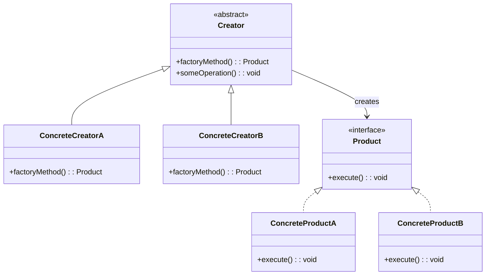

# Factory Method Pattern

The Factory Method pattern defines an interface for creating an object but lets subclasses decide which class to instantiate. It promotes loose coupling by eliminating the need to bind application-specific classes into the creation code, deferring instantiation to specialized factory subclasses.

## Intent

Provide a creation interface in a superclass while allowing subclasses to alter the type of objects created. This is essential when a class cannot anticipate the exact type of object it needs, or when you want to localize the knowledge of which class to instantiate.

## Class Diagram



## Key Characteristics

- Decouples client code from concrete product classes
- Each new product type requires only a new creator subclass — follows Open/Closed Principle
- Useful when the creation logic is complex or depends on runtime configuration
- Can be combined with a registry or configuration to select creators dynamically
- Adds indirection; avoid when a simple constructor suffices

---

## Example 1: Fintech — Payment Processor Creator (Stripe/PayPal/Wire)

**Problem:** A fintech checkout service must support multiple payment processors — Stripe for card payments, PayPal for wallet transactions, and wire transfers for high-value B2B orders. Hard-coding processor selection into checkout logic makes adding new processors (e.g., crypto) a risky, cross-cutting change.

**Solution:** A `PaymentProcessorFactory` declares the factory method. Each subclass — `StripeProcessorFactory`, `PayPalProcessorFactory`, `WireTransferFactory` — instantiates the corresponding processor. The checkout service depends only on the abstract factory and product interfaces.

```python
from abc import ABC, abstractmethod

class PaymentProcessor(ABC):
    @abstractmethod
    def charge(self, amount_cents: int, currency: str) -> str: ...

class StripeProcessor(PaymentProcessor):
    def charge(self, amount_cents: int, currency: str) -> str:
        return f"Stripe charged {amount_cents} {currency} via card tokenization"

class PayPalProcessor(PaymentProcessor):
    def charge(self, amount_cents: int, currency: str) -> str:
        return f"PayPal charged {amount_cents} {currency} via wallet redirect"

class WireTransferProcessor(PaymentProcessor):
    def charge(self, amount_cents: int, currency: str) -> str:
        return f"Wire transferred {amount_cents} {currency} via SWIFT"

class ProcessorFactory(ABC):
    @abstractmethod
    def create_processor(self) -> PaymentProcessor: ...

class StripeFactory(ProcessorFactory):
    def create_processor(self) -> PaymentProcessor:
        return StripeProcessor()

class PayPalFactory(ProcessorFactory):
    def create_processor(self) -> PaymentProcessor:
        return PayPalProcessor()

processor = StripeFactory().create_processor()
print(processor.charge(5000, "USD"))
```

```go
package main

import "fmt"

type PaymentProcessor interface {
	Charge(amountCents int, currency string) string
}

type StripeProcessor struct{}

func (s StripeProcessor) Charge(amountCents int, currency string) string {
	return fmt.Sprintf("Stripe charged %d %s via card tokenization", amountCents, currency)
}

type PayPalProcessor struct{}

func (p PayPalProcessor) Charge(amountCents int, currency string) string {
	return fmt.Sprintf("PayPal charged %d %s via wallet redirect", amountCents, currency)
}

type ProcessorFactory interface {
	CreateProcessor() PaymentProcessor
}

type StripeFactory struct{}

func (sf StripeFactory) CreateProcessor() PaymentProcessor { return StripeProcessor{} }

type PayPalFactory struct{}

func (pf PayPalFactory) CreateProcessor() PaymentProcessor { return PayPalProcessor{} }

func main() {
	var factory ProcessorFactory = StripeFactory{}
	p := factory.CreateProcessor()
	fmt.Println(p.Charge(5000, "USD"))
}
```

```java
interface PaymentProcessor {
    String charge(int amountCents, String currency);
}

class StripeProcessor implements PaymentProcessor {
    public String charge(int amountCents, String currency) {
        return "Stripe charged " + amountCents + " " + currency + " via card tokenization";
    }
}

class PayPalProcessor implements PaymentProcessor {
    public String charge(int amountCents, String currency) {
        return "PayPal charged " + amountCents + " " + currency + " via wallet redirect";
    }
}

abstract class ProcessorFactory {
    abstract PaymentProcessor createProcessor();
}

class StripeFactory extends ProcessorFactory {
    PaymentProcessor createProcessor() { return new StripeProcessor(); }
}

class PayPalFactory extends ProcessorFactory {
    PaymentProcessor createProcessor() { return new PayPalProcessor(); }
}
```

```typescript
interface PaymentProcessor {
  charge(amountCents: number, currency: string): string;
}

class StripeProcessor implements PaymentProcessor {
  charge(amountCents: number, currency: string): string {
    return `Stripe charged ${amountCents} ${currency} via card tokenization`;
  }
}

class PayPalProcessor implements PaymentProcessor {
  charge(amountCents: number, currency: string): string {
    return `PayPal charged ${amountCents} ${currency} via wallet redirect`;
  }
}

abstract class ProcessorFactory {
  abstract createProcessor(): PaymentProcessor;
}

class StripeFactory extends ProcessorFactory {
  createProcessor(): PaymentProcessor {
    return new StripeProcessor();
  }
}

const factory: ProcessorFactory = new StripeFactory();
console.log(factory.createProcessor().charge(5000, "USD"));
```

```rust
trait PaymentProcessor {
    fn charge(&self, amount_cents: u64, currency: &str) -> String;
}

struct StripeProcessor;
impl PaymentProcessor for StripeProcessor {
    fn charge(&self, amount_cents: u64, currency: &str) -> String {
        format!("Stripe charged {} {} via card tokenization", amount_cents, currency)
    }
}

struct PayPalProcessor;
impl PaymentProcessor for PayPalProcessor {
    fn charge(&self, amount_cents: u64, currency: &str) -> String {
        format!("PayPal charged {} {} via wallet redirect", amount_cents, currency)
    }
}

trait ProcessorFactory {
    fn create_processor(&self) -> Box<dyn PaymentProcessor>;
}

struct StripeFactory;
impl ProcessorFactory for StripeFactory {
    fn create_processor(&self) -> Box<dyn PaymentProcessor> { Box::new(StripeProcessor) }
}

fn main() {
    let factory: Box<dyn ProcessorFactory> = Box::new(StripeFactory);
    println!("{}", factory.create_processor().charge(5000, "USD"));
}
```

---

## Example 2: Healthcare — Medical Report Generator (Lab/Radiology/Pathology)

**Problem:** A hospital information system generates reports for lab results, radiology imaging, and pathology analysis. Each report type has a different structure, required fields, and regulatory format (HL7 CDA for labs, DICOM SR for radiology). Embedding all report-creation logic in one class violates single responsibility and makes compliance updates risky.

**Solution:** A `MedicalReportFactory` declares `createReport()`. Subclasses `LabReportFactory`, `RadiologyReportFactory`, and `PathologyReportFactory` each produce the correct report type with its required sections and compliance format.

```python
from abc import ABC, abstractmethod

class MedicalReport(ABC):
    @abstractmethod
    def generate(self, patient_id: str) -> str: ...

class LabReport(MedicalReport):
    def generate(self, patient_id: str) -> str:
        return f"HL7 CDA Lab Report for {patient_id}: CBC, BMP, Lipid Panel"

class RadiologyReport(MedicalReport):
    def generate(self, patient_id: str) -> str:
        return f"DICOM SR Radiology Report for {patient_id}: CT Chest Findings"

class PathologyReport(MedicalReport):
    def generate(self, patient_id: str) -> str:
        return f"CAP Synoptic Pathology Report for {patient_id}: Biopsy Results"

class ReportFactory(ABC):
    @abstractmethod
    def create_report(self) -> MedicalReport: ...

class LabReportFactory(ReportFactory):
    def create_report(self) -> MedicalReport:
        return LabReport()

class RadiologyReportFactory(ReportFactory):
    def create_report(self) -> MedicalReport:
        return RadiologyReport()

report = RadiologyReportFactory().create_report()
print(report.generate("PAT-00291"))
```

```go
package main

import "fmt"

type MedicalReport interface {
	Generate(patientID string) string
}

type LabReport struct{}

func (l LabReport) Generate(patientID string) string {
	return fmt.Sprintf("HL7 CDA Lab Report for %s: CBC, BMP, Lipid Panel", patientID)
}

type RadiologyReport struct{}

func (r RadiologyReport) Generate(patientID string) string {
	return fmt.Sprintf("DICOM SR Radiology Report for %s: CT Chest Findings", patientID)
}

type ReportFactory interface {
	CreateReport() MedicalReport
}

type LabReportFactory struct{}

func (lf LabReportFactory) CreateReport() MedicalReport { return LabReport{} }

type RadiologyReportFactory struct{}

func (rf RadiologyReportFactory) CreateReport() MedicalReport { return RadiologyReport{} }

func main() {
	var factory ReportFactory = RadiologyReportFactory{}
	fmt.Println(factory.CreateReport().Generate("PAT-00291"))
}
```

```java
interface MedicalReport {
    String generate(String patientId);
}

class LabReport implements MedicalReport {
    public String generate(String patientId) {
        return "HL7 CDA Lab Report for " + patientId + ": CBC, BMP, Lipid Panel";
    }
}

class RadiologyReport implements MedicalReport {
    public String generate(String patientId) {
        return "DICOM SR Radiology Report for " + patientId + ": CT Chest Findings";
    }
}

abstract class ReportFactory {
    abstract MedicalReport createReport();
}

class LabReportFactory extends ReportFactory {
    MedicalReport createReport() { return new LabReport(); }
}

class RadiologyReportFactory extends ReportFactory {
    MedicalReport createReport() { return new RadiologyReport(); }
}
```

```typescript
interface MedicalReport {
  generate(patientId: string): string;
}

class LabReport implements MedicalReport {
  generate(patientId: string): string {
    return `HL7 CDA Lab Report for ${patientId}: CBC, BMP, Lipid Panel`;
  }
}

class RadiologyReport implements MedicalReport {
  generate(patientId: string): string {
    return `DICOM SR Radiology Report for ${patientId}: CT Chest Findings`;
  }
}

abstract class ReportFactory {
  abstract createReport(): MedicalReport;
}

class RadiologyReportFactory extends ReportFactory {
  createReport(): MedicalReport {
    return new RadiologyReport();
  }
}

const report = new RadiologyReportFactory().createReport();
console.log(report.generate("PAT-00291"));
```

```rust
trait MedicalReport {
    fn generate(&self, patient_id: &str) -> String;
}

struct LabReport;
impl MedicalReport for LabReport {
    fn generate(&self, patient_id: &str) -> String {
        format!("HL7 CDA Lab Report for {}: CBC, BMP, Lipid Panel", patient_id)
    }
}

struct RadiologyReport;
impl MedicalReport for RadiologyReport {
    fn generate(&self, patient_id: &str) -> String {
        format!("DICOM SR Radiology Report for {}: CT Chest Findings", patient_id)
    }
}

trait ReportFactory {
    fn create_report(&self) -> Box<dyn MedicalReport>;
}

struct RadiologyReportFactory;
impl ReportFactory for RadiologyReportFactory {
    fn create_report(&self) -> Box<dyn MedicalReport> {
        Box::new(RadiologyReport)
    }
}

fn main() {
    let factory: Box<dyn ReportFactory> = Box::new(RadiologyReportFactory);
    println!("{}", factory.create_report().generate("PAT-00291"));
}
```

---

## Example 3: E-Commerce — Notification Channel Factory (Email/SMS/Push)

**Problem:** An e-commerce platform sends order confirmations, shipping updates, and promotional alerts through email, SMS, and push notifications. Each channel has a different API, payload format, and rate-limiting policy. Mixing channel logic into the notification service creates a maintenance nightmare as channels are added or retired.

**Solution:** A `NotificationChannelFactory` factory method returns the correct `NotificationChannel` implementation. Campaign configurations specify the channel type; the dispatcher calls the factory without knowing which concrete channel is used.

```python
from abc import ABC, abstractmethod

class NotificationChannel(ABC):
    @abstractmethod
    def send(self, recipient: str, message: str) -> str: ...

class EmailChannel(NotificationChannel):
    def send(self, recipient: str, message: str) -> str:
        return f"Email sent to {recipient} via SES: {message[:50]}"

class SMSChannel(NotificationChannel):
    def send(self, recipient: str, message: str) -> str:
        return f"SMS sent to {recipient} via Twilio: {message[:30]}"

class PushChannel(NotificationChannel):
    def send(self, recipient: str, message: str) -> str:
        return f"Push sent to {recipient} via FCM: {message[:40]}"

class ChannelFactory(ABC):
    @abstractmethod
    def create_channel(self) -> NotificationChannel: ...

class EmailChannelFactory(ChannelFactory):
    def create_channel(self) -> NotificationChannel:
        return EmailChannel()

class SMSChannelFactory(ChannelFactory):
    def create_channel(self) -> NotificationChannel:
        return SMSChannel()

channel = SMSChannelFactory().create_channel()
print(channel.send("+1555123456", "Your order #ORD-7821 has shipped"))
```

```go
package main

import "fmt"

type NotificationChannel interface {
	Send(recipient, message string) string
}

type EmailChannel struct{}

func (e EmailChannel) Send(recipient, message string) string {
	return fmt.Sprintf("Email sent to %s via SES: %s", recipient, message)
}

type SMSChannel struct{}

func (s SMSChannel) Send(recipient, message string) string {
	return fmt.Sprintf("SMS sent to %s via Twilio: %s", recipient, message)
}

type ChannelFactory interface {
	CreateChannel() NotificationChannel
}

type EmailChannelFactory struct{}

func (ef EmailChannelFactory) CreateChannel() NotificationChannel { return EmailChannel{} }

type SMSChannelFactory struct{}

func (sf SMSChannelFactory) CreateChannel() NotificationChannel { return SMSChannel{} }

func main() {
	var factory ChannelFactory = SMSChannelFactory{}
	ch := factory.CreateChannel()
	fmt.Println(ch.Send("+1555123456", "Your order #ORD-7821 has shipped"))
}
```

```java
interface NotificationChannel {
    String send(String recipient, String message);
}

class EmailChannel implements NotificationChannel {
    public String send(String recipient, String message) {
        return "Email sent to " + recipient + " via SES: " + message;
    }
}

class SMSChannel implements NotificationChannel {
    public String send(String recipient, String message) {
        return "SMS sent to " + recipient + " via Twilio: " + message;
    }
}

abstract class ChannelFactory {
    abstract NotificationChannel createChannel();
}

class SMSChannelFactory extends ChannelFactory {
    NotificationChannel createChannel() { return new SMSChannel(); }
}

class EmailChannelFactory extends ChannelFactory {
    NotificationChannel createChannel() { return new EmailChannel(); }
}
```

```typescript
interface NotificationChannel {
  send(recipient: string, message: string): string;
}

class EmailChannel implements NotificationChannel {
  send(recipient: string, message: string): string {
    return `Email sent to ${recipient} via SES: ${message}`;
  }
}

class SMSChannel implements NotificationChannel {
  send(recipient: string, message: string): string {
    return `SMS sent to ${recipient} via Twilio: ${message}`;
  }
}

abstract class ChannelFactory {
  abstract createChannel(): NotificationChannel;
}

class SMSChannelFactory extends ChannelFactory {
  createChannel(): NotificationChannel {
    return new SMSChannel();
  }
}

const ch = new SMSChannelFactory().createChannel();
console.log(ch.send("+1555123456", "Your order #ORD-7821 has shipped"));
```

```rust
trait NotificationChannel {
    fn send(&self, recipient: &str, message: &str) -> String;
}

struct EmailChannel;
impl NotificationChannel for EmailChannel {
    fn send(&self, recipient: &str, message: &str) -> String {
        format!("Email sent to {} via SES: {}", recipient, message)
    }
}

struct SMSChannel;
impl NotificationChannel for SMSChannel {
    fn send(&self, recipient: &str, message: &str) -> String {
        format!("SMS sent to {} via Twilio: {}", recipient, message)
    }
}

trait ChannelFactory {
    fn create_channel(&self) -> Box<dyn NotificationChannel>;
}

struct SMSChannelFactory;
impl ChannelFactory for SMSChannelFactory {
    fn create_channel(&self) -> Box<dyn NotificationChannel> {
        Box::new(SMSChannel)
    }
}

fn main() {
    let factory: Box<dyn ChannelFactory> = Box::new(SMSChannelFactory);
    let ch = factory.create_channel();
    println!("{}", ch.send("+1555123456", "Your order #ORD-7821 has shipped"));
}
```

---

## Example 4: Media Streaming — Content Encoder Factory (Video/Audio/Subtitle)

**Problem:** A media streaming platform must transcode uploaded content into multiple formats — H.264/HEVC for video, AAC/Opus for audio, and WebVTT/SRT for subtitles. Each encoder has different dependencies, hardware acceleration options, and output profiles. Coupling encoder selection into the transcoding pipeline makes it impossible to swap codecs without rewriting the orchestrator.

**Solution:** A `ContentEncoderFactory` factory method produces the correct `ContentEncoder`. The transcoding pipeline requests an encoder by calling the factory, remaining agnostic to which codec library is used underneath.

```python
from abc import ABC, abstractmethod

class ContentEncoder(ABC):
    @abstractmethod
    def encode(self, source_path: str, profile: str) -> str: ...

class VideoEncoder(ContentEncoder):
    def encode(self, source_path: str, profile: str) -> str:
        return f"H.264 encoding {source_path} at {profile} profile"

class AudioEncoder(ContentEncoder):
    def encode(self, source_path: str, profile: str) -> str:
        return f"AAC encoding {source_path} at {profile} bitrate"

class SubtitleEncoder(ContentEncoder):
    def encode(self, source_path: str, profile: str) -> str:
        return f"WebVTT converting {source_path} with {profile} timing"

class EncoderFactory(ABC):
    @abstractmethod
    def create_encoder(self) -> ContentEncoder: ...

class VideoEncoderFactory(EncoderFactory):
    def create_encoder(self) -> ContentEncoder:
        return VideoEncoder()

class AudioEncoderFactory(EncoderFactory):
    def create_encoder(self) -> ContentEncoder:
        return AudioEncoder()

encoder = VideoEncoderFactory().create_encoder()
print(encoder.encode("/ingest/movie_4k.mp4", "high"))
```

```go
package main

import "fmt"

type ContentEncoder interface {
	Encode(sourcePath, profile string) string
}

type VideoEncoder struct{}

func (v VideoEncoder) Encode(sourcePath, profile string) string {
	return fmt.Sprintf("H.264 encoding %s at %s profile", sourcePath, profile)
}

type AudioEncoder struct{}

func (a AudioEncoder) Encode(sourcePath, profile string) string {
	return fmt.Sprintf("AAC encoding %s at %s bitrate", sourcePath, profile)
}

type EncoderFactory interface {
	CreateEncoder() ContentEncoder
}

type VideoEncoderFactory struct{}

func (vf VideoEncoderFactory) CreateEncoder() ContentEncoder { return VideoEncoder{} }

type AudioEncoderFactory struct{}

func (af AudioEncoderFactory) CreateEncoder() ContentEncoder { return AudioEncoder{} }

func main() {
	var factory EncoderFactory = VideoEncoderFactory{}
	fmt.Println(factory.CreateEncoder().Encode("/ingest/movie_4k.mp4", "high"))
}
```

```java
interface ContentEncoder {
    String encode(String sourcePath, String profile);
}

class VideoEncoder implements ContentEncoder {
    public String encode(String sourcePath, String profile) {
        return "H.264 encoding " + sourcePath + " at " + profile + " profile";
    }
}

class AudioEncoder implements ContentEncoder {
    public String encode(String sourcePath, String profile) {
        return "AAC encoding " + sourcePath + " at " + profile + " bitrate";
    }
}

abstract class EncoderFactory {
    abstract ContentEncoder createEncoder();
}

class VideoEncoderFactory extends EncoderFactory {
    ContentEncoder createEncoder() { return new VideoEncoder(); }
}

class AudioEncoderFactory extends EncoderFactory {
    ContentEncoder createEncoder() { return new AudioEncoder(); }
}
```

```typescript
interface ContentEncoder {
  encode(sourcePath: string, profile: string): string;
}

class VideoEncoder implements ContentEncoder {
  encode(sourcePath: string, profile: string): string {
    return `H.264 encoding ${sourcePath} at ${profile} profile`;
  }
}

class AudioEncoder implements ContentEncoder {
  encode(sourcePath: string, profile: string): string {
    return `AAC encoding ${sourcePath} at ${profile} bitrate`;
  }
}

abstract class EncoderFactory {
  abstract createEncoder(): ContentEncoder;
}

class VideoEncoderFactory extends EncoderFactory {
  createEncoder(): ContentEncoder {
    return new VideoEncoder();
  }
}

const enc = new VideoEncoderFactory().createEncoder();
console.log(enc.encode("/ingest/movie_4k.mp4", "high"));
```

```rust
trait ContentEncoder {
    fn encode(&self, source_path: &str, profile: &str) -> String;
}

struct VideoEncoder;
impl ContentEncoder for VideoEncoder {
    fn encode(&self, source_path: &str, profile: &str) -> String {
        format!("H.264 encoding {} at {} profile", source_path, profile)
    }
}

struct AudioEncoder;
impl ContentEncoder for AudioEncoder {
    fn encode(&self, source_path: &str, profile: &str) -> String {
        format!("AAC encoding {} at {} bitrate", source_path, profile)
    }
}

trait EncoderFactory {
    fn create_encoder(&self) -> Box<dyn ContentEncoder>;
}

struct VideoEncoderFactory;
impl EncoderFactory for VideoEncoderFactory {
    fn create_encoder(&self) -> Box<dyn ContentEncoder> {
        Box::new(VideoEncoder)
    }
}

fn main() {
    let factory: Box<dyn EncoderFactory> = Box::new(VideoEncoderFactory);
    println!("{}", factory.create_encoder().encode("/ingest/movie_4k.mp4", "high"));
}
```

---

## Example 5: Logistics — Shipment Handler Creator (Air/Sea/Ground)

**Problem:** A logistics platform routes parcels through different carriers depending on delivery speed, weight, and destination. Air freight has customs declarations, sea freight requires container manifests, and ground shipping needs route optimization. A monolithic shipment handler becomes untestable and brittle as carrier-specific rules multiply.

**Solution:** A `ShipmentHandlerFactory` factory method creates the correct `ShipmentHandler`. The dispatch service selects the factory based on shipment attributes; each handler encapsulates its carrier-specific logic.

```python
from abc import ABC, abstractmethod

class ShipmentHandler(ABC):
    @abstractmethod
    def process(self, tracking_id: str, weight_kg: float) -> str: ...

class AirFreightHandler(ShipmentHandler):
    def process(self, tracking_id: str, weight_kg: float) -> str:
        return f"Air freight {tracking_id}: {weight_kg}kg, customs declaration filed"

class SeaFreightHandler(ShipmentHandler):
    def process(self, tracking_id: str, weight_kg: float) -> str:
        return f"Sea freight {tracking_id}: {weight_kg}kg, container manifest created"

class GroundShipmentHandler(ShipmentHandler):
    def process(self, tracking_id: str, weight_kg: float) -> str:
        return f"Ground shipment {tracking_id}: {weight_kg}kg, route optimized"

class ShipmentFactory(ABC):
    @abstractmethod
    def create_handler(self) -> ShipmentHandler: ...

class AirFreightFactory(ShipmentFactory):
    def create_handler(self) -> ShipmentHandler:
        return AirFreightHandler()

class SeaFreightFactory(ShipmentFactory):
    def create_handler(self) -> ShipmentHandler:
        return SeaFreightHandler()

handler = AirFreightFactory().create_handler()
print(handler.process("SHP-99201", 24.5))
```

```go
package main

import "fmt"

type ShipmentHandler interface {
	Process(trackingID string, weightKg float64) string
}

type AirFreightHandler struct{}

func (a AirFreightHandler) Process(trackingID string, weightKg float64) string {
	return fmt.Sprintf("Air freight %s: %.1fkg, customs declaration filed", trackingID, weightKg)
}

type SeaFreightHandler struct{}

func (s SeaFreightHandler) Process(trackingID string, weightKg float64) string {
	return fmt.Sprintf("Sea freight %s: %.1fkg, container manifest created", trackingID, weightKg)
}

type ShipmentFactory interface {
	CreateHandler() ShipmentHandler
}

type AirFreightFactory struct{}

func (af AirFreightFactory) CreateHandler() ShipmentHandler { return AirFreightHandler{} }

type SeaFreightFactory struct{}

func (sf SeaFreightFactory) CreateHandler() ShipmentHandler { return SeaFreightHandler{} }

func main() {
	var factory ShipmentFactory = AirFreightFactory{}
	fmt.Println(factory.CreateHandler().Process("SHP-99201", 24.5))
}
```

```java
interface ShipmentHandler {
    String process(String trackingId, double weightKg);
}

class AirFreightHandler implements ShipmentHandler {
    public String process(String trackingId, double weightKg) {
        return "Air freight " + trackingId + ": " + weightKg + "kg, customs declaration filed";
    }
}

class SeaFreightHandler implements ShipmentHandler {
    public String process(String trackingId, double weightKg) {
        return "Sea freight " + trackingId + ": " + weightKg + "kg, container manifest created";
    }
}

abstract class ShipmentFactory {
    abstract ShipmentHandler createHandler();
}

class AirFreightFactory extends ShipmentFactory {
    ShipmentHandler createHandler() { return new AirFreightHandler(); }
}

class SeaFreightFactory extends ShipmentFactory {
    ShipmentHandler createHandler() { return new SeaFreightHandler(); }
}
```

```typescript
interface ShipmentHandler {
  process(trackingId: string, weightKg: number): string;
}

class AirFreightHandler implements ShipmentHandler {
  process(trackingId: string, weightKg: number): string {
    return `Air freight ${trackingId}: ${weightKg}kg, customs declaration filed`;
  }
}

class SeaFreightHandler implements ShipmentHandler {
  process(trackingId: string, weightKg: number): string {
    return `Sea freight ${trackingId}: ${weightKg}kg, container manifest created`;
  }
}

abstract class ShipmentFactory {
  abstract createHandler(): ShipmentHandler;
}

class AirFreightFactory extends ShipmentFactory {
  createHandler(): ShipmentHandler {
    return new AirFreightHandler();
  }
}

const handler = new AirFreightFactory().createHandler();
console.log(handler.process("SHP-99201", 24.5));
```

```rust
trait ShipmentHandler {
    fn process(&self, tracking_id: &str, weight_kg: f64) -> String;
}

struct AirFreightHandler;
impl ShipmentHandler for AirFreightHandler {
    fn process(&self, tracking_id: &str, weight_kg: f64) -> String {
        format!("Air freight {}: {:.1}kg, customs declaration filed", tracking_id, weight_kg)
    }
}

struct SeaFreightHandler;
impl ShipmentHandler for SeaFreightHandler {
    fn process(&self, tracking_id: &str, weight_kg: f64) -> String {
        format!("Sea freight {}: {:.1}kg, container manifest created", tracking_id, weight_kg)
    }
}

trait ShipmentFactory {
    fn create_handler(&self) -> Box<dyn ShipmentHandler>;
}

struct AirFreightFactory;
impl ShipmentFactory for AirFreightFactory {
    fn create_handler(&self) -> Box<dyn ShipmentHandler> { Box::new(AirFreightHandler) }
}

fn main() {
    let factory: Box<dyn ShipmentFactory> = Box::new(AirFreightFactory);
    println!("{}", factory.create_handler().process("SHP-99201", 24.5));
}
```

---

## Summary

| Aspect               | Details                                                                                                                                                                 |
| -------------------- | ----------------------------------------------------------------------------------------------------------------------------------------------------------------------- |
| **Pattern Type**     | Creational                                                                                                                                                              |
| **Key Benefit**      | Decouples object creation from usage — new product types require only a new factory subclass, not changes to client code                                                |
| **Common Pitfall**   | Over-engineering with factories when a simple constructor or configuration map would suffice; every new type adds a class pair                                          |
| **Related Patterns** | Abstract Factory (families of related products), Template Method (factory method is a specialization), Prototype (alternative when cloning is cheaper than subclassing) |
