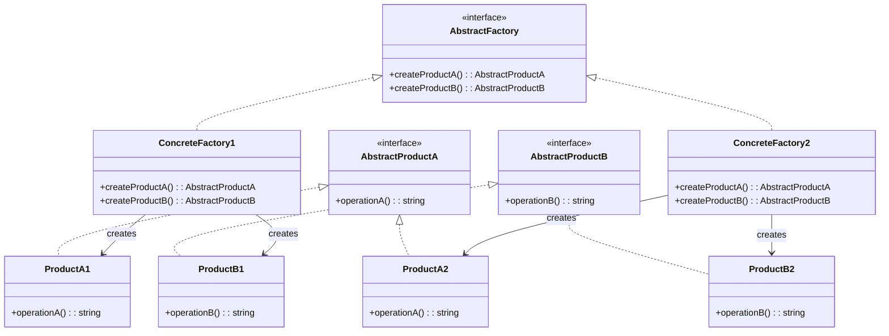

# Abstract Factory Pattern

The Abstract Factory pattern provides an interface for creating families of related or dependent objects without specifying their concrete classes. It is one level of abstraction above the Factory Method — instead of producing a single product, it produces an entire suite of products that are designed to work together.

## Intent

Create families of related objects (e.g., UI components that match a theme, or compliance documents for a specific jurisdiction) without coupling client code to concrete implementations. When a system must be configured with one of several families of products, Abstract Factory ensures consistency within a family.

## Class Diagram



## Key Characteristics

- Ensures that products from one family are used together — prevents mixing incompatible components
- Adding a new product family is straightforward (new concrete factory)
- Adding a new product type to all families requires changing every factory — a trade-off
- Client code depends only on abstract interfaces, improving testability
- Often combined with Singleton (one factory instance per family) and Factory Method (each creation method is a factory method)

---

## Example 1: Fintech — Cross-Region Compliance Document Factory

**Problem:** A global fintech platform must produce compliance documents — KYC verification forms, transaction audit reports, and tax withholding certificates — that differ structurally by regulatory region (US SEC, EU MiFID, APAC MAS). Mixing a US KYC form with an EU audit report in the same customer file triggers regulatory violations.

**Solution:** An `AbstractComplianceFactory` declares methods to create a KYC form, an audit report, and a tax certificate. `USComplianceFactory`, `EUComplianceFactory`, and `APACComplianceFactory` each produce the region-correct set of documents, guaranteeing they are always used together.

```python
from abc import ABC, abstractmethod

class KYCForm(ABC):
    @abstractmethod
    def render(self, customer_id: str) -> str: ...

class AuditReport(ABC):
    @abstractmethod
    def render(self, tx_id: str) -> str: ...

class USKYCForm(KYCForm):
    def render(self, customer_id: str) -> str:
        return f"US SEC KYC (W-9) for {customer_id}"

class USAuditReport(AuditReport):
    def render(self, tx_id: str) -> str:
        return f"US SOX audit report for tx {tx_id}"

class EUKYCForm(KYCForm):
    def render(self, customer_id: str) -> str:
        return f"EU MiFID KYC (GDPR-compliant) for {customer_id}"

class EUAuditReport(AuditReport):
    def render(self, tx_id: str) -> str:
        return f"EU MiFID II audit report for tx {tx_id}"

class ComplianceFactory(ABC):
    @abstractmethod
    def create_kyc_form(self) -> KYCForm: ...
    @abstractmethod
    def create_audit_report(self) -> AuditReport: ...

class USComplianceFactory(ComplianceFactory):
    def create_kyc_form(self) -> KYCForm: return USKYCForm()
    def create_audit_report(self) -> AuditReport: return USAuditReport()

class EUComplianceFactory(ComplianceFactory):
    def create_kyc_form(self) -> KYCForm: return EUKYCForm()
    def create_audit_report(self) -> AuditReport: return EUAuditReport()

factory: ComplianceFactory = EUComplianceFactory()
print(factory.create_kyc_form().render("CUST-4421"))
print(factory.create_audit_report().render("TX-88210"))
```

```go
package main

import "fmt"

type KYCForm interface{ Render(customerID string) string }
type AuditReport interface{ Render(txID string) string }

type EUKYCForm struct{}
func (e EUKYCForm) Render(id string) string { return fmt.Sprintf("EU MiFID KYC for %s", id) }

type EUAuditReport struct{}
func (e EUAuditReport) Render(tx string) string { return fmt.Sprintf("EU MiFID II audit for tx %s", tx) }

type USKYCForm struct{}
func (u USKYCForm) Render(id string) string { return fmt.Sprintf("US SEC KYC (W-9) for %s", id) }

type USAuditReport struct{}
func (u USAuditReport) Render(tx string) string { return fmt.Sprintf("US SOX audit for tx %s", tx) }

type ComplianceFactory interface {
	CreateKYCForm() KYCForm
	CreateAuditReport() AuditReport
}

type EUComplianceFactory struct{}
func (f EUComplianceFactory) CreateKYCForm() KYCForm       { return EUKYCForm{} }
func (f EUComplianceFactory) CreateAuditReport() AuditReport { return EUAuditReport{} }

func main() {
	var factory ComplianceFactory = EUComplianceFactory{}
	fmt.Println(factory.CreateKYCForm().Render("CUST-4421"))
	fmt.Println(factory.CreateAuditReport().Render("TX-88210"))
}
```

```java
interface KYCForm { String render(String customerId); }
interface AuditReport { String render(String txId); }

class EUKYCForm implements KYCForm {
    public String render(String id) { return "EU MiFID KYC for " + id; }
}
class EUAuditReport implements AuditReport {
    public String render(String tx) { return "EU MiFID II audit for tx " + tx; }
}
class USKYCForm implements KYCForm {
    public String render(String id) { return "US SEC KYC (W-9) for " + id; }
}
class USAuditReport implements AuditReport {
    public String render(String tx) { return "US SOX audit for tx " + tx; }
}

interface ComplianceFactory {
    KYCForm createKYCForm();
    AuditReport createAuditReport();
}

class EUComplianceFactory implements ComplianceFactory {
    public KYCForm createKYCForm() { return new EUKYCForm(); }
    public AuditReport createAuditReport() { return new EUAuditReport(); }
}

class USComplianceFactory implements ComplianceFactory {
    public KYCForm createKYCForm() { return new USKYCForm(); }
    public AuditReport createAuditReport() { return new USAuditReport(); }
}
```

```typescript
interface KYCForm {
  render(customerId: string): string;
}
interface AuditReport {
  render(txId: string): string;
}

class EUKYCForm implements KYCForm {
  render(id: string) {
    return `EU MiFID KYC for ${id}`;
  }
}
class EUAuditReport implements AuditReport {
  render(tx: string) {
    return `EU MiFID II audit for tx ${tx}`;
  }
}
class USKYCForm implements KYCForm {
  render(id: string) {
    return `US SEC KYC (W-9) for ${id}`;
  }
}
class USAuditReport implements AuditReport {
  render(tx: string) {
    return `US SOX audit for tx ${tx}`;
  }
}

interface ComplianceFactory {
  createKYCForm(): KYCForm;
  createAuditReport(): AuditReport;
}

class EUComplianceFactory implements ComplianceFactory {
  createKYCForm(): KYCForm {
    return new EUKYCForm();
  }
  createAuditReport(): AuditReport {
    return new EUAuditReport();
  }
}

const factory: ComplianceFactory = new EUComplianceFactory();
console.log(factory.createKYCForm().render("CUST-4421"));
console.log(factory.createAuditReport().render("TX-88210"));
```

```rust
trait KYCForm { fn render(&self, customer_id: &str) -> String; }
trait AuditReport { fn render(&self, tx_id: &str) -> String; }

struct EUKYCForm;
impl KYCForm for EUKYCForm {
    fn render(&self, id: &str) -> String { format!("EU MiFID KYC for {}", id) }
}
struct EUAuditReport;
impl AuditReport for EUAuditReport {
    fn render(&self, tx: &str) -> String { format!("EU MiFID II audit for tx {}", tx) }
}

struct USKYCForm;
impl KYCForm for USKYCForm {
    fn render(&self, id: &str) -> String { format!("US SEC KYC (W-9) for {}", id) }
}

trait ComplianceFactory {
    fn create_kyc_form(&self) -> Box<dyn KYCForm>;
    fn create_audit_report(&self) -> Box<dyn AuditReport>;
}

struct EUComplianceFactory;
impl ComplianceFactory for EUComplianceFactory {
    fn create_kyc_form(&self) -> Box<dyn KYCForm> { Box::new(EUKYCForm) }
    fn create_audit_report(&self) -> Box<dyn AuditReport> { Box::new(EUAuditReport) }
}

fn main() {
    let factory: Box<dyn ComplianceFactory> = Box::new(EUComplianceFactory);
    println!("{}", factory.create_kyc_form().render("CUST-4421"));
    println!("{}", factory.create_audit_report().render("TX-88210"));
}
```

---

## Example 2: Healthcare — Platform-Specific Medical Device Interface Factory

**Problem:** A telemedicine application integrates with medical devices (blood pressure monitors, pulse oximeters, glucose meters) across iOS (HealthKit), Android (Google Health Connect), and desktop (USB HID). Each platform has different APIs and data formats for the same device categories. Mixing iOS Bluetooth calls with Android Health Connect APIs would crash the application.

**Solution:** A `MedicalDeviceFactory` creates platform-matched peripherals. `IOSDeviceFactory` uses HealthKit, `AndroidDeviceFactory` uses Health Connect, and `DesktopDeviceFactory` uses USB HID — ensuring all device interfaces on a platform are mutually compatible.

```python
from abc import ABC, abstractmethod

class BloodPressureMonitor(ABC):
    @abstractmethod
    def read_systolic(self) -> str: ...

class PulseOximeter(ABC):
    @abstractmethod
    def read_spo2(self) -> str: ...

class IOSBloodPressure(BloodPressureMonitor):
    def read_systolic(self) -> str:
        return "HealthKit BLE: systolic 120 mmHg"

class IOSPulseOximeter(PulseOximeter):
    def read_spo2(self) -> str:
        return "HealthKit BLE: SpO2 98%"

class AndroidBloodPressure(BloodPressureMonitor):
    def read_systolic(self) -> str:
        return "Health Connect: systolic 118 mmHg"

class AndroidPulseOximeter(PulseOximeter):
    def read_spo2(self) -> str:
        return "Health Connect: SpO2 97%"

class MedicalDeviceFactory(ABC):
    @abstractmethod
    def create_bp_monitor(self) -> BloodPressureMonitor: ...
    @abstractmethod
    def create_oximeter(self) -> PulseOximeter: ...

class IOSDeviceFactory(MedicalDeviceFactory):
    def create_bp_monitor(self) -> BloodPressureMonitor: return IOSBloodPressure()
    def create_oximeter(self) -> PulseOximeter: return IOSPulseOximeter()

class AndroidDeviceFactory(MedicalDeviceFactory):
    def create_bp_monitor(self) -> BloodPressureMonitor: return AndroidBloodPressure()
    def create_oximeter(self) -> PulseOximeter: return AndroidPulseOximeter()

factory: MedicalDeviceFactory = IOSDeviceFactory()
print(factory.create_bp_monitor().read_systolic())
print(factory.create_oximeter().read_spo2())
```

```go
package main

import "fmt"

type BloodPressureMonitor interface{ ReadSystolic() string }
type PulseOximeter interface{ ReadSpO2() string }

type IOSBloodPressure struct{}
func (i IOSBloodPressure) ReadSystolic() string { return "HealthKit BLE: systolic 120 mmHg" }

type IOSPulseOximeter struct{}
func (i IOSPulseOximeter) ReadSpO2() string { return "HealthKit BLE: SpO2 98%" }

type AndroidBloodPressure struct{}
func (a AndroidBloodPressure) ReadSystolic() string { return "Health Connect: systolic 118 mmHg" }

type AndroidPulseOximeter struct{}
func (a AndroidPulseOximeter) ReadSpO2() string { return "Health Connect: SpO2 97%" }

type MedicalDeviceFactory interface {
	CreateBPMonitor() BloodPressureMonitor
	CreateOximeter() PulseOximeter
}

type IOSDeviceFactory struct{}
func (f IOSDeviceFactory) CreateBPMonitor() BloodPressureMonitor { return IOSBloodPressure{} }
func (f IOSDeviceFactory) CreateOximeter() PulseOximeter         { return IOSPulseOximeter{} }

func main() {
	var factory MedicalDeviceFactory = IOSDeviceFactory{}
	fmt.Println(factory.CreateBPMonitor().ReadSystolic())
	fmt.Println(factory.CreateOximeter().ReadSpO2())
}
```

```java
interface BloodPressureMonitor { String readSystolic(); }
interface PulseOximeter { String readSpO2(); }

class IOSBloodPressure implements BloodPressureMonitor {
    public String readSystolic() { return "HealthKit BLE: systolic 120 mmHg"; }
}
class IOSPulseOximeter implements PulseOximeter {
    public String readSpO2() { return "HealthKit BLE: SpO2 98%"; }
}
class AndroidBloodPressure implements BloodPressureMonitor {
    public String readSystolic() { return "Health Connect: systolic 118 mmHg"; }
}
class AndroidPulseOximeter implements PulseOximeter {
    public String readSpO2() { return "Health Connect: SpO2 97%"; }
}

interface MedicalDeviceFactory {
    BloodPressureMonitor createBPMonitor();
    PulseOximeter createOximeter();
}

class IOSDeviceFactory implements MedicalDeviceFactory {
    public BloodPressureMonitor createBPMonitor() { return new IOSBloodPressure(); }
    public PulseOximeter createOximeter() { return new IOSPulseOximeter(); }
}

class AndroidDeviceFactory implements MedicalDeviceFactory {
    public BloodPressureMonitor createBPMonitor() { return new AndroidBloodPressure(); }
    public PulseOximeter createOximeter() { return new AndroidPulseOximeter(); }
}
```

```typescript
interface BloodPressureMonitor {
  readSystolic(): string;
}
interface PulseOximeter {
  readSpO2(): string;
}

class IOSBloodPressure implements BloodPressureMonitor {
  readSystolic() {
    return "HealthKit BLE: systolic 120 mmHg";
  }
}
class IOSPulseOximeter implements PulseOximeter {
  readSpO2() {
    return "HealthKit BLE: SpO2 98%";
  }
}
class AndroidBloodPressure implements BloodPressureMonitor {
  readSystolic() {
    return "Health Connect: systolic 118 mmHg";
  }
}
class AndroidPulseOximeter implements PulseOximeter {
  readSpO2() {
    return "Health Connect: SpO2 97%";
  }
}

interface MedicalDeviceFactory {
  createBPMonitor(): BloodPressureMonitor;
  createOximeter(): PulseOximeter;
}

class IOSDeviceFactory implements MedicalDeviceFactory {
  createBPMonitor() {
    return new IOSBloodPressure();
  }
  createOximeter() {
    return new IOSPulseOximeter();
  }
}

const factory: MedicalDeviceFactory = new IOSDeviceFactory();
console.log(factory.createBPMonitor().readSystolic());
console.log(factory.createOximeter().readSpO2());
```

```rust
trait BloodPressureMonitor { fn read_systolic(&self) -> String; }
trait PulseOximeter { fn read_spo2(&self) -> String; }

struct IOSBloodPressure;
impl BloodPressureMonitor for IOSBloodPressure {
    fn read_systolic(&self) -> String { "HealthKit BLE: systolic 120 mmHg".into() }
}
struct IOSPulseOximeter;
impl PulseOximeter for IOSPulseOximeter {
    fn read_spo2(&self) -> String { "HealthKit BLE: SpO2 98%".into() }
}

struct AndroidBloodPressure;
impl BloodPressureMonitor for AndroidBloodPressure {
    fn read_systolic(&self) -> String { "Health Connect: systolic 118 mmHg".into() }
}

trait MedicalDeviceFactory {
    fn create_bp_monitor(&self) -> Box<dyn BloodPressureMonitor>;
    fn create_oximeter(&self) -> Box<dyn PulseOximeter>;
}

struct IOSDeviceFactory;
impl MedicalDeviceFactory for IOSDeviceFactory {
    fn create_bp_monitor(&self) -> Box<dyn BloodPressureMonitor> { Box::new(IOSBloodPressure) }
    fn create_oximeter(&self) -> Box<dyn PulseOximeter> { Box::new(IOSPulseOximeter) }
}

fn main() {
    let factory: Box<dyn MedicalDeviceFactory> = Box::new(IOSDeviceFactory);
    println!("{}", factory.create_bp_monitor().read_systolic());
    println!("{}", factory.create_oximeter().read_spo2());
}
```

---

## Example 3: E-Commerce — Regional Checkout Component Factory (US/EU/Asia)

**Problem:** An international e-commerce platform must render checkout UIs with region-specific components: US checkout shows ZIP code entry and USD pricing; EU checkout shows VAT breakdowns and SEPA payment options; Asia checkout shows local wallet integrations (Alipay, GrabPay) and different address formats. Mixing components from different regions causes tax calculation errors, payment failures, and legal non-compliance.

**Solution:** A `CheckoutComponentFactory` creates region-matched `AddressForm`, `PaymentWidget`, and `TaxCalculator`. The checkout page selects the factory based on the user's shipping region, and all components are guaranteed to be compatible.

```python
from abc import ABC, abstractmethod

class AddressForm(ABC):
    @abstractmethod
    def render(self) -> str: ...

class PaymentWidget(ABC):
    @abstractmethod
    def render(self) -> str: ...

class USAddressForm(AddressForm):
    def render(self) -> str: return "US: Street, City, State, ZIP"

class USPaymentWidget(PaymentWidget):
    def render(self) -> str: return "US: Visa/MC/AMEX card form (USD)"

class EUAddressForm(AddressForm):
    def render(self) -> str: return "EU: Street, City, Postal Code, Country (GDPR notice)"

class EUPaymentWidget(PaymentWidget):
    def render(self) -> str: return "EU: SEPA Direct Debit + Card (EUR, VAT included)"

class CheckoutFactory(ABC):
    @abstractmethod
    def create_address_form(self) -> AddressForm: ...
    @abstractmethod
    def create_payment_widget(self) -> PaymentWidget: ...

class USCheckoutFactory(CheckoutFactory):
    def create_address_form(self) -> AddressForm: return USAddressForm()
    def create_payment_widget(self) -> PaymentWidget: return USPaymentWidget()

class EUCheckoutFactory(CheckoutFactory):
    def create_address_form(self) -> AddressForm: return EUAddressForm()
    def create_payment_widget(self) -> PaymentWidget: return EUPaymentWidget()

factory: CheckoutFactory = EUCheckoutFactory()
print(factory.create_address_form().render())
print(factory.create_payment_widget().render())
```

```go
package main

import "fmt"

type AddressForm interface{ Render() string }
type PaymentWidget interface{ Render() string }

type EUAddressForm struct{}
func (e EUAddressForm) Render() string { return "EU: Street, City, Postal Code, Country" }

type EUPaymentWidget struct{}
func (e EUPaymentWidget) Render() string { return "EU: SEPA + Card (EUR, VAT included)" }

type USAddressForm struct{}
func (u USAddressForm) Render() string { return "US: Street, City, State, ZIP" }

type USPaymentWidget struct{}
func (u USPaymentWidget) Render() string { return "US: Visa/MC/AMEX (USD)" }

type CheckoutFactory interface {
	CreateAddressForm() AddressForm
	CreatePaymentWidget() PaymentWidget
}

type EUCheckoutFactory struct{}
func (f EUCheckoutFactory) CreateAddressForm() AddressForm   { return EUAddressForm{} }
func (f EUCheckoutFactory) CreatePaymentWidget() PaymentWidget { return EUPaymentWidget{} }

func main() {
	var factory CheckoutFactory = EUCheckoutFactory{}
	fmt.Println(factory.CreateAddressForm().Render())
	fmt.Println(factory.CreatePaymentWidget().Render())
}
```

```java
interface AddressForm { String render(); }
interface PaymentWidget { String render(); }

class EUAddressForm implements AddressForm {
    public String render() { return "EU: Street, City, Postal Code, Country"; }
}
class EUPaymentWidget implements PaymentWidget {
    public String render() { return "EU: SEPA + Card (EUR, VAT included)"; }
}
class USAddressForm implements AddressForm {
    public String render() { return "US: Street, City, State, ZIP"; }
}
class USPaymentWidget implements PaymentWidget {
    public String render() { return "US: Visa/MC/AMEX (USD)"; }
}

interface CheckoutFactory {
    AddressForm createAddressForm();
    PaymentWidget createPaymentWidget();
}

class EUCheckoutFactory implements CheckoutFactory {
    public AddressForm createAddressForm() { return new EUAddressForm(); }
    public PaymentWidget createPaymentWidget() { return new EUPaymentWidget(); }
}

class USCheckoutFactory implements CheckoutFactory {
    public AddressForm createAddressForm() { return new USAddressForm(); }
    public PaymentWidget createPaymentWidget() { return new USPaymentWidget(); }
}
```

```typescript
interface AddressForm {
  render(): string;
}
interface PaymentWidget {
  render(): string;
}

class EUAddressForm implements AddressForm {
  render() {
    return "EU: Street, City, Postal Code, Country";
  }
}
class EUPaymentWidget implements PaymentWidget {
  render() {
    return "EU: SEPA + Card (EUR, VAT included)";
  }
}
class USAddressForm implements AddressForm {
  render() {
    return "US: Street, City, State, ZIP";
  }
}
class USPaymentWidget implements PaymentWidget {
  render() {
    return "US: Visa/MC/AMEX (USD)";
  }
}

interface CheckoutFactory {
  createAddressForm(): AddressForm;
  createPaymentWidget(): PaymentWidget;
}

class EUCheckoutFactory implements CheckoutFactory {
  createAddressForm() {
    return new EUAddressForm();
  }
  createPaymentWidget() {
    return new EUPaymentWidget();
  }
}

const factory: CheckoutFactory = new EUCheckoutFactory();
console.log(factory.createAddressForm().render());
console.log(factory.createPaymentWidget().render());
```

```rust
trait AddressForm { fn render(&self) -> String; }
trait PaymentWidget { fn render(&self) -> String; }

struct EUAddressForm;
impl AddressForm for EUAddressForm {
    fn render(&self) -> String { "EU: Street, City, Postal Code, Country".into() }
}
struct EUPaymentWidget;
impl PaymentWidget for EUPaymentWidget {
    fn render(&self) -> String { "EU: SEPA + Card (EUR, VAT included)".into() }
}
struct USAddressForm;
impl AddressForm for USAddressForm {
    fn render(&self) -> String { "US: Street, City, State, ZIP".into() }
}

trait CheckoutFactory {
    fn create_address_form(&self) -> Box<dyn AddressForm>;
    fn create_payment_widget(&self) -> Box<dyn PaymentWidget>;
}

struct EUCheckoutFactory;
impl CheckoutFactory for EUCheckoutFactory {
    fn create_address_form(&self) -> Box<dyn AddressForm> { Box::new(EUAddressForm) }
    fn create_payment_widget(&self) -> Box<dyn PaymentWidget> { Box::new(EUPaymentWidget) }
}

fn main() {
    let factory: Box<dyn CheckoutFactory> = Box::new(EUCheckoutFactory);
    println!("{}", factory.create_address_form().render());
    println!("{}", factory.create_payment_widget().render());
}
```

---

## Example 4: Media Streaming — Adaptive Quality Profile Factory

**Problem:** A streaming service must tailor playback quality profiles for different device tiers — flagship phones get HDR video + Dolby Atmos audio, mid-range devices get 1080p + stereo, and low-bandwidth devices get 480p + mono. Each profile involves matched video settings, audio codecs, and buffer strategies. Mismatching an HDR video track with a mono audio track causes A/V desync and playback crashes.

**Solution:** An `AdaptiveProfileFactory` creates matched `VideoProfile` and `AudioProfile` pairs. `HighTierFactory`, `MidTierFactory`, and `LowTierFactory` ensure that the video and audio quality are always compatible for the device tier.

```python
from abc import ABC, abstractmethod

class VideoProfile(ABC):
    @abstractmethod
    def settings(self) -> str: ...

class AudioProfile(ABC):
    @abstractmethod
    def settings(self) -> str: ...

class HDRVideoProfile(VideoProfile):
    def settings(self) -> str: return "4K HDR10+, HEVC, 25 Mbps"

class DolbyAudioProfile(AudioProfile):
    def settings(self) -> str: return "Dolby Atmos, 768 kbps, 7.1ch"

class SDVideoProfile(VideoProfile):
    def settings(self) -> str: return "480p SDR, H.264, 1.5 Mbps"

class MonoAudioProfile(AudioProfile):
    def settings(self) -> str: return "AAC Mono, 64 kbps, 1ch"

class AdaptiveProfileFactory(ABC):
    @abstractmethod
    def create_video_profile(self) -> VideoProfile: ...
    @abstractmethod
    def create_audio_profile(self) -> AudioProfile: ...

class HighTierFactory(AdaptiveProfileFactory):
    def create_video_profile(self) -> VideoProfile: return HDRVideoProfile()
    def create_audio_profile(self) -> AudioProfile: return DolbyAudioProfile()

class LowTierFactory(AdaptiveProfileFactory):
    def create_video_profile(self) -> VideoProfile: return SDVideoProfile()
    def create_audio_profile(self) -> AudioProfile: return MonoAudioProfile()

factory: AdaptiveProfileFactory = HighTierFactory()
print(factory.create_video_profile().settings())
print(factory.create_audio_profile().settings())
```

```go
package main

import "fmt"

type VideoProfile interface{ Settings() string }
type AudioProfile interface{ Settings() string }

type HDRVideoProfile struct{}
func (h HDRVideoProfile) Settings() string { return "4K HDR10+, HEVC, 25 Mbps" }

type DolbyAudioProfile struct{}
func (d DolbyAudioProfile) Settings() string { return "Dolby Atmos, 768 kbps, 7.1ch" }

type SDVideoProfile struct{}
func (s SDVideoProfile) Settings() string { return "480p SDR, H.264, 1.5 Mbps" }

type MonoAudioProfile struct{}
func (m MonoAudioProfile) Settings() string { return "AAC Mono, 64 kbps, 1ch" }

type AdaptiveProfileFactory interface {
	CreateVideoProfile() VideoProfile
	CreateAudioProfile() AudioProfile
}

type HighTierFactory struct{}
func (f HighTierFactory) CreateVideoProfile() VideoProfile { return HDRVideoProfile{} }
func (f HighTierFactory) CreateAudioProfile() AudioProfile { return DolbyAudioProfile{} }

func main() {
	var factory AdaptiveProfileFactory = HighTierFactory{}
	fmt.Println(factory.CreateVideoProfile().Settings())
	fmt.Println(factory.CreateAudioProfile().Settings())
}
```

```java
interface VideoProfile { String settings(); }
interface AudioProfile { String settings(); }

class HDRVideoProfile implements VideoProfile {
    public String settings() { return "4K HDR10+, HEVC, 25 Mbps"; }
}
class DolbyAudioProfile implements AudioProfile {
    public String settings() { return "Dolby Atmos, 768 kbps, 7.1ch"; }
}
class SDVideoProfile implements VideoProfile {
    public String settings() { return "480p SDR, H.264, 1.5 Mbps"; }
}
class MonoAudioProfile implements AudioProfile {
    public String settings() { return "AAC Mono, 64 kbps, 1ch"; }
}

interface AdaptiveProfileFactory {
    VideoProfile createVideoProfile();
    AudioProfile createAudioProfile();
}

class HighTierFactory implements AdaptiveProfileFactory {
    public VideoProfile createVideoProfile() { return new HDRVideoProfile(); }
    public AudioProfile createAudioProfile() { return new DolbyAudioProfile(); }
}

class LowTierFactory implements AdaptiveProfileFactory {
    public VideoProfile createVideoProfile() { return new SDVideoProfile(); }
    public AudioProfile createAudioProfile() { return new MonoAudioProfile(); }
}
```

```typescript
interface VideoProfile {
  settings(): string;
}
interface AudioProfile {
  settings(): string;
}

class HDRVideoProfile implements VideoProfile {
  settings() {
    return "4K HDR10+, HEVC, 25 Mbps";
  }
}
class DolbyAudioProfile implements AudioProfile {
  settings() {
    return "Dolby Atmos, 768 kbps, 7.1ch";
  }
}
class SDVideoProfile implements VideoProfile {
  settings() {
    return "480p SDR, H.264, 1.5 Mbps";
  }
}
class MonoAudioProfile implements AudioProfile {
  settings() {
    return "AAC Mono, 64 kbps, 1ch";
  }
}

interface AdaptiveProfileFactory {
  createVideoProfile(): VideoProfile;
  createAudioProfile(): AudioProfile;
}

class HighTierFactory implements AdaptiveProfileFactory {
  createVideoProfile() {
    return new HDRVideoProfile();
  }
  createAudioProfile() {
    return new DolbyAudioProfile();
  }
}

const factory: AdaptiveProfileFactory = new HighTierFactory();
console.log(factory.createVideoProfile().settings());
console.log(factory.createAudioProfile().settings());
```

```rust
trait VideoProfile { fn settings(&self) -> String; }
trait AudioProfile { fn settings(&self) -> String; }

struct HDRVideoProfile;
impl VideoProfile for HDRVideoProfile {
    fn settings(&self) -> String { "4K HDR10+, HEVC, 25 Mbps".into() }
}
struct DolbyAudioProfile;
impl AudioProfile for DolbyAudioProfile {
    fn settings(&self) -> String { "Dolby Atmos, 768 kbps, 7.1ch".into() }
}

struct SDVideoProfile;
impl VideoProfile for SDVideoProfile {
    fn settings(&self) -> String { "480p SDR, H.264, 1.5 Mbps".into() }
}

trait AdaptiveProfileFactory {
    fn create_video_profile(&self) -> Box<dyn VideoProfile>;
    fn create_audio_profile(&self) -> Box<dyn AudioProfile>;
}

struct HighTierFactory;
impl AdaptiveProfileFactory for HighTierFactory {
    fn create_video_profile(&self) -> Box<dyn VideoProfile> { Box::new(HDRVideoProfile) }
    fn create_audio_profile(&self) -> Box<dyn AudioProfile> { Box::new(DolbyAudioProfile) }
}

fn main() {
    let factory: Box<dyn AdaptiveProfileFactory> = Box::new(HighTierFactory);
    println!("{}", factory.create_video_profile().settings());
    println!("{}", factory.create_audio_profile().settings());
}
```

---

## Example 5: Logistics — Warehouse Management System Interface Factory

**Problem:** A logistics company operates warehouses across temperature zones — ambient, refrigerated, and deep-freeze. Each zone requires different storage allocation logic, inventory sensors, and compliance checks (FDA cold-chain for refrigerated, HACCP for deep-freeze). Deploying ambient-zone sensors in a cryogenic warehouse causes temperature monitoring failures and spoilage liability.

**Solution:** A `WarehouseComponentFactory` creates zone-matched `StorageAllocator` and `TemperatureSensor` implementations. `AmbientWarehouseFactory`, `RefrigeratedFactory`, and `DeepFreezeFactory` guarantee all components operate within the correct environmental parameters.

```python
from abc import ABC, abstractmethod

class StorageAllocator(ABC):
    @abstractmethod
    def allocate(self, sku: str) -> str: ...

class TemperatureSensor(ABC):
    @abstractmethod
    def read(self) -> str: ...

class RefrigeratedAllocator(StorageAllocator):
    def allocate(self, sku: str) -> str:
        return f"Cold-chain aisle assignment for {sku}, 2-8°C zone"

class RefrigeratedSensor(TemperatureSensor):
    def read(self) -> str:
        return "Current: 4.2°C | FDA 21 CFR Part 11 compliant"

class AmbientAllocator(StorageAllocator):
    def allocate(self, sku: str) -> str:
        return f"Standard rack assignment for {sku}, ambient zone"

class AmbientSensor(TemperatureSensor):
    def read(self) -> str:
        return "Current: 22.1°C | Standard monitoring"

class WarehouseComponentFactory(ABC):
    @abstractmethod
    def create_allocator(self) -> StorageAllocator: ...
    @abstractmethod
    def create_sensor(self) -> TemperatureSensor: ...

class RefrigeratedFactory(WarehouseComponentFactory):
    def create_allocator(self) -> StorageAllocator: return RefrigeratedAllocator()
    def create_sensor(self) -> TemperatureSensor: return RefrigeratedSensor()

class AmbientFactory(WarehouseComponentFactory):
    def create_allocator(self) -> StorageAllocator: return AmbientAllocator()
    def create_sensor(self) -> TemperatureSensor: return AmbientSensor()

factory: WarehouseComponentFactory = RefrigeratedFactory()
print(factory.create_allocator().allocate("PHARMA-001"))
print(factory.create_sensor().read())
```

```go
package main

import "fmt"

type StorageAllocator interface{ Allocate(sku string) string }
type TemperatureSensor interface{ Read() string }

type RefrigeratedAllocator struct{}
func (r RefrigeratedAllocator) Allocate(sku string) string {
	return fmt.Sprintf("Cold-chain aisle for %s, 2-8°C zone", sku)
}

type RefrigeratedSensor struct{}
func (r RefrigeratedSensor) Read() string { return "Current: 4.2°C | FDA compliant" }

type AmbientAllocator struct{}
func (a AmbientAllocator) Allocate(sku string) string {
	return fmt.Sprintf("Standard rack for %s, ambient zone", sku)
}

type WarehouseComponentFactory interface {
	CreateAllocator() StorageAllocator
	CreateSensor() TemperatureSensor
}

type RefrigeratedFactory struct{}
func (f RefrigeratedFactory) CreateAllocator() StorageAllocator { return RefrigeratedAllocator{} }
func (f RefrigeratedFactory) CreateSensor() TemperatureSensor   { return RefrigeratedSensor{} }

func main() {
	var factory WarehouseComponentFactory = RefrigeratedFactory{}
	fmt.Println(factory.CreateAllocator().Allocate("PHARMA-001"))
	fmt.Println(factory.CreateSensor().Read())
}
```

```java
interface StorageAllocator { String allocate(String sku); }
interface TemperatureSensor { String read(); }

class RefrigeratedAllocator implements StorageAllocator {
    public String allocate(String sku) { return "Cold-chain aisle for " + sku + ", 2-8°C"; }
}
class RefrigeratedSensor implements TemperatureSensor {
    public String read() { return "Current: 4.2°C | FDA compliant"; }
}
class AmbientAllocator implements StorageAllocator {
    public String allocate(String sku) { return "Standard rack for " + sku + ", ambient"; }
}
class AmbientSensor implements TemperatureSensor {
    public String read() { return "Current: 22.1°C | Standard monitoring"; }
}

interface WarehouseComponentFactory {
    StorageAllocator createAllocator();
    TemperatureSensor createSensor();
}

class RefrigeratedFactory implements WarehouseComponentFactory {
    public StorageAllocator createAllocator() { return new RefrigeratedAllocator(); }
    public TemperatureSensor createSensor() { return new RefrigeratedSensor(); }
}

class AmbientFactory implements WarehouseComponentFactory {
    public StorageAllocator createAllocator() { return new AmbientAllocator(); }
    public TemperatureSensor createSensor() { return new AmbientSensor(); }
}
```

```typescript
interface StorageAllocator {
  allocate(sku: string): string;
}
interface TemperatureSensor {
  read(): string;
}

class RefrigeratedAllocator implements StorageAllocator {
  allocate(sku: string) {
    return `Cold-chain aisle for ${sku}, 2-8°C zone`;
  }
}
class RefrigeratedSensor implements TemperatureSensor {
  read() {
    return "Current: 4.2°C | FDA compliant";
  }
}
class AmbientAllocator implements StorageAllocator {
  allocate(sku: string) {
    return `Standard rack for ${sku}, ambient zone`;
  }
}
class AmbientSensor implements TemperatureSensor {
  read() {
    return "Current: 22.1°C | Standard monitoring";
  }
}

interface WarehouseComponentFactory {
  createAllocator(): StorageAllocator;
  createSensor(): TemperatureSensor;
}

class RefrigeratedFactory implements WarehouseComponentFactory {
  createAllocator() {
    return new RefrigeratedAllocator();
  }
  createSensor() {
    return new RefrigeratedSensor();
  }
}

const wf: WarehouseComponentFactory = new RefrigeratedFactory();
console.log(wf.createAllocator().allocate("PHARMA-001"));
console.log(wf.createSensor().read());
```

```rust
trait StorageAllocator { fn allocate(&self, sku: &str) -> String; }
trait TemperatureSensor { fn read(&self) -> String; }

struct RefrigeratedAllocator;
impl StorageAllocator for RefrigeratedAllocator {
    fn allocate(&self, sku: &str) -> String {
        format!("Cold-chain aisle for {}, 2-8°C zone", sku)
    }
}
struct RefrigeratedSensor;
impl TemperatureSensor for RefrigeratedSensor {
    fn read(&self) -> String { "Current: 4.2°C | FDA compliant".into() }
}

trait WarehouseComponentFactory {
    fn create_allocator(&self) -> Box<dyn StorageAllocator>;
    fn create_sensor(&self) -> Box<dyn TemperatureSensor>;
}

struct RefrigeratedFactory;
impl WarehouseComponentFactory for RefrigeratedFactory {
    fn create_allocator(&self) -> Box<dyn StorageAllocator> { Box::new(RefrigeratedAllocator) }
    fn create_sensor(&self) -> Box<dyn TemperatureSensor> { Box::new(RefrigeratedSensor) }
}

fn main() {
    let factory: Box<dyn WarehouseComponentFactory> = Box::new(RefrigeratedFactory);
    println!("{}", factory.create_allocator().allocate("PHARMA-001"));
    println!("{}", factory.create_sensor().read());
}
```

---

## Summary

| Aspect               | Details                                                                                                                                                                                         |
| -------------------- | ----------------------------------------------------------------------------------------------------------------------------------------------------------------------------------------------- |
| **Pattern Type**     | Creational                                                                                                                                                                                      |
| **Key Benefit**      | Guarantees consistency within a product family — all created objects are designed to work together                                                                                              |
| **Common Pitfall**   | Adding a new product type to the family requires changing every concrete factory — plan the product set carefully                                                                               |
| **Related Patterns** | Factory Method (each creation method inside the abstract factory is a factory method), Singleton (factories are often singletons), Prototype (alternative when families are defined by cloning) |
