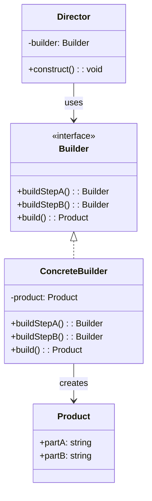

# Builder Pattern

The Builder pattern separates the construction of a complex object from its representation, allowing the same construction process to create different representations. It is ideal when an object requires many optional parameters, conditional assembly steps, or when the construction algorithm must be independent of the parts that make up the object.

## Intent

Encapsulate the construction logic for complex objects behind a step-by-step interface so that client code can configure only the parts it needs. This avoids telescoping constructors, eliminates invalid intermediate states, and produces immutable result objects.

## Class Diagram



## Key Characteristics

- Eliminates "telescoping constructor" anti-pattern — no constructor with 10+ optional parameters
- Enables fluent API with method chaining for readable configuration
- The `build()` method validates completeness and returns an immutable object
- A Director can reuse the same builder steps in different sequences to create variants
- Overkill for simple objects with few parameters — use only when construction complexity warrants it

---

## Example 1: Fintech — Complex Transaction Order Builder

**Problem:** A trading platform submits orders with dozens of optional fields — order type (market/limit/stop), time-in-force, fill-or-kill flags, trailing stop percentages, bracket orders, and regulatory tags (MiFID client ID, LEI codes). A single constructor would have 15+ parameters, most of which are null for any given order type.

**Solution:** A `TransactionOrderBuilder` uses method chaining to set only the relevant fields. The `build()` method validates that required combinations are present (e.g., limit price required for limit orders) and returns an immutable `TransactionOrder`.

```python
from dataclasses import dataclass
from typing import Optional

@dataclass(frozen=True)
class TransactionOrder:
    symbol: str
    side: str
    quantity: int
    order_type: str
    limit_price: Optional[float] = None
    stop_price: Optional[float] = None
    time_in_force: str = "DAY"
    lei_code: Optional[str] = None

class TransactionOrderBuilder:
    def __init__(self, symbol: str, side: str, quantity: int):
        self._symbol = symbol
        self._side = side
        self._qty = quantity
        self._order_type = "MARKET"
        self._limit: Optional[float] = None
        self._stop: Optional[float] = None
        self._tif = "DAY"
        self._lei: Optional[str] = None

    def limit(self, price: float) -> "TransactionOrderBuilder":
        self._order_type = "LIMIT"
        self._limit = price
        return self

    def stop(self, price: float) -> "TransactionOrderBuilder":
        self._stop = price
        return self

    def time_in_force(self, tif: str) -> "TransactionOrderBuilder":
        self._tif = tif
        return self

    def lei(self, code: str) -> "TransactionOrderBuilder":
        self._lei = code
        return self

    def build(self) -> TransactionOrder:
        if self._order_type == "LIMIT" and self._limit is None:
            raise ValueError("Limit orders require a limit price")
        return TransactionOrder(
            self._symbol, self._side, self._qty,
            self._order_type, self._limit, self._stop, self._tif, self._lei
        )

order = (TransactionOrderBuilder("AAPL", "BUY", 100)
         .limit(182.50).time_in_force("GTC").lei("5493001KJTIIGC8Y1R12")
         .build())
print(order)
```

```go
package main

import "fmt"

type TransactionOrder struct {
	Symbol      string
	Side        string
	Quantity    int
	OrderType   string
	LimitPrice  *float64
	StopPrice   *float64
	TimeInForce string
	LEICode     string
}

type TransactionOrderBuilder struct {
	order TransactionOrder
}

func NewOrderBuilder(symbol, side string, qty int) *TransactionOrderBuilder {
	return &TransactionOrderBuilder{order: TransactionOrder{
		Symbol: symbol, Side: side, Quantity: qty,
		OrderType: "MARKET", TimeInForce: "DAY",
	}}
}

func (b *TransactionOrderBuilder) Limit(price float64) *TransactionOrderBuilder {
	b.order.OrderType = "LIMIT"
	b.order.LimitPrice = &price
	return b
}

func (b *TransactionOrderBuilder) TimeInForce(tif string) *TransactionOrderBuilder {
	b.order.TimeInForce = tif
	return b
}

func (b *TransactionOrderBuilder) LEI(code string) *TransactionOrderBuilder {
	b.order.LEICode = code
	return b
}

func (b *TransactionOrderBuilder) Build() TransactionOrder {
	return b.order
}

func main() {
	order := NewOrderBuilder("AAPL", "BUY", 100).
		Limit(182.50).TimeInForce("GTC").LEI("5493001KJTIIGC8Y1R12").Build()
	fmt.Printf("%+v\n", order)
}
```

```java
public final class TransactionOrder {
    private final String symbol, side, orderType, timeInForce, leiCode;
    private final int quantity;
    private final Double limitPrice, stopPrice;

    private TransactionOrder(Builder b) {
        this.symbol = b.symbol; this.side = b.side; this.quantity = b.quantity;
        this.orderType = b.orderType; this.limitPrice = b.limitPrice;
        this.stopPrice = b.stopPrice; this.timeInForce = b.timeInForce;
        this.leiCode = b.leiCode;
    }

    public static class Builder {
        private final String symbol, side;
        private final int quantity;
        private String orderType = "MARKET", timeInForce = "DAY", leiCode;
        private Double limitPrice, stopPrice;

        public Builder(String symbol, String side, int quantity) {
            this.symbol = symbol; this.side = side; this.quantity = quantity;
        }

        public Builder limit(double price) {
            this.orderType = "LIMIT"; this.limitPrice = price; return this;
        }
        public Builder timeInForce(String tif) { this.timeInForce = tif; return this; }
        public Builder lei(String code) { this.leiCode = code; return this; }
        public TransactionOrder build() { return new TransactionOrder(this); }
    }

    @Override public String toString() {
        return symbol + " " + side + " " + quantity + " " + orderType + " @" + limitPrice;
    }
}
```

```typescript
interface TransactionOrder {
  readonly symbol: string;
  readonly side: string;
  readonly quantity: number;
  readonly orderType: string;
  readonly limitPrice?: number;
  readonly stopPrice?: number;
  readonly timeInForce: string;
  readonly leiCode?: string;
}

class TransactionOrderBuilder {
  private order: Partial<TransactionOrder> & {
    symbol: string;
    side: string;
    quantity: number;
  };

  constructor(symbol: string, side: string, quantity: number) {
    this.order = {
      symbol,
      side,
      quantity,
      orderType: "MARKET",
      timeInForce: "DAY",
    };
  }

  limit(price: number): this {
    this.order.orderType = "LIMIT";
    this.order.limitPrice = price;
    return this;
  }

  timeInForce(tif: string): this {
    this.order.timeInForce = tif;
    return this;
  }
  lei(code: string): this {
    this.order.leiCode = code;
    return this;
  }

  build(): TransactionOrder {
    if (this.order.orderType === "LIMIT" && !this.order.limitPrice)
      throw new Error("Limit orders require a limit price");
    return Object.freeze({ ...this.order } as TransactionOrder);
  }
}

const order = new TransactionOrderBuilder("AAPL", "BUY", 100)
  .limit(182.5)
  .timeInForce("GTC")
  .lei("5493001KJTIIGC8Y1R12")
  .build();
console.log(order);
```

```rust
#[derive(Debug)]
struct TransactionOrder {
    symbol: String,
    side: String,
    quantity: u32,
    order_type: String,
    limit_price: Option<f64>,
    time_in_force: String,
    lei_code: Option<String>,
}

struct TransactionOrderBuilder {
    symbol: String, side: String, quantity: u32,
    order_type: String, limit_price: Option<f64>,
    time_in_force: String, lei_code: Option<String>,
}

impl TransactionOrderBuilder {
    fn new(symbol: &str, side: &str, quantity: u32) -> Self {
        Self {
            symbol: symbol.into(), side: side.into(), quantity,
            order_type: "MARKET".into(), limit_price: None,
            time_in_force: "DAY".into(), lei_code: None,
        }
    }
    fn limit(mut self, price: f64) -> Self {
        self.order_type = "LIMIT".into(); self.limit_price = Some(price); self
    }
    fn time_in_force(mut self, tif: &str) -> Self { self.time_in_force = tif.into(); self }
    fn lei(mut self, code: &str) -> Self { self.lei_code = Some(code.into()); self }
    fn build(self) -> TransactionOrder {
        TransactionOrder {
            symbol: self.symbol, side: self.side, quantity: self.quantity,
            order_type: self.order_type, limit_price: self.limit_price,
            time_in_force: self.time_in_force, lei_code: self.lei_code,
        }
    }
}

fn main() {
    let order = TransactionOrderBuilder::new("AAPL", "BUY", 100)
        .limit(182.50).time_in_force("GTC").lei("5493001KJTIIGC8Y1R12").build();
    println!("{:?}", order);
}
```

---

## Example 2: Healthcare — Patient Intake Form Builder

**Problem:** A patient intake system captures demographics, insurance details, medical history, allergies, current medications, emergency contacts, and consent forms. The required sections vary by visit type — an ER visit skips detailed history; a specialist referral requires prior imaging references. A monolithic form class with dozens of optional fields is error-prone and hard to validate.

**Solution:** A `PatientIntakeBuilder` adds sections progressively. The `build()` method enforces visit-type-specific rules (e.g., insurance is mandatory for scheduled visits) and produces an immutable `PatientIntakeForm`.

```python
from dataclasses import dataclass, field
from typing import List, Optional

@dataclass(frozen=True)
class PatientIntakeForm:
    patient_name: str
    dob: str
    visit_type: str
    insurance_id: Optional[str] = None
    allergies: List[str] = field(default_factory=list)
    medications: List[str] = field(default_factory=list)
    emergency_contact: Optional[str] = None

class PatientIntakeBuilder:
    def __init__(self, name: str, dob: str, visit_type: str):
        self._name = name
        self._dob = dob
        self._visit_type = visit_type
        self._insurance: Optional[str] = None
        self._allergies: List[str] = []
        self._meds: List[str] = []
        self._emergency: Optional[str] = None

    def insurance(self, insurance_id: str) -> "PatientIntakeBuilder":
        self._insurance = insurance_id
        return self

    def allergy(self, allergy: str) -> "PatientIntakeBuilder":
        self._allergies.append(allergy)
        return self

    def medication(self, med: str) -> "PatientIntakeBuilder":
        self._meds.append(med)
        return self

    def emergency_contact(self, contact: str) -> "PatientIntakeBuilder":
        self._emergency = contact
        return self

    def build(self) -> PatientIntakeForm:
        if self._visit_type == "SCHEDULED" and not self._insurance:
            raise ValueError("Insurance required for scheduled visits")
        return PatientIntakeForm(
            self._name, self._dob, self._visit_type,
            self._insurance, self._allergies, self._meds, self._emergency
        )

form = (PatientIntakeBuilder("Jane Doe", "1985-03-14", "SCHEDULED")
        .insurance("BCBS-449912").allergy("Penicillin").medication("Lisinopril 10mg")
        .emergency_contact("John Doe: 555-0142").build())
print(form)
```

```go
package main

import "fmt"

type PatientIntakeForm struct {
	PatientName      string
	DOB              string
	VisitType        string
	InsuranceID      string
	Allergies        []string
	Medications      []string
	EmergencyContact string
}

type PatientIntakeBuilder struct {
	form PatientIntakeForm
}

func NewIntakeBuilder(name, dob, visitType string) *PatientIntakeBuilder {
	return &PatientIntakeBuilder{form: PatientIntakeForm{
		PatientName: name, DOB: dob, VisitType: visitType,
	}}
}

func (b *PatientIntakeBuilder) Insurance(id string) *PatientIntakeBuilder {
	b.form.InsuranceID = id; return b
}
func (b *PatientIntakeBuilder) Allergy(a string) *PatientIntakeBuilder {
	b.form.Allergies = append(b.form.Allergies, a); return b
}
func (b *PatientIntakeBuilder) Medication(m string) *PatientIntakeBuilder {
	b.form.Medications = append(b.form.Medications, m); return b
}
func (b *PatientIntakeBuilder) EmergencyContact(c string) *PatientIntakeBuilder {
	b.form.EmergencyContact = c; return b
}
func (b *PatientIntakeBuilder) Build() PatientIntakeForm {
	return b.form
}

func main() {
	form := NewIntakeBuilder("Jane Doe", "1985-03-14", "SCHEDULED").
		Insurance("BCBS-449912").Allergy("Penicillin").
		Medication("Lisinopril 10mg").EmergencyContact("John Doe: 555-0142").Build()
	fmt.Printf("%+v\n", form)
}
```

```java
import java.util.ArrayList;
import java.util.Collections;
import java.util.List;

public final class PatientIntakeForm {
    private final String patientName, dob, visitType, insuranceId, emergencyContact;
    private final List<String> allergies, medications;

    private PatientIntakeForm(Builder b) {
        this.patientName = b.name; this.dob = b.dob; this.visitType = b.visitType;
        this.insuranceId = b.insuranceId; this.emergencyContact = b.emergencyContact;
        this.allergies = Collections.unmodifiableList(b.allergies);
        this.medications = Collections.unmodifiableList(b.medications);
    }

    public static class Builder {
        private final String name, dob, visitType;
        private String insuranceId, emergencyContact;
        private final List<String> allergies = new ArrayList<>();
        private final List<String> medications = new ArrayList<>();

        public Builder(String name, String dob, String visitType) {
            this.name = name; this.dob = dob; this.visitType = visitType;
        }
        public Builder insurance(String id) { this.insuranceId = id; return this; }
        public Builder allergy(String a) { allergies.add(a); return this; }
        public Builder medication(String m) { medications.add(m); return this; }
        public Builder emergencyContact(String c) { this.emergencyContact = c; return this; }
        public PatientIntakeForm build() { return new PatientIntakeForm(this); }
    }
}
```

```typescript
interface PatientIntakeForm {
  readonly patientName: string;
  readonly dob: string;
  readonly visitType: string;
  readonly insuranceId?: string;
  readonly allergies: readonly string[];
  readonly medications: readonly string[];
  readonly emergencyContact?: string;
}

class PatientIntakeBuilder {
  private name: string;
  private dob: string;
  private visitType: string;
  private insuranceVal?: string;
  private allergyList: string[] = [];
  private medList: string[] = [];
  private emergencyVal?: string;

  constructor(name: string, dob: string, visitType: string) {
    this.name = name;
    this.dob = dob;
    this.visitType = visitType;
  }

  insurance(id: string): this {
    this.insuranceVal = id;
    return this;
  }
  allergy(a: string): this {
    this.allergyList.push(a);
    return this;
  }
  medication(m: string): this {
    this.medList.push(m);
    return this;
  }
  emergencyContact(c: string): this {
    this.emergencyVal = c;
    return this;
  }

  build(): PatientIntakeForm {
    return Object.freeze({
      patientName: this.name,
      dob: this.dob,
      visitType: this.visitType,
      insuranceId: this.insuranceVal,
      allergies: Object.freeze([...this.allergyList]),
      medications: Object.freeze([...this.medList]),
      emergencyContact: this.emergencyVal,
    });
  }
}

const form = new PatientIntakeBuilder("Jane Doe", "1985-03-14", "SCHEDULED")
  .insurance("BCBS-449912")
  .allergy("Penicillin")
  .medication("Lisinopril 10mg")
  .emergencyContact("John Doe: 555-0142")
  .build();
console.log(form);
```

```rust
#[derive(Debug)]
struct PatientIntakeForm {
    patient_name: String,
    dob: String,
    visit_type: String,
    insurance_id: Option<String>,
    allergies: Vec<String>,
    medications: Vec<String>,
    emergency_contact: Option<String>,
}

struct PatientIntakeBuilder {
    name: String, dob: String, visit_type: String,
    insurance_id: Option<String>, allergies: Vec<String>,
    medications: Vec<String>, emergency_contact: Option<String>,
}

impl PatientIntakeBuilder {
    fn new(name: &str, dob: &str, visit_type: &str) -> Self {
        Self {
            name: name.into(), dob: dob.into(), visit_type: visit_type.into(),
            insurance_id: None, allergies: vec![], medications: vec![],
            emergency_contact: None,
        }
    }
    fn insurance(mut self, id: &str) -> Self { self.insurance_id = Some(id.into()); self }
    fn allergy(mut self, a: &str) -> Self { self.allergies.push(a.into()); self }
    fn medication(mut self, m: &str) -> Self { self.medications.push(m.into()); self }
    fn emergency_contact(mut self, c: &str) -> Self { self.emergency_contact = Some(c.into()); self }
    fn build(self) -> PatientIntakeForm {
        PatientIntakeForm {
            patient_name: self.name, dob: self.dob, visit_type: self.visit_type,
            insurance_id: self.insurance_id, allergies: self.allergies,
            medications: self.medications, emergency_contact: self.emergency_contact,
        }
    }
}

fn main() {
    let form = PatientIntakeBuilder::new("Jane Doe", "1985-03-14", "SCHEDULED")
        .insurance("BCBS-449912").allergy("Penicillin").medication("Lisinopril 10mg")
        .emergency_contact("John Doe: 555-0142").build();
    println!("{:?}", form);
}
```

---

## Example 3: E-Commerce — Product Listing Builder

**Problem:** An e-commerce marketplace allows sellers to create product listings with varying attributes — physical goods need weight and dimensions, digital goods need file format and download limits, subscription goods need billing cycles and trial periods. A flat constructor would require passing irrelevant fields as null for each category, making validation unreliable.

**Solution:** A `ProductListingBuilder` supports chained methods for common fields (title, price, category) and category-specific fields (dimensions for physical, download limit for digital). The `build()` method validates that required category-specific fields are present.

```python
from dataclasses import dataclass
from typing import Optional

@dataclass(frozen=True)
class ProductListing:
    title: str
    price_cents: int
    category: str
    sku: str
    weight_kg: Optional[float] = None
    dimensions_cm: Optional[str] = None
    file_format: Optional[str] = None
    download_limit: Optional[int] = None

class ProductListingBuilder:
    def __init__(self, title: str, price_cents: int, category: str, sku: str):
        self._title = title
        self._price = price_cents
        self._cat = category
        self._sku = sku
        self._weight: Optional[float] = None
        self._dims: Optional[str] = None
        self._fmt: Optional[str] = None
        self._dl_limit: Optional[int] = None

    def weight(self, kg: float) -> "ProductListingBuilder":
        self._weight = kg; return self

    def dimensions(self, dims: str) -> "ProductListingBuilder":
        self._dims = dims; return self

    def file_format(self, fmt: str) -> "ProductListingBuilder":
        self._fmt = fmt; return self

    def download_limit(self, n: int) -> "ProductListingBuilder":
        self._dl_limit = n; return self

    def build(self) -> ProductListing:
        if self._cat == "PHYSICAL" and not self._weight:
            raise ValueError("Physical products require weight")
        return ProductListing(
            self._title, self._price, self._cat, self._sku,
            self._weight, self._dims, self._fmt, self._dl_limit
        )

listing = (ProductListingBuilder("Wireless Headphones", 7999, "PHYSICAL", "SKU-WH-100")
           .weight(0.35).dimensions("18x15x8").build())
print(listing)
```

```go
package main

import "fmt"

type ProductListing struct {
	Title         string
	PriceCents    int
	Category      string
	SKU           string
	WeightKg      *float64
	DimensionsCm  string
	FileFormat    string
	DownloadLimit *int
}

type ProductListingBuilder struct {
	listing ProductListing
}

func NewListingBuilder(title string, price int, cat, sku string) *ProductListingBuilder {
	return &ProductListingBuilder{listing: ProductListing{
		Title: title, PriceCents: price, Category: cat, SKU: sku,
	}}
}

func (b *ProductListingBuilder) Weight(kg float64) *ProductListingBuilder {
	b.listing.WeightKg = &kg; return b
}
func (b *ProductListingBuilder) Dimensions(d string) *ProductListingBuilder {
	b.listing.DimensionsCm = d; return b
}
func (b *ProductListingBuilder) FileFormat(f string) *ProductListingBuilder {
	b.listing.FileFormat = f; return b
}
func (b *ProductListingBuilder) Build() ProductListing { return b.listing }

func main() {
	listing := NewListingBuilder("Wireless Headphones", 7999, "PHYSICAL", "SKU-WH-100").
		Weight(0.35).Dimensions("18x15x8").Build()
	fmt.Printf("%+v\n", listing)
}
```

```java
public final class ProductListing {
    private final String title, category, sku, dimensionsCm, fileFormat;
    private final int priceCents;
    private final Double weightKg;
    private final Integer downloadLimit;

    private ProductListing(Builder b) {
        this.title = b.title; this.priceCents = b.priceCents; this.category = b.category;
        this.sku = b.sku; this.weightKg = b.weightKg; this.dimensionsCm = b.dimensionsCm;
        this.fileFormat = b.fileFormat; this.downloadLimit = b.downloadLimit;
    }

    public static class Builder {
        private final String title, category, sku;
        private final int priceCents;
        private Double weightKg;
        private String dimensionsCm, fileFormat;
        private Integer downloadLimit;

        public Builder(String title, int priceCents, String category, String sku) {
            this.title = title; this.priceCents = priceCents;
            this.category = category; this.sku = sku;
        }
        public Builder weight(double kg) { this.weightKg = kg; return this; }
        public Builder dimensions(String d) { this.dimensionsCm = d; return this; }
        public Builder fileFormat(String f) { this.fileFormat = f; return this; }
        public Builder downloadLimit(int n) { this.downloadLimit = n; return this; }
        public ProductListing build() { return new ProductListing(this); }
    }
}
```

```typescript
interface ProductListing {
  readonly title: string;
  readonly priceCents: number;
  readonly category: string;
  readonly sku: string;
  readonly weightKg?: number;
  readonly dimensionsCm?: string;
  readonly fileFormat?: string;
  readonly downloadLimit?: number;
}

class ProductListingBuilder {
  private data: Record<string, unknown>;

  constructor(
    title: string,
    priceCents: number,
    category: string,
    sku: string,
  ) {
    this.data = { title, priceCents, category, sku };
  }

  weight(kg: number): this {
    this.data.weightKg = kg;
    return this;
  }
  dimensions(d: string): this {
    this.data.dimensionsCm = d;
    return this;
  }
  fileFormat(f: string): this {
    this.data.fileFormat = f;
    return this;
  }
  downloadLimit(n: number): this {
    this.data.downloadLimit = n;
    return this;
  }

  build(): ProductListing {
    if (this.data.category === "PHYSICAL" && !this.data.weightKg)
      throw new Error("Physical products require weight");
    return Object.freeze(this.data) as ProductListing;
  }
}

const listing = new ProductListingBuilder(
  "Wireless Headphones",
  7999,
  "PHYSICAL",
  "SKU-WH-100",
)
  .weight(0.35)
  .dimensions("18x15x8")
  .build();
console.log(listing);
```

```rust
#[derive(Debug)]
struct ProductListing {
    title: String,
    price_cents: u32,
    category: String,
    sku: String,
    weight_kg: Option<f64>,
    dimensions_cm: Option<String>,
    file_format: Option<String>,
    download_limit: Option<u32>,
}

struct ProductListingBuilder {
    title: String, price_cents: u32, category: String, sku: String,
    weight_kg: Option<f64>, dimensions_cm: Option<String>,
    file_format: Option<String>, download_limit: Option<u32>,
}

impl ProductListingBuilder {
    fn new(title: &str, price_cents: u32, category: &str, sku: &str) -> Self {
        Self {
            title: title.into(), price_cents, category: category.into(), sku: sku.into(),
            weight_kg: None, dimensions_cm: None, file_format: None, download_limit: None,
        }
    }
    fn weight(mut self, kg: f64) -> Self { self.weight_kg = Some(kg); self }
    fn dimensions(mut self, d: &str) -> Self { self.dimensions_cm = Some(d.into()); self }
    fn file_format(mut self, f: &str) -> Self { self.file_format = Some(f.into()); self }
    fn build(self) -> ProductListing {
        ProductListing {
            title: self.title, price_cents: self.price_cents, category: self.category,
            sku: self.sku, weight_kg: self.weight_kg, dimensions_cm: self.dimensions_cm,
            file_format: self.file_format, download_limit: self.download_limit,
        }
    }
}

fn main() {
    let listing = ProductListingBuilder::new("Wireless Headphones", 7999, "PHYSICAL", "SKU-WH-100")
        .weight(0.35).dimensions("18x15x8").build();
    println!("{:?}", listing);
}
```

---

## Example 4: Media Streaming — Media Playlist Builder

**Problem:** A streaming service constructs playlists with a mix of content types (episodes, movies, live events), each with optional metadata — skip-intro timestamps, previously-watched resume points, parental ratings, and ad-insertion cue points. A constructor taking all possible fields would be unwieldy and error-prone for frontends and recommendation engines.

**Solution:** A `MediaPlaylistBuilder` assembles playlist items with fluent methods for content entries and global playlist settings. The `build()` method validates ordering constraints (e.g., live events cannot be shuffled) and returns an immutable playlist.

```python
from dataclasses import dataclass, field
from typing import List, Optional

@dataclass(frozen=True)
class PlaylistItem:
    content_id: str
    title: str
    resume_sec: int = 0
    skip_intro_sec: Optional[int] = None

@dataclass(frozen=True)
class MediaPlaylist:
    name: str
    items: List[PlaylistItem]
    shuffle: bool = False
    parental_rating: str = "TV-14"

class MediaPlaylistBuilder:
    def __init__(self, name: str):
        self._name = name
        self._items: List[PlaylistItem] = []
        self._shuffle = False
        self._rating = "TV-14"

    def add_item(self, content_id: str, title: str,
                 resume_sec: int = 0, skip_intro: Optional[int] = None) -> "MediaPlaylistBuilder":
        self._items.append(PlaylistItem(content_id, title, resume_sec, skip_intro))
        return self

    def shuffle(self, enabled: bool = True) -> "MediaPlaylistBuilder":
        self._shuffle = enabled
        return self

    def parental_rating(self, rating: str) -> "MediaPlaylistBuilder":
        self._rating = rating
        return self

    def build(self) -> MediaPlaylist:
        if not self._items:
            raise ValueError("Playlist must have at least one item")
        return MediaPlaylist(self._name, self._items, self._shuffle, self._rating)

playlist = (MediaPlaylistBuilder("Weekend Binge")
    .add_item("EP-301", "Stranger Things S3E1", skip_intro=32)
    .add_item("MOV-814", "Inception", resume_sec=3420)
    .parental_rating("TV-MA").build())
print(playlist)
```

```go
package main

import "fmt"

type PlaylistItem struct {
	ContentID    string
	Title        string
	ResumeSec    int
	SkipIntroSec *int
}

type MediaPlaylist struct {
	Name           string
	Items          []PlaylistItem
	Shuffle        bool
	ParentalRating string
}

type MediaPlaylistBuilder struct {
	playlist MediaPlaylist
}

func NewPlaylistBuilder(name string) *MediaPlaylistBuilder {
	return &MediaPlaylistBuilder{playlist: MediaPlaylist{Name: name, ParentalRating: "TV-14"}}
}

func (b *MediaPlaylistBuilder) AddItem(id, title string, resumeSec int, skipIntro *int) *MediaPlaylistBuilder {
	b.playlist.Items = append(b.playlist.Items, PlaylistItem{id, title, resumeSec, skipIntro})
	return b
}

func (b *MediaPlaylistBuilder) Shuffle(on bool) *MediaPlaylistBuilder {
	b.playlist.Shuffle = on; return b
}

func (b *MediaPlaylistBuilder) ParentalRating(r string) *MediaPlaylistBuilder {
	b.playlist.ParentalRating = r; return b
}

func (b *MediaPlaylistBuilder) Build() MediaPlaylist { return b.playlist }

func main() {
	skip := 32
	pl := NewPlaylistBuilder("Weekend Binge").
		AddItem("EP-301", "Stranger Things S3E1", 0, &skip).
		AddItem("MOV-814", "Inception", 3420, nil).
		ParentalRating("TV-MA").Build()
	fmt.Printf("%+v\n", pl)
}
```

```java
import java.util.ArrayList;
import java.util.Collections;
import java.util.List;

public final class MediaPlaylist {
    public record PlaylistItem(String contentId, String title, int resumeSec, Integer skipIntroSec) {}

    private final String name, parentalRating;
    private final List<PlaylistItem> items;
    private final boolean shuffle;

    private MediaPlaylist(Builder b) {
        this.name = b.name; this.parentalRating = b.parentalRating;
        this.items = Collections.unmodifiableList(b.items); this.shuffle = b.shuffle;
    }

    public static class Builder {
        private final String name;
        private String parentalRating = "TV-14";
        private final List<PlaylistItem> items = new ArrayList<>();
        private boolean shuffle;

        public Builder(String name) { this.name = name; }

        public Builder addItem(String id, String title, int resumeSec, Integer skipIntro) {
            items.add(new PlaylistItem(id, title, resumeSec, skipIntro)); return this;
        }
        public Builder shuffle(boolean on) { this.shuffle = on; return this; }
        public Builder parentalRating(String r) { this.parentalRating = r; return this; }
        public MediaPlaylist build() { return new MediaPlaylist(this); }
    }
}
```

```typescript
interface PlaylistItem {
  readonly contentId: string;
  readonly title: string;
  readonly resumeSec: number;
  readonly skipIntroSec?: number;
}

interface MediaPlaylist {
  readonly name: string;
  readonly items: readonly PlaylistItem[];
  readonly shuffle: boolean;
  readonly parentalRating: string;
}

class MediaPlaylistBuilder {
  private _name: string;
  private _items: PlaylistItem[] = [];
  private _shuffle = false;
  private _rating = "TV-14";

  constructor(name: string) {
    this._name = name;
  }

  addItem(
    contentId: string,
    title: string,
    resumeSec = 0,
    skipIntroSec?: number,
  ): this {
    this._items.push({ contentId, title, resumeSec, skipIntroSec });
    return this;
  }

  shuffle(on = true): this {
    this._shuffle = on;
    return this;
  }
  parentalRating(r: string): this {
    this._rating = r;
    return this;
  }

  build(): MediaPlaylist {
    if (this._items.length === 0) throw new Error("Playlist must have items");
    return Object.freeze({
      name: this._name,
      items: Object.freeze([...this._items]),
      shuffle: this._shuffle,
      parentalRating: this._rating,
    });
  }
}

const pl = new MediaPlaylistBuilder("Weekend Binge")
  .addItem("EP-301", "Stranger Things S3E1", 0, 32)
  .addItem("MOV-814", "Inception", 3420)
  .parentalRating("TV-MA")
  .build();
console.log(pl);
```

```rust
#[derive(Debug)]
struct PlaylistItem {
    content_id: String,
    title: String,
    resume_sec: u32,
    skip_intro_sec: Option<u32>,
}

#[derive(Debug)]
struct MediaPlaylist {
    name: String,
    items: Vec<PlaylistItem>,
    shuffle: bool,
    parental_rating: String,
}

struct MediaPlaylistBuilder {
    name: String,
    items: Vec<PlaylistItem>,
    shuffle: bool,
    parental_rating: String,
}

impl MediaPlaylistBuilder {
    fn new(name: &str) -> Self {
        Self { name: name.into(), items: vec![], shuffle: false, parental_rating: "TV-14".into() }
    }
    fn add_item(mut self, id: &str, title: &str, resume: u32, skip: Option<u32>) -> Self {
        self.items.push(PlaylistItem {
            content_id: id.into(), title: title.into(),
            resume_sec: resume, skip_intro_sec: skip,
        });
        self
    }
    fn parental_rating(mut self, r: &str) -> Self { self.parental_rating = r.into(); self }
    fn build(self) -> MediaPlaylist {
        MediaPlaylist {
            name: self.name, items: self.items,
            shuffle: self.shuffle, parental_rating: self.parental_rating,
        }
    }
}

fn main() {
    let pl = MediaPlaylistBuilder::new("Weekend Binge")
        .add_item("EP-301", "Stranger Things S3E1", 0, Some(32))
        .add_item("MOV-814", "Inception", 3420, None)
        .parental_rating("TV-MA").build();
    println!("{:?}", pl);
}
```

---

## Example 5: Logistics — Shipping Label Builder

**Problem:** A logistics platform generates shipping labels with varying requirements — domestic labels need only a ZIP code and service level; international labels require customs declarations, HS tariff codes, and commercial invoices; hazmat shipments add UN numbers and emergency contact information. Passing all optional fields through a single constructor leads to confusing APIs and mis-labeled packages.

**Solution:** A `ShippingLabelBuilder` progressively assembles the label. Methods for customs, hazmat, and insurance are only called when applicable. The `build()` method validates regulatory completeness (e.g., international labels must have customs declarations).

```python
from dataclasses import dataclass
from typing import Optional

@dataclass(frozen=True)
class ShippingLabel:
    tracking_id: str
    origin: str
    destination: str
    service_level: str
    weight_kg: float
    customs_declaration: Optional[str] = None
    hs_tariff_code: Optional[str] = None
    hazmat_un_number: Optional[str] = None
    insured_value_usd: Optional[float] = None

class ShippingLabelBuilder:
    def __init__(self, tracking_id: str, origin: str, destination: str, weight_kg: float):
        self._tid = tracking_id
        self._origin = origin
        self._dest = destination
        self._weight = weight_kg
        self._service = "GROUND"
        self._customs: Optional[str] = None
        self._hs: Optional[str] = None
        self._hazmat: Optional[str] = None
        self._insured: Optional[float] = None

    def service_level(self, level: str) -> "ShippingLabelBuilder":
        self._service = level; return self

    def customs(self, declaration: str, hs_code: str) -> "ShippingLabelBuilder":
        self._customs = declaration; self._hs = hs_code; return self

    def hazmat(self, un_number: str) -> "ShippingLabelBuilder":
        self._hazmat = un_number; return self

    def insured_value(self, usd: float) -> "ShippingLabelBuilder":
        self._insured = usd; return self

    def build(self) -> ShippingLabel:
        return ShippingLabel(
            self._tid, self._origin, self._dest, self._service,
            self._weight, self._customs, self._hs, self._hazmat, self._insured
        )

label = (ShippingLabelBuilder("SHP-44210", "New York, US", "London, UK", 12.5)
         .service_level("EXPRESS_INTL")
         .customs("Commercial goods: electronics", "8471.30")
         .insured_value(450.00).build())
print(label)
```

```go
package main

import "fmt"

type ShippingLabel struct {
	TrackingID         string
	Origin             string
	Destination        string
	ServiceLevel       string
	WeightKg           float64
	CustomsDeclaration string
	HSTariffCode       string
	HazmatUNNumber     string
	InsuredValueUSD    *float64
}

type ShippingLabelBuilder struct {
	label ShippingLabel
}

func NewLabelBuilder(tid, origin, dest string, weight float64) *ShippingLabelBuilder {
	return &ShippingLabelBuilder{label: ShippingLabel{
		TrackingID: tid, Origin: origin, Destination: dest,
		WeightKg: weight, ServiceLevel: "GROUND",
	}}
}

func (b *ShippingLabelBuilder) ServiceLevel(l string) *ShippingLabelBuilder {
	b.label.ServiceLevel = l; return b
}
func (b *ShippingLabelBuilder) Customs(decl, hsCode string) *ShippingLabelBuilder {
	b.label.CustomsDeclaration = decl; b.label.HSTariffCode = hsCode; return b
}
func (b *ShippingLabelBuilder) Hazmat(un string) *ShippingLabelBuilder {
	b.label.HazmatUNNumber = un; return b
}
func (b *ShippingLabelBuilder) InsuredValue(usd float64) *ShippingLabelBuilder {
	b.label.InsuredValueUSD = &usd; return b
}
func (b *ShippingLabelBuilder) Build() ShippingLabel { return b.label }

func main() {
	label := NewLabelBuilder("SHP-44210", "New York, US", "London, UK", 12.5).
		ServiceLevel("EXPRESS_INTL").
		Customs("Commercial goods: electronics", "8471.30").
		InsuredValue(450.00).Build()
	fmt.Printf("%+v\n", label)
}
```

```java
public final class ShippingLabel {
    private final String trackingId, origin, destination, serviceLevel;
    private final String customsDeclaration, hsTariffCode, hazmatUnNumber;
    private final double weightKg;
    private final Double insuredValueUsd;

    private ShippingLabel(Builder b) {
        this.trackingId = b.trackingId; this.origin = b.origin;
        this.destination = b.destination; this.serviceLevel = b.serviceLevel;
        this.weightKg = b.weightKg; this.customsDeclaration = b.customsDeclaration;
        this.hsTariffCode = b.hsTariffCode; this.hazmatUnNumber = b.hazmatUnNumber;
        this.insuredValueUsd = b.insuredValueUsd;
    }

    public static class Builder {
        private final String trackingId, origin, destination;
        private final double weightKg;
        private String serviceLevel = "GROUND", customsDeclaration, hsTariffCode, hazmatUnNumber;
        private Double insuredValueUsd;

        public Builder(String tid, String origin, String dest, double weight) {
            this.trackingId = tid; this.origin = origin;
            this.destination = dest; this.weightKg = weight;
        }
        public Builder serviceLevel(String l) { this.serviceLevel = l; return this; }
        public Builder customs(String decl, String hs) {
            this.customsDeclaration = decl; this.hsTariffCode = hs; return this;
        }
        public Builder hazmat(String un) { this.hazmatUnNumber = un; return this; }
        public Builder insuredValue(double usd) { this.insuredValueUsd = usd; return this; }
        public ShippingLabel build() { return new ShippingLabel(this); }
    }
}
```

```typescript
interface ShippingLabel {
  readonly trackingId: string;
  readonly origin: string;
  readonly destination: string;
  readonly serviceLevel: string;
  readonly weightKg: number;
  readonly customsDeclaration?: string;
  readonly hsTariffCode?: string;
  readonly hazmatUnNumber?: string;
  readonly insuredValueUsd?: number;
}

class ShippingLabelBuilder {
  private data: Record<string, unknown>;

  constructor(
    trackingId: string,
    origin: string,
    destination: string,
    weightKg: number,
  ) {
    this.data = {
      trackingId,
      origin,
      destination,
      weightKg,
      serviceLevel: "GROUND",
    };
  }

  serviceLevel(l: string): this {
    this.data.serviceLevel = l;
    return this;
  }
  customs(decl: string, hs: string): this {
    this.data.customsDeclaration = decl;
    this.data.hsTariffCode = hs;
    return this;
  }
  hazmat(un: string): this {
    this.data.hazmatUnNumber = un;
    return this;
  }
  insuredValue(usd: number): this {
    this.data.insuredValueUsd = usd;
    return this;
  }

  build(): ShippingLabel {
    return Object.freeze(this.data) as ShippingLabel;
  }
}

const label = new ShippingLabelBuilder(
  "SHP-44210",
  "New York, US",
  "London, UK",
  12.5,
)
  .serviceLevel("EXPRESS_INTL")
  .customs("Commercial goods: electronics", "8471.30")
  .insuredValue(450.0)
  .build();
console.log(label);
```

```rust
#[derive(Debug)]
struct ShippingLabel {
    tracking_id: String,
    origin: String,
    destination: String,
    service_level: String,
    weight_kg: f64,
    customs_declaration: Option<String>,
    hs_tariff_code: Option<String>,
    hazmat_un_number: Option<String>,
    insured_value_usd: Option<f64>,
}

struct ShippingLabelBuilder {
    tracking_id: String, origin: String, destination: String,
    service_level: String, weight_kg: f64,
    customs_declaration: Option<String>, hs_tariff_code: Option<String>,
    hazmat_un_number: Option<String>, insured_value_usd: Option<f64>,
}

impl ShippingLabelBuilder {
    fn new(tid: &str, origin: &str, dest: &str, weight: f64) -> Self {
        Self {
            tracking_id: tid.into(), origin: origin.into(), destination: dest.into(),
            service_level: "GROUND".into(), weight_kg: weight,
            customs_declaration: None, hs_tariff_code: None,
            hazmat_un_number: None, insured_value_usd: None,
        }
    }
    fn service_level(mut self, l: &str) -> Self { self.service_level = l.into(); self }
    fn customs(mut self, decl: &str, hs: &str) -> Self {
        self.customs_declaration = Some(decl.into());
        self.hs_tariff_code = Some(hs.into()); self
    }
    fn insured_value(mut self, usd: f64) -> Self { self.insured_value_usd = Some(usd); self }
    fn build(self) -> ShippingLabel {
        ShippingLabel {
            tracking_id: self.tracking_id, origin: self.origin,
            destination: self.destination, service_level: self.service_level,
            weight_kg: self.weight_kg, customs_declaration: self.customs_declaration,
            hs_tariff_code: self.hs_tariff_code, hazmat_un_number: self.hazmat_un_number,
            insured_value_usd: self.insured_value_usd,
        }
    }
}

fn main() {
    let label = ShippingLabelBuilder::new("SHP-44210", "New York, US", "London, UK", 12.5)
        .service_level("EXPRESS_INTL")
        .customs("Commercial goods: electronics", "8471.30")
        .insured_value(450.00).build();
    println!("{:?}", label);
}
```

---

## Summary

| Aspect               | Details                                                                                                                                                    |
| -------------------- | ---------------------------------------------------------------------------------------------------------------------------------------------------------- |
| **Pattern Type**     | Creational                                                                                                                                                 |
| **Key Benefit**      | Eliminates telescoping constructors and produces validated, immutable objects via a fluent step-by-step API                                                |
| **Common Pitfall**   | Over-engineering simple objects; the builder adds a parallel class hierarchy that must be maintained alongside the product                                 |
| **Related Patterns** | Abstract Factory (can use builders internally), Prototype (alternative when a template object exists), Fluent Interface (Builder is the canonical example) |
