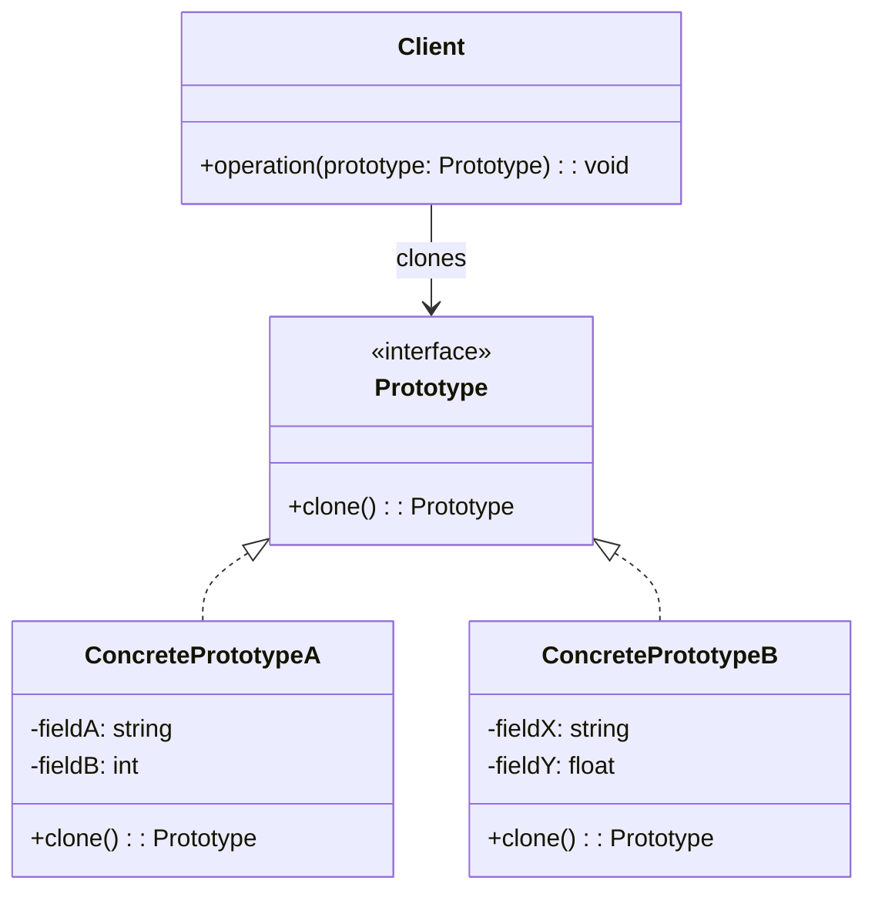

# Prototype Pattern

The Prototype pattern creates new objects by cloning an existing instance (the prototype) rather than constructing from scratch. It is especially useful when object creation is expensive (heavy I/O, complex computation, deep object graphs) or when you want to produce variations of an existing configuration without knowing its concrete class.

## Intent

Specify the kinds of objects to create using a prototypical instance, and create new objects by copying this prototype. This avoids the cost of re-initialization and decouples client code from the concrete classes it needs to instantiate.

## Class Diagram



## Key Characteristics

- Useful when constructing an object from scratch is expensive (database lookups, API calls, heavy computation)
- Deep clone vs. shallow clone must be carefully considered — shared mutable references cause bugs
- Provides a registry/cache of pre-built prototypes for quick cloning
- Avoids subclass explosion when objects differ only in configuration
- Language support varies: Python has `copy.deepcopy()`, Go uses manual copy, Rust has the `Clone` trait, Java has `Cloneable`

---

## Example 1: Fintech — Loan Application Template Cloning

**Problem:** A bank processes thousands of mortgage applications daily. Each application starts from a base template per loan product (30-year fixed, 15-year ARM, FHA, VA) that includes pre-filled compliance fields, fee schedules, and disclosure requirements. Rebuilding these templates from database lookups for every applicant wastes 200ms+ per request during peak hours.

**Solution:** A `LoanApplicationTemplate` prototype is loaded once per product type and deep-cloned for each new applicant. The clone is then personalized with borrower-specific details, avoiding repeated database round-trips.

```python
import copy
from dataclasses import dataclass, field
from typing import List

@dataclass
class LoanApplicationTemplate:
    product_name: str
    term_years: int
    base_rate_pct: float
    required_disclosures: List[str]
    fee_schedule: dict

    def clone(self) -> "LoanApplicationTemplate":
        return copy.deepcopy(self)

fha_template = LoanApplicationTemplate(
    product_name="FHA 30-Year Fixed",
    term_years=30,
    base_rate_pct=6.25,
    required_disclosures=["TILA", "RESPA", "FHA MIP Disclosure"],
    fee_schedule={"origination": 1500, "appraisal": 450, "title_search": 300}
)

applicant_app = fha_template.clone()
applicant_app.product_name = "FHA 30-Year Fixed — Borrower: Jane Smith"
print(applicant_app)
print("Template unchanged:", fha_template.product_name)
```

```go
package main

import "fmt"

type LoanApplicationTemplate struct {
	ProductName          string
	TermYears            int
	BaseRatePct          float64
	RequiredDisclosures  []string
	FeeSchedule          map[string]int
}

func (t *LoanApplicationTemplate) Clone() *LoanApplicationTemplate {
	disclosures := make([]string, len(t.RequiredDisclosures))
	copy(disclosures, t.RequiredDisclosures)
	fees := make(map[string]int)
	for k, v := range t.FeeSchedule {
		fees[k] = v
	}
	return &LoanApplicationTemplate{
		ProductName: t.ProductName, TermYears: t.TermYears,
		BaseRatePct: t.BaseRatePct, RequiredDisclosures: disclosures,
		FeeSchedule: fees,
	}
}

func main() {
	fha := &LoanApplicationTemplate{
		ProductName: "FHA 30-Year Fixed", TermYears: 30, BaseRatePct: 6.25,
		RequiredDisclosures: []string{"TILA", "RESPA", "FHA MIP Disclosure"},
		FeeSchedule: map[string]int{"origination": 1500, "appraisal": 450},
	}
	app := fha.Clone()
	app.ProductName = "FHA 30-Year Fixed — Borrower: Jane Smith"
	fmt.Println(app.ProductName)
	fmt.Println("Template:", fha.ProductName)
}
```

```java
import java.util.*;

public class LoanApplicationTemplate implements Cloneable {
    String productName;
    int termYears;
    double baseRatePct;
    List<String> requiredDisclosures;
    Map<String, Integer> feeSchedule;

    public LoanApplicationTemplate(String productName, int termYears, double baseRatePct,
                                   List<String> disclosures, Map<String, Integer> fees) {
        this.productName = productName; this.termYears = termYears;
        this.baseRatePct = baseRatePct;
        this.requiredDisclosures = new ArrayList<>(disclosures);
        this.feeSchedule = new HashMap<>(fees);
    }

    @Override
    public LoanApplicationTemplate clone() {
        return new LoanApplicationTemplate(
            productName, termYears, baseRatePct,
            new ArrayList<>(requiredDisclosures), new HashMap<>(feeSchedule)
        );
    }

    public static void main(String[] args) {
        var fha = new LoanApplicationTemplate("FHA 30-Year Fixed", 30, 6.25,
            List.of("TILA", "RESPA"), Map.of("origination", 1500, "appraisal", 450));
        var app = fha.clone();
        app.productName = "FHA 30-Year Fixed — Borrower: Jane Smith";
        System.out.println(app.productName);
        System.out.println("Template: " + fha.productName);
    }
}
```

```typescript
interface LoanApplicationTemplate {
  productName: string;
  termYears: number;
  baseRatePct: number;
  requiredDisclosures: string[];
  feeSchedule: Record<string, number>;
  clone(): LoanApplicationTemplate;
}

class FHALoanTemplate implements LoanApplicationTemplate {
  constructor(
    public productName: string,
    public termYears: number,
    public baseRatePct: number,
    public requiredDisclosures: string[],
    public feeSchedule: Record<string, number>,
  ) {}

  clone(): LoanApplicationTemplate {
    return new FHALoanTemplate(
      this.productName,
      this.termYears,
      this.baseRatePct,
      [...this.requiredDisclosures],
      { ...this.feeSchedule },
    );
  }
}

const fhaTemplate = new FHALoanTemplate(
  "FHA 30-Year Fixed",
  30,
  6.25,
  ["TILA", "RESPA", "FHA MIP Disclosure"],
  { origination: 1500, appraisal: 450 },
);

const app = fhaTemplate.clone();
app.productName = "FHA 30-Year Fixed — Borrower: Jane Smith";
console.log(app.productName);
console.log("Template:", fhaTemplate.productName);
```

```rust
#[derive(Clone, Debug)]
struct LoanApplicationTemplate {
    product_name: String,
    term_years: u32,
    base_rate_pct: f64,
    required_disclosures: Vec<String>,
    fee_schedule: std::collections::HashMap<String, u32>,
}

fn main() {
    let mut fees = std::collections::HashMap::new();
    fees.insert("origination".into(), 1500);
    fees.insert("appraisal".into(), 450);

    let fha_template = LoanApplicationTemplate {
        product_name: "FHA 30-Year Fixed".into(),
        term_years: 30,
        base_rate_pct: 6.25,
        required_disclosures: vec!["TILA".into(), "RESPA".into()],
        fee_schedule: fees,
    };

    let mut app = fha_template.clone();
    app.product_name = "FHA 30-Year Fixed — Borrower: Jane Smith".into();
    println!("{}", app.product_name);
    println!("Template: {}", fha_template.product_name);
}
```

---

## Example 2: Healthcare — Treatment Plan Template Cloning

**Problem:** Oncologists create treatment plans for common cancer protocols (e.g., FOLFOX for colorectal, R-CHOP for lymphoma). Each protocol specifies drug combinations, dosing schedules, lab monitoring intervals, and side-effect management guidelines. Rebuilding a 50-field protocol from clinical databases for every new patient takes significant time and risks transcription errors.

**Solution:** A `TreatmentPlanTemplate` stores the base protocol as a prototype. For each new patient, the template is cloned and personalized with patient-specific adjustments (body surface area dosing, comorbidity modifications), keeping the original protocol intact.

```python
import copy
from dataclasses import dataclass, field
from typing import List

@dataclass
class TreatmentPlanTemplate:
    protocol_name: str
    drugs: List[str]
    cycle_days: int
    total_cycles: int
    lab_intervals_days: int
    supportive_meds: List[str]

    def clone(self) -> "TreatmentPlanTemplate":
        return copy.deepcopy(self)

folfox = TreatmentPlanTemplate(
    protocol_name="FOLFOX6",
    drugs=["Oxaliplatin 85mg/m²", "Leucovorin 400mg/m²", "5-FU 2400mg/m²"],
    cycle_days=14, total_cycles=12, lab_intervals_days=7,
    supportive_meds=["Ondansetron 8mg", "Dexamethasone 12mg"]
)

patient_plan = folfox.clone()
patient_plan.protocol_name = "FOLFOX6 — Patient MRN-20492"
patient_plan.total_cycles = 8  # adjusted for age
print(patient_plan)
print("Original cycles:", folfox.total_cycles)
```

```go
package main

import "fmt"

type TreatmentPlanTemplate struct {
	ProtocolName    string
	Drugs           []string
	CycleDays       int
	TotalCycles     int
	LabIntervalDays int
	SupportiveMeds  []string
}

func (t *TreatmentPlanTemplate) Clone() *TreatmentPlanTemplate {
	drugs := make([]string, len(t.Drugs))
	copy(drugs, t.Drugs)
	meds := make([]string, len(t.SupportiveMeds))
	copy(meds, t.SupportiveMeds)
	return &TreatmentPlanTemplate{
		ProtocolName: t.ProtocolName, Drugs: drugs, CycleDays: t.CycleDays,
		TotalCycles: t.TotalCycles, LabIntervalDays: t.LabIntervalDays,
		SupportiveMeds: meds,
	}
}

func main() {
	folfox := &TreatmentPlanTemplate{
		ProtocolName: "FOLFOX6",
		Drugs:        []string{"Oxaliplatin 85mg/m²", "Leucovorin 400mg/m²", "5-FU 2400mg/m²"},
		CycleDays: 14, TotalCycles: 12, LabIntervalDays: 7,
		SupportiveMeds: []string{"Ondansetron 8mg", "Dexamethasone 12mg"},
	}
	plan := folfox.Clone()
	plan.ProtocolName = "FOLFOX6 — Patient MRN-20492"
	plan.TotalCycles = 8
	fmt.Println(plan.ProtocolName, plan.TotalCycles)
	fmt.Println("Original:", folfox.TotalCycles)
}
```

```java
import java.util.*;

public class TreatmentPlanTemplate implements Cloneable {
    String protocolName;
    List<String> drugs;
    int cycleDays, totalCycles, labIntervalDays;
    List<String> supportiveMeds;

    public TreatmentPlanTemplate(String name, List<String> drugs, int cycleDays,
                                 int totalCycles, int labDays, List<String> meds) {
        this.protocolName = name; this.drugs = new ArrayList<>(drugs);
        this.cycleDays = cycleDays; this.totalCycles = totalCycles;
        this.labIntervalDays = labDays; this.supportiveMeds = new ArrayList<>(meds);
    }

    @Override
    public TreatmentPlanTemplate clone() {
        return new TreatmentPlanTemplate(
            protocolName, new ArrayList<>(drugs), cycleDays,
            totalCycles, labIntervalDays, new ArrayList<>(supportiveMeds)
        );
    }

    public static void main(String[] args) {
        var folfox = new TreatmentPlanTemplate("FOLFOX6",
            List.of("Oxaliplatin 85mg/m²", "Leucovorin 400mg/m²"),
            14, 12, 7, List.of("Ondansetron 8mg"));
        var plan = folfox.clone();
        plan.protocolName = "FOLFOX6 — Patient MRN-20492";
        plan.totalCycles = 8;
        System.out.println(plan.protocolName + " cycles=" + plan.totalCycles);
        System.out.println("Original cycles=" + folfox.totalCycles);
    }
}
```

```typescript
interface TreatmentPlanTemplate {
  protocolName: string;
  drugs: string[];
  cycleDays: number;
  totalCycles: number;
  labIntervalDays: number;
  supportiveMeds: string[];
  clone(): TreatmentPlanTemplate;
}

class OncologyProtocol implements TreatmentPlanTemplate {
  constructor(
    public protocolName: string,
    public drugs: string[],
    public cycleDays: number,
    public totalCycles: number,
    public labIntervalDays: number,
    public supportiveMeds: string[],
  ) {}

  clone(): TreatmentPlanTemplate {
    return new OncologyProtocol(
      this.protocolName,
      [...this.drugs],
      this.cycleDays,
      this.totalCycles,
      this.labIntervalDays,
      [...this.supportiveMeds],
    );
  }
}

const folfox = new OncologyProtocol(
  "FOLFOX6",
  ["Oxaliplatin 85mg/m²", "Leucovorin 400mg/m²", "5-FU 2400mg/m²"],
  14,
  12,
  7,
  ["Ondansetron 8mg", "Dexamethasone 12mg"],
);

const plan = folfox.clone();
plan.protocolName = "FOLFOX6 — Patient MRN-20492";
plan.totalCycles = 8;
console.log(plan.protocolName, plan.totalCycles);
console.log("Original:", folfox.totalCycles);
```

```rust
#[derive(Clone, Debug)]
struct TreatmentPlanTemplate {
    protocol_name: String,
    drugs: Vec<String>,
    cycle_days: u32,
    total_cycles: u32,
    lab_interval_days: u32,
    supportive_meds: Vec<String>,
}

fn main() {
    let folfox = TreatmentPlanTemplate {
        protocol_name: "FOLFOX6".into(),
        drugs: vec![
            "Oxaliplatin 85mg/m²".into(),
            "Leucovorin 400mg/m²".into(),
            "5-FU 2400mg/m²".into(),
        ],
        cycle_days: 14, total_cycles: 12, lab_interval_days: 7,
        supportive_meds: vec!["Ondansetron 8mg".into(), "Dexamethasone 12mg".into()],
    };

    let mut plan = folfox.clone();
    plan.protocol_name = "FOLFOX6 — Patient MRN-20492".into();
    plan.total_cycles = 8;
    println!("{} cycles={}", plan.protocol_name, plan.total_cycles);
    println!("Original cycles={}", folfox.total_cycles);
}
```

---

## Example 3: E-Commerce — Product Variant Cloning

**Problem:** A marketplace manages base products (e.g., "Premium Cotton T-Shirt") with hundreds of variants (size/color/region combinations). Each variant shares 90% of the base product's data (description, brand, tax category, images, shipping class) but differs in SKU, price, and stock. Constructing each variant from scratch means redundant database reads for shared fields.

**Solution:** A `ProductVariantTemplate` prototype holds the base product data. Each variant is cloned from the base, then only the differing fields (SKU, price, color, size) are overridden, avoiding redundant I/O.

```python
import copy
from dataclasses import dataclass, field
from typing import List

@dataclass
class ProductVariantTemplate:
    base_title: str
    brand: str
    tax_category: str
    shipping_class: str
    image_urls: List[str]
    sku: str = ""
    color: str = ""
    size: str = ""
    price_cents: int = 0

    def clone(self) -> "ProductVariantTemplate":
        return copy.deepcopy(self)

base_tshirt = ProductVariantTemplate(
    base_title="Premium Cotton T-Shirt", brand="ThreadCo",
    tax_category="APPAREL", shipping_class="STANDARD",
    image_urls=["https://cdn.shop.io/tshirt_front.jpg", "https://cdn.shop.io/tshirt_back.jpg"]
)

red_medium = base_tshirt.clone()
red_medium.sku = "TC-TSH-RED-M"
red_medium.color = "Red"
red_medium.size = "M"
red_medium.price_cents = 2999
print(red_medium)
print("Base SKU unchanged:", base_tshirt.sku)
```

```go
package main

import "fmt"

type ProductVariantTemplate struct {
	BaseTitle     string
	Brand         string
	TaxCategory   string
	ShippingClass string
	ImageURLs     []string
	SKU           string
	Color         string
	Size          string
	PriceCents    int
}

func (p *ProductVariantTemplate) Clone() *ProductVariantTemplate {
	imgs := make([]string, len(p.ImageURLs))
	copy(imgs, p.ImageURLs)
	clone := *p
	clone.ImageURLs = imgs
	return &clone
}

func main() {
	base := &ProductVariantTemplate{
		BaseTitle: "Premium Cotton T-Shirt", Brand: "ThreadCo",
		TaxCategory: "APPAREL", ShippingClass: "STANDARD",
		ImageURLs: []string{"https://cdn.shop.io/tshirt_front.jpg"},
	}
	redM := base.Clone()
	redM.SKU = "TC-TSH-RED-M"
	redM.Color = "Red"
	redM.Size = "M"
	redM.PriceCents = 2999
	fmt.Printf("%+v\n", redM)
	fmt.Println("Base SKU:", base.SKU)
}
```

```java
import java.util.*;

public class ProductVariantTemplate implements Cloneable {
    String baseTitle, brand, taxCategory, shippingClass, sku, color, size;
    int priceCents;
    List<String> imageUrls;

    public ProductVariantTemplate(String title, String brand, String taxCat,
                                  String shipClass, List<String> images) {
        this.baseTitle = title; this.brand = brand; this.taxCategory = taxCat;
        this.shippingClass = shipClass; this.imageUrls = new ArrayList<>(images);
    }

    @Override
    public ProductVariantTemplate clone() {
        var copy = new ProductVariantTemplate(
            baseTitle, brand, taxCategory, shippingClass, new ArrayList<>(imageUrls));
        copy.sku = sku; copy.color = color; copy.size = size; copy.priceCents = priceCents;
        return copy;
    }

    public static void main(String[] args) {
        var base = new ProductVariantTemplate("Premium Cotton T-Shirt", "ThreadCo",
            "APPAREL", "STANDARD", List.of("https://cdn.shop.io/tshirt_front.jpg"));
        var redM = base.clone();
        redM.sku = "TC-TSH-RED-M"; redM.color = "Red"; redM.size = "M"; redM.priceCents = 2999;
        System.out.println(redM.sku + " " + redM.color + " $" + redM.priceCents / 100.0);
        System.out.println("Base SKU: " + base.sku);
    }
}
```

```typescript
interface ProductVariantTemplate {
  baseTitle: string;
  brand: string;
  taxCategory: string;
  shippingClass: string;
  imageUrls: string[];
  sku: string;
  color: string;
  size: string;
  priceCents: number;
  clone(): ProductVariantTemplate;
}

class TShirtVariant implements ProductVariantTemplate {
  sku = "";
  color = "";
  size = "";
  priceCents = 0;

  constructor(
    public baseTitle: string,
    public brand: string,
    public taxCategory: string,
    public shippingClass: string,
    public imageUrls: string[],
  ) {}

  clone(): ProductVariantTemplate {
    const c = new TShirtVariant(
      this.baseTitle,
      this.brand,
      this.taxCategory,
      this.shippingClass,
      [...this.imageUrls],
    );
    c.sku = this.sku;
    c.color = this.color;
    c.size = this.size;
    c.priceCents = this.priceCents;
    return c;
  }
}

const base = new TShirtVariant(
  "Premium Cotton T-Shirt",
  "ThreadCo",
  "APPAREL",
  "STANDARD",
  ["https://cdn.shop.io/tshirt_front.jpg"],
);
const redM = base.clone();
redM.sku = "TC-TSH-RED-M";
redM.color = "Red";
redM.size = "M";
redM.priceCents = 2999;
console.log(redM.sku, redM.color, redM.priceCents);
console.log("Base SKU:", base.sku);
```

```rust
#[derive(Clone, Debug)]
struct ProductVariantTemplate {
    base_title: String,
    brand: String,
    tax_category: String,
    shipping_class: String,
    image_urls: Vec<String>,
    sku: String,
    color: String,
    size: String,
    price_cents: u32,
}

fn main() {
    let base = ProductVariantTemplate {
        base_title: "Premium Cotton T-Shirt".into(),
        brand: "ThreadCo".into(),
        tax_category: "APPAREL".into(),
        shipping_class: "STANDARD".into(),
        image_urls: vec!["https://cdn.shop.io/tshirt_front.jpg".into()],
        sku: String::new(), color: String::new(),
        size: String::new(), price_cents: 0,
    };

    let mut red_m = base.clone();
    red_m.sku = "TC-TSH-RED-M".into();
    red_m.color = "Red".into();
    red_m.size = "M".into();
    red_m.price_cents = 2999;
    println!("{} {} ${:.2}", red_m.sku, red_m.color, red_m.price_cents as f64 / 100.0);
    println!("Base SKU: {}", base.sku);
}
```

---

## Example 4: Media Streaming — Recommendation Profile Cloning

**Problem:** A streaming platform's recommendation engine maintains user profiles with hundreds of weighted genre preferences, watch-history vectors, and content filtering rules. When A/B testing a new algorithm, the engine needs to create experimental profile copies to score against new models without mutating production profiles. Serializing/deserializing the full profile from a database for each experiment variant is too slow at scale (millions of profiles).

**Solution:** A `RecommendationProfile` prototype is cloned in-memory. The experimental variant adjusts specific preference weights or adds new signals, while the production profile remains untouched.

```python
import copy
from dataclasses import dataclass, field
from typing import Dict, List

@dataclass
class RecommendationProfile:
    user_id: str
    genre_weights: Dict[str, float]
    watch_history_ids: List[str]
    content_filter: str

    def clone(self) -> "RecommendationProfile":
        return copy.deepcopy(self)

prod_profile = RecommendationProfile(
    user_id="USR-88421",
    genre_weights={"sci-fi": 0.85, "thriller": 0.72, "comedy": 0.45, "documentary": 0.60},
    watch_history_ids=["MOV-101", "EP-302", "MOV-455"],
    content_filter="TV-MA"
)

experiment = prod_profile.clone()
experiment.genre_weights["sci-fi"] = 0.95  # boost for A/B test
experiment.genre_weights["anime"] = 0.70   # new signal
print("Experiment:", experiment.genre_weights)
print("Production:", prod_profile.genre_weights)
```

```go
package main

import "fmt"

type RecommendationProfile struct {
	UserID          string
	GenreWeights    map[string]float64
	WatchHistoryIDs []string
	ContentFilter   string
}

func (r *RecommendationProfile) Clone() *RecommendationProfile {
	weights := make(map[string]float64)
	for k, v := range r.GenreWeights {
		weights[k] = v
	}
	history := make([]string, len(r.WatchHistoryIDs))
	copy(history, r.WatchHistoryIDs)
	return &RecommendationProfile{
		UserID: r.UserID, GenreWeights: weights,
		WatchHistoryIDs: history, ContentFilter: r.ContentFilter,
	}
}

func main() {
	prod := &RecommendationProfile{
		UserID:       "USR-88421",
		GenreWeights: map[string]float64{"sci-fi": 0.85, "thriller": 0.72, "comedy": 0.45},
		WatchHistoryIDs: []string{"MOV-101", "EP-302"},
		ContentFilter:   "TV-MA",
	}
	exp := prod.Clone()
	exp.GenreWeights["sci-fi"] = 0.95
	exp.GenreWeights["anime"] = 0.70
	fmt.Println("Experiment:", exp.GenreWeights)
	fmt.Println("Production:", prod.GenreWeights)
}
```

```java
import java.util.*;

public class RecommendationProfile implements Cloneable {
    String userId;
    Map<String, Double> genreWeights;
    List<String> watchHistoryIds;
    String contentFilter;

    public RecommendationProfile(String userId, Map<String, Double> weights,
                                 List<String> history, String filter) {
        this.userId = userId; this.genreWeights = new HashMap<>(weights);
        this.watchHistoryIds = new ArrayList<>(history); this.contentFilter = filter;
    }

    @Override
    public RecommendationProfile clone() {
        return new RecommendationProfile(
            userId, new HashMap<>(genreWeights),
            new ArrayList<>(watchHistoryIds), contentFilter
        );
    }

    public static void main(String[] args) {
        var prod = new RecommendationProfile("USR-88421",
            new HashMap<>(Map.of("sci-fi", 0.85, "thriller", 0.72, "comedy", 0.45)),
            List.of("MOV-101", "EP-302"), "TV-MA");
        var exp = prod.clone();
        exp.genreWeights.put("sci-fi", 0.95);
        exp.genreWeights.put("anime", 0.70);
        System.out.println("Experiment: " + exp.genreWeights);
        System.out.println("Production: " + prod.genreWeights);
    }
}
```

```typescript
interface RecommendationProfile {
  userId: string;
  genreWeights: Record<string, number>;
  watchHistoryIds: string[];
  contentFilter: string;
  clone(): RecommendationProfile;
}

class StreamingProfile implements RecommendationProfile {
  constructor(
    public userId: string,
    public genreWeights: Record<string, number>,
    public watchHistoryIds: string[],
    public contentFilter: string,
  ) {}

  clone(): RecommendationProfile {
    return new StreamingProfile(
      this.userId,
      { ...this.genreWeights },
      [...this.watchHistoryIds],
      this.contentFilter,
    );
  }
}

const prod = new StreamingProfile(
  "USR-88421",
  { "sci-fi": 0.85, "thriller": 0.72, "comedy": 0.45 },
  ["MOV-101", "EP-302"],
  "TV-MA",
);
const exp = prod.clone();
exp.genreWeights["sci-fi"] = 0.95;
exp.genreWeights["anime"] = 0.7;
console.log("Experiment:", exp.genreWeights);
console.log("Production:", prod.genreWeights);
```

```rust
use std::collections::HashMap;

#[derive(Clone, Debug)]
struct RecommendationProfile {
    user_id: String,
    genre_weights: HashMap<String, f64>,
    watch_history_ids: Vec<String>,
    content_filter: String,
}

fn main() {
    let mut weights = HashMap::new();
    weights.insert("sci-fi".into(), 0.85);
    weights.insert("thriller".into(), 0.72);
    weights.insert("comedy".into(), 0.45);

    let prod = RecommendationProfile {
        user_id: "USR-88421".into(),
        genre_weights: weights,
        watch_history_ids: vec!["MOV-101".into(), "EP-302".into()],
        content_filter: "TV-MA".into(),
    };

    let mut exp = prod.clone();
    exp.genre_weights.insert("sci-fi".into(), 0.95);
    exp.genre_weights.insert("anime".into(), 0.70);
    println!("Experiment: {:?}", exp.genre_weights);
    println!("Production: {:?}", prod.genre_weights);
}
```

---

## Example 5: Logistics — Delivery Route Template Cloning

**Problem:** A last-mile delivery service pre-computes optimized route templates for recurring delivery zones (e.g., "Downtown Manhattan Morning", "Brooklyn Afternoon"). Each template includes waypoints, time windows, traffic coefficients, and driver rest-stop locations. Recalculating routes from scratch for each dispatch cycle takes 5+ seconds per zone. On busy days, 200+ zones must be prepared simultaneously.

**Solution:** A `DeliveryRouteTemplate` prototype stores the pre-computed zone route. Each dispatch cycle clones the template, then adds or removes specific delivery stops for the day's orders while preserving the optimized waypoint sequence.

```python
import copy
from dataclasses import dataclass, field
from typing import List, Tuple

@dataclass
class DeliveryRouteTemplate:
    zone_name: str
    waypoints: List[Tuple[float, float]]
    time_window: str
    traffic_coefficient: float
    rest_stops: List[str]

    def clone(self) -> "DeliveryRouteTemplate":
        return copy.deepcopy(self)

downtown_morning = DeliveryRouteTemplate(
    zone_name="Downtown Manhattan Morning",
    waypoints=[(40.7580, -73.9855), (40.7484, -73.9856), (40.7425, -73.9886)],
    time_window="06:00-10:00",
    traffic_coefficient=1.35,
    rest_stops=["Depot-14 @ 8th Ave", "Depot-22 @ Broadway"]
)

dispatch = downtown_morning.clone()
dispatch.waypoints.append((40.7395, -73.9902))  # add today's stop
dispatch.zone_name = "Downtown Manhattan Morning — 2026-03-10"
print(f"Dispatch stops: {len(dispatch.waypoints)}")
print(f"Template stops: {len(downtown_morning.waypoints)}")
```

```go
package main

import "fmt"

type Coordinate struct{ Lat, Lng float64 }

type DeliveryRouteTemplate struct {
	ZoneName            string
	Waypoints           []Coordinate
	TimeWindow          string
	TrafficCoefficient  float64
	RestStops           []string
}

func (d *DeliveryRouteTemplate) Clone() *DeliveryRouteTemplate {
	wps := make([]Coordinate, len(d.Waypoints))
	copy(wps, d.Waypoints)
	stops := make([]string, len(d.RestStops))
	copy(stops, d.RestStops)
	return &DeliveryRouteTemplate{
		ZoneName: d.ZoneName, Waypoints: wps, TimeWindow: d.TimeWindow,
		TrafficCoefficient: d.TrafficCoefficient, RestStops: stops,
	}
}

func main() {
	template := &DeliveryRouteTemplate{
		ZoneName:   "Downtown Manhattan Morning",
		Waypoints:  []Coordinate{{40.758, -73.9855}, {40.7484, -73.9856}},
		TimeWindow: "06:00-10:00", TrafficCoefficient: 1.35,
		RestStops:  []string{"Depot-14 @ 8th Ave"},
	}
	dispatch := template.Clone()
	dispatch.Waypoints = append(dispatch.Waypoints, Coordinate{40.7395, -73.9902})
	dispatch.ZoneName = "Downtown Manhattan Morning — 2026-03-10"
	fmt.Printf("Dispatch: %d stops\n", len(dispatch.Waypoints))
	fmt.Printf("Template: %d stops\n", len(template.Waypoints))
}
```

```java
import java.util.*;

public class DeliveryRouteTemplate implements Cloneable {
    String zoneName, timeWindow;
    List<double[]> waypoints;
    double trafficCoefficient;
    List<String> restStops;

    public DeliveryRouteTemplate(String zone, List<double[]> wps, String tw,
                                 double coeff, List<String> stops) {
        this.zoneName = zone; this.waypoints = new ArrayList<>(wps);
        this.timeWindow = tw; this.trafficCoefficient = coeff;
        this.restStops = new ArrayList<>(stops);
    }

    @Override
    public DeliveryRouteTemplate clone() {
        List<double[]> wps = new ArrayList<>();
        for (double[] wp : waypoints) wps.add(wp.clone());
        return new DeliveryRouteTemplate(zoneName, wps, timeWindow,
            trafficCoefficient, new ArrayList<>(restStops));
    }

    public static void main(String[] args) {
        var template = new DeliveryRouteTemplate("Downtown Manhattan Morning",
            List.of(new double[]{40.758, -73.9855}, new double[]{40.7484, -73.9856}),
            "06:00-10:00", 1.35, List.of("Depot-14 @ 8th Ave"));
        var dispatch = template.clone();
        dispatch.waypoints.add(new double[]{40.7395, -73.9902});
        System.out.println("Dispatch: " + dispatch.waypoints.size() + " stops");
        System.out.println("Template: " + template.waypoints.size() + " stops");
    }
}
```

```typescript
interface DeliveryRouteTemplate {
  zoneName: string;
  waypoints: [number, number][];
  timeWindow: string;
  trafficCoefficient: number;
  restStops: string[];
  clone(): DeliveryRouteTemplate;
}

class ZoneRoute implements DeliveryRouteTemplate {
  constructor(
    public zoneName: string,
    public waypoints: [number, number][],
    public timeWindow: string,
    public trafficCoefficient: number,
    public restStops: string[],
  ) {}

  clone(): DeliveryRouteTemplate {
    return new ZoneRoute(
      this.zoneName,
      this.waypoints.map(([a, b]) => [a, b] as [number, number]),
      this.timeWindow,
      this.trafficCoefficient,
      [...this.restStops],
    );
  }
}

const template = new ZoneRoute(
  "Downtown Manhattan Morning",
  [
    [40.758, -73.9855],
    [40.7484, -73.9856],
  ],
  "06:00-10:00",
  1.35,
  ["Depot-14 @ 8th Ave"],
);
const dispatch = template.clone();
dispatch.waypoints.push([40.7395, -73.9902]);
dispatch.zoneName = "Downtown Manhattan Morning — 2026-03-10";
console.log(`Dispatch: ${dispatch.waypoints.length} stops`);
console.log(`Template: ${template.waypoints.length} stops`);
```

```rust
#[derive(Clone, Debug)]
struct DeliveryRouteTemplate {
    zone_name: String,
    waypoints: Vec<(f64, f64)>,
    time_window: String,
    traffic_coefficient: f64,
    rest_stops: Vec<String>,
}

fn main() {
    let template = DeliveryRouteTemplate {
        zone_name: "Downtown Manhattan Morning".into(),
        waypoints: vec![(40.758, -73.9855), (40.7484, -73.9856)],
        time_window: "06:00-10:00".into(),
        traffic_coefficient: 1.35,
        rest_stops: vec!["Depot-14 @ 8th Ave".into()],
    };

    let mut dispatch = template.clone();
    dispatch.waypoints.push((40.7395, -73.9902));
    dispatch.zone_name = "Downtown Manhattan Morning — 2026-03-10".into();
    println!("Dispatch: {} stops", dispatch.waypoints.len());
    println!("Template: {} stops", template.waypoints.len());
}
```

---

## Summary

| Aspect               | Details                                                                                                                                                                                       |
| -------------------- | --------------------------------------------------------------------------------------------------------------------------------------------------------------------------------------------- |
| **Pattern Type**     | Creational                                                                                                                                                                                    |
| **Key Benefit**      | Avoids expensive re-initialization by cloning pre-configured objects — significant performance gain for complex object graphs                                                                 |
| **Common Pitfall**   | Shallow clones with shared mutable references lead to subtle bugs; always verify deep-clone semantics for nested collections                                                                  |
| **Related Patterns** | Factory Method (alternative when subclass creation is preferred), Memento (stores state snapshots, similar cloning concept), Builder (alternative for step-by-step construction from scratch) |
