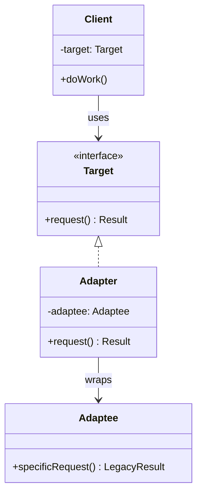

# Adapter Pattern

The Adapter pattern converts the interface of a class into another interface that clients expect. It allows incompatible interfaces to work together by wrapping an existing class with a new interface, acting as a translator between two systems that otherwise couldn't communicate directly.

## Intent

Legacy systems, third-party libraries, and external APIs often expose interfaces that don't match what your application expects. The Adapter pattern bridges this gap by introducing a wrapper that translates calls from one interface to another. This enables integration without modifying existing source code, preserving the Open/Closed Principle.

## Class Diagram



## Key Characteristics

- Converts one interface to another without modifying existing classes
- Enables collaboration between objects with incompatible interfaces
- Can be implemented as class adapter (inheritance) or object adapter (composition)
- Follows the Single Responsibility Principle by separating interface conversion logic
- Often used to integrate legacy systems with modern codebases

---

## Example 1: Fintech — Legacy Banking API Adapter

**Problem:** A modern fintech platform uses REST/JSON internally, but must integrate with a legacy core banking system that exposes a SOAP/XML interface for account queries and fund transfers.

**Solution:** An adapter wraps the legacy SOAP client, translating REST-style method calls into SOAP requests and converting XML responses back into domain objects the modern platform understands.

```python
# Python — Legacy Banking API Adapter
from dataclasses import dataclass

@dataclass
class AccountBalance:
    account_id: str
    balance: float
    currency: str

class LegacySoapBankingClient:
    def get_balance_xml(self, acct: str) -> str:
        return f"<Balance><Acct>{acct}</Acct><Amt>15420.50</Amt><Cur>USD</Cur></Balance>"

class BankingService:
    def get_balance(self, account_id: str) -> AccountBalance: ...

class BankingApiAdapter(BankingService):
    def __init__(self, legacy: LegacySoapBankingClient):
        self._legacy = legacy

    def get_balance(self, account_id: str) -> AccountBalance:
        xml = self._legacy.get_balance_xml(account_id)
        amt = float(xml.split("<Amt>")[1].split("</Amt>")[0])
        cur = xml.split("<Cur>")[1].split("</Cur>")[0]
        return AccountBalance(account_id=account_id, balance=amt, currency=cur)

# Usage
adapter = BankingApiAdapter(LegacySoapBankingClient())
print(adapter.get_balance("ACC-90210"))
```

```go
// Go — Legacy Banking API Adapter
package main

import "fmt"

type AccountBalance struct {
	AccountID string
	Balance   float64
	Currency  string
}

type BankingService interface {
	GetBalance(accountID string) AccountBalance
}

type LegacySoapClient struct{}

func (l *LegacySoapClient) GetBalanceXML(acct string) string {
	return fmt.Sprintf("<Balance><Acct>%s</Acct><Amt>15420.50</Amt><Cur>USD</Cur></Balance>", acct)
}

type BankingAPIAdapter struct {
	legacy *LegacySoapClient
}

func (a *BankingAPIAdapter) GetBalance(accountID string) AccountBalance {
	_ = a.legacy.GetBalanceXML(accountID)
	return AccountBalance{AccountID: accountID, Balance: 15420.50, Currency: "USD"}
}

func main() {
	adapter := &BankingAPIAdapter{legacy: &LegacySoapClient{}}
	fmt.Printf("%+v\n", adapter.GetBalance("ACC-90210"))
}
```

```java
// Java — Legacy Banking API Adapter
interface BankingService {
    AccountBalance getBalance(String accountId);
}

record AccountBalance(String accountId, double balance, String currency) {}

class LegacySoapBankingClient {
    String getBalanceXml(String acct) {
        return "<Balance><Acct>" + acct + "</Acct><Amt>15420.50</Amt><Cur>USD</Cur></Balance>";
    }
}

class BankingApiAdapter implements BankingService {
    private final LegacySoapBankingClient legacy;

    BankingApiAdapter(LegacySoapBankingClient legacy) { this.legacy = legacy; }

    public AccountBalance getBalance(String accountId) {
        String xml = legacy.getBalanceXml(accountId);
        double amt = Double.parseDouble(xml.split("<Amt>")[1].split("</Amt>")[0]);
        String cur = xml.split("<Cur>")[1].split("</Cur>")[0];
        return new AccountBalance(accountId, amt, cur);
    }
}
```

```typescript
// TypeScript — Legacy Banking API Adapter
interface AccountBalance {
  accountId: string;
  balance: number;
  currency: string;
}

interface BankingService {
  getBalance(accountId: string): AccountBalance;
}

class LegacySoapBankingClient {
  getBalanceXml(acct: string): string {
    return `<Balance><Acct>${acct}</Acct><Amt>15420.50</Amt><Cur>USD</Cur></Balance>`;
  }
}

class BankingApiAdapter implements BankingService {
  constructor(private legacy: LegacySoapBankingClient) {}

  getBalance(accountId: string): AccountBalance {
    const xml = this.legacy.getBalanceXml(accountId);
    const amt = parseFloat(xml.split("<Amt>")[1].split("</Amt>")[0]);
    const cur = xml.split("<Cur>")[1].split("</Cur>")[0];
    return { accountId, balance: amt, currency: cur };
  }
}

const adapter = new BankingApiAdapter(new LegacySoapBankingClient());
console.log(adapter.getBalance("ACC-90210"));
```

```rust
// Rust — Legacy Banking API Adapter
struct AccountBalance {
    account_id: String,
    balance: f64,
    currency: String,
}

trait BankingService {
    fn get_balance(&self, account_id: &str) -> AccountBalance;
}

struct LegacySoapBankingClient;

impl LegacySoapBankingClient {
    fn get_balance_xml(&self, acct: &str) -> String {
        format!("<Balance><Acct>{}</Acct><Amt>15420.50</Amt><Cur>USD</Cur></Balance>", acct)
    }
}

struct BankingApiAdapter {
    legacy: LegacySoapBankingClient,
}

impl BankingService for BankingApiAdapter {
    fn get_balance(&self, account_id: &str) -> AccountBalance {
        let xml = self.legacy.get_balance_xml(account_id);
        let amt: f64 = xml.split("<Amt>").nth(1).unwrap()
            .split("</Amt>").next().unwrap().parse().unwrap();
        let cur = xml.split("<Cur>").nth(1).unwrap()
            .split("</Cur>").next().unwrap().to_string();
        AccountBalance { account_id: account_id.to_string(), balance: amt, currency: cur }
    }
}

fn main() {
    let adapter = BankingApiAdapter { legacy: LegacySoapBankingClient };
    let b = adapter.get_balance("ACC-90210");
    println!("{} — {} {}", b.account_id, b.balance, b.currency);
}
```

---

## Example 2: Healthcare — HL7 to FHIR Data Format Adapter

**Problem:** A hospital's electronic health record (EHR) system emits patient data in HL7 v2 pipe-delimited format, but a new analytics platform requires FHIR-compliant JSON resources.

**Solution:** An adapter parses HL7 v2 messages and transforms them into FHIR Patient resources, enabling the analytics platform to consume data without changes to either system.

```python
# Python — HL7 to FHIR Adapter
from dataclasses import dataclass, field

@dataclass
class FhirPatient:
    resource_type: str = "Patient"
    id: str = ""
    family_name: str = ""
    given_name: str = ""
    birth_date: str = ""

class Hl7MessageParser:
    def parse_pid(self, raw: str) -> dict:
        parts = raw.split("|")
        return {"id": parts[1], "last": parts[2], "first": parts[3], "dob": parts[4]}

class FhirPatientSource:
    def get_patient(self, raw_msg: str) -> FhirPatient: ...

class Hl7ToFhirAdapter(FhirPatientSource):
    def __init__(self, parser: Hl7MessageParser):
        self._parser = parser

    def get_patient(self, raw_msg: str) -> FhirPatient:
        data = self._parser.parse_pid(raw_msg)
        return FhirPatient(
            id=data["id"], family_name=data["last"],
            given_name=data["first"], birth_date=data["dob"]
        )

adapter = Hl7ToFhirAdapter(Hl7MessageParser())
patient = adapter.get_patient("PID|P001|Smith|Jane|1985-03-15")
print(patient)
```

```go
// Go — HL7 to FHIR Adapter
package main

import (
	"fmt"
	"strings"
)

type FhirPatient struct {
	ResourceType string
	ID, FamilyName, GivenName, BirthDate string
}

type FhirPatientSource interface {
	GetPatient(rawMsg string) FhirPatient
}

type Hl7MessageParser struct{}

func (h *Hl7MessageParser) ParsePID(raw string) map[string]string {
	parts := strings.Split(raw, "|")
	return map[string]string{"id": parts[1], "last": parts[2], "first": parts[3], "dob": parts[4]}
}

type Hl7ToFhirAdapter struct {
	parser *Hl7MessageParser
}

func (a *Hl7ToFhirAdapter) GetPatient(rawMsg string) FhirPatient {
	data := a.parser.ParsePID(rawMsg)
	return FhirPatient{"Patient", data["id"], data["last"], data["first"], data["dob"]}
}

func main() {
	adapter := &Hl7ToFhirAdapter{parser: &Hl7MessageParser{}}
	fmt.Printf("%+v\n", adapter.GetPatient("PID|P001|Smith|Jane|1985-03-15"))
}
```

```java
// Java — HL7 to FHIR Adapter
interface FhirPatientSource {
    FhirPatient getPatient(String rawMsg);
}

record FhirPatient(String resourceType, String id, String familyName,
                   String givenName, String birthDate) {}

class Hl7MessageParser {
    Map<String, String> parsePid(String raw) {
        String[] parts = raw.split("\\|");
        return Map.of("id", parts[1], "last", parts[2], "first", parts[3], "dob", parts[4]);
    }
}

class Hl7ToFhirAdapter implements FhirPatientSource {
    private final Hl7MessageParser parser;

    Hl7ToFhirAdapter(Hl7MessageParser parser) { this.parser = parser; }

    public FhirPatient getPatient(String rawMsg) {
        var data = parser.parsePid(rawMsg);
        return new FhirPatient("Patient", data.get("id"),
            data.get("last"), data.get("first"), data.get("dob"));
    }
}
```

```typescript
// TypeScript — HL7 to FHIR Adapter
interface FhirPatient {
  resourceType: "Patient";
  id: string;
  familyName: string;
  givenName: string;
  birthDate: string;
}

interface FhirPatientSource {
  getPatient(rawMsg: string): FhirPatient;
}

class Hl7MessageParser {
  parsePid(raw: string): Record<string, string> {
    const [, id, last, first, dob] = raw.split("|");
    return { id, last, first, dob };
  }
}

class Hl7ToFhirAdapter implements FhirPatientSource {
  constructor(private parser: Hl7MessageParser) {}

  getPatient(rawMsg: string): FhirPatient {
    const d = this.parser.parsePid(rawMsg);
    return {
      resourceType: "Patient",
      id: d.id,
      familyName: d.last,
      givenName: d.first,
      birthDate: d.dob,
    };
  }
}

const adapter = new Hl7ToFhirAdapter(new Hl7MessageParser());
console.log(adapter.getPatient("PID|P001|Smith|Jane|1985-03-15"));
```

```rust
// Rust — HL7 to FHIR Adapter
struct FhirPatient {
    resource_type: String,
    id: String,
    family_name: String,
    given_name: String,
    birth_date: String,
}

trait FhirPatientSource {
    fn get_patient(&self, raw_msg: &str) -> FhirPatient;
}

struct Hl7MessageParser;

impl Hl7MessageParser {
    fn parse_pid(&self, raw: &str) -> Vec<&str> {
        raw.split('|').collect()
    }
}

struct Hl7ToFhirAdapter {
    parser: Hl7MessageParser,
}

impl FhirPatientSource for Hl7ToFhirAdapter {
    fn get_patient(&self, raw_msg: &str) -> FhirPatient {
        let parts = self.parser.parse_pid(raw_msg);
        FhirPatient {
            resource_type: "Patient".into(),
            id: parts[1].into(), family_name: parts[2].into(),
            given_name: parts[3].into(), birth_date: parts[4].into(),
        }
    }
}

fn main() {
    let adapter = Hl7ToFhirAdapter { parser: Hl7MessageParser };
    let p = adapter.get_patient("PID|P001|Smith|Jane|1985-03-15");
    println!("{}: {} {}, DOB {}", p.resource_type, p.given_name, p.family_name, p.birth_date);
}
```

---

## Example 3: E-Commerce — Third-Party Vendor API Integration Adapter

**Problem:** An e-commerce marketplace aggregates product catalogs from multiple vendors, each with a different API response schema (field names, pricing formats, availability flags).

**Solution:** A vendor adapter normalizes each vendor's response into a unified product listing format, allowing the marketplace to treat all vendors identically.

```python
# Python — Vendor API Integration Adapter
from dataclasses import dataclass

@dataclass
class UnifiedProduct:
    sku: str
    name: str
    price_cents: int
    in_stock: bool

class VendorAlphaApi:
    def fetch_item(self, item_code: str) -> dict:
        return {"code": item_code, "title": "Wireless Headset",
                "cost": "49.99", "available": "Y"}

class ProductSource:
    def get_product(self, sku: str) -> UnifiedProduct: ...

class VendorAlphaAdapter(ProductSource):
    def __init__(self, api: VendorAlphaApi):
        self._api = api

    def get_product(self, sku: str) -> UnifiedProduct:
        raw = self._api.fetch_item(sku)
        return UnifiedProduct(
            sku=raw["code"], name=raw["title"],
            price_cents=int(float(raw["cost"]) * 100),
            in_stock=raw["available"] == "Y"
        )

adapter = VendorAlphaAdapter(VendorAlphaApi())
print(adapter.get_product("WH-3001"))
```

```go
// Go — Vendor API Integration Adapter
package main

import "fmt"

type UnifiedProduct struct {
	SKU        string
	Name       string
	PriceCents int
	InStock    bool
}

type ProductSource interface {
	GetProduct(sku string) UnifiedProduct
}

type VendorAlphaAPI struct{}

func (v *VendorAlphaAPI) FetchItem(code string) map[string]string {
	return map[string]string{"code": code, "title": "Wireless Headset",
		"cost": "49.99", "available": "Y"}
}

type VendorAlphaAdapter struct {
	api *VendorAlphaAPI
}

func (a *VendorAlphaAdapter) GetProduct(sku string) UnifiedProduct {
	raw := a.api.FetchItem(sku)
	return UnifiedProduct{
		SKU: raw["code"], Name: raw["title"],
		PriceCents: 4999, InStock: raw["available"] == "Y",
	}
}

func main() {
	adapter := &VendorAlphaAdapter{api: &VendorAlphaAPI{}}
	fmt.Printf("%+v\n", adapter.GetProduct("WH-3001"))
}
```

```java
// Java — Vendor API Integration Adapter
interface ProductSource {
    UnifiedProduct getProduct(String sku);
}

record UnifiedProduct(String sku, String name, int priceCents, boolean inStock) {}

class VendorAlphaApi {
    Map<String, String> fetchItem(String code) {
        return Map.of("code", code, "title", "Wireless Headset",
                       "cost", "49.99", "available", "Y");
    }
}

class VendorAlphaAdapter implements ProductSource {
    private final VendorAlphaApi api;

    VendorAlphaAdapter(VendorAlphaApi api) { this.api = api; }

    public UnifiedProduct getProduct(String sku) {
        var raw = api.fetchItem(sku);
        return new UnifiedProduct(raw.get("code"), raw.get("title"),
            (int)(Double.parseDouble(raw.get("cost")) * 100),
            raw.get("available").equals("Y"));
    }
}
```

```typescript
// TypeScript — Vendor API Integration Adapter
interface UnifiedProduct {
  sku: string;
  name: string;
  priceCents: number;
  inStock: boolean;
}

interface ProductSource {
  getProduct(sku: string): UnifiedProduct;
}

class VendorAlphaApi {
  fetchItem(code: string): Record<string, string> {
    return { code, title: "Wireless Headset", cost: "49.99", available: "Y" };
  }
}

class VendorAlphaAdapter implements ProductSource {
  constructor(private api: VendorAlphaApi) {}

  getProduct(sku: string): UnifiedProduct {
    const raw = this.api.fetchItem(sku);
    return {
      sku: raw.code,
      name: raw.title,
      priceCents: Math.round(parseFloat(raw.cost) * 100),
      inStock: raw.available === "Y",
    };
  }
}

const adapter = new VendorAlphaAdapter(new VendorAlphaApi());
console.log(adapter.getProduct("WH-3001"));
```

```rust
// Rust — Vendor API Integration Adapter
use std::collections::HashMap;

struct UnifiedProduct {
    sku: String,
    name: String,
    price_cents: i32,
    in_stock: bool,
}

trait ProductSource {
    fn get_product(&self, sku: &str) -> UnifiedProduct;
}

struct VendorAlphaApi;

impl VendorAlphaApi {
    fn fetch_item(&self, code: &str) -> HashMap<String, String> {
        HashMap::from([
            ("code".into(), code.into()), ("title".into(), "Wireless Headset".into()),
            ("cost".into(), "49.99".into()), ("available".into(), "Y".into()),
        ])
    }
}

struct VendorAlphaAdapter { api: VendorAlphaApi }

impl ProductSource for VendorAlphaAdapter {
    fn get_product(&self, sku: &str) -> UnifiedProduct {
        let raw = self.api.fetch_item(sku);
        UnifiedProduct {
            sku: raw["code"].clone(), name: raw["title"].clone(),
            price_cents: (raw["cost"].parse::<f64>().unwrap() * 100.0) as i32,
            in_stock: raw["available"] == "Y",
        }
    }
}

fn main() {
    let adapter = VendorAlphaAdapter { api: VendorAlphaApi };
    let p = adapter.get_product("WH-3001");
    println!("{}: {} — {}¢ (in_stock: {})", p.sku, p.name, p.price_cents, p.in_stock);
}
```

---

## Example 4: Media Streaming — Audio Codec Format Adapter

**Problem:** A streaming platform's playback engine expects a unified audio frame interface, but incoming content is encoded in various codec formats (AAC, FLAC, Opus) with different decoding APIs.

**Solution:** Codec-specific adapters wrap each decoder library and expose a common `decode_frame` interface, letting the playback engine remain codec-agnostic.

```python
# Python — Audio Codec Adapter
from dataclasses import dataclass
from typing import List

@dataclass
class AudioFrame:
    sample_rate: int
    channels: int
    samples: List[float]

class AudioDecoder:
    def decode_frame(self, data: bytes) -> AudioFrame: ...

class FlacDecoderLib:
    def flac_decompress(self, raw: bytes) -> dict:
        return {"rate": 44100, "ch": 2, "pcm": [0.1, -0.2, 0.3]}

class FlacAdapter(AudioDecoder):
    def __init__(self, lib: FlacDecoderLib):
        self._lib = lib

    def decode_frame(self, data: bytes) -> AudioFrame:
        result = self._lib.flac_decompress(data)
        return AudioFrame(
            sample_rate=result["rate"],
            channels=result["ch"],
            samples=result["pcm"]
        )

adapter = FlacAdapter(FlacDecoderLib())
frame = adapter.decode_frame(b"\x00\x01\x02")
print(f"{frame.sample_rate}Hz, {frame.channels}ch, {len(frame.samples)} samples")
```

```go
// Go — Audio Codec Adapter
package main

import "fmt"

type AudioFrame struct {
	SampleRate int
	Channels   int
	Samples    []float64
}

type AudioDecoder interface {
	DecodeFrame(data []byte) AudioFrame
}

type FlacDecoderLib struct{}

func (f *FlacDecoderLib) FlacDecompress(raw []byte) (int, int, []float64) {
	return 44100, 2, []float64{0.1, -0.2, 0.3}
}

type FlacAdapter struct {
	lib *FlacDecoderLib
}

func (a *FlacAdapter) DecodeFrame(data []byte) AudioFrame {
	rate, ch, pcm := a.lib.FlacDecompress(data)
	return AudioFrame{SampleRate: rate, Channels: ch, Samples: pcm}
}

func main() {
	adapter := &FlacAdapter{lib: &FlacDecoderLib{}}
	frame := adapter.DecodeFrame([]byte{0, 1, 2})
	fmt.Printf("%dHz, %dch, %d samples\n", frame.SampleRate, frame.Channels, len(frame.Samples))
}
```

```java
// Java — Audio Codec Adapter
import java.util.List;

interface AudioDecoder {
    AudioFrame decodeFrame(byte[] data);
}

record AudioFrame(int sampleRate, int channels, List<Double> samples) {}

class FlacDecoderLib {
    record FlacResult(int rate, int ch, List<Double> pcm) {}

    FlacResult flacDecompress(byte[] raw) {
        return new FlacResult(44100, 2, List.of(0.1, -0.2, 0.3));
    }
}

class FlacAdapter implements AudioDecoder {
    private final FlacDecoderLib lib;

    FlacAdapter(FlacDecoderLib lib) { this.lib = lib; }

    public AudioFrame decodeFrame(byte[] data) {
        var r = lib.flacDecompress(data);
        return new AudioFrame(r.rate(), r.ch(), r.pcm());
    }
}
```

```typescript
// TypeScript — Audio Codec Adapter
interface AudioFrame {
  sampleRate: number;
  channels: number;
  samples: number[];
}

interface AudioDecoder {
  decodeFrame(data: Uint8Array): AudioFrame;
}

class FlacDecoderLib {
  flacDecompress(raw: Uint8Array): { rate: number; ch: number; pcm: number[] } {
    return { rate: 44100, ch: 2, pcm: [0.1, -0.2, 0.3] };
  }
}

class FlacAdapter implements AudioDecoder {
  constructor(private lib: FlacDecoderLib) {}

  decodeFrame(data: Uint8Array): AudioFrame {
    const r = this.lib.flacDecompress(data);
    return { sampleRate: r.rate, channels: r.ch, samples: r.pcm };
  }
}

const adapter = new FlacAdapter(new FlacDecoderLib());
const frame = adapter.decodeFrame(new Uint8Array([0, 1, 2]));
console.log(
  `${frame.sampleRate}Hz, ${frame.channels}ch, ${frame.samples.length} samples`,
);
```

```rust
// Rust — Audio Codec Adapter
struct AudioFrame {
    sample_rate: u32,
    channels: u8,
    samples: Vec<f64>,
}

trait AudioDecoder {
    fn decode_frame(&self, data: &[u8]) -> AudioFrame;
}

struct FlacDecoderLib;

impl FlacDecoderLib {
    fn flac_decompress(&self, _raw: &[u8]) -> (u32, u8, Vec<f64>) {
        (44100, 2, vec![0.1, -0.2, 0.3])
    }
}

struct FlacAdapter {
    lib: FlacDecoderLib,
}

impl AudioDecoder for FlacAdapter {
    fn decode_frame(&self, data: &[u8]) -> AudioFrame {
        let (rate, ch, pcm) = self.lib.flac_decompress(data);
        AudioFrame { sample_rate: rate, channels: ch, samples: pcm }
    }
}

fn main() {
    let adapter = FlacAdapter { lib: FlacDecoderLib };
    let frame = adapter.decode_frame(&[0, 1, 2]);
    println!("{}Hz, {}ch, {} samples", frame.sample_rate, frame.channels, frame.samples.len());
}
```

---

## Example 5: Logistics — GPS Coordinate System Adapter

**Problem:** A logistics platform receives location data from multiple mapping providers (Google Maps, HERE, OpenStreetMap) that return coordinates in slightly different structures and reference systems.

**Solution:** Provider-specific adapters normalize each provider's location response into a unified coordinate type, enabling route planning to be provider-agnostic.

```python
# Python — GPS Coordinate System Adapter
from dataclasses import dataclass

@dataclass
class UnifiedCoordinate:
    latitude: float
    longitude: float
    altitude_m: float
    provider: str

class CoordinateSource:
    def get_location(self, address: str) -> UnifiedCoordinate: ...

class HereMapsApi:
    def geocode(self, query: str) -> dict:
        return {"position": {"lat": 40.7128, "lng": -74.0060},
                "elevation": 10.5, "resultType": "houseNumber"}

class HereMapsAdapter(CoordinateSource):
    def __init__(self, api: HereMapsApi):
        self._api = api

    def get_location(self, address: str) -> UnifiedCoordinate:
        resp = self._api.geocode(address)
        pos = resp["position"]
        return UnifiedCoordinate(
            latitude=pos["lat"], longitude=pos["lng"],
            altitude_m=resp.get("elevation", 0.0), provider="HERE"
        )

adapter = HereMapsAdapter(HereMapsApi())
print(adapter.get_location("350 5th Ave, New York"))
```

```go
// Go — GPS Coordinate System Adapter
package main

import "fmt"

type UnifiedCoordinate struct {
	Latitude, Longitude, AltitudeM float64
	Provider                       string
}

type CoordinateSource interface {
	GetLocation(address string) UnifiedCoordinate
}

type HereMapsAPI struct{}

func (h *HereMapsAPI) Geocode(query string) (float64, float64, float64) {
	return 40.7128, -74.0060, 10.5
}

type HereMapsAdapter struct {
	api *HereMapsAPI
}

func (a *HereMapsAdapter) GetLocation(address string) UnifiedCoordinate {
	lat, lng, alt := a.api.Geocode(address)
	return UnifiedCoordinate{Latitude: lat, Longitude: lng, AltitudeM: alt, Provider: "HERE"}
}

func main() {
	adapter := &HereMapsAdapter{api: &HereMapsAPI{}}
	fmt.Printf("%+v\n", adapter.GetLocation("350 5th Ave, New York"))
}
```

```java
// Java — GPS Coordinate System Adapter
interface CoordinateSource {
    UnifiedCoordinate getLocation(String address);
}

record UnifiedCoordinate(double latitude, double longitude,
                         double altitudeM, String provider) {}

class HereMapsApi {
    record HereResult(double lat, double lng, double elevation) {}

    HereResult geocode(String query) {
        return new HereResult(40.7128, -74.0060, 10.5);
    }
}

class HereMapsAdapter implements CoordinateSource {
    private final HereMapsApi api;

    HereMapsAdapter(HereMapsApi api) { this.api = api; }

    public UnifiedCoordinate getLocation(String address) {
        var r = api.geocode(address);
        return new UnifiedCoordinate(r.lat(), r.lng(), r.elevation(), "HERE");
    }
}
```

```typescript
// TypeScript — GPS Coordinate System Adapter
interface UnifiedCoordinate {
  latitude: number;
  longitude: number;
  altitudeM: number;
  provider: string;
}

interface CoordinateSource {
  getLocation(address: string): UnifiedCoordinate;
}

class HereMapsApi {
  geocode(query: string): { lat: number; lng: number; elevation: number } {
    return { lat: 40.7128, lng: -74.006, elevation: 10.5 };
  }
}

class HereMapsAdapter implements CoordinateSource {
  constructor(private api: HereMapsApi) {}

  getLocation(address: string): UnifiedCoordinate {
    const r = this.api.geocode(address);
    return {
      latitude: r.lat,
      longitude: r.lng,
      altitudeM: r.elevation,
      provider: "HERE",
    };
  }
}

const adapter = new HereMapsAdapter(new HereMapsApi());
console.log(adapter.getLocation("350 5th Ave, New York"));
```

```rust
// Rust — GPS Coordinate System Adapter
struct UnifiedCoordinate {
    latitude: f64,
    longitude: f64,
    altitude_m: f64,
    provider: String,
}

trait CoordinateSource {
    fn get_location(&self, address: &str) -> UnifiedCoordinate;
}

struct HereMapsApi;

impl HereMapsApi {
    fn geocode(&self, _query: &str) -> (f64, f64, f64) {
        (40.7128, -74.0060, 10.5)
    }
}

struct HereMapsAdapter {
    api: HereMapsApi,
}

impl CoordinateSource for HereMapsAdapter {
    fn get_location(&self, address: &str) -> UnifiedCoordinate {
        let (lat, lng, alt) = self.api.geocode(address);
        UnifiedCoordinate {
            latitude: lat, longitude: lng,
            altitude_m: alt, provider: "HERE".into(),
        }
    }
}

fn main() {
    let adapter = HereMapsAdapter { api: HereMapsApi };
    let c = adapter.get_location("350 5th Ave, New York");
    println!("{:.4}, {:.4} ({}m) via {}", c.latitude, c.longitude, c.altitude_m, c.provider);
}
```

---

## Summary

| Aspect               | Details                                                                                                                                           |
| -------------------- | ------------------------------------------------------------------------------------------------------------------------------------------------- |
| **Pattern Type**     | Structural                                                                                                                                        |
| **Key Benefit**      | Enables integration of incompatible interfaces without modifying existing code                                                                    |
| **Common Pitfall**   | Creating overly complex adapters that add unnecessary abstraction layers                                                                          |
| **Related Patterns** | Bridge (separates abstraction from implementation), Decorator (adds behavior without changing interface), Facade (simplifies a complex subsystem) |
