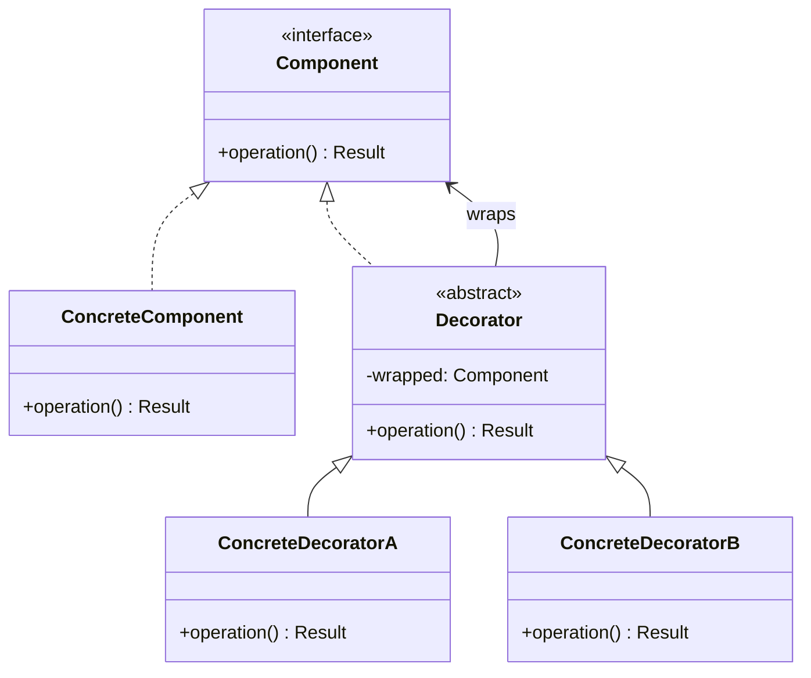

# Decorator Pattern

The Decorator pattern attaches additional responsibilities to an object dynamically. It provides a flexible alternative to subclassing for extending functionality by wrapping objects in a chain of decorator layers, each adding its own behavior while preserving the original interface.

## Intent

When functionality needs to be added to individual objects rather than an entire class, inheritance quickly leads to a combinatorial explosion of subclasses. The Decorator pattern solves this by allowing behaviors to be composed at runtime through a series of wrapper objects. Each decorator implements the same interface as the component it wraps, enabling transparent layering.

## Class Diagram



## Key Characteristics

- Adds responsibilities to objects dynamically without affecting other objects
- Decorators and components share a common interface for transparent wrapping
- Multiple decorators can be stacked in any combination
- Follows Open/Closed Principle — extend behavior without modifying existing code
- Preferred over subclassing when many independent extensions are possible

---

## Example 1: Fintech — Transaction Fee Layer Decorator

**Problem:** A payment processor must apply varying fees to transactions — base processing fees, cross-border surcharges, and currency conversion fees — in different combinations depending on the transaction type.

**Solution:** Each fee type is implemented as a decorator wrapping the base transaction processor. Fees are composed at runtime, stacking only the applicable charges.

```python
# Python — Transaction Fee Decorator
from abc import ABC, abstractmethod

class TransactionProcessor(ABC):
    @abstractmethod
    def process(self, amount_cents: int) -> dict:
        pass

class BaseProcessor(TransactionProcessor):
    def process(self, amount_cents: int) -> dict:
        return {"amount": amount_cents, "fees": 0, "description": ["base"]}

class CrossBorderFeeDecorator(TransactionProcessor):
    def __init__(self, wrapped: TransactionProcessor, rate: float = 0.015):
        self._wrapped = wrapped
        self._rate = rate

    def process(self, amount_cents: int) -> dict:
        result = self._wrapped.process(amount_cents)
        fee = int(amount_cents * self._rate)
        result["fees"] += fee
        result["description"].append(f"cross-border({fee}¢)")
        return result

class CurrencyConversionDecorator(TransactionProcessor):
    def __init__(self, wrapped: TransactionProcessor, rate: float = 0.025):
        self._wrapped = wrapped
        self._rate = rate

    def process(self, amount_cents: int) -> dict:
        result = self._wrapped.process(amount_cents)
        fee = int(amount_cents * self._rate)
        result["fees"] += fee
        result["description"].append(f"fx-conversion({fee}¢)")
        return result

processor = CurrencyConversionDecorator(CrossBorderFeeDecorator(BaseProcessor()))
print(processor.process(100_00))
```

```go
// Go — Transaction Fee Decorator
package main

import "fmt"

type TransactionResult struct {
	Amount, Fees int
	Desc         []string
}

type TransactionProcessor interface {
	Process(amountCents int) TransactionResult
}

type BaseProcessor struct{}

func (b *BaseProcessor) Process(amountCents int) TransactionResult {
	return TransactionResult{Amount: amountCents, Fees: 0, Desc: []string{"base"}}
}

type CrossBorderDecorator struct {
	wrapped TransactionProcessor
	rate    float64
}

func (d *CrossBorderDecorator) Process(amountCents int) TransactionResult {
	r := d.wrapped.Process(amountCents)
	fee := int(float64(amountCents) * d.rate)
	r.Fees += fee
	r.Desc = append(r.Desc, fmt.Sprintf("cross-border(%d¢)", fee))
	return r
}

type CurrencyConvDecorator struct {
	wrapped TransactionProcessor
	rate    float64
}

func (d *CurrencyConvDecorator) Process(amountCents int) TransactionResult {
	r := d.wrapped.Process(amountCents)
	fee := int(float64(amountCents) * d.rate)
	r.Fees += fee
	r.Desc = append(r.Desc, fmt.Sprintf("fx(%d¢)", fee))
	return r
}

func main() {
	p := &CurrencyConvDecorator{rate: 0.025,
		wrapped: &CrossBorderDecorator{rate: 0.015, wrapped: &BaseProcessor{}}}
	fmt.Printf("%+v\n", p.Process(10000))
}
```

```java
// Java — Transaction Fee Decorator
import java.util.*;

interface TransactionProcessor {
    Map<String, Object> process(int amountCents);
}

class BaseProcessor implements TransactionProcessor {
    public Map<String, Object> process(int amountCents) {
        Map<String, Object> r = new HashMap<>();
        r.put("amount", amountCents);
        r.put("fees", 0);
        r.put("desc", new ArrayList<>(List.of("base")));
        return r;
    }
}

class CrossBorderDecorator implements TransactionProcessor {
    private final TransactionProcessor wrapped;
    private final double rate;

    CrossBorderDecorator(TransactionProcessor wrapped, double rate) {
        this.wrapped = wrapped; this.rate = rate;
    }

    public Map<String, Object> process(int amountCents) {
        var r = wrapped.process(amountCents);
        int fee = (int)(amountCents * rate);
        r.put("fees", (int)r.get("fees") + fee);
        ((List<String>)r.get("desc")).add("cross-border(" + fee + "¢)");
        return r;
    }
}

class CurrencyConvDecorator implements TransactionProcessor {
    private final TransactionProcessor wrapped;
    private final double rate;

    CurrencyConvDecorator(TransactionProcessor wrapped, double rate) {
        this.wrapped = wrapped; this.rate = rate;
    }

    public Map<String, Object> process(int amountCents) {
        var r = wrapped.process(amountCents);
        int fee = (int)(amountCents * rate);
        r.put("fees", (int)r.get("fees") + fee);
        ((List<String>)r.get("desc")).add("fx(" + fee + "¢)");
        return r;
    }
}
```

```typescript
// TypeScript — Transaction Fee Decorator
interface TxResult {
  amount: number;
  fees: number;
  desc: string[];
}

interface TransactionProcessor {
  process(amountCents: number): TxResult;
}

class BaseProcessor implements TransactionProcessor {
  process(amountCents: number): TxResult {
    return { amount: amountCents, fees: 0, desc: ["base"] };
  }
}

class CrossBorderDecorator implements TransactionProcessor {
  constructor(private wrapped: TransactionProcessor, private rate = 0.015) {}

  process(amountCents: number): TxResult {
    const r = this.wrapped.process(amountCents);
    const fee = Math.round(amountCents * this.rate);
    r.fees += fee;
    r.desc.push(`cross-border(${fee}¢)`);
    return r;
  }
}

class CurrencyConvDecorator implements TransactionProcessor {
  constructor(private wrapped: TransactionProcessor, private rate = 0.025) {}

  process(amountCents: number): TxResult {
    const r = this.wrapped.process(amountCents);
    const fee = Math.round(amountCents * this.rate);
    r.fees += fee;
    r.desc.push(`fx(${fee}¢)`);
    return r;
  }
}

const p = new CurrencyConvDecorator(
  new CrossBorderDecorator(new BaseProcessor()),
);
console.log(p.process(10000));
```

```rust
// Rust — Transaction Fee Decorator
struct TxResult {
    amount: i64,
    fees: i64,
    desc: Vec<String>,
}

trait TransactionProcessor {
    fn process(&self, amount_cents: i64) -> TxResult;
}

struct BaseProcessor;
impl TransactionProcessor for BaseProcessor {
    fn process(&self, amount_cents: i64) -> TxResult {
        TxResult { amount: amount_cents, fees: 0, desc: vec!["base".into()] }
    }
}

struct CrossBorderDecorator { wrapped: Box<dyn TransactionProcessor>, rate: f64 }
impl TransactionProcessor for CrossBorderDecorator {
    fn process(&self, amount_cents: i64) -> TxResult {
        let mut r = self.wrapped.process(amount_cents);
        let fee = (amount_cents as f64 * self.rate) as i64;
        r.fees += fee;
        r.desc.push(format!("cross-border({}¢)", fee));
        r
    }
}

struct CurrencyConvDecorator { wrapped: Box<dyn TransactionProcessor>, rate: f64 }
impl TransactionProcessor for CurrencyConvDecorator {
    fn process(&self, amount_cents: i64) -> TxResult {
        let mut r = self.wrapped.process(amount_cents);
        let fee = (amount_cents as f64 * self.rate) as i64;
        r.fees += fee;
        r.desc.push(format!("fx({}¢)", fee));
        r
    }
}

fn main() {
    let p = CurrencyConvDecorator { rate: 0.025, wrapped: Box::new(
        CrossBorderDecorator { rate: 0.015, wrapped: Box::new(BaseProcessor) })};
    let r = p.process(10000);
    println!("fees: {}¢, layers: {:?}", r.fees, r.desc);
}
```

---

## Example 2: Healthcare — Medical Alert Notification Decorator

**Problem:** A hospital notification system must send patient alerts with varying urgency levels — standard alerts may need SMS escalation, pager dispatch, or overhead PA announcements depending on severity.

**Solution:** Each escalation channel is a decorator. Alert urgency is composed by stacking notification decorators so a critical alert automatically triggers all escalation layers.

```python
# Python — Medical Alert Decorator
from abc import ABC, abstractmethod

class AlertNotifier(ABC):
    @abstractmethod
    def send(self, patient_id: str, message: str) -> list[str]:
        pass

class BaseAlertNotifier(AlertNotifier):
    def send(self, patient_id: str, message: str) -> list[str]:
        return [f"EMR-dashboard({patient_id}): {message}"]

class SmsEscalationDecorator(AlertNotifier):
    def __init__(self, wrapped: AlertNotifier):
        self._wrapped = wrapped

    def send(self, patient_id: str, message: str) -> list[str]:
        channels = self._wrapped.send(patient_id, message)
        channels.append(f"SMS-oncall({patient_id}): {message}")
        return channels

class PagerEscalationDecorator(AlertNotifier):
    def __init__(self, wrapped: AlertNotifier):
        self._wrapped = wrapped

    def send(self, patient_id: str, message: str) -> list[str]:
        channels = self._wrapped.send(patient_id, message)
        channels.append(f"Pager-attending({patient_id}): URGENT {message}")
        return channels

critical = PagerEscalationDecorator(SmsEscalationDecorator(BaseAlertNotifier()))
for ch in critical.send("PT-4421", "Cardiac arrest detected"):
    print(ch)
```

```go
// Go — Medical Alert Decorator
package main

import "fmt"

type AlertNotifier interface {
	Send(patientID, message string) []string
}

type BaseAlertNotifier struct{}

func (b *BaseAlertNotifier) Send(pid, msg string) []string {
	return []string{fmt.Sprintf("EMR-dashboard(%s): %s", pid, msg)}
}

type SmsEscalation struct{ wrapped AlertNotifier }

func (s *SmsEscalation) Send(pid, msg string) []string {
	ch := s.wrapped.Send(pid, msg)
	return append(ch, fmt.Sprintf("SMS-oncall(%s): %s", pid, msg))
}

type PagerEscalation struct{ wrapped AlertNotifier }

func (p *PagerEscalation) Send(pid, msg string) []string {
	ch := p.wrapped.Send(pid, msg)
	return append(ch, fmt.Sprintf("Pager-attending(%s): URGENT %s", pid, msg))
}

func main() {
	notifier := &PagerEscalation{wrapped: &SmsEscalation{wrapped: &BaseAlertNotifier{}}}
	for _, ch := range notifier.Send("PT-4421", "Cardiac arrest detected") {
		fmt.Println(ch)
	}
}
```

```java
// Java — Medical Alert Decorator
import java.util.*;

interface AlertNotifier {
    List<String> send(String patientId, String message);
}

class BaseAlertNotifier implements AlertNotifier {
    public List<String> send(String pid, String msg) {
        return new ArrayList<>(List.of("EMR-dashboard(" + pid + "): " + msg));
    }
}

class SmsEscalation implements AlertNotifier {
    private final AlertNotifier wrapped;
    SmsEscalation(AlertNotifier wrapped) { this.wrapped = wrapped; }

    public List<String> send(String pid, String msg) {
        var ch = wrapped.send(pid, msg);
        ch.add("SMS-oncall(" + pid + "): " + msg);
        return ch;
    }
}

class PagerEscalation implements AlertNotifier {
    private final AlertNotifier wrapped;
    PagerEscalation(AlertNotifier wrapped) { this.wrapped = wrapped; }

    public List<String> send(String pid, String msg) {
        var ch = wrapped.send(pid, msg);
        ch.add("Pager-attending(" + pid + "): URGENT " + msg);
        return ch;
    }
}
```

```typescript
// TypeScript — Medical Alert Decorator
interface AlertNotifier {
  send(patientId: string, message: string): string[];
}

class BaseAlertNotifier implements AlertNotifier {
  send(pid: string, msg: string): string[] {
    return [`EMR-dashboard(${pid}): ${msg}`];
  }
}

class SmsEscalation implements AlertNotifier {
  constructor(private wrapped: AlertNotifier) {}

  send(pid: string, msg: string): string[] {
    const ch = this.wrapped.send(pid, msg);
    ch.push(`SMS-oncall(${pid}): ${msg}`);
    return ch;
  }
}

class PagerEscalation implements AlertNotifier {
  constructor(private wrapped: AlertNotifier) {}

  send(pid: string, msg: string): string[] {
    const ch = this.wrapped.send(pid, msg);
    ch.push(`Pager-attending(${pid}): URGENT ${msg}`);
    return ch;
  }
}

const critical = new PagerEscalation(
  new SmsEscalation(new BaseAlertNotifier()),
);
critical
  .send("PT-4421", "Cardiac arrest detected")
  .forEach((c) => console.log(c));
```

```rust
// Rust — Medical Alert Decorator
trait AlertNotifier {
    fn send(&self, patient_id: &str, message: &str) -> Vec<String>;
}

struct BaseAlertNotifier;
impl AlertNotifier for BaseAlertNotifier {
    fn send(&self, pid: &str, msg: &str) -> Vec<String> {
        vec![format!("EMR-dashboard({}): {}", pid, msg)]
    }
}

struct SmsEscalation { wrapped: Box<dyn AlertNotifier> }
impl AlertNotifier for SmsEscalation {
    fn send(&self, pid: &str, msg: &str) -> Vec<String> {
        let mut ch = self.wrapped.send(pid, msg);
        ch.push(format!("SMS-oncall({}): {}", pid, msg));
        ch
    }
}

struct PagerEscalation { wrapped: Box<dyn AlertNotifier> }
impl AlertNotifier for PagerEscalation {
    fn send(&self, pid: &str, msg: &str) -> Vec<String> {
        let mut ch = self.wrapped.send(pid, msg);
        ch.push(format!("Pager-attending({}): URGENT {}", pid, msg));
        ch
    }
}

fn main() {
    let notifier = PagerEscalation { wrapped: Box::new(
        SmsEscalation { wrapped: Box::new(BaseAlertNotifier) })};
    for ch in notifier.send("PT-4421", "Cardiac arrest detected") {
        println!("{}", ch);
    }
}
```

---

## Example 3: E-Commerce — Order Enhancement Decorator

**Problem:** An order system needs to support optional enhancements — gift wrapping, express shipping, and shipment insurance — in any combination, each contributing additional cost and description.

**Solution:** Each enhancement is a decorator around the base order. The total cost and description accumulate as decorators are stacked.

```python
# Python — Order Enhancement Decorator
from abc import ABC, abstractmethod

class Order(ABC):
    @abstractmethod
    def cost_cents(self) -> int: ...
    @abstractmethod
    def description(self) -> str: ...

class BaseOrder(Order):
    def __init__(self, item: str, price_cents: int):
        self._item = item
        self._price = price_cents
    def cost_cents(self) -> int: return self._price
    def description(self) -> str: return self._item

class GiftWrapDecorator(Order):
    def __init__(self, order: Order):
        self._order = order
    def cost_cents(self) -> int: return self._order.cost_cents() + 499
    def description(self) -> str: return f"{self._order.description()} + gift-wrap"

class ExpressShippingDecorator(Order):
    def __init__(self, order: Order):
        self._order = order
    def cost_cents(self) -> int: return self._order.cost_cents() + 1299
    def description(self) -> str: return f"{self._order.description()} + express"

class InsuranceDecorator(Order):
    def __init__(self, order: Order):
        self._order = order
    def cost_cents(self) -> int: return self._order.cost_cents() + 350
    def description(self) -> str: return f"{self._order.description()} + insured"

order = InsuranceDecorator(ExpressShippingDecorator(GiftWrapDecorator(
    BaseOrder("Bluetooth Speaker", 3999))))
print(f"{order.description()} = {order.cost_cents()}¢")
```

```go
// Go — Order Enhancement Decorator
package main

import "fmt"

type Order interface {
	CostCents() int
	Description() string
}

type BaseOrder struct {
	Item       string
	PriceCents int
}

func (b *BaseOrder) CostCents() int    { return b.PriceCents }
func (b *BaseOrder) Description() string { return b.Item }

type GiftWrap struct{ order Order }
func (g *GiftWrap) CostCents() int    { return g.order.CostCents() + 499 }
func (g *GiftWrap) Description() string { return g.order.Description() + " + gift-wrap" }

type ExpressShipping struct{ order Order }
func (e *ExpressShipping) CostCents() int    { return e.order.CostCents() + 1299 }
func (e *ExpressShipping) Description() string { return e.order.Description() + " + express" }

type Insurance struct{ order Order }
func (i *Insurance) CostCents() int    { return i.order.CostCents() + 350 }
func (i *Insurance) Description() string { return i.order.Description() + " + insured" }

func main() {
	o := &Insurance{&ExpressShipping{&GiftWrap{&BaseOrder{"Bluetooth Speaker", 3999}}}}
	fmt.Printf("%s = %d¢\n", o.Description(), o.CostCents())
}
```

```java
// Java — Order Enhancement Decorator
interface Order {
    int costCents();
    String description();
}

record BaseOrder(String item, int priceCents) implements Order {
    public int costCents() { return priceCents; }
    public String description() { return item; }
}

class GiftWrap implements Order {
    private final Order order;
    GiftWrap(Order order) { this.order = order; }
    public int costCents() { return order.costCents() + 499; }
    public String description() { return order.description() + " + gift-wrap"; }
}

class ExpressShipping implements Order {
    private final Order order;
    ExpressShipping(Order order) { this.order = order; }
    public int costCents() { return order.costCents() + 1299; }
    public String description() { return order.description() + " + express"; }
}

class ShipmentInsurance implements Order {
    private final Order order;
    ShipmentInsurance(Order order) { this.order = order; }
    public int costCents() { return order.costCents() + 350; }
    public String description() { return order.description() + " + insured"; }
}
```

```typescript
// TypeScript — Order Enhancement Decorator
interface Order {
  costCents(): number;
  description(): string;
}

class BaseOrder implements Order {
  constructor(private item: string, private priceCents: number) {}
  costCents(): number {
    return this.priceCents;
  }
  description(): string {
    return this.item;
  }
}

class GiftWrap implements Order {
  constructor(private order: Order) {}
  costCents(): number {
    return this.order.costCents() + 499;
  }
  description(): string {
    return `${this.order.description()} + gift-wrap`;
  }
}

class ExpressShipping implements Order {
  constructor(private order: Order) {}
  costCents(): number {
    return this.order.costCents() + 1299;
  }
  description(): string {
    return `${this.order.description()} + express`;
  }
}

class ShipmentInsurance implements Order {
  constructor(private order: Order) {}
  costCents(): number {
    return this.order.costCents() + 350;
  }
  description(): string {
    return `${this.order.description()} + insured`;
  }
}

const o = new ShipmentInsurance(
  new ExpressShipping(new GiftWrap(new BaseOrder("Bluetooth Speaker", 3999))),
);
console.log(`${o.description()} = ${o.costCents()}¢`);
```

```rust
// Rust — Order Enhancement Decorator
trait Order {
    fn cost_cents(&self) -> i32;
    fn description(&self) -> String;
}

struct BaseOrder { item: String, price_cents: i32 }
impl Order for BaseOrder {
    fn cost_cents(&self) -> i32 { self.price_cents }
    fn description(&self) -> String { self.item.clone() }
}

struct GiftWrap { order: Box<dyn Order> }
impl Order for GiftWrap {
    fn cost_cents(&self) -> i32 { self.order.cost_cents() + 499 }
    fn description(&self) -> String { format!("{} + gift-wrap", self.order.description()) }
}

struct ExpressShipping { order: Box<dyn Order> }
impl Order for ExpressShipping {
    fn cost_cents(&self) -> i32 { self.order.cost_cents() + 1299 }
    fn description(&self) -> String { format!("{} + express", self.order.description()) }
}

struct Insurance { order: Box<dyn Order> }
impl Order for Insurance {
    fn cost_cents(&self) -> i32 { self.order.cost_cents() + 350 }
    fn description(&self) -> String { format!("{} + insured", self.order.description()) }
}

fn main() {
    let o = Insurance { order: Box::new(ExpressShipping { order: Box::new(
        GiftWrap { order: Box::new(BaseOrder { item: "Bluetooth Speaker".into(), price_cents: 3999 })})})};
    println!("{} = {}¢", o.description(), o.cost_cents());
}
```

---

## Example 4: Media Streaming — Video Filter/Effects Pipeline Decorator

**Problem:** A video streaming editor lets users apply filters — brightness adjustment, color grading, watermarking — in any order and combination to a video frame before rendering.

**Solution:** Each filter is a decorator wrapping a video frame processor. Filters stack to form a pipeline, each transforming the frame data in sequence.

```python
# Python — Video Filter Pipeline Decorator
from abc import ABC, abstractmethod
from dataclasses import dataclass, field

@dataclass
class VideoFrame:
    width: int
    height: int
    brightness: float = 1.0
    filters_applied: list = field(default_factory=list)

class FrameProcessor(ABC):
    @abstractmethod
    def render(self, frame: VideoFrame) -> VideoFrame: ...

class RawFrameProcessor(FrameProcessor):
    def render(self, frame: VideoFrame) -> VideoFrame:
        frame.filters_applied.append("raw")
        return frame

class BrightnessFilter(FrameProcessor):
    def __init__(self, wrapped: FrameProcessor, factor: float):
        self._wrapped, self._factor = wrapped, factor
    def render(self, frame: VideoFrame) -> VideoFrame:
        frame = self._wrapped.render(frame)
        frame.brightness *= self._factor
        frame.filters_applied.append(f"brightness({self._factor})")
        return frame

class WatermarkFilter(FrameProcessor):
    def __init__(self, wrapped: FrameProcessor, text: str):
        self._wrapped, self._text = wrapped, text
    def render(self, frame: VideoFrame) -> VideoFrame:
        frame = self._wrapped.render(frame)
        frame.filters_applied.append(f"watermark({self._text})")
        return frame

pipeline = WatermarkFilter(BrightnessFilter(RawFrameProcessor(), 1.3), "© StreamCo")
result = pipeline.render(VideoFrame(1920, 1080))
print(result.filters_applied, f"brightness={result.brightness:.1f}")
```

```go
// Go — Video Filter Pipeline Decorator
package main

import "fmt"

type VideoFrame struct {
	Width, Height  int
	Brightness     float64
	FiltersApplied []string
}

type FrameProcessor interface {
	Render(frame *VideoFrame) *VideoFrame
}

type RawProcessor struct{}

func (r *RawProcessor) Render(f *VideoFrame) *VideoFrame {
	f.FiltersApplied = append(f.FiltersApplied, "raw")
	return f
}

type BrightnessFilter struct {
	wrapped FrameProcessor
	factor  float64
}

func (b *BrightnessFilter) Render(f *VideoFrame) *VideoFrame {
	f = b.wrapped.Render(f)
	f.Brightness *= b.factor
	f.FiltersApplied = append(f.FiltersApplied, fmt.Sprintf("brightness(%.1f)", b.factor))
	return f
}

type WatermarkFilter struct {
	wrapped FrameProcessor
	text    string
}

func (w *WatermarkFilter) Render(f *VideoFrame) *VideoFrame {
	f = w.wrapped.Render(f)
	f.FiltersApplied = append(f.FiltersApplied, "watermark("+w.text+")")
	return f
}

func main() {
	p := &WatermarkFilter{text: "© StreamCo", wrapped: &BrightnessFilter{
		factor: 1.3, wrapped: &RawProcessor{}}}
	frame := p.Render(&VideoFrame{Width: 1920, Height: 1080, Brightness: 1.0})
	fmt.Println(frame.FiltersApplied, frame.Brightness)
}
```

```java
// Java — Video Filter Pipeline Decorator
import java.util.*;

interface FrameProcessor { VideoFrame render(VideoFrame frame); }

class VideoFrame {
    int width, height;
    double brightness;
    List<String> filtersApplied = new ArrayList<>();

    VideoFrame(int w, int h) { width = w; height = h; brightness = 1.0; }
}

class RawProcessor implements FrameProcessor {
    public VideoFrame render(VideoFrame f) { f.filtersApplied.add("raw"); return f; }
}

class BrightnessFilter implements FrameProcessor {
    private final FrameProcessor wrapped;
    private final double factor;
    BrightnessFilter(FrameProcessor w, double f) { wrapped = w; factor = f; }

    public VideoFrame render(VideoFrame f) {
        f = wrapped.render(f);
        f.brightness *= factor;
        f.filtersApplied.add("brightness(" + factor + ")");
        return f;
    }
}

class WatermarkFilter implements FrameProcessor {
    private final FrameProcessor wrapped;
    private final String text;
    WatermarkFilter(FrameProcessor w, String t) { wrapped = w; text = t; }

    public VideoFrame render(VideoFrame f) {
        f = wrapped.render(f);
        f.filtersApplied.add("watermark(" + text + ")");
        return f;
    }
}
```

```typescript
// TypeScript — Video Filter Pipeline Decorator
interface VideoFrame {
  width: number;
  height: number;
  brightness: number;
  filtersApplied: string[];
}

interface FrameProcessor {
  render(frame: VideoFrame): VideoFrame;
}

class RawProcessor implements FrameProcessor {
  render(f: VideoFrame): VideoFrame {
    f.filtersApplied.push("raw");
    return f;
  }
}

class BrightnessFilter implements FrameProcessor {
  constructor(private wrapped: FrameProcessor, private factor: number) {}
  render(f: VideoFrame): VideoFrame {
    f = this.wrapped.render(f);
    f.brightness *= this.factor;
    f.filtersApplied.push(`brightness(${this.factor})`);
    return f;
  }
}

class WatermarkFilter implements FrameProcessor {
  constructor(private wrapped: FrameProcessor, private text: string) {}
  render(f: VideoFrame): VideoFrame {
    f = this.wrapped.render(f);
    f.filtersApplied.push(`watermark(${this.text})`);
    return f;
  }
}

const pipeline = new WatermarkFilter(
  new BrightnessFilter(new RawProcessor(), 1.3),
  "© StreamCo",
);
const result = pipeline.render({
  width: 1920,
  height: 1080,
  brightness: 1.0,
  filtersApplied: [],
});
console.log(result.filtersApplied, result.brightness);
```

```rust
// Rust — Video Filter Pipeline Decorator
struct VideoFrame {
    width: u32,
    height: u32,
    brightness: f64,
    filters_applied: Vec<String>,
}

trait FrameProcessor {
    fn render(&self, frame: VideoFrame) -> VideoFrame;
}

struct RawProcessor;
impl FrameProcessor for RawProcessor {
    fn render(&self, mut f: VideoFrame) -> VideoFrame {
        f.filters_applied.push("raw".into());
        f
    }
}

struct BrightnessFilter { wrapped: Box<dyn FrameProcessor>, factor: f64 }
impl FrameProcessor for BrightnessFilter {
    fn render(&self, f: VideoFrame) -> VideoFrame {
        let mut f = self.wrapped.render(f);
        f.brightness *= self.factor;
        f.filters_applied.push(format!("brightness({:.1})", self.factor));
        f
    }
}

struct WatermarkFilter { wrapped: Box<dyn FrameProcessor>, text: String }
impl FrameProcessor for WatermarkFilter {
    fn render(&self, f: VideoFrame) -> VideoFrame {
        let mut f = self.wrapped.render(f);
        f.filters_applied.push(format!("watermark({})", self.text));
        f
    }
}

fn main() {
    let pipeline = WatermarkFilter { text: "© StreamCo".into(), wrapped: Box::new(
        BrightnessFilter { factor: 1.3, wrapped: Box::new(RawProcessor) })};
    let frame = pipeline.render(VideoFrame {
        width: 1920, height: 1080, brightness: 1.0, filters_applied: vec![] });
    println!("{:?} brightness={:.1}", frame.filters_applied, frame.brightness);
}
```

---

## Example 5: Logistics — Package Insurance & Handling Decorator

**Problem:** A shipping service needs to layer optional handling instructions onto packages — fragile handling, climate control, hazmat compliance — each adding cost and special handling codes.

**Solution:** Each handling requirement is a decorator wrapping the base shipment. Multiple decorators compose to reflect the full set of handling requirements and their cumulative cost.

```python
# Python — Package Handling Decorator
from abc import ABC, abstractmethod

class Shipment(ABC):
    @abstractmethod
    def cost_cents(self) -> int: ...
    @abstractmethod
    def handling_codes(self) -> list[str]: ...

class StandardShipment(Shipment):
    def __init__(self, weight_kg: float):
        self._weight = weight_kg
    def cost_cents(self) -> int: return int(self._weight * 250)
    def handling_codes(self) -> list[str]: return ["STD"]

class FragileHandling(Shipment):
    def __init__(self, shipment: Shipment):
        self._shipment = shipment
    def cost_cents(self) -> int: return self._shipment.cost_cents() + 800
    def handling_codes(self) -> list[str]:
        return self._shipment.handling_codes() + ["FRAGILE"]

class ClimateControl(Shipment):
    def __init__(self, shipment: Shipment, temp_c: int):
        self._shipment, self._temp = shipment, temp_c
    def cost_cents(self) -> int: return self._shipment.cost_cents() + 1500
    def handling_codes(self) -> list[str]:
        return self._shipment.handling_codes() + [f"CLIMATE-{self._temp}C"]

pkg = ClimateControl(FragileHandling(StandardShipment(12.5)), temp_c=4)
print(f"Cost: {pkg.cost_cents()}¢, Codes: {pkg.handling_codes()}")
```

```go
// Go — Package Handling Decorator
package main

import "fmt"

type Shipment interface {
	CostCents() int
	HandlingCodes() []string
}

type StandardShipment struct{ WeightKg float64 }

func (s *StandardShipment) CostCents() int        { return int(s.WeightKg * 250) }
func (s *StandardShipment) HandlingCodes() []string { return []string{"STD"} }

type FragileHandling struct{ shipment Shipment }

func (f *FragileHandling) CostCents() int { return f.shipment.CostCents() + 800 }
func (f *FragileHandling) HandlingCodes() []string {
	return append(f.shipment.HandlingCodes(), "FRAGILE")
}

type ClimateControl struct {
	shipment Shipment
	tempC    int
}

func (c *ClimateControl) CostCents() int { return c.shipment.CostCents() + 1500 }
func (c *ClimateControl) HandlingCodes() []string {
	return append(c.shipment.HandlingCodes(), fmt.Sprintf("CLIMATE-%dC", c.tempC))
}

func main() {
	pkg := &ClimateControl{tempC: 4, shipment: &FragileHandling{
		shipment: &StandardShipment{WeightKg: 12.5}}}
	fmt.Printf("Cost: %d¢, Codes: %v\n", pkg.CostCents(), pkg.HandlingCodes())
}
```

```java
// Java — Package Handling Decorator
import java.util.*;

interface Shipment {
    int costCents();
    List<String> handlingCodes();
}

class StandardShipment implements Shipment {
    private final double weightKg;
    StandardShipment(double weightKg) { this.weightKg = weightKg; }
    public int costCents() { return (int)(weightKg * 250); }
    public List<String> handlingCodes() { return new ArrayList<>(List.of("STD")); }
}

class FragileHandling implements Shipment {
    private final Shipment shipment;
    FragileHandling(Shipment s) { shipment = s; }
    public int costCents() { return shipment.costCents() + 800; }
    public List<String> handlingCodes() {
        var codes = shipment.handlingCodes();
        codes.add("FRAGILE");
        return codes;
    }
}

class ClimateControl implements Shipment {
    private final Shipment shipment;
    private final int tempC;
    ClimateControl(Shipment s, int t) { shipment = s; tempC = t; }
    public int costCents() { return shipment.costCents() + 1500; }
    public List<String> handlingCodes() {
        var codes = shipment.handlingCodes();
        codes.add("CLIMATE-" + tempC + "C");
        return codes;
    }
}
```

```typescript
// TypeScript — Package Handling Decorator
interface Shipment {
  costCents(): number;
  handlingCodes(): string[];
}

class StandardShipment implements Shipment {
  constructor(private weightKg: number) {}
  costCents(): number {
    return Math.round(this.weightKg * 250);
  }
  handlingCodes(): string[] {
    return ["STD"];
  }
}

class FragileHandling implements Shipment {
  constructor(private shipment: Shipment) {}
  costCents(): number {
    return this.shipment.costCents() + 800;
  }
  handlingCodes(): string[] {
    return [...this.shipment.handlingCodes(), "FRAGILE"];
  }
}

class ClimateControl implements Shipment {
  constructor(private shipment: Shipment, private tempC: number) {}
  costCents(): number {
    return this.shipment.costCents() + 1500;
  }
  handlingCodes(): string[] {
    return [...this.shipment.handlingCodes(), `CLIMATE-${this.tempC}C`];
  }
}

const pkg = new ClimateControl(
  new FragileHandling(new StandardShipment(12.5)),
  4,
);
console.log(`Cost: ${pkg.costCents()}¢, Codes: ${pkg.handlingCodes()}`);
```

```rust
// Rust — Package Handling Decorator
trait Shipment {
    fn cost_cents(&self) -> i32;
    fn handling_codes(&self) -> Vec<String>;
}

struct StandardShipment { weight_kg: f64 }
impl Shipment for StandardShipment {
    fn cost_cents(&self) -> i32 { (self.weight_kg * 250.0) as i32 }
    fn handling_codes(&self) -> Vec<String> { vec!["STD".into()] }
}

struct FragileHandling { shipment: Box<dyn Shipment> }
impl Shipment for FragileHandling {
    fn cost_cents(&self) -> i32 { self.shipment.cost_cents() + 800 }
    fn handling_codes(&self) -> Vec<String> {
        let mut codes = self.shipment.handling_codes();
        codes.push("FRAGILE".into());
        codes
    }
}

struct ClimateControl { shipment: Box<dyn Shipment>, temp_c: i32 }
impl Shipment for ClimateControl {
    fn cost_cents(&self) -> i32 { self.shipment.cost_cents() + 1500 }
    fn handling_codes(&self) -> Vec<String> {
        let mut codes = self.shipment.handling_codes();
        codes.push(format!("CLIMATE-{}C", self.temp_c));
        codes
    }
}

fn main() {
    let pkg = ClimateControl { temp_c: 4, shipment: Box::new(
        FragileHandling { shipment: Box::new(StandardShipment { weight_kg: 12.5 }) })};
    println!("Cost: {}¢, Codes: {:?}", pkg.cost_cents(), pkg.handling_codes());
}
```

---

## Summary

| Aspect               | Details                                                                                                  |
| -------------------- | -------------------------------------------------------------------------------------------------------- |
| **Pattern Type**     | Structural                                                                                               |
| **Key Benefit**      | Dynamically composes behaviors without combinatorial subclass explosion                                  |
| **Common Pitfall**   | Deep nesting of decorators makes debugging and stack traces hard to follow                               |
| **Related Patterns** | Adapter (changes interface), Composite (tree structure), Strategy (swaps algorithm rather than layering) |
