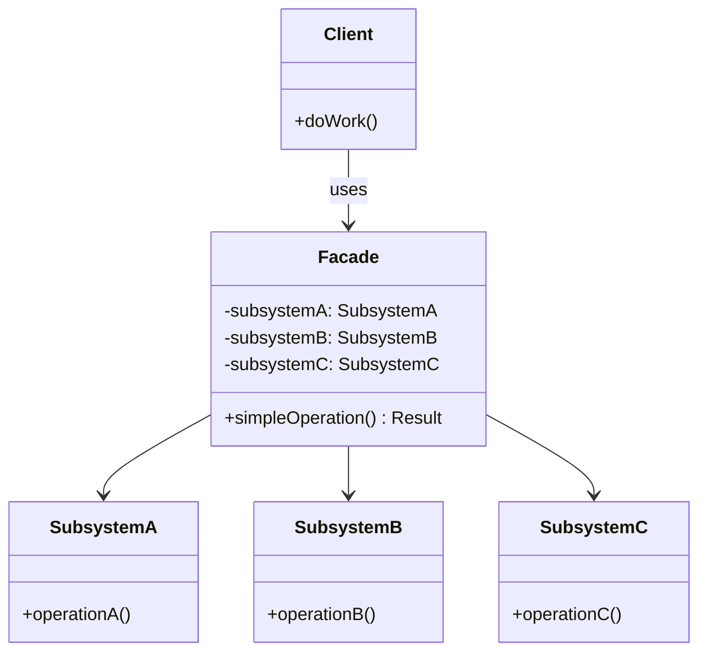

# Facade Pattern

The Facade pattern provides a unified, simplified interface to a complex subsystem of classes, libraries, or frameworks. It hides the intricacies of subsystem interactions behind a single entry point, making the system easier to use without reducing its power for advanced users who need direct access.

## Intent

Complex subsystems often require orchestrating multiple objects in specific sequences — validating, processing, notifying. The Facade pattern simplifies this by offering a high-level method that coordinates the subsystem internally. Clients interact with one clean API instead of managing multiple dependencies and call sequences themselves.

## Class Diagram



## Key Characteristics

- Provides a simple interface to a complex subsystem
- Does not prevent direct access to subsystem classes when needed
- Reduces coupling between clients and subsystem internals
- Coordinates multi-step operations into a single call
- Often serves as the entry point for a module or service layer

---

## Example 1: Fintech — Payment Processing Facade

**Problem:** Processing a payment requires coordinating authentication, fraud detection, payment gateway invocation, and notification dispatch. Clients shouldn't need to know these internal steps.

**Solution:** A `PaymentFacade` exposes a single `processPayment` method that orchestrates all subsystems in the correct order and returns a consolidated result.

```python
# Python — Payment Processing Facade
from dataclasses import dataclass

@dataclass
class PaymentResult:
    success: bool
    transaction_id: str
    message: str

class AuthService:
    def verify_merchant(self, merchant_id: str) -> bool:
        return merchant_id.startswith("MRC-")

class FraudDetector:
    def check(self, amount_cents: int, card_hash: str) -> bool:
        return amount_cents < 1_000_000  # flag over $10k

class PaymentGateway:
    def charge(self, card_hash: str, amount_cents: int) -> str:
        return f"TXN-{abs(hash(card_hash)) % 99999:05d}"

class NotificationService:
    def send_receipt(self, email: str, txn_id: str) -> None:
        print(f"Receipt {txn_id} sent to {email}")

class PaymentFacade:
    def __init__(self):
        self._auth = AuthService()
        self._fraud = FraudDetector()
        self._gateway = PaymentGateway()
        self._notify = NotificationService()

    def process_payment(self, merchant_id: str, card_hash: str,
                        amount_cents: int, email: str) -> PaymentResult:
        if not self._auth.verify_merchant(merchant_id):
            return PaymentResult(False, "", "Merchant auth failed")
        if not self._fraud.check(amount_cents, card_hash):
            return PaymentResult(False, "", "Fraud check failed")
        txn_id = self._gateway.charge(card_hash, amount_cents)
        self._notify.send_receipt(email, txn_id)
        return PaymentResult(True, txn_id, "Payment processed")

facade = PaymentFacade()
print(facade.process_payment("MRC-001", "hash_abc", 5999, "user@example.com"))
```

```go
// Go — Payment Processing Facade
package main

import "fmt"

type PaymentResult struct {
	Success       bool
	TransactionID string
	Message       string
}

type AuthService struct{}
func (a *AuthService) VerifyMerchant(id string) bool { return len(id) > 4 && id[:4] == "MRC-" }

type FraudDetector struct{}
func (f *FraudDetector) Check(amountCents int, _ string) bool { return amountCents < 1_000_000 }

type PaymentGateway struct{}
func (p *PaymentGateway) Charge(_ string, amt int) string { return fmt.Sprintf("TXN-%05d", amt%99999) }

type NotificationService struct{}
func (n *NotificationService) SendReceipt(email, txnID string) {
	fmt.Printf("Receipt %s sent to %s\n", txnID, email)
}

type PaymentFacade struct {
	auth    AuthService
	fraud   FraudDetector
	gateway PaymentGateway
	notify  NotificationService
}

func (f *PaymentFacade) ProcessPayment(merchantID, cardHash string, amountCents int, email string) PaymentResult {
	if !f.auth.VerifyMerchant(merchantID) {
		return PaymentResult{false, "", "Merchant auth failed"}
	}
	if !f.fraud.Check(amountCents, cardHash) {
		return PaymentResult{false, "", "Fraud check failed"}
	}
	txn := f.gateway.Charge(cardHash, amountCents)
	f.notify.SendReceipt(email, txn)
	return PaymentResult{true, txn, "Payment processed"}
}

func main() {
	facade := &PaymentFacade{}
	fmt.Printf("%+v\n", facade.ProcessPayment("MRC-001", "hash_abc", 5999, "user@example.com"))
}
```

```java
// Java — Payment Processing Facade
record PaymentResult(boolean success, String transactionId, String message) {}

class AuthService {
    boolean verifyMerchant(String id) { return id.startsWith("MRC-"); }
}

class FraudDetector {
    boolean check(int amountCents, String cardHash) { return amountCents < 1_000_000; }
}

class PaymentGateway {
    String charge(String cardHash, int amount) { return "TXN-" + String.format("%05d", amount % 99999); }
}

class NotificationService {
    void sendReceipt(String email, String txnId) {
        System.out.printf("Receipt %s sent to %s%n", txnId, email);
    }
}

class PaymentFacade {
    private final AuthService auth = new AuthService();
    private final FraudDetector fraud = new FraudDetector();
    private final PaymentGateway gateway = new PaymentGateway();
    private final NotificationService notify = new NotificationService();

    PaymentResult processPayment(String merchantId, String cardHash, int amountCents, String email) {
        if (!auth.verifyMerchant(merchantId)) return new PaymentResult(false, "", "Merchant auth failed");
        if (!fraud.check(amountCents, cardHash)) return new PaymentResult(false, "", "Fraud check failed");
        String txn = gateway.charge(cardHash, amountCents);
        notify.sendReceipt(email, txn);
        return new PaymentResult(true, txn, "Payment processed");
    }
}
```

```typescript
// TypeScript — Payment Processing Facade
interface PaymentResult {
  success: boolean;
  transactionId: string;
  message: string;
}

class AuthService {
  verifyMerchant(id: string): boolean {
    return id.startsWith("MRC-");
  }
}

class FraudDetector {
  check(amountCents: number, _cardHash: string): boolean {
    return amountCents < 1_000_000;
  }
}

class PaymentGateway {
  charge(cardHash: string, amount: number): string {
    return `TXN-${String(amount % 99999).padStart(5, "0")}`;
  }
}

class NotificationService {
  sendReceipt(email: string, txnId: string): void {
    console.log(`Receipt ${txnId} sent to ${email}`);
  }
}

class PaymentFacade {
  private auth = new AuthService();
  private fraud = new FraudDetector();
  private gateway = new PaymentGateway();
  private notify = new NotificationService();

  processPayment(
    merchantId: string,
    cardHash: string,
    amountCents: number,
    email: string,
  ): PaymentResult {
    if (!this.auth.verifyMerchant(merchantId))
      return {
        success: false,
        transactionId: "",
        message: "Merchant auth failed",
      };
    if (!this.fraud.check(amountCents, cardHash))
      return {
        success: false,
        transactionId: "",
        message: "Fraud check failed",
      };
    const txn = this.gateway.charge(cardHash, amountCents);
    this.notify.sendReceipt(email, txn);
    return { success: true, transactionId: txn, message: "Payment processed" };
  }
}

const facade = new PaymentFacade();
console.log(
  facade.processPayment("MRC-001", "hash_abc", 5999, "user@example.com"),
);
```

```rust
// Rust — Payment Processing Facade
struct PaymentResult { success: bool, transaction_id: String, message: String }

struct AuthService;
impl AuthService {
    fn verify_merchant(&self, id: &str) -> bool { id.starts_with("MRC-") }
}

struct FraudDetector;
impl FraudDetector {
    fn check(&self, amount_cents: i64, _card_hash: &str) -> bool { amount_cents < 1_000_000 }
}

struct PaymentGateway;
impl PaymentGateway {
    fn charge(&self, _card_hash: &str, amount: i64) -> String {
        format!("TXN-{:05}", amount % 99999)
    }
}

struct NotificationService;
impl NotificationService {
    fn send_receipt(&self, email: &str, txn_id: &str) {
        println!("Receipt {} sent to {}", txn_id, email);
    }
}

struct PaymentFacade {
    auth: AuthService,
    fraud: FraudDetector,
    gateway: PaymentGateway,
    notify: NotificationService,
}

impl PaymentFacade {
    fn new() -> Self {
        Self { auth: AuthService, fraud: FraudDetector, gateway: PaymentGateway, notify: NotificationService }
    }
    fn process_payment(&self, merchant_id: &str, card_hash: &str, amount_cents: i64, email: &str) -> PaymentResult {
        if !self.auth.verify_merchant(merchant_id) {
            return PaymentResult { success: false, transaction_id: String::new(), message: "Merchant auth failed".into() };
        }
        if !self.fraud.check(amount_cents, card_hash) {
            return PaymentResult { success: false, transaction_id: String::new(), message: "Fraud check failed".into() };
        }
        let txn = self.gateway.charge(card_hash, amount_cents);
        self.notify.send_receipt(email, &txn);
        PaymentResult { success: true, transaction_id: txn, message: "Payment processed".into() }
    }
}

fn main() {
    let facade = PaymentFacade::new();
    let r = facade.process_payment("MRC-001", "hash_abc", 5999, "user@example.com");
    println!("{}: {} — {}", r.success, r.transaction_id, r.message);
}
```

---

## Example 2: Healthcare — Patient Admission System Facade

**Problem:** Admitting a patient requires verifying insurance, checking bed availability, creating a medical record, and assigning a care team. Each step involves a separate subsystem.

**Solution:** An `AdmissionFacade` orchestrates all admission subsystems in a single `admitPatient` call, returning a unified admission confirmation.

```python
# Python — Patient Admission Facade
from dataclasses import dataclass

@dataclass
class AdmissionConfirmation:
    admission_id: str
    bed_number: str
    care_team: str
    status: str

class InsuranceVerifier:
    def verify(self, policy_id: str) -> bool:
        return policy_id.startswith("POL-")

class BedManager:
    def assign_bed(self, department: str) -> str:
        return f"{department}-B204"

class MedicalRecordService:
    def create_record(self, patient_id: str) -> str:
        return f"MR-{patient_id}"

class CareTeamAssigner:
    def assign(self, department: str) -> str:
        return f"Dr. Chen, Nurse Patel ({department})"

class AdmissionFacade:
    def __init__(self):
        self._insurance = InsuranceVerifier()
        self._beds = BedManager()
        self._records = MedicalRecordService()
        self._teams = CareTeamAssigner()

    def admit_patient(self, patient_id: str, policy_id: str,
                      department: str) -> AdmissionConfirmation:
        if not self._insurance.verify(policy_id):
            return AdmissionConfirmation("", "", "", "Insurance denied")
        bed = self._beds.assign_bed(department)
        self._records.create_record(patient_id)
        team = self._teams.assign(department)
        return AdmissionConfirmation(f"ADM-{patient_id}", bed, team, "Admitted")

facade = AdmissionFacade()
print(facade.admit_patient("PT-7721", "POL-9988", "Cardiology"))
```

```go
// Go — Patient Admission Facade
package main

import "fmt"

type AdmissionConfirmation struct {
	AdmissionID, BedNumber, CareTeam, Status string
}

type InsuranceVerifier struct{}
func (i *InsuranceVerifier) Verify(policyID string) bool { return len(policyID) > 4 && policyID[:4] == "POL-" }

type BedManager struct{}
func (b *BedManager) AssignBed(dept string) string { return dept + "-B204" }

type MedicalRecordService struct{}
func (m *MedicalRecordService) CreateRecord(patientID string) string { return "MR-" + patientID }

type CareTeamAssigner struct{}
func (c *CareTeamAssigner) Assign(dept string) string { return "Dr. Chen, Nurse Patel (" + dept + ")" }

type AdmissionFacade struct {
	insurance InsuranceVerifier
	beds      BedManager
	records   MedicalRecordService
	teams     CareTeamAssigner
}

func (f *AdmissionFacade) AdmitPatient(patientID, policyID, dept string) AdmissionConfirmation {
	if !f.insurance.Verify(policyID) {
		return AdmissionConfirmation{Status: "Insurance denied"}
	}
	bed := f.beds.AssignBed(dept)
	f.records.CreateRecord(patientID)
	team := f.teams.Assign(dept)
	return AdmissionConfirmation{"ADM-" + patientID, bed, team, "Admitted"}
}

func main() {
	facade := &AdmissionFacade{}
	fmt.Printf("%+v\n", facade.AdmitPatient("PT-7721", "POL-9988", "Cardiology"))
}
```

```java
// Java — Patient Admission Facade
record AdmissionConfirmation(String admissionId, String bedNumber, String careTeam, String status) {}

class InsuranceVerifier {
    boolean verify(String policyId) { return policyId.startsWith("POL-"); }
}
class BedManager {
    String assignBed(String dept) { return dept + "-B204"; }
}
class MedicalRecordService {
    String createRecord(String patientId) { return "MR-" + patientId; }
}
class CareTeamAssigner {
    String assign(String dept) { return "Dr. Chen, Nurse Patel (" + dept + ")"; }
}

class AdmissionFacade {
    private final InsuranceVerifier insurance = new InsuranceVerifier();
    private final BedManager beds = new BedManager();
    private final MedicalRecordService records = new MedicalRecordService();
    private final CareTeamAssigner teams = new CareTeamAssigner();

    AdmissionConfirmation admitPatient(String patientId, String policyId, String dept) {
        if (!insurance.verify(policyId))
            return new AdmissionConfirmation("", "", "", "Insurance denied");
        String bed = beds.assignBed(dept);
        records.createRecord(patientId);
        String team = teams.assign(dept);
        return new AdmissionConfirmation("ADM-" + patientId, bed, team, "Admitted");
    }
}
```

```typescript
// TypeScript — Patient Admission Facade
interface AdmissionConfirmation {
  admissionId: string;
  bedNumber: string;
  careTeam: string;
  status: string;
}

class InsuranceVerifier {
  verify(policyId: string): boolean {
    return policyId.startsWith("POL-");
  }
}
class BedManager {
  assignBed(dept: string): string {
    return `${dept}-B204`;
  }
}
class MedicalRecordService {
  createRecord(patientId: string): string {
    return `MR-${patientId}`;
  }
}
class CareTeamAssigner {
  assign(dept: string): string {
    return `Dr. Chen, Nurse Patel (${dept})`;
  }
}

class AdmissionFacade {
  private insurance = new InsuranceVerifier();
  private beds = new BedManager();
  private records = new MedicalRecordService();
  private teams = new CareTeamAssigner();

  admitPatient(
    patientId: string,
    policyId: string,
    dept: string,
  ): AdmissionConfirmation {
    if (!this.insurance.verify(policyId))
      return {
        admissionId: "",
        bedNumber: "",
        careTeam: "",
        status: "Insurance denied",
      };
    const bed = this.beds.assignBed(dept);
    this.records.createRecord(patientId);
    const team = this.teams.assign(dept);
    return {
      admissionId: `ADM-${patientId}`,
      bedNumber: bed,
      careTeam: team,
      status: "Admitted",
    };
  }
}

const facade = new AdmissionFacade();
console.log(facade.admitPatient("PT-7721", "POL-9988", "Cardiology"));
```

```rust
// Rust — Patient Admission Facade
struct AdmissionConfirmation {
    admission_id: String, bed_number: String, care_team: String, status: String,
}

struct InsuranceVerifier;
impl InsuranceVerifier { fn verify(&self, policy_id: &str) -> bool { policy_id.starts_with("POL-") } }

struct BedManager;
impl BedManager { fn assign_bed(&self, dept: &str) -> String { format!("{}-B204", dept) } }

struct MedicalRecordService;
impl MedicalRecordService { fn create_record(&self, pid: &str) -> String { format!("MR-{}", pid) } }

struct CareTeamAssigner;
impl CareTeamAssigner { fn assign(&self, dept: &str) -> String { format!("Dr. Chen, Nurse Patel ({})", dept) } }

struct AdmissionFacade {
    insurance: InsuranceVerifier, beds: BedManager,
    records: MedicalRecordService, teams: CareTeamAssigner,
}

impl AdmissionFacade {
    fn new() -> Self {
        Self { insurance: InsuranceVerifier, beds: BedManager, records: MedicalRecordService, teams: CareTeamAssigner }
    }
    fn admit_patient(&self, patient_id: &str, policy_id: &str, dept: &str) -> AdmissionConfirmation {
        if !self.insurance.verify(policy_id) {
            return AdmissionConfirmation { admission_id: String::new(), bed_number: String::new(),
                care_team: String::new(), status: "Insurance denied".into() };
        }
        let bed = self.beds.assign_bed(dept);
        self.records.create_record(patient_id);
        let team = self.teams.assign(dept);
        AdmissionConfirmation {
            admission_id: format!("ADM-{}", patient_id), bed_number: bed,
            care_team: team, status: "Admitted".into(),
        }
    }
}

fn main() {
    let facade = AdmissionFacade::new();
    let r = facade.admit_patient("PT-7721", "POL-9988", "Cardiology");
    println!("{}: bed={}, team={}, status={}", r.admission_id, r.bed_number, r.care_team, r.status);
}
```

---

## Example 3: E-Commerce — Order Fulfillment Facade

**Problem:** Fulfilling an order involves checking inventory, processing payment, reserving shipping, and sending confirmation — four separate services with complex orchestration logic.

**Solution:** An `OrderFulfillmentFacade` encapsulates the multi-step workflow behind a single `fulfillOrder` method, handling rollback if any step fails.

```python
# Python — Order Fulfillment Facade
from dataclasses import dataclass

@dataclass
class FulfillmentResult:
    order_id: str
    tracking_number: str
    status: str

class InventoryService:
    def reserve(self, sku: str, qty: int) -> bool:
        return qty <= 50

class PaymentService:
    def charge(self, account_id: str, amount_cents: int) -> str:
        return f"PAY-{amount_cents}"

class ShippingService:
    def create_shipment(self, address: str, sku: str) -> str:
        return f"TRK-{abs(hash(address)) % 99999:05d}"

class EmailService:
    def send_confirmation(self, email: str, order_id: str, tracking: str) -> None:
        print(f"Confirmation for {order_id} ({tracking}) → {email}")

class OrderFulfillmentFacade:
    def __init__(self):
        self._inventory = InventoryService()
        self._payment = PaymentService()
        self._shipping = ShippingService()
        self._email = EmailService()

    def fulfill_order(self, order_id: str, sku: str, qty: int,
                      account_id: str, amount_cents: int,
                      address: str, email: str) -> FulfillmentResult:
        if not self._inventory.reserve(sku, qty):
            return FulfillmentResult(order_id, "", "Out of stock")
        self._payment.charge(account_id, amount_cents)
        tracking = self._shipping.create_shipment(address, sku)
        self._email.send_confirmation(email, order_id, tracking)
        return FulfillmentResult(order_id, tracking, "Fulfilled")

facade = OrderFulfillmentFacade()
print(facade.fulfill_order("ORD-101", "SKU-W88", 2, "ACCT-1", 7998, "123 Main St", "buyer@shop.com"))
```

```go
// Go — Order Fulfillment Facade
package main

import "fmt"

type FulfillmentResult struct {
	OrderID, TrackingNumber, Status string
}

type InventoryService struct{}
func (i *InventoryService) Reserve(sku string, qty int) bool { return qty <= 50 }

type PaymentService struct{}
func (p *PaymentService) Charge(acct string, amt int) string { return fmt.Sprintf("PAY-%d", amt) }

type ShippingService struct{}
func (s *ShippingService) CreateShipment(addr, sku string) string { return "TRK-48201" }

type EmailService struct{}
func (e *EmailService) SendConfirmation(email, orderID, tracking string) {
	fmt.Printf("Confirmation for %s (%s) → %s\n", orderID, tracking, email)
}

type OrderFulfillmentFacade struct {
	inv  InventoryService
	pay  PaymentService
	ship ShippingService
	mail EmailService
}

func (f *OrderFulfillmentFacade) FulfillOrder(orderID, sku string, qty int, acct string, amt int, addr, email string) FulfillmentResult {
	if !f.inv.Reserve(sku, qty) {
		return FulfillmentResult{orderID, "", "Out of stock"}
	}
	f.pay.Charge(acct, amt)
	tracking := f.ship.CreateShipment(addr, sku)
	f.mail.SendConfirmation(email, orderID, tracking)
	return FulfillmentResult{orderID, tracking, "Fulfilled"}
}

func main() {
	facade := &OrderFulfillmentFacade{}
	fmt.Printf("%+v\n", facade.FulfillOrder("ORD-101", "SKU-W88", 2, "ACCT-1", 7998, "123 Main", "b@shop.com"))
}
```

```java
// Java — Order Fulfillment Facade
record FulfillmentResult(String orderId, String trackingNumber, String status) {}

class InventoryService { boolean reserve(String sku, int qty) { return qty <= 50; } }
class PaymentService { String charge(String acct, int amt) { return "PAY-" + amt; } }
class ShippingService { String createShipment(String addr, String sku) { return "TRK-48201"; } }
class EmailService {
    void sendConfirmation(String email, String orderId, String tracking) {
        System.out.printf("Confirmation for %s (%s) → %s%n", orderId, tracking, email);
    }
}

class OrderFulfillmentFacade {
    private final InventoryService inv = new InventoryService();
    private final PaymentService pay = new PaymentService();
    private final ShippingService ship = new ShippingService();
    private final EmailService mail = new EmailService();

    FulfillmentResult fulfillOrder(String orderId, String sku, int qty,
                                    String acct, int amt, String addr, String email) {
        if (!inv.reserve(sku, qty)) return new FulfillmentResult(orderId, "", "Out of stock");
        pay.charge(acct, amt);
        String tracking = ship.createShipment(addr, sku);
        mail.sendConfirmation(email, orderId, tracking);
        return new FulfillmentResult(orderId, tracking, "Fulfilled");
    }
}
```

```typescript
// TypeScript — Order Fulfillment Facade
interface FulfillmentResult {
  orderId: string;
  trackingNumber: string;
  status: string;
}

class InventoryService {
  reserve(sku: string, qty: number): boolean {
    return qty <= 50;
  }
}
class PaymentService {
  charge(acct: string, amt: number): string {
    return `PAY-${amt}`;
  }
}
class ShippingService {
  createShipment(addr: string, sku: string): string {
    return "TRK-48201";
  }
}
class EmailService {
  sendConfirmation(email: string, orderId: string, tracking: string): void {
    console.log(`Confirmation for ${orderId} (${tracking}) → ${email}`);
  }
}

class OrderFulfillmentFacade {
  private inv = new InventoryService();
  private pay = new PaymentService();
  private ship = new ShippingService();
  private mail = new EmailService();

  fulfillOrder(
    orderId: string,
    sku: string,
    qty: number,
    acct: string,
    amt: number,
    addr: string,
    email: string,
  ): FulfillmentResult {
    if (!this.inv.reserve(sku, qty))
      return { orderId, trackingNumber: "", status: "Out of stock" };
    this.pay.charge(acct, amt);
    const tracking = this.ship.createShipment(addr, sku);
    this.mail.sendConfirmation(email, orderId, tracking);
    return { orderId, trackingNumber: tracking, status: "Fulfilled" };
  }
}

const facade = new OrderFulfillmentFacade();
console.log(
  facade.fulfillOrder(
    "ORD-101",
    "SKU-W88",
    2,
    "ACCT-1",
    7998,
    "123 Main",
    "b@shop.com",
  ),
);
```

```rust
// Rust — Order Fulfillment Facade
struct FulfillmentResult { order_id: String, tracking_number: String, status: String }

struct InventoryService;
impl InventoryService { fn reserve(&self, _sku: &str, qty: i32) -> bool { qty <= 50 } }

struct PaymentService;
impl PaymentService { fn charge(&self, _acct: &str, amt: i64) -> String { format!("PAY-{}", amt) } }

struct ShippingService;
impl ShippingService { fn create_shipment(&self, _addr: &str, _sku: &str) -> String { "TRK-48201".into() } }

struct EmailService;
impl EmailService {
    fn send_confirmation(&self, email: &str, order_id: &str, tracking: &str) {
        println!("Confirmation for {} ({}) → {}", order_id, tracking, email);
    }
}

struct OrderFulfillmentFacade { inv: InventoryService, pay: PaymentService, ship: ShippingService, mail: EmailService }

impl OrderFulfillmentFacade {
    fn new() -> Self {
        Self { inv: InventoryService, pay: PaymentService, ship: ShippingService, mail: EmailService }
    }
    fn fulfill_order(&self, order_id: &str, sku: &str, qty: i32, acct: &str,
                     amt: i64, addr: &str, email: &str) -> FulfillmentResult {
        if !self.inv.reserve(sku, qty) {
            return FulfillmentResult { order_id: order_id.into(), tracking_number: String::new(), status: "Out of stock".into() };
        }
        self.pay.charge(acct, amt);
        let tracking = self.ship.create_shipment(addr, sku);
        self.mail.send_confirmation(email, order_id, &tracking);
        FulfillmentResult { order_id: order_id.into(), tracking_number: tracking, status: "Fulfilled".into() }
    }
}

fn main() {
    let facade = OrderFulfillmentFacade::new();
    let r = facade.fulfill_order("ORD-101", "SKU-W88", 2, "ACCT-1", 7998, "123 Main", "b@shop.com");
    println!("{}: {} — {}", r.order_id, r.tracking_number, r.status);
}
```

---

## Example 4: Media Streaming — Media Upload Pipeline Facade

**Problem:** Uploading media involves validation, transcoding to multiple resolutions, thumbnail generation, metadata extraction, and CDN distribution — each a separate service.

**Solution:** An `UploadPipelineFacade` provides a single `uploadMedia` method that coordinates the entire ingest pipeline and returns a consolidated upload result.

```python
# Python — Media Upload Pipeline Facade
from dataclasses import dataclass

@dataclass
class UploadResult:
    media_id: str
    cdn_url: str
    thumbnail_url: str
    status: str

class MediaValidator:
    def validate(self, file_path: str, max_gb: int = 5) -> bool:
        return file_path.endswith((".mp4", ".mkv", ".mov"))

class Transcoder:
    def transcode(self, file_path: str, resolutions: list[str]) -> str:
        return f"transcoded-{file_path.split('/')[-1]}"

class ThumbnailGenerator:
    def generate(self, file_path: str) -> str:
        return f"thumb-{file_path.split('/')[-1]}.jpg"

class CdnDistributor:
    def distribute(self, media_key: str) -> str:
        return f"https://cdn.streamco.io/{media_key}"

class UploadPipelineFacade:
    def __init__(self):
        self._validator = MediaValidator()
        self._transcoder = Transcoder()
        self._thumbs = ThumbnailGenerator()
        self._cdn = CdnDistributor()

    def upload_media(self, file_path: str) -> UploadResult:
        if not self._validator.validate(file_path):
            return UploadResult("", "", "", "Invalid format")
        media_key = self._transcoder.transcode(file_path, ["720p", "1080p", "4K"])
        thumb = self._thumbs.generate(file_path)
        cdn_url = self._cdn.distribute(media_key)
        return UploadResult(media_key, cdn_url, thumb, "Published")

facade = UploadPipelineFacade()
print(facade.upload_media("/uploads/concert-live.mp4"))
```

```go
// Go — Media Upload Pipeline Facade
package main

import "fmt"

type UploadResult struct {
	MediaID, CdnURL, ThumbnailURL, Status string
}

type MediaValidator struct{}
func (m *MediaValidator) Validate(path string) bool { return len(path) > 4 }

type Transcoder struct{}
func (t *Transcoder) Transcode(path string) string { return "transcoded-" + path }

type ThumbnailGenerator struct{}
func (g *ThumbnailGenerator) Generate(path string) string { return "thumb-" + path + ".jpg" }

type CdnDistributor struct{}
func (c *CdnDistributor) Distribute(key string) string { return "https://cdn.streamco.io/" + key }

type UploadPipelineFacade struct {
	val    MediaValidator
	trans  Transcoder
	thumbs ThumbnailGenerator
	cdn    CdnDistributor
}

func (f *UploadPipelineFacade) UploadMedia(filePath string) UploadResult {
	if !f.val.Validate(filePath) {
		return UploadResult{Status: "Invalid format"}
	}
	key := f.trans.Transcode(filePath)
	thumb := f.thumbs.Generate(filePath)
	cdnURL := f.cdn.Distribute(key)
	return UploadResult{key, cdnURL, thumb, "Published"}
}

func main() {
	facade := &UploadPipelineFacade{}
	fmt.Printf("%+v\n", facade.UploadMedia("concert-live.mp4"))
}
```

```java
// Java — Media Upload Pipeline Facade
record UploadResult(String mediaId, String cdnUrl, String thumbnailUrl, String status) {}

class MediaValidator { boolean validate(String path) { return path.endsWith(".mp4"); } }
class Transcoder { String transcode(String path) { return "transcoded-" + path; } }
class ThumbnailGenerator { String generate(String path) { return "thumb-" + path + ".jpg"; } }
class CdnDistributor { String distribute(String key) { return "https://cdn.streamco.io/" + key; } }

class UploadPipelineFacade {
    private final MediaValidator val = new MediaValidator();
    private final Transcoder trans = new Transcoder();
    private final ThumbnailGenerator thumbs = new ThumbnailGenerator();
    private final CdnDistributor cdn = new CdnDistributor();

    UploadResult uploadMedia(String filePath) {
        if (!val.validate(filePath)) return new UploadResult("", "", "", "Invalid format");
        String key = trans.transcode(filePath);
        String thumb = thumbs.generate(filePath);
        String cdnUrl = cdn.distribute(key);
        return new UploadResult(key, cdnUrl, thumb, "Published");
    }
}
```

```typescript
// TypeScript — Media Upload Pipeline Facade
interface UploadResult {
  mediaId: string;
  cdnUrl: string;
  thumbnailUrl: string;
  status: string;
}

class MediaValidator {
  validate(path: string): boolean {
    return path.endsWith(".mp4") || path.endsWith(".mkv");
  }
}
class Transcoder {
  transcode(path: string): string {
    return `transcoded-${path}`;
  }
}
class ThumbnailGenerator {
  generate(path: string): string {
    return `thumb-${path}.jpg`;
  }
}
class CdnDistributor {
  distribute(key: string): string {
    return `https://cdn.streamco.io/${key}`;
  }
}

class UploadPipelineFacade {
  private val = new MediaValidator();
  private trans = new Transcoder();
  private thumbs = new ThumbnailGenerator();
  private cdn = new CdnDistributor();

  uploadMedia(filePath: string): UploadResult {
    if (!this.val.validate(filePath))
      return {
        mediaId: "",
        cdnUrl: "",
        thumbnailUrl: "",
        status: "Invalid format",
      };
    const key = this.trans.transcode(filePath);
    const thumb = this.thumbs.generate(filePath);
    const cdnUrl = this.cdn.distribute(key);
    return { mediaId: key, cdnUrl, thumbnailUrl: thumb, status: "Published" };
  }
}

const facade = new UploadPipelineFacade();
console.log(facade.uploadMedia("concert-live.mp4"));
```

```rust
// Rust — Media Upload Pipeline Facade
struct UploadResult { media_id: String, cdn_url: String, thumbnail_url: String, status: String }

struct MediaValidator;
impl MediaValidator { fn validate(&self, path: &str) -> bool { path.ends_with(".mp4") } }

struct Transcoder;
impl Transcoder { fn transcode(&self, path: &str) -> String { format!("transcoded-{}", path) } }

struct ThumbnailGenerator;
impl ThumbnailGenerator { fn generate(&self, path: &str) -> String { format!("thumb-{}.jpg", path) } }

struct CdnDistributor;
impl CdnDistributor { fn distribute(&self, key: &str) -> String { format!("https://cdn.streamco.io/{}", key) } }

struct UploadPipelineFacade { val: MediaValidator, trans: Transcoder, thumbs: ThumbnailGenerator, cdn: CdnDistributor }

impl UploadPipelineFacade {
    fn new() -> Self {
        Self { val: MediaValidator, trans: Transcoder, thumbs: ThumbnailGenerator, cdn: CdnDistributor }
    }
    fn upload_media(&self, file_path: &str) -> UploadResult {
        if !self.val.validate(file_path) {
            return UploadResult { media_id: String::new(), cdn_url: String::new(),
                thumbnail_url: String::new(), status: "Invalid format".into() };
        }
        let key = self.trans.transcode(file_path);
        let thumb = self.thumbs.generate(file_path);
        let cdn_url = self.cdn.distribute(&key);
        UploadResult { media_id: key, cdn_url, thumbnail_url: thumb, status: "Published".into() }
    }
}

fn main() {
    let facade = UploadPipelineFacade::new();
    let r = facade.upload_media("concert-live.mp4");
    println!("{}: {} (thumb: {}) — {}", r.media_id, r.cdn_url, r.thumbnail_url, r.status);
}
```

---

## Example 5: Logistics — Shipment Booking Facade

**Problem:** Booking a shipment requires calculating rates, selecting an optimal carrier, generating labels, and setting up tracking — each managed by a distinct subsystem.

**Solution:** A `ShipmentBookingFacade` provides a single `bookShipment` call that orchestrates rate calculation, carrier selection, label generation, and tracking setup.

```python
# Python — Shipment Booking Facade
from dataclasses import dataclass

@dataclass
class BookingConfirmation:
    booking_id: str
    carrier: str
    label_url: str
    tracking_id: str
    rate_cents: int

class RateCalculator:
    def calculate(self, weight_kg: float, origin: str, dest: str) -> int:
        return int(weight_kg * 120 + 500)

class CarrierSelector:
    def select(self, origin: str, dest: str, rate_cents: int) -> str:
        return "FedEx" if rate_cents > 2000 else "USPS"

class LabelGenerator:
    def generate(self, carrier: str, origin: str, dest: str) -> str:
        return f"https://labels.logistix.io/{carrier.lower()}/LBL-88432"

class TrackingService:
    def setup(self, carrier: str) -> str:
        return f"TRK-{carrier[:3].upper()}-55019"

class ShipmentBookingFacade:
    def __init__(self):
        self._rates = RateCalculator()
        self._carriers = CarrierSelector()
        self._labels = LabelGenerator()
        self._tracking = TrackingService()

    def book_shipment(self, weight_kg: float, origin: str, dest: str) -> BookingConfirmation:
        rate = self._rates.calculate(weight_kg, origin, dest)
        carrier = self._carriers.select(origin, dest, rate)
        label = self._labels.generate(carrier, origin, dest)
        tracking = self._tracking.setup(carrier)
        return BookingConfirmation(f"BK-{abs(hash(dest)) % 99999:05d}",
                                   carrier, label, tracking, rate)

facade = ShipmentBookingFacade()
print(facade.book_shipment(15.0, "NYC", "LAX"))
```

```go
// Go — Shipment Booking Facade
package main

import "fmt"

type BookingConfirmation struct {
	BookingID, Carrier, LabelURL, TrackingID string
	RateCents                                int
}

type RateCalculator struct{}
func (r *RateCalculator) Calculate(weightKg float64) int { return int(weightKg*120) + 500 }

type CarrierSelector struct{}
func (c *CarrierSelector) Select(rate int) string {
	if rate > 2000 { return "FedEx" }
	return "USPS"
}

type LabelGenerator struct{}
func (l *LabelGenerator) Generate(carrier string) string {
	return "https://labels.logistix.io/" + carrier + "/LBL-88432"
}

type TrackingService struct{}
func (t *TrackingService) Setup(carrier string) string { return "TRK-" + carrier[:3] + "-55019" }

type ShipmentBookingFacade struct {
	rates    RateCalculator
	carriers CarrierSelector
	labels   LabelGenerator
	tracking TrackingService
}

func (f *ShipmentBookingFacade) BookShipment(weightKg float64, origin, dest string) BookingConfirmation {
	rate := f.rates.Calculate(weightKg)
	carrier := f.carriers.Select(rate)
	label := f.labels.Generate(carrier)
	trk := f.tracking.Setup(carrier)
	return BookingConfirmation{"BK-" + dest, carrier, label, trk, rate}
}

func main() {
	facade := &ShipmentBookingFacade{}
	fmt.Printf("%+v\n", facade.BookShipment(15.0, "NYC", "LAX"))
}
```

```java
// Java — Shipment Booking Facade
record BookingConfirmation(String bookingId, String carrier, String labelUrl,
                           String trackingId, int rateCents) {}

class RateCalculator { int calculate(double weightKg) { return (int)(weightKg * 120) + 500; } }
class CarrierSelector { String select(int rate) { return rate > 2000 ? "FedEx" : "USPS"; } }
class LabelGenerator { String generate(String carrier) { return "https://labels.logistix.io/" + carrier + "/LBL-88432"; } }
class TrackingService { String setup(String carrier) { return "TRK-" + carrier.substring(0, 3) + "-55019"; } }

class ShipmentBookingFacade {
    private final RateCalculator rates = new RateCalculator();
    private final CarrierSelector carriers = new CarrierSelector();
    private final LabelGenerator labels = new LabelGenerator();
    private final TrackingService tracking = new TrackingService();

    BookingConfirmation bookShipment(double weightKg, String origin, String dest) {
        int rate = rates.calculate(weightKg);
        String carrier = carriers.select(rate);
        String label = labels.generate(carrier);
        String trk = tracking.setup(carrier);
        return new BookingConfirmation("BK-" + dest, carrier, label, trk, rate);
    }
}
```

```typescript
// TypeScript — Shipment Booking Facade
interface BookingConfirmation {
  bookingId: string;
  carrier: string;
  labelUrl: string;
  trackingId: string;
  rateCents: number;
}

class RateCalculator {
  calculate(weightKg: number): number {
    return Math.round(weightKg * 120) + 500;
  }
}
class CarrierSelector {
  select(rate: number): string {
    return rate > 2000 ? "FedEx" : "USPS";
  }
}
class LabelGenerator {
  generate(carrier: string): string {
    return `https://labels.logistix.io/${carrier}/LBL-88432`;
  }
}
class TrackingService {
  setup(carrier: string): string {
    return `TRK-${carrier.slice(0, 3)}-55019`;
  }
}

class ShipmentBookingFacade {
  private rates = new RateCalculator();
  private carriers = new CarrierSelector();
  private labels = new LabelGenerator();
  private tracking = new TrackingService();

  bookShipment(
    weightKg: number,
    origin: string,
    dest: string,
  ): BookingConfirmation {
    const rate = this.rates.calculate(weightKg);
    const carrier = this.carriers.select(rate);
    const label = this.labels.generate(carrier);
    const trk = this.tracking.setup(carrier);
    return {
      bookingId: `BK-${dest}`,
      carrier,
      labelUrl: label,
      trackingId: trk,
      rateCents: rate,
    };
  }
}

const facade = new ShipmentBookingFacade();
console.log(facade.bookShipment(15.0, "NYC", "LAX"));
```

```rust
// Rust — Shipment Booking Facade
struct BookingConfirmation {
    booking_id: String, carrier: String, label_url: String,
    tracking_id: String, rate_cents: i32,
}

struct RateCalculator;
impl RateCalculator { fn calculate(&self, weight_kg: f64) -> i32 { (weight_kg * 120.0) as i32 + 500 } }

struct CarrierSelector;
impl CarrierSelector {
    fn select(&self, rate: i32) -> String { if rate > 2000 { "FedEx".into() } else { "USPS".into() } }
}

struct LabelGenerator;
impl LabelGenerator {
    fn generate(&self, carrier: &str) -> String { format!("https://labels.logistix.io/{}/LBL-88432", carrier) }
}

struct TrackingService;
impl TrackingService {
    fn setup(&self, carrier: &str) -> String { format!("TRK-{}-55019", &carrier[..3]) }
}

struct ShipmentBookingFacade { rates: RateCalculator, carriers: CarrierSelector, labels: LabelGenerator, tracking: TrackingService }

impl ShipmentBookingFacade {
    fn new() -> Self {
        Self { rates: RateCalculator, carriers: CarrierSelector, labels: LabelGenerator, tracking: TrackingService }
    }
    fn book_shipment(&self, weight_kg: f64, _origin: &str, dest: &str) -> BookingConfirmation {
        let rate = self.rates.calculate(weight_kg);
        let carrier = self.carriers.select(rate);
        let label = self.labels.generate(&carrier);
        let tracking = self.tracking.setup(&carrier);
        BookingConfirmation {
            booking_id: format!("BK-{}", dest), carrier, label_url: label,
            tracking_id: tracking, rate_cents: rate,
        }
    }
}

fn main() {
    let facade = ShipmentBookingFacade::new();
    let r = facade.book_shipment(15.0, "NYC", "LAX");
    println!("{}: {} via {} | {} | {}¢", r.booking_id, r.label_url, r.carrier, r.tracking_id, r.rate_cents);
}
```

---

## Summary

| Aspect               | Details                                                                                                          |
| -------------------- | ---------------------------------------------------------------------------------------------------------------- |
| **Pattern Type**     | Structural                                                                                                       |
| **Key Benefit**      | Simplifies complex subsystem interactions into a single, easy-to-use interface                                   |
| **Common Pitfall**   | Facade becomes a "god object" that accumulates too many responsibilities over time                               |
| **Related Patterns** | Adapter (converts interfaces), Mediator (coordinates peer objects), Abstract Factory (hides creation complexity) |
