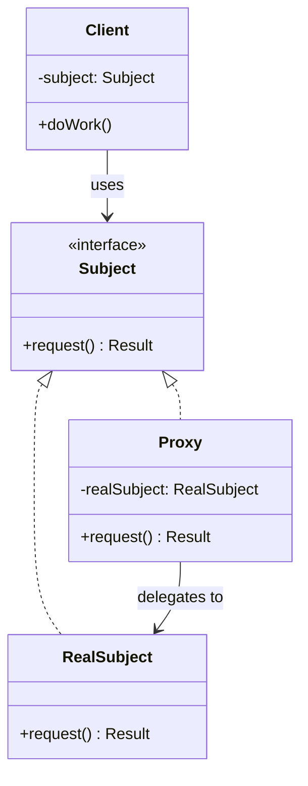

# Proxy Pattern

The Proxy pattern provides a surrogate or placeholder for another object to control access to it. The proxy intercepts requests to the real subject, adding behavior such as access control, caching, logging, or lazy initialization before (or instead of) forwarding to the real object.

## Intent

Direct access to an object may be undesirable due to cost, security, or complexity. The Proxy pattern introduces an intermediary that shares the same interface as the real subject, allowing seamless substitution. This enables cross-cutting concerns — authorization, rate limiting, caching — to be applied transparently without modifying the real object.

## Class Diagram



## Key Characteristics

- Controls access to the real object without changing its interface
- Supports lazy initialization (virtual proxy), access control (protection proxy), caching, and logging
- Client is unaware it's using a proxy instead of the real object
- Can add security, auditing, or throttling transparently
- Shares interface with the real subject for seamless substitution

---

## Example 1: Fintech — Fraud Detection Proxy

**Problem:** Every transaction must pass through a fraud detection check before reaching the payment processor. The processor itself should remain unaware of fraud logic.

**Solution:** A fraud detection proxy wraps the payment processor, inspecting each transaction against risk rules before forwarding legitimate transactions to the real processor.

```python
# Python — Fraud Detection Proxy
from dataclasses import dataclass

@dataclass
class Transaction:
    card_hash: str
    amount_cents: int
    merchant_id: str

class PaymentProcessor:
    def process(self, txn: Transaction) -> str: ...

class RealPaymentProcessor(PaymentProcessor):
    def process(self, txn: Transaction) -> str:
        return f"APPROVED-{txn.merchant_id}-{txn.amount_cents}"

class FraudDetectionProxy(PaymentProcessor):
    HIGH_RISK_THRESHOLD = 500_000  # $5,000

    def __init__(self, real: RealPaymentProcessor):
        self._real = real
        self._blocked_cards: set[str] = {"CARD-STOLEN-001"}

    def process(self, txn: Transaction) -> str:
        if txn.card_hash in self._blocked_cards:
            return f"BLOCKED-stolen-card({txn.card_hash})"
        if txn.amount_cents > self.HIGH_RISK_THRESHOLD:
            return f"HELD-manual-review(amount={txn.amount_cents})"
        return self._real.process(txn)

proxy = FraudDetectionProxy(RealPaymentProcessor())
print(proxy.process(Transaction("CARD-OK-42", 2999, "MRC-SHOP")))
print(proxy.process(Transaction("CARD-STOLEN-001", 100, "MRC-SHOP")))
print(proxy.process(Transaction("CARD-OK-42", 750_000, "MRC-LUXURY")))
```

```go
// Go — Fraud Detection Proxy
package main

import "fmt"

type Transaction struct {
	CardHash   string
	AmountCents int
	MerchantID string
}

type PaymentProcessor interface {
	Process(txn Transaction) string
}

type RealPaymentProcessor struct{}

func (r *RealPaymentProcessor) Process(txn Transaction) string {
	return fmt.Sprintf("APPROVED-%s-%d", txn.MerchantID, txn.AmountCents)
}

type FraudDetectionProxy struct {
	real         *RealPaymentProcessor
	blockedCards map[string]bool
}

func NewFraudProxy(real *RealPaymentProcessor) *FraudDetectionProxy {
	return &FraudDetectionProxy{real: real, blockedCards: map[string]bool{"CARD-STOLEN-001": true}}
}

func (p *FraudDetectionProxy) Process(txn Transaction) string {
	if p.blockedCards[txn.CardHash] {
		return fmt.Sprintf("BLOCKED-stolen-card(%s)", txn.CardHash)
	}
	if txn.AmountCents > 500_000 {
		return fmt.Sprintf("HELD-manual-review(amount=%d)", txn.AmountCents)
	}
	return p.real.Process(txn)
}

func main() {
	proxy := NewFraudProxy(&RealPaymentProcessor{})
	fmt.Println(proxy.Process(Transaction{"CARD-OK-42", 2999, "MRC-SHOP"}))
	fmt.Println(proxy.Process(Transaction{"CARD-STOLEN-001", 100, "MRC-SHOP"}))
}
```

```java
// Java — Fraud Detection Proxy
import java.util.Set;

interface PaymentProcessor {
    String process(Transaction txn);
}

record Transaction(String cardHash, int amountCents, String merchantId) {}

class RealPaymentProcessor implements PaymentProcessor {
    public String process(Transaction txn) {
        return "APPROVED-" + txn.merchantId() + "-" + txn.amountCents();
    }
}

class FraudDetectionProxy implements PaymentProcessor {
    private static final int HIGH_RISK = 500_000;
    private final RealPaymentProcessor real;
    private final Set<String> blockedCards = Set.of("CARD-STOLEN-001");

    FraudDetectionProxy(RealPaymentProcessor real) { this.real = real; }

    public String process(Transaction txn) {
        if (blockedCards.contains(txn.cardHash()))
            return "BLOCKED-stolen-card(" + txn.cardHash() + ")";
        if (txn.amountCents() > HIGH_RISK)
            return "HELD-manual-review(amount=" + txn.amountCents() + ")";
        return real.process(txn);
    }
}
```

```typescript
// TypeScript — Fraud Detection Proxy
interface Transaction {
  cardHash: string;
  amountCents: number;
  merchantId: string;
}

interface PaymentProcessor {
  process(txn: Transaction): string;
}

class RealPaymentProcessor implements PaymentProcessor {
  process(txn: Transaction): string {
    return `APPROVED-${txn.merchantId}-${txn.amountCents}`;
  }
}

class FraudDetectionProxy implements PaymentProcessor {
  private static HIGH_RISK = 500_000;
  private blockedCards = new Set(["CARD-STOLEN-001"]);

  constructor(private real: RealPaymentProcessor) {}

  process(txn: Transaction): string {
    if (this.blockedCards.has(txn.cardHash))
      return `BLOCKED-stolen-card(${txn.cardHash})`;
    if (txn.amountCents > FraudDetectionProxy.HIGH_RISK)
      return `HELD-manual-review(amount=${txn.amountCents})`;
    return this.real.process(txn);
  }
}

const proxy = new FraudDetectionProxy(new RealPaymentProcessor());
console.log(
  proxy.process({
    cardHash: "CARD-OK-42",
    amountCents: 2999,
    merchantId: "MRC-SHOP",
  }),
);
console.log(
  proxy.process({
    cardHash: "CARD-STOLEN-001",
    amountCents: 100,
    merchantId: "MRC-SHOP",
  }),
);
```

```rust
// Rust — Fraud Detection Proxy
use std::collections::HashSet;

struct Transaction { card_hash: String, amount_cents: i64, merchant_id: String }

trait PaymentProcessor {
    fn process(&self, txn: &Transaction) -> String;
}

struct RealPaymentProcessor;
impl PaymentProcessor for RealPaymentProcessor {
    fn process(&self, txn: &Transaction) -> String {
        format!("APPROVED-{}-{}", txn.merchant_id, txn.amount_cents)
    }
}

struct FraudDetectionProxy {
    real: RealPaymentProcessor,
    blocked_cards: HashSet<String>,
}

impl FraudDetectionProxy {
    fn new(real: RealPaymentProcessor) -> Self {
        let mut blocked = HashSet::new();
        blocked.insert("CARD-STOLEN-001".into());
        Self { real, blocked_cards: blocked }
    }
}

impl PaymentProcessor for FraudDetectionProxy {
    fn process(&self, txn: &Transaction) -> String {
        if self.blocked_cards.contains(&txn.card_hash) {
            return format!("BLOCKED-stolen-card({})", txn.card_hash);
        }
        if txn.amount_cents > 500_000 {
            return format!("HELD-manual-review(amount={})", txn.amount_cents);
        }
        self.real.process(txn)
    }
}

fn main() {
    let proxy = FraudDetectionProxy::new(RealPaymentProcessor);
    let txn = Transaction { card_hash: "CARD-OK-42".into(), amount_cents: 2999, merchant_id: "MRC-SHOP".into() };
    println!("{}", proxy.process(&txn));
}
```

---

## Example 2: Healthcare — HIPAA-Compliant Data Access Proxy

**Problem:** Patient health records must only be accessible to authorized roles (physician, nurse, admin). Direct access to the record store should be prevented to enforce HIPAA compliance.

**Solution:** A protection proxy checks the requester's role and audit-logs every access attempt before allowing or denying retrieval of patient data.

```python
# Python — HIPAA Data Access Proxy
from dataclasses import dataclass
from datetime import datetime

@dataclass
class PatientRecord:
    patient_id: str
    diagnosis: str
    medications: list[str]

class PatientRecordStore:
    def get_record(self, patient_id: str) -> PatientRecord: ...

class RealPatientRecordStore(PatientRecordStore):
    def get_record(self, patient_id: str) -> PatientRecord:
        return PatientRecord(patient_id, "Type 2 Diabetes", ["Metformin", "Lisinopril"])

class HipaaAccessProxy(PatientRecordStore):
    ALLOWED_ROLES = {"physician", "nurse", "admin"}

    def __init__(self, store: RealPatientRecordStore):
        self._store = store
        self._audit_log: list[str] = []

    def get_record(self, patient_id: str, role: str = "unknown") -> PatientRecord | str:
        timestamp = datetime.now().isoformat()
        self._audit_log.append(f"{timestamp}|{role}|{patient_id}")
        if role not in self.ALLOWED_ROLES:
            return f"ACCESS-DENIED: role '{role}' cannot view {patient_id}"
        return self._store.get_record(patient_id)

proxy = HipaaAccessProxy(RealPatientRecordStore())
print(proxy.get_record("PT-8832", role="physician"))
print(proxy.get_record("PT-8832", role="billing"))
```

```go
// Go — HIPAA Data Access Proxy
package main

import (
	"fmt"
	"time"
)

type PatientRecord struct {
	PatientID, Diagnosis string
	Medications          []string
}

type PatientRecordStore interface {
	GetRecord(patientID, role string) (PatientRecord, error)
}

type RealStore struct{}

func (r *RealStore) GetRecord(patientID, _ string) (PatientRecord, error) {
	return PatientRecord{patientID, "Type 2 Diabetes", []string{"Metformin", "Lisinopril"}}, nil
}

type HipaaAccessProxy struct {
	store       *RealStore
	allowedRoles map[string]bool
	auditLog    []string
}

func NewHipaaProxy(store *RealStore) *HipaaAccessProxy {
	return &HipaaAccessProxy{store: store,
		allowedRoles: map[string]bool{"physician": true, "nurse": true, "admin": true}}
}

func (p *HipaaAccessProxy) GetRecord(patientID, role string) (PatientRecord, error) {
	p.auditLog = append(p.auditLog, fmt.Sprintf("%s|%s|%s", time.Now().Format(time.RFC3339), role, patientID))
	if !p.allowedRoles[role] {
		return PatientRecord{}, fmt.Errorf("ACCESS-DENIED: role '%s' cannot view %s", role, patientID)
	}
	return p.store.GetRecord(patientID, role)
}

func main() {
	proxy := NewHipaaProxy(&RealStore{})
	rec, _ := proxy.GetRecord("PT-8832", "physician")
	fmt.Printf("%+v\n", rec)
	_, err := proxy.GetRecord("PT-8832", "billing")
	fmt.Println(err)
}
```

```java
// Java — HIPAA Data Access Proxy
import java.util.*;
import java.time.Instant;

interface PatientRecordStore {
    PatientRecord getRecord(String patientId, String role);
}

record PatientRecord(String patientId, String diagnosis, List<String> medications) {}

class RealPatientRecordStore implements PatientRecordStore {
    public PatientRecord getRecord(String patientId, String role) {
        return new PatientRecord(patientId, "Type 2 Diabetes", List.of("Metformin", "Lisinopril"));
    }
}

class HipaaAccessProxy implements PatientRecordStore {
    private static final Set<String> ALLOWED = Set.of("physician", "nurse", "admin");
    private final RealPatientRecordStore store;
    private final List<String> auditLog = new ArrayList<>();

    HipaaAccessProxy(RealPatientRecordStore store) { this.store = store; }

    public PatientRecord getRecord(String patientId, String role) {
        auditLog.add(Instant.now() + "|" + role + "|" + patientId);
        if (!ALLOWED.contains(role))
            throw new SecurityException("ACCESS-DENIED: role '" + role + "' cannot view " + patientId);
        return store.getRecord(patientId, role);
    }
}
```

```typescript
// TypeScript — HIPAA Data Access Proxy
interface PatientRecord {
  patientId: string;
  diagnosis: string;
  medications: string[];
}

interface PatientRecordStore {
  getRecord(patientId: string, role: string): PatientRecord | string;
}

class RealPatientRecordStore implements PatientRecordStore {
  getRecord(patientId: string, _role: string): PatientRecord {
    return {
      patientId,
      diagnosis: "Type 2 Diabetes",
      medications: ["Metformin", "Lisinopril"],
    };
  }
}

class HipaaAccessProxy implements PatientRecordStore {
  private static ALLOWED = new Set(["physician", "nurse", "admin"]);
  private auditLog: string[] = [];

  constructor(private store: RealPatientRecordStore) {}

  getRecord(patientId: string, role: string): PatientRecord | string {
    this.auditLog.push(`${new Date().toISOString()}|${role}|${patientId}`);
    if (!HipaaAccessProxy.ALLOWED.has(role))
      return `ACCESS-DENIED: role '${role}' cannot view ${patientId}`;
    return this.store.getRecord(patientId, role);
  }
}

const proxy = new HipaaAccessProxy(new RealPatientRecordStore());
console.log(proxy.getRecord("PT-8832", "physician"));
console.log(proxy.getRecord("PT-8832", "billing"));
```

```rust
// Rust — HIPAA Data Access Proxy
use std::collections::HashSet;

struct PatientRecord { patient_id: String, diagnosis: String, medications: Vec<String> }

trait PatientRecordStore {
    fn get_record(&self, patient_id: &str, role: &str) -> Result<PatientRecord, String>;
}

struct RealStore;
impl PatientRecordStore for RealStore {
    fn get_record(&self, patient_id: &str, _role: &str) -> Result<PatientRecord, String> {
        Ok(PatientRecord {
            patient_id: patient_id.into(),
            diagnosis: "Type 2 Diabetes".into(),
            medications: vec!["Metformin".into(), "Lisinopril".into()],
        })
    }
}

struct HipaaAccessProxy {
    store: RealStore,
    allowed_roles: HashSet<String>,
}

impl HipaaAccessProxy {
    fn new(store: RealStore) -> Self {
        let allowed = ["physician", "nurse", "admin"].iter().map(|s| s.to_string()).collect();
        Self { store, allowed_roles: allowed }
    }
}

impl PatientRecordStore for HipaaAccessProxy {
    fn get_record(&self, patient_id: &str, role: &str) -> Result<PatientRecord, String> {
        if !self.allowed_roles.contains(role) {
            return Err(format!("ACCESS-DENIED: role '{}' cannot view {}", role, patient_id));
        }
        self.store.get_record(patient_id, role)
    }
}

fn main() {
    let proxy = HipaaAccessProxy::new(RealStore);
    match proxy.get_record("PT-8832", "physician") {
        Ok(r) => println!("{}: {} {:?}", r.patient_id, r.diagnosis, r.medications),
        Err(e) => println!("{}", e),
    }
    println!("{}", proxy.get_record("PT-8832", "billing").unwrap_err());
}
```

---

## Example 3: E-Commerce — Product Image CDN/Caching Proxy

**Problem:** Product images are stored in an expensive cloud storage backend. Every page load fetching images directly from storage incurs high latency and cost.

**Solution:** A caching proxy intercepts image requests, serving from an in-memory cache when available and only hitting the backend store on cache misses, dramatically reducing latency and cost.

```python
# Python — Product Image Caching Proxy
class ImageStore:
    def fetch(self, image_key: str) -> bytes: ...

class CloudImageStore(ImageStore):
    def fetch(self, image_key: str) -> bytes:
        print(f"  [cloud] Fetching {image_key} from storage")
        return f"<binary:{image_key}>".encode()

class CachingImageProxy(ImageStore):
    def __init__(self, store: CloudImageStore, max_cache: int = 100):
        self._store = store
        self._cache: dict[str, bytes] = {}
        self._max = max_cache

    def fetch(self, image_key: str) -> bytes:
        if image_key in self._cache:
            print(f"  [cache-hit] {image_key}")
            return self._cache[image_key]
        data = self._store.fetch(image_key)
        if len(self._cache) < self._max:
            self._cache[image_key] = data
        return data

proxy = CachingImageProxy(CloudImageStore())
proxy.fetch("product/SKU-W88/main.webp")
proxy.fetch("product/SKU-W88/main.webp")  # cache hit
proxy.fetch("product/SKU-T12/hero.webp")
```

```go
// Go — Product Image Caching Proxy
package main

import "fmt"

type ImageStore interface {
	Fetch(imageKey string) []byte
}

type CloudImageStore struct{}

func (c *CloudImageStore) Fetch(key string) []byte {
	fmt.Printf("  [cloud] Fetching %s from storage\n", key)
	return []byte("<binary:" + key + ">")
}

type CachingImageProxy struct {
	store ImageStore
	cache map[string][]byte
}

func NewCachingProxy(store ImageStore) *CachingImageProxy {
	return &CachingImageProxy{store: store, cache: make(map[string][]byte)}
}

func (p *CachingImageProxy) Fetch(key string) []byte {
	if data, ok := p.cache[key]; ok {
		fmt.Printf("  [cache-hit] %s\n", key)
		return data
	}
	data := p.store.Fetch(key)
	p.cache[key] = data
	return data
}

func main() {
	proxy := NewCachingProxy(&CloudImageStore{})
	proxy.Fetch("product/SKU-W88/main.webp")
	proxy.Fetch("product/SKU-W88/main.webp")
	proxy.Fetch("product/SKU-T12/hero.webp")
}
```

```java
// Java — Product Image Caching Proxy
import java.util.*;

interface ImageStore {
    byte[] fetch(String imageKey);
}

class CloudImageStore implements ImageStore {
    public byte[] fetch(String key) {
        System.out.println("  [cloud] Fetching " + key + " from storage");
        return ("<binary:" + key + ">").getBytes();
    }
}

class CachingImageProxy implements ImageStore {
    private final CloudImageStore store;
    private final Map<String, byte[]> cache = new LinkedHashMap<>();
    private final int maxCache;

    CachingImageProxy(CloudImageStore store, int maxCache) {
        this.store = store; this.maxCache = maxCache;
    }

    public byte[] fetch(String key) {
        if (cache.containsKey(key)) {
            System.out.println("  [cache-hit] " + key);
            return cache.get(key);
        }
        byte[] data = store.fetch(key);
        if (cache.size() < maxCache) cache.put(key, data);
        return data;
    }
}
```

```typescript
// TypeScript — Product Image Caching Proxy
interface ImageStore {
  fetch(imageKey: string): Uint8Array;
}

class CloudImageStore implements ImageStore {
  fetch(key: string): Uint8Array {
    console.log(`  [cloud] Fetching ${key} from storage`);
    return new TextEncoder().encode(`<binary:${key}>`);
  }
}

class CachingImageProxy implements ImageStore {
  private cache = new Map<string, Uint8Array>();

  constructor(private store: CloudImageStore, private maxCache = 100) {}

  fetch(key: string): Uint8Array {
    if (this.cache.has(key)) {
      console.log(`  [cache-hit] ${key}`);
      return this.cache.get(key)!;
    }
    const data = this.store.fetch(key);
    if (this.cache.size < this.maxCache) this.cache.set(key, data);
    return data;
  }
}

const proxy = new CachingImageProxy(new CloudImageStore());
proxy.fetch("product/SKU-W88/main.webp");
proxy.fetch("product/SKU-W88/main.webp"); // cache hit
```

```rust
// Rust — Product Image Caching Proxy
use std::collections::HashMap;

trait ImageStore {
    fn fetch(&mut self, image_key: &str) -> Vec<u8>;
}

struct CloudImageStore;
impl ImageStore for CloudImageStore {
    fn fetch(&mut self, key: &str) -> Vec<u8> {
        println!("  [cloud] Fetching {} from storage", key);
        format!("<binary:{}>", key).into_bytes()
    }
}

struct CachingImageProxy {
    store: CloudImageStore,
    cache: HashMap<String, Vec<u8>>,
    max_cache: usize,
}

impl CachingImageProxy {
    fn new(store: CloudImageStore, max_cache: usize) -> Self {
        Self { store, cache: HashMap::new(), max_cache }
    }
}

impl ImageStore for CachingImageProxy {
    fn fetch(&mut self, key: &str) -> Vec<u8> {
        if let Some(data) = self.cache.get(key) {
            println!("  [cache-hit] {}", key);
            return data.clone();
        }
        let data = self.store.fetch(key);
        if self.cache.len() < self.max_cache {
            self.cache.insert(key.to_string(), data.clone());
        }
        data
    }
}

fn main() {
    let mut proxy = CachingImageProxy::new(CloudImageStore, 100);
    proxy.fetch("product/SKU-W88/main.webp");
    proxy.fetch("product/SKU-W88/main.webp"); // cache hit
}
```

---

## Example 4: Media Streaming — Content Geo-Restriction Proxy

**Problem:** Streaming content has licensing agreements that restrict playback to specific geographic regions. The content delivery service itself has no geo-awareness.

**Solution:** A geo-restriction proxy checks the viewer's region against the content's allowed regions before forwarding the stream request to the real delivery service.

```python
# Python — Content Geo-Restriction Proxy
from dataclasses import dataclass

@dataclass
class StreamRequest:
    content_id: str
    user_region: str
    quality: str

class ContentDeliveryService:
    def stream(self, req: StreamRequest) -> str: ...

class RealContentDelivery(ContentDeliveryService):
    def stream(self, req: StreamRequest) -> str:
        return f"STREAMING({req.content_id}@{req.quality})"

class GeoRestrictionProxy(ContentDeliveryService):
    def __init__(self, real: RealContentDelivery, region_map: dict[str, set[str]]):
        self._real = real
        self._region_map = region_map  # content_id → allowed regions

    def stream(self, req: StreamRequest) -> str:
        allowed = self._region_map.get(req.content_id, set())
        if req.user_region not in allowed:
            return f"GEO-BLOCKED: {req.content_id} unavailable in {req.user_region}"
        return self._real.stream(req)

regions = {"MOV-001": {"US", "CA", "GB"}, "MOV-002": {"JP", "KR"}}
proxy = GeoRestrictionProxy(RealContentDelivery(), regions)
print(proxy.stream(StreamRequest("MOV-001", "US", "1080p")))
print(proxy.stream(StreamRequest("MOV-001", "DE", "720p")))
```

```go
// Go — Content Geo-Restriction Proxy
package main

import "fmt"

type StreamRequest struct {
	ContentID, UserRegion, Quality string
}

type ContentDelivery interface {
	Stream(req StreamRequest) string
}

type RealContentDelivery struct{}

func (r *RealContentDelivery) Stream(req StreamRequest) string {
	return fmt.Sprintf("STREAMING(%s@%s)", req.ContentID, req.Quality)
}

type GeoRestrictionProxy struct {
	real      *RealContentDelivery
	regionMap map[string]map[string]bool
}

func (p *GeoRestrictionProxy) Stream(req StreamRequest) string {
	allowed, exists := p.regionMap[req.ContentID]
	if !exists || !allowed[req.UserRegion] {
		return fmt.Sprintf("GEO-BLOCKED: %s unavailable in %s", req.ContentID, req.UserRegion)
	}
	return p.real.Stream(req)
}

func main() {
	proxy := &GeoRestrictionProxy{
		real:      &RealContentDelivery{},
		regionMap: map[string]map[string]bool{"MOV-001": {"US": true, "CA": true, "GB": true}},
	}
	fmt.Println(proxy.Stream(StreamRequest{"MOV-001", "US", "1080p"}))
	fmt.Println(proxy.Stream(StreamRequest{"MOV-001", "DE", "720p"}))
}
```

```java
// Java — Content Geo-Restriction Proxy
import java.util.*;

interface ContentDelivery {
    String stream(String contentId, String userRegion, String quality);
}

class RealContentDelivery implements ContentDelivery {
    public String stream(String contentId, String region, String quality) {
        return "STREAMING(" + contentId + "@" + quality + ")";
    }
}

class GeoRestrictionProxy implements ContentDelivery {
    private final RealContentDelivery real;
    private final Map<String, Set<String>> regionMap;

    GeoRestrictionProxy(RealContentDelivery real, Map<String, Set<String>> regionMap) {
        this.real = real; this.regionMap = regionMap;
    }

    public String stream(String contentId, String region, String quality) {
        Set<String> allowed = regionMap.getOrDefault(contentId, Set.of());
        if (!allowed.contains(region))
            return "GEO-BLOCKED: " + contentId + " unavailable in " + region;
        return real.stream(contentId, region, quality);
    }
}
```

```typescript
// TypeScript — Content Geo-Restriction Proxy
interface StreamRequest {
  contentId: string;
  userRegion: string;
  quality: string;
}

interface ContentDelivery {
  stream(req: StreamRequest): string;
}

class RealContentDelivery implements ContentDelivery {
  stream(req: StreamRequest): string {
    return `STREAMING(${req.contentId}@${req.quality})`;
  }
}

class GeoRestrictionProxy implements ContentDelivery {
  constructor(
    private real: RealContentDelivery,
    private regionMap: Map<string, Set<string>>,
  ) {}

  stream(req: StreamRequest): string {
    const allowed = this.regionMap.get(req.contentId);
    if (!allowed?.has(req.userRegion))
      return `GEO-BLOCKED: ${req.contentId} unavailable in ${req.userRegion}`;
    return this.real.stream(req);
  }
}

const regions = new Map([["MOV-001", new Set(["US", "CA", "GB"])]]);
const proxy = new GeoRestrictionProxy(new RealContentDelivery(), regions);
console.log(
  proxy.stream({ contentId: "MOV-001", userRegion: "US", quality: "1080p" }),
);
console.log(
  proxy.stream({ contentId: "MOV-001", userRegion: "DE", quality: "720p" }),
);
```

```rust
// Rust — Content Geo-Restriction Proxy
use std::collections::{HashMap, HashSet};

struct StreamRequest { content_id: String, user_region: String, quality: String }

trait ContentDelivery {
    fn stream(&self, req: &StreamRequest) -> String;
}

struct RealContentDelivery;
impl ContentDelivery for RealContentDelivery {
    fn stream(&self, req: &StreamRequest) -> String {
        format!("STREAMING({}@{})", req.content_id, req.quality)
    }
}

struct GeoRestrictionProxy {
    real: RealContentDelivery,
    region_map: HashMap<String, HashSet<String>>,
}

impl ContentDelivery for GeoRestrictionProxy {
    fn stream(&self, req: &StreamRequest) -> String {
        match self.region_map.get(&req.content_id) {
            Some(allowed) if allowed.contains(&req.user_region) => self.real.stream(req),
            _ => format!("GEO-BLOCKED: {} unavailable in {}", req.content_id, req.user_region),
        }
    }
}

fn main() {
    let mut regions = HashMap::new();
    regions.insert("MOV-001".into(), HashSet::from(["US".into(), "CA".into(), "GB".into()]));
    let proxy = GeoRestrictionProxy { real: RealContentDelivery, region_map: regions };
    let req = StreamRequest { content_id: "MOV-001".into(), user_region: "US".into(), quality: "1080p".into() };
    println!("{}", proxy.stream(&req));
}
```

---

## Example 5: Logistics — Rate-Limited Tracking API Proxy

**Problem:** A third-party carrier tracking API enforces rate limits. The logistics platform's backend makes frequent polling requests that risk exceeding the limit and getting blocked.

**Solution:** A rate-limiting proxy tracks request timestamps and throttles calls to the carrier API, returning cached results when the rate limit would be exceeded.

```python
# Python — Rate-Limited Tracking API Proxy
import time
from dataclasses import dataclass

@dataclass
class TrackingInfo:
    tracking_id: str
    status: str
    location: str
    updated_at: float

class CarrierTrackingApi:
    def get_status(self, tracking_id: str) -> TrackingInfo: ...

class RealCarrierApi(CarrierTrackingApi):
    def get_status(self, tracking_id: str) -> TrackingInfo:
        return TrackingInfo(tracking_id, "In Transit", "Memphis Hub", time.time())

class RateLimitedTrackingProxy(CarrierTrackingApi):
    def __init__(self, api: RealCarrierApi, max_per_minute: int = 30):
        self._api = api
        self._max = max_per_minute
        self._timestamps: list[float] = []
        self._cache: dict[str, TrackingInfo] = {}

    def get_status(self, tracking_id: str) -> TrackingInfo:
        now = time.time()
        self._timestamps = [t for t in self._timestamps if now - t < 60]
        if len(self._timestamps) >= self._max:
            if tracking_id in self._cache:
                return self._cache[tracking_id]
            raise RuntimeError(f"Rate limit exceeded ({self._max}/min)")
        self._timestamps.append(now)
        result = self._api.get_status(tracking_id)
        self._cache[tracking_id] = result
        return result

proxy = RateLimitedTrackingProxy(RealCarrierApi(), max_per_minute=30)
print(proxy.get_status("TRK-FDX-88201"))
```

```go
// Go — Rate-Limited Tracking API Proxy
package main

import (
	"fmt"
	"sync"
	"time"
)

type TrackingInfo struct {
	TrackingID, Status, Location string
	UpdatedAt                    time.Time
}

type CarrierTrackingAPI interface {
	GetStatus(trackingID string) (TrackingInfo, error)
}

type RealCarrierAPI struct{}

func (r *RealCarrierAPI) GetStatus(id string) (TrackingInfo, error) {
	return TrackingInfo{id, "In Transit", "Memphis Hub", time.Now()}, nil
}

type RateLimitedProxy struct {
	api        *RealCarrierAPI
	maxPerMin  int
	mu         sync.Mutex
	timestamps []time.Time
	cache      map[string]TrackingInfo
}

func (p *RateLimitedProxy) GetStatus(id string) (TrackingInfo, error) {
	p.mu.Lock()
	defer p.mu.Unlock()
	now := time.Now()
	valid := p.timestamps[:0]
	for _, t := range p.timestamps { if now.Sub(t) < time.Minute { valid = append(valid, t) } }
	p.timestamps = valid
	if len(p.timestamps) >= p.maxPerMin {
		if cached, ok := p.cache[id]; ok { return cached, nil }
		return TrackingInfo{}, fmt.Errorf("rate limit exceeded")
	}
	p.timestamps = append(p.timestamps, now)
	info, _ := p.api.GetStatus(id)
	p.cache[id] = info
	return info, nil
}

func main() {
	proxy := &RateLimitedProxy{api: &RealCarrierAPI{}, maxPerMin: 30, cache: make(map[string]TrackingInfo)}
	info, _ := proxy.GetStatus("TRK-FDX-88201")
	fmt.Printf("%+v\n", info)
}
```

```java
// Java — Rate-Limited Tracking API Proxy
import java.util.*;
import java.time.Instant;

interface CarrierTrackingApi {
    TrackingInfo getStatus(String trackingId);
}

record TrackingInfo(String trackingId, String status, String location, Instant updatedAt) {}

class RealCarrierApi implements CarrierTrackingApi {
    public TrackingInfo getStatus(String id) {
        return new TrackingInfo(id, "In Transit", "Memphis Hub", Instant.now());
    }
}

class RateLimitedTrackingProxy implements CarrierTrackingApi {
    private final RealCarrierApi api;
    private final int maxPerMinute;
    private final List<Instant> timestamps = new ArrayList<>();
    private final Map<String, TrackingInfo> cache = new HashMap<>();

    RateLimitedTrackingProxy(RealCarrierApi api, int maxPerMinute) {
        this.api = api; this.maxPerMinute = maxPerMinute;
    }

    public synchronized TrackingInfo getStatus(String id) {
        Instant now = Instant.now();
        timestamps.removeIf(t -> now.toEpochMilli() - t.toEpochMilli() > 60_000);
        if (timestamps.size() >= maxPerMinute) {
            if (cache.containsKey(id)) return cache.get(id);
            throw new RuntimeException("Rate limit exceeded");
        }
        timestamps.add(now);
        TrackingInfo info = api.getStatus(id);
        cache.put(id, info);
        return info;
    }
}
```

```typescript
// TypeScript — Rate-Limited Tracking API Proxy
interface TrackingInfo {
  trackingId: string;
  status: string;
  location: string;
  updatedAt: number;
}

interface CarrierTrackingApi {
  getStatus(trackingId: string): TrackingInfo;
}

class RealCarrierApi implements CarrierTrackingApi {
  getStatus(id: string): TrackingInfo {
    return {
      trackingId: id,
      status: "In Transit",
      location: "Memphis Hub",
      updatedAt: Date.now(),
    };
  }
}

class RateLimitedTrackingProxy implements CarrierTrackingApi {
  private timestamps: number[] = [];
  private cache = new Map<string, TrackingInfo>();

  constructor(private api: RealCarrierApi, private maxPerMinute = 30) {}

  getStatus(id: string): TrackingInfo {
    const now = Date.now();
    this.timestamps = this.timestamps.filter((t) => now - t < 60_000);
    if (this.timestamps.length >= this.maxPerMinute) {
      const cached = this.cache.get(id);
      if (cached) return cached;
      throw new Error("Rate limit exceeded");
    }
    this.timestamps.push(now);
    const info = this.api.getStatus(id);
    this.cache.set(id, info);
    return info;
  }
}

const proxy = new RateLimitedTrackingProxy(new RealCarrierApi(), 30);
console.log(proxy.getStatus("TRK-FDX-88201"));
```

```rust
// Rust — Rate-Limited Tracking API Proxy
use std::collections::HashMap;
use std::time::{Instant, Duration};

struct TrackingInfo { tracking_id: String, status: String, location: String }

trait CarrierTrackingApi {
    fn get_status(&mut self, tracking_id: &str) -> Result<TrackingInfo, String>;
}

struct RealCarrierApi;
impl CarrierTrackingApi for RealCarrierApi {
    fn get_status(&mut self, id: &str) -> Result<TrackingInfo, String> {
        Ok(TrackingInfo { tracking_id: id.into(), status: "In Transit".into(), location: "Memphis Hub".into() })
    }
}

struct RateLimitedProxy {
    api: RealCarrierApi,
    max_per_min: usize,
    timestamps: Vec<Instant>,
    cache: HashMap<String, TrackingInfo>,
}

impl RateLimitedProxy {
    fn new(api: RealCarrierApi, max_per_min: usize) -> Self {
        Self { api, max_per_min, timestamps: vec![], cache: HashMap::new() }
    }
}

impl CarrierTrackingApi for RateLimitedProxy {
    fn get_status(&mut self, id: &str) -> Result<TrackingInfo, String> {
        let now = Instant::now();
        self.timestamps.retain(|t| now.duration_since(*t) < Duration::from_secs(60));
        if self.timestamps.len() >= self.max_per_min {
            return self.cache.get(id)
                .map(|c| TrackingInfo { tracking_id: c.tracking_id.clone(),
                    status: c.status.clone(), location: c.location.clone() })
                .ok_or("Rate limit exceeded".into());
        }
        self.timestamps.push(now);
        let info = self.api.get_status(id)?;
        self.cache.insert(id.to_string(), TrackingInfo {
            tracking_id: info.tracking_id.clone(),
            status: info.status.clone(), location: info.location.clone() });
        Ok(info)
    }
}

fn main() {
    let mut proxy = RateLimitedProxy::new(RealCarrierApi, 30);
    match proxy.get_status("TRK-FDX-88201") {
        Ok(info) => println!("{}: {} @ {}", info.tracking_id, info.status, info.location),
        Err(e) => println!("Error: {}", e),
    }
}
```

---

## Summary

| Aspect               | Details                                                                                                              |
| -------------------- | -------------------------------------------------------------------------------------------------------------------- |
| **Pattern Type**     | Structural                                                                                                           |
| **Key Benefit**      | Controls access to objects transparently, adding security, caching, or throttling without modifying the real subject |
| **Common Pitfall**   | Proxy adds latency; chaining multiple proxies can degrade performance if not carefully managed                       |
| **Related Patterns** | Decorator (adds behavior), Adapter (changes interface), Facade (simplifies subsystem access)                         |
