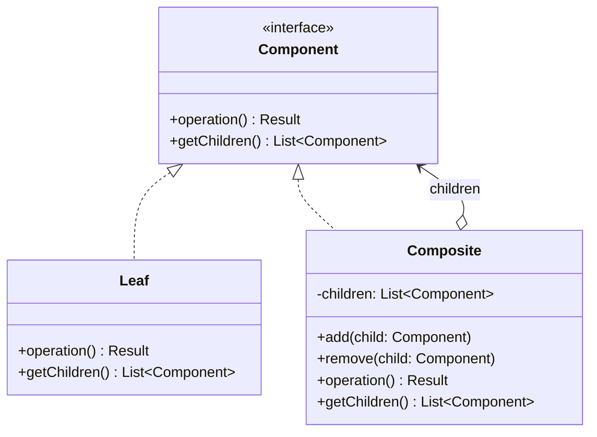

# Composite Pattern

The Composite pattern composes objects into tree structures to represent part-whole hierarchies. It lets clients treat individual objects and compositions of objects uniformly through a shared interface, enabling recursive structures where a group of objects behaves the same as a single object.

## Intent

When a system models hierarchical data — organizational trees, nested categories, file systems — clients often need to perform operations across the entire tree without distinguishing between leaves and branches. The Composite pattern defines a common interface for both, letting operations propagate recursively through the structure while clients remain unaware of the tree's complexity.

## Class Diagram



## Key Characteristics

- Represents part-whole hierarchies as tree structures
- Clients treat individual objects (leaves) and compositions (composites) uniformly
- Operations propagate recursively through the tree
- Simplifies client code by eliminating type-checking for nodes vs. leaves
- Naturally models organizational, categorical, and nested data structures

---

## Example 1: Fintech — Investment Portfolio Hierarchy

**Problem:** An investment platform manages portfolios containing sub-portfolios (e.g., "Retirement" containing "Stocks" and "Bonds" sub-portfolios), each ultimately holding individual stock positions. Total valuation must be computed across the entire hierarchy.

**Solution:** Portfolios and individual holdings share a common interface. Computing total value on any node recursively aggregates values from all descendants.

```python
# Python — Investment Portfolio Hierarchy
from abc import ABC, abstractmethod

class PortfolioComponent(ABC):
    @abstractmethod
    def total_value(self) -> float: ...
    @abstractmethod
    def display(self, indent: int = 0) -> str: ...

class StockHolding(PortfolioComponent):
    def __init__(self, ticker: str, shares: int, price: float):
        self.ticker, self.shares, self.price = ticker, shares, price

    def total_value(self) -> float:
        return self.shares * self.price

    def display(self, indent: int = 0) -> str:
        return f"{'  ' * indent}{self.ticker}: {self.shares} × ${self.price:.2f} = ${self.total_value():.2f}"

class Portfolio(PortfolioComponent):
    def __init__(self, name: str):
        self.name = name
        self._children: list[PortfolioComponent] = []

    def add(self, child: PortfolioComponent): self._children.append(child)

    def total_value(self) -> float:
        return sum(c.total_value() for c in self._children)

    def display(self, indent: int = 0) -> str:
        header = f"{'  ' * indent}[{self.name}] ${self.total_value():.2f}"
        return "\n".join([header] + [c.display(indent + 1) for c in self._children])

stocks = Portfolio("Equities")
stocks.add(StockHolding("AAPL", 50, 178.25))
stocks.add(StockHolding("GOOGL", 20, 141.50))
bonds = Portfolio("Fixed Income")
bonds.add(StockHolding("US-10Y-BOND", 100, 98.75))
retirement = Portfolio("Retirement")
retirement.add(stocks)
retirement.add(bonds)
print(retirement.display())
```

```go
// Go — Investment Portfolio Hierarchy
package main

import (
	"fmt"
	"strings"
)

type PortfolioComponent interface {
	TotalValue() float64
	Display(indent int) string
}

type StockHolding struct {
	Ticker string
	Shares int
	Price  float64
}

func (s *StockHolding) TotalValue() float64 { return float64(s.Shares) * s.Price }
func (s *StockHolding) Display(indent int) string {
	return fmt.Sprintf("%s%s: %d × $%.2f = $%.2f",
		strings.Repeat("  ", indent), s.Ticker, s.Shares, s.Price, s.TotalValue())
}

type Portfolio struct {
	Name     string
	children []PortfolioComponent
}

func (p *Portfolio) Add(child PortfolioComponent) { p.children = append(p.children, child) }

func (p *Portfolio) TotalValue() float64 {
	total := 0.0
	for _, c := range p.children { total += c.TotalValue() }
	return total
}

func (p *Portfolio) Display(indent int) string {
	lines := []string{fmt.Sprintf("%s[%s] $%.2f", strings.Repeat("  ", indent), p.Name, p.TotalValue())}
	for _, c := range p.children { lines = append(lines, c.Display(indent+1)) }
	return strings.Join(lines, "\n")
}

func main() {
	stocks := &Portfolio{Name: "Equities"}
	stocks.Add(&StockHolding{"AAPL", 50, 178.25})
	stocks.Add(&StockHolding{"GOOGL", 20, 141.50})
	bonds := &Portfolio{Name: "Fixed Income"}
	bonds.Add(&StockHolding{"US-10Y-BOND", 100, 98.75})
	retirement := &Portfolio{Name: "Retirement"}
	retirement.Add(stocks)
	retirement.Add(bonds)
	fmt.Println(retirement.Display(0))
}
```

```java
// Java — Investment Portfolio Hierarchy
import java.util.*;
import java.util.stream.*;

interface PortfolioComponent {
    double totalValue();
    String display(int indent);
}

class StockHolding implements PortfolioComponent {
    String ticker; int shares; double price;
    StockHolding(String t, int s, double p) { ticker = t; shares = s; price = p; }
    public double totalValue() { return shares * price; }
    public String display(int indent) {
        return "  ".repeat(indent) + ticker + ": " + shares + " × $" +
               String.format("%.2f", price) + " = $" + String.format("%.2f", totalValue());
    }
}

class Portfolio implements PortfolioComponent {
    String name;
    List<PortfolioComponent> children = new ArrayList<>();
    Portfolio(String name) { this.name = name; }
    void add(PortfolioComponent c) { children.add(c); }
    public double totalValue() { return children.stream().mapToDouble(PortfolioComponent::totalValue).sum(); }
    public String display(int indent) {
        String header = "  ".repeat(indent) + "[" + name + "] $" + String.format("%.2f", totalValue());
        return children.stream().map(c -> c.display(indent + 1))
            .collect(Collectors.joining("\n", header + "\n", ""));
    }
}
```

```typescript
// TypeScript — Investment Portfolio Hierarchy
interface PortfolioComponent {
  totalValue(): number;
  display(indent?: number): string;
}

class StockHolding implements PortfolioComponent {
  constructor(
    public ticker: string,
    public shares: number,
    public price: number,
  ) {}
  totalValue(): number {
    return this.shares * this.price;
  }
  display(indent = 0): string {
    return `${"  ".repeat(indent)}${this.ticker}: ${
      this.shares
    } × $${this.price.toFixed(2)} = $${this.totalValue().toFixed(2)}`;
  }
}

class Portfolio implements PortfolioComponent {
  private children: PortfolioComponent[] = [];
  constructor(public name: string) {}
  add(child: PortfolioComponent): void {
    this.children.push(child);
  }
  totalValue(): number {
    return this.children.reduce((sum, c) => sum + c.totalValue(), 0);
  }
  display(indent = 0): string {
    const header = `${"  ".repeat(indent)}[${
      this.name
    }] $${this.totalValue().toFixed(2)}`;
    return [header, ...this.children.map((c) => c.display(indent + 1))].join(
      "\n",
    );
  }
}

const stocks = new Portfolio("Equities");
stocks.add(new StockHolding("AAPL", 50, 178.25));
stocks.add(new StockHolding("GOOGL", 20, 141.5));
const bonds = new Portfolio("Fixed Income");
bonds.add(new StockHolding("US-10Y-BOND", 100, 98.75));
const retirement = new Portfolio("Retirement");
retirement.add(stocks);
retirement.add(bonds);
console.log(retirement.display());
```

```rust
// Rust — Investment Portfolio Hierarchy
enum PortfolioComponent {
    Holding { ticker: String, shares: u32, price: f64 },
    Portfolio { name: String, children: Vec<PortfolioComponent> },
}

impl PortfolioComponent {
    fn total_value(&self) -> f64 {
        match self {
            Self::Holding { shares, price, .. } => *shares as f64 * price,
            Self::Portfolio { children, .. } => children.iter().map(|c| c.total_value()).sum(),
        }
    }

    fn display(&self, indent: usize) -> String {
        let pad = "  ".repeat(indent);
        match self {
            Self::Holding { ticker, shares, price } =>
                format!("{}{}: {} × ${:.2} = ${:.2}", pad, ticker, shares, price, self.total_value()),
            Self::Portfolio { name, children } => {
                let header = format!("{}[{}] ${:.2}", pad, name, self.total_value());
                let child_lines: Vec<String> = children.iter().map(|c| c.display(indent + 1)).collect();
                format!("{}\n{}", header, child_lines.join("\n"))
            }
        }
    }
}

fn main() {
    let retirement = PortfolioComponent::Portfolio {
        name: "Retirement".into(),
        children: vec![
            PortfolioComponent::Portfolio {
                name: "Equities".into(),
                children: vec![
                    PortfolioComponent::Holding { ticker: "AAPL".into(), shares: 50, price: 178.25 },
                    PortfolioComponent::Holding { ticker: "GOOGL".into(), shares: 20, price: 141.50 },
                ],
            },
            PortfolioComponent::Portfolio {
                name: "Fixed Income".into(),
                children: vec![
                    PortfolioComponent::Holding { ticker: "US-10Y-BOND".into(), shares: 100, price: 98.75 },
                ],
            },
        ],
    };
    println!("{}", retirement.display(0));
}
```

---

## Example 2: Healthcare — Hospital Department Organization Tree

**Problem:** A hospital has a multi-level organizational structure — divisions contain departments, which contain units. Headcount and budget calculations must roll up through the entire tree.

**Solution:** Each node (unit, department, division) implements a common interface. Budget and headcount queries recursively aggregate from leaves to the root.

```python
# Python — Hospital Organization Tree
from abc import ABC, abstractmethod

class OrgUnit(ABC):
    @abstractmethod
    def headcount(self) -> int: ...
    @abstractmethod
    def budget_usd(self) -> float: ...

class ClinicalUnit(OrgUnit):
    def __init__(self, name: str, staff: int, budget: float):
        self.name, self._staff, self._budget = name, staff, budget
    def headcount(self) -> int: return self._staff
    def budget_usd(self) -> float: return self._budget

class Department(OrgUnit):
    def __init__(self, name: str):
        self.name = name
        self._children: list[OrgUnit] = []

    def add(self, unit: OrgUnit): self._children.append(unit)
    def headcount(self) -> int: return sum(c.headcount() for c in self._children)
    def budget_usd(self) -> float: return sum(c.budget_usd() for c in self._children)

cardiology = Department("Cardiology")
cardiology.add(ClinicalUnit("Cardiac ICU", 45, 2_500_000))
cardiology.add(ClinicalUnit("Cath Lab", 18, 1_200_000))
surgery = Department("Surgery")
surgery.add(ClinicalUnit("OR Suite A", 30, 3_000_000))

hospital = Department("General Hospital")
hospital.add(cardiology)
hospital.add(surgery)
print(f"Total headcount: {hospital.headcount()}, Budget: ${hospital.budget_usd():,.0f}")
```

```go
// Go — Hospital Organization Tree
package main

import "fmt"

type OrgUnit interface {
	Headcount() int
	BudgetUSD() float64
}

type ClinicalUnit struct {
	Name   string
	Staff  int
	Budget float64
}

func (c *ClinicalUnit) Headcount() int    { return c.Staff }
func (c *ClinicalUnit) BudgetUSD() float64 { return c.Budget }

type Department struct {
	Name     string
	children []OrgUnit
}

func (d *Department) Add(u OrgUnit) { d.children = append(d.children, u) }

func (d *Department) Headcount() int {
	total := 0
	for _, c := range d.children { total += c.Headcount() }
	return total
}

func (d *Department) BudgetUSD() float64 {
	total := 0.0
	for _, c := range d.children { total += c.BudgetUSD() }
	return total
}

func main() {
	cardiology := &Department{Name: "Cardiology"}
	cardiology.Add(&ClinicalUnit{"Cardiac ICU", 45, 2_500_000})
	cardiology.Add(&ClinicalUnit{"Cath Lab", 18, 1_200_000})
	surgery := &Department{Name: "Surgery"}
	surgery.Add(&ClinicalUnit{"OR Suite A", 30, 3_000_000})

	hospital := &Department{Name: "General Hospital"}
	hospital.Add(cardiology)
	hospital.Add(surgery)
	fmt.Printf("Headcount: %d, Budget: $%.0f\n", hospital.Headcount(), hospital.BudgetUSD())
}
```

```java
// Java — Hospital Organization Tree
import java.util.*;

interface OrgUnit {
    int headcount();
    double budgetUsd();
}

class ClinicalUnit implements OrgUnit {
    String name; int staff; double budget;
    ClinicalUnit(String name, int staff, double budget) {
        this.name = name; this.staff = staff; this.budget = budget;
    }
    public int headcount() { return staff; }
    public double budgetUsd() { return budget; }
}

class Department implements OrgUnit {
    String name;
    List<OrgUnit> children = new ArrayList<>();
    Department(String name) { this.name = name; }
    void add(OrgUnit u) { children.add(u); }
    public int headcount() { return children.stream().mapToInt(OrgUnit::headcount).sum(); }
    public double budgetUsd() { return children.stream().mapToDouble(OrgUnit::budgetUsd).sum(); }
}
```

```typescript
// TypeScript — Hospital Organization Tree
interface OrgUnit {
  headcount(): number;
  budgetUsd(): number;
}

class ClinicalUnit implements OrgUnit {
  constructor(
    public name: string,
    private staff: number,
    private budget: number,
  ) {}
  headcount(): number {
    return this.staff;
  }
  budgetUsd(): number {
    return this.budget;
  }
}

class Department implements OrgUnit {
  private children: OrgUnit[] = [];
  constructor(public name: string) {}
  add(unit: OrgUnit): void {
    this.children.push(unit);
  }
  headcount(): number {
    return this.children.reduce((s, c) => s + c.headcount(), 0);
  }
  budgetUsd(): number {
    return this.children.reduce((s, c) => s + c.budgetUsd(), 0);
  }
}

const cardiology = new Department("Cardiology");
cardiology.add(new ClinicalUnit("Cardiac ICU", 45, 2_500_000));
cardiology.add(new ClinicalUnit("Cath Lab", 18, 1_200_000));
const surgery = new Department("Surgery");
surgery.add(new ClinicalUnit("OR Suite A", 30, 3_000_000));
const hospital = new Department("General Hospital");
hospital.add(cardiology);
hospital.add(surgery);
console.log(
  `Headcount: ${hospital.headcount()}, Budget: $${hospital
    .budgetUsd()
    .toLocaleString()}`,
);
```

```rust
// Rust — Hospital Organization Tree
enum OrgUnit {
    Clinical { name: String, staff: u32, budget: f64 },
    Department { name: String, children: Vec<OrgUnit> },
}

impl OrgUnit {
    fn headcount(&self) -> u32 {
        match self {
            Self::Clinical { staff, .. } => *staff,
            Self::Department { children, .. } => children.iter().map(|c| c.headcount()).sum(),
        }
    }
    fn budget_usd(&self) -> f64 {
        match self {
            Self::Clinical { budget, .. } => *budget,
            Self::Department { children, .. } => children.iter().map(|c| c.budget_usd()).sum(),
        }
    }
}

fn main() {
    let hospital = OrgUnit::Department {
        name: "General Hospital".into(),
        children: vec![
            OrgUnit::Department {
                name: "Cardiology".into(),
                children: vec![
                    OrgUnit::Clinical { name: "Cardiac ICU".into(), staff: 45, budget: 2_500_000.0 },
                    OrgUnit::Clinical { name: "Cath Lab".into(), staff: 18, budget: 1_200_000.0 },
                ],
            },
            OrgUnit::Department {
                name: "Surgery".into(),
                children: vec![
                    OrgUnit::Clinical { name: "OR Suite A".into(), staff: 30, budget: 3_000_000.0 },
                ],
            },
        ],
    };
    println!("Headcount: {}, Budget: ${:.0}", hospital.headcount(), hospital.budget_usd());
}
```

---

## Example 3: E-Commerce — Product Category Navigation Tree

**Problem:** An e-commerce site organizes products in nested categories (Electronics > Audio > Headphones). Product counts and price ranges must be computed at any category level.

**Solution:** Categories and individual product listings share a common interface. Aggregate operations like product count and min/max price propagate recursively.

```python
# Python — Product Category Tree
from abc import ABC, abstractmethod

class CatalogNode(ABC):
    @abstractmethod
    def product_count(self) -> int: ...
    @abstractmethod
    def min_price_cents(self) -> int: ...

class ProductListing(CatalogNode):
    def __init__(self, sku: str, name: str, price_cents: int):
        self.sku, self.name, self.price_cents_val = sku, name, price_cents
    def product_count(self) -> int: return 1
    def min_price_cents(self) -> int: return self.price_cents_val

class Category(CatalogNode):
    def __init__(self, name: str):
        self.name = name
        self._children: list[CatalogNode] = []
    def add(self, node: CatalogNode): self._children.append(node)
    def product_count(self) -> int:
        return sum(c.product_count() for c in self._children)
    def min_price_cents(self) -> int:
        return min(c.min_price_cents() for c in self._children) if self._children else 0

headphones = Category("Headphones")
headphones.add(ProductListing("SKU-WH1", "Wireless Over-Ear", 14999))
headphones.add(ProductListing("SKU-BT5", "Bluetooth Earbuds", 4999))
audio = Category("Audio")
audio.add(headphones)
audio.add(ProductListing("SKU-SP3", "Portable Speaker", 7999))
electronics = Category("Electronics")
electronics.add(audio)
print(f"{electronics.name}: {electronics.product_count()} products, from ${electronics.min_price_cents()/100:.2f}")
```

```go
// Go — Product Category Tree
package main

import (
	"fmt"
	"math"
)

type CatalogNode interface {
	ProductCount() int
	MinPriceCents() int
}

type ProductListing struct {
	SKU, Name  string
	PriceCents int
}

func (p *ProductListing) ProductCount() int  { return 1 }
func (p *ProductListing) MinPriceCents() int { return p.PriceCents }

type Category struct {
	Name     string
	children []CatalogNode
}

func (c *Category) Add(n CatalogNode) { c.children = append(c.children, n) }
func (c *Category) ProductCount() int {
	t := 0
	for _, ch := range c.children { t += ch.ProductCount() }
	return t
}
func (c *Category) MinPriceCents() int {
	min := math.MaxInt
	for _, ch := range c.children {
		if v := ch.MinPriceCents(); v < min { min = v }
	}
	return min
}

func main() {
	headphones := &Category{Name: "Headphones"}
	headphones.Add(&ProductListing{"SKU-WH1", "Wireless Over-Ear", 14999})
	headphones.Add(&ProductListing{"SKU-BT5", "Bluetooth Earbuds", 4999})
	audio := &Category{Name: "Audio"}
	audio.Add(headphones)
	audio.Add(&ProductListing{"SKU-SP3", "Portable Speaker", 7999})
	electronics := &Category{Name: "Electronics"}
	electronics.Add(audio)
	fmt.Printf("%s: %d products, from $%.2f\n",
		electronics.Name, electronics.ProductCount(), float64(electronics.MinPriceCents())/100)
}
```

```java
// Java — Product Category Tree
import java.util.*;

interface CatalogNode {
    int productCount();
    int minPriceCents();
}

class ProductListing implements CatalogNode {
    String sku, name; int priceCents;
    ProductListing(String sku, String name, int price) { this.sku = sku; this.name = name; priceCents = price; }
    public int productCount() { return 1; }
    public int minPriceCents() { return priceCents; }
}

class Category implements CatalogNode {
    String name;
    List<CatalogNode> children = new ArrayList<>();
    Category(String name) { this.name = name; }
    void add(CatalogNode n) { children.add(n); }
    public int productCount() { return children.stream().mapToInt(CatalogNode::productCount).sum(); }
    public int minPriceCents() { return children.stream().mapToInt(CatalogNode::minPriceCents).min().orElse(0); }
}
```

```typescript
// TypeScript — Product Category Tree
interface CatalogNode {
  productCount(): number;
  minPriceCents(): number;
}

class ProductListing implements CatalogNode {
  constructor(
    public sku: string,
    public name: string,
    private priceCents: number,
  ) {}
  productCount(): number {
    return 1;
  }
  minPriceCents(): number {
    return this.priceCents;
  }
}

class Category implements CatalogNode {
  private children: CatalogNode[] = [];
  constructor(public name: string) {}
  add(node: CatalogNode): void {
    this.children.push(node);
  }
  productCount(): number {
    return this.children.reduce((s, c) => s + c.productCount(), 0);
  }
  minPriceCents(): number {
    return Math.min(...this.children.map((c) => c.minPriceCents()));
  }
}

const headphones = new Category("Headphones");
headphones.add(new ProductListing("SKU-WH1", "Wireless Over-Ear", 14999));
headphones.add(new ProductListing("SKU-BT5", "Bluetooth Earbuds", 4999));
const audio = new Category("Audio");
audio.add(headphones);
audio.add(new ProductListing("SKU-SP3", "Portable Speaker", 7999));
const electronics = new Category("Electronics");
electronics.add(audio);
console.log(
  `${electronics.name}: ${electronics.productCount()} products, from $${(
    electronics.minPriceCents() / 100
  ).toFixed(2)}`,
);
```

```rust
// Rust — Product Category Tree
enum CatalogNode {
    Product { sku: String, name: String, price_cents: i32 },
    Category { name: String, children: Vec<CatalogNode> },
}

impl CatalogNode {
    fn product_count(&self) -> i32 {
        match self {
            Self::Product { .. } => 1,
            Self::Category { children, .. } => children.iter().map(|c| c.product_count()).sum(),
        }
    }
    fn min_price_cents(&self) -> i32 {
        match self {
            Self::Product { price_cents, .. } => *price_cents,
            Self::Category { children, .. } =>
                children.iter().map(|c| c.min_price_cents()).min().unwrap_or(0),
        }
    }
}

fn main() {
    let electronics = CatalogNode::Category {
        name: "Electronics".into(),
        children: vec![CatalogNode::Category {
            name: "Audio".into(),
            children: vec![
                CatalogNode::Category {
                    name: "Headphones".into(),
                    children: vec![
                        CatalogNode::Product { sku: "SKU-WH1".into(), name: "Wireless Over-Ear".into(), price_cents: 14999 },
                        CatalogNode::Product { sku: "SKU-BT5".into(), name: "Bluetooth Earbuds".into(), price_cents: 4999 },
                    ],
                },
                CatalogNode::Product { sku: "SKU-SP3".into(), name: "Portable Speaker".into(), price_cents: 7999 },
            ],
        }],
    };
    println!("{} products, from ${:.2}",
        electronics.product_count(), electronics.min_price_cents() as f64 / 100.0);
}
```

---

## Example 4: Media Streaming — Playlist Hierarchy

**Problem:** A streaming service supports nested playlists — a "Road Trip" collection might contain "Upbeat Hits" and "Chill Vibes" playlists, each containing individual tracks. Total duration must be computed at any level.

**Solution:** Tracks and playlists implement a common interface. Duration queries on any node recursively sum up durations of all contained tracks.

```python
# Python — Playlist Hierarchy
from abc import ABC, abstractmethod

class PlaylistComponent(ABC):
    @abstractmethod
    def duration_secs(self) -> int: ...
    @abstractmethod
    def track_count(self) -> int: ...

class Track(PlaylistComponent):
    def __init__(self, title: str, artist: str, duration_secs: int):
        self.title, self.artist, self._duration = title, artist, duration_secs
    def duration_secs(self) -> int: return self._duration
    def track_count(self) -> int: return 1

class Playlist(PlaylistComponent):
    def __init__(self, name: str):
        self.name = name
        self._children: list[PlaylistComponent] = []
    def add(self, item: PlaylistComponent): self._children.append(item)
    def duration_secs(self) -> int:
        return sum(c.duration_secs() for c in self._children)
    def track_count(self) -> int:
        return sum(c.track_count() for c in self._children)

upbeat = Playlist("Upbeat Hits")
upbeat.add(Track("Levitating", "Dua Lipa", 203))
upbeat.add(Track("Blinding Lights", "The Weeknd", 200))
chill = Playlist("Chill Vibes")
chill.add(Track("Weightless", "Marconi Union", 480))
road_trip = Playlist("Road Trip")
road_trip.add(upbeat)
road_trip.add(chill)
print(f"{road_trip.name}: {road_trip.track_count()} tracks, {road_trip.duration_secs() // 60}min")
```

```go
// Go — Playlist Hierarchy
package main

import "fmt"

type PlaylistComponent interface {
	DurationSecs() int
	TrackCount() int
}

type Track struct {
	Title, Artist string
	Duration      int
}

func (t *Track) DurationSecs() int { return t.Duration }
func (t *Track) TrackCount() int   { return 1 }

type Playlist struct {
	Name     string
	children []PlaylistComponent
}

func (p *Playlist) Add(item PlaylistComponent) { p.children = append(p.children, item) }
func (p *Playlist) DurationSecs() int {
	total := 0
	for _, c := range p.children { total += c.DurationSecs() }
	return total
}
func (p *Playlist) TrackCount() int {
	total := 0
	for _, c := range p.children { total += c.TrackCount() }
	return total
}

func main() {
	upbeat := &Playlist{Name: "Upbeat Hits"}
	upbeat.Add(&Track{"Levitating", "Dua Lipa", 203})
	upbeat.Add(&Track{"Blinding Lights", "The Weeknd", 200})
	chill := &Playlist{Name: "Chill Vibes"}
	chill.Add(&Track{"Weightless", "Marconi Union", 480})
	roadTrip := &Playlist{Name: "Road Trip"}
	roadTrip.Add(upbeat)
	roadTrip.Add(chill)
	fmt.Printf("%s: %d tracks, %dmin\n", roadTrip.Name, roadTrip.TrackCount(), roadTrip.DurationSecs()/60)
}
```

```java
// Java — Playlist Hierarchy
import java.util.*;

interface PlaylistComponent {
    int durationSecs();
    int trackCount();
}

class Track implements PlaylistComponent {
    String title, artist; int duration;
    Track(String title, String artist, int duration) {
        this.title = title; this.artist = artist; this.duration = duration;
    }
    public int durationSecs() { return duration; }
    public int trackCount() { return 1; }
}

class Playlist implements PlaylistComponent {
    String name;
    List<PlaylistComponent> children = new ArrayList<>();
    Playlist(String name) { this.name = name; }
    void add(PlaylistComponent item) { children.add(item); }
    public int durationSecs() { return children.stream().mapToInt(PlaylistComponent::durationSecs).sum(); }
    public int trackCount() { return children.stream().mapToInt(PlaylistComponent::trackCount).sum(); }
}
```

```typescript
// TypeScript — Playlist Hierarchy
interface PlaylistComponent {
  durationSecs(): number;
  trackCount(): number;
}

class Track implements PlaylistComponent {
  constructor(
    public title: string,
    public artist: string,
    private duration: number,
  ) {}
  durationSecs(): number {
    return this.duration;
  }
  trackCount(): number {
    return 1;
  }
}

class Playlist implements PlaylistComponent {
  private children: PlaylistComponent[] = [];
  constructor(public name: string) {}
  add(item: PlaylistComponent): void {
    this.children.push(item);
  }
  durationSecs(): number {
    return this.children.reduce((s, c) => s + c.durationSecs(), 0);
  }
  trackCount(): number {
    return this.children.reduce((s, c) => s + c.trackCount(), 0);
  }
}

const upbeat = new Playlist("Upbeat Hits");
upbeat.add(new Track("Levitating", "Dua Lipa", 203));
upbeat.add(new Track("Blinding Lights", "The Weeknd", 200));
const chill = new Playlist("Chill Vibes");
chill.add(new Track("Weightless", "Marconi Union", 480));
const roadTrip = new Playlist("Road Trip");
roadTrip.add(upbeat);
roadTrip.add(chill);
console.log(
  `${roadTrip.name}: ${roadTrip.trackCount()} tracks, ${Math.floor(
    roadTrip.durationSecs() / 60,
  )}min`,
);
```

```rust
// Rust — Playlist Hierarchy
enum PlaylistComponent {
    Track { title: String, artist: String, duration_secs: u32 },
    Playlist { name: String, children: Vec<PlaylistComponent> },
}

impl PlaylistComponent {
    fn duration_secs(&self) -> u32 {
        match self {
            Self::Track { duration_secs, .. } => *duration_secs,
            Self::Playlist { children, .. } => children.iter().map(|c| c.duration_secs()).sum(),
        }
    }
    fn track_count(&self) -> u32 {
        match self {
            Self::Track { .. } => 1,
            Self::Playlist { children, .. } => children.iter().map(|c| c.track_count()).sum(),
        }
    }
}

fn main() {
    let road_trip = PlaylistComponent::Playlist {
        name: "Road Trip".into(),
        children: vec![
            PlaylistComponent::Playlist {
                name: "Upbeat Hits".into(),
                children: vec![
                    PlaylistComponent::Track { title: "Levitating".into(), artist: "Dua Lipa".into(), duration_secs: 203 },
                    PlaylistComponent::Track { title: "Blinding Lights".into(), artist: "The Weeknd".into(), duration_secs: 200 },
                ],
            },
            PlaylistComponent::Playlist {
                name: "Chill Vibes".into(),
                children: vec![
                    PlaylistComponent::Track { title: "Weightless".into(), artist: "Marconi Union".into(), duration_secs: 480 },
                ],
            },
        ],
    };
    println!("{} tracks, {}min", road_trip.track_count(), road_trip.duration_secs() / 60);
}
```

---

## Example 5: Logistics — Delivery Zone Hierarchy

**Problem:** A logistics company organizes service areas hierarchically: regions contain zones, zones contain districts. Calculating total parcels-in-transit and delivery capacity must roll up through the entire hierarchy.

**Solution:** Districts and zones implement a common interface. Aggregate queries on any node recursively sum values from all descendants.

```python
# Python — Delivery Zone Hierarchy
from abc import ABC, abstractmethod

class DeliveryArea(ABC):
    @abstractmethod
    def parcels_in_transit(self) -> int: ...
    @abstractmethod
    def daily_capacity(self) -> int: ...

class District(DeliveryArea):
    def __init__(self, name: str, parcels: int, capacity: int):
        self.name, self._parcels, self._capacity = name, parcels, capacity
    def parcels_in_transit(self) -> int: return self._parcels
    def daily_capacity(self) -> int: return self._capacity

class Zone(DeliveryArea):
    def __init__(self, name: str):
        self.name = name
        self._children: list[DeliveryArea] = []
    def add(self, area: DeliveryArea): self._children.append(area)
    def parcels_in_transit(self) -> int:
        return sum(c.parcels_in_transit() for c in self._children)
    def daily_capacity(self) -> int:
        return sum(c.daily_capacity() for c in self._children)

downtown = Zone("Downtown")
downtown.add(District("Financial District", 1200, 2000))
downtown.add(District("Midtown", 850, 1500))
suburbs = Zone("Suburbs")
suburbs.add(District("North Hills", 320, 800))

northeast = Zone("Northeast Region")
northeast.add(downtown)
northeast.add(suburbs)
print(f"In transit: {northeast.parcels_in_transit()}, Capacity: {northeast.daily_capacity()}/day")
```

```go
// Go — Delivery Zone Hierarchy
package main

import "fmt"

type DeliveryArea interface {
	ParcelsInTransit() int
	DailyCapacity() int
}

type District struct {
	Name     string
	Parcels  int
	Capacity int
}

func (d *District) ParcelsInTransit() int { return d.Parcels }
func (d *District) DailyCapacity() int    { return d.Capacity }

type Zone struct {
	Name     string
	children []DeliveryArea
}

func (z *Zone) Add(area DeliveryArea) { z.children = append(z.children, area) }
func (z *Zone) ParcelsInTransit() int {
	t := 0
	for _, c := range z.children { t += c.ParcelsInTransit() }
	return t
}
func (z *Zone) DailyCapacity() int {
	t := 0
	for _, c := range z.children { t += c.DailyCapacity() }
	return t
}

func main() {
	downtown := &Zone{Name: "Downtown"}
	downtown.Add(&District{"Financial District", 1200, 2000})
	downtown.Add(&District{"Midtown", 850, 1500})
	suburbs := &Zone{Name: "Suburbs"}
	suburbs.Add(&District{"North Hills", 320, 800})
	ne := &Zone{Name: "Northeast Region"}
	ne.Add(downtown)
	ne.Add(suburbs)
	fmt.Printf("In transit: %d, Capacity: %d/day\n", ne.ParcelsInTransit(), ne.DailyCapacity())
}
```

```java
// Java — Delivery Zone Hierarchy
import java.util.*;

interface DeliveryArea {
    int parcelsInTransit();
    int dailyCapacity();
}

class District implements DeliveryArea {
    String name; int parcels, capacity;
    District(String name, int parcels, int capacity) {
        this.name = name; this.parcels = parcels; this.capacity = capacity;
    }
    public int parcelsInTransit() { return parcels; }
    public int dailyCapacity() { return capacity; }
}

class Zone implements DeliveryArea {
    String name;
    List<DeliveryArea> children = new ArrayList<>();
    Zone(String name) { this.name = name; }
    void add(DeliveryArea a) { children.add(a); }
    public int parcelsInTransit() { return children.stream().mapToInt(DeliveryArea::parcelsInTransit).sum(); }
    public int dailyCapacity() { return children.stream().mapToInt(DeliveryArea::dailyCapacity).sum(); }
}
```

```typescript
// TypeScript — Delivery Zone Hierarchy
interface DeliveryArea {
  parcelsInTransit(): number;
  dailyCapacity(): number;
}

class District implements DeliveryArea {
  constructor(
    public name: string,
    private parcels: number,
    private capacity: number,
  ) {}
  parcelsInTransit(): number {
    return this.parcels;
  }
  dailyCapacity(): number {
    return this.capacity;
  }
}

class Zone implements DeliveryArea {
  private children: DeliveryArea[] = [];
  constructor(public name: string) {}
  add(area: DeliveryArea): void {
    this.children.push(area);
  }
  parcelsInTransit(): number {
    return this.children.reduce((s, c) => s + c.parcelsInTransit(), 0);
  }
  dailyCapacity(): number {
    return this.children.reduce((s, c) => s + c.dailyCapacity(), 0);
  }
}

const downtown = new Zone("Downtown");
downtown.add(new District("Financial District", 1200, 2000));
downtown.add(new District("Midtown", 850, 1500));
const suburbs = new Zone("Suburbs");
suburbs.add(new District("North Hills", 320, 800));
const northeast = new Zone("Northeast Region");
northeast.add(downtown);
northeast.add(suburbs);
console.log(
  `In transit: ${northeast.parcelsInTransit()}, Capacity: ${northeast.dailyCapacity()}/day`,
);
```

```rust
// Rust — Delivery Zone Hierarchy
enum DeliveryArea {
    District { name: String, parcels: u32, capacity: u32 },
    Zone { name: String, children: Vec<DeliveryArea> },
}

impl DeliveryArea {
    fn parcels_in_transit(&self) -> u32 {
        match self {
            Self::District { parcels, .. } => *parcels,
            Self::Zone { children, .. } => children.iter().map(|c| c.parcels_in_transit()).sum(),
        }
    }
    fn daily_capacity(&self) -> u32 {
        match self {
            Self::District { capacity, .. } => *capacity,
            Self::Zone { children, .. } => children.iter().map(|c| c.daily_capacity()).sum(),
        }
    }
}

fn main() {
    let northeast = DeliveryArea::Zone {
        name: "Northeast Region".into(),
        children: vec![
            DeliveryArea::Zone {
                name: "Downtown".into(),
                children: vec![
                    DeliveryArea::District { name: "Financial District".into(), parcels: 1200, capacity: 2000 },
                    DeliveryArea::District { name: "Midtown".into(), parcels: 850, capacity: 1500 },
                ],
            },
            DeliveryArea::Zone {
                name: "Suburbs".into(),
                children: vec![
                    DeliveryArea::District { name: "North Hills".into(), parcels: 320, capacity: 800 },
                ],
            },
        ],
    };
    println!("In transit: {}, Capacity: {}/day",
        northeast.parcels_in_transit(), northeast.daily_capacity());
}
```

---

## Summary

| Aspect               | Details                                                                                                                   |
| -------------------- | ------------------------------------------------------------------------------------------------------------------------- |
| **Pattern Type**     | Structural                                                                                                                |
| **Key Benefit**      | Treats individual objects and compositions uniformly, enabling recursive tree operations                                  |
| **Common Pitfall**   | Overly general interface can make it hard to restrict operations to specific node types                                   |
| **Related Patterns** | Decorator (wraps single objects), Iterator (traverses composite structures), Visitor (adds operations to composite trees) |
