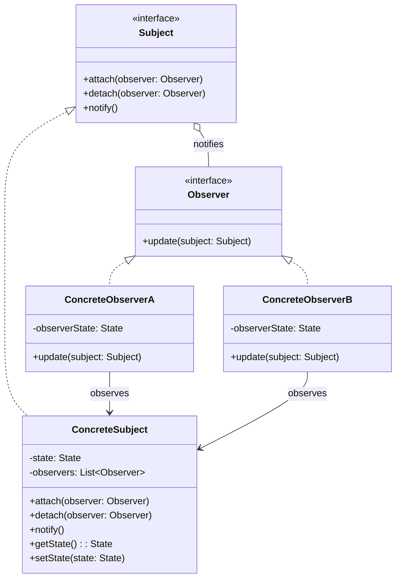

# Observer Pattern

## Introduction

The Observer pattern is a behavioral design pattern that establishes a one-to-many dependency between objects. When one object (the **subject**) changes state, all its dependents (the **observers**) are notified and updated automatically. This pattern is the backbone of event-driven architectures—from GUI frameworks and message brokers to real-time data feeds and push notification systems.

The pattern promotes loose coupling: the subject only knows that it has a list of observers conforming to a simple interface, while observers can be added or removed at runtime without modifying the subject. This makes the system easy to extend and maintain.

## Intent

Define a one-to-many dependency between objects so that when one object changes state, all its dependents are notified and updated automatically—without the subject needing to know the concrete classes of its observers.

## Class Diagram



## Key Characteristics

- **Loose coupling** — Subjects and observers interact through abstract interfaces, so neither depends on the other's concrete implementation.
- **Dynamic relationships** — Observers can subscribe and unsubscribe at runtime, making the system flexible and adaptive.
- **Broadcast communication** — A single state change in the subject triggers updates to all registered observers simultaneously.
- **Open/Closed Principle** — New observer types can be introduced without modifying the subject's code.
- **Push vs. Pull models** — The subject can push detailed change data to observers, or observers can pull only the data they need after being notified.
- **Potential for cascading updates** — One notification can trigger further state changes, so care must be taken to avoid infinite update loops.

---

## Example 1: Fintech — Real-Time Stock Price Notification System

### Problem

In a trading platform, thousands of portfolio watchers, algorithmic trading bots, and risk dashboards need to react the instant a stock price changes. Polling the price feed is wasteful and introduces latency. Hardcoding every consumer into the price feed creates a tightly coupled monolith that is impossible to extend when new analytics modules are added.

### Solution

Model the stock price feed as a **Subject**. Each consumer—portfolio tracker, trading bot, risk alert engine—implements the **Observer** interface and subscribes to the stocks it cares about. When a new price tick arrives, the feed notifies all subscribers with the updated price, achieving real-time updates with zero polling overhead.

#### Python

```python
from __future__ import annotations
from abc import ABC, abstractmethod
from dataclasses import dataclass, field
from datetime import datetime


class PriceObserver(ABC):
    @abstractmethod
    def on_price_update(self, symbol: str, price: float, timestamp: datetime) -> None: ...


@dataclass
class StockPriceFeed:
    _observers: dict[str, list[PriceObserver]] = field(default_factory=dict)
    _prices: dict[str, float] = field(default_factory=dict)

    def subscribe(self, symbol: str, observer: PriceObserver) -> None:
        self._observers.setdefault(symbol, []).append(observer)

    def unsubscribe(self, symbol: str, observer: PriceObserver) -> None:
        if symbol in self._observers:
            self._observers[symbol].remove(observer)

    def publish_price(self, symbol: str, price: float) -> None:
        self._prices[symbol] = price
        now = datetime.now()
        for obs in self._observers.get(symbol, []):
            obs.on_price_update(symbol, price, now)


class PortfolioTracker(PriceObserver):
    def __init__(self, name: str):
        self.name = name

    def on_price_update(self, symbol: str, price: float, timestamp: datetime) -> None:
        print(f"[{self.name}] {symbol} -> ${price:.2f} at {timestamp:%H:%M:%S}")


class RiskAlertEngine(PriceObserver):
    def __init__(self, threshold: float):
        self.threshold = threshold

    def on_price_update(self, symbol: str, price: float, timestamp: datetime) -> None:
        if price < self.threshold:
            print(f"[RISK ALERT] {symbol} dropped below ${self.threshold:.2f}! Current: ${price:.2f}")


if __name__ == "__main__":
    feed = StockPriceFeed()
    tracker = PortfolioTracker("Main Portfolio")
    risk = RiskAlertEngine(threshold=150.00)

    feed.subscribe("AAPL", tracker)
    feed.subscribe("AAPL", risk)
    feed.subscribe("GOOG", tracker)

    feed.publish_price("AAPL", 182.50)
    feed.publish_price("AAPL", 148.30)
    feed.publish_price("GOOG", 2841.00)
```

#### Go

```go
package main

import (
	"fmt"
	"sync"
	"time"
)

type PriceObserver interface {
	OnPriceUpdate(symbol string, price float64, timestamp time.Time)
}

type StockPriceFeed struct {
	mu        sync.RWMutex
	observers map[string][]PriceObserver
}

func NewStockPriceFeed() *StockPriceFeed {
	return &StockPriceFeed{observers: make(map[string][]PriceObserver)}
}

func (f *StockPriceFeed) Subscribe(symbol string, o PriceObserver) {
	f.mu.Lock()
	defer f.mu.Unlock()
	f.observers[symbol] = append(f.observers[symbol], o)
}

func (f *StockPriceFeed) PublishPrice(symbol string, price float64) {
	f.mu.RLock()
	defer f.mu.RUnlock()
	now := time.Now()
	for _, o := range f.observers[symbol] {
		o.OnPriceUpdate(symbol, price, now)
	}
}

type PortfolioTracker struct{ Name string }

func (p *PortfolioTracker) OnPriceUpdate(symbol string, price float64, ts time.Time) {
	fmt.Printf("[%s] %s -> $%.2f at %s\n", p.Name, symbol, price, ts.Format("15:04:05"))
}

type RiskAlertEngine struct{ Threshold float64 }

func (r *RiskAlertEngine) OnPriceUpdate(symbol string, price float64, _ time.Time) {
	if price < r.Threshold {
		fmt.Printf("[RISK ALERT] %s dropped below $%.2f! Current: $%.2f\n", symbol, r.Threshold, price)
	}
}

func main() {
	feed := NewStockPriceFeed()
	feed.Subscribe("AAPL", &PortfolioTracker{Name: "Main Portfolio"})
	feed.Subscribe("AAPL", &RiskAlertEngine{Threshold: 150.00})
	feed.Subscribe("GOOG", &PortfolioTracker{Name: "Main Portfolio"})

	feed.PublishPrice("AAPL", 182.50)
	feed.PublishPrice("AAPL", 148.30)
	feed.PublishPrice("GOOG", 2841.00)
}
```

#### Java

```java
import java.time.LocalTime;
import java.time.format.DateTimeFormatter;
import java.util.*;
import java.util.concurrent.ConcurrentHashMap;
import java.util.concurrent.CopyOnWriteArrayList;

interface PriceObserver {
    void onPriceUpdate(String symbol, double price, LocalTime timestamp);
}

class StockPriceFeed {
    private final Map<String, List<PriceObserver>> observers = new ConcurrentHashMap<>();

    public void subscribe(String symbol, PriceObserver observer) {
        observers.computeIfAbsent(symbol, k -> new CopyOnWriteArrayList<>()).add(observer);
    }

    public void unsubscribe(String symbol, PriceObserver observer) {
        List<PriceObserver> list = observers.get(symbol);
        if (list != null) list.remove(observer);
    }

    public void publishPrice(String symbol, double price) {
        LocalTime now = LocalTime.now();
        for (PriceObserver obs : observers.getOrDefault(symbol, List.of())) {
            obs.onPriceUpdate(symbol, price, now);
        }
    }
}

class PortfolioTracker implements PriceObserver {
    private final String name;
    PortfolioTracker(String name) { this.name = name; }

    @Override
    public void onPriceUpdate(String symbol, double price, LocalTime ts) {
        System.out.printf("[%s] %s -> $%.2f at %s%n", name, symbol, price,
                ts.format(DateTimeFormatter.ofPattern("HH:mm:ss")));
    }
}

class RiskAlertEngine implements PriceObserver {
    private final double threshold;
    RiskAlertEngine(double threshold) { this.threshold = threshold; }

    @Override
    public void onPriceUpdate(String symbol, double price, LocalTime ts) {
        if (price < threshold)
            System.out.printf("[RISK ALERT] %s dropped below $%.2f! Current: $%.2f%n",
                    symbol, threshold, price);
    }
}

public class StockPriceDemo {
    public static void main(String[] args) {
        StockPriceFeed feed = new StockPriceFeed();
        feed.subscribe("AAPL", new PortfolioTracker("Main Portfolio"));
        feed.subscribe("AAPL", new RiskAlertEngine(150.00));
        feed.subscribe("GOOG", new PortfolioTracker("Main Portfolio"));

        feed.publishPrice("AAPL", 182.50);
        feed.publishPrice("AAPL", 148.30);
        feed.publishPrice("GOOG", 2841.00);
    }
}
```

#### TypeScript

```typescript
interface PriceObserver {
  onPriceUpdate(symbol: string, price: number, timestamp: Date): void;
}

class StockPriceFeed {
  private observers = new Map<string, Set<PriceObserver>>();

  subscribe(symbol: string, observer: PriceObserver): void {
    if (!this.observers.has(symbol)) this.observers.set(symbol, new Set());
    this.observers.get(symbol)!.add(observer);
  }

  unsubscribe(symbol: string, observer: PriceObserver): void {
    this.observers.get(symbol)?.delete(observer);
  }

  publishPrice(symbol: string, price: number): void {
    const now = new Date();
    for (const obs of this.observers.get(symbol) ?? []) {
      obs.onPriceUpdate(symbol, price, now);
    }
  }
}

class PortfolioTracker implements PriceObserver {
  constructor(private name: string) {}

  onPriceUpdate(symbol: string, price: number, ts: Date): void {
    console.log(
      `[${this.name}] ${symbol} -> $${price.toFixed(
        2,
      )} at ${ts.toLocaleTimeString()}`,
    );
  }
}

class RiskAlertEngine implements PriceObserver {
  constructor(private threshold: number) {}

  onPriceUpdate(symbol: string, price: number, _ts: Date): void {
    if (price < this.threshold) {
      console.log(
        `[RISK ALERT] ${symbol} dropped below $${this.threshold.toFixed(
          2,
        )}! Current: $${price.toFixed(2)}`,
      );
    }
  }
}

// --- Demo ---
const feed = new StockPriceFeed();
feed.subscribe("AAPL", new PortfolioTracker("Main Portfolio"));
feed.subscribe("AAPL", new RiskAlertEngine(150.0));
feed.subscribe("GOOG", new PortfolioTracker("Main Portfolio"));

feed.publishPrice("AAPL", 182.5);
feed.publishPrice("AAPL", 148.3);
feed.publishPrice("GOOG", 2841.0);
```

#### Rust

```rust
use std::collections::HashMap;
use std::time::SystemTime;

trait PriceObserver {
    fn on_price_update(&self, symbol: &str, price: f64, timestamp: SystemTime);
}

struct StockPriceFeed {
    observers: HashMap<String, Vec<Box<dyn PriceObserver>>>,
}

impl StockPriceFeed {
    fn new() -> Self {
        Self { observers: HashMap::new() }
    }

    fn subscribe(&mut self, symbol: &str, observer: Box<dyn PriceObserver>) {
        self.observers.entry(symbol.to_string()).or_default().push(observer);
    }

    fn publish_price(&self, symbol: &str, price: f64) {
        let now = SystemTime::now();
        if let Some(obs_list) = self.observers.get(symbol) {
            for obs in obs_list {
                obs.on_price_update(symbol, price, now);
            }
        }
    }
}

struct PortfolioTracker { name: String }

impl PriceObserver for PortfolioTracker {
    fn on_price_update(&self, symbol: &str, price: f64, _ts: SystemTime) {
        println!("[{}] {} -> ${:.2}", self.name, symbol, price);
    }
}

struct RiskAlertEngine { threshold: f64 }

impl PriceObserver for RiskAlertEngine {
    fn on_price_update(&self, symbol: &str, price: f64, _ts: SystemTime) {
        if price < self.threshold {
            println!("[RISK ALERT] {} dropped below ${:.2}! Current: ${:.2}", symbol, self.threshold, price);
        }
    }
}

fn main() {
    let mut feed = StockPriceFeed::new();
    feed.subscribe("AAPL", Box::new(PortfolioTracker { name: "Main Portfolio".into() }));
    feed.subscribe("AAPL", Box::new(RiskAlertEngine { threshold: 150.0 }));
    feed.subscribe("GOOG", Box::new(PortfolioTracker { name: "Main Portfolio".into() }));

    feed.publish_price("AAPL", 182.50);
    feed.publish_price("AAPL", 148.30);
    feed.publish_price("GOOG", 2841.00);
}
```

---

## Example 2: Healthcare — Patient Vital Signs Monitoring

### Problem

In an ICU, patient monitors continuously stream vital signs—heart rate, blood pressure, SpO2. Multiple systems must react to these readings: nurse station dashboards need real-time displays, alarm systems need to fire when vitals breach thresholds, and the electronic health record needs to log every reading. Building point-to-point integrations between each monitor and each consumer is fragile and scales poorly as new monitoring equipment or downstream systems are added.

### Solution

Each patient monitor acts as a **Subject** that emits vital sign events. Nurse station displays, alarm handlers, and EHR loggers each implement the **Observer** interface and subscribe to the monitors they care about. When a new reading arrives, all subscribers receive it instantly, and new consumers can be added without touching the monitor code.

#### Python

```python
from __future__ import annotations
from abc import ABC, abstractmethod
from dataclasses import dataclass, field
from enum import Enum


class VitalType(Enum):
    HEART_RATE = "heart_rate"
    BLOOD_PRESSURE = "blood_pressure"
    SPO2 = "spo2"


@dataclass
class VitalReading:
    patient_id: str
    vital_type: VitalType
    value: float
    unit: str


class VitalSignObserver(ABC):
    @abstractmethod
    def on_vital_reading(self, reading: VitalReading) -> None: ...


@dataclass
class PatientMonitor:
    patient_id: str
    _observers: list[VitalSignObserver] = field(default_factory=list)

    def attach(self, observer: VitalSignObserver) -> None:
        self._observers.append(observer)

    def detach(self, observer: VitalSignObserver) -> None:
        self._observers.remove(observer)

    def record_vital(self, vital_type: VitalType, value: float, unit: str) -> None:
        reading = VitalReading(self.patient_id, vital_type, value, unit)
        for obs in self._observers:
            obs.on_vital_reading(reading)


class NurseStationDisplay(VitalSignObserver):
    def __init__(self, station: str):
        self.station = station

    def on_vital_reading(self, r: VitalReading) -> None:
        print(f"[{self.station}] Patient {r.patient_id}: {r.vital_type.value} = {r.value} {r.unit}")


class CriticalAlarmSystem(VitalSignObserver):
    THRESHOLDS = {VitalType.HEART_RATE: (50, 120), VitalType.SPO2: (90, 100)}

    def on_vital_reading(self, r: VitalReading) -> None:
        bounds = self.THRESHOLDS.get(r.vital_type)
        if bounds and not (bounds[0] <= r.value <= bounds[1]):
            print(f"*** CRITICAL ALARM *** Patient {r.patient_id}: {r.vital_type.value} = {r.value} {r.unit}")


if __name__ == "__main__":
    monitor = PatientMonitor(patient_id="ICU-4012")
    monitor.attach(NurseStationDisplay("Nurse Station A"))
    monitor.attach(CriticalAlarmSystem())

    monitor.record_vital(VitalType.HEART_RATE, 78, "bpm")
    monitor.record_vital(VitalType.SPO2, 88, "%")
    monitor.record_vital(VitalType.HEART_RATE, 130, "bpm")
```

#### Go

```go
package main

import "fmt"

type VitalType string

const (
	HeartRate     VitalType = "heart_rate"
	BloodPressure VitalType = "blood_pressure"
	SpO2          VitalType = "spo2"
)

type VitalReading struct {
	PatientID string
	Type      VitalType
	Value     float64
	Unit      string
}

type VitalSignObserver interface {
	OnVitalReading(reading VitalReading)
}

type PatientMonitor struct {
	PatientID string
	observers []VitalSignObserver
}

func (m *PatientMonitor) Attach(o VitalSignObserver) { m.observers = append(m.observers, o) }

func (m *PatientMonitor) RecordVital(vt VitalType, value float64, unit string) {
	r := VitalReading{PatientID: m.PatientID, Type: vt, Value: value, Unit: unit}
	for _, o := range m.observers {
		o.OnVitalReading(r)
	}
}

type NurseStationDisplay struct{ Station string }

func (n *NurseStationDisplay) OnVitalReading(r VitalReading) {
	fmt.Printf("[%s] Patient %s: %s = %.0f %s\n", n.Station, r.PatientID, r.Type, r.Value, r.Unit)
}

type CriticalAlarmSystem struct{}

func (c *CriticalAlarmSystem) OnVitalReading(r VitalReading) {
	switch r.Type {
	case HeartRate:
		if r.Value < 50 || r.Value > 120 {
			fmt.Printf("*** CRITICAL ALARM *** Patient %s: %s = %.0f %s\n", r.PatientID, r.Type, r.Value, r.Unit)
		}
	case SpO2:
		if r.Value < 90 {
			fmt.Printf("*** CRITICAL ALARM *** Patient %s: %s = %.0f %s\n", r.PatientID, r.Type, r.Value, r.Unit)
		}
	}
}

func main() {
	monitor := &PatientMonitor{PatientID: "ICU-4012"}
	monitor.Attach(&NurseStationDisplay{Station: "Nurse Station A"})
	monitor.Attach(&CriticalAlarmSystem{})

	monitor.RecordVital(HeartRate, 78, "bpm")
	monitor.RecordVital(SpO2, 88, "%")
	monitor.RecordVital(HeartRate, 130, "bpm")
}
```

#### Java

```java
import java.util.ArrayList;
import java.util.List;

enum VitalType { HEART_RATE, BLOOD_PRESSURE, SPO2 }

record VitalReading(String patientId, VitalType type, double value, String unit) {}

interface VitalSignObserver {
    void onVitalReading(VitalReading reading);
}

class PatientMonitor {
    private final String patientId;
    private final List<VitalSignObserver> observers = new ArrayList<>();

    PatientMonitor(String patientId) { this.patientId = patientId; }

    void attach(VitalSignObserver o) { observers.add(o); }
    void detach(VitalSignObserver o) { observers.remove(o); }

    void recordVital(VitalType type, double value, String unit) {
        VitalReading reading = new VitalReading(patientId, type, value, unit);
        observers.forEach(o -> o.onVitalReading(reading));
    }
}

class NurseStationDisplay implements VitalSignObserver {
    private final String station;
    NurseStationDisplay(String station) { this.station = station; }

    @Override
    public void onVitalReading(VitalReading r) {
        System.out.printf("[%s] Patient %s: %s = %.0f %s%n",
                station, r.patientId(), r.type(), r.value(), r.unit());
    }
}

class CriticalAlarmSystem implements VitalSignObserver {
    @Override
    public void onVitalReading(VitalReading r) {
        boolean critical = switch (r.type()) {
            case HEART_RATE -> r.value() < 50 || r.value() > 120;
            case SPO2 -> r.value() < 90;
            default -> false;
        };
        if (critical)
            System.out.printf("*** CRITICAL ALARM *** Patient %s: %s = %.0f %s%n",
                    r.patientId(), r.type(), r.value(), r.unit());
    }
}

public class VitalSignsDemo {
    public static void main(String[] args) {
        PatientMonitor monitor = new PatientMonitor("ICU-4012");
        monitor.attach(new NurseStationDisplay("Nurse Station A"));
        monitor.attach(new CriticalAlarmSystem());

        monitor.recordVital(VitalType.HEART_RATE, 78, "bpm");
        monitor.recordVital(VitalType.SPO2, 88, "%");
        monitor.recordVital(VitalType.HEART_RATE, 130, "bpm");
    }
}
```

#### TypeScript

```typescript
enum VitalType {
  HeartRate = "heart_rate",
  BloodPressure = "blood_pressure",
  SpO2 = "spo2",
}

interface VitalReading {
  patientId: string;
  type: VitalType;
  value: number;
  unit: string;
}

interface VitalSignObserver {
  onVitalReading(reading: VitalReading): void;
}

class PatientMonitor {
  private observers: VitalSignObserver[] = [];

  constructor(private patientId: string) {}

  attach(observer: VitalSignObserver): void {
    this.observers.push(observer);
  }

  detach(observer: VitalSignObserver): void {
    this.observers = this.observers.filter((o) => o !== observer);
  }

  recordVital(type: VitalType, value: number, unit: string): void {
    const reading: VitalReading = {
      patientId: this.patientId,
      type,
      value,
      unit,
    };
    for (const obs of this.observers) obs.onVitalReading(reading);
  }
}

class NurseStationDisplay implements VitalSignObserver {
  constructor(private station: string) {}

  onVitalReading(r: VitalReading): void {
    console.log(
      `[${this.station}] Patient ${r.patientId}: ${r.type} = ${r.value} ${r.unit}`,
    );
  }
}

class CriticalAlarmSystem implements VitalSignObserver {
  private thresholds: Record<string, [number, number]> = {
    [VitalType.HeartRate]: [50, 120],
    [VitalType.SpO2]: [90, 100],
  };

  onVitalReading(r: VitalReading): void {
    const bounds = this.thresholds[r.type];
    if (bounds && (r.value < bounds[0] || r.value > bounds[1])) {
      console.log(
        `*** CRITICAL ALARM *** Patient ${r.patientId}: ${r.type} = ${r.value} ${r.unit}`,
      );
    }
  }
}

// --- Demo ---
const monitor = new PatientMonitor("ICU-4012");
monitor.attach(new NurseStationDisplay("Nurse Station A"));
monitor.attach(new CriticalAlarmSystem());

monitor.recordVital(VitalType.HeartRate, 78, "bpm");
monitor.recordVital(VitalType.SpO2, 88, "%");
monitor.recordVital(VitalType.HeartRate, 130, "bpm");
```

#### Rust

```rust
use std::fmt;

#[derive(Debug, Clone, Copy)]
enum VitalType { HeartRate, BloodPressure, SpO2 }

impl fmt::Display for VitalType {
    fn fmt(&self, f: &mut fmt::Formatter) -> fmt::Result {
        match self {
            VitalType::HeartRate => write!(f, "heart_rate"),
            VitalType::BloodPressure => write!(f, "blood_pressure"),
            VitalType::SpO2 => write!(f, "spo2"),
        }
    }
}

struct VitalReading {
    patient_id: String,
    vital_type: VitalType,
    value: f64,
    unit: String,
}

trait VitalSignObserver {
    fn on_vital_reading(&self, reading: &VitalReading);
}

struct PatientMonitor {
    patient_id: String,
    observers: Vec<Box<dyn VitalSignObserver>>,
}

impl PatientMonitor {
    fn new(patient_id: &str) -> Self {
        Self { patient_id: patient_id.to_string(), observers: vec![] }
    }

    fn attach(&mut self, o: Box<dyn VitalSignObserver>) { self.observers.push(o); }

    fn record_vital(&self, vital_type: VitalType, value: f64, unit: &str) {
        let reading = VitalReading {
            patient_id: self.patient_id.clone(), vital_type, value, unit: unit.to_string(),
        };
        for obs in &self.observers { obs.on_vital_reading(&reading); }
    }
}

struct NurseStationDisplay { station: String }

impl VitalSignObserver for NurseStationDisplay {
    fn on_vital_reading(&self, r: &VitalReading) {
        println!("[{}] Patient {}: {} = {:.0} {}", self.station, r.patient_id, r.vital_type, r.value, r.unit);
    }
}

struct CriticalAlarmSystem;

impl VitalSignObserver for CriticalAlarmSystem {
    fn on_vital_reading(&self, r: &VitalReading) {
        let critical = match r.vital_type {
            VitalType::HeartRate => r.value < 50.0 || r.value > 120.0,
            VitalType::SpO2 => r.value < 90.0,
            _ => false,
        };
        if critical {
            println!("*** CRITICAL ALARM *** Patient {}: {} = {:.0} {}", r.patient_id, r.vital_type, r.value, r.unit);
        }
    }
}

fn main() {
    let mut monitor = PatientMonitor::new("ICU-4012");
    monitor.attach(Box::new(NurseStationDisplay { station: "Nurse Station A".into() }));
    monitor.attach(Box::new(CriticalAlarmSystem));

    monitor.record_vital(VitalType::HeartRate, 78.0, "bpm");
    monitor.record_vital(VitalType::SpO2, 88.0, "%");
    monitor.record_vital(VitalType::HeartRate, 130.0, "bpm");
}
```

---

## Example 3: E-Commerce — Product Back-in-Stock Notification

### Problem

On an e-commerce platform, popular items frequently go out of stock. Customers want to be notified the moment an item is available again—via email, push notification, or SMS. Without a subscription mechanism, the platform either bombards all users with irrelevant alerts or forces customers to manually check the product page, leading to lost sales and poor user experience.

### Solution

The product inventory acts as a **Subject**. When a customer clicks "Notify me when available," a notification observer (email, SMS, or push) is registered for that product's SKU. When inventory is restocked, the subject notifies all waiting observers, and each delivers the alert through its specific channel. Observers are automatically removed after notification to avoid duplicate alerts.

#### Python

```python
from __future__ import annotations
from abc import ABC, abstractmethod
from dataclasses import dataclass, field


class RestockObserver(ABC):
    @abstractmethod
    def on_back_in_stock(self, sku: str, product_name: str, price: float) -> None: ...


@dataclass
class ProductInventory:
    sku: str
    product_name: str
    price: float
    _stock: int = 0
    _waitlist: list[RestockObserver] = field(default_factory=list)

    def subscribe_restock(self, observer: RestockObserver) -> None:
        self._waitlist.append(observer)
        print(f"  -> {observer} added to waitlist for {self.sku}")

    def restock(self, quantity: int) -> None:
        was_empty = self._stock == 0
        self._stock += quantity
        print(f"\n[Inventory] {self.sku} restocked: +{quantity} (total: {self._stock})")
        if was_empty and self._stock > 0:
            for obs in self._waitlist:
                obs.on_back_in_stock(self.sku, self.product_name, self.price)
            self._waitlist.clear()


class EmailNotifier(RestockObserver):
    def __init__(self, email: str):
        self.email = email

    def on_back_in_stock(self, sku: str, name: str, price: float) -> None:
        print(f"  [EMAIL -> {self.email}] '{name}' (SKU: {sku}) is back in stock at ${price:.2f}!")

    def __repr__(self) -> str:
        return f"EmailNotifier({self.email})"


class SMSNotifier(RestockObserver):
    def __init__(self, phone: str):
        self.phone = phone

    def on_back_in_stock(self, sku: str, name: str, price: float) -> None:
        print(f"  [SMS -> {self.phone}] '{name}' is back! ${price:.2f} — Order now.")

    def __repr__(self) -> str:
        return f"SMSNotifier({self.phone})"


if __name__ == "__main__":
    product = ProductInventory(sku="GPU-RTX4090", product_name="NVIDIA RTX 4090", price=1599.99)
    product.subscribe_restock(EmailNotifier("alice@example.com"))
    product.subscribe_restock(SMSNotifier("+1-555-0199"))
    product.subscribe_restock(EmailNotifier("bob@example.com"))

    product.restock(25)
```

#### Go

```go
package main

import "fmt"

type RestockObserver interface {
	OnBackInStock(sku, productName string, price float64)
}

type ProductInventory struct {
	SKU         string
	ProductName string
	Price       float64
	stock       int
	waitlist    []RestockObserver
}

func (p *ProductInventory) SubscribeRestock(o RestockObserver) {
	p.waitlist = append(p.waitlist, o)
}

func (p *ProductInventory) Restock(quantity int) {
	wasEmpty := p.stock == 0
	p.stock += quantity
	fmt.Printf("[Inventory] %s restocked: +%d (total: %d)\n", p.SKU, quantity, p.stock)
	if wasEmpty && p.stock > 0 {
		for _, o := range p.waitlist {
			o.OnBackInStock(p.SKU, p.ProductName, p.Price)
		}
		p.waitlist = nil
	}
}

type EmailNotifier struct{ Email string }

func (e *EmailNotifier) OnBackInStock(sku, name string, price float64) {
	fmt.Printf("  [EMAIL -> %s] '%s' (SKU: %s) is back at $%.2f!\n", e.Email, name, sku, price)
}

type SMSNotifier struct{ Phone string }

func (s *SMSNotifier) OnBackInStock(sku, name string, price float64) {
	fmt.Printf("  [SMS -> %s] '%s' is back! $%.2f\n", s.Phone, name, price)
}

func main() {
	product := &ProductInventory{SKU: "GPU-RTX4090", ProductName: "NVIDIA RTX 4090", Price: 1599.99}
	product.SubscribeRestock(&EmailNotifier{Email: "alice@example.com"})
	product.SubscribeRestock(&SMSNotifier{Phone: "+1-555-0199"})
	product.SubscribeRestock(&EmailNotifier{Email: "bob@example.com"})

	product.Restock(25)
}
```

#### Java

```java
import java.util.ArrayList;
import java.util.List;

interface RestockObserver {
    void onBackInStock(String sku, String productName, double price);
}

class ProductInventory {
    private final String sku;
    private final String productName;
    private final double price;
    private int stock = 0;
    private final List<RestockObserver> waitlist = new ArrayList<>();

    ProductInventory(String sku, String productName, double price) {
        this.sku = sku; this.productName = productName; this.price = price;
    }

    void subscribeRestock(RestockObserver o) { waitlist.add(o); }

    void restock(int quantity) {
        boolean wasEmpty = stock == 0;
        stock += quantity;
        System.out.printf("[Inventory] %s restocked: +%d (total: %d)%n", sku, quantity, stock);
        if (wasEmpty && stock > 0) {
            waitlist.forEach(o -> o.onBackInStock(sku, productName, price));
            waitlist.clear();
        }
    }
}

class EmailNotifier implements RestockObserver {
    private final String email;
    EmailNotifier(String email) { this.email = email; }

    @Override
    public void onBackInStock(String sku, String name, double price) {
        System.out.printf("  [EMAIL -> %s] '%s' (SKU: %s) is back at $%.2f!%n", email, name, sku, price);
    }
}

class SMSNotifier implements RestockObserver {
    private final String phone;
    SMSNotifier(String phone) { this.phone = phone; }

    @Override
    public void onBackInStock(String sku, String name, double price) {
        System.out.printf("  [SMS -> %s] '%s' is back! $%.2f%n", phone, name, price);
    }
}

public class RestockDemo {
    public static void main(String[] args) {
        ProductInventory product = new ProductInventory("GPU-RTX4090", "NVIDIA RTX 4090", 1599.99);
        product.subscribeRestock(new EmailNotifier("alice@example.com"));
        product.subscribeRestock(new SMSNotifier("+1-555-0199"));
        product.subscribeRestock(new EmailNotifier("bob@example.com"));

        product.restock(25);
    }
}
```

#### TypeScript

```typescript
interface RestockObserver {
  onBackInStock(sku: string, productName: string, price: number): void;
}

class ProductInventory {
  private stock = 0;
  private waitlist: RestockObserver[] = [];

  constructor(
    public readonly sku: string,
    public readonly productName: string,
    public readonly price: number,
  ) {}

  subscribeRestock(observer: RestockObserver): void {
    this.waitlist.push(observer);
  }

  restock(quantity: number): void {
    const wasEmpty = this.stock === 0;
    this.stock += quantity;
    console.log(
      `[Inventory] ${this.sku} restocked: +${quantity} (total: ${this.stock})`,
    );
    if (wasEmpty && this.stock > 0) {
      for (const obs of this.waitlist) {
        obs.onBackInStock(this.sku, this.productName, this.price);
      }
      this.waitlist = [];
    }
  }
}

class EmailNotifier implements RestockObserver {
  constructor(private email: string) {}
  onBackInStock(sku: string, name: string, price: number): void {
    console.log(
      `  [EMAIL -> ${
        this.email
      }] '${name}' (SKU: ${sku}) is back at $${price.toFixed(2)}!`,
    );
  }
}

class SMSNotifier implements RestockObserver {
  constructor(private phone: string) {}
  onBackInStock(sku: string, name: string, price: number): void {
    console.log(
      `  [SMS -> ${this.phone}] '${name}' is back! $${price.toFixed(2)}`,
    );
  }
}

// --- Demo ---
const product = new ProductInventory("GPU-RTX4090", "NVIDIA RTX 4090", 1599.99);
product.subscribeRestock(new EmailNotifier("alice@example.com"));
product.subscribeRestock(new SMSNotifier("+1-555-0199"));
product.subscribeRestock(new EmailNotifier("bob@example.com"));

product.restock(25);
```

#### Rust

```rust
trait RestockObserver {
    fn on_back_in_stock(&self, sku: &str, product_name: &str, price: f64);
}

struct ProductInventory {
    sku: String,
    product_name: String,
    price: f64,
    stock: u32,
    waitlist: Vec<Box<dyn RestockObserver>>,
}

impl ProductInventory {
    fn new(sku: &str, product_name: &str, price: f64) -> Self {
        Self {
            sku: sku.into(), product_name: product_name.into(),
            price, stock: 0, waitlist: vec![],
        }
    }

    fn subscribe_restock(&mut self, o: Box<dyn RestockObserver>) {
        self.waitlist.push(o);
    }

    fn restock(&mut self, quantity: u32) {
        let was_empty = self.stock == 0;
        self.stock += quantity;
        println!("[Inventory] {} restocked: +{} (total: {})", self.sku, quantity, self.stock);
        if was_empty && self.stock > 0 {
            for obs in &self.waitlist {
                obs.on_back_in_stock(&self.sku, &self.product_name, self.price);
            }
            self.waitlist.clear();
        }
    }
}

struct EmailNotifier { email: String }

impl RestockObserver for EmailNotifier {
    fn on_back_in_stock(&self, sku: &str, name: &str, price: f64) {
        println!("  [EMAIL -> {}] '{}' (SKU: {}) is back at ${:.2}!", self.email, name, sku, price);
    }
}

struct SMSNotifier { phone: String }

impl RestockObserver for SMSNotifier {
    fn on_back_in_stock(&self, sku: &str, name: &str, price: f64) {
        println!("  [SMS -> {}] '{}' is back! ${:.2}", self.phone, name, price);
    }
}

fn main() {
    let mut product = ProductInventory::new("GPU-RTX4090", "NVIDIA RTX 4090", 1599.99);
    product.subscribe_restock(Box::new(EmailNotifier { email: "alice@example.com".into() }));
    product.subscribe_restock(Box::new(SMSNotifier { phone: "+1-555-0199".into() }));
    product.subscribe_restock(Box::new(EmailNotifier { email: "bob@example.com".into() }));

    product.restock(25);
}
```

---

## Example 4: Media/Streaming — Content Publish Notification

### Problem

A streaming platform releases new episodes across hundreds of shows. Millions of subscribers each follow a different set of shows and expect to be notified through their preferred channels (in-app notification, email digest, push notification) the moment a new episode drops. Iterating over the entire user base for every release is computationally expensive and tightly couples the content pipeline to the notification infrastructure.

### Solution

Each show acts as a **Subject**. When a user follows a show, their notification preference (push, email, in-app) is registered as an **Observer** on that show. When the content team publishes a new episode, only the observers subscribed to that specific show are notified, keeping the fanout efficient and the content pipeline decoupled from delivery channels.

#### Python

```python
from __future__ import annotations
from abc import ABC, abstractmethod
from dataclasses import dataclass, field


@dataclass
class Episode:
    show: str
    season: int
    number: int
    title: str


class ContentObserver(ABC):
    @abstractmethod
    def on_new_episode(self, episode: Episode) -> None: ...


@dataclass
class ShowFeed:
    show_name: str
    _subscribers: list[ContentObserver] = field(default_factory=list)

    def follow(self, observer: ContentObserver) -> None:
        self._subscribers.append(observer)

    def unfollow(self, observer: ContentObserver) -> None:
        self._subscribers.remove(observer)

    def publish_episode(self, season: int, number: int, title: str) -> None:
        ep = Episode(self.show_name, season, number, title)
        print(f"\n[PUBLISH] {self.show_name} S{season:02d}E{number:02d} — \"{title}\"")
        for sub in self._subscribers:
            sub.on_new_episode(ep)


class PushNotification(ContentObserver):
    def __init__(self, user: str, device_token: str):
        self.user = user
        self.device_token = device_token

    def on_new_episode(self, ep: Episode) -> None:
        print(f"  [PUSH -> {self.user}] New episode of {ep.show}: S{ep.season:02d}E{ep.number:02d} \"{ep.title}\"")


class EmailDigest(ContentObserver):
    def __init__(self, user: str, email: str):
        self.user = user
        self.email = email

    def on_new_episode(self, ep: Episode) -> None:
        print(f"  [EMAIL -> {self.email}] {ep.show} just released \"{ep.title}\" (S{ep.season:02d}E{ep.number:02d})")


class InAppNotification(ContentObserver):
    def __init__(self, user_id: str):
        self.user_id = user_id

    def on_new_episode(self, ep: Episode) -> None:
        print(f"  [IN-APP -> {self.user_id}] \"{ep.title}\" is now streaming on {ep.show}")


if __name__ == "__main__":
    stranger_things = ShowFeed("Stranger Things")
    stranger_things.follow(PushNotification("alice", "device-abc123"))
    stranger_things.follow(EmailDigest("bob", "bob@example.com"))
    stranger_things.follow(InAppNotification("user-charlie"))

    stranger_things.publish_episode(5, 1, "The Crawl")
    stranger_things.publish_episode(5, 2, "The Vanishing of Eleven")
```

#### Go

```go
package main

import "fmt"

type Episode struct {
	Show   string
	Season int
	Number int
	Title  string
}

type ContentObserver interface {
	OnNewEpisode(ep Episode)
}

type ShowFeed struct {
	ShowName    string
	subscribers []ContentObserver
}

func (s *ShowFeed) Follow(o ContentObserver)   { s.subscribers = append(s.subscribers, o) }

func (s *ShowFeed) PublishEpisode(season, number int, title string) {
	ep := Episode{Show: s.ShowName, Season: season, Number: number, Title: title}
	fmt.Printf("\n[PUBLISH] %s S%02dE%02d — \"%s\"\n", s.ShowName, season, number, title)
	for _, sub := range s.subscribers {
		sub.OnNewEpisode(ep)
	}
}

type PushNotification struct{ User, DeviceToken string }

func (p *PushNotification) OnNewEpisode(ep Episode) {
	fmt.Printf("  [PUSH -> %s] New episode of %s: S%02dE%02d \"%s\"\n", p.User, ep.Show, ep.Season, ep.Number, ep.Title)
}

type EmailDigest struct{ User, Email string }

func (e *EmailDigest) OnNewEpisode(ep Episode) {
	fmt.Printf("  [EMAIL -> %s] %s just released \"%s\"\n", e.Email, ep.Show, ep.Title)
}

type InAppNotification struct{ UserID string }

func (i *InAppNotification) OnNewEpisode(ep Episode) {
	fmt.Printf("  [IN-APP -> %s] \"%s\" is now streaming on %s\n", i.UserID, ep.Title, ep.Show)
}

func main() {
	show := &ShowFeed{ShowName: "Stranger Things"}
	show.Follow(&PushNotification{User: "alice", DeviceToken: "device-abc123"})
	show.Follow(&EmailDigest{User: "bob", Email: "bob@example.com"})
	show.Follow(&InAppNotification{UserID: "user-charlie"})

	show.PublishEpisode(5, 1, "The Crawl")
	show.PublishEpisode(5, 2, "The Vanishing of Eleven")
}
```

#### Java

```java
import java.util.ArrayList;
import java.util.List;

record Episode(String show, int season, int number, String title) {}

interface ContentObserver {
    void onNewEpisode(Episode episode);
}

class ShowFeed {
    private final String showName;
    private final List<ContentObserver> subscribers = new ArrayList<>();

    ShowFeed(String showName) { this.showName = showName; }

    void follow(ContentObserver o) { subscribers.add(o); }
    void unfollow(ContentObserver o) { subscribers.remove(o); }

    void publishEpisode(int season, int number, String title) {
        Episode ep = new Episode(showName, season, number, title);
        System.out.printf("%n[PUBLISH] %s S%02dE%02d — \"%s\"%n", showName, season, number, title);
        subscribers.forEach(s -> s.onNewEpisode(ep));
    }
}

class PushNotification implements ContentObserver {
    private final String user;
    PushNotification(String user) { this.user = user; }

    @Override
    public void onNewEpisode(Episode ep) {
        System.out.printf("  [PUSH -> %s] New episode of %s: S%02dE%02d \"%s\"%n",
                user, ep.show(), ep.season(), ep.number(), ep.title());
    }
}

class EmailDigest implements ContentObserver {
    private final String email;
    EmailDigest(String email) { this.email = email; }

    @Override
    public void onNewEpisode(Episode ep) {
        System.out.printf("  [EMAIL -> %s] %s just released \"%s\"%n", email, ep.show(), ep.title());
    }
}

class InAppNotification implements ContentObserver {
    private final String userId;
    InAppNotification(String userId) { this.userId = userId; }

    @Override
    public void onNewEpisode(Episode ep) {
        System.out.printf("  [IN-APP -> %s] \"%s\" is now streaming on %s%n", userId, ep.title(), ep.show());
    }
}

public class StreamingDemo {
    public static void main(String[] args) {
        ShowFeed show = new ShowFeed("Stranger Things");
        show.follow(new PushNotification("alice"));
        show.follow(new EmailDigest("bob@example.com"));
        show.follow(new InAppNotification("user-charlie"));

        show.publishEpisode(5, 1, "The Crawl");
        show.publishEpisode(5, 2, "The Vanishing of Eleven");
    }
}
```

#### TypeScript

```typescript
interface Episode {
  show: string;
  season: number;
  number: number;
  title: string;
}

interface ContentObserver {
  onNewEpisode(episode: Episode): void;
}

class ShowFeed {
  private subscribers: ContentObserver[] = [];

  constructor(public readonly showName: string) {}

  follow(observer: ContentObserver): void {
    this.subscribers.push(observer);
  }

  unfollow(observer: ContentObserver): void {
    this.subscribers = this.subscribers.filter((s) => s !== observer);
  }

  publishEpisode(season: number, number: number, title: string): void {
    const ep: Episode = { show: this.showName, season, number, title };
    const tag = `S${String(season).padStart(2, "0")}E${String(number).padStart(
      2,
      "0",
    )}`;
    console.log(`\n[PUBLISH] ${this.showName} ${tag} — "${title}"`);
    for (const sub of this.subscribers) sub.onNewEpisode(ep);
  }
}

class PushNotification implements ContentObserver {
  constructor(private user: string) {}
  onNewEpisode(ep: Episode): void {
    console.log(
      `  [PUSH -> ${this.user}] New episode of ${ep.show}: "${ep.title}"`,
    );
  }
}

class EmailDigest implements ContentObserver {
  constructor(private email: string) {}
  onNewEpisode(ep: Episode): void {
    console.log(
      `  [EMAIL -> ${this.email}] ${ep.show} just released "${ep.title}"`,
    );
  }
}

class InAppNotification implements ContentObserver {
  constructor(private userId: string) {}
  onNewEpisode(ep: Episode): void {
    console.log(
      `  [IN-APP -> ${this.userId}] "${ep.title}" is now streaming on ${ep.show}`,
    );
  }
}

// --- Demo ---
const show = new ShowFeed("Stranger Things");
show.follow(new PushNotification("alice"));
show.follow(new EmailDigest("bob@example.com"));
show.follow(new InAppNotification("user-charlie"));

show.publishEpisode(5, 1, "The Crawl");
show.publishEpisode(5, 2, "The Vanishing of Eleven");
```

#### Rust

```rust
struct Episode {
    show: String,
    season: u32,
    number: u32,
    title: String,
}

trait ContentObserver {
    fn on_new_episode(&self, episode: &Episode);
}

struct ShowFeed {
    show_name: String,
    subscribers: Vec<Box<dyn ContentObserver>>,
}

impl ShowFeed {
    fn new(show_name: &str) -> Self {
        Self { show_name: show_name.into(), subscribers: vec![] }
    }

    fn follow(&mut self, observer: Box<dyn ContentObserver>) {
        self.subscribers.push(observer);
    }

    fn publish_episode(&self, season: u32, number: u32, title: &str) {
        let ep = Episode {
            show: self.show_name.clone(), season, number, title: title.into(),
        };
        println!("\n[PUBLISH] {} S{:02}E{:02} — \"{}\"", self.show_name, season, number, title);
        for sub in &self.subscribers {
            sub.on_new_episode(&ep);
        }
    }
}

struct PushNotification { user: String }

impl ContentObserver for PushNotification {
    fn on_new_episode(&self, ep: &Episode) {
        println!("  [PUSH -> {}] New episode of {}: \"{}\"", self.user, ep.show, ep.title);
    }
}

struct EmailDigest { email: String }

impl ContentObserver for EmailDigest {
    fn on_new_episode(&self, ep: &Episode) {
        println!("  [EMAIL -> {}] {} just released \"{}\"", self.email, ep.show, ep.title);
    }
}

struct InAppNotification { user_id: String }

impl ContentObserver for InAppNotification {
    fn on_new_episode(&self, ep: &Episode) {
        println!("  [IN-APP -> {}] \"{}\" is now streaming on {}", self.user_id, ep.title, ep.show);
    }
}

fn main() {
    let mut show = ShowFeed::new("Stranger Things");
    show.follow(Box::new(PushNotification { user: "alice".into() }));
    show.follow(Box::new(EmailDigest { email: "bob@example.com".into() }));
    show.follow(Box::new(InAppNotification { user_id: "user-charlie".into() }));

    show.publish_episode(5, 1, "The Crawl");
    show.publish_episode(5, 2, "The Vanishing of Eleven");
}
```

---

## Example 5: Logistics — Shipment Tracking Updates

### Problem

In a logistics network, a single shipment passes through multiple stages—picked up, in transit, at customs, out for delivery, delivered. Multiple parties need real-time visibility: the end customer wants delivery ETAs, the warehouse needs to prepare dock slots, and the internal operations dashboard must track SLA compliance. Building separate polling integrations for each party is fragile, expensive, and introduces unacceptable delays.

### Solution

Each shipment is modeled as a **Subject** that maintains its current status. Customers, warehouse systems, and operations dashboards register as **Observers**. When the status changes—scanned at a hub, cleared customs, out for delivery—the shipment notifies all observers with the new status, location, and estimated arrival. Each observer reacts according to its role without any coupling to the others.

#### Python

```python
from __future__ import annotations
from abc import ABC, abstractmethod
from dataclasses import dataclass, field
from datetime import datetime
from enum import Enum


class ShipmentStatus(Enum):
    PICKED_UP = "picked_up"
    IN_TRANSIT = "in_transit"
    AT_CUSTOMS = "at_customs"
    OUT_FOR_DELIVERY = "out_for_delivery"
    DELIVERED = "delivered"


@dataclass
class StatusUpdate:
    tracking_id: str
    status: ShipmentStatus
    location: str
    eta: str
    timestamp: datetime


class ShipmentObserver(ABC):
    @abstractmethod
    def on_status_change(self, update: StatusUpdate) -> None: ...


@dataclass
class Shipment:
    tracking_id: str
    _observers: list[ShipmentObserver] = field(default_factory=list)

    def subscribe(self, observer: ShipmentObserver) -> None:
        self._observers.append(observer)

    def unsubscribe(self, observer: ShipmentObserver) -> None:
        self._observers.remove(observer)

    def update_status(self, status: ShipmentStatus, location: str, eta: str) -> None:
        update = StatusUpdate(self.tracking_id, status, location, eta, datetime.now())
        print(f"\n[SHIPMENT {self.tracking_id}] Status -> {status.value} @ {location}")
        for obs in self._observers:
            obs.on_status_change(update)


class CustomerTracker(ShipmentObserver):
    def __init__(self, customer_name: str, phone: str):
        self.customer_name = customer_name
        self.phone = phone

    def on_status_change(self, u: StatusUpdate) -> None:
        print(f"  [SMS -> {self.phone}] Hi {self.customer_name}, your package {u.tracking_id} "
              f"is now '{u.status.value}' at {u.location}. ETA: {u.eta}")


class WarehouseReceiver(ShipmentObserver):
    def __init__(self, warehouse_id: str):
        self.warehouse_id = warehouse_id

    def on_status_change(self, u: StatusUpdate) -> None:
        if u.status in (ShipmentStatus.IN_TRANSIT, ShipmentStatus.OUT_FOR_DELIVERY):
            print(f"  [WAREHOUSE {self.warehouse_id}] Prepare dock for {u.tracking_id}. ETA: {u.eta}")


class OperationsDashboard(ShipmentObserver):
    def on_status_change(self, u: StatusUpdate) -> None:
        print(f"  [OPS DASHBOARD] {u.tracking_id} | {u.status.value} | {u.location} | {u.timestamp:%H:%M:%S}")


if __name__ == "__main__":
    shipment = Shipment(tracking_id="SHP-90421-US")
    shipment.subscribe(CustomerTracker("Diana Prince", "+1-555-0342"))
    shipment.subscribe(WarehouseReceiver("WH-EAST-07"))
    shipment.subscribe(OperationsDashboard())

    shipment.update_status(ShipmentStatus.PICKED_UP, "Los Angeles, CA", "2026-03-14")
    shipment.update_status(ShipmentStatus.IN_TRANSIT, "Phoenix, AZ", "2026-03-13")
    shipment.update_status(ShipmentStatus.OUT_FOR_DELIVERY, "New York, NY", "2026-03-12 5PM")
    shipment.update_status(ShipmentStatus.DELIVERED, "New York, NY", "—")
```

#### Go

```go
package main

import (
	"fmt"
	"time"
)

type ShipmentStatus string

const (
	PickedUp       ShipmentStatus = "picked_up"
	InTransit      ShipmentStatus = "in_transit"
	AtCustoms      ShipmentStatus = "at_customs"
	OutForDelivery ShipmentStatus = "out_for_delivery"
	Delivered      ShipmentStatus = "delivered"
)

type StatusUpdate struct {
	TrackingID string
	Status     ShipmentStatus
	Location   string
	ETA        string
	Timestamp  time.Time
}

type ShipmentObserver interface {
	OnStatusChange(update StatusUpdate)
}

type Shipment struct {
	TrackingID string
	observers  []ShipmentObserver
}

func (s *Shipment) Subscribe(o ShipmentObserver) { s.observers = append(s.observers, o) }

func (s *Shipment) UpdateStatus(status ShipmentStatus, location, eta string) {
	u := StatusUpdate{s.TrackingID, status, location, eta, time.Now()}
	fmt.Printf("\n[SHIPMENT %s] Status -> %s @ %s\n", s.TrackingID, status, location)
	for _, o := range s.observers {
		o.OnStatusChange(u)
	}
}

type CustomerTracker struct {
	Name, Phone string
}

func (c *CustomerTracker) OnStatusChange(u StatusUpdate) {
	fmt.Printf("  [SMS -> %s] Hi %s, package %s is '%s' at %s. ETA: %s\n",
		c.Phone, c.Name, u.TrackingID, u.Status, u.Location, u.ETA)
}

type WarehouseReceiver struct{ WarehouseID string }

func (w *WarehouseReceiver) OnStatusChange(u StatusUpdate) {
	if u.Status == InTransit || u.Status == OutForDelivery {
		fmt.Printf("  [WAREHOUSE %s] Prepare dock for %s. ETA: %s\n", w.WarehouseID, u.TrackingID, u.ETA)
	}
}

type OperationsDashboard struct{}

func (o *OperationsDashboard) OnStatusChange(u StatusUpdate) {
	fmt.Printf("  [OPS DASHBOARD] %s | %s | %s | %s\n",
		u.TrackingID, u.Status, u.Location, u.Timestamp.Format("15:04:05"))
}

func main() {
	shipment := &Shipment{TrackingID: "SHP-90421-US"}
	shipment.Subscribe(&CustomerTracker{Name: "Diana Prince", Phone: "+1-555-0342"})
	shipment.Subscribe(&WarehouseReceiver{WarehouseID: "WH-EAST-07"})
	shipment.Subscribe(&OperationsDashboard{})

	shipment.UpdateStatus(PickedUp, "Los Angeles, CA", "2026-03-14")
	shipment.UpdateStatus(InTransit, "Phoenix, AZ", "2026-03-13")
	shipment.UpdateStatus(OutForDelivery, "New York, NY", "2026-03-12 5PM")
	shipment.UpdateStatus(Delivered, "New York, NY", "—")
}
```

#### Java

```java
import java.time.LocalTime;
import java.time.format.DateTimeFormatter;
import java.util.ArrayList;
import java.util.List;
import java.util.Set;

enum ShipmentStatus {
    PICKED_UP, IN_TRANSIT, AT_CUSTOMS, OUT_FOR_DELIVERY, DELIVERED
}

record StatusUpdate(String trackingId, ShipmentStatus status, String location,
                    String eta, LocalTime timestamp) {}

interface ShipmentObserver {
    void onStatusChange(StatusUpdate update);
}

class Shipment {
    private final String trackingId;
    private final List<ShipmentObserver> observers = new ArrayList<>();

    Shipment(String trackingId) { this.trackingId = trackingId; }

    void subscribe(ShipmentObserver o) { observers.add(o); }

    void updateStatus(ShipmentStatus status, String location, String eta) {
        StatusUpdate u = new StatusUpdate(trackingId, status, location, eta, LocalTime.now());
        System.out.printf("%n[SHIPMENT %s] Status -> %s @ %s%n", trackingId, status, location);
        observers.forEach(o -> o.onStatusChange(u));
    }
}

class CustomerTracker implements ShipmentObserver {
    private final String name, phone;
    CustomerTracker(String name, String phone) { this.name = name; this.phone = phone; }

    @Override
    public void onStatusChange(StatusUpdate u) {
        System.out.printf("  [SMS -> %s] Hi %s, package %s is '%s' at %s. ETA: %s%n",
                phone, name, u.trackingId(), u.status(), u.location(), u.eta());
    }
}

class WarehouseReceiver implements ShipmentObserver {
    private final String warehouseId;
    WarehouseReceiver(String warehouseId) { this.warehouseId = warehouseId; }

    @Override
    public void onStatusChange(StatusUpdate u) {
        if (Set.of(ShipmentStatus.IN_TRANSIT, ShipmentStatus.OUT_FOR_DELIVERY).contains(u.status())) {
            System.out.printf("  [WAREHOUSE %s] Prepare dock for %s. ETA: %s%n",
                    warehouseId, u.trackingId(), u.eta());
        }
    }
}

class OperationsDashboard implements ShipmentObserver {
    @Override
    public void onStatusChange(StatusUpdate u) {
        System.out.printf("  [OPS DASHBOARD] %s | %s | %s | %s%n",
                u.trackingId(), u.status(), u.location(),
                u.timestamp().format(DateTimeFormatter.ofPattern("HH:mm:ss")));
    }
}

public class ShipmentDemo {
    public static void main(String[] args) {
        Shipment shipment = new Shipment("SHP-90421-US");
        shipment.subscribe(new CustomerTracker("Diana Prince", "+1-555-0342"));
        shipment.subscribe(new WarehouseReceiver("WH-EAST-07"));
        shipment.subscribe(new OperationsDashboard());

        shipment.updateStatus(ShipmentStatus.PICKED_UP, "Los Angeles, CA", "2026-03-14");
        shipment.updateStatus(ShipmentStatus.IN_TRANSIT, "Phoenix, AZ", "2026-03-13");
        shipment.updateStatus(ShipmentStatus.OUT_FOR_DELIVERY, "New York, NY", "2026-03-12 5PM");
        shipment.updateStatus(ShipmentStatus.DELIVERED, "New York, NY", "—");
    }
}
```

#### TypeScript

```typescript
enum ShipmentStatus {
  PickedUp = "picked_up",
  InTransit = "in_transit",
  AtCustoms = "at_customs",
  OutForDelivery = "out_for_delivery",
  Delivered = "delivered",
}

interface StatusUpdate {
  trackingId: string;
  status: ShipmentStatus;
  location: string;
  eta: string;
  timestamp: Date;
}

interface ShipmentObserver {
  onStatusChange(update: StatusUpdate): void;
}

class Shipment {
  private observers: ShipmentObserver[] = [];

  constructor(public readonly trackingId: string) {}

  subscribe(observer: ShipmentObserver): void {
    this.observers.push(observer);
  }

  updateStatus(status: ShipmentStatus, location: string, eta: string): void {
    const update: StatusUpdate = {
      trackingId: this.trackingId,
      status,
      location,
      eta,
      timestamp: new Date(),
    };
    console.log(
      `\n[SHIPMENT ${this.trackingId}] Status -> ${status} @ ${location}`,
    );
    for (const obs of this.observers) obs.onStatusChange(update);
  }
}

class CustomerTracker implements ShipmentObserver {
  constructor(private name: string, private phone: string) {}

  onStatusChange(u: StatusUpdate): void {
    console.log(
      `  [SMS -> ${this.phone}] Hi ${this.name}, package ${u.trackingId} is '${u.status}' at ${u.location}. ETA: ${u.eta}`,
    );
  }
}

class WarehouseReceiver implements ShipmentObserver {
  constructor(private warehouseId: string) {}

  onStatusChange(u: StatusUpdate): void {
    if (
      [ShipmentStatus.InTransit, ShipmentStatus.OutForDelivery].includes(
        u.status,
      )
    ) {
      console.log(
        `  [WAREHOUSE ${this.warehouseId}] Prepare dock for ${u.trackingId}. ETA: ${u.eta}`,
      );
    }
  }
}

class OperationsDashboard implements ShipmentObserver {
  onStatusChange(u: StatusUpdate): void {
    console.log(
      `  [OPS DASHBOARD] ${u.trackingId} | ${u.status} | ${
        u.location
      } | ${u.timestamp.toLocaleTimeString()}`,
    );
  }
}

// --- Demo ---
const shipment = new Shipment("SHP-90421-US");
shipment.subscribe(new CustomerTracker("Diana Prince", "+1-555-0342"));
shipment.subscribe(new WarehouseReceiver("WH-EAST-07"));
shipment.subscribe(new OperationsDashboard());

shipment.updateStatus(ShipmentStatus.PickedUp, "Los Angeles, CA", "2026-03-14");
shipment.updateStatus(ShipmentStatus.InTransit, "Phoenix, AZ", "2026-03-13");
shipment.updateStatus(
  ShipmentStatus.OutForDelivery,
  "New York, NY",
  "2026-03-12 5PM",
);
shipment.updateStatus(ShipmentStatus.Delivered, "New York, NY", "—");
```

#### Rust

```rust
use std::fmt;
use std::time::SystemTime;

#[derive(Debug, Clone, Copy, PartialEq)]
enum ShipmentStatus {
    PickedUp, InTransit, AtCustoms, OutForDelivery, Delivered,
}

impl fmt::Display for ShipmentStatus {
    fn fmt(&self, f: &mut fmt::Formatter) -> fmt::Result {
        let s = match self {
            Self::PickedUp => "picked_up", Self::InTransit => "in_transit",
            Self::AtCustoms => "at_customs", Self::OutForDelivery => "out_for_delivery",
            Self::Delivered => "delivered",
        };
        write!(f, "{}", s)
    }
}

struct StatusUpdate {
    tracking_id: String,
    status: ShipmentStatus,
    location: String,
    eta: String,
}

trait ShipmentObserver {
    fn on_status_change(&self, update: &StatusUpdate);
}

struct Shipment {
    tracking_id: String,
    observers: Vec<Box<dyn ShipmentObserver>>,
}

impl Shipment {
    fn new(tracking_id: &str) -> Self {
        Self { tracking_id: tracking_id.into(), observers: vec![] }
    }

    fn subscribe(&mut self, o: Box<dyn ShipmentObserver>) { self.observers.push(o); }

    fn update_status(&self, status: ShipmentStatus, location: &str, eta: &str) {
        let u = StatusUpdate {
            tracking_id: self.tracking_id.clone(), status,
            location: location.into(), eta: eta.into(),
        };
        println!("\n[SHIPMENT {}] Status -> {} @ {}", self.tracking_id, status, location);
        for obs in &self.observers { obs.on_status_change(&u); }
    }
}

struct CustomerTracker { name: String, phone: String }

impl ShipmentObserver for CustomerTracker {
    fn on_status_change(&self, u: &StatusUpdate) {
        println!("  [SMS -> {}] Hi {}, package {} is '{}' at {}. ETA: {}",
            self.phone, self.name, u.tracking_id, u.status, u.location, u.eta);
    }
}

struct WarehouseReceiver { warehouse_id: String }

impl ShipmentObserver for WarehouseReceiver {
    fn on_status_change(&self, u: &StatusUpdate) {
        if matches!(u.status, ShipmentStatus::InTransit | ShipmentStatus::OutForDelivery) {
            println!("  [WAREHOUSE {}] Prepare dock for {}. ETA: {}",
                self.warehouse_id, u.tracking_id, u.eta);
        }
    }
}

struct OperationsDashboard;

impl ShipmentObserver for OperationsDashboard {
    fn on_status_change(&self, u: &StatusUpdate) {
        println!("  [OPS DASHBOARD] {} | {} | {}", u.tracking_id, u.status, u.location);
    }
}

fn main() {
    let mut shipment = Shipment::new("SHP-90421-US");
    shipment.subscribe(Box::new(CustomerTracker { name: "Diana Prince".into(), phone: "+1-555-0342".into() }));
    shipment.subscribe(Box::new(WarehouseReceiver { warehouse_id: "WH-EAST-07".into() }));
    shipment.subscribe(Box::new(OperationsDashboard));

    shipment.update_status(ShipmentStatus::PickedUp, "Los Angeles, CA", "2026-03-14");
    shipment.update_status(ShipmentStatus::InTransit, "Phoenix, AZ", "2026-03-13");
    shipment.update_status(ShipmentStatus::OutForDelivery, "New York, NY", "2026-03-12 5PM");
    shipment.update_status(ShipmentStatus::Delivered, "New York, NY", "—");
}
```

---

## When to Use

- **Event-driven systems** — When one component's state change must propagate to many others (e.g., UI frameworks, message brokers, real-time feeds).
- **Decoupled notification** — When the producer of events should not know the concrete types of its consumers.
- **Dynamic subscriptions** — When the set of interested parties changes at runtime (users follow/unfollow, services scale up/down).
- **One-to-many broadcasting** — When a single source of truth must push updates to an arbitrary number of listeners.
- **Plugin/extension architectures** — When third-party modules need to hook into lifecycle events without modifying core code.

## When NOT to Use / Pitfalls

- **Cascading update storms** — If observers trigger further state changes on the subject, you risk infinite loops or hard-to-debug chains of side effects. Guard against re-entrant notifications.
- **Memory leaks (lapsed listener problem)** — Observers that are never unsubscribed keep references alive, preventing garbage collection. Always provide and use an `unsubscribe`/`detach` mechanism, or use weak references where available.
- **Ordering dependencies** — The Observer pattern does not guarantee notification order. If observers must execute in a specific sequence, this pattern alone is insufficient—consider a Chain of Responsibility or priority-queue dispatcher instead.
- **Performance-critical hot paths** — Synchronous notification to many observers on every state change can become a bottleneck. If throughput matters, consider asynchronous dispatch or batching updates.
- **Simple, static relationships** — If there is only one listener and it will never change, a direct method call is simpler and more readable than introducing the Observer machinery.
- **Debugging complexity** — The indirection introduced by the pattern can make control flow harder to trace. Ensure you have adequate logging and tooling to follow event propagation.
