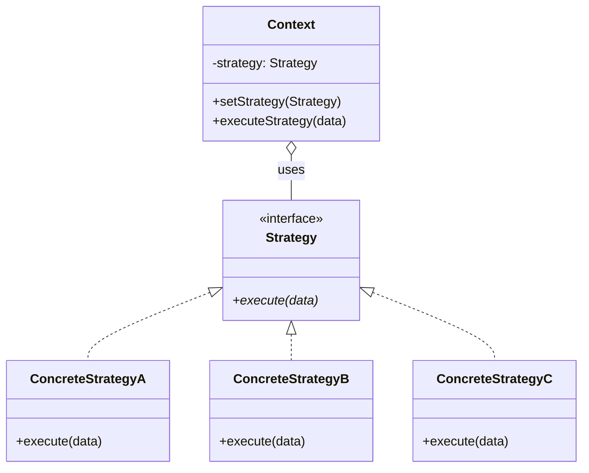

# Strategy Pattern

## Introduction

The **Strategy** pattern is a behavioral design pattern that defines a family of algorithms, encapsulates each one in its own class, and makes them interchangeable at runtime. Instead of hardcoding a single algorithm into a class, the client delegates the work to a _strategy object_, allowing the algorithm to vary independently from the clients that use it.

This pattern is one of the most widely used in real-world software because business rules frequently change, multiply, or need A/B testing. Rather than growing a monolithic `if/else` or `switch` block every time a new variant appears, each variant lives behind a common interface and can be swapped, composed, or injected without touching existing code — a textbook application of the **Open/Closed Principle**.

## Intent

> Define a family of algorithms, encapsulate each one, and make them interchangeable. Strategy lets the algorithm vary independently from the clients that use it.
>
> — _Design Patterns: Elements of Reusable Object-Oriented Software_ (Gang of Four)

## Class Diagram



## Key Characteristics

- **Encapsulation of variation** — each algorithm is isolated in its own class, preventing conditional sprawl.
- **Runtime swappability** — the context can switch strategies on the fly without recompilation or redeployment.
- **Open/Closed Principle** — new strategies are added by creating new classes, not by modifying existing ones.
- **Composition over inheritance** — behavior is composed via delegation rather than subclassing the context.
- **Independent testability** — each strategy can be unit-tested in isolation, simplifying verification.
- **Single Responsibility** — the context manages workflow; strategies manage algorithm details.

---

## Example 1 — Fintech: Payment Processing Strategies

### Problem

A payment gateway must support multiple settlement methods — credit card networks, ACH bank transfers, and cryptocurrency settlement — each with distinct protocols, fee structures, and latency profiles. Hardcoding each path into the checkout service creates a brittle monolith that must be redeployed every time a new payment rail is onboarded or an existing one changes its API contract.

### Solution

Define a `PaymentStrategy` interface with a single `process_payment` method. Implement one concrete strategy per settlement rail. The `CheckoutService` (context) accepts a strategy at construction or per-transaction, delegating all rail-specific logic. Adding a new rail means adding a new strategy class — zero changes to the checkout service.

**Python**

```python
from abc import ABC, abstractmethod
from dataclasses import dataclass
from decimal import Decimal


@dataclass
class PaymentResult:
    success: bool
    transaction_id: str
    fee: Decimal
    settlement_time_hours: int


class PaymentStrategy(ABC):
    @abstractmethod
    def process_payment(self, amount: Decimal, merchant_id: str) -> PaymentResult:
        ...


class CreditCardStrategy(PaymentStrategy):
    def process_payment(self, amount: Decimal, merchant_id: str) -> PaymentResult:
        fee = amount * Decimal("0.029") + Decimal("0.30")
        return PaymentResult(True, f"CC-{merchant_id}-001", fee, settlement_time_hours=48)


class ACHBankTransferStrategy(PaymentStrategy):
    def process_payment(self, amount: Decimal, merchant_id: str) -> PaymentResult:
        fee = min(amount * Decimal("0.008"), Decimal("5.00"))
        return PaymentResult(True, f"ACH-{merchant_id}-001", fee, settlement_time_hours=72)


class CryptoSettlementStrategy(PaymentStrategy):
    def process_payment(self, amount: Decimal, merchant_id: str) -> PaymentResult:
        fee = amount * Decimal("0.01")
        return PaymentResult(True, f"CRYPTO-{merchant_id}-001", fee, settlement_time_hours=1)


class CheckoutService:
    def __init__(self, strategy: PaymentStrategy):
        self._strategy = strategy

    def set_strategy(self, strategy: PaymentStrategy):
        self._strategy = strategy

    def checkout(self, amount: Decimal, merchant_id: str) -> PaymentResult:
        return self._strategy.process_payment(amount, merchant_id)


if __name__ == "__main__":
    service = CheckoutService(CreditCardStrategy())
    print(service.checkout(Decimal("100.00"), "MERCH-42"))

    service.set_strategy(ACHBankTransferStrategy())
    print(service.checkout(Decimal("5000.00"), "MERCH-42"))

    service.set_strategy(CryptoSettlementStrategy())
    print(service.checkout(Decimal("250.00"), "MERCH-42"))
```

**Go**

```go
package main

import "fmt"

type PaymentResult struct {
	Success             bool
	TransactionID       string
	Fee                 float64
	SettlementTimeHours int
}

type PaymentStrategy interface {
	ProcessPayment(amount float64, merchantID string) PaymentResult
}

// --- Credit Card ---
type CreditCardStrategy struct{}

func (s CreditCardStrategy) ProcessPayment(amount float64, merchantID string) PaymentResult {
	fee := amount*0.029 + 0.30
	return PaymentResult{true, fmt.Sprintf("CC-%s-001", merchantID), fee, 48}
}

// --- ACH Bank Transfer ---
type ACHBankTransferStrategy struct{}

func (s ACHBankTransferStrategy) ProcessPayment(amount float64, merchantID string) PaymentResult {
	fee := amount * 0.008
	if fee > 5.0 {
		fee = 5.0
	}
	return PaymentResult{true, fmt.Sprintf("ACH-%s-001", merchantID), fee, 72}
}

// --- Crypto Settlement ---
type CryptoSettlementStrategy struct{}

func (s CryptoSettlementStrategy) ProcessPayment(amount float64, merchantID string) PaymentResult {
	return PaymentResult{true, fmt.Sprintf("CRYPTO-%s-001", merchantID), amount * 0.01, 1}
}

// --- Context ---
type CheckoutService struct {
	strategy PaymentStrategy
}

func (c *CheckoutService) SetStrategy(s PaymentStrategy) { c.strategy = s }

func (c *CheckoutService) Checkout(amount float64, merchantID string) PaymentResult {
	return c.strategy.ProcessPayment(amount, merchantID)
}

func main() {
	svc := &CheckoutService{strategy: CreditCardStrategy{}}
	fmt.Printf("%+v\n", svc.Checkout(100.0, "MERCH-42"))

	svc.SetStrategy(ACHBankTransferStrategy{})
	fmt.Printf("%+v\n", svc.Checkout(5000.0, "MERCH-42"))

	svc.SetStrategy(CryptoSettlementStrategy{})
	fmt.Printf("%+v\n", svc.Checkout(250.0, "MERCH-42"))
}
```

**Java**

```java
import java.math.BigDecimal;

record PaymentResult(boolean success, String transactionId, BigDecimal fee, int settlementHours) {}

interface PaymentStrategy {
    PaymentResult processPayment(BigDecimal amount, String merchantId);
}

class CreditCardStrategy implements PaymentStrategy {
    public PaymentResult processPayment(BigDecimal amount, String merchantId) {
        BigDecimal fee = amount.multiply(new BigDecimal("0.029")).add(new BigDecimal("0.30"));
        return new PaymentResult(true, "CC-" + merchantId + "-001", fee, 48);
    }
}

class ACHBankTransferStrategy implements PaymentStrategy {
    public PaymentResult processPayment(BigDecimal amount, String merchantId) {
        BigDecimal fee = amount.multiply(new BigDecimal("0.008")).min(new BigDecimal("5.00"));
        return new PaymentResult(true, "ACH-" + merchantId + "-001", fee, 72);
    }
}

class CryptoSettlementStrategy implements PaymentStrategy {
    public PaymentResult processPayment(BigDecimal amount, String merchantId) {
        BigDecimal fee = amount.multiply(new BigDecimal("0.01"));
        return new PaymentResult(true, "CRYPTO-" + merchantId + "-001", fee, 1);
    }
}

class CheckoutService {
    private PaymentStrategy strategy;
    CheckoutService(PaymentStrategy strategy) { this.strategy = strategy; }
    void setStrategy(PaymentStrategy s) { this.strategy = s; }
    PaymentResult checkout(BigDecimal amount, String merchantId) {
        return strategy.processPayment(amount, merchantId);
    }

    public static void main(String[] args) {
        var svc = new CheckoutService(new CreditCardStrategy());
        System.out.println(svc.checkout(new BigDecimal("100.00"), "MERCH-42"));

        svc.setStrategy(new ACHBankTransferStrategy());
        System.out.println(svc.checkout(new BigDecimal("5000.00"), "MERCH-42"));

        svc.setStrategy(new CryptoSettlementStrategy());
        System.out.println(svc.checkout(new BigDecimal("250.00"), "MERCH-42"));
    }
}
```

**TypeScript**

```typescript
interface PaymentResult {
  success: boolean;
  transactionId: string;
  fee: number;
  settlementTimeHours: number;
}

interface PaymentStrategy {
  processPayment(amount: number, merchantId: string): PaymentResult;
}

class CreditCardStrategy implements PaymentStrategy {
  processPayment(amount: number, merchantId: string): PaymentResult {
    return {
      success: true,
      transactionId: `CC-${merchantId}-001`,
      fee: amount * 0.029 + 0.3,
      settlementTimeHours: 48,
    };
  }
}

class ACHBankTransferStrategy implements PaymentStrategy {
  processPayment(amount: number, merchantId: string): PaymentResult {
    return {
      success: true,
      transactionId: `ACH-${merchantId}-001`,
      fee: Math.min(amount * 0.008, 5.0),
      settlementTimeHours: 72,
    };
  }
}

class CryptoSettlementStrategy implements PaymentStrategy {
  processPayment(amount: number, merchantId: string): PaymentResult {
    return {
      success: true,
      transactionId: `CRYPTO-${merchantId}-001`,
      fee: amount * 0.01,
      settlementTimeHours: 1,
    };
  }
}

class CheckoutService {
  constructor(private strategy: PaymentStrategy) {}
  setStrategy(s: PaymentStrategy) {
    this.strategy = s;
  }
  checkout(amount: number, merchantId: string): PaymentResult {
    return this.strategy.processPayment(amount, merchantId);
  }
}

// --- Demo ---
const svc = new CheckoutService(new CreditCardStrategy());
console.log(svc.checkout(100, "MERCH-42"));

svc.setStrategy(new ACHBankTransferStrategy());
console.log(svc.checkout(5000, "MERCH-42"));

svc.setStrategy(new CryptoSettlementStrategy());
console.log(svc.checkout(250, "MERCH-42"));
```

**Rust**

```rust
use std::fmt;

struct PaymentResult {
    success: bool,
    transaction_id: String,
    fee: f64,
    settlement_hours: u32,
}

impl fmt::Display for PaymentResult {
    fn fmt(&self, f: &mut fmt::Formatter) -> fmt::Result {
        write!(f, "[ok={} tx={} fee={:.2} hrs={}]",
            self.success, self.transaction_id, self.fee, self.settlement_hours)
    }
}

trait PaymentStrategy {
    fn process_payment(&self, amount: f64, merchant_id: &str) -> PaymentResult;
}

struct CreditCard;
impl PaymentStrategy for CreditCard {
    fn process_payment(&self, amount: f64, merchant_id: &str) -> PaymentResult {
        PaymentResult { success: true, transaction_id: format!("CC-{merchant_id}-001"),
            fee: amount * 0.029 + 0.30, settlement_hours: 48 }
    }
}

struct ACHBankTransfer;
impl PaymentStrategy for ACHBankTransfer {
    fn process_payment(&self, amount: f64, merchant_id: &str) -> PaymentResult {
        PaymentResult { success: true, transaction_id: format!("ACH-{merchant_id}-001"),
            fee: (amount * 0.008).min(5.0), settlement_hours: 72 }
    }
}

struct CryptoSettlement;
impl PaymentStrategy for CryptoSettlement {
    fn process_payment(&self, amount: f64, merchant_id: &str) -> PaymentResult {
        PaymentResult { success: true, transaction_id: format!("CRYPTO-{merchant_id}-001"),
            fee: amount * 0.01, settlement_hours: 1 }
    }
}

struct CheckoutService {
    strategy: Box<dyn PaymentStrategy>,
}

impl CheckoutService {
    fn new(strategy: Box<dyn PaymentStrategy>) -> Self { Self { strategy } }
    fn set_strategy(&mut self, s: Box<dyn PaymentStrategy>) { self.strategy = s; }
    fn checkout(&self, amount: f64, merchant_id: &str) -> PaymentResult {
        self.strategy.process_payment(amount, merchant_id)
    }
}

fn main() {
    let mut svc = CheckoutService::new(Box::new(CreditCard));
    println!("{}", svc.checkout(100.0, "MERCH-42"));

    svc.set_strategy(Box::new(ACHBankTransfer));
    println!("{}", svc.checkout(5000.0, "MERCH-42"));

    svc.set_strategy(Box::new(CryptoSettlement));
    println!("{}", svc.checkout(250.0, "MERCH-42"));
}
```

---

## Example 2 — Healthcare: Insurance Claim Adjudication Strategies

### Problem

A health insurer receives thousands of claims daily. Some are straightforward (e.g., a routine blood test under $200) and can be auto-approved. Others require manual review by a human adjudicator. A growing subset is routed through an AI-assisted fraud detection model. Embedding all three decision paths in a single `adjudicateClaim()` method creates tangled logic that is difficult to audit — a regulatory requirement in healthcare.

### Solution

Extract each adjudication path into a `ClaimAdjudicationStrategy`. The `ClaimProcessor` context selects the appropriate strategy based on claim metadata (amount, risk score, provider history). Each strategy is independently auditable and testable, and new adjudication paths (e.g., peer-review for experimental procedures) can be added without touching the processor.

**Python**

```python
from abc import ABC, abstractmethod
from dataclasses import dataclass
from enum import Enum


class Verdict(Enum):
    APPROVED = "APPROVED"
    DENIED = "DENIED"
    PENDING_REVIEW = "PENDING_REVIEW"


@dataclass
class Claim:
    claim_id: str
    amount: float
    risk_score: float  # 0.0 – 1.0
    procedure_code: str


@dataclass
class AdjudicationResult:
    claim_id: str
    verdict: Verdict
    reason: str


class ClaimAdjudicationStrategy(ABC):
    @abstractmethod
    def adjudicate(self, claim: Claim) -> AdjudicationResult:
        ...


class AutoApproveStrategy(ClaimAdjudicationStrategy):
    def adjudicate(self, claim: Claim) -> AdjudicationResult:
        if claim.amount <= 500:
            return AdjudicationResult(claim.claim_id, Verdict.APPROVED, "Under auto-approve threshold")
        return AdjudicationResult(claim.claim_id, Verdict.DENIED, "Exceeds auto-approve limit")


class ManualReviewStrategy(ClaimAdjudicationStrategy):
    def adjudicate(self, claim: Claim) -> AdjudicationResult:
        return AdjudicationResult(claim.claim_id, Verdict.PENDING_REVIEW,
                                  f"Queued for manual review — risk score {claim.risk_score:.2f}")


class AIFraudDetectionStrategy(ClaimAdjudicationStrategy):
    def adjudicate(self, claim: Claim) -> AdjudicationResult:
        if claim.risk_score > 0.85:
            return AdjudicationResult(claim.claim_id, Verdict.DENIED, "AI flagged as likely fraud")
        return AdjudicationResult(claim.claim_id, Verdict.APPROVED, "AI cleared — low fraud probability")


class ClaimProcessor:
    def __init__(self, strategy: ClaimAdjudicationStrategy):
        self._strategy = strategy

    def set_strategy(self, strategy: ClaimAdjudicationStrategy):
        self._strategy = strategy

    def process(self, claim: Claim) -> AdjudicationResult:
        return self._strategy.adjudicate(claim)


if __name__ == "__main__":
    claim = Claim("CLM-1001", 320.0, 0.12, "CPT-80053")
    processor = ClaimProcessor(AutoApproveStrategy())
    print(processor.process(claim))

    high_risk = Claim("CLM-1002", 9500.0, 0.91, "CPT-99213")
    processor.set_strategy(AIFraudDetectionStrategy())
    print(processor.process(high_risk))

    ambiguous = Claim("CLM-1003", 2200.0, 0.55, "CPT-27447")
    processor.set_strategy(ManualReviewStrategy())
    print(processor.process(ambiguous))
```

**Go**

```go
package main

import "fmt"

type Verdict string

const (
	Approved      Verdict = "APPROVED"
	Denied        Verdict = "DENIED"
	PendingReview Verdict = "PENDING_REVIEW"
)

type Claim struct {
	ClaimID       string
	Amount        float64
	RiskScore     float64
	ProcedureCode string
}

type AdjudicationResult struct {
	ClaimID string
	Verdict Verdict
	Reason  string
}

type ClaimAdjudicationStrategy interface {
	Adjudicate(claim Claim) AdjudicationResult
}

type AutoApproveStrategy struct{}

func (s AutoApproveStrategy) Adjudicate(c Claim) AdjudicationResult {
	if c.Amount <= 500 {
		return AdjudicationResult{c.ClaimID, Approved, "Under auto-approve threshold"}
	}
	return AdjudicationResult{c.ClaimID, Denied, "Exceeds auto-approve limit"}
}

type ManualReviewStrategy struct{}

func (s ManualReviewStrategy) Adjudicate(c Claim) AdjudicationResult {
	return AdjudicationResult{c.ClaimID, PendingReview,
		fmt.Sprintf("Queued for manual review — risk %.2f", c.RiskScore)}
}

type AIFraudDetectionStrategy struct{}

func (s AIFraudDetectionStrategy) Adjudicate(c Claim) AdjudicationResult {
	if c.RiskScore > 0.85 {
		return AdjudicationResult{c.ClaimID, Denied, "AI flagged as likely fraud"}
	}
	return AdjudicationResult{c.ClaimID, Approved, "AI cleared — low fraud probability"}
}

type ClaimProcessor struct {
	strategy ClaimAdjudicationStrategy
}

func (p *ClaimProcessor) SetStrategy(s ClaimAdjudicationStrategy) { p.strategy = s }
func (p *ClaimProcessor) Process(c Claim) AdjudicationResult      { return p.strategy.Adjudicate(c) }

func main() {
	proc := &ClaimProcessor{strategy: AutoApproveStrategy{}}
	fmt.Println(proc.Process(Claim{"CLM-1001", 320, 0.12, "CPT-80053"}))

	proc.SetStrategy(AIFraudDetectionStrategy{})
	fmt.Println(proc.Process(Claim{"CLM-1002", 9500, 0.91, "CPT-99213"}))

	proc.SetStrategy(ManualReviewStrategy{})
	fmt.Println(proc.Process(Claim{"CLM-1003", 2200, 0.55, "CPT-27447"}))
}
```

**Java**

```java
import java.util.Locale;

enum Verdict { APPROVED, DENIED, PENDING_REVIEW }

record Claim(String claimId, double amount, double riskScore, String procedureCode) {}
record AdjudicationResult(String claimId, Verdict verdict, String reason) {}

interface ClaimAdjudicationStrategy {
    AdjudicationResult adjudicate(Claim claim);
}

class AutoApproveStrategy implements ClaimAdjudicationStrategy {
    public AdjudicationResult adjudicate(Claim c) {
        if (c.amount() <= 500)
            return new AdjudicationResult(c.claimId(), Verdict.APPROVED, "Under auto-approve threshold");
        return new AdjudicationResult(c.claimId(), Verdict.DENIED, "Exceeds auto-approve limit");
    }
}

class ManualReviewStrategy implements ClaimAdjudicationStrategy {
    public AdjudicationResult adjudicate(Claim c) {
        return new AdjudicationResult(c.claimId(), Verdict.PENDING_REVIEW,
            String.format(Locale.US, "Queued for manual review — risk %.2f", c.riskScore()));
    }
}

class AIFraudDetectionStrategy implements ClaimAdjudicationStrategy {
    public AdjudicationResult adjudicate(Claim c) {
        if (c.riskScore() > 0.85)
            return new AdjudicationResult(c.claimId(), Verdict.DENIED, "AI flagged as likely fraud");
        return new AdjudicationResult(c.claimId(), Verdict.APPROVED, "AI cleared — low fraud probability");
    }
}

class ClaimProcessor {
    private ClaimAdjudicationStrategy strategy;
    ClaimProcessor(ClaimAdjudicationStrategy s) { this.strategy = s; }
    void setStrategy(ClaimAdjudicationStrategy s) { this.strategy = s; }
    AdjudicationResult process(Claim c) { return strategy.adjudicate(c); }

    public static void main(String[] args) {
        var proc = new ClaimProcessor(new AutoApproveStrategy());
        System.out.println(proc.process(new Claim("CLM-1001", 320, 0.12, "CPT-80053")));

        proc.setStrategy(new AIFraudDetectionStrategy());
        System.out.println(proc.process(new Claim("CLM-1002", 9500, 0.91, "CPT-99213")));

        proc.setStrategy(new ManualReviewStrategy());
        System.out.println(proc.process(new Claim("CLM-1003", 2200, 0.55, "CPT-27447")));
    }
}
```

**TypeScript**

```typescript
type Verdict = "APPROVED" | "DENIED" | "PENDING_REVIEW";

interface Claim {
  claimId: string;
  amount: number;
  riskScore: number;
  procedureCode: string;
}

interface AdjudicationResult {
  claimId: string;
  verdict: Verdict;
  reason: string;
}

interface ClaimAdjudicationStrategy {
  adjudicate(claim: Claim): AdjudicationResult;
}

class AutoApproveStrategy implements ClaimAdjudicationStrategy {
  adjudicate(c: Claim): AdjudicationResult {
    if (c.amount <= 500)
      return {
        claimId: c.claimId,
        verdict: "APPROVED",
        reason: "Under auto-approve threshold",
      };
    return {
      claimId: c.claimId,
      verdict: "DENIED",
      reason: "Exceeds auto-approve limit",
    };
  }
}

class ManualReviewStrategy implements ClaimAdjudicationStrategy {
  adjudicate(c: Claim): AdjudicationResult {
    return {
      claimId: c.claimId,
      verdict: "PENDING_REVIEW",
      reason: `Queued for manual review — risk ${c.riskScore.toFixed(2)}`,
    };
  }
}

class AIFraudDetectionStrategy implements ClaimAdjudicationStrategy {
  adjudicate(c: Claim): AdjudicationResult {
    if (c.riskScore > 0.85)
      return {
        claimId: c.claimId,
        verdict: "DENIED",
        reason: "AI flagged as likely fraud",
      };
    return {
      claimId: c.claimId,
      verdict: "APPROVED",
      reason: "AI cleared — low fraud probability",
    };
  }
}

class ClaimProcessor {
  constructor(private strategy: ClaimAdjudicationStrategy) {}
  setStrategy(s: ClaimAdjudicationStrategy) {
    this.strategy = s;
  }
  process(c: Claim): AdjudicationResult {
    return this.strategy.adjudicate(c);
  }
}

const proc = new ClaimProcessor(new AutoApproveStrategy());
console.log(
  proc.process({
    claimId: "CLM-1001",
    amount: 320,
    riskScore: 0.12,
    procedureCode: "CPT-80053",
  }),
);

proc.setStrategy(new AIFraudDetectionStrategy());
console.log(
  proc.process({
    claimId: "CLM-1002",
    amount: 9500,
    riskScore: 0.91,
    procedureCode: "CPT-99213",
  }),
);

proc.setStrategy(new ManualReviewStrategy());
console.log(
  proc.process({
    claimId: "CLM-1003",
    amount: 2200,
    riskScore: 0.55,
    procedureCode: "CPT-27447",
  }),
);
```

**Rust**

```rust
use std::fmt;

#[derive(Debug)]
enum Verdict { Approved, Denied, PendingReview }

struct Claim {
    claim_id: String,
    amount: f64,
    risk_score: f64,
    procedure_code: String,
}

struct AdjudicationResult {
    claim_id: String,
    verdict: Verdict,
    reason: String,
}

impl fmt::Display for AdjudicationResult {
    fn fmt(&self, f: &mut fmt::Formatter) -> fmt::Result {
        write!(f, "[{} {:?} — {}]", self.claim_id, self.verdict, self.reason)
    }
}

trait ClaimAdjudicationStrategy {
    fn adjudicate(&self, claim: &Claim) -> AdjudicationResult;
}

struct AutoApprove;
impl ClaimAdjudicationStrategy for AutoApprove {
    fn adjudicate(&self, c: &Claim) -> AdjudicationResult {
        if c.amount <= 500.0 {
            AdjudicationResult { claim_id: c.claim_id.clone(), verdict: Verdict::Approved,
                reason: "Under auto-approve threshold".into() }
        } else {
            AdjudicationResult { claim_id: c.claim_id.clone(), verdict: Verdict::Denied,
                reason: "Exceeds auto-approve limit".into() }
        }
    }
}

struct ManualReview;
impl ClaimAdjudicationStrategy for ManualReview {
    fn adjudicate(&self, c: &Claim) -> AdjudicationResult {
        AdjudicationResult { claim_id: c.claim_id.clone(), verdict: Verdict::PendingReview,
            reason: format!("Queued for manual review — risk {:.2}", c.risk_score) }
    }
}

struct AIFraudDetection;
impl ClaimAdjudicationStrategy for AIFraudDetection {
    fn adjudicate(&self, c: &Claim) -> AdjudicationResult {
        if c.risk_score > 0.85 {
            AdjudicationResult { claim_id: c.claim_id.clone(), verdict: Verdict::Denied,
                reason: "AI flagged as likely fraud".into() }
        } else {
            AdjudicationResult { claim_id: c.claim_id.clone(), verdict: Verdict::Approved,
                reason: "AI cleared — low fraud probability".into() }
        }
    }
}

struct ClaimProcessor {
    strategy: Box<dyn ClaimAdjudicationStrategy>,
}

impl ClaimProcessor {
    fn new(s: Box<dyn ClaimAdjudicationStrategy>) -> Self { Self { strategy: s } }
    fn set_strategy(&mut self, s: Box<dyn ClaimAdjudicationStrategy>) { self.strategy = s; }
    fn process(&self, c: &Claim) -> AdjudicationResult { self.strategy.adjudicate(c) }
}

fn main() {
    let c1 = Claim { claim_id: "CLM-1001".into(), amount: 320.0, risk_score: 0.12, procedure_code: "CPT-80053".into() };
    let mut proc = ClaimProcessor::new(Box::new(AutoApprove));
    println!("{}", proc.process(&c1));

    let c2 = Claim { claim_id: "CLM-1002".into(), amount: 9500.0, risk_score: 0.91, procedure_code: "CPT-99213".into() };
    proc.set_strategy(Box::new(AIFraudDetection));
    println!("{}", proc.process(&c2));

    let c3 = Claim { claim_id: "CLM-1003".into(), amount: 2200.0, risk_score: 0.55, procedure_code: "CPT-27447".into() };
    proc.set_strategy(Box::new(ManualReview));
    println!("{}", proc.process(&c3));
}
```

---

## Example 3 — E-Commerce: Pricing / Discount Strategies

### Problem

An online marketplace supports multiple promotion types — percentage-off coupons, buy-one-get-one (BOGO) deals, tiered volume discounts, and loyalty-points redemption. Each promotion has unique calculation rules, stacking constraints, and audit requirements. Coupling these into the order pipeline leads to fragile price calculations that break whenever marketing introduces a new campaign type.

### Solution

Model each promotion type as a `DiscountStrategy`. The `PricingEngine` context applies the active strategy to a cart total, returning the final price and a human-readable breakdown. New promotion types (e.g., flash-sale, referral credit) are added as new strategy implementations.

**Python**

```python
from abc import ABC, abstractmethod
from dataclasses import dataclass


@dataclass
class CartItem:
    sku: str
    name: str
    unit_price: float
    quantity: int


@dataclass
class PriceBreakdown:
    subtotal: float
    discount: float
    final_total: float
    label: str


class DiscountStrategy(ABC):
    @abstractmethod
    def apply(self, items: list[CartItem]) -> PriceBreakdown:
        ...


class PercentageOffStrategy(DiscountStrategy):
    def __init__(self, pct: float):
        self.pct = pct

    def apply(self, items: list[CartItem]) -> PriceBreakdown:
        subtotal = sum(i.unit_price * i.quantity for i in items)
        discount = subtotal * self.pct / 100
        return PriceBreakdown(subtotal, discount, subtotal - discount, f"{self.pct}% off")


class BOGOStrategy(DiscountStrategy):
    def apply(self, items: list[CartItem]) -> PriceBreakdown:
        subtotal = sum(i.unit_price * i.quantity for i in items)
        free_items = sum(i.quantity // 2 for i in items)
        cheapest = min(i.unit_price for i in items) if items else 0
        discount = free_items * cheapest
        return PriceBreakdown(subtotal, discount, subtotal - discount, "Buy-One-Get-One")


class TieredVolumeStrategy(DiscountStrategy):
    TIERS = [(50, 0.15), (20, 0.10), (10, 0.05)]

    def apply(self, items: list[CartItem]) -> PriceBreakdown:
        subtotal = sum(i.unit_price * i.quantity for i in items)
        total_qty = sum(i.quantity for i in items)
        rate = next((r for threshold, r in self.TIERS if total_qty >= threshold), 0.0)
        discount = subtotal * rate
        return PriceBreakdown(subtotal, discount, subtotal - discount,
                              f"Volume tier {rate*100:.0f}% (qty={total_qty})")


class LoyaltyPointsStrategy(DiscountStrategy):
    def __init__(self, points: int, point_value: float = 0.01):
        self.points = points
        self.point_value = point_value

    def apply(self, items: list[CartItem]) -> PriceBreakdown:
        subtotal = sum(i.unit_price * i.quantity for i in items)
        max_discount = self.points * self.point_value
        discount = min(max_discount, subtotal)
        return PriceBreakdown(subtotal, discount, subtotal - discount,
                              f"Redeemed {int(discount / self.point_value)} loyalty points")


class PricingEngine:
    def __init__(self, strategy: DiscountStrategy):
        self._strategy = strategy

    def set_strategy(self, s: DiscountStrategy):
        self._strategy = s

    def calculate(self, items: list[CartItem]) -> PriceBreakdown:
        return self._strategy.apply(items)


if __name__ == "__main__":
    cart = [CartItem("SKU-A", "Wireless Mouse", 29.99, 3),
            CartItem("SKU-B", "USB-C Hub", 49.99, 2)]

    engine = PricingEngine(PercentageOffStrategy(20))
    print(engine.calculate(cart))

    engine.set_strategy(BOGOStrategy())
    print(engine.calculate(cart))

    engine.set_strategy(TieredVolumeStrategy())
    print(engine.calculate(cart))

    engine.set_strategy(LoyaltyPointsStrategy(points=5000))
    print(engine.calculate(cart))
```

**Go**

```go
package main

import (
	"fmt"
	"math"
)

type CartItem struct {
	SKU       string
	Name      string
	UnitPrice float64
	Quantity  int
}

type PriceBreakdown struct {
	Subtotal   float64
	Discount   float64
	FinalTotal float64
	Label      string
}

type DiscountStrategy interface {
	Apply(items []CartItem) PriceBreakdown
}

func subtotal(items []CartItem) float64 {
	t := 0.0
	for _, i := range items { t += i.UnitPrice * float64(i.Quantity) }
	return t
}

// --- Percentage Off ---
type PercentageOff struct{ Pct float64 }

func (s PercentageOff) Apply(items []CartItem) PriceBreakdown {
	sub := subtotal(items)
	disc := sub * s.Pct / 100
	return PriceBreakdown{sub, disc, sub - disc, fmt.Sprintf("%.0f%% off", s.Pct)}
}

// --- BOGO ---
type BOGO struct{}

func (s BOGO) Apply(items []CartItem) PriceBreakdown {
	sub := subtotal(items)
	cheapest := math.MaxFloat64
	freeCount := 0
	for _, i := range items {
		freeCount += i.Quantity / 2
		if i.UnitPrice < cheapest { cheapest = i.UnitPrice }
	}
	disc := float64(freeCount) * cheapest
	return PriceBreakdown{sub, disc, sub - disc, "Buy-One-Get-One"}
}

// --- Tiered Volume ---
type TieredVolume struct{}

func (s TieredVolume) Apply(items []CartItem) PriceBreakdown {
	sub := subtotal(items)
	qty := 0
	for _, i := range items { qty += i.Quantity }
	rate := 0.0
	switch {
	case qty >= 50: rate = 0.15
	case qty >= 20: rate = 0.10
	case qty >= 10: rate = 0.05
	}
	disc := sub * rate
	return PriceBreakdown{sub, disc, sub - disc, fmt.Sprintf("Volume tier %.0f%% (qty=%d)", rate*100, qty)}
}

// --- Loyalty Points ---
type LoyaltyPoints struct{ Points int; PointValue float64 }

func (s LoyaltyPoints) Apply(items []CartItem) PriceBreakdown {
	sub := subtotal(items)
	maxDisc := float64(s.Points) * s.PointValue
	disc := math.Min(maxDisc, sub)
	return PriceBreakdown{sub, disc, sub - disc, fmt.Sprintf("Redeemed %d loyalty points", int(disc/s.PointValue))}
}

type PricingEngine struct{ strategy DiscountStrategy }

func (e *PricingEngine) SetStrategy(s DiscountStrategy) { e.strategy = s }
func (e *PricingEngine) Calculate(items []CartItem) PriceBreakdown { return e.strategy.Apply(items) }

func main() {
	cart := []CartItem{{"SKU-A", "Wireless Mouse", 29.99, 3}, {"SKU-B", "USB-C Hub", 49.99, 2}}
	eng := &PricingEngine{strategy: PercentageOff{20}}
	fmt.Printf("%+v\n", eng.Calculate(cart))
	eng.SetStrategy(BOGO{})
	fmt.Printf("%+v\n", eng.Calculate(cart))
	eng.SetStrategy(TieredVolume{})
	fmt.Printf("%+v\n", eng.Calculate(cart))
	eng.SetStrategy(LoyaltyPoints{5000, 0.01})
	fmt.Printf("%+v\n", eng.Calculate(cart))
}
```

**Java**

```java
import java.util.List;

record CartItem(String sku, String name, double unitPrice, int quantity) {}
record PriceBreakdown(double subtotal, double discount, double finalTotal, String label) {}

interface DiscountStrategy {
    PriceBreakdown apply(List<CartItem> items);
}

class PercentageOffStrategy implements DiscountStrategy {
    private final double pct;
    PercentageOffStrategy(double pct) { this.pct = pct; }
    public PriceBreakdown apply(List<CartItem> items) {
        double sub = items.stream().mapToDouble(i -> i.unitPrice() * i.quantity()).sum();
        double disc = sub * pct / 100;
        return new PriceBreakdown(sub, disc, sub - disc, pct + "% off");
    }
}

class BOGOStrategy implements DiscountStrategy {
    public PriceBreakdown apply(List<CartItem> items) {
        double sub = items.stream().mapToDouble(i -> i.unitPrice() * i.quantity()).sum();
        int freeCount = items.stream().mapToInt(i -> i.quantity() / 2).sum();
        double cheapest = items.stream().mapToDouble(CartItem::unitPrice).min().orElse(0);
        double disc = freeCount * cheapest;
        return new PriceBreakdown(sub, disc, sub - disc, "Buy-One-Get-One");
    }
}

class TieredVolumeStrategy implements DiscountStrategy {
    public PriceBreakdown apply(List<CartItem> items) {
        double sub = items.stream().mapToDouble(i -> i.unitPrice() * i.quantity()).sum();
        int qty = items.stream().mapToInt(CartItem::quantity).sum();
        double rate = qty >= 50 ? 0.15 : qty >= 20 ? 0.10 : qty >= 10 ? 0.05 : 0;
        double disc = sub * rate;
        return new PriceBreakdown(sub, disc, sub - disc,
            String.format("Volume tier %.0f%% (qty=%d)", rate * 100, qty));
    }
}

class LoyaltyPointsStrategy implements DiscountStrategy {
    private final int points;
    private final double pointValue;
    LoyaltyPointsStrategy(int points, double pointValue) { this.points = points; this.pointValue = pointValue; }
    public PriceBreakdown apply(List<CartItem> items) {
        double sub = items.stream().mapToDouble(i -> i.unitPrice() * i.quantity()).sum();
        double disc = Math.min(points * pointValue, sub);
        return new PriceBreakdown(sub, disc, sub - disc,
            String.format("Redeemed %d loyalty points", (int)(disc / pointValue)));
    }
}

class PricingEngine {
    private DiscountStrategy strategy;
    PricingEngine(DiscountStrategy s) { this.strategy = s; }
    void setStrategy(DiscountStrategy s) { this.strategy = s; }
    PriceBreakdown calculate(List<CartItem> items) { return strategy.apply(items); }

    public static void main(String[] args) {
        var cart = List.of(new CartItem("SKU-A", "Wireless Mouse", 29.99, 3),
                           new CartItem("SKU-B", "USB-C Hub", 49.99, 2));
        var eng = new PricingEngine(new PercentageOffStrategy(20));
        System.out.println(eng.calculate(cart));
        eng.setStrategy(new BOGOStrategy());
        System.out.println(eng.calculate(cart));
        eng.setStrategy(new TieredVolumeStrategy());
        System.out.println(eng.calculate(cart));
        eng.setStrategy(new LoyaltyPointsStrategy(5000, 0.01));
        System.out.println(eng.calculate(cart));
    }
}
```

**TypeScript**

```typescript
interface CartItem {
  sku: string;
  name: string;
  unitPrice: number;
  quantity: number;
}
interface PriceBreakdown {
  subtotal: number;
  discount: number;
  finalTotal: number;
  label: string;
}

interface DiscountStrategy {
  apply(items: CartItem[]): PriceBreakdown;
}

const subtotal = (items: CartItem[]) =>
  items.reduce((s, i) => s + i.unitPrice * i.quantity, 0);

class PercentageOffStrategy implements DiscountStrategy {
  constructor(private pct: number) {}
  apply(items: CartItem[]): PriceBreakdown {
    const sub = subtotal(items);
    const disc = (sub * this.pct) / 100;
    return {
      subtotal: sub,
      discount: disc,
      finalTotal: sub - disc,
      label: `${this.pct}% off`,
    };
  }
}

class BOGOStrategy implements DiscountStrategy {
  apply(items: CartItem[]): PriceBreakdown {
    const sub = subtotal(items);
    const freeCount = items.reduce((s, i) => s + Math.floor(i.quantity / 2), 0);
    const cheapest = Math.min(...items.map((i) => i.unitPrice));
    const disc = freeCount * cheapest;
    return {
      subtotal: sub,
      discount: disc,
      finalTotal: sub - disc,
      label: "Buy-One-Get-One",
    };
  }
}

class TieredVolumeStrategy implements DiscountStrategy {
  apply(items: CartItem[]): PriceBreakdown {
    const sub = subtotal(items);
    const qty = items.reduce((s, i) => s + i.quantity, 0);
    const rate = qty >= 50 ? 0.15 : qty >= 20 ? 0.1 : qty >= 10 ? 0.05 : 0;
    const disc = sub * rate;
    return {
      subtotal: sub,
      discount: disc,
      finalTotal: sub - disc,
      label: `Volume tier ${rate * 100}% (qty=${qty})`,
    };
  }
}

class LoyaltyPointsStrategy implements DiscountStrategy {
  constructor(private points: number, private pointValue = 0.01) {}
  apply(items: CartItem[]): PriceBreakdown {
    const sub = subtotal(items);
    const disc = Math.min(this.points * this.pointValue, sub);
    return {
      subtotal: sub,
      discount: disc,
      finalTotal: sub - disc,
      label: `Redeemed ${Math.floor(disc / this.pointValue)} loyalty points`,
    };
  }
}

class PricingEngine {
  constructor(private strategy: DiscountStrategy) {}
  setStrategy(s: DiscountStrategy) {
    this.strategy = s;
  }
  calculate(items: CartItem[]): PriceBreakdown {
    return this.strategy.apply(items);
  }
}

const cart: CartItem[] = [
  { sku: "SKU-A", name: "Wireless Mouse", unitPrice: 29.99, quantity: 3 },
  { sku: "SKU-B", name: "USB-C Hub", unitPrice: 49.99, quantity: 2 },
];
const eng = new PricingEngine(new PercentageOffStrategy(20));
console.log(eng.calculate(cart));
eng.setStrategy(new BOGOStrategy());
console.log(eng.calculate(cart));
eng.setStrategy(new TieredVolumeStrategy());
console.log(eng.calculate(cart));
eng.setStrategy(new LoyaltyPointsStrategy(5000));
console.log(eng.calculate(cart));
```

**Rust**

```rust
use std::fmt;

struct CartItem { sku: String, name: String, unit_price: f64, quantity: u32 }

struct PriceBreakdown { subtotal: f64, discount: f64, final_total: f64, label: String }

impl fmt::Display for PriceBreakdown {
    fn fmt(&self, f: &mut fmt::Formatter) -> fmt::Result {
        write!(f, "[{}: sub={:.2} disc={:.2} total={:.2}]", self.label, self.subtotal, self.discount, self.final_total)
    }
}

fn subtotal(items: &[CartItem]) -> f64 {
    items.iter().map(|i| i.unit_price * i.quantity as f64).sum()
}

trait DiscountStrategy {
    fn apply(&self, items: &[CartItem]) -> PriceBreakdown;
}

struct PercentageOff { pct: f64 }
impl DiscountStrategy for PercentageOff {
    fn apply(&self, items: &[CartItem]) -> PriceBreakdown {
        let sub = subtotal(items);
        let disc = sub * self.pct / 100.0;
        PriceBreakdown { subtotal: sub, discount: disc, final_total: sub - disc,
            label: format!("{:.0}% off", self.pct) }
    }
}

struct BOGO;
impl DiscountStrategy for BOGO {
    fn apply(&self, items: &[CartItem]) -> PriceBreakdown {
        let sub = subtotal(items);
        let free: u32 = items.iter().map(|i| i.quantity / 2).sum();
        let cheapest = items.iter().map(|i| i.unit_price).fold(f64::MAX, f64::min);
        let disc = free as f64 * cheapest;
        PriceBreakdown { subtotal: sub, discount: disc, final_total: sub - disc,
            label: "Buy-One-Get-One".into() }
    }
}

struct TieredVolume;
impl DiscountStrategy for TieredVolume {
    fn apply(&self, items: &[CartItem]) -> PriceBreakdown {
        let sub = subtotal(items);
        let qty: u32 = items.iter().map(|i| i.quantity).sum();
        let rate = if qty >= 50 { 0.15 } else if qty >= 20 { 0.10 } else if qty >= 10 { 0.05 } else { 0.0 };
        let disc = sub * rate;
        PriceBreakdown { subtotal: sub, discount: disc, final_total: sub - disc,
            label: format!("Volume tier {:.0}% (qty={})", rate * 100.0, qty) }
    }
}

struct LoyaltyPoints { points: u32, point_value: f64 }
impl DiscountStrategy for LoyaltyPoints {
    fn apply(&self, items: &[CartItem]) -> PriceBreakdown {
        let sub = subtotal(items);
        let disc = (self.points as f64 * self.point_value).min(sub);
        PriceBreakdown { subtotal: sub, discount: disc, final_total: sub - disc,
            label: format!("Redeemed {} loyalty points", (disc / self.point_value) as u32) }
    }
}

struct PricingEngine { strategy: Box<dyn DiscountStrategy> }
impl PricingEngine {
    fn new(s: Box<dyn DiscountStrategy>) -> Self { Self { strategy: s } }
    fn set_strategy(&mut self, s: Box<dyn DiscountStrategy>) { self.strategy = s; }
    fn calculate(&self, items: &[CartItem]) -> PriceBreakdown { self.strategy.apply(items) }
}

fn main() {
    let cart = vec![
        CartItem { sku: "SKU-A".into(), name: "Wireless Mouse".into(), unit_price: 29.99, quantity: 3 },
        CartItem { sku: "SKU-B".into(), name: "USB-C Hub".into(), unit_price: 49.99, quantity: 2 },
    ];
    let mut eng = PricingEngine::new(Box::new(PercentageOff { pct: 20.0 }));
    println!("{}", eng.calculate(&cart));
    eng.set_strategy(Box::new(BOGO));
    println!("{}", eng.calculate(&cart));
    eng.set_strategy(Box::new(TieredVolume));
    println!("{}", eng.calculate(&cart));
    eng.set_strategy(Box::new(LoyaltyPoints { points: 5000, point_value: 0.01 }));
    println!("{}", eng.calculate(&cart));
}
```

---

## Example 4 — Media / Streaming: Video Encoding Strategies

### Problem

A video-on-demand platform must transcode uploaded content into multiple formats to serve a diverse range of devices — older smart TVs that only decode H.264, modern browsers that benefit from H.265/HEVC efficiency, and open-source-oriented clients that prefer VP9. Each codec has different quality-per-bit trade-offs, hardware acceleration paths, and licensing implications. Hard-wiring codec selection logic into the transcoding pipeline makes it expensive to add future codecs (AV1, VVC) or tune parameters.

### Solution

Implement each codec configuration as an `EncodingStrategy`. The `TranscodePipeline` (context) receives a strategy at job creation time — typically resolved from a device-capabilities lookup — and delegates all codec-specific decisions. New codecs are added as new strategy classes with zero changes to the pipeline.

**Python**

```python
from abc import ABC, abstractmethod
from dataclasses import dataclass


@dataclass
class VideoAsset:
    asset_id: str
    source_path: str
    duration_seconds: int
    resolution: tuple[int, int]  # (width, height)


@dataclass
class EncodingResult:
    codec: str
    output_path: str
    estimated_bitrate_kbps: int
    hardware_accel: bool


class EncodingStrategy(ABC):
    @abstractmethod
    def encode(self, asset: VideoAsset) -> EncodingResult:
        ...


class H264Strategy(EncodingStrategy):
    def encode(self, asset: VideoAsset) -> EncodingResult:
        bitrate = asset.resolution[0] * asset.resolution[1] * 30 // 15_000  # rough heuristic
        return EncodingResult("H.264/AVC", f"/cdn/{asset.asset_id}_h264.mp4",
                              bitrate, hardware_accel=True)


class H265Strategy(EncodingStrategy):
    def encode(self, asset: VideoAsset) -> EncodingResult:
        bitrate = asset.resolution[0] * asset.resolution[1] * 30 // 25_000  # ~40% more efficient
        return EncodingResult("H.265/HEVC", f"/cdn/{asset.asset_id}_h265.mp4",
                              bitrate, hardware_accel=True)


class VP9Strategy(EncodingStrategy):
    def encode(self, asset: VideoAsset) -> EncodingResult:
        bitrate = asset.resolution[0] * asset.resolution[1] * 30 // 22_000
        return EncodingResult("VP9", f"/cdn/{asset.asset_id}_vp9.webm",
                              bitrate, hardware_accel=False)


class TranscodePipeline:
    def __init__(self, strategy: EncodingStrategy):
        self._strategy = strategy

    def set_strategy(self, s: EncodingStrategy):
        self._strategy = s

    def run(self, asset: VideoAsset) -> EncodingResult:
        print(f"Starting transcode job for {asset.asset_id} ({asset.resolution[0]}x{asset.resolution[1]})")
        result = self._strategy.encode(asset)
        print(f"  → {result.codec} @ {result.estimated_bitrate_kbps} kbps → {result.output_path}")
        return result


if __name__ == "__main__":
    asset = VideoAsset("VID-8812", "/ingest/raw_8812.mov", 3600, (1920, 1080))

    pipeline = TranscodePipeline(H264Strategy())
    pipeline.run(asset)

    pipeline.set_strategy(H265Strategy())
    pipeline.run(asset)

    pipeline.set_strategy(VP9Strategy())
    pipeline.run(asset)
```

**Go**

```go
package main

import "fmt"

type VideoAsset struct {
	AssetID         string
	SourcePath      string
	DurationSeconds int
	Width, Height   int
}

type EncodingResult struct {
	Codec              string
	OutputPath         string
	EstimatedBitrateKbps int
	HardwareAccel      bool
}

type EncodingStrategy interface {
	Encode(asset VideoAsset) EncodingResult
}

type H264Strategy struct{}

func (s H264Strategy) Encode(a VideoAsset) EncodingResult {
	br := a.Width * a.Height * 30 / 15000
	return EncodingResult{"H.264/AVC", fmt.Sprintf("/cdn/%s_h264.mp4", a.AssetID), br, true}
}

type H265Strategy struct{}

func (s H265Strategy) Encode(a VideoAsset) EncodingResult {
	br := a.Width * a.Height * 30 / 25000
	return EncodingResult{"H.265/HEVC", fmt.Sprintf("/cdn/%s_h265.mp4", a.AssetID), br, true}
}

type VP9Strategy struct{}

func (s VP9Strategy) Encode(a VideoAsset) EncodingResult {
	br := a.Width * a.Height * 30 / 22000
	return EncodingResult{"VP9", fmt.Sprintf("/cdn/%s_vp9.webm", a.AssetID), br, false}
}

type TranscodePipeline struct {
	strategy EncodingStrategy
}

func (p *TranscodePipeline) SetStrategy(s EncodingStrategy) { p.strategy = s }

func (p *TranscodePipeline) Run(a VideoAsset) EncodingResult {
	fmt.Printf("Transcode job for %s (%dx%d)\n", a.AssetID, a.Width, a.Height)
	r := p.strategy.Encode(a)
	fmt.Printf("  → %s @ %d kbps → %s\n", r.Codec, r.EstimatedBitrateKbps, r.OutputPath)
	return r
}

func main() {
	asset := VideoAsset{"VID-8812", "/ingest/raw_8812.mov", 3600, 1920, 1080}

	pipe := &TranscodePipeline{strategy: H264Strategy{}}
	pipe.Run(asset)

	pipe.SetStrategy(H265Strategy{})
	pipe.Run(asset)

	pipe.SetStrategy(VP9Strategy{})
	pipe.Run(asset)
}
```

**Java**

```java
record VideoAsset(String assetId, String sourcePath, int durationSeconds, int width, int height) {}
record EncodingResult(String codec, String outputPath, int estimatedBitrateKbps, boolean hardwareAccel) {}

interface EncodingStrategy {
    EncodingResult encode(VideoAsset asset);
}

class H264Strategy implements EncodingStrategy {
    public EncodingResult encode(VideoAsset a) {
        int br = a.width() * a.height() * 30 / 15_000;
        return new EncodingResult("H.264/AVC", "/cdn/" + a.assetId() + "_h264.mp4", br, true);
    }
}

class H265Strategy implements EncodingStrategy {
    public EncodingResult encode(VideoAsset a) {
        int br = a.width() * a.height() * 30 / 25_000;
        return new EncodingResult("H.265/HEVC", "/cdn/" + a.assetId() + "_h265.mp4", br, true);
    }
}

class VP9Strategy implements EncodingStrategy {
    public EncodingResult encode(VideoAsset a) {
        int br = a.width() * a.height() * 30 / 22_000;
        return new EncodingResult("VP9", "/cdn/" + a.assetId() + "_vp9.webm", br, false);
    }
}

class TranscodePipeline {
    private EncodingStrategy strategy;
    TranscodePipeline(EncodingStrategy s) { this.strategy = s; }
    void setStrategy(EncodingStrategy s) { this.strategy = s; }

    EncodingResult run(VideoAsset a) {
        System.out.printf("Transcode job for %s (%dx%d)%n", a.assetId(), a.width(), a.height());
        var r = strategy.encode(a);
        System.out.printf("  → %s @ %d kbps → %s%n", r.codec(), r.estimatedBitrateKbps(), r.outputPath());
        return r;
    }

    public static void main(String[] args) {
        var asset = new VideoAsset("VID-8812", "/ingest/raw_8812.mov", 3600, 1920, 1080);
        var pipe = new TranscodePipeline(new H264Strategy());
        pipe.run(asset);

        pipe.setStrategy(new H265Strategy());
        pipe.run(asset);

        pipe.setStrategy(new VP9Strategy());
        pipe.run(asset);
    }
}
```

**TypeScript**

```typescript
interface VideoAsset {
  assetId: string;
  sourcePath: string;
  durationSeconds: number;
  width: number;
  height: number;
}

interface EncodingResult {
  codec: string;
  outputPath: string;
  estimatedBitrateKbps: number;
  hardwareAccel: boolean;
}

interface EncodingStrategy {
  encode(asset: VideoAsset): EncodingResult;
}

class H264Strategy implements EncodingStrategy {
  encode(a: VideoAsset): EncodingResult {
    const br = Math.floor((a.width * a.height * 30) / 15_000);
    return {
      codec: "H.264/AVC",
      outputPath: `/cdn/${a.assetId}_h264.mp4`,
      estimatedBitrateKbps: br,
      hardwareAccel: true,
    };
  }
}

class H265Strategy implements EncodingStrategy {
  encode(a: VideoAsset): EncodingResult {
    const br = Math.floor((a.width * a.height * 30) / 25_000);
    return {
      codec: "H.265/HEVC",
      outputPath: `/cdn/${a.assetId}_h265.mp4`,
      estimatedBitrateKbps: br,
      hardwareAccel: true,
    };
  }
}

class VP9Strategy implements EncodingStrategy {
  encode(a: VideoAsset): EncodingResult {
    const br = Math.floor((a.width * a.height * 30) / 22_000);
    return {
      codec: "VP9",
      outputPath: `/cdn/${a.assetId}_vp9.webm`,
      estimatedBitrateKbps: br,
      hardwareAccel: false,
    };
  }
}

class TranscodePipeline {
  constructor(private strategy: EncodingStrategy) {}
  setStrategy(s: EncodingStrategy) {
    this.strategy = s;
  }
  run(a: VideoAsset): EncodingResult {
    console.log(`Transcode job for ${a.assetId} (${a.width}x${a.height})`);
    const r = this.strategy.encode(a);
    console.log(
      `  → ${r.codec} @ ${r.estimatedBitrateKbps} kbps → ${r.outputPath}`,
    );
    return r;
  }
}

const asset: VideoAsset = {
  assetId: "VID-8812",
  sourcePath: "/ingest/raw_8812.mov",
  durationSeconds: 3600,
  width: 1920,
  height: 1080,
};

const pipe = new TranscodePipeline(new H264Strategy());
pipe.run(asset);

pipe.setStrategy(new H265Strategy());
pipe.run(asset);

pipe.setStrategy(new VP9Strategy());
pipe.run(asset);
```

**Rust**

```rust
use std::fmt;

struct VideoAsset {
    asset_id: String,
    source_path: String,
    duration_seconds: u32,
    width: u32,
    height: u32,
}

struct EncodingResult {
    codec: String,
    output_path: String,
    estimated_bitrate_kbps: u32,
    hardware_accel: bool,
}

impl fmt::Display for EncodingResult {
    fn fmt(&self, f: &mut fmt::Formatter) -> fmt::Result {
        write!(f, "{} @ {} kbps → {} (hw={})",
            self.codec, self.estimated_bitrate_kbps, self.output_path, self.hardware_accel)
    }
}

trait EncodingStrategy {
    fn encode(&self, asset: &VideoAsset) -> EncodingResult;
}

struct H264;
impl EncodingStrategy for H264 {
    fn encode(&self, a: &VideoAsset) -> EncodingResult {
        let br = a.width * a.height * 30 / 15_000;
        EncodingResult { codec: "H.264/AVC".into(),
            output_path: format!("/cdn/{}_h264.mp4", a.asset_id), estimated_bitrate_kbps: br, hardware_accel: true }
    }
}

struct H265;
impl EncodingStrategy for H265 {
    fn encode(&self, a: &VideoAsset) -> EncodingResult {
        let br = a.width * a.height * 30 / 25_000;
        EncodingResult { codec: "H.265/HEVC".into(),
            output_path: format!("/cdn/{}_h265.mp4", a.asset_id), estimated_bitrate_kbps: br, hardware_accel: true }
    }
}

struct VP9;
impl EncodingStrategy for VP9 {
    fn encode(&self, a: &VideoAsset) -> EncodingResult {
        let br = a.width * a.height * 30 / 22_000;
        EncodingResult { codec: "VP9".into(),
            output_path: format!("/cdn/{}_vp9.webm", a.asset_id), estimated_bitrate_kbps: br, hardware_accel: false }
    }
}

struct TranscodePipeline {
    strategy: Box<dyn EncodingStrategy>,
}

impl TranscodePipeline {
    fn new(s: Box<dyn EncodingStrategy>) -> Self { Self { strategy: s } }
    fn set_strategy(&mut self, s: Box<dyn EncodingStrategy>) { self.strategy = s; }
    fn run(&self, a: &VideoAsset) -> EncodingResult {
        println!("Transcode job for {} ({}x{})", a.asset_id, a.width, a.height);
        let r = self.strategy.encode(a);
        println!("  → {}", r);
        r
    }
}

fn main() {
    let asset = VideoAsset {
        asset_id: "VID-8812".into(), source_path: "/ingest/raw_8812.mov".into(),
        duration_seconds: 3600, width: 1920, height: 1080,
    };

    let mut pipe = TranscodePipeline::new(Box::new(H264));
    pipe.run(&asset);

    pipe.set_strategy(Box::new(H265));
    pipe.run(&asset);

    pipe.set_strategy(Box::new(VP9));
    pipe.run(&asset);
}
```

---

## Example 5 — Logistics: Route Optimization Strategies

### Problem

A delivery fleet management system must plan routes for thousands of daily shipments. Some shipments are cost-sensitive (consolidate to minimize fuel), some are time-critical (express SLA guarantees under 4 hours), and standard shipments simply need the shortest geographic path. Each optimization objective uses a different algorithm and different weight functions over the road graph. Embedding all three into a single route planner creates an unmaintainable mess of interleaved heuristics.

### Solution

Define a `RouteStrategy` interface with a `plan_route` method. Each concrete strategy — `ShortestPathStrategy`, `CostOptimizedStrategy`, and `TimeCriticalExpressStrategy` — encapsulates its own objective function and constraints. The `FleetRouter` context selects the strategy based on the shipment's SLA tier, cleanly separating business rules from graph traversal infrastructure.

**Python**

```python
from abc import ABC, abstractmethod
from dataclasses import dataclass


@dataclass
class Shipment:
    shipment_id: str
    origin: str
    destination: str
    weight_kg: float
    sla_tier: str  # "standard" | "economy" | "express"


@dataclass
class RoutePlan:
    shipment_id: str
    strategy_name: str
    estimated_km: float
    estimated_cost_usd: float
    estimated_hours: float
    waypoints: list[str]


class RouteStrategy(ABC):
    @abstractmethod
    def plan_route(self, shipment: Shipment) -> RoutePlan:
        ...


class ShortestPathStrategy(RouteStrategy):
    def plan_route(self, s: Shipment) -> RoutePlan:
        km = 420.0  # simulated graph result
        return RoutePlan(s.shipment_id, "Shortest Path", km,
                         km * 0.55, km / 60, [s.origin, "HUB-C", s.destination])


class CostOptimizedStrategy(RouteStrategy):
    def plan_route(self, s: Shipment) -> RoutePlan:
        km = 510.0  # longer but cheaper — consolidated truck
        cost = km * 0.32 + s.weight_kg * 0.05
        return RoutePlan(s.shipment_id, "Cost Optimized", km,
                         cost, km / 50, [s.origin, "HUB-A", "HUB-B", s.destination])


class TimeCriticalExpressStrategy(RouteStrategy):
    def plan_route(self, s: Shipment) -> RoutePlan:
        km = 390.0  # direct highway, premium carrier
        return RoutePlan(s.shipment_id, "Time-Critical Express", km,
                         km * 1.20, km / 90, [s.origin, s.destination])


class FleetRouter:
    def __init__(self, strategy: RouteStrategy):
        self._strategy = strategy

    def set_strategy(self, s: RouteStrategy):
        self._strategy = s

    def route(self, shipment: Shipment) -> RoutePlan:
        plan = self._strategy.plan_route(shipment)
        print(f"[{plan.strategy_name}] {plan.shipment_id}: "
              f"{plan.estimated_km:.0f} km, ${plan.estimated_cost_usd:.2f}, "
              f"{plan.estimated_hours:.1f} hrs via {' → '.join(plan.waypoints)}")
        return plan


if __name__ == "__main__":
    std = Shipment("SHP-3001", "Warehouse-NY", "Store-BOS", 120.0, "standard")
    router = FleetRouter(ShortestPathStrategy())
    router.route(std)

    eco = Shipment("SHP-3002", "Warehouse-NY", "Store-CHI", 800.0, "economy")
    router.set_strategy(CostOptimizedStrategy())
    router.route(eco)

    exp = Shipment("SHP-3003", "Warehouse-NY", "Hospital-PHL", 5.0, "express")
    router.set_strategy(TimeCriticalExpressStrategy())
    router.route(exp)
```

**Go**

```go
package main

import (
	"fmt"
	"strings"
)

type Shipment struct {
	ShipmentID  string
	Origin      string
	Destination string
	WeightKg    float64
	SLATier     string
}

type RoutePlan struct {
	ShipmentID     string
	StrategyName   string
	EstimatedKm    float64
	EstimatedCost  float64
	EstimatedHours float64
	Waypoints      []string
}

type RouteStrategy interface {
	PlanRoute(s Shipment) RoutePlan
}

type ShortestPathStrategy struct{}

func (st ShortestPathStrategy) PlanRoute(s Shipment) RoutePlan {
	km := 420.0
	return RoutePlan{s.ShipmentID, "Shortest Path", km, km * 0.55, km / 60,
		[]string{s.Origin, "HUB-C", s.Destination}}
}

type CostOptimizedStrategy struct{}

func (st CostOptimizedStrategy) PlanRoute(s Shipment) RoutePlan {
	km := 510.0
	cost := km*0.32 + s.WeightKg*0.05
	return RoutePlan{s.ShipmentID, "Cost Optimized", km, cost, km / 50,
		[]string{s.Origin, "HUB-A", "HUB-B", s.Destination}}
}

type TimeCriticalExpressStrategy struct{}

func (st TimeCriticalExpressStrategy) PlanRoute(s Shipment) RoutePlan {
	km := 390.0
	return RoutePlan{s.ShipmentID, "Time-Critical Express", km, km * 1.20, km / 90,
		[]string{s.Origin, s.Destination}}
}

type FleetRouter struct{ strategy RouteStrategy }

func (r *FleetRouter) SetStrategy(s RouteStrategy) { r.strategy = s }
func (r *FleetRouter) Route(s Shipment) RoutePlan {
	p := r.strategy.PlanRoute(s)
	fmt.Printf("[%s] %s: %.0f km, $%.2f, %.1f hrs via %s\n",
		p.StrategyName, p.ShipmentID, p.EstimatedKm, p.EstimatedCost,
		p.EstimatedHours, strings.Join(p.Waypoints, " → "))
	return p
}

func main() {
	router := &FleetRouter{strategy: ShortestPathStrategy{}}
	router.Route(Shipment{"SHP-3001", "Warehouse-NY", "Store-BOS", 120, "standard"})

	router.SetStrategy(CostOptimizedStrategy{})
	router.Route(Shipment{"SHP-3002", "Warehouse-NY", "Store-CHI", 800, "economy"})

	router.SetStrategy(TimeCriticalExpressStrategy{})
	router.Route(Shipment{"SHP-3003", "Warehouse-NY", "Hospital-PHL", 5, "express"})
}
```

**Java**

```java
import java.util.List;

record Shipment(String shipmentId, String origin, String destination, double weightKg, String slaTier) {}
record RoutePlan(String shipmentId, String strategyName, double estimatedKm,
                 double estimatedCost, double estimatedHours, List<String> waypoints) {}

interface RouteStrategy {
    RoutePlan planRoute(Shipment s);
}

class ShortestPathStrategy implements RouteStrategy {
    public RoutePlan planRoute(Shipment s) {
        double km = 420;
        return new RoutePlan(s.shipmentId(), "Shortest Path", km, km * 0.55, km / 60,
            List.of(s.origin(), "HUB-C", s.destination()));
    }
}

class CostOptimizedStrategy implements RouteStrategy {
    public RoutePlan planRoute(Shipment s) {
        double km = 510;
        double cost = km * 0.32 + s.weightKg() * 0.05;
        return new RoutePlan(s.shipmentId(), "Cost Optimized", km, cost, km / 50,
            List.of(s.origin(), "HUB-A", "HUB-B", s.destination()));
    }
}

class TimeCriticalExpressStrategy implements RouteStrategy {
    public RoutePlan planRoute(Shipment s) {
        double km = 390;
        return new RoutePlan(s.shipmentId(), "Time-Critical Express", km, km * 1.20, km / 90,
            List.of(s.origin(), s.destination()));
    }
}

class FleetRouter {
    private RouteStrategy strategy;
    FleetRouter(RouteStrategy s) { this.strategy = s; }
    void setStrategy(RouteStrategy s) { this.strategy = s; }

    RoutePlan route(Shipment s) {
        var p = strategy.planRoute(s);
        System.out.printf("[%s] %s: %.0f km, $%.2f, %.1f hrs via %s%n",
            p.strategyName(), p.shipmentId(), p.estimatedKm(), p.estimatedCost(),
            p.estimatedHours(), String.join(" → ", p.waypoints()));
        return p;
    }

    public static void main(String[] args) {
        var router = new FleetRouter(new ShortestPathStrategy());
        router.route(new Shipment("SHP-3001", "Warehouse-NY", "Store-BOS", 120, "standard"));

        router.setStrategy(new CostOptimizedStrategy());
        router.route(new Shipment("SHP-3002", "Warehouse-NY", "Store-CHI", 800, "economy"));

        router.setStrategy(new TimeCriticalExpressStrategy());
        router.route(new Shipment("SHP-3003", "Warehouse-NY", "Hospital-PHL", 5, "express"));
    }
}
```

**TypeScript**

```typescript
interface Shipment {
  shipmentId: string;
  origin: string;
  destination: string;
  weightKg: number;
  slaTier: "standard" | "economy" | "express";
}

interface RoutePlan {
  shipmentId: string;
  strategyName: string;
  estimatedKm: number;
  estimatedCostUsd: number;
  estimatedHours: number;
  waypoints: string[];
}

interface RouteStrategy {
  planRoute(s: Shipment): RoutePlan;
}

class ShortestPathStrategy implements RouteStrategy {
  planRoute(s: Shipment): RoutePlan {
    const km = 420;
    return {
      shipmentId: s.shipmentId,
      strategyName: "Shortest Path",
      estimatedKm: km,
      estimatedCostUsd: km * 0.55,
      estimatedHours: km / 60,
      waypoints: [s.origin, "HUB-C", s.destination],
    };
  }
}

class CostOptimizedStrategy implements RouteStrategy {
  planRoute(s: Shipment): RoutePlan {
    const km = 510;
    const cost = km * 0.32 + s.weightKg * 0.05;
    return {
      shipmentId: s.shipmentId,
      strategyName: "Cost Optimized",
      estimatedKm: km,
      estimatedCostUsd: cost,
      estimatedHours: km / 50,
      waypoints: [s.origin, "HUB-A", "HUB-B", s.destination],
    };
  }
}

class TimeCriticalExpressStrategy implements RouteStrategy {
  planRoute(s: Shipment): RoutePlan {
    const km = 390;
    return {
      shipmentId: s.shipmentId,
      strategyName: "Time-Critical Express",
      estimatedKm: km,
      estimatedCostUsd: km * 1.2,
      estimatedHours: km / 90,
      waypoints: [s.origin, s.destination],
    };
  }
}

class FleetRouter {
  constructor(private strategy: RouteStrategy) {}
  setStrategy(s: RouteStrategy) {
    this.strategy = s;
  }
  route(s: Shipment): RoutePlan {
    const p = this.strategy.planRoute(s);
    console.log(
      `[${p.strategyName}] ${p.shipmentId}: ${
        p.estimatedKm
      } km, $${p.estimatedCostUsd.toFixed(2)}, ` +
        `${p.estimatedHours.toFixed(1)} hrs via ${p.waypoints.join(" → ")}`,
    );
    return p;
  }
}

const router = new FleetRouter(new ShortestPathStrategy());
router.route({
  shipmentId: "SHP-3001",
  origin: "Warehouse-NY",
  destination: "Store-BOS",
  weightKg: 120,
  slaTier: "standard",
});

router.setStrategy(new CostOptimizedStrategy());
router.route({
  shipmentId: "SHP-3002",
  origin: "Warehouse-NY",
  destination: "Store-CHI",
  weightKg: 800,
  slaTier: "economy",
});

router.setStrategy(new TimeCriticalExpressStrategy());
router.route({
  shipmentId: "SHP-3003",
  origin: "Warehouse-NY",
  destination: "Hospital-PHL",
  weightKg: 5,
  slaTier: "express",
});
```

**Rust**

```rust
use std::fmt;

struct Shipment {
    shipment_id: String,
    origin: String,
    destination: String,
    weight_kg: f64,
    sla_tier: String,
}

struct RoutePlan {
    shipment_id: String,
    strategy_name: String,
    estimated_km: f64,
    estimated_cost: f64,
    estimated_hours: f64,
    waypoints: Vec<String>,
}

impl fmt::Display for RoutePlan {
    fn fmt(&self, f: &mut fmt::Formatter) -> fmt::Result {
        write!(f, "[{}] {}: {:.0} km, ${:.2}, {:.1} hrs via {}",
            self.strategy_name, self.shipment_id, self.estimated_km,
            self.estimated_cost, self.estimated_hours, self.waypoints.join(" → "))
    }
}

trait RouteStrategy {
    fn plan_route(&self, s: &Shipment) -> RoutePlan;
}

struct ShortestPath;
impl RouteStrategy for ShortestPath {
    fn plan_route(&self, s: &Shipment) -> RoutePlan {
        let km = 420.0;
        RoutePlan { shipment_id: s.shipment_id.clone(), strategy_name: "Shortest Path".into(),
            estimated_km: km, estimated_cost: km * 0.55, estimated_hours: km / 60.0,
            waypoints: vec![s.origin.clone(), "HUB-C".into(), s.destination.clone()] }
    }
}

struct CostOptimized;
impl RouteStrategy for CostOptimized {
    fn plan_route(&self, s: &Shipment) -> RoutePlan {
        let km = 510.0;
        let cost = km * 0.32 + s.weight_kg * 0.05;
        RoutePlan { shipment_id: s.shipment_id.clone(), strategy_name: "Cost Optimized".into(),
            estimated_km: km, estimated_cost: cost, estimated_hours: km / 50.0,
            waypoints: vec![s.origin.clone(), "HUB-A".into(), "HUB-B".into(), s.destination.clone()] }
    }
}

struct TimeCriticalExpress;
impl RouteStrategy for TimeCriticalExpress {
    fn plan_route(&self, s: &Shipment) -> RoutePlan {
        let km = 390.0;
        RoutePlan { shipment_id: s.shipment_id.clone(), strategy_name: "Time-Critical Express".into(),
            estimated_km: km, estimated_cost: km * 1.20, estimated_hours: km / 90.0,
            waypoints: vec![s.origin.clone(), s.destination.clone()] }
    }
}

struct FleetRouter {
    strategy: Box<dyn RouteStrategy>,
}

impl FleetRouter {
    fn new(s: Box<dyn RouteStrategy>) -> Self { Self { strategy: s } }
    fn set_strategy(&mut self, s: Box<dyn RouteStrategy>) { self.strategy = s; }
    fn route(&self, s: &Shipment) -> RoutePlan {
        let p = self.strategy.plan_route(s);
        println!("{}", p);
        p
    }
}

fn main() {
    let s1 = Shipment { shipment_id: "SHP-3001".into(), origin: "Warehouse-NY".into(),
        destination: "Store-BOS".into(), weight_kg: 120.0, sla_tier: "standard".into() };
    let mut router = FleetRouter::new(Box::new(ShortestPath));
    router.route(&s1);

    let s2 = Shipment { shipment_id: "SHP-3002".into(), origin: "Warehouse-NY".into(),
        destination: "Store-CHI".into(), weight_kg: 800.0, sla_tier: "economy".into() };
    router.set_strategy(Box::new(CostOptimized));
    router.route(&s2);

    let s3 = Shipment { shipment_id: "SHP-3003".into(), origin: "Warehouse-NY".into(),
        destination: "Hospital-PHL".into(), weight_kg: 5.0, sla_tier: "express".into() };
    router.set_strategy(Box::new(TimeCriticalExpress));
    router.route(&s3);
}
```

---

## When to Use

- **Multiple algorithms** exist for the same task and you need to switch between them at runtime.
- **Conditional logic** (`if/else`, `switch`) selects behavior based on type — replace it with polymorphism.
- **Algorithms evolve independently** from the code that uses them (different teams, different release cycles).
- **Testing in isolation** is important — strategies can be mocked or stubbed without touching the context.
- **Open/Closed Principle** compliance is a design goal — new behaviors must not require editing existing classes.
- **Configuration-driven behavior** is needed — strategy selection can come from feature flags, user preferences, or A/B experiments.

## When NOT to Use / Pitfalls

- **Only two simple variants exist and are unlikely to change** — a plain `if/else` is simpler and more readable than a full Strategy hierarchy. Over-engineering trivial decisions adds accidental complexity.
- **Strategies share significant state with the context** — if every strategy needs deep access to the context's internals, the abstraction boundary is in the wrong place. Consider refactoring the context instead.
- **Clients must understand all strategies to pick one** — if callers need intimate knowledge of each strategy's trade-offs, the pattern merely moves complexity rather than reducing it. Pair Strategy with a Factory or configuration layer to hide selection logic.
- **Performance-critical hot paths** — virtual dispatch (interface calls / trait objects / vtables) introduces a small but measurable overhead. In tight inner loops (e.g., per-pixel rendering), prefer compile-time polymorphism (generics/templates) or inlining.
- **Strategy explosion** — if you end up with dozens of tiny strategy classes that differ by a single parameter, a parameterized approach (e.g., passing a lambda or configuration object) may be more maintainable than a class-per-variant hierarchy.
- **Stateful strategies with side effects** — if strategies mutate shared state or hold resources (DB connections, file handles), lifecycle management becomes complex. Ensure strategies are either stateless or explicitly scoped.
