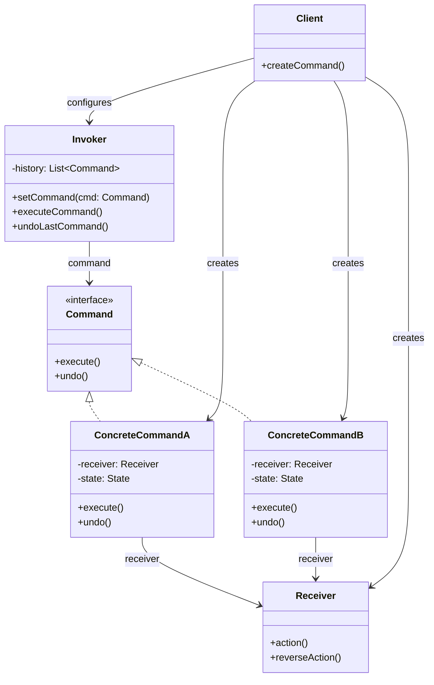

# Command Pattern

## Introduction

The **Command** pattern is a behavioral design pattern that encapsulates a request as a standalone object, containing all the information needed to perform the action. By turning operations into objects, you decouple the sender (invoker) from the receiver, enabling powerful capabilities: queuing requests, logging them for audit, supporting undo/redo, scheduling deferred execution, and assembling composite (macro) commands.

In distributed systems and enterprise software, the Command pattern is foundational for event sourcing, saga orchestration, CQRS (Command Query Responsibility Segregation), and transactional outbox patterns. It transforms imperative "do this now" calls into declarative "here is what needs to happen" objects that can be stored, transmitted, retried, or reversed.

## Intent

- Encapsulate a request as an object, thereby letting you parameterize clients with different requests, queue or log requests, and support undoable operations.
- Decouple the object that invokes the operation from the one that knows how to perform it.
- Provide a uniform interface for executing diverse operations, enabling macro commands, transactional batching, and replay.

## Class Diagram



## Key Characteristics

- **Encapsulation of requests**: Each action becomes a self-contained object with all necessary context.
- **Decoupling**: The invoker knows nothing about the receiver or how the operation is performed.
- **Undo/Redo**: Commands store enough state to reverse their effects, enabling robust undo chains.
- **Queueing & Scheduling**: Commands can be placed in queues, persisted, and executed later or in parallel.
- **Logging & Audit**: Every executed command can be recorded for compliance, debugging, or replay.
- **Macro Commands**: Multiple commands can be composed into a single composite command for transactional batching.
- **Retry & Compensation**: Failed commands can be retried or compensated without reimplementing the logic at the call site.

---

## Example 1: Fintech — Transaction Command Queue

### Problem

A fintech platform must process fund transfers, reversals, and batch settlements across multiple accounts and ledgers. Operations arrive asynchronously, may fail due to insufficient funds or network issues, and must support dispute resolution where a customer service agent can undo a transfer days later. Hardcoding these operations inline makes it impossible to queue them during peak load, replay them after outages, or maintain a consistent audit trail for regulatory compliance.

### Solution

Model every financial operation — transfer, reversal, settlement — as a **Command** object. Each command captures the source account, destination account, amount, and a timestamp. An **Invoker** (the transaction processor) queues commands and executes them in order. Each command implements `execute()` to debit/credit ledgers and `undo()` to reverse the entry. A command history enables dispute agents to walk back transactions and provides a complete, replayable audit log.

### Python

```python
from __future__ import annotations
from abc import ABC, abstractmethod
from dataclasses import dataclass, field
from datetime import datetime, timezone


@dataclass
class Account:
    account_id: str
    balance: float = 0.0

    def debit(self, amount: float) -> None:
        if self.balance < amount:
            raise ValueError(f"Insufficient funds in {self.account_id}")
        self.balance -= amount

    def credit(self, amount: float) -> None:
        self.balance += amount


class TransactionCommand(ABC):
    @abstractmethod
    def execute(self) -> None: ...
    @abstractmethod
    def undo(self) -> None: ...


@dataclass
class FundTransferCommand(TransactionCommand):
    source: Account
    destination: Account
    amount: float
    executed_at: datetime | None = None

    def execute(self) -> None:
        self.source.debit(self.amount)
        self.destination.credit(self.amount)
        self.executed_at = datetime.now(timezone.utc)
        print(f"Transferred ${self.amount:.2f}: {self.source.account_id} -> {self.destination.account_id}")

    def undo(self) -> None:
        self.destination.debit(self.amount)
        self.source.credit(self.amount)
        print(f"Reversed ${self.amount:.2f}: {self.destination.account_id} -> {self.source.account_id}")


@dataclass
class BatchSettlementCommand(TransactionCommand):
    transfers: list[FundTransferCommand] = field(default_factory=list)

    def execute(self) -> None:
        for t in self.transfers:
            t.execute()
        print(f"Batch settled {len(self.transfers)} transfers")

    def undo(self) -> None:
        for t in reversed(self.transfers):
            t.undo()
        print(f"Batch reversal complete")


@dataclass
class TransactionProcessor:
    history: list[TransactionCommand] = field(default_factory=list)

    def submit(self, cmd: TransactionCommand) -> None:
        cmd.execute()
        self.history.append(cmd)

    def dispute_undo(self) -> None:
        if self.history:
            cmd = self.history.pop()
            cmd.undo()


if __name__ == "__main__":
    checking = Account("CHK-1001", 5000.0)
    savings = Account("SAV-2002", 3000.0)
    merchant = Account("MER-3003", 0.0)

    processor = TransactionProcessor()
    processor.submit(FundTransferCommand(checking, merchant, 120.50))
    processor.submit(FundTransferCommand(savings, merchant, 75.00))
    print(f"Merchant balance: ${merchant.balance:.2f}")

    processor.dispute_undo()
    print(f"Merchant balance after dispute: ${merchant.balance:.2f}")
```

### Go

```go
package main

import (
	"fmt"
	"time"
)

type Account struct {
	ID      string
	Balance float64
}

func (a *Account) Debit(amount float64) error {
	if a.Balance < amount {
		return fmt.Errorf("insufficient funds in %s", a.ID)
	}
	a.Balance -= amount
	return nil
}

func (a *Account) Credit(amount float64) { a.Balance += amount }

type TransactionCommand interface {
	Execute() error
	Undo() error
}

type FundTransferCommand struct {
	Source, Dest *Account
	Amount       float64
	ExecutedAt   time.Time
}

func (c *FundTransferCommand) Execute() error {
	if err := c.Source.Debit(c.Amount); err != nil {
		return err
	}
	c.Dest.Credit(c.Amount)
	c.ExecutedAt = time.Now().UTC()
	fmt.Printf("Transferred $%.2f: %s -> %s\n", c.Amount, c.Source.ID, c.Dest.ID)
	return nil
}

func (c *FundTransferCommand) Undo() error {
	if err := c.Dest.Debit(c.Amount); err != nil {
		return err
	}
	c.Source.Credit(c.Amount)
	fmt.Printf("Reversed $%.2f: %s -> %s\n", c.Amount, c.Dest.ID, c.Source.ID)
	return nil
}

type TransactionProcessor struct {
	History []TransactionCommand
}

func (p *TransactionProcessor) Submit(cmd TransactionCommand) error {
	if err := cmd.Execute(); err != nil {
		return err
	}
	p.History = append(p.History, cmd)
	return nil
}

func (p *TransactionProcessor) DisputeUndo() error {
	if len(p.History) == 0 {
		return fmt.Errorf("no commands to undo")
	}
	cmd := p.History[len(p.History)-1]
	p.History = p.History[:len(p.History)-1]
	return cmd.Undo()
}

func main() {
	checking := &Account{ID: "CHK-1001", Balance: 5000}
	merchant := &Account{ID: "MER-3003", Balance: 0}

	proc := &TransactionProcessor{}
	proc.Submit(&FundTransferCommand{Source: checking, Dest: merchant, Amount: 120.50})
	proc.Submit(&FundTransferCommand{Source: checking, Dest: merchant, Amount: 75.00})
	fmt.Printf("Merchant balance: $%.2f\n", merchant.Balance)

	proc.DisputeUndo()
	fmt.Printf("Merchant balance after dispute: $%.2f\n", merchant.Balance)
}
```

### Java

```java
import java.time.Instant;
import java.util.ArrayDeque;
import java.util.Deque;

interface TransactionCommand {
    void execute();
    void undo();
}

class Account {
    final String id;
    double balance;

    Account(String id, double balance) { this.id = id; this.balance = balance; }

    void debit(double amount) {
        if (balance < amount) throw new IllegalStateException("Insufficient funds in " + id);
        balance -= amount;
    }

    void credit(double amount) { balance += amount; }
}

class FundTransferCommand implements TransactionCommand {
    private final Account source, dest;
    private final double amount;
    private Instant executedAt;

    FundTransferCommand(Account source, Account dest, double amount) {
        this.source = source; this.dest = dest; this.amount = amount;
    }

    public void execute() {
        source.debit(amount);
        dest.credit(amount);
        executedAt = Instant.now();
        System.out.printf("Transferred $%.2f: %s -> %s%n", amount, source.id, dest.id);
    }

    public void undo() {
        dest.debit(amount);
        source.credit(amount);
        System.out.printf("Reversed $%.2f: %s -> %s%n", amount, dest.id, source.id);
    }
}

class TransactionProcessor {
    private final Deque<TransactionCommand> history = new ArrayDeque<>();

    void submit(TransactionCommand cmd) { cmd.execute(); history.push(cmd); }

    void disputeUndo() {
        if (!history.isEmpty()) { history.pop().undo(); }
    }
}

public class FintechCommandDemo {
    public static void main(String[] args) {
        var checking = new Account("CHK-1001", 5000);
        var merchant = new Account("MER-3003", 0);

        var processor = new TransactionProcessor();
        processor.submit(new FundTransferCommand(checking, merchant, 120.50));
        processor.submit(new FundTransferCommand(checking, merchant, 75.00));
        System.out.printf("Merchant balance: $%.2f%n", merchant.balance);

        processor.disputeUndo();
        System.out.printf("Merchant balance after dispute: $%.2f%n", merchant.balance);
    }
}
```

### TypeScript

```typescript
interface TransactionCommand {
  execute(): void;
  undo(): void;
}

class Account {
  constructor(public readonly id: string, public balance: number = 0) {}

  debit(amount: number): void {
    if (this.balance < amount)
      throw new Error(`Insufficient funds in ${this.id}`);
    this.balance -= amount;
  }

  credit(amount: number): void {
    this.balance += amount;
  }
}

class FundTransferCommand implements TransactionCommand {
  private executedAt?: Date;

  constructor(
    private source: Account,
    private dest: Account,
    private amount: number,
  ) {}

  execute(): void {
    this.source.debit(this.amount);
    this.dest.credit(this.amount);
    this.executedAt = new Date();
    console.log(
      `Transferred $${this.amount.toFixed(2)}: ${this.source.id} -> ${
        this.dest.id
      }`,
    );
  }

  undo(): void {
    this.dest.debit(this.amount);
    this.source.credit(this.amount);
    console.log(
      `Reversed $${this.amount.toFixed(2)}: ${this.dest.id} -> ${
        this.source.id
      }`,
    );
  }
}

class TransactionProcessor {
  private history: TransactionCommand[] = [];

  submit(cmd: TransactionCommand): void {
    cmd.execute();
    this.history.push(cmd);
  }

  disputeUndo(): void {
    const cmd = this.history.pop();
    cmd?.undo();
  }
}

// --- Demo ---
const checking = new Account("CHK-1001", 5000);
const merchant = new Account("MER-3003", 0);

const processor = new TransactionProcessor();
processor.submit(new FundTransferCommand(checking, merchant, 120.5));
processor.submit(new FundTransferCommand(checking, merchant, 75.0));
console.log(`Merchant balance: $${merchant.balance.toFixed(2)}`);

processor.disputeUndo();
console.log(`Merchant balance after dispute: $${merchant.balance.toFixed(2)}`);
```

### Rust

```rust
use std::time::SystemTime;

struct Account {
    id: String,
    balance: f64,
}

impl Account {
    fn new(id: &str, balance: f64) -> Self {
        Self { id: id.to_string(), balance }
    }

    fn debit(&mut self, amount: f64) -> Result<(), String> {
        if self.balance < amount {
            return Err(format!("Insufficient funds in {}", self.id));
        }
        self.balance -= amount;
        Ok(())
    }

    fn credit(&mut self, amount: f64) {
        self.balance += amount;
    }
}

trait TransactionCommand {
    fn execute(&mut self, accounts: &mut [Account]) -> Result<(), String>;
    fn undo(&mut self, accounts: &mut [Account]) -> Result<(), String>;
}

struct FundTransferCommand {
    source_idx: usize,
    dest_idx: usize,
    amount: f64,
    executed_at: Option<SystemTime>,
}

impl FundTransferCommand {
    fn new(source_idx: usize, dest_idx: usize, amount: f64) -> Self {
        Self { source_idx, dest_idx, amount, executed_at: None }
    }
}

impl TransactionCommand for FundTransferCommand {
    fn execute(&mut self, accounts: &mut [Account]) -> Result<(), String> {
        accounts[self.source_idx].debit(self.amount)?;
        accounts[self.dest_idx].credit(self.amount);
        self.executed_at = Some(SystemTime::now());
        println!("Transferred ${:.2}: {} -> {}",
            self.amount, accounts[self.source_idx].id, accounts[self.dest_idx].id);
        Ok(())
    }

    fn undo(&mut self, accounts: &mut [Account]) -> Result<(), String> {
        accounts[self.dest_idx].debit(self.amount)?;
        accounts[self.source_idx].credit(self.amount);
        println!("Reversed ${:.2}: {} -> {}",
            self.amount, accounts[self.dest_idx].id, accounts[self.source_idx].id);
        Ok(())
    }
}

fn main() {
    let mut accounts = vec![
        Account::new("CHK-1001", 5000.0),
        Account::new("MER-3003", 0.0),
    ];
    let mut history: Vec<Box<dyn TransactionCommand>> = Vec::new();

    let mut cmd1 = Box::new(FundTransferCommand::new(0, 1, 120.50));
    cmd1.execute(&mut accounts).unwrap();
    history.push(cmd1);

    let mut cmd2 = Box::new(FundTransferCommand::new(0, 1, 75.00));
    cmd2.execute(&mut accounts).unwrap();
    history.push(cmd2);

    println!("Merchant balance: ${:.2}", accounts[1].balance);

    if let Some(mut cmd) = history.pop() {
        cmd.undo(&mut accounts).unwrap();
    }
    println!("Merchant balance after dispute: ${:.2}", accounts[1].balance);
}
```

---

## Example 2: Healthcare — Medical Order System

### Problem

Hospitals operate under strict regulatory and safety requirements where every clinical order — prescriptions, lab tests, procedure scheduling — must be traceable, auditable, and cancellable. A physician may place an order that a pharmacist later questions; a nurse might need to cancel a lab request when a patient's condition changes. Without a structured approach, order management becomes a tangled web of status flags and ad-hoc callbacks that are nearly impossible to audit for compliance (e.g., HIPAA, Joint Commission requirements).

### Solution

Encapsulate each medical order as a **Command** object carrying the patient ID, provider ID, order details, and timestamp. An **OrderInvoker** executes commands and maintains an audit trail. Each command's `execute()` places the order into the hospital system, while `undo()` cancels it and records the cancellation reason. The audit log is simply the history of command objects, providing a complete, tamper-evident record of clinical decisions.

### Python

```python
from __future__ import annotations
from abc import ABC, abstractmethod
from dataclasses import dataclass, field
from datetime import datetime, timezone
from enum import Enum


class OrderStatus(Enum):
    PENDING = "PENDING"
    ACTIVE = "ACTIVE"
    CANCELLED = "CANCELLED"


@dataclass
class MedicalOrder:
    order_id: str
    patient_id: str
    provider_id: str
    description: str
    status: OrderStatus = OrderStatus.PENDING


class ClinicalCommand(ABC):
    @abstractmethod
    def execute(self) -> None: ...
    @abstractmethod
    def undo(self) -> None: ...
    @abstractmethod
    def audit_entry(self) -> str: ...


@dataclass
class PrescriptionOrderCommand(ClinicalCommand):
    order: MedicalOrder
    medication: str
    dosage_mg: float
    frequency: str
    timestamp: datetime | None = None

    def execute(self) -> None:
        self.order.status = OrderStatus.ACTIVE
        self.timestamp = datetime.now(timezone.utc)
        print(f"[Rx] {self.medication} {self.dosage_mg}mg {self.frequency} for patient {self.order.patient_id}")

    def undo(self) -> None:
        self.order.status = OrderStatus.CANCELLED
        print(f"[Rx CANCELLED] {self.medication} for patient {self.order.patient_id}")

    def audit_entry(self) -> str:
        return f"{self.timestamp} | Rx {self.medication} | {self.order.status.value} | Provider: {self.order.provider_id}"


@dataclass
class LabTestOrderCommand(ClinicalCommand):
    order: MedicalOrder
    test_name: str
    urgency: str = "ROUTINE"
    timestamp: datetime | None = None

    def execute(self) -> None:
        self.order.status = OrderStatus.ACTIVE
        self.timestamp = datetime.now(timezone.utc)
        print(f"[Lab] {self.test_name} ({self.urgency}) for patient {self.order.patient_id}")

    def undo(self) -> None:
        self.order.status = OrderStatus.CANCELLED
        print(f"[Lab CANCELLED] {self.test_name} for patient {self.order.patient_id}")

    def audit_entry(self) -> str:
        return f"{self.timestamp} | Lab {self.test_name} | {self.order.status.value} | Provider: {self.order.provider_id}"


@dataclass
class ClinicalOrderInvoker:
    audit_log: list[str] = field(default_factory=list)
    history: list[ClinicalCommand] = field(default_factory=list)

    def place_order(self, cmd: ClinicalCommand) -> None:
        cmd.execute()
        self.history.append(cmd)
        self.audit_log.append(cmd.audit_entry())

    def cancel_last_order(self) -> None:
        if self.history:
            cmd = self.history.pop()
            cmd.undo()
            self.audit_log.append(cmd.audit_entry())


if __name__ == "__main__":
    invoker = ClinicalOrderInvoker()

    rx_order = MedicalOrder("ORD-5001", "PAT-7890", "DR-SMITH", "Amoxicillin prescription")
    invoker.place_order(PrescriptionOrderCommand(rx_order, "Amoxicillin", 500, "TID"))

    lab_order = MedicalOrder("ORD-5002", "PAT-7890", "DR-SMITH", "CBC panel")
    invoker.place_order(LabTestOrderCommand(lab_order, "Complete Blood Count", "STAT"))

    invoker.cancel_last_order()

    print("\n--- Audit Log ---")
    for entry in invoker.audit_log:
        print(entry)
```

### Go

```go
package main

import (
	"fmt"
	"time"
)

type OrderStatus string

const (
	Pending   OrderStatus = "PENDING"
	Active    OrderStatus = "ACTIVE"
	Cancelled OrderStatus = "CANCELLED"
)

type MedicalOrder struct {
	OrderID, PatientID, ProviderID string
	Status                         OrderStatus
}

type ClinicalCommand interface {
	Execute()
	Undo()
	AuditEntry() string
}

type PrescriptionOrderCommand struct {
	Order      *MedicalOrder
	Medication string
	DosageMg   float64
	Frequency  string
	Timestamp  time.Time
}

func (c *PrescriptionOrderCommand) Execute() {
	c.Order.Status = Active
	c.Timestamp = time.Now().UTC()
	fmt.Printf("[Rx] %s %.0fmg %s for patient %s\n", c.Medication, c.DosageMg, c.Frequency, c.Order.PatientID)
}

func (c *PrescriptionOrderCommand) Undo() {
	c.Order.Status = Cancelled
	fmt.Printf("[Rx CANCELLED] %s for patient %s\n", c.Medication, c.Order.PatientID)
}

func (c *PrescriptionOrderCommand) AuditEntry() string {
	return fmt.Sprintf("%s | Rx %s | %s | Provider: %s", c.Timestamp, c.Medication, c.Order.Status, c.Order.ProviderID)
}

type LabTestOrderCommand struct {
	Order    *MedicalOrder
	TestName string
	Urgency  string
	Timestamp time.Time
}

func (c *LabTestOrderCommand) Execute() {
	c.Order.Status = Active
	c.Timestamp = time.Now().UTC()
	fmt.Printf("[Lab] %s (%s) for patient %s\n", c.TestName, c.Urgency, c.Order.PatientID)
}

func (c *LabTestOrderCommand) Undo() {
	c.Order.Status = Cancelled
	fmt.Printf("[Lab CANCELLED] %s for patient %s\n", c.TestName, c.Order.PatientID)
}

func (c *LabTestOrderCommand) AuditEntry() string {
	return fmt.Sprintf("%s | Lab %s | %s | Provider: %s", c.Timestamp, c.TestName, c.Order.Status, c.Order.ProviderID)
}

type ClinicalOrderInvoker struct {
	History  []ClinicalCommand
	AuditLog []string
}

func (inv *ClinicalOrderInvoker) PlaceOrder(cmd ClinicalCommand) {
	cmd.Execute()
	inv.History = append(inv.History, cmd)
	inv.AuditLog = append(inv.AuditLog, cmd.AuditEntry())
}

func (inv *ClinicalOrderInvoker) CancelLast() {
	if n := len(inv.History); n > 0 {
		cmd := inv.History[n-1]
		inv.History = inv.History[:n-1]
		cmd.Undo()
		inv.AuditLog = append(inv.AuditLog, cmd.AuditEntry())
	}
}

func main() {
	inv := &ClinicalOrderInvoker{}
	rxOrder := &MedicalOrder{"ORD-5001", "PAT-7890", "DR-SMITH", Pending}
	inv.PlaceOrder(&PrescriptionOrderCommand{Order: rxOrder, Medication: "Amoxicillin", DosageMg: 500, Frequency: "TID"})

	labOrder := &MedicalOrder{"ORD-5002", "PAT-7890", "DR-SMITH", Pending}
	inv.PlaceOrder(&LabTestOrderCommand{Order: labOrder, TestName: "Complete Blood Count", Urgency: "STAT"})

	inv.CancelLast()
	fmt.Println("\n--- Audit Log ---")
	for _, entry := range inv.AuditLog {
		fmt.Println(entry)
	}
}
```

### Java

```java
import java.time.Instant;
import java.util.ArrayList;
import java.util.List;

enum OrderStatus { PENDING, ACTIVE, CANCELLED }

class MedicalOrder {
    String orderId, patientId, providerId;
    OrderStatus status = OrderStatus.PENDING;

    MedicalOrder(String orderId, String patientId, String providerId) {
        this.orderId = orderId; this.patientId = patientId; this.providerId = providerId;
    }
}

interface ClinicalCommand {
    void execute();
    void undo();
    String auditEntry();
}

class PrescriptionOrderCommand implements ClinicalCommand {
    private final MedicalOrder order;
    private final String medication;
    private final double dosageMg;
    private final String frequency;
    private Instant timestamp;

    PrescriptionOrderCommand(MedicalOrder order, String medication, double dosageMg, String frequency) {
        this.order = order; this.medication = medication;
        this.dosageMg = dosageMg; this.frequency = frequency;
    }

    public void execute() {
        order.status = OrderStatus.ACTIVE;
        timestamp = Instant.now();
        System.out.printf("[Rx] %s %.0fmg %s for patient %s%n", medication, dosageMg, frequency, order.patientId);
    }

    public void undo() {
        order.status = OrderStatus.CANCELLED;
        System.out.printf("[Rx CANCELLED] %s for patient %s%n", medication, order.patientId);
    }

    public String auditEntry() {
        return String.format("%s | Rx %s | %s | Provider: %s", timestamp, medication, order.status, order.providerId);
    }
}

class LabTestOrderCommand implements ClinicalCommand {
    private final MedicalOrder order;
    private final String testName, urgency;
    private Instant timestamp;

    LabTestOrderCommand(MedicalOrder order, String testName, String urgency) {
        this.order = order; this.testName = testName; this.urgency = urgency;
    }

    public void execute() {
        order.status = OrderStatus.ACTIVE;
        timestamp = Instant.now();
        System.out.printf("[Lab] %s (%s) for patient %s%n", testName, urgency, order.patientId);
    }

    public void undo() {
        order.status = OrderStatus.CANCELLED;
        System.out.printf("[Lab CANCELLED] %s for patient %s%n", testName, order.patientId);
    }

    public String auditEntry() {
        return String.format("%s | Lab %s | %s | Provider: %s", timestamp, testName, order.status, order.providerId);
    }
}

class ClinicalOrderInvoker {
    private final List<ClinicalCommand> history = new ArrayList<>();
    private final List<String> auditLog = new ArrayList<>();

    void placeOrder(ClinicalCommand cmd) {
        cmd.execute(); history.add(cmd); auditLog.add(cmd.auditEntry());
    }

    void cancelLast() {
        if (!history.isEmpty()) {
            var cmd = history.remove(history.size() - 1);
            cmd.undo(); auditLog.add(cmd.auditEntry());
        }
    }

    List<String> getAuditLog() { return auditLog; }
}

public class HealthcareCommandDemo {
    public static void main(String[] args) {
        var invoker = new ClinicalOrderInvoker();
        invoker.placeOrder(new PrescriptionOrderCommand(
            new MedicalOrder("ORD-5001", "PAT-7890", "DR-SMITH"), "Amoxicillin", 500, "TID"));
        invoker.placeOrder(new LabTestOrderCommand(
            new MedicalOrder("ORD-5002", "PAT-7890", "DR-SMITH"), "Complete Blood Count", "STAT"));
        invoker.cancelLast();
        System.out.println("\n--- Audit Log ---");
        invoker.getAuditLog().forEach(System.out::println);
    }
}
```

### TypeScript

```typescript
type OrderStatus = "PENDING" | "ACTIVE" | "CANCELLED";

interface ClinicalCommand {
  execute(): void;
  undo(): void;
  auditEntry(): string;
}

class MedicalOrder {
  status: OrderStatus = "PENDING";
  constructor(
    public orderId: string,
    public patientId: string,
    public providerId: string,
  ) {}
}

class PrescriptionOrderCommand implements ClinicalCommand {
  private timestamp?: Date;

  constructor(
    private order: MedicalOrder,
    private medication: string,
    private dosageMg: number,
    private frequency: string,
  ) {}

  execute(): void {
    this.order.status = "ACTIVE";
    this.timestamp = new Date();
    console.log(
      `[Rx] ${this.medication} ${this.dosageMg}mg ${this.frequency} for patient ${this.order.patientId}`,
    );
  }

  undo(): void {
    this.order.status = "CANCELLED";
    console.log(
      `[Rx CANCELLED] ${this.medication} for patient ${this.order.patientId}`,
    );
  }

  auditEntry(): string {
    return `${this.timestamp?.toISOString()} | Rx ${this.medication} | ${
      this.order.status
    } | Provider: ${this.order.providerId}`;
  }
}

class LabTestOrderCommand implements ClinicalCommand {
  private timestamp?: Date;

  constructor(
    private order: MedicalOrder,
    private testName: string,
    private urgency: string,
  ) {}

  execute(): void {
    this.order.status = "ACTIVE";
    this.timestamp = new Date();
    console.log(
      `[Lab] ${this.testName} (${this.urgency}) for patient ${this.order.patientId}`,
    );
  }

  undo(): void {
    this.order.status = "CANCELLED";
    console.log(
      `[Lab CANCELLED] ${this.testName} for patient ${this.order.patientId}`,
    );
  }

  auditEntry(): string {
    return `${this.timestamp?.toISOString()} | Lab ${this.testName} | ${
      this.order.status
    } | Provider: ${this.order.providerId}`;
  }
}

class ClinicalOrderInvoker {
  private history: ClinicalCommand[] = [];
  auditLog: string[] = [];

  placeOrder(cmd: ClinicalCommand): void {
    cmd.execute();
    this.history.push(cmd);
    this.auditLog.push(cmd.auditEntry());
  }

  cancelLast(): void {
    const cmd = this.history.pop();
    if (cmd) {
      cmd.undo();
      this.auditLog.push(cmd.auditEntry());
    }
  }
}

// --- Demo ---
const invoker = new ClinicalOrderInvoker();
invoker.placeOrder(
  new PrescriptionOrderCommand(
    new MedicalOrder("ORD-5001", "PAT-7890", "DR-SMITH"),
    "Amoxicillin",
    500,
    "TID",
  ),
);
invoker.placeOrder(
  new LabTestOrderCommand(
    new MedicalOrder("ORD-5002", "PAT-7890", "DR-SMITH"),
    "Complete Blood Count",
    "STAT",
  ),
);
invoker.cancelLast();
console.log("\n--- Audit Log ---");
invoker.auditLog.forEach((e) => console.log(e));
```

### Rust

```rust
use std::time::SystemTime;

#[derive(Debug, Clone, Copy, PartialEq)]
enum OrderStatus { Pending, Active, Cancelled }

struct MedicalOrder {
    order_id: String,
    patient_id: String,
    provider_id: String,
    status: OrderStatus,
}

impl MedicalOrder {
    fn new(order_id: &str, patient_id: &str, provider_id: &str) -> Self {
        Self { order_id: order_id.into(), patient_id: patient_id.into(),
               provider_id: provider_id.into(), status: OrderStatus::Pending }
    }
}

trait ClinicalCommand {
    fn execute(&mut self, orders: &mut Vec<MedicalOrder>);
    fn undo(&mut self, orders: &mut Vec<MedicalOrder>);
    fn audit_entry(&self, orders: &Vec<MedicalOrder>) -> String;
}

struct PrescriptionOrderCmd {
    order_idx: usize,
    medication: String,
    dosage_mg: f64,
    frequency: String,
    timestamp: Option<SystemTime>,
}

impl ClinicalCommand for PrescriptionOrderCmd {
    fn execute(&mut self, orders: &mut Vec<MedicalOrder>) {
        orders[self.order_idx].status = OrderStatus::Active;
        self.timestamp = Some(SystemTime::now());
        println!("[Rx] {} {:.0}mg {} for patient {}",
            self.medication, self.dosage_mg, self.frequency, orders[self.order_idx].patient_id);
    }

    fn undo(&mut self, orders: &mut Vec<MedicalOrder>) {
        orders[self.order_idx].status = OrderStatus::Cancelled;
        println!("[Rx CANCELLED] {} for patient {}", self.medication, orders[self.order_idx].patient_id);
    }

    fn audit_entry(&self, orders: &Vec<MedicalOrder>) -> String {
        format!("Rx {} | {:?} | Provider: {}", self.medication,
            orders[self.order_idx].status, orders[self.order_idx].provider_id)
    }
}

struct LabTestOrderCmd {
    order_idx: usize,
    test_name: String,
    urgency: String,
    timestamp: Option<SystemTime>,
}

impl ClinicalCommand for LabTestOrderCmd {
    fn execute(&mut self, orders: &mut Vec<MedicalOrder>) {
        orders[self.order_idx].status = OrderStatus::Active;
        self.timestamp = Some(SystemTime::now());
        println!("[Lab] {} ({}) for patient {}",
            self.test_name, self.urgency, orders[self.order_idx].patient_id);
    }

    fn undo(&mut self, orders: &mut Vec<MedicalOrder>) {
        orders[self.order_idx].status = OrderStatus::Cancelled;
        println!("[Lab CANCELLED] {} for patient {}", self.test_name, orders[self.order_idx].patient_id);
    }

    fn audit_entry(&self, orders: &Vec<MedicalOrder>) -> String {
        format!("Lab {} | {:?} | Provider: {}", self.test_name,
            orders[self.order_idx].status, orders[self.order_idx].provider_id)
    }
}

fn main() {
    let mut orders = vec![
        MedicalOrder::new("ORD-5001", "PAT-7890", "DR-SMITH"),
        MedicalOrder::new("ORD-5002", "PAT-7890", "DR-SMITH"),
    ];
    let mut history: Vec<Box<dyn ClinicalCommand>> = Vec::new();
    let mut audit_log: Vec<String> = Vec::new();

    let mut rx = Box::new(PrescriptionOrderCmd {
        order_idx: 0, medication: "Amoxicillin".into(), dosage_mg: 500.0,
        frequency: "TID".into(), timestamp: None,
    });
    rx.execute(&mut orders);
    audit_log.push(rx.audit_entry(&orders));
    history.push(rx);

    let mut lab = Box::new(LabTestOrderCmd {
        order_idx: 1, test_name: "Complete Blood Count".into(),
        urgency: "STAT".into(), timestamp: None,
    });
    lab.execute(&mut orders);
    audit_log.push(lab.audit_entry(&orders));
    history.push(lab);

    if let Some(mut cmd) = history.pop() {
        cmd.undo(&mut orders);
        audit_log.push(cmd.audit_entry(&orders));
    }

    println!("\n--- Audit Log ---");
    for entry in &audit_log { println!("{}", entry); }
}
```

---

## Example 3: E-Commerce — Order Fulfillment Pipeline

### Problem

An e-commerce warehouse processes millions of orders through a multi-stage pipeline: picking items from shelves, packing them, shipping via carriers, and handling returns. Each stage can fail independently — a picker can't find an item, a packing station jams, a carrier rejects a parcel. When failures occur, the system must compensate by reversing completed stages (e.g., restocking picked items). Without a structured approach, compensating transactions are ad-hoc, error-prone, and frequently leave orders in inconsistent states.

### Solution

Model each fulfillment stage as a **Command**: `PickCommand`, `PackCommand`, `ShipCommand`, `ReturnCommand`. A **FulfillmentPipeline** (invoker) executes commands sequentially. If any command fails, the pipeline walks backward through the history calling `undo()` on each completed command — a saga-style compensation. Commands can also be queued and retried independently, enabling resilient asynchronous processing.

### Python

```python
from __future__ import annotations
from abc import ABC, abstractmethod
from dataclasses import dataclass, field
from enum import Enum


class FulfillmentStage(Enum):
    CREATED = "CREATED"
    PICKED = "PICKED"
    PACKED = "PACKED"
    SHIPPED = "SHIPPED"
    RETURNED = "RETURNED"


@dataclass
class WarehouseOrder:
    order_id: str
    sku: str
    quantity: int
    stage: FulfillmentStage = FulfillmentStage.CREATED


class FulfillmentCommand(ABC):
    @abstractmethod
    def execute(self) -> None: ...
    @abstractmethod
    def undo(self) -> None: ...


@dataclass
class PickCommand(FulfillmentCommand):
    order: WarehouseOrder
    aisle: str

    def execute(self) -> None:
        self.order.stage = FulfillmentStage.PICKED
        print(f"[PICK] Order {self.order.order_id}: {self.order.quantity}x {self.order.sku} from aisle {self.aisle}")

    def undo(self) -> None:
        self.order.stage = FulfillmentStage.CREATED
        print(f"[RESTOCK] Order {self.order.order_id}: returned {self.order.sku} to aisle {self.aisle}")


@dataclass
class PackCommand(FulfillmentCommand):
    order: WarehouseOrder
    box_size: str

    def execute(self) -> None:
        self.order.stage = FulfillmentStage.PACKED
        print(f"[PACK] Order {self.order.order_id}: packed in {self.box_size} box")

    def undo(self) -> None:
        self.order.stage = FulfillmentStage.PICKED
        print(f"[UNPACK] Order {self.order.order_id}: unpacked from {self.box_size} box")


@dataclass
class ShipCommand(FulfillmentCommand):
    order: WarehouseOrder
    carrier: str
    tracking: str = ""

    def execute(self) -> None:
        self.tracking = f"TRK-{self.order.order_id[-4:]}"
        self.order.stage = FulfillmentStage.SHIPPED
        print(f"[SHIP] Order {self.order.order_id}: via {self.carrier}, tracking {self.tracking}")

    def undo(self) -> None:
        self.order.stage = FulfillmentStage.PACKED
        print(f"[RECALL] Order {self.order.order_id}: recalled from {self.carrier}")


@dataclass
class FulfillmentPipeline:
    completed: list[FulfillmentCommand] = field(default_factory=list)

    def run(self, commands: list[FulfillmentCommand]) -> bool:
        for cmd in commands:
            try:
                cmd.execute()
                self.completed.append(cmd)
            except Exception as e:
                print(f"Pipeline failure: {e}. Compensating...")
                self.compensate()
                return False
        return True

    def compensate(self) -> None:
        for cmd in reversed(self.completed):
            cmd.undo()
        self.completed.clear()


if __name__ == "__main__":
    order = WarehouseOrder("WH-88001", "WIDGET-PRO-X", 3)
    pipeline = FulfillmentPipeline()
    pipeline.run([
        PickCommand(order, "A-14"),
        PackCommand(order, "MEDIUM"),
        ShipCommand(order, "FedEx"),
    ])
    print(f"Order stage: {order.stage.value}")
```

### Go

```go
package main

import "fmt"

type FulfillmentStage string

const (
	Created  FulfillmentStage = "CREATED"
	Picked   FulfillmentStage = "PICKED"
	Packed   FulfillmentStage = "PACKED"
	Shipped  FulfillmentStage = "SHIPPED"
)

type WarehouseOrder struct {
	OrderID  string
	SKU      string
	Quantity int
	Stage    FulfillmentStage
}

type FulfillmentCommand interface {
	Execute() error
	Undo()
}

type PickCommand struct {
	Order *WarehouseOrder
	Aisle string
}

func (c *PickCommand) Execute() error {
	c.Order.Stage = Picked
	fmt.Printf("[PICK] Order %s: %dx %s from aisle %s\n", c.Order.OrderID, c.Order.Quantity, c.Order.SKU, c.Aisle)
	return nil
}

func (c *PickCommand) Undo() {
	c.Order.Stage = Created
	fmt.Printf("[RESTOCK] Order %s: returned %s to aisle %s\n", c.Order.OrderID, c.Order.SKU, c.Aisle)
}

type PackCommand struct {
	Order   *WarehouseOrder
	BoxSize string
}

func (c *PackCommand) Execute() error {
	c.Order.Stage = Packed
	fmt.Printf("[PACK] Order %s: packed in %s box\n", c.Order.OrderID, c.BoxSize)
	return nil
}

func (c *PackCommand) Undo() {
	c.Order.Stage = Picked
	fmt.Printf("[UNPACK] Order %s: unpacked from %s box\n", c.Order.OrderID, c.BoxSize)
}

type ShipCommand struct {
	Order    *WarehouseOrder
	Carrier  string
	Tracking string
}

func (c *ShipCommand) Execute() error {
	c.Tracking = fmt.Sprintf("TRK-%s", c.Order.OrderID[len(c.Order.OrderID)-4:])
	c.Order.Stage = Shipped
	fmt.Printf("[SHIP] Order %s: via %s, tracking %s\n", c.Order.OrderID, c.Carrier, c.Tracking)
	return nil
}

func (c *ShipCommand) Undo() {
	c.Order.Stage = Packed
	fmt.Printf("[RECALL] Order %s: recalled from %s\n", c.Order.OrderID, c.Carrier)
}

type FulfillmentPipeline struct {
	Completed []FulfillmentCommand
}

func (p *FulfillmentPipeline) Run(cmds []FulfillmentCommand) bool {
	for _, cmd := range cmds {
		if err := cmd.Execute(); err != nil {
			fmt.Printf("Pipeline failure: %v. Compensating...\n", err)
			p.Compensate()
			return false
		}
		p.Completed = append(p.Completed, cmd)
	}
	return true
}

func (p *FulfillmentPipeline) Compensate() {
	for i := len(p.Completed) - 1; i >= 0; i-- {
		p.Completed[i].Undo()
	}
	p.Completed = nil
}

func main() {
	order := &WarehouseOrder{"WH-88001", "WIDGET-PRO-X", 3, Created}
	pipeline := &FulfillmentPipeline{}
	pipeline.Run([]FulfillmentCommand{
		&PickCommand{Order: order, Aisle: "A-14"},
		&PackCommand{Order: order, BoxSize: "MEDIUM"},
		&ShipCommand{Order: order, Carrier: "FedEx"},
	})
	fmt.Printf("Order stage: %s\n", order.Stage)
}
```

### Java

```java
import java.util.ArrayList;
import java.util.List;

enum FulfillmentStage { CREATED, PICKED, PACKED, SHIPPED }

class WarehouseOrder {
    String orderId, sku;
    int quantity;
    FulfillmentStage stage = FulfillmentStage.CREATED;

    WarehouseOrder(String orderId, String sku, int quantity) {
        this.orderId = orderId; this.sku = sku; this.quantity = quantity;
    }
}

interface FulfillmentCommand {
    void execute();
    void undo();
}

class PickCommand implements FulfillmentCommand {
    private final WarehouseOrder order;
    private final String aisle;

    PickCommand(WarehouseOrder order, String aisle) { this.order = order; this.aisle = aisle; }

    public void execute() {
        order.stage = FulfillmentStage.PICKED;
        System.out.printf("[PICK] Order %s: %dx %s from aisle %s%n", order.orderId, order.quantity, order.sku, aisle);
    }

    public void undo() {
        order.stage = FulfillmentStage.CREATED;
        System.out.printf("[RESTOCK] Order %s: returned %s to aisle %s%n", order.orderId, order.sku, aisle);
    }
}

class PackCommand implements FulfillmentCommand {
    private final WarehouseOrder order;
    private final String boxSize;

    PackCommand(WarehouseOrder order, String boxSize) { this.order = order; this.boxSize = boxSize; }

    public void execute() {
        order.stage = FulfillmentStage.PACKED;
        System.out.printf("[PACK] Order %s: packed in %s box%n", order.orderId, boxSize);
    }

    public void undo() {
        order.stage = FulfillmentStage.PICKED;
        System.out.printf("[UNPACK] Order %s: unpacked from %s box%n", order.orderId, boxSize);
    }
}

class ShipCommand implements FulfillmentCommand {
    private final WarehouseOrder order;
    private final String carrier;
    private String tracking = "";

    ShipCommand(WarehouseOrder order, String carrier) { this.order = order; this.carrier = carrier; }

    public void execute() {
        tracking = "TRK-" + order.orderId.substring(order.orderId.length() - 4);
        order.stage = FulfillmentStage.SHIPPED;
        System.out.printf("[SHIP] Order %s: via %s, tracking %s%n", order.orderId, carrier, tracking);
    }

    public void undo() {
        order.stage = FulfillmentStage.PACKED;
        System.out.printf("[RECALL] Order %s: recalled from %s%n", order.orderId, carrier);
    }
}

class FulfillmentPipeline {
    private final List<FulfillmentCommand> completed = new ArrayList<>();

    boolean run(List<FulfillmentCommand> cmds) {
        for (var cmd : cmds) {
            try { cmd.execute(); completed.add(cmd); }
            catch (Exception e) { System.out.println("Pipeline failure. Compensating..."); compensate(); return false; }
        }
        return true;
    }

    void compensate() {
        for (int i = completed.size() - 1; i >= 0; i--) completed.get(i).undo();
        completed.clear();
    }
}

public class ECommerceCommandDemo {
    public static void main(String[] args) {
        var order = new WarehouseOrder("WH-88001", "WIDGET-PRO-X", 3);
        var pipeline = new FulfillmentPipeline();
        pipeline.run(List.of(
            new PickCommand(order, "A-14"),
            new PackCommand(order, "MEDIUM"),
            new ShipCommand(order, "FedEx")
        ));
        System.out.printf("Order stage: %s%n", order.stage);
    }
}
```

### TypeScript

```typescript
type FulfillmentStage = "CREATED" | "PICKED" | "PACKED" | "SHIPPED";

interface FulfillmentCommand {
  execute(): void;
  undo(): void;
}

class WarehouseOrder {
  stage: FulfillmentStage = "CREATED";
  constructor(
    public orderId: string,
    public sku: string,
    public quantity: number,
  ) {}
}

class PickCommand implements FulfillmentCommand {
  constructor(private order: WarehouseOrder, private aisle: string) {}

  execute(): void {
    this.order.stage = "PICKED";
    console.log(
      `[PICK] Order ${this.order.orderId}: ${this.order.quantity}x ${this.order.sku} from aisle ${this.aisle}`,
    );
  }

  undo(): void {
    this.order.stage = "CREATED";
    console.log(
      `[RESTOCK] Order ${this.order.orderId}: returned ${this.order.sku} to aisle ${this.aisle}`,
    );
  }
}

class PackCommand implements FulfillmentCommand {
  constructor(private order: WarehouseOrder, private boxSize: string) {}

  execute(): void {
    this.order.stage = "PACKED";
    console.log(
      `[PACK] Order ${this.order.orderId}: packed in ${this.boxSize} box`,
    );
  }

  undo(): void {
    this.order.stage = "PICKED";
    console.log(
      `[UNPACK] Order ${this.order.orderId}: unpacked from ${this.boxSize} box`,
    );
  }
}

class ShipCommand implements FulfillmentCommand {
  private tracking = "";
  constructor(private order: WarehouseOrder, private carrier: string) {}

  execute(): void {
    this.tracking = `TRK-${this.order.orderId.slice(-4)}`;
    this.order.stage = "SHIPPED";
    console.log(
      `[SHIP] Order ${this.order.orderId}: via ${this.carrier}, tracking ${this.tracking}`,
    );
  }

  undo(): void {
    this.order.stage = "PACKED";
    console.log(
      `[RECALL] Order ${this.order.orderId}: recalled from ${this.carrier}`,
    );
  }
}

class FulfillmentPipeline {
  private completed: FulfillmentCommand[] = [];

  run(cmds: FulfillmentCommand[]): boolean {
    for (const cmd of cmds) {
      try {
        cmd.execute();
        this.completed.push(cmd);
      } catch (e) {
        console.log(`Pipeline failure: ${e}. Compensating...`);
        this.compensate();
        return false;
      }
    }
    return true;
  }

  compensate(): void {
    for (let i = this.completed.length - 1; i >= 0; i--) {
      this.completed[i].undo();
    }
    this.completed = [];
  }
}

// --- Demo ---
const order = new WarehouseOrder("WH-88001", "WIDGET-PRO-X", 3);
const pipeline = new FulfillmentPipeline();
pipeline.run([
  new PickCommand(order, "A-14"),
  new PackCommand(order, "MEDIUM"),
  new ShipCommand(order, "FedEx"),
]);
console.log(`Order stage: ${order.stage}`);
```

### Rust

```rust
use std::fmt;

#[derive(Debug, Clone, Copy)]
enum FulfillmentStage { Created, Picked, Packed, Shipped }

impl fmt::Display for FulfillmentStage {
    fn fmt(&self, f: &mut fmt::Formatter) -> fmt::Result { write!(f, "{:?}", self) }
}

struct WarehouseOrder {
    order_id: String,
    sku: String,
    quantity: u32,
    stage: FulfillmentStage,
}

trait FulfillmentCommand {
    fn execute(&mut self, orders: &mut Vec<WarehouseOrder>);
    fn undo(&mut self, orders: &mut Vec<WarehouseOrder>);
}

struct PickCmd { order_idx: usize, aisle: String }

impl FulfillmentCommand for PickCmd {
    fn execute(&mut self, orders: &mut Vec<WarehouseOrder>) {
        let o = &mut orders[self.order_idx];
        o.stage = FulfillmentStage::Picked;
        println!("[PICK] Order {}: {}x {} from aisle {}", o.order_id, o.quantity, o.sku, self.aisle);
    }
    fn undo(&mut self, orders: &mut Vec<WarehouseOrder>) {
        let o = &mut orders[self.order_idx];
        o.stage = FulfillmentStage::Created;
        println!("[RESTOCK] Order {}: returned {} to aisle {}", o.order_id, o.sku, self.aisle);
    }
}

struct PackCmd { order_idx: usize, box_size: String }

impl FulfillmentCommand for PackCmd {
    fn execute(&mut self, orders: &mut Vec<WarehouseOrder>) {
        orders[self.order_idx].stage = FulfillmentStage::Packed;
        println!("[PACK] Order {}: packed in {} box", orders[self.order_idx].order_id, self.box_size);
    }
    fn undo(&mut self, orders: &mut Vec<WarehouseOrder>) {
        orders[self.order_idx].stage = FulfillmentStage::Picked;
        println!("[UNPACK] Order {}: unpacked from {} box", orders[self.order_idx].order_id, self.box_size);
    }
}

struct ShipCmd { order_idx: usize, carrier: String, tracking: String }

impl FulfillmentCommand for ShipCmd {
    fn execute(&mut self, orders: &mut Vec<WarehouseOrder>) {
        let o = &mut orders[self.order_idx];
        self.tracking = format!("TRK-{}", &o.order_id[o.order_id.len()-4..]);
        o.stage = FulfillmentStage::Shipped;
        println!("[SHIP] Order {}: via {}, tracking {}", o.order_id, self.carrier, self.tracking);
    }
    fn undo(&mut self, orders: &mut Vec<WarehouseOrder>) {
        orders[self.order_idx].stage = FulfillmentStage::Packed;
        println!("[RECALL] Order {}: recalled from {}", orders[self.order_idx].order_id, self.carrier);
    }
}

fn run_pipeline(cmds: &mut Vec<Box<dyn FulfillmentCommand>>, orders: &mut Vec<WarehouseOrder>) {
    let mut completed = 0;
    for cmd in cmds.iter_mut() {
        cmd.execute(orders);
        completed += 1;
    }
    println!("Pipeline completed {} stages", completed);
}

fn main() {
    let mut orders = vec![WarehouseOrder {
        order_id: "WH-88001".into(), sku: "WIDGET-PRO-X".into(),
        quantity: 3, stage: FulfillmentStage::Created,
    }];
    let mut cmds: Vec<Box<dyn FulfillmentCommand>> = vec![
        Box::new(PickCmd { order_idx: 0, aisle: "A-14".into() }),
        Box::new(PackCmd { order_idx: 0, box_size: "MEDIUM".into() }),
        Box::new(ShipCmd { order_idx: 0, carrier: "FedEx".into(), tracking: String::new() }),
    ];
    run_pipeline(&mut cmds, &mut orders);
    println!("Order stage: {}", orders[0].stage);
}
```

---

## Example 4: Media/Streaming — Content Moderation Queue

### Problem

A media platform receives thousands of user-generated content submissions (videos, images, comments) daily. Each piece of content must go through a moderation workflow: automated screening, human review, approval or rejection, and potential escalation. Moderators work in shifts, actions must be auditable for legal compliance, and wrongful rejections need to be reversible. A monolithic if-else chain handling these states is fragile, hard to distribute across workers, and impossible to audit systematically.

### Solution

Encapsulate each moderation action — `ReviewCommand`, `ApproveCommand`, `RejectCommand`, `EscalateCommand` — as a **Command** object. A **ModerationQueue** (invoker) dispatches commands to moderators. Each command records who performed the action, when, and the rationale. The undo capability lets supervisors reverse incorrect moderator decisions. The queue enables fair distribution of work and retry for actions that fail due to transient errors.

### Python

```python
from __future__ import annotations
from abc import ABC, abstractmethod
from dataclasses import dataclass, field
from datetime import datetime, timezone
from enum import Enum


class ContentStatus(Enum):
    SUBMITTED = "SUBMITTED"
    UNDER_REVIEW = "UNDER_REVIEW"
    APPROVED = "APPROVED"
    REJECTED = "REJECTED"
    ESCALATED = "ESCALATED"


@dataclass
class ContentItem:
    content_id: str
    title: str
    submitter: str
    status: ContentStatus = ContentStatus.SUBMITTED


class ModerationCommand(ABC):
    @abstractmethod
    def execute(self) -> None: ...
    @abstractmethod
    def undo(self) -> None: ...


@dataclass
class ReviewCommand(ModerationCommand):
    item: ContentItem
    moderator: str
    previous_status: ContentStatus = ContentStatus.SUBMITTED

    def execute(self) -> None:
        self.previous_status = self.item.status
        self.item.status = ContentStatus.UNDER_REVIEW
        print(f"[REVIEW] '{self.item.title}' assigned to {self.moderator}")

    def undo(self) -> None:
        self.item.status = self.previous_status
        print(f"[UNASSIGN] '{self.item.title}' returned to queue")


@dataclass
class ApproveCommand(ModerationCommand):
    item: ContentItem
    moderator: str
    reason: str = ""
    previous_status: ContentStatus = ContentStatus.UNDER_REVIEW

    def execute(self) -> None:
        self.previous_status = self.item.status
        self.item.status = ContentStatus.APPROVED
        print(f"[APPROVED] '{self.item.title}' by {self.moderator}: {self.reason}")

    def undo(self) -> None:
        self.item.status = self.previous_status
        print(f"[APPROVAL REVOKED] '{self.item.title}' sent back to review")


@dataclass
class RejectCommand(ModerationCommand):
    item: ContentItem
    moderator: str
    violation: str = ""
    previous_status: ContentStatus = ContentStatus.UNDER_REVIEW

    def execute(self) -> None:
        self.previous_status = self.item.status
        self.item.status = ContentStatus.REJECTED
        print(f"[REJECTED] '{self.item.title}' by {self.moderator}: {self.violation}")

    def undo(self) -> None:
        self.item.status = self.previous_status
        print(f"[REJECTION REVOKED] '{self.item.title}' sent back to review")


@dataclass
class EscalateCommand(ModerationCommand):
    item: ContentItem
    moderator: str
    escalation_reason: str = ""
    previous_status: ContentStatus = ContentStatus.UNDER_REVIEW

    def execute(self) -> None:
        self.previous_status = self.item.status
        self.item.status = ContentStatus.ESCALATED
        print(f"[ESCALATED] '{self.item.title}' by {self.moderator}: {self.escalation_reason}")

    def undo(self) -> None:
        self.item.status = self.previous_status
        print(f"[DE-ESCALATED] '{self.item.title}' returned to standard review")


@dataclass
class ModerationQueue:
    history: list[ModerationCommand] = field(default_factory=list)

    def dispatch(self, cmd: ModerationCommand) -> None:
        cmd.execute()
        self.history.append(cmd)

    def supervisor_undo(self) -> None:
        if self.history:
            self.history.pop().undo()


if __name__ == "__main__":
    video = ContentItem("VID-40012", "Weekend Vlog #47", "user_jane")
    queue = ModerationQueue()
    queue.dispatch(ReviewCommand(video, "mod_alice"))
    queue.dispatch(RejectCommand(video, "mod_alice", "Misleading thumbnail"))
    print(f"Status: {video.status.value}")

    queue.supervisor_undo()
    print(f"Status after supervisor override: {video.status.value}")
```

### Go

```go
package main

import "fmt"

type ContentStatus string

const (
	Submitted   ContentStatus = "SUBMITTED"
	UnderReview ContentStatus = "UNDER_REVIEW"
	Approved    ContentStatus = "APPROVED"
	Rejected    ContentStatus = "REJECTED"
	Escalated   ContentStatus = "ESCALATED"
)

type ContentItem struct {
	ContentID, Title, Submitter string
	Status                      ContentStatus
}

type ModerationCommand interface {
	Execute()
	Undo()
}

type ReviewCommand struct {
	Item           *ContentItem
	Moderator      string
	PreviousStatus ContentStatus
}

func (c *ReviewCommand) Execute() {
	c.PreviousStatus = c.Item.Status
	c.Item.Status = UnderReview
	fmt.Printf("[REVIEW] '%s' assigned to %s\n", c.Item.Title, c.Moderator)
}
func (c *ReviewCommand) Undo() {
	c.Item.Status = c.PreviousStatus
	fmt.Printf("[UNASSIGN] '%s' returned to queue\n", c.Item.Title)
}

type ApproveCommand struct {
	Item           *ContentItem
	Moderator      string
	Reason         string
	PreviousStatus ContentStatus
}

func (c *ApproveCommand) Execute() {
	c.PreviousStatus = c.Item.Status
	c.Item.Status = Approved
	fmt.Printf("[APPROVED] '%s' by %s: %s\n", c.Item.Title, c.Moderator, c.Reason)
}
func (c *ApproveCommand) Undo() {
	c.Item.Status = c.PreviousStatus
	fmt.Printf("[APPROVAL REVOKED] '%s' sent back to review\n", c.Item.Title)
}

type RejectCommand struct {
	Item           *ContentItem
	Moderator      string
	Violation      string
	PreviousStatus ContentStatus
}

func (c *RejectCommand) Execute() {
	c.PreviousStatus = c.Item.Status
	c.Item.Status = Rejected
	fmt.Printf("[REJECTED] '%s' by %s: %s\n", c.Item.Title, c.Moderator, c.Violation)
}
func (c *RejectCommand) Undo() {
	c.Item.Status = c.PreviousStatus
	fmt.Printf("[REJECTION REVOKED] '%s' sent back to review\n", c.Item.Title)
}

type ModerationQueue struct {
	History []ModerationCommand
}

func (q *ModerationQueue) Dispatch(cmd ModerationCommand) {
	cmd.Execute()
	q.History = append(q.History, cmd)
}

func (q *ModerationQueue) SupervisorUndo() {
	if n := len(q.History); n > 0 {
		q.History[n-1].Undo()
		q.History = q.History[:n-1]
	}
}

func main() {
	video := &ContentItem{"VID-40012", "Weekend Vlog #47", "user_jane", Submitted}
	queue := &ModerationQueue{}
	queue.Dispatch(&ReviewCommand{Item: video, Moderator: "mod_alice"})
	queue.Dispatch(&RejectCommand{Item: video, Moderator: "mod_alice", Violation: "Misleading thumbnail"})
	fmt.Printf("Status: %s\n", video.Status)

	queue.SupervisorUndo()
	fmt.Printf("Status after supervisor override: %s\n", video.Status)
}
```

### Java

```java
import java.util.ArrayList;
import java.util.List;

enum ContentStatus { SUBMITTED, UNDER_REVIEW, APPROVED, REJECTED, ESCALATED }

class ContentItem {
    String contentId, title, submitter;
    ContentStatus status = ContentStatus.SUBMITTED;

    ContentItem(String contentId, String title, String submitter) {
        this.contentId = contentId; this.title = title; this.submitter = submitter;
    }
}

interface ModerationCommand {
    void execute();
    void undo();
}

class ReviewCommand implements ModerationCommand {
    private final ContentItem item;
    private final String moderator;
    private ContentStatus previousStatus;

    ReviewCommand(ContentItem item, String moderator) { this.item = item; this.moderator = moderator; }

    public void execute() {
        previousStatus = item.status; item.status = ContentStatus.UNDER_REVIEW;
        System.out.printf("[REVIEW] '%s' assigned to %s%n", item.title, moderator);
    }

    public void undo() {
        item.status = previousStatus;
        System.out.printf("[UNASSIGN] '%s' returned to queue%n", item.title);
    }
}

class RejectCommand implements ModerationCommand {
    private final ContentItem item;
    private final String moderator, violation;
    private ContentStatus previousStatus;

    RejectCommand(ContentItem item, String moderator, String violation) {
        this.item = item; this.moderator = moderator; this.violation = violation;
    }

    public void execute() {
        previousStatus = item.status; item.status = ContentStatus.REJECTED;
        System.out.printf("[REJECTED] '%s' by %s: %s%n", item.title, moderator, violation);
    }

    public void undo() {
        item.status = previousStatus;
        System.out.printf("[REJECTION REVOKED] '%s' sent back to review%n", item.title);
    }
}

class ApproveCommand implements ModerationCommand {
    private final ContentItem item;
    private final String moderator, reason;
    private ContentStatus previousStatus;

    ApproveCommand(ContentItem item, String moderator, String reason) {
        this.item = item; this.moderator = moderator; this.reason = reason;
    }

    public void execute() {
        previousStatus = item.status; item.status = ContentStatus.APPROVED;
        System.out.printf("[APPROVED] '%s' by %s: %s%n", item.title, moderator, reason);
    }

    public void undo() {
        item.status = previousStatus;
        System.out.printf("[APPROVAL REVOKED] '%s' sent back to review%n", item.title);
    }
}

class ModerationQueue {
    private final List<ModerationCommand> history = new ArrayList<>();

    void dispatch(ModerationCommand cmd) { cmd.execute(); history.add(cmd); }

    void supervisorUndo() {
        if (!history.isEmpty()) history.remove(history.size() - 1).undo();
    }
}

public class MediaCommandDemo {
    public static void main(String[] args) {
        var video = new ContentItem("VID-40012", "Weekend Vlog #47", "user_jane");
        var queue = new ModerationQueue();
        queue.dispatch(new ReviewCommand(video, "mod_alice"));
        queue.dispatch(new RejectCommand(video, "mod_alice", "Misleading thumbnail"));
        System.out.printf("Status: %s%n", video.status);
        queue.supervisorUndo();
        System.out.printf("Status after supervisor override: %s%n", video.status);
    }
}
```

### TypeScript

```typescript
type ContentStatus =
  | "SUBMITTED"
  | "UNDER_REVIEW"
  | "APPROVED"
  | "REJECTED"
  | "ESCALATED";

interface ModerationCommand {
  execute(): void;
  undo(): void;
}

class ContentItem {
  status: ContentStatus = "SUBMITTED";
  constructor(
    public contentId: string,
    public title: string,
    public submitter: string,
  ) {}
}

class ReviewCommand implements ModerationCommand {
  private previousStatus: ContentStatus = "SUBMITTED";
  constructor(private item: ContentItem, private moderator: string) {}

  execute(): void {
    this.previousStatus = this.item.status;
    this.item.status = "UNDER_REVIEW";
    console.log(`[REVIEW] '${this.item.title}' assigned to ${this.moderator}`);
  }

  undo(): void {
    this.item.status = this.previousStatus;
    console.log(`[UNASSIGN] '${this.item.title}' returned to queue`);
  }
}

class RejectCommand implements ModerationCommand {
  private previousStatus: ContentStatus = "UNDER_REVIEW";
  constructor(
    private item: ContentItem,
    private moderator: string,
    private violation: string,
  ) {}

  execute(): void {
    this.previousStatus = this.item.status;
    this.item.status = "REJECTED";
    console.log(
      `[REJECTED] '${this.item.title}' by ${this.moderator}: ${this.violation}`,
    );
  }

  undo(): void {
    this.item.status = this.previousStatus;
    console.log(`[REJECTION REVOKED] '${this.item.title}' sent back to review`);
  }
}

class ApproveCommand implements ModerationCommand {
  private previousStatus: ContentStatus = "UNDER_REVIEW";
  constructor(
    private item: ContentItem,
    private moderator: string,
    private reason: string,
  ) {}

  execute(): void {
    this.previousStatus = this.item.status;
    this.item.status = "APPROVED";
    console.log(
      `[APPROVED] '${this.item.title}' by ${this.moderator}: ${this.reason}`,
    );
  }

  undo(): void {
    this.item.status = this.previousStatus;
    console.log(`[APPROVAL REVOKED] '${this.item.title}' sent back to review`);
  }
}

class EscalateCommand implements ModerationCommand {
  private previousStatus: ContentStatus = "UNDER_REVIEW";
  constructor(
    private item: ContentItem,
    private moderator: string,
    private reason: string,
  ) {}

  execute(): void {
    this.previousStatus = this.item.status;
    this.item.status = "ESCALATED";
    console.log(
      `[ESCALATED] '${this.item.title}' by ${this.moderator}: ${this.reason}`,
    );
  }

  undo(): void {
    this.item.status = this.previousStatus;
    console.log(
      `[DE-ESCALATED] '${this.item.title}' returned to standard review`,
    );
  }
}

class ModerationQueue {
  private history: ModerationCommand[] = [];

  dispatch(cmd: ModerationCommand): void {
    cmd.execute();
    this.history.push(cmd);
  }

  supervisorUndo(): void {
    this.history.pop()?.undo();
  }
}

// --- Demo ---
const video = new ContentItem("VID-40012", "Weekend Vlog #47", "user_jane");
const queue = new ModerationQueue();
queue.dispatch(new ReviewCommand(video, "mod_alice"));
queue.dispatch(new RejectCommand(video, "mod_alice", "Misleading thumbnail"));
console.log(`Status: ${video.status}`);
queue.supervisorUndo();
console.log(`Status after supervisor override: ${video.status}`);
```

### Rust

```rust
#[derive(Debug, Clone, Copy, PartialEq)]
enum ContentStatus { Submitted, UnderReview, Approved, Rejected, Escalated }

struct ContentItem {
    content_id: String,
    title: String,
    submitter: String,
    status: ContentStatus,
}

impl ContentItem {
    fn new(id: &str, title: &str, submitter: &str) -> Self {
        Self { content_id: id.into(), title: title.into(), submitter: submitter.into(),
               status: ContentStatus::Submitted }
    }
}

trait ModerationCommand {
    fn execute(&mut self, items: &mut Vec<ContentItem>);
    fn undo(&mut self, items: &mut Vec<ContentItem>);
}

struct ReviewCmd { item_idx: usize, moderator: String, prev: ContentStatus }

impl ModerationCommand for ReviewCmd {
    fn execute(&mut self, items: &mut Vec<ContentItem>) {
        self.prev = items[self.item_idx].status;
        items[self.item_idx].status = ContentStatus::UnderReview;
        println!("[REVIEW] '{}' assigned to {}", items[self.item_idx].title, self.moderator);
    }
    fn undo(&mut self, items: &mut Vec<ContentItem>) {
        items[self.item_idx].status = self.prev;
        println!("[UNASSIGN] '{}' returned to queue", items[self.item_idx].title);
    }
}

struct RejectCmd { item_idx: usize, moderator: String, violation: String, prev: ContentStatus }

impl ModerationCommand for RejectCmd {
    fn execute(&mut self, items: &mut Vec<ContentItem>) {
        self.prev = items[self.item_idx].status;
        items[self.item_idx].status = ContentStatus::Rejected;
        println!("[REJECTED] '{}' by {}: {}", items[self.item_idx].title, self.moderator, self.violation);
    }
    fn undo(&mut self, items: &mut Vec<ContentItem>) {
        items[self.item_idx].status = self.prev;
        println!("[REJECTION REVOKED] '{}' sent back to review", items[self.item_idx].title);
    }
}

struct ApproveCmd { item_idx: usize, moderator: String, reason: String, prev: ContentStatus }

impl ModerationCommand for ApproveCmd {
    fn execute(&mut self, items: &mut Vec<ContentItem>) {
        self.prev = items[self.item_idx].status;
        items[self.item_idx].status = ContentStatus::Approved;
        println!("[APPROVED] '{}' by {}: {}", items[self.item_idx].title, self.moderator, self.reason);
    }
    fn undo(&mut self, items: &mut Vec<ContentItem>) {
        items[self.item_idx].status = self.prev;
        println!("[APPROVAL REVOKED] '{}' sent back to review", items[self.item_idx].title);
    }
}

fn main() {
    let mut items = vec![ContentItem::new("VID-40012", "Weekend Vlog #47", "user_jane")];
    let mut history: Vec<Box<dyn ModerationCommand>> = Vec::new();

    let mut review = Box::new(ReviewCmd {
        item_idx: 0, moderator: "mod_alice".into(), prev: ContentStatus::Submitted,
    });
    review.execute(&mut items);
    history.push(review);

    let mut reject = Box::new(RejectCmd {
        item_idx: 0, moderator: "mod_alice".into(),
        violation: "Misleading thumbnail".into(), prev: ContentStatus::Submitted,
    });
    reject.execute(&mut items);
    history.push(reject);

    println!("Status: {:?}", items[0].status);

    if let Some(mut cmd) = history.pop() {
        cmd.undo(&mut items);
    }
    println!("Status after supervisor override: {:?}", items[0].status);
}
```

---

## Example 5: Logistics — Fleet Dispatch Commands

### Problem

A logistics company manages hundreds of delivery vehicles. Dispatchers must assign vehicles to routes, change routes in response to traffic or weather, and confirm deliveries — all in real-time. These operations affect driver schedules, vehicle availability, and customer ETAs. When a dispatcher makes an error (e.g., assigning a vehicle already en route), the system must be able to roll back the assignment. Additionally, operations must be replayable for shift handoffs and auditable for SLA compliance.

### Solution

Encapsulate each dispatch operation — `AssignVehicleCommand`, `ChangeRouteCommand`, `ConfirmDeliveryCommand` — as a **Command** object. Each stores the vehicle, route, and timestamp. A **DispatchCenter** (invoker) executes and records commands. The undo capability reverses a faulty assignment. Commands can be serialized for shift handoffs and replayed to reconstruct fleet state, providing a complete operational log.

### Python

```python
from __future__ import annotations
from abc import ABC, abstractmethod
from dataclasses import dataclass, field
from datetime import datetime, timezone


@dataclass
class Vehicle:
    vehicle_id: str
    current_route: str = "UNASSIGNED"
    deliveries_completed: int = 0


class DispatchCommand(ABC):
    @abstractmethod
    def execute(self) -> None: ...
    @abstractmethod
    def undo(self) -> None: ...


@dataclass
class AssignVehicleCommand(DispatchCommand):
    vehicle: Vehicle
    route_id: str
    previous_route: str = "UNASSIGNED"
    assigned_at: datetime | None = None

    def execute(self) -> None:
        self.previous_route = self.vehicle.current_route
        self.vehicle.current_route = self.route_id
        self.assigned_at = datetime.now(timezone.utc)
        print(f"[ASSIGN] Vehicle {self.vehicle.vehicle_id} -> route {self.route_id}")

    def undo(self) -> None:
        self.vehicle.current_route = self.previous_route
        print(f"[UNASSIGN] Vehicle {self.vehicle.vehicle_id} reverted to route {self.previous_route}")


@dataclass
class ChangeRouteCommand(DispatchCommand):
    vehicle: Vehicle
    new_route_id: str
    old_route_id: str = ""

    def execute(self) -> None:
        self.old_route_id = self.vehicle.current_route
        self.vehicle.current_route = self.new_route_id
        print(f"[REROUTE] Vehicle {self.vehicle.vehicle_id}: {self.old_route_id} -> {self.new_route_id}")

    def undo(self) -> None:
        self.vehicle.current_route = self.old_route_id
        print(f"[REROUTE UNDO] Vehicle {self.vehicle.vehicle_id} back to {self.old_route_id}")


@dataclass
class ConfirmDeliveryCommand(DispatchCommand):
    vehicle: Vehicle
    delivery_id: str
    confirmed: bool = False

    def execute(self) -> None:
        self.vehicle.deliveries_completed += 1
        self.confirmed = True
        print(f"[DELIVERED] Vehicle {self.vehicle.vehicle_id}: delivery {self.delivery_id} confirmed")

    def undo(self) -> None:
        self.vehicle.deliveries_completed -= 1
        self.confirmed = False
        print(f"[DELIVERY REVOKED] Vehicle {self.vehicle.vehicle_id}: delivery {self.delivery_id} unconfirmed")


@dataclass
class DispatchCenter:
    log: list[DispatchCommand] = field(default_factory=list)

    def issue(self, cmd: DispatchCommand) -> None:
        cmd.execute()
        self.log.append(cmd)

    def rollback_last(self) -> None:
        if self.log:
            self.log.pop().undo()

    def replay(self) -> None:
        print("--- Replay ---")
        for cmd in self.log:
            cmd.execute()


if __name__ == "__main__":
    truck_a = Vehicle("TRUCK-A1")
    center = DispatchCenter()
    center.issue(AssignVehicleCommand(truck_a, "ROUTE-NORTH-12"))
    center.issue(ChangeRouteCommand(truck_a, "ROUTE-SOUTH-07"))
    center.issue(ConfirmDeliveryCommand(truck_a, "DEL-90021"))
    print(f"Route: {truck_a.current_route}, Deliveries: {truck_a.deliveries_completed}")

    center.rollback_last()
    print(f"After rollback — Deliveries: {truck_a.deliveries_completed}")
```

### Go

```go
package main

import (
	"fmt"
	"time"
)

type Vehicle struct {
	VehicleID          string
	CurrentRoute       string
	DeliveriesCompleted int
}

type DispatchCommand interface {
	Execute()
	Undo()
}

type AssignVehicleCommand struct {
	Vehicle       *Vehicle
	RouteID       string
	PreviousRoute string
	AssignedAt    time.Time
}

func (c *AssignVehicleCommand) Execute() {
	c.PreviousRoute = c.Vehicle.CurrentRoute
	c.Vehicle.CurrentRoute = c.RouteID
	c.AssignedAt = time.Now().UTC()
	fmt.Printf("[ASSIGN] Vehicle %s -> route %s\n", c.Vehicle.VehicleID, c.RouteID)
}
func (c *AssignVehicleCommand) Undo() {
	c.Vehicle.CurrentRoute = c.PreviousRoute
	fmt.Printf("[UNASSIGN] Vehicle %s reverted to route %s\n", c.Vehicle.VehicleID, c.PreviousRoute)
}

type ChangeRouteCommand struct {
	Vehicle    *Vehicle
	NewRouteID string
	OldRouteID string
}

func (c *ChangeRouteCommand) Execute() {
	c.OldRouteID = c.Vehicle.CurrentRoute
	c.Vehicle.CurrentRoute = c.NewRouteID
	fmt.Printf("[REROUTE] Vehicle %s: %s -> %s\n", c.Vehicle.VehicleID, c.OldRouteID, c.NewRouteID)
}
func (c *ChangeRouteCommand) Undo() {
	c.Vehicle.CurrentRoute = c.OldRouteID
	fmt.Printf("[REROUTE UNDO] Vehicle %s back to %s\n", c.Vehicle.VehicleID, c.OldRouteID)
}

type ConfirmDeliveryCommand struct {
	Vehicle    *Vehicle
	DeliveryID string
	Confirmed  bool
}

func (c *ConfirmDeliveryCommand) Execute() {
	c.Vehicle.DeliveriesCompleted++
	c.Confirmed = true
	fmt.Printf("[DELIVERED] Vehicle %s: delivery %s confirmed\n", c.Vehicle.VehicleID, c.DeliveryID)
}
func (c *ConfirmDeliveryCommand) Undo() {
	c.Vehicle.DeliveriesCompleted--
	c.Confirmed = false
	fmt.Printf("[DELIVERY REVOKED] Vehicle %s: delivery %s unconfirmed\n", c.Vehicle.VehicleID, c.DeliveryID)
}

type DispatchCenter struct {
	Log []DispatchCommand
}

func (d *DispatchCenter) Issue(cmd DispatchCommand) {
	cmd.Execute()
	d.Log = append(d.Log, cmd)
}

func (d *DispatchCenter) RollbackLast() {
	if n := len(d.Log); n > 0 {
		d.Log[n-1].Undo()
		d.Log = d.Log[:n-1]
	}
}

func main() {
	truck := &Vehicle{VehicleID: "TRUCK-A1", CurrentRoute: "UNASSIGNED"}
	center := &DispatchCenter{}
	center.Issue(&AssignVehicleCommand{Vehicle: truck, RouteID: "ROUTE-NORTH-12"})
	center.Issue(&ChangeRouteCommand{Vehicle: truck, NewRouteID: "ROUTE-SOUTH-07"})
	center.Issue(&ConfirmDeliveryCommand{Vehicle: truck, DeliveryID: "DEL-90021"})
	fmt.Printf("Route: %s, Deliveries: %d\n", truck.CurrentRoute, truck.DeliveriesCompleted)

	center.RollbackLast()
	fmt.Printf("After rollback — Deliveries: %d\n", truck.DeliveriesCompleted)
}
```

### Java

```java
import java.time.Instant;
import java.util.ArrayList;
import java.util.List;

class Vehicle {
    String vehicleId;
    String currentRoute = "UNASSIGNED";
    int deliveriesCompleted = 0;

    Vehicle(String vehicleId) { this.vehicleId = vehicleId; }
}

interface DispatchCommand {
    void execute();
    void undo();
}

class AssignVehicleCommand implements DispatchCommand {
    private final Vehicle vehicle;
    private final String routeId;
    private String previousRoute;
    private Instant assignedAt;

    AssignVehicleCommand(Vehicle vehicle, String routeId) {
        this.vehicle = vehicle; this.routeId = routeId;
    }

    public void execute() {
        previousRoute = vehicle.currentRoute;
        vehicle.currentRoute = routeId;
        assignedAt = Instant.now();
        System.out.printf("[ASSIGN] Vehicle %s -> route %s%n", vehicle.vehicleId, routeId);
    }

    public void undo() {
        vehicle.currentRoute = previousRoute;
        System.out.printf("[UNASSIGN] Vehicle %s reverted to route %s%n", vehicle.vehicleId, previousRoute);
    }
}

class ChangeRouteCommand implements DispatchCommand {
    private final Vehicle vehicle;
    private final String newRouteId;
    private String oldRouteId;

    ChangeRouteCommand(Vehicle vehicle, String newRouteId) {
        this.vehicle = vehicle; this.newRouteId = newRouteId;
    }

    public void execute() {
        oldRouteId = vehicle.currentRoute;
        vehicle.currentRoute = newRouteId;
        System.out.printf("[REROUTE] Vehicle %s: %s -> %s%n", vehicle.vehicleId, oldRouteId, newRouteId);
    }

    public void undo() {
        vehicle.currentRoute = oldRouteId;
        System.out.printf("[REROUTE UNDO] Vehicle %s back to %s%n", vehicle.vehicleId, oldRouteId);
    }
}

class ConfirmDeliveryCommand implements DispatchCommand {
    private final Vehicle vehicle;
    private final String deliveryId;

    ConfirmDeliveryCommand(Vehicle vehicle, String deliveryId) {
        this.vehicle = vehicle; this.deliveryId = deliveryId;
    }

    public void execute() {
        vehicle.deliveriesCompleted++;
        System.out.printf("[DELIVERED] Vehicle %s: delivery %s confirmed%n", vehicle.vehicleId, deliveryId);
    }

    public void undo() {
        vehicle.deliveriesCompleted--;
        System.out.printf("[DELIVERY REVOKED] Vehicle %s: delivery %s unconfirmed%n", vehicle.vehicleId, deliveryId);
    }
}

class DispatchCenter {
    private final List<DispatchCommand> log = new ArrayList<>();

    void issue(DispatchCommand cmd) { cmd.execute(); log.add(cmd); }

    void rollbackLast() {
        if (!log.isEmpty()) log.remove(log.size() - 1).undo();
    }
}

public class LogisticsCommandDemo {
    public static void main(String[] args) {
        var truck = new Vehicle("TRUCK-A1");
        var center = new DispatchCenter();
        center.issue(new AssignVehicleCommand(truck, "ROUTE-NORTH-12"));
        center.issue(new ChangeRouteCommand(truck, "ROUTE-SOUTH-07"));
        center.issue(new ConfirmDeliveryCommand(truck, "DEL-90021"));
        System.out.printf("Route: %s, Deliveries: %d%n", truck.currentRoute, truck.deliveriesCompleted);
        center.rollbackLast();
        System.out.printf("After rollback — Deliveries: %d%n", truck.deliveriesCompleted);
    }
}
```

### TypeScript

```typescript
interface DispatchCommand {
  execute(): void;
  undo(): void;
}

class Vehicle {
  currentRoute = "UNASSIGNED";
  deliveriesCompleted = 0;
  constructor(public vehicleId: string) {}
}

class AssignVehicleCommand implements DispatchCommand {
  private previousRoute = "UNASSIGNED";
  private assignedAt?: Date;

  constructor(private vehicle: Vehicle, private routeId: string) {}

  execute(): void {
    this.previousRoute = this.vehicle.currentRoute;
    this.vehicle.currentRoute = this.routeId;
    this.assignedAt = new Date();
    console.log(
      `[ASSIGN] Vehicle ${this.vehicle.vehicleId} -> route ${this.routeId}`,
    );
  }

  undo(): void {
    this.vehicle.currentRoute = this.previousRoute;
    console.log(
      `[UNASSIGN] Vehicle ${this.vehicle.vehicleId} reverted to route ${this.previousRoute}`,
    );
  }
}

class ChangeRouteCommand implements DispatchCommand {
  private oldRouteId = "";

  constructor(private vehicle: Vehicle, private newRouteId: string) {}

  execute(): void {
    this.oldRouteId = this.vehicle.currentRoute;
    this.vehicle.currentRoute = this.newRouteId;
    console.log(
      `[REROUTE] Vehicle ${this.vehicle.vehicleId}: ${this.oldRouteId} -> ${this.newRouteId}`,
    );
  }

  undo(): void {
    this.vehicle.currentRoute = this.oldRouteId;
    console.log(
      `[REROUTE UNDO] Vehicle ${this.vehicle.vehicleId} back to ${this.oldRouteId}`,
    );
  }
}

class ConfirmDeliveryCommand implements DispatchCommand {
  constructor(private vehicle: Vehicle, private deliveryId: string) {}

  execute(): void {
    this.vehicle.deliveriesCompleted++;
    console.log(
      `[DELIVERED] Vehicle ${this.vehicle.vehicleId}: delivery ${this.deliveryId} confirmed`,
    );
  }

  undo(): void {
    this.vehicle.deliveriesCompleted--;
    console.log(
      `[DELIVERY REVOKED] Vehicle ${this.vehicle.vehicleId}: delivery ${this.deliveryId} unconfirmed`,
    );
  }
}

class DispatchCenter {
  private log: DispatchCommand[] = [];

  issue(cmd: DispatchCommand): void {
    cmd.execute();
    this.log.push(cmd);
  }

  rollbackLast(): void {
    this.log.pop()?.undo();
  }
}

// --- Demo ---
const truck = new Vehicle("TRUCK-A1");
const center = new DispatchCenter();
center.issue(new AssignVehicleCommand(truck, "ROUTE-NORTH-12"));
center.issue(new ChangeRouteCommand(truck, "ROUTE-SOUTH-07"));
center.issue(new ConfirmDeliveryCommand(truck, "DEL-90021"));
console.log(
  `Route: ${truck.currentRoute}, Deliveries: ${truck.deliveriesCompleted}`,
);

center.rollbackLast();
console.log(`After rollback — Deliveries: ${truck.deliveriesCompleted}`);
```

### Rust

```rust
#[derive(Debug)]
struct Vehicle {
    vehicle_id: String,
    current_route: String,
    deliveries_completed: i32,
}

impl Vehicle {
    fn new(id: &str) -> Self {
        Self { vehicle_id: id.into(), current_route: "UNASSIGNED".into(), deliveries_completed: 0 }
    }
}

trait DispatchCommand {
    fn execute(&mut self, fleet: &mut Vec<Vehicle>);
    fn undo(&mut self, fleet: &mut Vec<Vehicle>);
}

struct AssignVehicleCmd { vehicle_idx: usize, route_id: String, previous_route: String }

impl DispatchCommand for AssignVehicleCmd {
    fn execute(&mut self, fleet: &mut Vec<Vehicle>) {
        self.previous_route = fleet[self.vehicle_idx].current_route.clone();
        fleet[self.vehicle_idx].current_route = self.route_id.clone();
        println!("[ASSIGN] Vehicle {} -> route {}",
            fleet[self.vehicle_idx].vehicle_id, self.route_id);
    }
    fn undo(&mut self, fleet: &mut Vec<Vehicle>) {
        fleet[self.vehicle_idx].current_route = self.previous_route.clone();
        println!("[UNASSIGN] Vehicle {} reverted to route {}",
            fleet[self.vehicle_idx].vehicle_id, self.previous_route);
    }
}

struct ChangeRouteCmd { vehicle_idx: usize, new_route: String, old_route: String }

impl DispatchCommand for ChangeRouteCmd {
    fn execute(&mut self, fleet: &mut Vec<Vehicle>) {
        self.old_route = fleet[self.vehicle_idx].current_route.clone();
        fleet[self.vehicle_idx].current_route = self.new_route.clone();
        println!("[REROUTE] Vehicle {}: {} -> {}",
            fleet[self.vehicle_idx].vehicle_id, self.old_route, self.new_route);
    }
    fn undo(&mut self, fleet: &mut Vec<Vehicle>) {
        fleet[self.vehicle_idx].current_route = self.old_route.clone();
        println!("[REROUTE UNDO] Vehicle {} back to {}",
            fleet[self.vehicle_idx].vehicle_id, self.old_route);
    }
}

struct ConfirmDeliveryCmd { vehicle_idx: usize, delivery_id: String }

impl DispatchCommand for ConfirmDeliveryCmd {
    fn execute(&mut self, fleet: &mut Vec<Vehicle>) {
        fleet[self.vehicle_idx].deliveries_completed += 1;
        println!("[DELIVERED] Vehicle {}: delivery {} confirmed",
            fleet[self.vehicle_idx].vehicle_id, self.delivery_id);
    }
    fn undo(&mut self, fleet: &mut Vec<Vehicle>) {
        fleet[self.vehicle_idx].deliveries_completed -= 1;
        println!("[DELIVERY REVOKED] Vehicle {}: delivery {} unconfirmed",
            fleet[self.vehicle_idx].vehicle_id, self.delivery_id);
    }
}

fn main() {
    let mut fleet = vec![Vehicle::new("TRUCK-A1")];
    let mut log: Vec<Box<dyn DispatchCommand>> = Vec::new();

    let mut assign = Box::new(AssignVehicleCmd {
        vehicle_idx: 0, route_id: "ROUTE-NORTH-12".into(), previous_route: String::new(),
    });
    assign.execute(&mut fleet);
    log.push(assign);

    let mut reroute = Box::new(ChangeRouteCmd {
        vehicle_idx: 0, new_route: "ROUTE-SOUTH-07".into(), old_route: String::new(),
    });
    reroute.execute(&mut fleet);
    log.push(reroute);

    let mut deliver = Box::new(ConfirmDeliveryCmd {
        vehicle_idx: 0, delivery_id: "DEL-90021".into(),
    });
    deliver.execute(&mut fleet);
    log.push(deliver);

    println!("Route: {}, Deliveries: {}", fleet[0].current_route, fleet[0].deliveries_completed);

    if let Some(mut cmd) = log.pop() {
        cmd.undo(&mut fleet);
    }
    println!("After rollback — Deliveries: {}", fleet[0].deliveries_completed);
}
```

---

## When to Use

- **Undo/Redo functionality**: When users or systems need to reverse operations reliably.
- **Queueing & scheduling**: When requests must be buffered, prioritized, or deferred for later execution.
- **Audit logging & compliance**: When every operation must be recorded for regulatory or debugging purposes.
- **Transactional compensation (saga)**: When a multi-step process requires automatic rollback on partial failure.
- **Macro commands**: When multiple operations should be grouped and executed as a single atomic unit.
- **Decoupling sender from receiver**: When the invoker should not know the specifics of how an operation is carried out.
- **Event sourcing / replay**: When system state must be reconstructable from a sequence of commands.

## When NOT to Use / Pitfalls

- **Simple, one-off operations**: If an action is trivial and never needs undo, queuing, or logging, wrapping it in a Command object adds unnecessary indirection and boilerplate.
- **High-throughput, latency-sensitive hot paths**: Command objects introduce allocation and virtual dispatch overhead. In tight inner loops (e.g., per-pixel image processing), this can be measurable.
- **Overly complex undo logic**: Some operations (e.g., sending an email, charging a credit card via an external API) are inherently irreversible. Forcing an `undo()` method leads to misleading abstractions or incomplete compensations.
- **State explosion**: Each command must capture enough state to reverse itself. For operations with large or complex state snapshots, memory consumption can grow rapidly.
- **Debugging difficulty**: Deep command chains with nested macro commands can obscure the actual execution flow, making stack traces and debugging harder to follow.
- **Over-engineering**: Not every method call needs to be a command. Apply the pattern when you have a concrete need (undo, queue, audit) — not as a default architectural choice.
