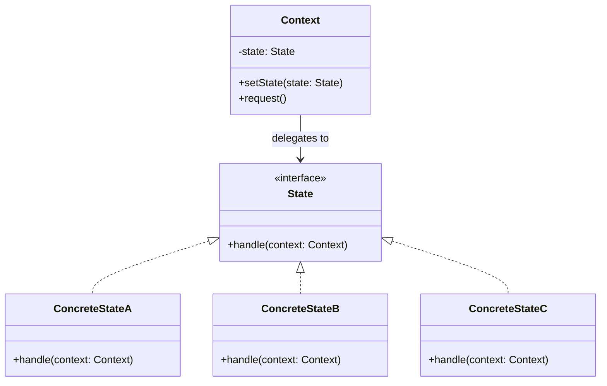

# State Pattern

## Introduction

The **State** pattern is a behavioral design pattern that allows an object to alter its behavior when its internal state changes. The object will appear to change its class. Instead of using large conditional blocks (`if/else` or `switch`) to manage state-dependent behavior, the pattern delegates behavior to state objects, each encapsulating the rules for a specific state.

In enterprise software, the State pattern is foundational for workflow engines, order processing pipelines, approval chains, and protocol handlers. It models finite state machines in an object-oriented way, making transitions explicit and state-specific logic isolated and testable.

## Intent

- Allow an object to alter its behavior when its internal state changes, making the object appear to change its class.
- Encapsulate state-specific behavior into separate classes and delegate to the current state object.
- Make state transitions explicit rather than burying them in conditional logic.

## Class Diagram



## Key Characteristics

- **Eliminates conditional complexity**: Replaces sprawling `if/else` or `switch` blocks with polymorphic state objects
- **Single Responsibility**: Each state class handles only its own behavior and transitions
- **Open/Closed Principle**: New states can be added without modifying existing state classes or the context
- **Explicit transitions**: State changes are visible and traceable, easing debugging and auditing
- **State-specific behavior encapsulation**: Each state knows what actions are valid and what the next state should be
- **Can increase class count**: Each state becomes its own class, which is worthwhile for complex state machines but overkill for trivial ones

---

## Example 1: Fintech — Loan Application Processing Pipeline

**Problem:** A lending platform processes loan applications through multiple stages: Draft, Submitted, UnderReview, Approved, Rejected, and Disbursed. Each stage has different allowed actions — a Draft can be submitted but not disbursed; an Approved loan can be disbursed but not re-submitted. Using conditionals for every action at every stage creates an unmaintainable tangle of logic that grows with each new state.

**Solution:** A State pattern where `LoanApplication` is the Context and each processing stage is a concrete State. Each state defines which actions are valid and handles transitions to the next appropriate state.

```python
from abc import ABC, abstractmethod
from dataclasses import dataclass, field
from datetime import datetime
from typing import Optional


class LoanState(ABC):
    @abstractmethod
    def submit(self, app: "LoanApplication") -> None: ...

    @abstractmethod
    def review(self, app: "LoanApplication") -> None: ...

    @abstractmethod
    def approve(self, app: "LoanApplication") -> None: ...

    @abstractmethod
    def reject(self, app: "LoanApplication") -> None: ...

    @abstractmethod
    def disburse(self, app: "LoanApplication") -> None: ...


class DraftState(LoanState):
    def submit(self, app):
        print(f"Loan {app.loan_id}: Submitted for review.")
        app.set_state(SubmittedState())

    def review(self, app):  raise Exception("Cannot review a draft.")
    def approve(self, app): raise Exception("Cannot approve a draft.")
    def reject(self, app):  raise Exception("Cannot reject a draft.")
    def disburse(self, app): raise Exception("Cannot disburse a draft.")


class SubmittedState(LoanState):
    def review(self, app):
        print(f"Loan {app.loan_id}: Under review by underwriter.")
        app.set_state(UnderReviewState())

    def submit(self, app):  raise Exception("Already submitted.")
    def approve(self, app): raise Exception("Must be under review first.")
    def reject(self, app):  raise Exception("Must be under review first.")
    def disburse(self, app): raise Exception("Cannot disburse before approval.")


class UnderReviewState(LoanState):
    def approve(self, app):
        print(f"Loan {app.loan_id}: Approved!")
        app.set_state(ApprovedState())

    def reject(self, app):
        print(f"Loan {app.loan_id}: Rejected.")
        app.set_state(RejectedState())

    def submit(self, app):  raise Exception("Already under review.")
    def review(self, app):  raise Exception("Already under review.")
    def disburse(self, app): raise Exception("Not yet approved.")


class ApprovedState(LoanState):
    def disburse(self, app):
        print(f"Loan {app.loan_id}: Funds disbursed. Amount: ${app.amount:,.2f}")
        app.set_state(DisbursedState())

    def submit(self, app):  raise Exception("Loan already approved.")
    def review(self, app):  raise Exception("Loan already approved.")
    def approve(self, app): raise Exception("Already approved.")
    def reject(self, app):  raise Exception("Cannot reject after approval.")


class RejectedState(LoanState):
    def submit(self, app):  raise Exception("Loan was rejected. Start a new application.")
    def review(self, app):  raise Exception("Loan was rejected.")
    def approve(self, app): raise Exception("Loan was rejected.")
    def reject(self, app):  raise Exception("Already rejected.")
    def disburse(self, app): raise Exception("Cannot disburse a rejected loan.")


class DisbursedState(LoanState):
    def submit(self, app):  raise Exception("Loan already disbursed.")
    def review(self, app):  raise Exception("Loan already disbursed.")
    def approve(self, app): raise Exception("Loan already disbursed.")
    def reject(self, app):  raise Exception("Loan already disbursed.")
    def disburse(self, app): raise Exception("Already disbursed.")


@dataclass
class LoanApplication:
    loan_id: str
    amount: float
    _state: LoanState = field(default_factory=DraftState)

    def set_state(self, state: LoanState):
        self._state = state

    def submit(self):   self._state.submit(self)
    def review(self):   self._state.review(self)
    def approve(self):  self._state.approve(self)
    def reject(self):   self._state.reject(self)
    def disburse(self): self._state.disburse(self)


# Usage
app = LoanApplication("LOAN-2024-001", 50_000.00)
app.submit()    # Submitted for review
app.review()    # Under review
app.approve()   # Approved!
app.disburse()  # Funds disbursed
```

```go
package main

import "fmt"

// State interface
type LoanState interface {
	Submit(app *LoanApplication)
	Review(app *LoanApplication)
	Approve(app *LoanApplication)
	Reject(app *LoanApplication)
	Disburse(app *LoanApplication)
}

// Context
type LoanApplication struct {
	LoanID string
	Amount float64
	state  LoanState
}

func NewLoanApplication(id string, amount float64) *LoanApplication {
	app := &LoanApplication{LoanID: id, Amount: amount}
	app.state = &DraftState{}
	return app
}

func (a *LoanApplication) SetState(s LoanState) { a.state = s }
func (a *LoanApplication) Submit()               { a.state.Submit(a) }
func (a *LoanApplication) Review()               { a.state.Review(a) }
func (a *LoanApplication) Approve()              { a.state.Approve(a) }
func (a *LoanApplication) Reject()               { a.state.Reject(a) }
func (a *LoanApplication) Disburse()             { a.state.Disburse(a) }

// Draft
type DraftState struct{}

func (s *DraftState) Submit(app *LoanApplication) {
	fmt.Printf("Loan %s: Submitted for review.\n", app.LoanID)
	app.SetState(&SubmittedState{})
}
func (s *DraftState) Review(app *LoanApplication)   { panic("Cannot review a draft.") }
func (s *DraftState) Approve(app *LoanApplication)  { panic("Cannot approve a draft.") }
func (s *DraftState) Reject(app *LoanApplication)   { panic("Cannot reject a draft.") }
func (s *DraftState) Disburse(app *LoanApplication) { panic("Cannot disburse a draft.") }

// Submitted
type SubmittedState struct{}

func (s *SubmittedState) Review(app *LoanApplication) {
	fmt.Printf("Loan %s: Under review by underwriter.\n", app.LoanID)
	app.SetState(&UnderReviewState{})
}
func (s *SubmittedState) Submit(app *LoanApplication)   { panic("Already submitted.") }
func (s *SubmittedState) Approve(app *LoanApplication)  { panic("Must be under review first.") }
func (s *SubmittedState) Reject(app *LoanApplication)   { panic("Must be under review first.") }
func (s *SubmittedState) Disburse(app *LoanApplication) { panic("Cannot disburse before approval.") }

// UnderReview
type UnderReviewState struct{}

func (s *UnderReviewState) Approve(app *LoanApplication) {
	fmt.Printf("Loan %s: Approved!\n", app.LoanID)
	app.SetState(&ApprovedState{})
}
func (s *UnderReviewState) Reject(app *LoanApplication) {
	fmt.Printf("Loan %s: Rejected.\n", app.LoanID)
	app.SetState(&RejectedState{})
}
func (s *UnderReviewState) Submit(app *LoanApplication)   { panic("Already under review.") }
func (s *UnderReviewState) Review(app *LoanApplication)   { panic("Already under review.") }
func (s *UnderReviewState) Disburse(app *LoanApplication) { panic("Not yet approved.") }

// Approved
type ApprovedState struct{}

func (s *ApprovedState) Disburse(app *LoanApplication) {
	fmt.Printf("Loan %s: Funds disbursed. Amount: $%.2f\n", app.LoanID, app.Amount)
	app.SetState(&DisbursedState{})
}
func (s *ApprovedState) Submit(app *LoanApplication)  { panic("Already approved.") }
func (s *ApprovedState) Review(app *LoanApplication)  { panic("Already approved.") }
func (s *ApprovedState) Approve(app *LoanApplication) { panic("Already approved.") }
func (s *ApprovedState) Reject(app *LoanApplication)  { panic("Cannot reject after approval.") }

// Rejected & Disbursed omitted for brevity — follow same pattern

type RejectedState struct{}

func (s *RejectedState) Submit(app *LoanApplication)   { panic("Rejected.") }
func (s *RejectedState) Review(app *LoanApplication)   { panic("Rejected.") }
func (s *RejectedState) Approve(app *LoanApplication)  { panic("Rejected.") }
func (s *RejectedState) Reject(app *LoanApplication)   { panic("Already rejected.") }
func (s *RejectedState) Disburse(app *LoanApplication) { panic("Rejected.") }

type DisbursedState struct{}

func (s *DisbursedState) Submit(app *LoanApplication)   { panic("Disbursed.") }
func (s *DisbursedState) Review(app *LoanApplication)   { panic("Disbursed.") }
func (s *DisbursedState) Approve(app *LoanApplication)  { panic("Disbursed.") }
func (s *DisbursedState) Reject(app *LoanApplication)   { panic("Disbursed.") }
func (s *DisbursedState) Disburse(app *LoanApplication) { panic("Already disbursed.") }

func main() {
	app := NewLoanApplication("LOAN-2024-001", 50000.00)
	app.Submit()
	app.Review()
	app.Approve()
	app.Disburse()
}
```

```java
// State interface
interface LoanState {
    void submit(LoanApplication app);
    void review(LoanApplication app);
    void approve(LoanApplication app);
    void reject(LoanApplication app);
    void disburse(LoanApplication app);
}

// Context
class LoanApplication {
    private String loanId;
    private double amount;
    private LoanState state;

    public LoanApplication(String loanId, double amount) {
        this.loanId = loanId;
        this.amount = amount;
        this.state = new DraftState();
    }

    void setState(LoanState state) { this.state = state; }
    String getLoanId() { return loanId; }
    double getAmount() { return amount; }

    public void submit()  { state.submit(this); }
    public void review()  { state.review(this); }
    public void approve() { state.approve(this); }
    public void reject()  { state.reject(this); }
    public void disburse(){ state.disburse(this); }
}

class DraftState implements LoanState {
    public void submit(LoanApplication app) {
        System.out.printf("Loan %s: Submitted for review.%n", app.getLoanId());
        app.setState(new SubmittedState());
    }
    public void review(LoanApplication app)  { throw new IllegalStateException("Cannot review a draft."); }
    public void approve(LoanApplication app) { throw new IllegalStateException("Cannot approve a draft."); }
    public void reject(LoanApplication app)  { throw new IllegalStateException("Cannot reject a draft."); }
    public void disburse(LoanApplication app){ throw new IllegalStateException("Cannot disburse a draft."); }
}

class SubmittedState implements LoanState {
    public void review(LoanApplication app) {
        System.out.printf("Loan %s: Under review.%n", app.getLoanId());
        app.setState(new UnderReviewState());
    }
    public void submit(LoanApplication app)  { throw new IllegalStateException("Already submitted."); }
    public void approve(LoanApplication app) { throw new IllegalStateException("Must be under review first."); }
    public void reject(LoanApplication app)  { throw new IllegalStateException("Must be under review first."); }
    public void disburse(LoanApplication app){ throw new IllegalStateException("Not approved yet."); }
}

class UnderReviewState implements LoanState {
    public void approve(LoanApplication app) {
        System.out.printf("Loan %s: Approved!%n", app.getLoanId());
        app.setState(new ApprovedState());
    }
    public void reject(LoanApplication app) {
        System.out.printf("Loan %s: Rejected.%n", app.getLoanId());
        app.setState(new RejectedState());
    }
    public void submit(LoanApplication app)  { throw new IllegalStateException("Already under review."); }
    public void review(LoanApplication app)  { throw new IllegalStateException("Already under review."); }
    public void disburse(LoanApplication app){ throw new IllegalStateException("Not yet approved."); }
}

class ApprovedState implements LoanState {
    public void disburse(LoanApplication app) {
        System.out.printf("Loan %s: Funds disbursed. Amount: $%.2f%n", app.getLoanId(), app.getAmount());
        app.setState(new DisbursedState());
    }
    public void submit(LoanApplication app)  { throw new IllegalStateException("Already approved."); }
    public void review(LoanApplication app)  { throw new IllegalStateException("Already approved."); }
    public void approve(LoanApplication app) { throw new IllegalStateException("Already approved."); }
    public void reject(LoanApplication app)  { throw new IllegalStateException("Cannot reject after approval."); }
}

class RejectedState implements LoanState {
    public void submit(LoanApplication app)  { throw new IllegalStateException("Rejected."); }
    public void review(LoanApplication app)  { throw new IllegalStateException("Rejected."); }
    public void approve(LoanApplication app) { throw new IllegalStateException("Rejected."); }
    public void reject(LoanApplication app)  { throw new IllegalStateException("Already rejected."); }
    public void disburse(LoanApplication app){ throw new IllegalStateException("Rejected."); }
}

class DisbursedState implements LoanState {
    public void submit(LoanApplication app)  { throw new IllegalStateException("Disbursed."); }
    public void review(LoanApplication app)  { throw new IllegalStateException("Disbursed."); }
    public void approve(LoanApplication app) { throw new IllegalStateException("Disbursed."); }
    public void reject(LoanApplication app)  { throw new IllegalStateException("Disbursed."); }
    public void disburse(LoanApplication app){ throw new IllegalStateException("Already disbursed."); }
}
```

```typescript
// State interface
interface LoanState {
  submit(app: LoanApplication): void;
  review(app: LoanApplication): void;
  approve(app: LoanApplication): void;
  reject(app: LoanApplication): void;
  disburse(app: LoanApplication): void;
}

// Context
class LoanApplication {
  private state: LoanState;

  constructor(public readonly loanId: string, public readonly amount: number) {
    this.state = new DraftState();
  }

  setState(state: LoanState) {
    this.state = state;
  }
  submit() {
    this.state.submit(this);
  }
  review() {
    this.state.review(this);
  }
  approve() {
    this.state.approve(this);
  }
  reject() {
    this.state.reject(this);
  }
  disburse() {
    this.state.disburse(this);
  }
}

class DraftState implements LoanState {
  submit(app: LoanApplication) {
    console.log(`Loan ${app.loanId}: Submitted for review.`);
    app.setState(new SubmittedState());
  }
  review(app: LoanApplication) {
    throw new Error("Cannot review a draft.");
  }
  approve(app: LoanApplication) {
    throw new Error("Cannot approve a draft.");
  }
  reject(app: LoanApplication) {
    throw new Error("Cannot reject a draft.");
  }
  disburse(app: LoanApplication) {
    throw new Error("Cannot disburse a draft.");
  }
}

class SubmittedState implements LoanState {
  review(app: LoanApplication) {
    console.log(`Loan ${app.loanId}: Under review.`);
    app.setState(new UnderReviewState());
  }
  submit(app: LoanApplication) {
    throw new Error("Already submitted.");
  }
  approve(app: LoanApplication) {
    throw new Error("Must be under review first.");
  }
  reject(app: LoanApplication) {
    throw new Error("Must be under review first.");
  }
  disburse(app: LoanApplication) {
    throw new Error("Not approved yet.");
  }
}

class UnderReviewState implements LoanState {
  approve(app: LoanApplication) {
    console.log(`Loan ${app.loanId}: Approved!`);
    app.setState(new ApprovedState());
  }
  reject(app: LoanApplication) {
    console.log(`Loan ${app.loanId}: Rejected.`);
    app.setState(new RejectedState());
  }
  submit(app: LoanApplication) {
    throw new Error("Already under review.");
  }
  review(app: LoanApplication) {
    throw new Error("Already under review.");
  }
  disburse(app: LoanApplication) {
    throw new Error("Not yet approved.");
  }
}

class ApprovedState implements LoanState {
  disburse(app: LoanApplication) {
    console.log(
      `Loan ${app.loanId}: Funds disbursed. Amount: $${app.amount.toFixed(2)}`,
    );
    app.setState(new DisbursedState());
  }
  submit(app: LoanApplication) {
    throw new Error("Already approved.");
  }
  review(app: LoanApplication) {
    throw new Error("Already approved.");
  }
  approve(app: LoanApplication) {
    throw new Error("Already approved.");
  }
  reject(app: LoanApplication) {
    throw new Error("Cannot reject after approval.");
  }
}

class RejectedState implements LoanState {
  submit(app: LoanApplication) {
    throw new Error("Rejected.");
  }
  review(app: LoanApplication) {
    throw new Error("Rejected.");
  }
  approve(app: LoanApplication) {
    throw new Error("Rejected.");
  }
  reject(app: LoanApplication) {
    throw new Error("Already rejected.");
  }
  disburse(app: LoanApplication) {
    throw new Error("Rejected.");
  }
}

class DisbursedState implements LoanState {
  submit(app: LoanApplication) {
    throw new Error("Disbursed.");
  }
  review(app: LoanApplication) {
    throw new Error("Disbursed.");
  }
  approve(app: LoanApplication) {
    throw new Error("Disbursed.");
  }
  reject(app: LoanApplication) {
    throw new Error("Disbursed.");
  }
  disburse(app: LoanApplication) {
    throw new Error("Already disbursed.");
  }
}

// Usage
const app = new LoanApplication("LOAN-2024-001", 50000);
app.submit();
app.review();
app.approve();
app.disburse();
```

```rust
use std::fmt;

trait LoanState: fmt::Debug {
    fn submit(self: Box<Self>, app: &mut LoanApplication) -> Box<dyn LoanState>;
    fn review(self: Box<Self>, app: &mut LoanApplication) -> Box<dyn LoanState>;
    fn approve(self: Box<Self>, app: &mut LoanApplication) -> Box<dyn LoanState>;
    fn reject(self: Box<Self>, app: &mut LoanApplication) -> Box<dyn LoanState>;
    fn disburse(self: Box<Self>, app: &mut LoanApplication) -> Box<dyn LoanState>;
}

struct LoanApplication {
    loan_id: String,
    amount: f64,
    state: Option<Box<dyn LoanState>>,
}

impl LoanApplication {
    fn new(loan_id: &str, amount: f64) -> Self {
        Self {
            loan_id: loan_id.to_string(),
            amount,
            state: Some(Box::new(Draft)),
        }
    }

    fn submit(&mut self) {
        if let Some(s) = self.state.take() {
            self.state = Some(s.submit(self));
        }
    }

    fn review(&mut self) {
        if let Some(s) = self.state.take() {
            self.state = Some(s.review(self));
        }
    }

    fn approve(&mut self) {
        if let Some(s) = self.state.take() {
            self.state = Some(s.approve(self));
        }
    }

    fn reject(&mut self) {
        if let Some(s) = self.state.take() {
            self.state = Some(s.reject(self));
        }
    }

    fn disburse(&mut self) {
        if let Some(s) = self.state.take() {
            self.state = Some(s.disburse(self));
        }
    }
}

#[derive(Debug)]
struct Draft;
#[derive(Debug)]
struct Submitted;
#[derive(Debug)]
struct UnderReview;
#[derive(Debug)]
struct Approved;
#[derive(Debug)]
struct Rejected;
#[derive(Debug)]
struct Disbursed;

impl LoanState for Draft {
    fn submit(self: Box<Self>, app: &mut LoanApplication) -> Box<dyn LoanState> {
        println!("Loan {}: Submitted for review.", app.loan_id);
        Box::new(Submitted)
    }
    fn review(self: Box<Self>, _: &mut LoanApplication) -> Box<dyn LoanState> { panic!("Cannot review a draft.") }
    fn approve(self: Box<Self>, _: &mut LoanApplication) -> Box<dyn LoanState> { panic!("Cannot approve a draft.") }
    fn reject(self: Box<Self>, _: &mut LoanApplication) -> Box<dyn LoanState> { panic!("Cannot reject a draft.") }
    fn disburse(self: Box<Self>, _: &mut LoanApplication) -> Box<dyn LoanState> { panic!("Cannot disburse a draft.") }
}

impl LoanState for Submitted {
    fn review(self: Box<Self>, app: &mut LoanApplication) -> Box<dyn LoanState> {
        println!("Loan {}: Under review.", app.loan_id);
        Box::new(UnderReview)
    }
    fn submit(self: Box<Self>, _: &mut LoanApplication) -> Box<dyn LoanState> { panic!("Already submitted.") }
    fn approve(self: Box<Self>, _: &mut LoanApplication) -> Box<dyn LoanState> { panic!("Must review first.") }
    fn reject(self: Box<Self>, _: &mut LoanApplication) -> Box<dyn LoanState> { panic!("Must review first.") }
    fn disburse(self: Box<Self>, _: &mut LoanApplication) -> Box<dyn LoanState> { panic!("Not approved.") }
}

impl LoanState for UnderReview {
    fn approve(self: Box<Self>, app: &mut LoanApplication) -> Box<dyn LoanState> {
        println!("Loan {}: Approved!", app.loan_id);
        Box::new(Approved)
    }
    fn reject(self: Box<Self>, app: &mut LoanApplication) -> Box<dyn LoanState> {
        println!("Loan {}: Rejected.", app.loan_id);
        Box::new(Rejected)
    }
    fn submit(self: Box<Self>, _: &mut LoanApplication) -> Box<dyn LoanState> { panic!("Under review.") }
    fn review(self: Box<Self>, _: &mut LoanApplication) -> Box<dyn LoanState> { panic!("Under review.") }
    fn disburse(self: Box<Self>, _: &mut LoanApplication) -> Box<dyn LoanState> { panic!("Not approved.") }
}

impl LoanState for Approved {
    fn disburse(self: Box<Self>, app: &mut LoanApplication) -> Box<dyn LoanState> {
        println!("Loan {}: Funds disbursed. Amount: ${:.2}", app.loan_id, app.amount);
        Box::new(Disbursed)
    }
    fn submit(self: Box<Self>, _: &mut LoanApplication) -> Box<dyn LoanState> { panic!("Approved.") }
    fn review(self: Box<Self>, _: &mut LoanApplication) -> Box<dyn LoanState> { panic!("Approved.") }
    fn approve(self: Box<Self>, _: &mut LoanApplication) -> Box<dyn LoanState> { panic!("Already approved.") }
    fn reject(self: Box<Self>, _: &mut LoanApplication) -> Box<dyn LoanState> { panic!("Cannot reject.") }
}

impl LoanState for Rejected {
    fn submit(self: Box<Self>, _: &mut LoanApplication) -> Box<dyn LoanState> { panic!("Rejected.") }
    fn review(self: Box<Self>, _: &mut LoanApplication) -> Box<dyn LoanState> { panic!("Rejected.") }
    fn approve(self: Box<Self>, _: &mut LoanApplication) -> Box<dyn LoanState> { panic!("Rejected.") }
    fn reject(self: Box<Self>, _: &mut LoanApplication) -> Box<dyn LoanState> { panic!("Already rejected.") }
    fn disburse(self: Box<Self>, _: &mut LoanApplication) -> Box<dyn LoanState> { panic!("Rejected.") }
}

impl LoanState for Disbursed {
    fn submit(self: Box<Self>, _: &mut LoanApplication) -> Box<dyn LoanState> { panic!("Disbursed.") }
    fn review(self: Box<Self>, _: &mut LoanApplication) -> Box<dyn LoanState> { panic!("Disbursed.") }
    fn approve(self: Box<Self>, _: &mut LoanApplication) -> Box<dyn LoanState> { panic!("Disbursed.") }
    fn reject(self: Box<Self>, _: &mut LoanApplication) -> Box<dyn LoanState> { panic!("Disbursed.") }
    fn disburse(self: Box<Self>, _: &mut LoanApplication) -> Box<dyn LoanState> { panic!("Already disbursed.") }
}

fn main() {
    let mut app = LoanApplication::new("LOAN-2024-001", 50000.0);
    app.submit();
    app.review();
    app.approve();
    app.disburse();
}
```

---

## Example 2: Healthcare — Patient Visit Workflow

**Problem:** A hospital's patient visit system moves through states: CheckedIn, Triaged, InConsultation, AwaitingLab, Diagnosed, and Discharged. At each stage different actions are valid — a CheckedIn patient must be triaged before consultation; lab results can only be recorded during AwaitingLab. Hard-coding all transitions into a monolithic class leads to a fragile, error-prone codebase that's difficult to audit for compliance.

**Solution:** Model each visit state as a separate class. The `PatientVisit` context delegates actions to its current state, which validates the action and transitions to the next state.

```python
from abc import ABC, abstractmethod
from datetime import datetime


class VisitState(ABC):
    @abstractmethod
    def triage(self, visit: "PatientVisit") -> None: ...

    @abstractmethod
    def start_consultation(self, visit: "PatientVisit") -> None: ...

    @abstractmethod
    def order_labs(self, visit: "PatientVisit") -> None: ...

    @abstractmethod
    def record_results(self, visit: "PatientVisit") -> None: ...

    @abstractmethod
    def diagnose(self, visit: "PatientVisit") -> None: ...

    @abstractmethod
    def discharge(self, visit: "PatientVisit") -> None: ...


class CheckedInState(VisitState):
    def triage(self, visit):
        print(f"Visit {visit.visit_id}: Patient triaged. Severity assessed.")
        visit.set_state(TriagedState())

    def start_consultation(self, visit): raise Exception("Must triage first.")
    def order_labs(self, visit):         raise Exception("Must triage first.")
    def record_results(self, visit):     raise Exception("No labs ordered.")
    def diagnose(self, visit):           raise Exception("Must triage first.")
    def discharge(self, visit):          raise Exception("Must complete visit.")


class TriagedState(VisitState):
    def start_consultation(self, visit):
        print(f"Visit {visit.visit_id}: Consultation started with Dr. {visit.doctor}.")
        visit.set_state(InConsultationState())

    def triage(self, visit):         raise Exception("Already triaged.")
    def order_labs(self, visit):     raise Exception("Must be in consultation.")
    def record_results(self, visit): raise Exception("No labs ordered.")
    def diagnose(self, visit):       raise Exception("Must consult first.")
    def discharge(self, visit):      raise Exception("Must complete consultation.")


class InConsultationState(VisitState):
    def order_labs(self, visit):
        print(f"Visit {visit.visit_id}: Labs ordered.")
        visit.set_state(AwaitingLabState())

    def diagnose(self, visit):
        print(f"Visit {visit.visit_id}: Diagnosis recorded.")
        visit.set_state(DiagnosedState())

    def triage(self, visit):             raise Exception("Already in consultation.")
    def start_consultation(self, visit): raise Exception("Already in consultation.")
    def record_results(self, visit):     raise Exception("No labs ordered yet.")
    def discharge(self, visit):          raise Exception("Must diagnose first.")


class AwaitingLabState(VisitState):
    def record_results(self, visit):
        print(f"Visit {visit.visit_id}: Lab results received.")
        visit.set_state(InConsultationState())

    def triage(self, visit):             raise Exception("Awaiting labs.")
    def start_consultation(self, visit): raise Exception("Awaiting labs.")
    def order_labs(self, visit):         raise Exception("Labs already ordered.")
    def diagnose(self, visit):           raise Exception("Waiting for lab results.")
    def discharge(self, visit):          raise Exception("Waiting for lab results.")


class DiagnosedState(VisitState):
    def discharge(self, visit):
        print(f"Visit {visit.visit_id}: Patient discharged at {datetime.now():%H:%M}.")
        visit.set_state(DischargedState())

    def triage(self, visit):             raise Exception("Already diagnosed.")
    def start_consultation(self, visit): raise Exception("Already diagnosed.")
    def order_labs(self, visit):         raise Exception("Already diagnosed.")
    def record_results(self, visit):     raise Exception("Already diagnosed.")
    def diagnose(self, visit):           raise Exception("Already diagnosed.")


class DischargedState(VisitState):
    def triage(self, visit):             raise Exception("Visit complete.")
    def start_consultation(self, visit): raise Exception("Visit complete.")
    def order_labs(self, visit):         raise Exception("Visit complete.")
    def record_results(self, visit):     raise Exception("Visit complete.")
    def diagnose(self, visit):           raise Exception("Visit complete.")
    def discharge(self, visit):          raise Exception("Already discharged.")


class PatientVisit:
    def __init__(self, visit_id: str, patient: str, doctor: str):
        self.visit_id = visit_id
        self.patient = patient
        self.doctor = doctor
        self._state: VisitState = CheckedInState()

    def set_state(self, state: VisitState):
        self._state = state

    def triage(self):             self._state.triage(self)
    def start_consultation(self): self._state.start_consultation(self)
    def order_labs(self):         self._state.order_labs(self)
    def record_results(self):    self._state.record_results(self)
    def diagnose(self):           self._state.diagnose(self)
    def discharge(self):          self._state.discharge(self)


# Usage
visit = PatientVisit("V-10042", "Jane Doe", "Smith")
visit.triage()
visit.start_consultation()
visit.order_labs()
visit.record_results()
visit.diagnose()
visit.discharge()
```

```go
package main

import "fmt"

type VisitState interface {
	Triage(v *PatientVisit)
	StartConsultation(v *PatientVisit)
	OrderLabs(v *PatientVisit)
	RecordResults(v *PatientVisit)
	Diagnose(v *PatientVisit)
	Discharge(v *PatientVisit)
}

type PatientVisit struct {
	VisitID string
	Patient string
	Doctor  string
	state   VisitState
}

func NewPatientVisit(id, patient, doctor string) *PatientVisit {
	return &PatientVisit{VisitID: id, Patient: patient, Doctor: doctor, state: &CheckedIn{}}
}

func (v *PatientVisit) SetState(s VisitState)  { v.state = s }
func (v *PatientVisit) Triage()                { v.state.Triage(v) }
func (v *PatientVisit) StartConsultation()     { v.state.StartConsultation(v) }
func (v *PatientVisit) OrderLabs()             { v.state.OrderLabs(v) }
func (v *PatientVisit) RecordResults()         { v.state.RecordResults(v) }
func (v *PatientVisit) Diagnose()              { v.state.Diagnose(v) }
func (v *PatientVisit) Discharge()             { v.state.Discharge(v) }

type CheckedIn struct{}

func (s *CheckedIn) Triage(v *PatientVisit) {
	fmt.Printf("Visit %s: Patient triaged.\n", v.VisitID)
	v.SetState(&Triaged{})
}
func (s *CheckedIn) StartConsultation(v *PatientVisit) { panic("Must triage first.") }
func (s *CheckedIn) OrderLabs(v *PatientVisit)         { panic("Must triage first.") }
func (s *CheckedIn) RecordResults(v *PatientVisit)     { panic("No labs ordered.") }
func (s *CheckedIn) Diagnose(v *PatientVisit)          { panic("Must triage first.") }
func (s *CheckedIn) Discharge(v *PatientVisit)         { panic("Must complete visit.") }

type Triaged struct{}

func (s *Triaged) StartConsultation(v *PatientVisit) {
	fmt.Printf("Visit %s: Consultation started with Dr. %s.\n", v.VisitID, v.Doctor)
	v.SetState(&InConsultation{})
}
func (s *Triaged) Triage(v *PatientVisit)        { panic("Already triaged.") }
func (s *Triaged) OrderLabs(v *PatientVisit)     { panic("Must be in consultation.") }
func (s *Triaged) RecordResults(v *PatientVisit) { panic("No labs ordered.") }
func (s *Triaged) Diagnose(v *PatientVisit)      { panic("Must consult first.") }
func (s *Triaged) Discharge(v *PatientVisit)     { panic("Must complete consultation.") }

type InConsultation struct{}

func (s *InConsultation) OrderLabs(v *PatientVisit) {
	fmt.Printf("Visit %s: Labs ordered.\n", v.VisitID)
	v.SetState(&AwaitingLab{})
}
func (s *InConsultation) Diagnose(v *PatientVisit) {
	fmt.Printf("Visit %s: Diagnosis recorded.\n", v.VisitID)
	v.SetState(&Diagnosed{})
}
func (s *InConsultation) Triage(v *PatientVisit)            { panic("In consultation.") }
func (s *InConsultation) StartConsultation(v *PatientVisit) { panic("In consultation.") }
func (s *InConsultation) RecordResults(v *PatientVisit)     { panic("No labs ordered.") }
func (s *InConsultation) Discharge(v *PatientVisit)         { panic("Must diagnose.") }

type AwaitingLab struct{}

func (s *AwaitingLab) RecordResults(v *PatientVisit) {
	fmt.Printf("Visit %s: Lab results received.\n", v.VisitID)
	v.SetState(&InConsultation{})
}
func (s *AwaitingLab) Triage(v *PatientVisit)            { panic("Awaiting labs.") }
func (s *AwaitingLab) StartConsultation(v *PatientVisit) { panic("Awaiting labs.") }
func (s *AwaitingLab) OrderLabs(v *PatientVisit)         { panic("Already ordered.") }
func (s *AwaitingLab) Diagnose(v *PatientVisit)          { panic("Waiting for results.") }
func (s *AwaitingLab) Discharge(v *PatientVisit)         { panic("Waiting for results.") }

type Diagnosed struct{}

func (s *Diagnosed) Discharge(v *PatientVisit) {
	fmt.Printf("Visit %s: Patient discharged.\n", v.VisitID)
	v.SetState(&Discharged{})
}
func (s *Diagnosed) Triage(v *PatientVisit)            { panic("Already diagnosed.") }
func (s *Diagnosed) StartConsultation(v *PatientVisit) { panic("Already diagnosed.") }
func (s *Diagnosed) OrderLabs(v *PatientVisit)         { panic("Already diagnosed.") }
func (s *Diagnosed) RecordResults(v *PatientVisit)     { panic("Already diagnosed.") }
func (s *Diagnosed) Diagnose(v *PatientVisit)          { panic("Already diagnosed.") }

type Discharged struct{}

func (s *Discharged) Triage(v *PatientVisit)            { panic("Visit complete.") }
func (s *Discharged) StartConsultation(v *PatientVisit) { panic("Visit complete.") }
func (s *Discharged) OrderLabs(v *PatientVisit)         { panic("Visit complete.") }
func (s *Discharged) RecordResults(v *PatientVisit)     { panic("Visit complete.") }
func (s *Discharged) Diagnose(v *PatientVisit)          { panic("Visit complete.") }
func (s *Discharged) Discharge(v *PatientVisit)         { panic("Already discharged.") }

func main() {
	v := NewPatientVisit("V-10042", "Jane Doe", "Smith")
	v.Triage()
	v.StartConsultation()
	v.OrderLabs()
	v.RecordResults()
	v.Diagnose()
	v.Discharge()
}
```

```java
interface VisitState {
    void triage(PatientVisit v);
    void startConsultation(PatientVisit v);
    void orderLabs(PatientVisit v);
    void recordResults(PatientVisit v);
    void diagnose(PatientVisit v);
    void discharge(PatientVisit v);
}

class PatientVisit {
    private final String visitId;
    private final String patient;
    private final String doctor;
    private VisitState state;

    public PatientVisit(String visitId, String patient, String doctor) {
        this.visitId = visitId;
        this.patient = patient;
        this.doctor = doctor;
        this.state = new CheckedInState();
    }

    void setState(VisitState s) { this.state = s; }
    String getVisitId() { return visitId; }
    String getDoctor()  { return doctor; }

    public void triage()            { state.triage(this); }
    public void startConsultation() { state.startConsultation(this); }
    public void orderLabs()         { state.orderLabs(this); }
    public void recordResults()     { state.recordResults(this); }
    public void diagnose()          { state.diagnose(this); }
    public void discharge()         { state.discharge(this); }
}

class CheckedInState implements VisitState {
    public void triage(PatientVisit v) {
        System.out.printf("Visit %s: Patient triaged.%n", v.getVisitId());
        v.setState(new TriagedState());
    }
    public void startConsultation(PatientVisit v) { throw new IllegalStateException("Must triage first."); }
    public void orderLabs(PatientVisit v)         { throw new IllegalStateException("Must triage first."); }
    public void recordResults(PatientVisit v)     { throw new IllegalStateException("No labs ordered."); }
    public void diagnose(PatientVisit v)          { throw new IllegalStateException("Must triage first."); }
    public void discharge(PatientVisit v)         { throw new IllegalStateException("Must complete visit."); }
}

class TriagedState implements VisitState {
    public void startConsultation(PatientVisit v) {
        System.out.printf("Visit %s: Consultation started with Dr. %s.%n", v.getVisitId(), v.getDoctor());
        v.setState(new InConsultationState());
    }
    public void triage(PatientVisit v)        { throw new IllegalStateException("Already triaged."); }
    public void orderLabs(PatientVisit v)     { throw new IllegalStateException("Must be in consultation."); }
    public void recordResults(PatientVisit v) { throw new IllegalStateException("No labs ordered."); }
    public void diagnose(PatientVisit v)      { throw new IllegalStateException("Must consult first."); }
    public void discharge(PatientVisit v)     { throw new IllegalStateException("Must complete consultation."); }
}

class InConsultationState implements VisitState {
    public void orderLabs(PatientVisit v) {
        System.out.printf("Visit %s: Labs ordered.%n", v.getVisitId());
        v.setState(new AwaitingLabState());
    }
    public void diagnose(PatientVisit v) {
        System.out.printf("Visit %s: Diagnosis recorded.%n", v.getVisitId());
        v.setState(new DiagnosedState());
    }
    public void triage(PatientVisit v)            { throw new IllegalStateException("In consultation."); }
    public void startConsultation(PatientVisit v) { throw new IllegalStateException("In consultation."); }
    public void recordResults(PatientVisit v)     { throw new IllegalStateException("No labs ordered."); }
    public void discharge(PatientVisit v)         { throw new IllegalStateException("Must diagnose."); }
}

class AwaitingLabState implements VisitState {
    public void recordResults(PatientVisit v) {
        System.out.printf("Visit %s: Lab results received.%n", v.getVisitId());
        v.setState(new InConsultationState());
    }
    public void triage(PatientVisit v)            { throw new IllegalStateException("Awaiting labs."); }
    public void startConsultation(PatientVisit v) { throw new IllegalStateException("Awaiting labs."); }
    public void orderLabs(PatientVisit v)         { throw new IllegalStateException("Already ordered."); }
    public void diagnose(PatientVisit v)          { throw new IllegalStateException("Waiting for results."); }
    public void discharge(PatientVisit v)         { throw new IllegalStateException("Waiting for results."); }
}

class DiagnosedState implements VisitState {
    public void discharge(PatientVisit v) {
        System.out.printf("Visit %s: Patient discharged.%n", v.getVisitId());
        v.setState(new DischargedState());
    }
    public void triage(PatientVisit v)            { throw new IllegalStateException("Already diagnosed."); }
    public void startConsultation(PatientVisit v) { throw new IllegalStateException("Already diagnosed."); }
    public void orderLabs(PatientVisit v)         { throw new IllegalStateException("Already diagnosed."); }
    public void recordResults(PatientVisit v)     { throw new IllegalStateException("Already diagnosed."); }
    public void diagnose(PatientVisit v)          { throw new IllegalStateException("Already diagnosed."); }
}

class DischargedState implements VisitState {
    public void triage(PatientVisit v)            { throw new IllegalStateException("Visit complete."); }
    public void startConsultation(PatientVisit v) { throw new IllegalStateException("Visit complete."); }
    public void orderLabs(PatientVisit v)         { throw new IllegalStateException("Visit complete."); }
    public void recordResults(PatientVisit v)     { throw new IllegalStateException("Visit complete."); }
    public void diagnose(PatientVisit v)          { throw new IllegalStateException("Visit complete."); }
    public void discharge(PatientVisit v)         { throw new IllegalStateException("Already discharged."); }
}
```

```typescript
interface VisitState {
  triage(v: PatientVisit): void;
  startConsultation(v: PatientVisit): void;
  orderLabs(v: PatientVisit): void;
  recordResults(v: PatientVisit): void;
  diagnose(v: PatientVisit): void;
  discharge(v: PatientVisit): void;
}

class PatientVisit {
  private state: VisitState;

  constructor(
    public readonly visitId: string,
    public readonly patient: string,
    public readonly doctor: string,
  ) {
    this.state = new CheckedInState();
  }

  setState(s: VisitState) {
    this.state = s;
  }
  triage() {
    this.state.triage(this);
  }
  startConsultation() {
    this.state.startConsultation(this);
  }
  orderLabs() {
    this.state.orderLabs(this);
  }
  recordResults() {
    this.state.recordResults(this);
  }
  diagnose() {
    this.state.diagnose(this);
  }
  discharge() {
    this.state.discharge(this);
  }
}

class CheckedInState implements VisitState {
  triage(v: PatientVisit) {
    console.log(`Visit ${v.visitId}: Patient triaged.`);
    v.setState(new TriagedState());
  }
  startConsultation(v: PatientVisit) {
    throw new Error("Must triage first.");
  }
  orderLabs(v: PatientVisit) {
    throw new Error("Must triage first.");
  }
  recordResults(v: PatientVisit) {
    throw new Error("No labs ordered.");
  }
  diagnose(v: PatientVisit) {
    throw new Error("Must triage first.");
  }
  discharge(v: PatientVisit) {
    throw new Error("Must complete visit.");
  }
}

class TriagedState implements VisitState {
  startConsultation(v: PatientVisit) {
    console.log(
      `Visit ${v.visitId}: Consultation started with Dr. ${v.doctor}.`,
    );
    v.setState(new InConsultationState());
  }
  triage(v: PatientVisit) {
    throw new Error("Already triaged.");
  }
  orderLabs(v: PatientVisit) {
    throw new Error("Must be in consultation.");
  }
  recordResults(v: PatientVisit) {
    throw new Error("No labs ordered.");
  }
  diagnose(v: PatientVisit) {
    throw new Error("Must consult first.");
  }
  discharge(v: PatientVisit) {
    throw new Error("Must complete consultation.");
  }
}

class InConsultationState implements VisitState {
  orderLabs(v: PatientVisit) {
    console.log(`Visit ${v.visitId}: Labs ordered.`);
    v.setState(new AwaitingLabState());
  }
  diagnose(v: PatientVisit) {
    console.log(`Visit ${v.visitId}: Diagnosis recorded.`);
    v.setState(new DiagnosedState());
  }
  triage(v: PatientVisit) {
    throw new Error("In consultation.");
  }
  startConsultation(v: PatientVisit) {
    throw new Error("In consultation.");
  }
  recordResults(v: PatientVisit) {
    throw new Error("No labs ordered.");
  }
  discharge(v: PatientVisit) {
    throw new Error("Must diagnose.");
  }
}

class AwaitingLabState implements VisitState {
  recordResults(v: PatientVisit) {
    console.log(`Visit ${v.visitId}: Lab results received.`);
    v.setState(new InConsultationState());
  }
  triage(v: PatientVisit) {
    throw new Error("Awaiting labs.");
  }
  startConsultation(v: PatientVisit) {
    throw new Error("Awaiting labs.");
  }
  orderLabs(v: PatientVisit) {
    throw new Error("Already ordered.");
  }
  diagnose(v: PatientVisit) {
    throw new Error("Waiting for results.");
  }
  discharge(v: PatientVisit) {
    throw new Error("Waiting for results.");
  }
}

class DiagnosedState implements VisitState {
  discharge(v: PatientVisit) {
    console.log(`Visit ${v.visitId}: Patient discharged.`);
    v.setState(new DischargedState());
  }
  triage(v: PatientVisit) {
    throw new Error("Already diagnosed.");
  }
  startConsultation(v: PatientVisit) {
    throw new Error("Already diagnosed.");
  }
  orderLabs(v: PatientVisit) {
    throw new Error("Already diagnosed.");
  }
  recordResults(v: PatientVisit) {
    throw new Error("Already diagnosed.");
  }
  diagnose(v: PatientVisit) {
    throw new Error("Already diagnosed.");
  }
}

class DischargedState implements VisitState {
  triage(v: PatientVisit) {
    throw new Error("Visit complete.");
  }
  startConsultation(v: PatientVisit) {
    throw new Error("Visit complete.");
  }
  orderLabs(v: PatientVisit) {
    throw new Error("Visit complete.");
  }
  recordResults(v: PatientVisit) {
    throw new Error("Visit complete.");
  }
  diagnose(v: PatientVisit) {
    throw new Error("Visit complete.");
  }
  discharge(v: PatientVisit) {
    throw new Error("Already discharged.");
  }
}

// Usage
const visit = new PatientVisit("V-10042", "Jane Doe", "Smith");
visit.triage();
visit.startConsultation();
visit.orderLabs();
visit.recordResults();
visit.diagnose();
visit.discharge();
```

```rust
use std::fmt;

trait VisitState: fmt::Debug {
    fn triage(self: Box<Self>, v: &mut PatientVisit) -> Box<dyn VisitState>;
    fn start_consultation(self: Box<Self>, v: &mut PatientVisit) -> Box<dyn VisitState>;
    fn order_labs(self: Box<Self>, v: &mut PatientVisit) -> Box<dyn VisitState>;
    fn record_results(self: Box<Self>, v: &mut PatientVisit) -> Box<dyn VisitState>;
    fn diagnose(self: Box<Self>, v: &mut PatientVisit) -> Box<dyn VisitState>;
    fn discharge(self: Box<Self>, v: &mut PatientVisit) -> Box<dyn VisitState>;
}

struct PatientVisit {
    visit_id: String,
    patient: String,
    doctor: String,
    state: Option<Box<dyn VisitState>>,
}

impl PatientVisit {
    fn new(id: &str, patient: &str, doctor: &str) -> Self {
        Self { visit_id: id.into(), patient: patient.into(), doctor: doctor.into(), state: Some(Box::new(CheckedIn)) }
    }
    fn transition(&mut self, f: fn(Box<dyn VisitState>, &mut Self) -> Box<dyn VisitState>) {
        if let Some(s) = self.state.take() { self.state = Some(f(s, self)); }
    }
    fn triage(&mut self)            { self.transition(|s, v| s.triage(v)); }
    fn start_consultation(&mut self){ self.transition(|s, v| s.start_consultation(v)); }
    fn order_labs(&mut self)        { self.transition(|s, v| s.order_labs(v)); }
    fn record_results(&mut self)    { self.transition(|s, v| s.record_results(v)); }
    fn diagnose(&mut self)          { self.transition(|s, v| s.diagnose(v)); }
    fn discharge(&mut self)         { self.transition(|s, v| s.discharge(v)); }
}

#[derive(Debug)] struct CheckedIn;
#[derive(Debug)] struct Triaged;
#[derive(Debug)] struct InConsultation;
#[derive(Debug)] struct AwaitingLab;
#[derive(Debug)] struct Diagnosed;
#[derive(Debug)] struct DischargedState;

impl VisitState for CheckedIn {
    fn triage(self: Box<Self>, v: &mut PatientVisit) -> Box<dyn VisitState> {
        println!("Visit {}: Patient triaged.", v.visit_id); Box::new(Triaged)
    }
    fn start_consultation(self: Box<Self>, _: &mut PatientVisit) -> Box<dyn VisitState> { panic!("Must triage first.") }
    fn order_labs(self: Box<Self>, _: &mut PatientVisit) -> Box<dyn VisitState> { panic!("Must triage first.") }
    fn record_results(self: Box<Self>, _: &mut PatientVisit) -> Box<dyn VisitState> { panic!("No labs.") }
    fn diagnose(self: Box<Self>, _: &mut PatientVisit) -> Box<dyn VisitState> { panic!("Must triage first.") }
    fn discharge(self: Box<Self>, _: &mut PatientVisit) -> Box<dyn VisitState> { panic!("Must complete visit.") }
}

impl VisitState for Triaged {
    fn start_consultation(self: Box<Self>, v: &mut PatientVisit) -> Box<dyn VisitState> {
        println!("Visit {}: Consultation with Dr. {}.", v.visit_id, v.doctor); Box::new(InConsultation)
    }
    fn triage(self: Box<Self>, _: &mut PatientVisit) -> Box<dyn VisitState> { panic!("Already triaged.") }
    fn order_labs(self: Box<Self>, _: &mut PatientVisit) -> Box<dyn VisitState> { panic!("Must consult.") }
    fn record_results(self: Box<Self>, _: &mut PatientVisit) -> Box<dyn VisitState> { panic!("No labs.") }
    fn diagnose(self: Box<Self>, _: &mut PatientVisit) -> Box<dyn VisitState> { panic!("Must consult.") }
    fn discharge(self: Box<Self>, _: &mut PatientVisit) -> Box<dyn VisitState> { panic!("Must consult.") }
}

impl VisitState for InConsultation {
    fn order_labs(self: Box<Self>, v: &mut PatientVisit) -> Box<dyn VisitState> {
        println!("Visit {}: Labs ordered.", v.visit_id); Box::new(AwaitingLab)
    }
    fn diagnose(self: Box<Self>, v: &mut PatientVisit) -> Box<dyn VisitState> {
        println!("Visit {}: Diagnosis recorded.", v.visit_id); Box::new(Diagnosed)
    }
    fn triage(self: Box<Self>, _: &mut PatientVisit) -> Box<dyn VisitState> { panic!("In consultation.") }
    fn start_consultation(self: Box<Self>, _: &mut PatientVisit) -> Box<dyn VisitState> { panic!("In consultation.") }
    fn record_results(self: Box<Self>, _: &mut PatientVisit) -> Box<dyn VisitState> { panic!("No labs ordered.") }
    fn discharge(self: Box<Self>, _: &mut PatientVisit) -> Box<dyn VisitState> { panic!("Must diagnose.") }
}

impl VisitState for AwaitingLab {
    fn record_results(self: Box<Self>, v: &mut PatientVisit) -> Box<dyn VisitState> {
        println!("Visit {}: Lab results received.", v.visit_id); Box::new(InConsultation)
    }
    fn triage(self: Box<Self>, _: &mut PatientVisit) -> Box<dyn VisitState> { panic!("Awaiting labs.") }
    fn start_consultation(self: Box<Self>, _: &mut PatientVisit) -> Box<dyn VisitState> { panic!("Awaiting labs.") }
    fn order_labs(self: Box<Self>, _: &mut PatientVisit) -> Box<dyn VisitState> { panic!("Already ordered.") }
    fn diagnose(self: Box<Self>, _: &mut PatientVisit) -> Box<dyn VisitState> { panic!("Waiting for results.") }
    fn discharge(self: Box<Self>, _: &mut PatientVisit) -> Box<dyn VisitState> { panic!("Waiting for results.") }
}

impl VisitState for Diagnosed {
    fn discharge(self: Box<Self>, v: &mut PatientVisit) -> Box<dyn VisitState> {
        println!("Visit {}: Patient discharged.", v.visit_id); Box::new(DischargedState)
    }
    fn triage(self: Box<Self>, _: &mut PatientVisit) -> Box<dyn VisitState> { panic!("Diagnosed.") }
    fn start_consultation(self: Box<Self>, _: &mut PatientVisit) -> Box<dyn VisitState> { panic!("Diagnosed.") }
    fn order_labs(self: Box<Self>, _: &mut PatientVisit) -> Box<dyn VisitState> { panic!("Diagnosed.") }
    fn record_results(self: Box<Self>, _: &mut PatientVisit) -> Box<dyn VisitState> { panic!("Diagnosed.") }
    fn diagnose(self: Box<Self>, _: &mut PatientVisit) -> Box<dyn VisitState> { panic!("Already diagnosed.") }
}

impl VisitState for DischargedState {
    fn triage(self: Box<Self>, _: &mut PatientVisit) -> Box<dyn VisitState> { panic!("Complete.") }
    fn start_consultation(self: Box<Self>, _: &mut PatientVisit) -> Box<dyn VisitState> { panic!("Complete.") }
    fn order_labs(self: Box<Self>, _: &mut PatientVisit) -> Box<dyn VisitState> { panic!("Complete.") }
    fn record_results(self: Box<Self>, _: &mut PatientVisit) -> Box<dyn VisitState> { panic!("Complete.") }
    fn diagnose(self: Box<Self>, _: &mut PatientVisit) -> Box<dyn VisitState> { panic!("Complete.") }
    fn discharge(self: Box<Self>, _: &mut PatientVisit) -> Box<dyn VisitState> { panic!("Already discharged.") }
}

fn main() {
    let mut v = PatientVisit::new("V-10042", "Jane Doe", "Smith");
    v.triage();
    v.start_consultation();
    v.order_labs();
    v.record_results();
    v.diagnose();
    v.discharge();
}
```
