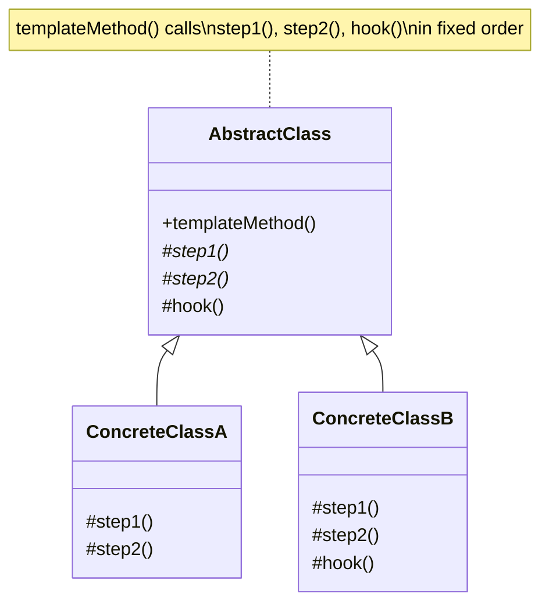

# Template Method Pattern

## Introduction

The **Template Method** pattern is a behavioral design pattern that defines the skeleton of an algorithm in a base class, letting subclasses override specific steps without changing the algorithm's overall structure. It's the classic application of the Hollywood Principle: "Don't call us, we'll call you." The base class controls the flow, and subclasses fill in the details.

In enterprise software, the Template Method is everywhere: ETL pipelines, report generators, authentication workflows, data import/export processes, and test frameworks. It promotes code reuse by extracting common logic into the base class while allowing variation at well-defined extension points (hook methods).

## Intent

- Define the skeleton of an algorithm in a method, deferring some steps to subclasses.
- Let subclasses redefine certain steps of an algorithm without changing the algorithm's structure.
- Factor out common behavior to avoid code duplication across similar processes.

## Class Diagram



## Key Characteristics

- **Inversion of control**: The base class calls subclass methods, not the other way around
- **Code reuse**: Common algorithm structure lives in one place; only varying steps are overridden
- **Open/Closed Principle**: New variants can be added by creating new subclasses without modifying the template
- **Hook methods**: Optional steps with default (often empty) implementations that subclasses may override
- **Fixed algorithm structure**: The sequence of steps is enforced by the base class and cannot be changed by subclasses
- **Can lead to deep hierarchies**: Overuse may create many subclasses; consider Strategy pattern if the number of variations is high

---

## Example 1: Fintech — Trade Settlement Pipeline

**Problem:** A brokerage processes settlements for different asset classes — equities, bonds, and derivatives. Each settlement follows the same high-level flow: validate trade, calculate fees, execute settlement, generate confirmation, and notify parties. However, fee calculation, settlement execution, and confirmation formats differ by asset class. Duplicating the pipeline for each asset type leads to copy-paste bugs and inconsistent compliance handling.

**Solution:** A Template Method in an abstract `TradeSettlement` class defines the pipeline. Subclasses override asset-specific steps while the base class enforces the overall sequence and shared validations.

```python
from abc import ABC, abstractmethod
from datetime import datetime
from dataclasses import dataclass


@dataclass
class Trade:
    trade_id: str
    asset_type: str
    symbol: str
    quantity: int
    price: float
    counterparty: str


class TradeSettlement(ABC):
    """Template: defines the settlement pipeline."""

    def settle(self, trade: Trade) -> dict:
        """Template method — fixed algorithm structure."""
        self.validate(trade)
        fees = self.calculate_fees(trade)
        result = self.execute_settlement(trade, fees)
        confirmation = self.generate_confirmation(trade, result)
        self.notify_parties(trade, confirmation)
        self.post_settlement_hook(trade)  # optional hook
        return result

    def validate(self, trade: Trade):
        """Common validation — shared across all asset types."""
        if trade.quantity <= 0:
            raise ValueError("Quantity must be positive.")
        if trade.price <= 0:
            raise ValueError("Price must be positive.")
        print(f"[{trade.trade_id}] Validation passed.")

    @abstractmethod
    def calculate_fees(self, trade: Trade) -> float:
        """Asset-specific fee logic."""
        ...

    @abstractmethod
    def execute_settlement(self, trade: Trade, fees: float) -> dict:
        """Asset-specific settlement execution."""
        ...

    @abstractmethod
    def generate_confirmation(self, trade: Trade, result: dict) -> str:
        """Asset-specific confirmation format."""
        ...

    def notify_parties(self, trade: Trade, confirmation: str):
        """Common notification — can be overridden."""
        print(f"[{trade.trade_id}] Notification sent to {trade.counterparty}.")

    def post_settlement_hook(self, trade: Trade):
        """Hook — default is no-op. Subclasses may override."""
        pass


class EquitySettlement(TradeSettlement):
    def calculate_fees(self, trade):
        fee = trade.quantity * trade.price * 0.001  # 10 bps
        print(f"[{trade.trade_id}] Equity fee: ${fee:.2f}")
        return fee

    def execute_settlement(self, trade, fees):
        net = trade.quantity * trade.price - fees
        print(f"[{trade.trade_id}] Equity settled. Net: ${net:.2f}")
        return {"net_amount": net, "settlement_date": str(datetime.now().date())}

    def generate_confirmation(self, trade, result):
        return f"EQUITY CONFIRM: {trade.symbol} x{trade.quantity} @ ${trade.price}"


class BondSettlement(TradeSettlement):
    def calculate_fees(self, trade):
        fee = trade.quantity * trade.price * 0.0005  # 5 bps
        print(f"[{trade.trade_id}] Bond fee: ${fee:.2f}")
        return fee

    def execute_settlement(self, trade, fees):
        accrued_interest = trade.quantity * trade.price * 0.02
        net = trade.quantity * trade.price + accrued_interest - fees
        print(f"[{trade.trade_id}] Bond settled. Net (with accrued): ${net:.2f}")
        return {"net_amount": net, "accrued_interest": accrued_interest}

    def generate_confirmation(self, trade, result):
        return f"BOND CONFIRM: {trade.symbol} x{trade.quantity}, Accrued: ${result['accrued_interest']:.2f}"

    def post_settlement_hook(self, trade):
        print(f"[{trade.trade_id}] Bond: Updating coupon schedule.")


# Usage
equity_trade = Trade("EQ-001", "equity", "AAPL", 100, 175.50, "Goldman Sachs")
bond_trade = Trade("BD-001", "bond", "UST-10Y", 50, 980.00, "JPMorgan")

EquitySettlement().settle(equity_trade)
print("---")
BondSettlement().settle(bond_trade)
```

```go
package main

import "fmt"

type Trade struct {
	TradeID      string
	AssetType    string
	Symbol       string
	Quantity     int
	Price        float64
	Counterparty string
}

// Template interface — each step
type SettlementSteps interface {
	CalculateFees(t Trade) float64
	ExecuteSettlement(t Trade, fees float64) map[string]interface{}
	GenerateConfirmation(t Trade, result map[string]interface{}) string
	PostSettlementHook(t Trade)
}

// Template executor — controls the algorithm
func Settle(s SettlementSteps, t Trade) map[string]interface{} {
	// Validate (common)
	if t.Quantity <= 0 || t.Price <= 0 {
		panic("Invalid trade.")
	}
	fmt.Printf("[%s] Validation passed.\n", t.TradeID)

	fees := s.CalculateFees(t)
	result := s.ExecuteSettlement(t, fees)
	conf := s.GenerateConfirmation(t, result)
	fmt.Printf("[%s] Confirmation: %s\n", t.TradeID, conf)
	fmt.Printf("[%s] Notified %s.\n", t.TradeID, t.Counterparty)
	s.PostSettlementHook(t)
	return result
}

// Equity
type EquitySettlement struct{}

func (e EquitySettlement) CalculateFees(t Trade) float64 {
	fee := float64(t.Quantity) * t.Price * 0.001
	fmt.Printf("[%s] Equity fee: $%.2f\n", t.TradeID, fee)
	return fee
}

func (e EquitySettlement) ExecuteSettlement(t Trade, fees float64) map[string]interface{} {
	net := float64(t.Quantity)*t.Price - fees
	fmt.Printf("[%s] Equity settled. Net: $%.2f\n", t.TradeID, net)
	return map[string]interface{}{"net_amount": net}
}

func (e EquitySettlement) GenerateConfirmation(t Trade, result map[string]interface{}) string {
	return fmt.Sprintf("EQUITY CONFIRM: %s x%d @ $%.2f", t.Symbol, t.Quantity, t.Price)
}

func (e EquitySettlement) PostSettlementHook(t Trade) {}

// Bond
type BondSettlement struct{}

func (b BondSettlement) CalculateFees(t Trade) float64 {
	fee := float64(t.Quantity) * t.Price * 0.0005
	fmt.Printf("[%s] Bond fee: $%.2f\n", t.TradeID, fee)
	return fee
}

func (b BondSettlement) ExecuteSettlement(t Trade, fees float64) map[string]interface{} {
	accrued := float64(t.Quantity) * t.Price * 0.02
	net := float64(t.Quantity)*t.Price + accrued - fees
	fmt.Printf("[%s] Bond settled. Net: $%.2f\n", t.TradeID, net)
	return map[string]interface{}{"net_amount": net, "accrued": accrued}
}

func (b BondSettlement) GenerateConfirmation(t Trade, result map[string]interface{}) string {
	return fmt.Sprintf("BOND CONFIRM: %s x%d, Accrued: $%.2f", t.Symbol, t.Quantity, result["accrued"])
}

func (b BondSettlement) PostSettlementHook(t Trade) {
	fmt.Printf("[%s] Updating coupon schedule.\n", t.TradeID)
}

func main() {
	eq := Trade{"EQ-001", "equity", "AAPL", 100, 175.50, "Goldman Sachs"}
	bd := Trade{"BD-001", "bond", "UST-10Y", 50, 980.00, "JPMorgan"}
	Settle(EquitySettlement{}, eq)
	fmt.Println("---")
	Settle(BondSettlement{}, bd)
}
```

```java
abstract class TradeSettlement {
    // Template method — fixed algorithm
    public final Map<String, Object> settle(Trade trade) {
        validate(trade);
        double fees = calculateFees(trade);
        Map<String, Object> result = executeSettlement(trade, fees);
        String confirmation = generateConfirmation(trade, result);
        notifyParties(trade, confirmation);
        postSettlementHook(trade);
        return result;
    }

    private void validate(Trade trade) {
        if (trade.quantity <= 0 || trade.price <= 0)
            throw new IllegalArgumentException("Invalid trade.");
        System.out.printf("[%s] Validation passed.%n", trade.tradeId);
    }

    protected abstract double calculateFees(Trade trade);
    protected abstract Map<String, Object> executeSettlement(Trade trade, double fees);
    protected abstract String generateConfirmation(Trade trade, Map<String, Object> result);

    protected void notifyParties(Trade trade, String confirmation) {
        System.out.printf("[%s] Notified %s.%n", trade.tradeId, trade.counterparty);
    }

    protected void postSettlementHook(Trade trade) { /* default no-op */ }
}

class Trade {
    String tradeId, assetType, symbol, counterparty;
    int quantity;
    double price;

    Trade(String tradeId, String assetType, String symbol, int qty, double price, String cp) {
        this.tradeId = tradeId; this.assetType = assetType; this.symbol = symbol;
        this.quantity = qty; this.price = price; this.counterparty = cp;
    }
}

class EquitySettlement extends TradeSettlement {
    protected double calculateFees(Trade t) {
        double fee = t.quantity * t.price * 0.001;
        System.out.printf("[%s] Equity fee: $%.2f%n", t.tradeId, fee);
        return fee;
    }

    protected Map<String, Object> executeSettlement(Trade t, double fees) {
        double net = t.quantity * t.price - fees;
        System.out.printf("[%s] Equity settled. Net: $%.2f%n", t.tradeId, net);
        return Map.of("net_amount", net);
    }

    protected String generateConfirmation(Trade t, Map<String, Object> r) {
        return String.format("EQUITY CONFIRM: %s x%d @ $%.2f", t.symbol, t.quantity, t.price);
    }
}

class BondSettlement extends TradeSettlement {
    protected double calculateFees(Trade t) {
        double fee = t.quantity * t.price * 0.0005;
        System.out.printf("[%s] Bond fee: $%.2f%n", t.tradeId, fee);
        return fee;
    }

    protected Map<String, Object> executeSettlement(Trade t, double fees) {
        double accrued = t.quantity * t.price * 0.02;
        double net = t.quantity * t.price + accrued - fees;
        System.out.printf("[%s] Bond settled. Net: $%.2f%n", t.tradeId, net);
        return Map.of("net_amount", net, "accrued_interest", accrued);
    }

    protected String generateConfirmation(Trade t, Map<String, Object> r) {
        return String.format("BOND CONFIRM: %s x%d, Accrued: $%.2f", t.symbol, t.quantity, r.get("accrued_interest"));
    }

    @Override
    protected void postSettlementHook(Trade t) {
        System.out.printf("[%s] Updating coupon schedule.%n", t.tradeId);
    }
}
```

```typescript
interface Trade {
  tradeId: string;
  assetType: string;
  symbol: string;
  quantity: number;
  price: number;
  counterparty: string;
}

abstract class TradeSettlement {
  // Template method
  settle(trade: Trade): Record<string, any> {
    this.validate(trade);
    const fees = this.calculateFees(trade);
    const result = this.executeSettlement(trade, fees);
    const confirmation = this.generateConfirmation(trade, result);
    this.notifyParties(trade, confirmation);
    this.postSettlementHook(trade);
    return result;
  }

  private validate(trade: Trade) {
    if (trade.quantity <= 0 || trade.price <= 0)
      throw new Error("Invalid trade.");
    console.log(`[${trade.tradeId}] Validation passed.`);
  }

  protected abstract calculateFees(trade: Trade): number;
  protected abstract executeSettlement(
    trade: Trade,
    fees: number,
  ): Record<string, any>;
  protected abstract generateConfirmation(
    trade: Trade,
    result: Record<string, any>,
  ): string;

  protected notifyParties(trade: Trade, confirmation: string) {
    console.log(`[${trade.tradeId}] Notified ${trade.counterparty}.`);
  }

  protected postSettlementHook(trade: Trade) {
    /* default no-op */
  }
}

class EquitySettlement extends TradeSettlement {
  protected calculateFees(t: Trade) {
    const fee = t.quantity * t.price * 0.001;
    console.log(`[${t.tradeId}] Equity fee: $${fee.toFixed(2)}`);
    return fee;
  }

  protected executeSettlement(t: Trade, fees: number) {
    const net = t.quantity * t.price - fees;
    console.log(`[${t.tradeId}] Equity settled. Net: $${net.toFixed(2)}`);
    return { net_amount: net };
  }

  protected generateConfirmation(t: Trade, r: Record<string, any>) {
    return `EQUITY CONFIRM: ${t.symbol} x${t.quantity} @ $${t.price}`;
  }
}

class BondSettlement extends TradeSettlement {
  protected calculateFees(t: Trade) {
    const fee = t.quantity * t.price * 0.0005;
    console.log(`[${t.tradeId}] Bond fee: $${fee.toFixed(2)}`);
    return fee;
  }

  protected executeSettlement(t: Trade, fees: number) {
    const accrued = t.quantity * t.price * 0.02;
    const net = t.quantity * t.price + accrued - fees;
    console.log(`[${t.tradeId}] Bond settled. Net: $${net.toFixed(2)}`);
    return { net_amount: net, accrued_interest: accrued };
  }

  protected generateConfirmation(t: Trade, r: Record<string, any>) {
    return `BOND CONFIRM: ${t.symbol} x${
      t.quantity
    }, Accrued: $${r.accrued_interest.toFixed(2)}`;
  }

  protected postSettlementHook(t: Trade) {
    console.log(`[${t.tradeId}] Updating coupon schedule.`);
  }
}

// Usage
const eq: Trade = {
  tradeId: "EQ-001",
  assetType: "equity",
  symbol: "AAPL",
  quantity: 100,
  price: 175.5,
  counterparty: "Goldman Sachs",
};
new EquitySettlement().settle(eq);
```

```rust
trait TradeSettlement {
    fn calculate_fees(&self, trade: &Trade) -> f64;
    fn execute_settlement(&self, trade: &Trade, fees: f64) -> Settlement;
    fn generate_confirmation(&self, trade: &Trade, result: &Settlement) -> String;
    fn post_settlement_hook(&self, _trade: &Trade) {} // default no-op

    // Template method
    fn settle(&self, trade: &Trade) -> Settlement {
        assert!(trade.quantity > 0 && trade.price > 0.0, "Invalid trade.");
        println!("[{}] Validation passed.", trade.trade_id);

        let fees = self.calculate_fees(trade);
        let result = self.execute_settlement(trade, fees);
        let conf = self.generate_confirmation(trade, &result);
        println!("[{}] Confirmation: {}", trade.trade_id, conf);
        println!("[{}] Notified {}.", trade.trade_id, trade.counterparty);
        self.post_settlement_hook(trade);
        result
    }
}

struct Trade {
    trade_id: String,
    symbol: String,
    quantity: i32,
    price: f64,
    counterparty: String,
}

struct Settlement {
    net_amount: f64,
    accrued_interest: Option<f64>,
}

struct EquitySettlement;

impl TradeSettlement for EquitySettlement {
    fn calculate_fees(&self, t: &Trade) -> f64 {
        let fee = t.quantity as f64 * t.price * 0.001;
        println!("[{}] Equity fee: ${:.2}", t.trade_id, fee);
        fee
    }

    fn execute_settlement(&self, t: &Trade, fees: f64) -> Settlement {
        let net = t.quantity as f64 * t.price - fees;
        println!("[{}] Equity settled. Net: ${:.2}", t.trade_id, net);
        Settlement { net_amount: net, accrued_interest: None }
    }

    fn generate_confirmation(&self, t: &Trade, _r: &Settlement) -> String {
        format!("EQUITY CONFIRM: {} x{} @ ${:.2}", t.symbol, t.quantity, t.price)
    }
}

struct BondSettlement;

impl TradeSettlement for BondSettlement {
    fn calculate_fees(&self, t: &Trade) -> f64 {
        let fee = t.quantity as f64 * t.price * 0.0005;
        println!("[{}] Bond fee: ${:.2}", t.trade_id, fee);
        fee
    }

    fn execute_settlement(&self, t: &Trade, fees: f64) -> Settlement {
        let accrued = t.quantity as f64 * t.price * 0.02;
        let net = t.quantity as f64 * t.price + accrued - fees;
        println!("[{}] Bond settled. Net: ${:.2}", t.trade_id, net);
        Settlement { net_amount: net, accrued_interest: Some(accrued) }
    }

    fn generate_confirmation(&self, t: &Trade, r: &Settlement) -> String {
        format!("BOND CONFIRM: {} x{}, Accrued: ${:.2}", t.symbol, t.quantity, r.accrued_interest.unwrap_or(0.0))
    }

    fn post_settlement_hook(&self, t: &Trade) {
        println!("[{}] Updating coupon schedule.", t.trade_id);
    }
}

fn main() {
    let eq = Trade { trade_id: "EQ-001".into(), symbol: "AAPL".into(), quantity: 100, price: 175.50, counterparty: "Goldman Sachs".into() };
    EquitySettlement.settle(&eq);
    println!("---");
    let bd = Trade { trade_id: "BD-001".into(), symbol: "UST-10Y".into(), quantity: 50, price: 980.0, counterparty: "JPMorgan".into() };
    BondSettlement.settle(&bd);
}
```

---

## Example 2: Healthcare — Clinical Document Generation Pipeline

**Problem:** A hospital generates various clinical documents — discharge summaries, referral letters, and lab reports. Each document follows the same generation pipeline: gather patient data, compile clinical findings, format the document, apply compliance checks (HIPAA), and distribute. However, the content compilation and formatting differ by document type. Maintaining separate pipelines per type leads to duplicated compliance logic and inconsistent output.

**Solution:** An abstract `ClinicalDocumentGenerator` defines the template. Subclasses implement content-specific steps while the base class enforces compliance checks and distribution.

```python
from abc import ABC, abstractmethod
from datetime import datetime


class ClinicalDocumentGenerator(ABC):
    """Template: clinical document generation pipeline."""

    def generate(self, patient_id: str, encounter_id: str) -> str:
        """Template method — fixed pipeline."""
        patient_data = self.gather_patient_data(patient_id)
        clinical_content = self.compile_clinical_content(encounter_id, patient_data)
        document = self.format_document(clinical_content)
        self.apply_compliance_checks(document, patient_data)
        self.distribute(document, patient_data)
        self.audit_log_hook(patient_id, encounter_id)
        return document

    def gather_patient_data(self, patient_id: str) -> dict:
        """Common — fetch from EHR."""
        print(f"Fetching patient data for {patient_id}...")
        return {"patient_id": patient_id, "name": "Jane Doe", "dob": "1985-03-15"}

    @abstractmethod
    def compile_clinical_content(self, encounter_id: str, patient: dict) -> dict:
        """Document-specific content compilation."""
        ...

    @abstractmethod
    def format_document(self, content: dict) -> str:
        """Document-specific formatting."""
        ...

    def apply_compliance_checks(self, document: str, patient: dict):
        """Common HIPAA compliance — shared."""
        if patient["dob"] in document:
            print("WARNING: Full DOB detected — applying redaction policy.")
        print("HIPAA compliance check passed.")

    def distribute(self, document: str, patient: dict):
        """Common distribution."""
        print(f"Document distributed to care team for {patient['name']}.")

    def audit_log_hook(self, patient_id: str, encounter_id: str):
        """Hook — default audit logging."""
        print(f"Audit: Document generated for patient {patient_id}, encounter {encounter_id}.")


class DischargeSummaryGenerator(ClinicalDocumentGenerator):
    def compile_clinical_content(self, encounter_id, patient):
        return {
            "type": "Discharge Summary",
            "encounter": encounter_id,
            "diagnosis": "Type 2 Diabetes — well controlled",
            "medications": ["Metformin 500mg", "Lisinopril 10mg"],
            "follow_up": "PCP in 2 weeks",
        }

    def format_document(self, content):
        meds = ", ".join(content["medications"])
        return (
            f"=== DISCHARGE SUMMARY ===\n"
            f"Encounter: {content['encounter']}\n"
            f"Diagnosis: {content['diagnosis']}\n"
            f"Medications: {meds}\n"
            f"Follow-up: {content['follow_up']}\n"
        )


class ReferralLetterGenerator(ClinicalDocumentGenerator):
    def compile_clinical_content(self, encounter_id, patient):
        return {
            "type": "Referral Letter",
            "encounter": encounter_id,
            "referring_to": "Cardiology — Dr. Chen",
            "reason": "Persistent chest pain with abnormal ECG",
            "urgency": "Urgent",
        }

    def format_document(self, content):
        return (
            f"=== REFERRAL LETTER ===\n"
            f"To: {content['referring_to']}\n"
            f"Reason: {content['reason']}\n"
            f"Urgency: {content['urgency']}\n"
        )

    def audit_log_hook(self, patient_id, encounter_id):
        super().audit_log_hook(patient_id, encounter_id)
        print(f"Audit: Referral flagged for follow-up tracking.")


# Usage
DischargeSummaryGenerator().generate("P-12345", "E-6789")
print("---")
ReferralLetterGenerator().generate("P-12345", "E-6790")
```

```go
package main

import "fmt"

type PatientData struct {
	PatientID string
	Name      string
	DOB       string
}

type DocumentContent struct {
	DocType string
	Fields  map[string]string
}

type ClinicalDocSteps interface {
	CompileClinicalContent(encounterID string, patient PatientData) DocumentContent
	FormatDocument(content DocumentContent) string
	AuditLogHook(patientID, encounterID string)
}

func GenerateDocument(s ClinicalDocSteps, patientID, encounterID string) string {
	patient := PatientData{PatientID: patientID, Name: "Jane Doe", DOB: "1985-03-15"}
	fmt.Printf("Fetching patient data for %s...\n", patientID)

	content := s.CompileClinicalContent(encounterID, patient)
	document := s.FormatDocument(content)
	fmt.Println("HIPAA compliance check passed.")
	fmt.Printf("Document distributed to care team for %s.\n", patient.Name)
	s.AuditLogHook(patientID, encounterID)
	return document
}

type DischargeSummary struct{}

func (d DischargeSummary) CompileClinicalContent(eid string, p PatientData) DocumentContent {
	return DocumentContent{DocType: "Discharge Summary", Fields: map[string]string{
		"encounter": eid, "diagnosis": "Type 2 Diabetes", "follow_up": "PCP in 2 weeks",
	}}
}

func (d DischargeSummary) FormatDocument(c DocumentContent) string {
	return fmt.Sprintf("=== DISCHARGE SUMMARY ===\nDiagnosis: %s\nFollow-up: %s",
		c.Fields["diagnosis"], c.Fields["follow_up"])
}

func (d DischargeSummary) AuditLogHook(pid, eid string) {
	fmt.Printf("Audit: Document generated for %s, encounter %s.\n", pid, eid)
}

type ReferralLetter struct{}

func (r ReferralLetter) CompileClinicalContent(eid string, p PatientData) DocumentContent {
	return DocumentContent{DocType: "Referral", Fields: map[string]string{
		"referring_to": "Cardiology — Dr. Chen", "reason": "Chest pain", "urgency": "Urgent",
	}}
}

func (r ReferralLetter) FormatDocument(c DocumentContent) string {
	return fmt.Sprintf("=== REFERRAL ===\nTo: %s\nReason: %s\nUrgency: %s",
		c.Fields["referring_to"], c.Fields["reason"], c.Fields["urgency"])
}

func (r ReferralLetter) AuditLogHook(pid, eid string) {
	fmt.Printf("Audit: Referral generated for %s. Flagged for tracking.\n", pid)
}

func main() {
	GenerateDocument(DischargeSummary{}, "P-12345", "E-6789")
	fmt.Println("---")
	GenerateDocument(ReferralLetter{}, "P-12345", "E-6790")
}
```

```java
import java.util.*;

abstract class ClinicalDocumentGenerator {
    // Template method
    public final String generate(String patientId, String encounterId) {
        Map<String, String> patient = gatherPatientData(patientId);
        Map<String, String> content = compileClinicalContent(encounterId, patient);
        String document = formatDocument(content);
        applyComplianceChecks(document);
        distribute(document, patient);
        auditLogHook(patientId, encounterId);
        return document;
    }

    private Map<String, String> gatherPatientData(String patientId) {
        System.out.printf("Fetching patient data for %s...%n", patientId);
        return Map.of("patient_id", patientId, "name", "Jane Doe");
    }

    protected abstract Map<String, String> compileClinicalContent(String encounterId, Map<String, String> patient);
    protected abstract String formatDocument(Map<String, String> content);

    private void applyComplianceChecks(String document) {
        System.out.println("HIPAA compliance check passed.");
    }

    private void distribute(String document, Map<String, String> patient) {
        System.out.printf("Document distributed for %s.%n", patient.get("name"));
    }

    protected void auditLogHook(String patientId, String encounterId) {
        System.out.printf("Audit: Document generated for %s, encounter %s.%n", patientId, encounterId);
    }
}

class DischargeSummaryGenerator extends ClinicalDocumentGenerator {
    protected Map<String, String> compileClinicalContent(String eid, Map<String, String> patient) {
        return Map.of("type", "Discharge", "diagnosis", "Type 2 Diabetes", "follow_up", "PCP in 2 weeks");
    }

    protected String formatDocument(Map<String, String> c) {
        return String.format("=== DISCHARGE SUMMARY ===\nDiagnosis: %s\nFollow-up: %s",
                c.get("diagnosis"), c.get("follow_up"));
    }
}

class ReferralLetterGenerator extends ClinicalDocumentGenerator {
    protected Map<String, String> compileClinicalContent(String eid, Map<String, String> patient) {
        return Map.of("to", "Cardiology — Dr. Chen", "reason", "Chest pain", "urgency", "Urgent");
    }

    protected String formatDocument(Map<String, String> c) {
        return String.format("=== REFERRAL ===\nTo: %s\nReason: %s\nUrgency: %s",
                c.get("to"), c.get("reason"), c.get("urgency"));
    }

    @Override
    protected void auditLogHook(String patientId, String encounterId) {
        super.auditLogHook(patientId, encounterId);
        System.out.println("Audit: Referral flagged for follow-up tracking.");
    }
}
```

```typescript
interface PatientData {
  patientId: string;
  name: string;
}

abstract class ClinicalDocumentGenerator {
  // Template method
  generate(patientId: string, encounterId: string): string {
    const patient = this.gatherPatientData(patientId);
    const content = this.compileClinicalContent(encounterId, patient);
    const document = this.formatDocument(content);
    this.applyComplianceChecks(document);
    this.distribute(document, patient);
    this.auditLogHook(patientId, encounterId);
    return document;
  }

  private gatherPatientData(patientId: string): PatientData {
    console.log(`Fetching patient data for ${patientId}...`);
    return { patientId, name: "Jane Doe" };
  }

  protected abstract compileClinicalContent(
    encounterId: string,
    patient: PatientData,
  ): Record<string, string>;
  protected abstract formatDocument(content: Record<string, string>): string;

  private applyComplianceChecks(document: string) {
    console.log("HIPAA compliance check passed.");
  }

  private distribute(document: string, patient: PatientData) {
    console.log(`Document distributed for ${patient.name}.`);
  }

  protected auditLogHook(patientId: string, encounterId: string) {
    console.log(
      `Audit: Document generated for ${patientId}, encounter ${encounterId}.`,
    );
  }
}

class DischargeSummaryGenerator extends ClinicalDocumentGenerator {
  protected compileClinicalContent(eid: string, patient: PatientData) {
    return {
      type: "Discharge",
      diagnosis: "Type 2 Diabetes",
      follow_up: "PCP in 2 weeks",
    };
  }

  protected formatDocument(c: Record<string, string>) {
    return `=== DISCHARGE SUMMARY ===\nDiagnosis: ${c.diagnosis}\nFollow-up: ${c.follow_up}`;
  }
}

class ReferralLetterGenerator extends ClinicalDocumentGenerator {
  protected compileClinicalContent(eid: string, patient: PatientData) {
    return {
      to: "Cardiology — Dr. Chen",
      reason: "Chest pain",
      urgency: "Urgent",
    };
  }

  protected formatDocument(c: Record<string, string>) {
    return `=== REFERRAL ===\nTo: ${c.to}\nReason: ${c.reason}\nUrgency: ${c.urgency}`;
  }

  protected auditLogHook(patientId: string, encounterId: string) {
    super.auditLogHook(patientId, encounterId);
    console.log("Audit: Referral flagged for follow-up tracking.");
  }
}

// Usage
new DischargeSummaryGenerator().generate("P-12345", "E-6789");
```

```rust
trait ClinicalDocumentGenerator {
    fn compile_clinical_content(&self, encounter_id: &str, patient: &PatientData) -> DocumentContent;
    fn format_document(&self, content: &DocumentContent) -> String;
    fn audit_log_hook(&self, patient_id: &str, encounter_id: &str) {
        println!("Audit: Document generated for {}, encounter {}.", patient_id, encounter_id);
    }

    // Template method
    fn generate(&self, patient_id: &str, encounter_id: &str) -> String {
        println!("Fetching patient data for {}...", patient_id);
        let patient = PatientData { patient_id: patient_id.to_string(), name: "Jane Doe".to_string() };

        let content = self.compile_clinical_content(encounter_id, &patient);
        let document = self.format_document(&content);
        println!("HIPAA compliance check passed.");
        println!("Document distributed for {}.", patient.name);
        self.audit_log_hook(patient_id, encounter_id);
        document
    }
}

struct PatientData {
    patient_id: String,
    name: String,
}

struct DocumentContent {
    doc_type: String,
    fields: std::collections::HashMap<String, String>,
}

struct DischargeSummary;

impl ClinicalDocumentGenerator for DischargeSummary {
    fn compile_clinical_content(&self, eid: &str, _p: &PatientData) -> DocumentContent {
        let mut fields = std::collections::HashMap::new();
        fields.insert("diagnosis".into(), "Type 2 Diabetes".into());
        fields.insert("follow_up".into(), "PCP in 2 weeks".into());
        DocumentContent { doc_type: "Discharge".into(), fields }
    }

    fn format_document(&self, c: &DocumentContent) -> String {
        format!("=== DISCHARGE SUMMARY ===\nDiagnosis: {}\nFollow-up: {}",
            c.fields["diagnosis"], c.fields["follow_up"])
    }
}

struct ReferralLetter;

impl ClinicalDocumentGenerator for ReferralLetter {
    fn compile_clinical_content(&self, _eid: &str, _p: &PatientData) -> DocumentContent {
        let mut fields = std::collections::HashMap::new();
        fields.insert("to".into(), "Cardiology — Dr. Chen".into());
        fields.insert("reason".into(), "Chest pain".into());
        fields.insert("urgency".into(), "Urgent".into());
        DocumentContent { doc_type: "Referral".into(), fields }
    }

    fn format_document(&self, c: &DocumentContent) -> String {
        format!("=== REFERRAL ===\nTo: {}\nReason: {}\nUrgency: {}",
            c.fields["to"], c.fields["reason"], c.fields["urgency"])
    }

    fn audit_log_hook(&self, pid: &str, eid: &str) {
        println!("Audit: Referral for {}, encounter {}. Flagged for tracking.", pid, eid);
    }
}

fn main() {
    DischargeSummary.generate("P-12345", "E-6789");
    println!("---");
    ReferralLetter.generate("P-12345", "E-6790");
}
```
