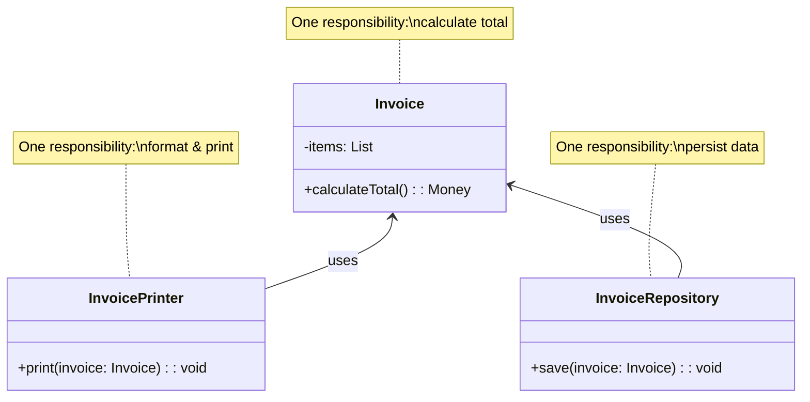

# Single Responsibility Principle (SRP)

## Introduction

The **Single Responsibility Principle** states that a class should have only one reason to change — meaning it should have only one job or responsibility. When a class handles multiple concerns (e.g., business logic and persistence, or validation and notification), changes in one concern risk breaking the other. SRP leads to smaller, focused classes that are easier to understand, test, and maintain.

Robert C. Martin, who coined the term, later refined it as: "A module should be responsible to one, and only one, actor." This shifts the focus from "one thing" to "one stakeholder" — the class changes only when the requirements of that stakeholder change.

## Intent

- Ensure each class encapsulates exactly one responsibility so that it has only one reason to change.
- Reduce coupling between unrelated concerns within a single class.
- Improve testability by isolating behavior into small, composable units.

## Diagram



## Key Characteristics

- **One reason to change**: If a class changes for multiple unrelated reasons, it violates SRP
- **Cohesion over coupling**: High internal cohesion within a class; low coupling between classes
- **Easier testing**: A focused class needs fewer test cases and simpler test setups
- **Smaller classes, more classes**: SRP often increases the number of classes, but each is simpler
- **Applies at every level**: Methods, classes, modules, and even microservices benefit from SRP
- **Judgment required**: Over-splitting can lead to excessive indirection; balance is key

---

## Example 1: Fintech — Transaction Processing

**Problem (Violating SRP):** A single `TransactionService` class validates input, executes the transfer, logs the audit trail, sends notifications, and generates reports. When audit requirements change, the entire class is modified, risking regressions in transfer logic.

**Solution (Applying SRP):** Separate each concern into its own class: `TransactionValidator`, `TransactionExecutor`, `AuditLogger`, `NotificationService`, and `ReportGenerator`. Each class has one reason to change.

```python
# ❌ BEFORE: Violating SRP — one class doing everything
class TransactionService:
    def process(self, from_acc, to_acc, amount):
        # Validation
        if amount <= 0:
            raise ValueError("Invalid amount")
        if from_acc.balance < amount:
            raise ValueError("Insufficient funds")

        # Execution
        from_acc.balance -= amount
        to_acc.balance += amount

        # Audit logging
        with open("audit.log", "a") as f:
            f.write(f"Transfer {amount} from {from_acc.id} to {to_acc.id}\n")

        # Notification
        self._send_email(from_acc.email, f"You sent ${amount}")
        self._send_email(to_acc.email, f"You received ${amount}")

    def _send_email(self, to, body):
        print(f"Email to {to}: {body}")


# ✅ AFTER: Applying SRP — each class has one responsibility
from dataclasses import dataclass
from typing import Protocol


@dataclass
class Account:
    id: str
    email: str
    balance: float


class TransactionValidator:
    """Validates transaction rules. Changes only when validation rules change."""

    def validate(self, from_acc: Account, to_acc: Account, amount: float):
        if amount <= 0:
            raise ValueError("Amount must be positive.")
        if from_acc.balance < amount:
            raise ValueError(f"Insufficient funds in {from_acc.id}.")


class TransactionExecutor:
    """Executes the fund transfer. Changes only when transfer logic changes."""

    def execute(self, from_acc: Account, to_acc: Account, amount: float):
        from_acc.balance -= amount
        to_acc.balance += amount
        return {"from": from_acc.id, "to": to_acc.id, "amount": amount}


class AuditLogger:
    """Logs audit entries. Changes only when audit requirements change."""

    def log(self, event: dict):
        print(f"AUDIT: {event}")


class NotificationService:
    """Sends notifications. Changes only when notification channels change."""

    def notify(self, email: str, message: str):
        print(f"EMAIL to {email}: {message}")


# Orchestrator — composes the single-responsibility classes
class TransferOrchestrator:
    def __init__(self):
        self.validator = TransactionValidator()
        self.executor = TransactionExecutor()
        self.logger = AuditLogger()
        self.notifier = NotificationService()

    def transfer(self, from_acc: Account, to_acc: Account, amount: float):
        self.validator.validate(from_acc, to_acc, amount)
        result = self.executor.execute(from_acc, to_acc, amount)
        self.logger.log(result)
        self.notifier.notify(from_acc.email, f"Sent ${amount} to {to_acc.id}")
        self.notifier.notify(to_acc.email, f"Received ${amount} from {from_acc.id}")


# Usage
alice = Account("ACC-001", "alice@bank.com", 1000.0)
bob = Account("ACC-002", "bob@bank.com", 500.0)
TransferOrchestrator().transfer(alice, bob, 200.0)
```

```go
package main

import "fmt"

type Account struct {
	ID      string
	Email   string
	Balance float64
}

// Validator — one responsibility: validate
type TransactionValidator struct{}

func (v TransactionValidator) Validate(from, to *Account, amount float64) error {
	if amount <= 0 {
		return fmt.Errorf("amount must be positive")
	}
	if from.Balance < amount {
		return fmt.Errorf("insufficient funds in %s", from.ID)
	}
	return nil
}

// Executor — one responsibility: transfer
type TransactionExecutor struct{}

func (e TransactionExecutor) Execute(from, to *Account, amount float64) {
	from.Balance -= amount
	to.Balance += amount
}

// Logger — one responsibility: audit
type AuditLogger struct{}

func (l AuditLogger) Log(msg string) {
	fmt.Printf("AUDIT: %s\n", msg)
}

// Notifier — one responsibility: notify
type NotificationService struct{}

func (n NotificationService) Notify(email, message string) {
	fmt.Printf("EMAIL to %s: %s\n", email, message)
}

// Orchestrator composes them
func Transfer(from, to *Account, amount float64) error {
	v := TransactionValidator{}
	if err := v.Validate(from, to, amount); err != nil {
		return err
	}
	TransactionExecutor{}.Execute(from, to, amount)
	AuditLogger{}.Log(fmt.Sprintf("Transferred %.2f from %s to %s", amount, from.ID, to.ID))
	n := NotificationService{}
	n.Notify(from.Email, fmt.Sprintf("Sent $%.2f", amount))
	n.Notify(to.Email, fmt.Sprintf("Received $%.2f", amount))
	return nil
}

func main() {
	alice := &Account{"ACC-001", "alice@bank.com", 1000}
	bob := &Account{"ACC-002", "bob@bank.com", 500}
	Transfer(alice, bob, 200)
}
```

```java
// Validator — changes when validation rules change
class TransactionValidator {
    void validate(Account from, Account to, double amount) {
        if (amount <= 0) throw new IllegalArgumentException("Amount must be positive.");
        if (from.getBalance() < amount) throw new IllegalArgumentException("Insufficient funds.");
    }
}

// Executor — changes when transfer logic changes
class TransactionExecutor {
    void execute(Account from, Account to, double amount) {
        from.debit(amount);
        to.credit(amount);
    }
}

// Logger — changes when audit requirements change
class AuditLogger {
    void log(String event) {
        System.out.println("AUDIT: " + event);
    }
}

// Notifier — changes when notification channels change
class NotificationService {
    void notify(String email, String message) {
        System.out.printf("EMAIL to %s: %s%n", email, message);
    }
}

// Orchestrator
class TransferOrchestrator {
    private final TransactionValidator validator = new TransactionValidator();
    private final TransactionExecutor executor = new TransactionExecutor();
    private final AuditLogger logger = new AuditLogger();
    private final NotificationService notifier = new NotificationService();

    void transfer(Account from, Account to, double amount) {
        validator.validate(from, to, amount);
        executor.execute(from, to, amount);
        logger.log(String.format("Transferred %.2f from %s to %s", amount, from.getId(), to.getId()));
        notifier.notify(from.getEmail(), String.format("Sent $%.2f", amount));
        notifier.notify(to.getEmail(), String.format("Received $%.2f", amount));
    }
}
```

```typescript
class Account {
  constructor(
    public readonly id: string,
    public readonly email: string,
    public balance: number,
  ) {}
}

// Each class has ONE responsibility
class TransactionValidator {
  validate(from: Account, to: Account, amount: number) {
    if (amount <= 0) throw new Error("Amount must be positive.");
    if (from.balance < amount) throw new Error("Insufficient funds.");
  }
}

class TransactionExecutor {
  execute(from: Account, to: Account, amount: number) {
    from.balance -= amount;
    to.balance += amount;
  }
}

class AuditLogger {
  log(event: string) {
    console.log(`AUDIT: ${event}`);
  }
}

class NotificationService {
  notify(email: string, message: string) {
    console.log(`EMAIL to ${email}: ${message}`);
  }
}

class TransferOrchestrator {
  private validator = new TransactionValidator();
  private executor = new TransactionExecutor();
  private logger = new AuditLogger();
  private notifier = new NotificationService();

  transfer(from: Account, to: Account, amount: number) {
    this.validator.validate(from, to, amount);
    this.executor.execute(from, to, amount);
    this.logger.log(`Transferred ${amount} from ${from.id} to ${to.id}`);
    this.notifier.notify(from.email, `Sent $${amount}`);
    this.notifier.notify(to.email, `Received $${amount}`);
  }
}
```

```rust
struct Account {
    id: String,
    email: String,
    balance: f64,
}

struct TransactionValidator;
impl TransactionValidator {
    fn validate(&self, from: &Account, _to: &Account, amount: f64) -> Result<(), String> {
        if amount <= 0.0 { return Err("Amount must be positive.".into()); }
        if from.balance < amount { return Err(format!("Insufficient funds in {}.", from.id)); }
        Ok(())
    }
}

struct TransactionExecutor;
impl TransactionExecutor {
    fn execute(&self, from: &mut Account, to: &mut Account, amount: f64) {
        from.balance -= amount;
        to.balance += amount;
    }
}

struct AuditLogger;
impl AuditLogger {
    fn log(&self, event: &str) { println!("AUDIT: {}", event); }
}

struct NotificationService;
impl NotificationService {
    fn notify(&self, email: &str, message: &str) { println!("EMAIL to {}: {}", email, message); }
}

fn transfer(from: &mut Account, to: &mut Account, amount: f64) {
    TransactionValidator.validate(from, to, amount).unwrap();
    TransactionExecutor.execute(&TransactionExecutor, from, to, amount);
    AuditLogger.log(&AuditLogger, &format!("Transferred {:.2} from {} to {}", amount, from.id, to.id));
    NotificationService.notify(&NotificationService, &from.email, &format!("Sent ${:.2}", amount));
    NotificationService.notify(&NotificationService, &to.email, &format!("Received ${:.2}", amount));
}

fn main() {
    let mut alice = Account { id: "ACC-001".into(), email: "alice@bank.com".into(), balance: 1000.0 };
    let mut bob = Account { id: "ACC-002".into(), email: "bob@bank.com".into(), balance: 500.0 };
    transfer(&mut alice, &mut bob, 200.0);
}
```

---

## Example 2: Healthcare — Patient Record Management

**Problem (Violating SRP):** A `PatientService` class handles patient data CRUD, appointment scheduling, insurance verification, and medical history formatting — all in one class. When the insurance API changes, the team risks breaking appointment logic.

**Solution (Applying SRP):** Split into `PatientRepository`, `AppointmentScheduler`, `InsuranceVerifier`, and `MedicalHistoryFormatter`.

```python
from dataclasses import dataclass, field
from datetime import datetime
from typing import Optional


@dataclass
class Patient:
    patient_id: str
    name: str
    dob: str
    insurance_id: Optional[str] = None


# Repository — persistence concern only
class PatientRepository:
    def __init__(self):
        self._store: dict[str, Patient] = {}

    def save(self, patient: Patient):
        self._store[patient.patient_id] = patient
        print(f"Saved patient {patient.patient_id}.")

    def find(self, patient_id: str) -> Optional[Patient]:
        return self._store.get(patient_id)


# Scheduler — appointment concern only
class AppointmentScheduler:
    def schedule(self, patient: Patient, doctor: str, time: datetime):
        print(f"Appointment: {patient.name} with Dr. {doctor} at {time:%Y-%m-%d %H:%M}.")


# Insurance — verification concern only
class InsuranceVerifier:
    def verify(self, patient: Patient) -> bool:
        if not patient.insurance_id:
            print(f"{patient.name}: No insurance on file.")
            return False
        print(f"{patient.name}: Insurance {patient.insurance_id} verified.")
        return True


# Formatter — display concern only
class MedicalHistoryFormatter:
    def format_summary(self, patient: Patient, records: list[str]) -> str:
        header = f"=== Medical History: {patient.name} ===\n"
        body = "\n".join(f"  - {r}" for r in records)
        return header + body


# Usage
repo = PatientRepository()
patient = Patient("P-001", "Jane Doe", "1985-03-15", "INS-5678")
repo.save(patient)

AppointmentScheduler().schedule(patient, "Smith", datetime(2024, 6, 15, 10, 30))
InsuranceVerifier().verify(patient)
print(MedicalHistoryFormatter().format_summary(patient, ["2024-01 Flu", "2024-03 Checkup"]))
```

```go
package main

import "fmt"

type Patient struct {
	ID          string
	Name        string
	InsuranceID string
}

type PatientRepository struct {
	store map[string]Patient
}

func NewPatientRepository() *PatientRepository {
	return &PatientRepository{store: make(map[string]Patient)}
}

func (r *PatientRepository) Save(p Patient) {
	r.store[p.ID] = p
	fmt.Printf("Saved patient %s.\n", p.ID)
}

type AppointmentScheduler struct{}

func (s AppointmentScheduler) Schedule(p Patient, doctor, time string) {
	fmt.Printf("Appointment: %s with Dr. %s at %s.\n", p.Name, doctor, time)
}

type InsuranceVerifier struct{}

func (v InsuranceVerifier) Verify(p Patient) bool {
	if p.InsuranceID == "" {
		fmt.Printf("%s: No insurance on file.\n", p.Name)
		return false
	}
	fmt.Printf("%s: Insurance %s verified.\n", p.Name, p.InsuranceID)
	return true
}

func main() {
	repo := NewPatientRepository()
	p := Patient{"P-001", "Jane Doe", "INS-5678"}
	repo.Save(p)
	AppointmentScheduler{}.Schedule(p, "Smith", "2024-06-15 10:30")
	InsuranceVerifier{}.Verify(p)
}
```

```java
class PatientRepository {
    private final Map<String, Patient> store = new HashMap<>();

    void save(Patient p) {
        store.put(p.getId(), p);
        System.out.printf("Saved patient %s.%n", p.getId());
    }

    Patient find(String id) { return store.get(id); }
}

class AppointmentScheduler {
    void schedule(Patient p, String doctor, String time) {
        System.out.printf("Appointment: %s with Dr. %s at %s.%n", p.getName(), doctor, time);
    }
}

class InsuranceVerifier {
    boolean verify(Patient p) {
        if (p.getInsuranceId() == null) {
            System.out.printf("%s: No insurance.%n", p.getName());
            return false;
        }
        System.out.printf("%s: Insurance %s verified.%n", p.getName(), p.getInsuranceId());
        return true;
    }
}
```

```typescript
interface Patient {
  patientId: string;
  name: string;
  insuranceId?: string;
}

class PatientRepository {
  private store = new Map<string, Patient>();

  save(p: Patient) {
    this.store.set(p.patientId, p);
    console.log(`Saved patient ${p.patientId}.`);
  }

  find(id: string) {
    return this.store.get(id);
  }
}

class AppointmentScheduler {
  schedule(p: Patient, doctor: string, time: string) {
    console.log(`Appointment: ${p.name} with Dr. ${doctor} at ${time}.`);
  }
}

class InsuranceVerifier {
  verify(p: Patient): boolean {
    if (!p.insuranceId) {
      console.log(`${p.name}: No insurance on file.`);
      return false;
    }
    console.log(`${p.name}: Insurance ${p.insuranceId} verified.`);
    return true;
  }
}
```

```rust
struct Patient {
    id: String,
    name: String,
    insurance_id: Option<String>,
}

struct PatientRepository {
    store: std::collections::HashMap<String, Patient>,
}

impl PatientRepository {
    fn new() -> Self { Self { store: std::collections::HashMap::new() } }
    fn save(&mut self, p: Patient) {
        println!("Saved patient {}.", p.id);
        self.store.insert(p.id.clone(), p);
    }
}

struct AppointmentScheduler;
impl AppointmentScheduler {
    fn schedule(&self, p: &Patient, doctor: &str, time: &str) {
        println!("Appointment: {} with Dr. {} at {}.", p.name, doctor, time);
    }
}

struct InsuranceVerifier;
impl InsuranceVerifier {
    fn verify(&self, p: &Patient) -> bool {
        match &p.insurance_id {
            Some(id) => { println!("{}: Insurance {} verified.", p.name, id); true }
            None => { println!("{}: No insurance on file.", p.name); false }
        }
    }
}

fn main() {
    let mut repo = PatientRepository::new();
    let p = Patient { id: "P-001".into(), name: "Jane Doe".into(), insurance_id: Some("INS-5678".into()) };
    InsuranceVerifier.verify(&p);
    AppointmentScheduler.schedule(&AppointmentScheduler, &p, "Smith", "2024-06-15 10:30");
    repo.save(p);
}
```
