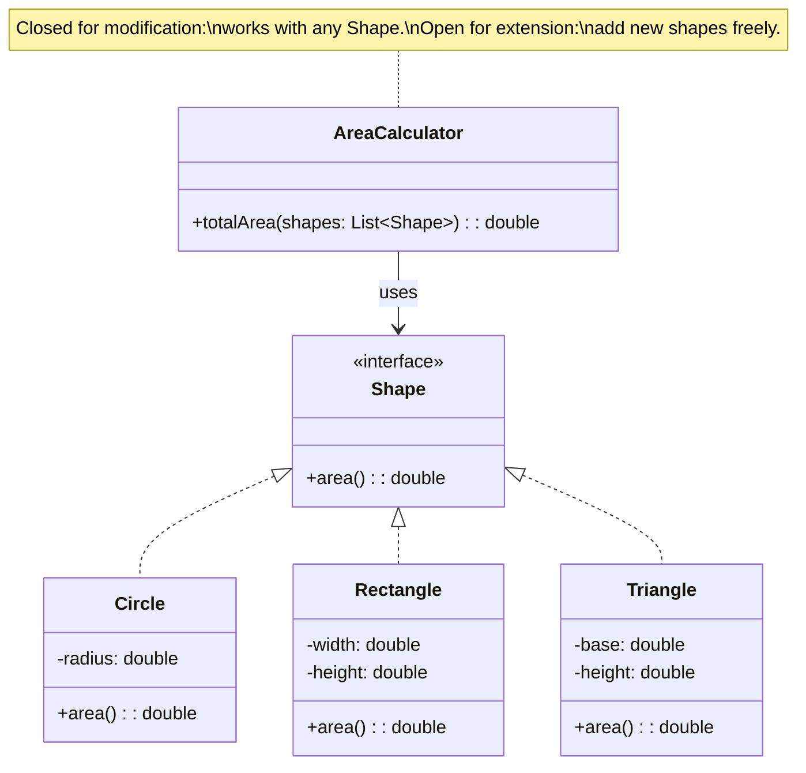

# Open/Closed Principle (OCP)

## Introduction

The **Open/Closed Principle** states that software entities (classes, modules, functions) should be **open for extension but closed for modification**. You should be able to add new behavior without changing existing, tested code. This is achieved through abstractions — interfaces, abstract classes, and polymorphism — so that new functionality is added by creating new implementations rather than editing existing ones.

Bertrand Meyer originally proposed the principle and it was later popularized by Robert C. Martin. In practice, OCP is the foundation for plugin architectures, strategy selection, and any system that must evolve without risking regressions in stable code.

## Intent

- Allow new functionality to be added without modifying existing code.
- Use abstractions (interfaces, abstract classes) as extension points.
- Reduce the risk of introducing bugs when requirements change.

## Diagram



## Key Characteristics

- **Extension over modification**: New behavior is added via new classes, not by editing existing ones
- **Abstraction is the key**: Interfaces and abstract classes define stable contracts
- **Reduces regression risk**: Existing code remains untouched when features are added
- **Enables plugin architectures**: New implementations can be loaded without recompiling the core
- **Requires foresight**: You must identify the likely axes of change and place abstractions there
- **Not about never changing code**: It means the existing code path should not need changes for new variants

---

## Example 1: Fintech — Payment Processing

**Problem (Violating OCP):** A payment processor uses `if/else` chains to handle credit cards, PayPal, and bank transfers. Adding crypto payments requires modifying the core processor, risking bugs in existing payment flows.

**Solution (Applying OCP):** Define a `PaymentMethod` interface. Each payment type implements it. The processor works with the interface — adding new payment methods requires zero changes to the processor.

```python
from abc import ABC, abstractmethod
from dataclasses import dataclass


# ❌ BEFORE: Violating OCP — must modify this for every new method
class PaymentProcessorBad:
    def process(self, method: str, amount: float):
        if method == "credit_card":
            print(f"Charging credit card: ${amount:.2f}")
        elif method == "paypal":
            print(f"PayPal transfer: ${amount:.2f}")
        elif method == "bank_transfer":
            print(f"Bank transfer: ${amount:.2f}")
        # Adding crypto? Must modify this class ❌


# ✅ AFTER: Applying OCP — closed for modification, open for extension
class PaymentMethod(ABC):
    @abstractmethod
    def pay(self, amount: float) -> str: ...

    @abstractmethod
    def name(self) -> str: ...


class CreditCardPayment(PaymentMethod):
    def __init__(self, card_number: str):
        self.card_number = card_number

    def pay(self, amount: float) -> str:
        return f"Charged ${amount:.2f} to card ending {self.card_number[-4:]}"

    def name(self) -> str:
        return "Credit Card"


class PayPalPayment(PaymentMethod):
    def __init__(self, email: str):
        self.email = email

    def pay(self, amount: float) -> str:
        return f"PayPal transfer of ${amount:.2f} to {self.email}"

    def name(self) -> str:
        return "PayPal"


class CryptoPayment(PaymentMethod):
    """New payment method — no changes to PaymentProcessor needed!"""

    def __init__(self, wallet: str):
        self.wallet = wallet

    def pay(self, amount: float) -> str:
        return f"Crypto transfer of ${amount:.2f} to wallet {self.wallet[:8]}..."

    def name(self) -> str:
        return "Crypto"


class PaymentProcessor:
    """Closed for modification — works with any PaymentMethod."""

    def process(self, method: PaymentMethod, amount: float):
        result = method.pay(amount)
        print(f"[{method.name()}] {result}")


# Usage — extend freely without modifying PaymentProcessor
processor = PaymentProcessor()
processor.process(CreditCardPayment("4111111111111234"), 99.99)
processor.process(PayPalPayment("user@email.com"), 49.99)
processor.process(CryptoPayment("0xABCDEF1234567890"), 150.00)
```

```go
package main

import "fmt"

type PaymentMethod interface {
	Pay(amount float64) string
	Name() string
}

type CreditCard struct{ CardNumber string }

func (c CreditCard) Pay(amount float64) string {
	return fmt.Sprintf("Charged $%.2f to card ending %s", amount, c.CardNumber[len(c.CardNumber)-4:])
}
func (c CreditCard) Name() string { return "Credit Card" }

type PayPal struct{ Email string }

func (p PayPal) Pay(amount float64) string {
	return fmt.Sprintf("PayPal transfer of $%.2f to %s", amount, p.Email)
}
func (p PayPal) Name() string { return "PayPal" }

type Crypto struct{ Wallet string }

func (c Crypto) Pay(amount float64) string {
	return fmt.Sprintf("Crypto transfer of $%.2f to wallet %s...", amount, c.Wallet[:8])
}
func (c Crypto) Name() string { return "Crypto" }

// Processor — closed for modification
func ProcessPayment(m PaymentMethod, amount float64) {
	result := m.Pay(amount)
	fmt.Printf("[%s] %s\n", m.Name(), result)
}

func main() {
	ProcessPayment(CreditCard{"4111111111111234"}, 99.99)
	ProcessPayment(PayPal{"user@email.com"}, 49.99)
	ProcessPayment(Crypto{"0xABCDEF1234567890"}, 150.00)
}
```

```java
interface PaymentMethod {
    String pay(double amount);
    String name();
}

class CreditCardPayment implements PaymentMethod {
    private final String cardNumber;

    CreditCardPayment(String cardNumber) { this.cardNumber = cardNumber; }

    public String pay(double amount) {
        return String.format("Charged $%.2f to card ending %s", amount,
                cardNumber.substring(cardNumber.length() - 4));
    }

    public String name() { return "Credit Card"; }
}

class CryptoPayment implements PaymentMethod {
    private final String wallet;

    CryptoPayment(String wallet) { this.wallet = wallet; }

    public String pay(double amount) {
        return String.format("Crypto transfer of $%.2f to wallet %s...", amount, wallet.substring(0, 8));
    }

    public String name() { return "Crypto"; }
}

// Processor — closed for modification, open for extension
class PaymentProcessor {
    void process(PaymentMethod method, double amount) {
        String result = method.pay(amount);
        System.out.printf("[%s] %s%n", method.name(), result);
    }
}
```

```typescript
interface PaymentMethod {
  pay(amount: number): string;
  name(): string;
}

class CreditCardPayment implements PaymentMethod {
  constructor(private cardNumber: string) {}

  pay(amount: number) {
    return `Charged $${amount.toFixed(
      2,
    )} to card ending ${this.cardNumber.slice(-4)}`;
  }

  name() {
    return "Credit Card";
  }
}

class CryptoPayment implements PaymentMethod {
  constructor(private wallet: string) {}

  pay(amount: number) {
    return `Crypto transfer of $${amount.toFixed(
      2,
    )} to wallet ${this.wallet.slice(0, 8)}...`;
  }

  name() {
    return "Crypto";
  }
}

// Processor never changes when new payment methods are added
class PaymentProcessor {
  process(method: PaymentMethod, amount: number) {
    console.log(`[${method.name()}] ${method.pay(amount)}`);
  }
}

const processor = new PaymentProcessor();
processor.process(new CreditCardPayment("4111111111111234"), 99.99);
processor.process(new CryptoPayment("0xABCDEF1234567890"), 150.0);
```

```rust
trait PaymentMethod {
    fn pay(&self, amount: f64) -> String;
    fn name(&self) -> &str;
}

struct CreditCard { card_number: String }
impl PaymentMethod for CreditCard {
    fn pay(&self, amount: f64) -> String {
        format!("Charged ${:.2} to card ending {}", amount, &self.card_number[self.card_number.len()-4..])
    }
    fn name(&self) -> &str { "Credit Card" }
}

struct Crypto { wallet: String }
impl PaymentMethod for Crypto {
    fn pay(&self, amount: f64) -> String {
        format!("Crypto transfer of ${:.2} to wallet {}...", amount, &self.wallet[..8])
    }
    fn name(&self) -> &str { "Crypto" }
}

fn process_payment(method: &dyn PaymentMethod, amount: f64) {
    println!("[{}] {}", method.name(), method.pay(amount));
}

fn main() {
    process_payment(&CreditCard { card_number: "4111111111111234".into() }, 99.99);
    process_payment(&Crypto { wallet: "0xABCDEF1234567890".into() }, 150.00);
}
```

---

## Example 2: Healthcare — Clinical Alert Rules

**Problem (Violating OCP):** A patient monitoring system has a monolithic `AlertEngine` with hard-coded rules for heart rate, blood pressure, and oxygen saturation. Adding a new alert rule for temperature requires modifying the engine, risking existing alert logic.

**Solution (Applying OCP):** Define an `AlertRule` interface. Each clinical rule is a separate class. The engine evaluates all registered rules — adding new rules requires zero changes to the engine.

```python
from abc import ABC, abstractmethod
from dataclasses import dataclass


@dataclass
class VitalSigns:
    patient_id: str
    heart_rate: int
    systolic_bp: int
    diastolic_bp: int
    spo2: float
    temperature: float


class AlertRule(ABC):
    @abstractmethod
    def evaluate(self, vitals: VitalSigns) -> str | None:
        """Return alert message if triggered, None otherwise."""
        ...

    @abstractmethod
    def name(self) -> str: ...


class TachycardiaRule(AlertRule):
    def evaluate(self, vitals):
        if vitals.heart_rate > 100:
            return f"Tachycardia: HR={vitals.heart_rate} bpm"
        return None

    def name(self):
        return "Tachycardia"


class HypertensionRule(AlertRule):
    def evaluate(self, vitals):
        if vitals.systolic_bp > 140 or vitals.diastolic_bp > 90:
            return f"Hypertension: BP={vitals.systolic_bp}/{vitals.diastolic_bp}"
        return None

    def name(self):
        return "Hypertension"


class HypoxiaRule(AlertRule):
    def evaluate(self, vitals):
        if vitals.spo2 < 92.0:
            return f"Hypoxia: SpO2={vitals.spo2}%"
        return None

    def name(self):
        return "Hypoxia"


class FeverRule(AlertRule):
    """New rule — added without modifying AlertEngine!"""

    def evaluate(self, vitals):
        if vitals.temperature > 38.5:
            return f"Fever: Temp={vitals.temperature}°C"
        return None

    def name(self):
        return "Fever"


class AlertEngine:
    """Closed for modification — evaluates any registered AlertRule."""

    def __init__(self):
        self._rules: list[AlertRule] = []

    def register(self, rule: AlertRule):
        self._rules.append(rule)

    def check(self, vitals: VitalSigns) -> list[str]:
        alerts = []
        for rule in self._rules:
            result = rule.evaluate(vitals)
            if result:
                alerts.append(f"[{rule.name()}] {result}")
        return alerts


# Usage — extend with new rules without touching the engine
engine = AlertEngine()
engine.register(TachycardiaRule())
engine.register(HypertensionRule())
engine.register(HypoxiaRule())
engine.register(FeverRule())  # new rule, zero changes to engine

vitals = VitalSigns("P-001", heart_rate=110, systolic_bp=150, diastolic_bp=85, spo2=94.0, temperature=39.1)
for alert in engine.check(vitals):
    print(alert)
```

```go
package main

import "fmt"

type VitalSigns struct {
	PatientID   string
	HeartRate   int
	SystolicBP  int
	DiastolicBP int
	SpO2        float64
	Temperature float64
}

type AlertRule interface {
	Evaluate(v VitalSigns) *string
	Name() string
}

type TachycardiaRule struct{}

func (r TachycardiaRule) Evaluate(v VitalSigns) *string {
	if v.HeartRate > 100 {
		msg := fmt.Sprintf("Tachycardia: HR=%d bpm", v.HeartRate)
		return &msg
	}
	return nil
}
func (r TachycardiaRule) Name() string { return "Tachycardia" }

type FeverRule struct{}

func (r FeverRule) Evaluate(v VitalSigns) *string {
	if v.Temperature > 38.5 {
		msg := fmt.Sprintf("Fever: Temp=%.1f°C", v.Temperature)
		return &msg
	}
	return nil
}
func (r FeverRule) Name() string { return "Fever" }

type AlertEngine struct {
	rules []AlertRule
}

func (e *AlertEngine) Register(r AlertRule) { e.rules = append(e.rules, r) }

func (e *AlertEngine) Check(v VitalSigns) []string {
	var alerts []string
	for _, r := range e.rules {
		if msg := r.Evaluate(v); msg != nil {
			alerts = append(alerts, fmt.Sprintf("[%s] %s", r.Name(), *msg))
		}
	}
	return alerts
}

func main() {
	engine := &AlertEngine{}
	engine.Register(TachycardiaRule{})
	engine.Register(FeverRule{})

	vitals := VitalSigns{"P-001", 110, 150, 85, 94.0, 39.1}
	for _, alert := range engine.Check(vitals) {
		fmt.Println(alert)
	}
}
```

```java
interface AlertRule {
    String evaluate(VitalSigns vitals);
    String name();
}

class TachycardiaRule implements AlertRule {
    public String evaluate(VitalSigns v) {
        return v.heartRate > 100 ? String.format("Tachycardia: HR=%d bpm", v.heartRate) : null;
    }
    public String name() { return "Tachycardia"; }
}

class FeverRule implements AlertRule {
    public String evaluate(VitalSigns v) {
        return v.temperature > 38.5 ? String.format("Fever: Temp=%.1f°C", v.temperature) : null;
    }
    public String name() { return "Fever"; }
}

class AlertEngine {
    private final List<AlertRule> rules = new ArrayList<>();

    void register(AlertRule rule) { rules.add(rule); }

    List<String> check(VitalSigns vitals) {
        List<String> alerts = new ArrayList<>();
        for (AlertRule rule : rules) {
            String result = rule.evaluate(vitals);
            if (result != null) alerts.add(String.format("[%s] %s", rule.name(), result));
        }
        return alerts;
    }
}
```

```typescript
interface VitalSigns {
  patientId: string;
  heartRate: number;
  systolicBP: number;
  spo2: number;
  temperature: number;
}

interface AlertRule {
  evaluate(vitals: VitalSigns): string | null;
  name(): string;
}

class TachycardiaRule implements AlertRule {
  evaluate(v: VitalSigns) {
    return v.heartRate > 100 ? `Tachycardia: HR=${v.heartRate}` : null;
  }
  name() {
    return "Tachycardia";
  }
}

class FeverRule implements AlertRule {
  evaluate(v: VitalSigns) {
    return v.temperature > 38.5 ? `Fever: Temp=${v.temperature}°C` : null;
  }
  name() {
    return "Fever";
  }
}

class AlertEngine {
  private rules: AlertRule[] = [];

  register(rule: AlertRule) {
    this.rules.push(rule);
  }

  check(vitals: VitalSigns): string[] {
    return this.rules
      .map((r) => {
        const msg = r.evaluate(vitals);
        return msg ? `[${r.name()}] ${msg}` : null;
      })
      .filter((a): a is string => a !== null);
  }
}

const engine = new AlertEngine();
engine.register(new TachycardiaRule());
engine.register(new FeverRule());
console.log(
  engine.check({
    patientId: "P-001",
    heartRate: 110,
    systolicBP: 150,
    spo2: 94,
    temperature: 39.1,
  }),
);
```

```rust
struct VitalSigns {
    patient_id: String,
    heart_rate: i32,
    spo2: f64,
    temperature: f64,
}

trait AlertRule {
    fn evaluate(&self, vitals: &VitalSigns) -> Option<String>;
    fn name(&self) -> &str;
}

struct TachycardiaRule;
impl AlertRule for TachycardiaRule {
    fn evaluate(&self, v: &VitalSigns) -> Option<String> {
        if v.heart_rate > 100 { Some(format!("Tachycardia: HR={}", v.heart_rate)) } else { None }
    }
    fn name(&self) -> &str { "Tachycardia" }
}

struct FeverRule;
impl AlertRule for FeverRule {
    fn evaluate(&self, v: &VitalSigns) -> Option<String> {
        if v.temperature > 38.5 { Some(format!("Fever: Temp={:.1}°C", v.temperature)) } else { None }
    }
    fn name(&self) -> &str { "Fever" }
}

struct AlertEngine {
    rules: Vec<Box<dyn AlertRule>>,
}

impl AlertEngine {
    fn new() -> Self { Self { rules: vec![] } }
    fn register(&mut self, rule: Box<dyn AlertRule>) { self.rules.push(rule); }
    fn check(&self, vitals: &VitalSigns) -> Vec<String> {
        self.rules.iter().filter_map(|r| {
            r.evaluate(vitals).map(|msg| format!("[{}] {}", r.name(), msg))
        }).collect()
    }
}

fn main() {
    let mut engine = AlertEngine::new();
    engine.register(Box::new(TachycardiaRule));
    engine.register(Box::new(FeverRule));

    let vitals = VitalSigns { patient_id: "P-001".into(), heart_rate: 110, spo2: 94.0, temperature: 39.1 };
    for alert in engine.check(&vitals) {
        println!("{}", alert);
    }
}
```
