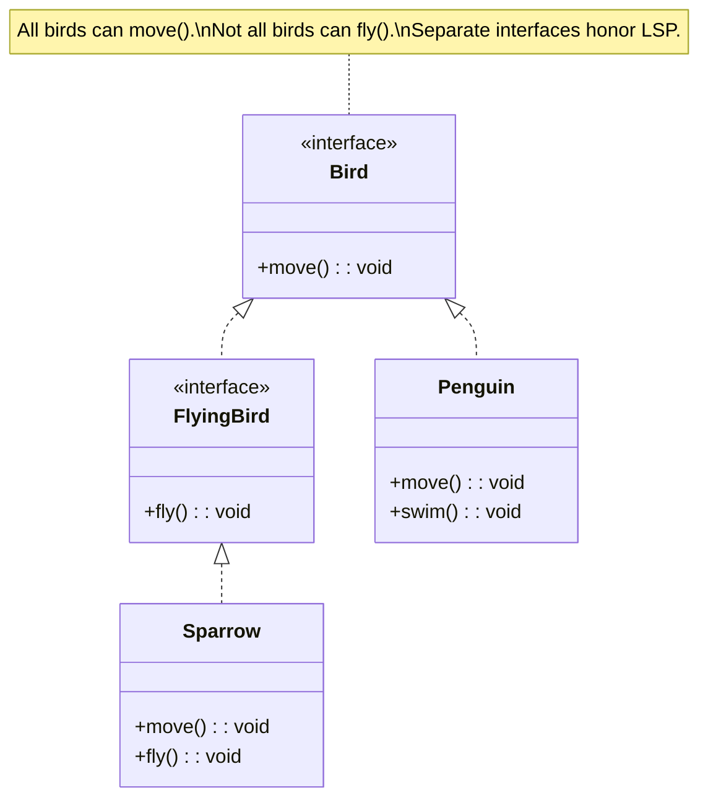

# Liskov Substitution Principle (LSP)

## Introduction

The **Liskov Substitution Principle** states that objects of a superclass should be replaceable with objects of a subclass without altering the correctness of the program. If class `B` is a subclass of class `A`, then wherever `A` is used, `B` should work without surprises — no unexpected exceptions, no violated invariants, no weakened postconditions.

Barbara Liskov formally defined this in 1987: "If for each object `o1` of type `S` there is an object `o2` of type `T` such that for all programs `P` defined in terms of `T`, the behavior of `P` is unchanged when `o1` is substituted for `o2`, then `S` is a subtype of `T`."

Violations of LSP often manifest as `if isinstance(...)` checks scattered through client code, unexpected `NotImplementedError` raises, or subclasses that silently change the contract of the parent.

## Intent

- Ensure subclasses honor the behavioral contract of their parent class.
- Enable polymorphism without surprises — clients should work with any subtype identically.
- Prevent fragile inheritance hierarchies where subclasses break parent expectations.

## Diagram



## Key Characteristics

- **Behavioral compatibility**: Subclasses must satisfy the same preconditions, postconditions, and invariants as the parent
- **No surprise exceptions**: A subclass should not throw exceptions that the parent does not specify
- **Covariant return types**: A subclass may return a more specific type, but not a less specific one
- **Contravariant parameters**: A subclass may accept broader inputs, but not narrower ones
- **History constraint**: A subclass should not allow state changes that the parent forbids
- **Design-by-contract**: LSP is the OOP embodiment of contract-based programming

---

## Example 1: Fintech — Account Types

**Problem (Violating LSP):** A base `Account` class has a `withdraw` method. `SavingsAccount` subclass restricts withdrawals to 6 per month. Client code using `Account` does not expect this restriction, leading to runtime surprises.

**Solution (Applying LSP):** Restructure the hierarchy so that `WithdrawableAccount` and `LimitedWithdrawalAccount` are separate interfaces, making constraints explicit.

```python
from abc import ABC, abstractmethod


# ❌ BEFORE: Violating LSP
class AccountBad:
    def __init__(self, balance: float):
        self.balance = balance

    def withdraw(self, amount: float):
        if amount > self.balance:
            raise ValueError("Insufficient funds")
        self.balance -= amount


class SavingsAccountBad(AccountBad):
    def __init__(self, balance: float):
        super().__init__(balance)
        self.withdrawal_count = 0

    def withdraw(self, amount: float):
        if self.withdrawal_count >= 6:
            raise Exception("Monthly withdrawal limit reached!")  # ❌ Surprise!
        super().withdraw(amount)
        self.withdrawal_count += 1


# ✅ AFTER: Applying LSP — explicit contracts
class Account(ABC):
    def __init__(self, account_id: str, balance: float):
        self.account_id = account_id
        self.balance = balance

    @abstractmethod
    def deposit(self, amount: float) -> float: ...

    @abstractmethod
    def get_balance(self) -> float: ...


class WithdrawableAccount(Account):
    """Accounts that support unlimited withdrawals."""

    def deposit(self, amount: float) -> float:
        self.balance += amount
        return self.balance

    def get_balance(self) -> float:
        return self.balance

    def withdraw(self, amount: float) -> float:
        if amount <= 0:
            raise ValueError("Amount must be positive.")
        if amount > self.balance:
            raise ValueError("Insufficient funds.")
        self.balance -= amount
        return self.balance


class CheckingAccount(WithdrawableAccount):
    """Unlimited withdrawals — fully substitutable for WithdrawableAccount."""
    pass


class LimitedWithdrawalAccount(Account):
    """Accounts with explicit withdrawal limits — different contract."""

    def __init__(self, account_id: str, balance: float, max_withdrawals: int = 6):
        super().__init__(account_id, balance)
        self.max_withdrawals = max_withdrawals
        self.withdrawal_count = 0

    def deposit(self, amount: float) -> float:
        self.balance += amount
        return self.balance

    def get_balance(self) -> float:
        return self.balance

    def can_withdraw(self) -> bool:
        return self.withdrawal_count < self.max_withdrawals

    def withdraw(self, amount: float) -> float:
        if not self.can_withdraw():
            raise ValueError(f"Monthly limit of {self.max_withdrawals} withdrawals reached.")
        if amount > self.balance:
            raise ValueError("Insufficient funds.")
        self.balance -= amount
        self.withdrawal_count += 1
        return self.balance


class SavingsAccount(LimitedWithdrawalAccount):
    """Savings — substitutable for LimitedWithdrawalAccount. Clients know about limits."""

    def __init__(self, account_id: str, balance: float):
        super().__init__(account_id, balance, max_withdrawals=6)


# Client code works safely with the proper type
def process_withdrawals(account: WithdrawableAccount, amounts: list[float]):
    """Works with any WithdrawableAccount — no surprises."""
    for amt in amounts:
        balance = account.withdraw(amt)
        print(f"Withdrew ${amt:.2f}, balance: ${balance:.2f}")


checking = CheckingAccount("CHK-001", 5000.0)
process_withdrawals(checking, [100, 200, 300, 50, 75, 100, 200])  # All work fine

savings = SavingsAccount("SAV-001", 5000.0)
# savings is NOT a WithdrawableAccount — clients who need unlimited withdrawals won't get it
print(f"Can withdraw from savings? {savings.can_withdraw()}")
savings.withdraw(100)
```

```go
package main

import "fmt"

// Proper hierarchy honoring LSP
type Account interface {
	Deposit(amount float64) float64
	GetBalance() float64
}

type WithdrawableAccount interface {
	Account
	Withdraw(amount float64) (float64, error)
}

type LimitedWithdrawalAccount interface {
	Account
	CanWithdraw() bool
	Withdraw(amount float64) (float64, error)
}

type CheckingAccount struct {
	ID      string
	Balance float64
}

func (a *CheckingAccount) Deposit(amount float64) float64  { a.Balance += amount; return a.Balance }
func (a *CheckingAccount) GetBalance() float64             { return a.Balance }
func (a *CheckingAccount) Withdraw(amount float64) (float64, error) {
	if amount > a.Balance {
		return a.Balance, fmt.Errorf("insufficient funds")
	}
	a.Balance -= amount
	return a.Balance, nil
}

type SavingsAccount struct {
	ID              string
	Balance         float64
	MaxWithdrawals  int
	WithdrawalCount int
}

func (a *SavingsAccount) Deposit(amount float64) float64 { a.Balance += amount; return a.Balance }
func (a *SavingsAccount) GetBalance() float64            { return a.Balance }
func (a *SavingsAccount) CanWithdraw() bool              { return a.WithdrawalCount < a.MaxWithdrawals }
func (a *SavingsAccount) Withdraw(amount float64) (float64, error) {
	if !a.CanWithdraw() {
		return a.Balance, fmt.Errorf("monthly limit reached")
	}
	if amount > a.Balance {
		return a.Balance, fmt.Errorf("insufficient funds")
	}
	a.Balance -= amount
	a.WithdrawalCount++
	return a.Balance, nil
}

// Client code uses the proper interface
func ProcessWithdrawals(acc WithdrawableAccount, amounts []float64) {
	for _, amt := range amounts {
		bal, err := acc.Withdraw(amt)
		if err != nil {
			fmt.Printf("Error: %s\n", err)
			return
		}
		fmt.Printf("Withdrew $%.2f, balance: $%.2f\n", amt, bal)
	}
}

func main() {
	checking := &CheckingAccount{ID: "CHK-001", Balance: 5000}
	ProcessWithdrawals(checking, []float64{100, 200, 300})
}
```

```java
// Proper class hierarchy honoring LSP
interface Account {
    double deposit(double amount);
    double getBalance();
}

interface WithdrawableAccount extends Account {
    double withdraw(double amount);
}

interface LimitedWithdrawalAccount extends Account {
    boolean canWithdraw();
    double withdraw(double amount);
}

class CheckingAccount implements WithdrawableAccount {
    private double balance;

    CheckingAccount(double balance) { this.balance = balance; }

    public double deposit(double amount) { balance += amount; return balance; }
    public double getBalance() { return balance; }

    public double withdraw(double amount) {
        if (amount > balance) throw new IllegalArgumentException("Insufficient funds.");
        balance -= amount;
        return balance;
    }
}

class SavingsAccount implements LimitedWithdrawalAccount {
    private double balance;
    private int maxWithdrawals;
    private int withdrawalCount = 0;

    SavingsAccount(double balance, int maxWithdrawals) {
        this.balance = balance;
        this.maxWithdrawals = maxWithdrawals;
    }

    public double deposit(double amount) { balance += amount; return balance; }
    public double getBalance() { return balance; }
    public boolean canWithdraw() { return withdrawalCount < maxWithdrawals; }

    public double withdraw(double amount) {
        if (!canWithdraw()) throw new IllegalStateException("Monthly limit reached.");
        if (amount > balance) throw new IllegalArgumentException("Insufficient funds.");
        balance -= amount;
        withdrawalCount++;
        return balance;
    }
}
```

```typescript
interface Account {
  deposit(amount: number): number;
  getBalance(): number;
}

interface WithdrawableAccount extends Account {
  withdraw(amount: number): number;
}

interface LimitedWithdrawalAccount extends Account {
  canWithdraw(): boolean;
  withdraw(amount: number): number;
}

class CheckingAccount implements WithdrawableAccount {
  constructor(public readonly id: string, private balance: number) {}

  deposit(amount: number) {
    this.balance += amount;
    return this.balance;
  }
  getBalance() {
    return this.balance;
  }

  withdraw(amount: number) {
    if (amount > this.balance) throw new Error("Insufficient funds.");
    this.balance -= amount;
    return this.balance;
  }
}

class SavingsAccount implements LimitedWithdrawalAccount {
  private withdrawalCount = 0;

  constructor(
    public readonly id: string,
    private balance: number,
    private maxWithdrawals = 6,
  ) {}

  deposit(amount: number) {
    this.balance += amount;
    return this.balance;
  }
  getBalance() {
    return this.balance;
  }
  canWithdraw() {
    return this.withdrawalCount < this.maxWithdrawals;
  }

  withdraw(amount: number) {
    if (!this.canWithdraw()) throw new Error("Monthly limit reached.");
    if (amount > this.balance) throw new Error("Insufficient funds.");
    this.balance -= amount;
    this.withdrawalCount++;
    return this.balance;
  }
}

// Client function works with WithdrawableAccount — no surprises
function processWithdrawals(acc: WithdrawableAccount, amounts: number[]) {
  for (const amt of amounts) {
    console.log(`Withdrew $${amt}, balance: $${acc.withdraw(amt)}`);
  }
}
```

```rust
trait Account {
    fn deposit(&mut self, amount: f64) -> f64;
    fn get_balance(&self) -> f64;
}

trait WithdrawableAccount: Account {
    fn withdraw(&mut self, amount: f64) -> Result<f64, String>;
}

struct CheckingAccount { id: String, balance: f64 }

impl Account for CheckingAccount {
    fn deposit(&mut self, amount: f64) -> f64 { self.balance += amount; self.balance }
    fn get_balance(&self) -> f64 { self.balance }
}

impl WithdrawableAccount for CheckingAccount {
    fn withdraw(&mut self, amount: f64) -> Result<f64, String> {
        if amount > self.balance { return Err("Insufficient funds.".into()); }
        self.balance -= amount;
        Ok(self.balance)
    }
}

struct SavingsAccount { id: String, balance: f64, max_withdrawals: i32, count: i32 }

impl Account for SavingsAccount {
    fn deposit(&mut self, amount: f64) -> f64 { self.balance += amount; self.balance }
    fn get_balance(&self) -> f64 { self.balance }
}

impl SavingsAccount {
    fn can_withdraw(&self) -> bool { self.count < self.max_withdrawals }

    fn withdraw(&mut self, amount: f64) -> Result<f64, String> {
        if !self.can_withdraw() { return Err("Monthly limit reached.".into()); }
        if amount > self.balance { return Err("Insufficient funds.".into()); }
        self.balance -= amount;
        self.count += 1;
        Ok(self.balance)
    }
}

fn process_withdrawals(acc: &mut dyn WithdrawableAccount, amounts: &[f64]) {
    for &amt in amounts {
        match acc.withdraw(amt) {
            Ok(bal) => println!("Withdrew ${:.2}, balance: ${:.2}", amt, bal),
            Err(e) => println!("Error: {}", e),
        }
    }
}

fn main() {
    let mut checking = CheckingAccount { id: "CHK-001".into(), balance: 5000.0 };
    process_withdrawals(&mut checking, &[100.0, 200.0, 300.0]);
}
```

---

## Example 2: Healthcare — Medical Document Rendering

**Problem (Violating LSP):** A base `MedicalDocument` class has a `render` method that returns HTML. A `LabResultDocument` subclass overrides `render` to return JSON instead, breaking client code that expects HTML output.

**Solution (Applying LSP):** All `MedicalDocument` subtypes must honor the contract of returning valid HTML from `render`. If JSON output is needed, it should be a different method or a different type entirely.

```python
from abc import ABC, abstractmethod


# ✅ Proper LSP-compliant hierarchy
class MedicalDocument(ABC):
    """Contract: render() returns valid HTML string. All subtypes must honor this."""

    @abstractmethod
    def render(self) -> str:
        """Must return valid HTML."""
        ...

    @abstractmethod
    def get_title(self) -> str: ...


class DischargeSummary(MedicalDocument):
    def __init__(self, patient: str, diagnosis: str, instructions: str):
        self.patient = patient
        self.diagnosis = diagnosis
        self.instructions = instructions

    def get_title(self) -> str:
        return f"Discharge Summary — {self.patient}"

    def render(self) -> str:
        return (
            f"<div class='discharge-summary'>"
            f"<h1>{self.get_title()}</h1>"
            f"<p><strong>Diagnosis:</strong> {self.diagnosis}</p>"
            f"<p><strong>Instructions:</strong> {self.instructions}</p>"
            f"</div>"
        )


class LabResult(MedicalDocument):
    def __init__(self, patient: str, test_name: str, value: str, unit: str, reference: str):
        self.patient = patient
        self.test_name = test_name
        self.value = value
        self.unit = unit
        self.reference = reference

    def get_title(self) -> str:
        return f"Lab Result — {self.test_name}"

    def render(self) -> str:
        """Honors the contract — returns HTML, not JSON."""
        return (
            f"<div class='lab-result'>"
            f"<h2>{self.get_title()}</h2>"
            f"<table>"
            f"<tr><td>Patient</td><td>{self.patient}</td></tr>"
            f"<tr><td>Value</td><td>{self.value} {self.unit}</td></tr>"
            f"<tr><td>Reference</td><td>{self.reference}</td></tr>"
            f"</table>"
            f"</div>"
        )

    def to_json(self) -> dict:
        """Separate method for JSON — doesn't violate render()'s contract."""
        return {
            "patient": self.patient,
            "test": self.test_name,
            "value": self.value,
            "unit": self.unit,
            "reference": self.reference,
        }


class Prescription(MedicalDocument):
    def __init__(self, patient: str, medication: str, dosage: str):
        self.patient = patient
        self.medication = medication
        self.dosage = dosage

    def get_title(self) -> str:
        return f"Prescription — {self.medication}"

    def render(self) -> str:
        return (
            f"<div class='prescription'>"
            f"<h2>{self.get_title()}</h2>"
            f"<p>Patient: {self.patient}</p>"
            f"<p>Medication: {self.medication}, Dosage: {self.dosage}</p>"
            f"</div>"
        )


# Client code — works with ANY MedicalDocument. All render() calls return HTML.
def render_documents(docs: list[MedicalDocument]) -> str:
    html_parts = [f"<html><body>"]
    for doc in docs:
        html_parts.append(doc.render())  # No surprises — always HTML
    html_parts.append("</body></html>")
    return "\n".join(html_parts)


docs = [
    DischargeSummary("Jane Doe", "Type 2 Diabetes", "Follow up in 2 weeks"),
    LabResult("Jane Doe", "HbA1c", "6.5", "%", "< 7.0"),
    Prescription("Jane Doe", "Metformin", "500mg twice daily"),
]

print(render_documents(docs))
```

```go
package main

import "fmt"

type MedicalDocument interface {
	Render() string // Contract: always returns valid HTML
	GetTitle() string
}

type DischargeSummary struct {
	Patient, Diagnosis, Instructions string
}

func (d DischargeSummary) GetTitle() string { return "Discharge Summary — " + d.Patient }
func (d DischargeSummary) Render() string {
	return fmt.Sprintf("<div class='discharge'><h1>%s</h1><p>%s</p></div>", d.GetTitle(), d.Diagnosis)
}

type LabResult struct {
	Patient, TestName, Value, Unit string
}

func (l LabResult) GetTitle() string { return "Lab Result — " + l.TestName }
func (l LabResult) Render() string {
	return fmt.Sprintf("<div class='lab'><h2>%s</h2><p>%s %s</p></div>", l.GetTitle(), l.Value, l.Unit)
}

func RenderDocuments(docs []MedicalDocument) string {
	html := "<html><body>"
	for _, doc := range docs {
		html += doc.Render() // All return HTML — LSP honored
	}
	return html + "</body></html>"
}

func main() {
	docs := []MedicalDocument{
		DischargeSummary{"Jane Doe", "Diabetes", "Follow up"},
		LabResult{"Jane Doe", "HbA1c", "6.5", "%"},
	}
	fmt.Println(RenderDocuments(docs))
}
```

```java
interface MedicalDocument {
    String render();   // Contract: always returns valid HTML
    String getTitle();
}

class DischargeSummary implements MedicalDocument {
    private final String patient, diagnosis;

    DischargeSummary(String patient, String diagnosis) {
        this.patient = patient; this.diagnosis = diagnosis;
    }

    public String getTitle() { return "Discharge Summary — " + patient; }

    public String render() {
        return String.format("<div><h1>%s</h1><p>%s</p></div>", getTitle(), diagnosis);
    }
}

class LabResult implements MedicalDocument {
    private final String patient, testName, value, unit;

    LabResult(String patient, String testName, String value, String unit) {
        this.patient = patient; this.testName = testName; this.value = value; this.unit = unit;
    }

    public String getTitle() { return "Lab Result — " + testName; }

    public String render() {
        return String.format("<div><h2>%s</h2><p>%s %s</p></div>", getTitle(), value, unit);
    }
}
```

```typescript
interface MedicalDocument {
  render(): string; // Contract: always returns valid HTML
  getTitle(): string;
}

class DischargeSummary implements MedicalDocument {
  constructor(private patient: string, private diagnosis: string) {}
  getTitle() {
    return `Discharge Summary — ${this.patient}`;
  }
  render() {
    return `<div><h1>${this.getTitle()}</h1><p>${this.diagnosis}</p></div>`;
  }
}

class LabResult implements MedicalDocument {
  constructor(
    private patient: string,
    private testName: string,
    private value: string,
    private unit: string,
  ) {}
  getTitle() {
    return `Lab Result — ${this.testName}`;
  }
  render() {
    return `<div><h2>${this.getTitle()}</h2><p>${this.value} ${
      this.unit
    }</p></div>`;
  }
}

function renderDocuments(docs: MedicalDocument[]): string {
  return (
    "<html><body>" + docs.map((d) => d.render()).join("") + "</body></html>"
  );
}
```

```rust
trait MedicalDocument {
    fn render(&self) -> String; // Contract: always HTML
    fn get_title(&self) -> String;
}

struct DischargeSummary { patient: String, diagnosis: String }

impl MedicalDocument for DischargeSummary {
    fn get_title(&self) -> String { format!("Discharge — {}", self.patient) }
    fn render(&self) -> String {
        format!("<div><h1>{}</h1><p>{}</p></div>", self.get_title(), self.diagnosis)
    }
}

struct LabResult { patient: String, test_name: String, value: String, unit: String }

impl MedicalDocument for LabResult {
    fn get_title(&self) -> String { format!("Lab — {}", self.test_name) }
    fn render(&self) -> String {
        format!("<div><h2>{}</h2><p>{} {}</p></div>", self.get_title(), self.value, self.unit)
    }
}

fn render_documents(docs: &[&dyn MedicalDocument]) -> String {
    let body: String = docs.iter().map(|d| d.render()).collect();
    format!("<html><body>{}</body></html>", body)
}

fn main() {
    let ds = DischargeSummary { patient: "Jane Doe".into(), diagnosis: "Diabetes".into() };
    let lr = LabResult { patient: "Jane Doe".into(), test_name: "HbA1c".into(), value: "6.5".into(), unit: "%".into() };
    println!("{}", render_documents(&[&ds, &lr]));
}
```
