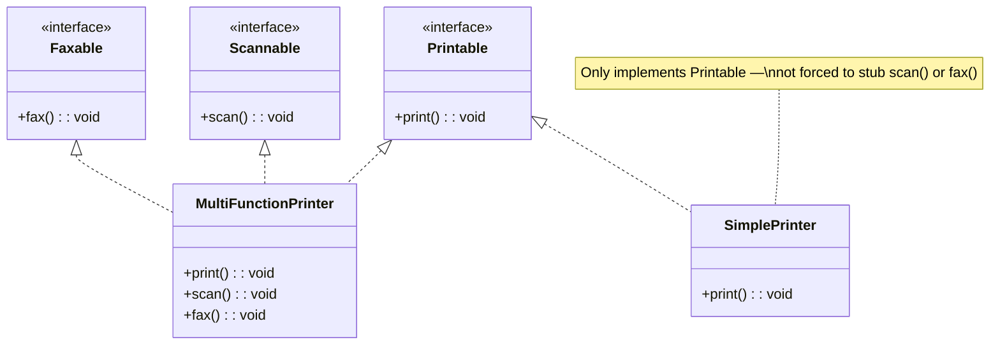

# Interface Segregation Principle (ISP)

## Introduction

The **Interface Segregation Principle** states that no client should be forced to depend on methods it does not use. Instead of one large, "fat" interface, prefer many small, focused interfaces so that implementing classes only need to know about the methods that are relevant to them.

ISP is often violated when a single interface accumulates responsibilities over time — new methods get tacked on and every implementer must provide a body (even if it's a no-op or throws `UnsupportedOperationException`). This creates fragile hierarchies where a change to an unused method ripples to unrelated classes.

## Intent

- Keep interfaces small, cohesive, and role-specific.
- Prevent classes from implementing methods that are irrelevant to their role.
- Reduce coupling — clients depend only on the slice of behavior they actually use.
- Enable easier testing, mocking, and independent evolution of concerns.

## Diagram



## Key Characteristics

- **Role interfaces**: Each interface represents one role or capability
- **Client-specific**: Interfaces are designed from the client's perspective, not the implementer's
- **Cohesion**: Methods in an interface are used together by the same clients
- **Composability**: Classes can implement multiple small interfaces to combine capabilities
- **Decoupling**: Changes to one interface don't affect clients of other interfaces
- **Testability**: Small interfaces are easy to mock and test in isolation

---

## Example 1: Fintech — Payment Gateway

**Problem (Violating ISP):** A single `PaymentProcessor` interface requires `processPayment`, `refund`, `generateInvoice`, `sendReceipt`, and `schedulePayout`. A simple card-charge service must implement all five, even though it only processes payments.

**Solution (Applying ISP):** Split into focused interfaces: `Chargeable`, `Refundable`, `Invoiceable`, `ReceiptSender`, `PayoutScheduler`. Each service implements only what it needs.

```python
from abc import ABC, abstractmethod
from dataclasses import dataclass


# ❌ BEFORE: Fat interface — every implementer must provide everything
class FatPaymentProcessor(ABC):
    @abstractmethod
    def process_payment(self, amount: float) -> str: ...
    @abstractmethod
    def refund(self, transaction_id: str) -> str: ...
    @abstractmethod
    def generate_invoice(self, transaction_id: str) -> str: ...
    @abstractmethod
    def send_receipt(self, transaction_id: str, email: str) -> None: ...
    @abstractmethod
    def schedule_payout(self, merchant_id: str, amount: float) -> str: ...


# ✅ AFTER: Segregated interfaces
class Chargeable(ABC):
    @abstractmethod
    def process_payment(self, amount: float, currency: str) -> str: ...


class Refundable(ABC):
    @abstractmethod
    def refund(self, transaction_id: str, amount: float) -> str: ...


class Invoiceable(ABC):
    @abstractmethod
    def generate_invoice(self, transaction_id: str) -> dict: ...


class ReceiptSender(ABC):
    @abstractmethod
    def send_receipt(self, transaction_id: str, email: str) -> None: ...


class PayoutScheduler(ABC):
    @abstractmethod
    def schedule_payout(self, merchant_id: str, amount: float) -> str: ...


# Simple card charger — only implements what it needs
class CardCharger(Chargeable):
    def process_payment(self, amount: float, currency: str) -> str:
        tx_id = f"TXN-{id(self)}-{amount}"
        print(f"Charged ${amount:.2f} {currency}")
        return tx_id


# Full-featured processor — implements all relevant interfaces
class FullPaymentService(Chargeable, Refundable, Invoiceable, ReceiptSender):
    def __init__(self):
        self.transactions: dict[str, float] = {}

    def process_payment(self, amount: float, currency: str) -> str:
        tx_id = f"TXN-{id(self)}-{amount}"
        self.transactions[tx_id] = amount
        print(f"Processed ${amount:.2f} {currency}")
        return tx_id

    def refund(self, transaction_id: str, amount: float) -> str:
        print(f"Refunded ${amount:.2f} for {transaction_id}")
        return f"REF-{transaction_id}"

    def generate_invoice(self, transaction_id: str) -> dict:
        return {"tx": transaction_id, "amount": self.transactions.get(transaction_id, 0)}

    def send_receipt(self, transaction_id: str, email: str) -> None:
        print(f"Receipt for {transaction_id} sent to {email}")


# Client code depends ONLY on the interface it needs
def charge_customer(processor: Chargeable, amount: float):
    tx_id = processor.process_payment(amount, "USD")
    print(f"Charge complete: {tx_id}")


def issue_refund(processor: Refundable, tx_id: str, amount: float):
    ref_id = processor.refund(tx_id, amount)
    print(f"Refund issued: {ref_id}")


card = CardCharger()
charge_customer(card, 49.99)  # Works — CardCharger is Chargeable

full = FullPaymentService()
charge_customer(full, 149.99)
issue_refund(full, "TXN-123", 149.99)
```

```go
package main

import "fmt"

// Segregated interfaces
type Chargeable interface {
	ProcessPayment(amount float64, currency string) string
}

type Refundable interface {
	Refund(transactionID string, amount float64) string
}

type Invoiceable interface {
	GenerateInvoice(transactionID string) map[string]interface{}
}

// Simple implementation — only Chargeable
type CardCharger struct{}

func (c *CardCharger) ProcessPayment(amount float64, currency string) string {
	txID := fmt.Sprintf("TXN-CARD-%.0f", amount*100)
	fmt.Printf("Charged $%.2f %s\n", amount, currency)
	return txID
}

// Full service — implements multiple interfaces
type FullPaymentService struct {
	Transactions map[string]float64
}

func (f *FullPaymentService) ProcessPayment(amount float64, currency string) string {
	txID := fmt.Sprintf("TXN-FULL-%.0f", amount*100)
	f.Transactions[txID] = amount
	return txID
}

func (f *FullPaymentService) Refund(txID string, amount float64) string {
	return fmt.Sprintf("REF-%s", txID)
}

func (f *FullPaymentService) GenerateInvoice(txID string) map[string]interface{} {
	return map[string]interface{}{"tx": txID, "amount": f.Transactions[txID]}
}

// Client depends only on Chargeable
func ChargeCustomer(p Chargeable, amount float64) {
	txID := p.ProcessPayment(amount, "USD")
	fmt.Printf("Charge complete: %s\n", txID)
}

func main() {
	card := &CardCharger{}
	ChargeCustomer(card, 49.99)

	full := &FullPaymentService{Transactions: make(map[string]float64)}
	ChargeCustomer(full, 149.99)
}
```

```java
// Segregated interfaces
interface Chargeable {
    String processPayment(double amount, String currency);
}

interface Refundable {
    String refund(String transactionId, double amount);
}

interface Invoiceable {
    Map<String, Object> generateInvoice(String transactionId);
}

// Simple card charger — only implements Chargeable
class CardCharger implements Chargeable {
    public String processPayment(double amount, String currency) {
        String txId = "TXN-CARD-" + (int)(amount * 100);
        System.out.printf("Charged $%.2f %s%n", amount, currency);
        return txId;
    }
}

// Full service — implements what it actually supports
class FullPaymentService implements Chargeable, Refundable, Invoiceable {
    private Map<String, Double> transactions = new HashMap<>();

    public String processPayment(double amount, String currency) {
        String txId = "TXN-FULL-" + (int)(amount * 100);
        transactions.put(txId, amount);
        return txId;
    }

    public String refund(String txId, double amount) {
        return "REF-" + txId;
    }

    public Map<String, Object> generateInvoice(String txId) {
        return Map.of("tx", txId, "amount", transactions.getOrDefault(txId, 0.0));
    }
}
```

```typescript
// Segregated interfaces
interface Chargeable {
  processPayment(amount: number, currency: string): string;
}

interface Refundable {
  refund(transactionId: string, amount: number): string;
}

interface Invoiceable {
  generateInvoice(transactionId: string): Record<string, unknown>;
}

// Simple charger — only Chargeable
class CardCharger implements Chargeable {
  processPayment(amount: number, currency: string): string {
    const txId = `TXN-CARD-${Math.round(amount * 100)}`;
    console.log(`Charged $${amount.toFixed(2)} ${currency}`);
    return txId;
  }
}

// Full service — composes multiple interfaces
class FullPaymentService implements Chargeable, Refundable, Invoiceable {
  private transactions = new Map<string, number>();

  processPayment(amount: number, currency: string): string {
    const txId = `TXN-FULL-${Math.round(amount * 100)}`;
    this.transactions.set(txId, amount);
    return txId;
  }

  refund(transactionId: string, amount: number): string {
    return `REF-${transactionId}`;
  }

  generateInvoice(transactionId: string): Record<string, unknown> {
    return {
      tx: transactionId,
      amount: this.transactions.get(transactionId) ?? 0,
    };
  }
}

// Client depends only on Chargeable
function chargeCustomer(processor: Chargeable, amount: number) {
  const txId = processor.processPayment(amount, "USD");
  console.log(`Charge complete: ${txId}`);
}
```

```rust
trait Chargeable {
    fn process_payment(&mut self, amount: f64, currency: &str) -> String;
}

trait Refundable {
    fn refund(&self, transaction_id: &str, amount: f64) -> String;
}

struct CardCharger;

impl Chargeable for CardCharger {
    fn process_payment(&mut self, amount: f64, currency: &str) -> String {
        let tx_id = format!("TXN-CARD-{}", (amount * 100.0) as i64);
        println!("Charged ${:.2} {}", amount, currency);
        tx_id
    }
}

struct FullPaymentService {
    transactions: std::collections::HashMap<String, f64>,
}

impl Chargeable for FullPaymentService {
    fn process_payment(&mut self, amount: f64, currency: &str) -> String {
        let tx_id = format!("TXN-FULL-{}", (amount * 100.0) as i64);
        self.transactions.insert(tx_id.clone(), amount);
        tx_id
    }
}

impl Refundable for FullPaymentService {
    fn refund(&self, transaction_id: &str, amount: f64) -> String {
        format!("REF-{}", transaction_id)
    }
}

fn charge_customer(processor: &mut dyn Chargeable, amount: f64) {
    let tx_id = processor.process_payment(amount, "USD");
    println!("Charge complete: {}", tx_id);
}

fn main() {
    let mut card = CardCharger;
    charge_customer(&mut card, 49.99);

    let mut full = FullPaymentService { transactions: std::collections::HashMap::new() };
    charge_customer(&mut full, 149.99);
}
```

---

## Example 2: Healthcare — Clinical Workflow Interfaces

**Problem (Violating ISP):** A `ClinicalSystem` interface has `admitPatient`, `prescribeMedication`, `orderLabTest`, `readRadiology`, and `dischargePatient`. A lab system only orders tests—but must implement all five methods, stubbing out the rest.

**Solution (Applying ISP):** Split into `AdmissionService`, `PrescriptionService`, `LabOrderService`, `RadiologyService`, `DischargeService`. Each system implements only its relevant interface(s).

```python
from abc import ABC, abstractmethod
from dataclasses import dataclass, field
from datetime import datetime


@dataclass
class Patient:
    id: str
    name: str


# ✅ Segregated interfaces
class AdmissionService(ABC):
    @abstractmethod
    def admit_patient(self, patient: Patient, ward: str) -> str: ...


class PrescriptionService(ABC):
    @abstractmethod
    def prescribe(self, patient_id: str, medication: str, dosage: str) -> str: ...


class LabOrderService(ABC):
    @abstractmethod
    def order_lab_test(self, patient_id: str, test_name: str) -> str: ...


class RadiologyService(ABC):
    @abstractmethod
    def order_imaging(self, patient_id: str, modality: str, body_part: str) -> str: ...


class DischargeService(ABC):
    @abstractmethod
    def discharge_patient(self, patient_id: str, summary: str) -> str: ...


# Lab system — only LabOrderService
class HospitalLabSystem(LabOrderService):
    def __init__(self):
        self.orders: list[dict] = []

    def order_lab_test(self, patient_id: str, test_name: str) -> str:
        order_id = f"LAB-{len(self.orders)+1:04d}"
        self.orders.append({
            "order_id": order_id,
            "patient_id": patient_id,
            "test": test_name,
            "ordered_at": datetime.now().isoformat(),
        })
        print(f"Lab order {order_id}: {test_name} for patient {patient_id}")
        return order_id


# Admission desk — only AdmissionService and DischargeService
class AdmissionDesk(AdmissionService, DischargeService):
    def __init__(self):
        self.admitted: dict[str, str] = {}

    def admit_patient(self, patient: Patient, ward: str) -> str:
        admission_id = f"ADM-{patient.id}"
        self.admitted[patient.id] = ward
        print(f"Admitted {patient.name} to {ward}")
        return admission_id

    def discharge_patient(self, patient_id: str, summary: str) -> str:
        ward = self.admitted.pop(patient_id, "unknown")
        discharge_id = f"DIS-{patient_id}"
        print(f"Discharged {patient_id} from {ward}: {summary}")
        return discharge_id


# Pharmacy — only PrescriptionService
class PharmacySystem(PrescriptionService):
    def prescribe(self, patient_id: str, medication: str, dosage: str) -> str:
        rx_id = f"RX-{patient_id}-{medication[:3].upper()}"
        print(f"Prescribed {medication} {dosage} for patient {patient_id}")
        return rx_id


# Client code — depends on exactly the interface it needs
def run_lab_workflow(lab: LabOrderService, patient_id: str):
    lab.order_lab_test(patient_id, "CBC")
    lab.order_lab_test(patient_id, "BMP")


def run_admission(desk: AdmissionService, patient: Patient):
    desk.admit_patient(patient, "Ward-3A")


lab = HospitalLabSystem()
run_lab_workflow(lab, "P-12345")

desk = AdmissionDesk()
run_admission(desk, Patient("P-12345", "Jane Doe"))
```

```go
package main

import "fmt"

type AdmissionService interface {
	AdmitPatient(patientID, ward string) string
}

type LabOrderService interface {
	OrderLabTest(patientID, testName string) string
}

type DischargeService interface {
	DischargePatient(patientID, summary string) string
}

type HospitalLabSystem struct {
	OrderCount int
}

func (l *HospitalLabSystem) OrderLabTest(patientID, testName string) string {
	l.OrderCount++
	orderID := fmt.Sprintf("LAB-%04d", l.OrderCount)
	fmt.Printf("Lab order %s: %s for %s\n", orderID, testName, patientID)
	return orderID
}

type AdmissionDesk struct {
	Admitted map[string]string
}

func (a *AdmissionDesk) AdmitPatient(patientID, ward string) string {
	a.Admitted[patientID] = ward
	return "ADM-" + patientID
}

func (a *AdmissionDesk) DischargePatient(patientID, summary string) string {
	delete(a.Admitted, patientID)
	return "DIS-" + patientID
}

func RunLabWorkflow(lab LabOrderService, patientID string) {
	lab.OrderLabTest(patientID, "CBC")
	lab.OrderLabTest(patientID, "BMP")
}

func main() {
	lab := &HospitalLabSystem{}
	RunLabWorkflow(lab, "P-12345")

	desk := &AdmissionDesk{Admitted: make(map[string]string)}
	desk.AdmitPatient("P-12345", "Ward-3A")
}
```

```java
interface AdmissionService {
    String admitPatient(String patientId, String ward);
}

interface LabOrderService {
    String orderLabTest(String patientId, String testName);
}

interface DischargeService {
    String dischargePatient(String patientId, String summary);
}

class HospitalLabSystem implements LabOrderService {
    private int orderCount = 0;

    public String orderLabTest(String patientId, String testName) {
        String orderId = String.format("LAB-%04d", ++orderCount);
        System.out.printf("Lab order %s: %s for %s%n", orderId, testName, patientId);
        return orderId;
    }
}

class AdmissionDesk implements AdmissionService, DischargeService {
    private Map<String, String> admitted = new HashMap<>();

    public String admitPatient(String patientId, String ward) {
        admitted.put(patientId, ward);
        return "ADM-" + patientId;
    }

    public String dischargePatient(String patientId, String summary) {
        admitted.remove(patientId);
        return "DIS-" + patientId;
    }
}
```

```typescript
interface AdmissionService {
  admitPatient(patientId: string, ward: string): string;
}

interface LabOrderService {
  orderLabTest(patientId: string, testName: string): string;
}

interface DischargeService {
  dischargePatient(patientId: string, summary: string): string;
}

class HospitalLabSystem implements LabOrderService {
  private orderCount = 0;

  orderLabTest(patientId: string, testName: string): string {
    const orderId = `LAB-${String(++this.orderCount).padStart(4, "0")}`;
    console.log(`Lab order ${orderId}: ${testName} for ${patientId}`);
    return orderId;
  }
}

class AdmissionDesk implements AdmissionService, DischargeService {
  private admitted = new Map<string, string>();

  admitPatient(patientId: string, ward: string): string {
    this.admitted.set(patientId, ward);
    return `ADM-${patientId}`;
  }

  dischargePatient(patientId: string, summary: string): string {
    this.admitted.delete(patientId);
    return `DIS-${patientId}`;
  }
}

function runLabWorkflow(lab: LabOrderService, patientId: string) {
  lab.orderLabTest(patientId, "CBC");
  lab.orderLabTest(patientId, "BMP");
}
```

```rust
trait LabOrderService {
    fn order_lab_test(&mut self, patient_id: &str, test_name: &str) -> String;
}

trait AdmissionService {
    fn admit_patient(&mut self, patient_id: &str, ward: &str) -> String;
}

trait DischargeService {
    fn discharge_patient(&mut self, patient_id: &str, summary: &str) -> String;
}

struct HospitalLabSystem { order_count: u32 }

impl LabOrderService for HospitalLabSystem {
    fn order_lab_test(&mut self, patient_id: &str, test_name: &str) -> String {
        self.order_count += 1;
        let id = format!("LAB-{:04}", self.order_count);
        println!("Lab order {}: {} for {}", id, test_name, patient_id);
        id
    }
}

struct AdmissionDesk {
    admitted: std::collections::HashMap<String, String>,
}

impl AdmissionService for AdmissionDesk {
    fn admit_patient(&mut self, patient_id: &str, ward: &str) -> String {
        self.admitted.insert(patient_id.to_string(), ward.to_string());
        format!("ADM-{}", patient_id)
    }
}

impl DischargeService for AdmissionDesk {
    fn discharge_patient(&mut self, patient_id: &str, _summary: &str) -> String {
        self.admitted.remove(patient_id);
        format!("DIS-{}", patient_id)
    }
}

fn run_lab_workflow(lab: &mut dyn LabOrderService, patient_id: &str) {
    lab.order_lab_test(patient_id, "CBC");
    lab.order_lab_test(patient_id, "BMP");
}

fn main() {
    let mut lab = HospitalLabSystem { order_count: 0 };
    run_lab_workflow(&mut lab, "P-12345");
}
```
