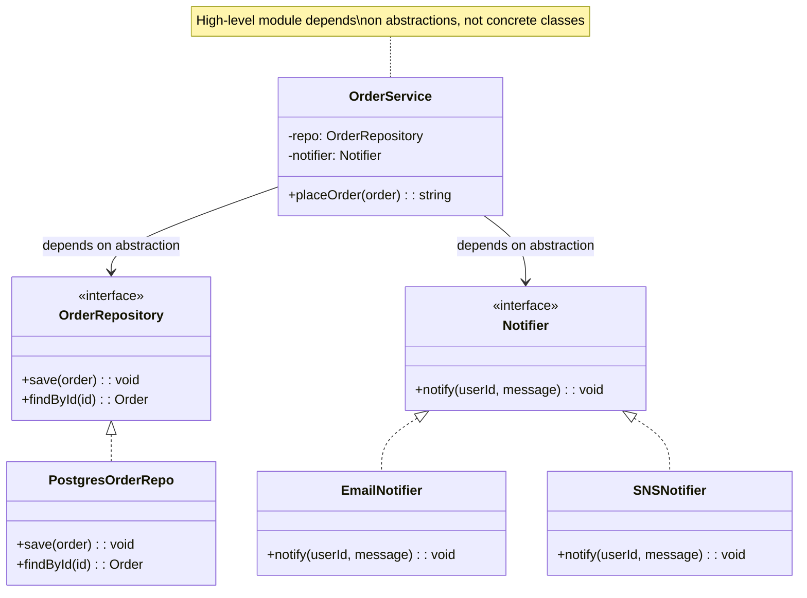

# Dependency Inversion Principle (DIP)

## Introduction

The **Dependency Inversion Principle** states:

1. **High-level modules should not depend on low-level modules. Both should depend on abstractions.**
2. **Abstractions should not depend on details. Details should depend on abstractions.**

In traditional layered architectures, high-level business logic depends directly on low-level infrastructure (databases, APIs, file I/O). DIP flips this relationship: the high-level module defines an abstract interface, and the low-level module implements it. This makes the core business logic portable, testable, and immune to infrastructure changes.

DIP is the principle that enables patterns like Dependency Injection, Repository Pattern, Strategy Pattern, and Hexagonal Architecture.

## Intent

- Decouple high-level business logic from low-level implementation details.
- Allow infrastructure (databases, APIs, messaging) to be swapped without changing business code.
- Make core logic independently testable by injecting mock implementations.
- Establish a clean boundary between "what" (policy) and "how" (mechanism).

## Diagram



## Key Characteristics

- **Abstraction ownership**: The high-level module _owns_ the interface; low-level modules implement it
- **Inversion of control**: The framework/container decides which concrete class to inject
- **Plug-and-play infrastructure**: Swap Postgres for DynamoDB, email for SMS, without touching business logic
- **Testability**: Inject in-memory or mock implementations for fast unit tests
- **Layered boundaries**: Enforces clean architecture boundaries (domain → ports → adapters)
- **Compile-time safety**: Interfaces catch mismatches before runtime

---

## Example 1: Fintech — Trade Execution Service

**Problem (Violating DIP):** A `TradeService` class directly instantiates `PostgresDatabase`, `KafkaPublisher`, and `StripeSettlement` — tightly coupling business logic to infrastructure. Changing the database or message broker requires rewriting `TradeService`.

**Solution (Applying DIP):** `TradeService` depends on `TradeRepository`, `EventPublisher`, and `SettlementGateway` abstractions. Concrete implementations are injected at runtime.

```python
from abc import ABC, abstractmethod
from dataclasses import dataclass
from datetime import datetime
from typing import Optional


@dataclass
class Trade:
    id: str
    symbol: str
    quantity: int
    price: float
    side: str  # "BUY" or "SELL"
    status: str = "PENDING"
    executed_at: Optional[datetime] = None


# ❌ BEFORE: High-level module depends on low-level details
class TradeServiceBad:
    def __init__(self):
        self.db = PostgresDatabase()           # ❌ Concrete dependency
        self.publisher = KafkaPublisher()       # ❌ Concrete dependency
        self.settlement = StripeSettlement()    # ❌ Concrete dependency

    def execute_trade(self, trade):
        self.db.insert("trades", trade)
        self.publisher.publish("trade.executed", trade)
        self.settlement.settle(trade)


# ✅ AFTER: Abstractions (ports)
class TradeRepository(ABC):
    @abstractmethod
    def save(self, trade: Trade) -> None: ...
    @abstractmethod
    def find_by_id(self, trade_id: str) -> Optional[Trade]: ...


class EventPublisher(ABC):
    @abstractmethod
    def publish(self, event_type: str, payload: dict) -> None: ...


class SettlementGateway(ABC):
    @abstractmethod
    def initiate_settlement(self, trade: Trade) -> str: ...


# ✅ High-level module depends only on abstractions
class TradeService:
    def __init__(
        self,
        repo: TradeRepository,
        publisher: EventPublisher,
        settlement: SettlementGateway,
    ):
        self.repo = repo
        self.publisher = publisher
        self.settlement = settlement

    def execute_trade(self, trade: Trade) -> str:
        # Validate
        if trade.quantity <= 0:
            raise ValueError("Quantity must be positive")
        if trade.price <= 0:
            raise ValueError("Price must be positive")

        # Execute
        trade.status = "EXECUTED"
        trade.executed_at = datetime.now()
        self.repo.save(trade)

        # Publish event
        self.publisher.publish("trade.executed", {
            "trade_id": trade.id,
            "symbol": trade.symbol,
            "quantity": trade.quantity,
            "price": trade.price,
            "side": trade.side,
        })

        # Settle
        settlement_id = self.settlement.initiate_settlement(trade)

        return settlement_id


# ✅ Low-level implementations (adapters)
class PostgresTradeRepo(TradeRepository):
    def __init__(self):
        self.storage: dict[str, Trade] = {}

    def save(self, trade: Trade) -> None:
        self.storage[trade.id] = trade
        print(f"[Postgres] Saved trade {trade.id}")

    def find_by_id(self, trade_id: str) -> Optional[Trade]:
        return self.storage.get(trade_id)


class KafkaEventPublisher(EventPublisher):
    def publish(self, event_type: str, payload: dict) -> None:
        print(f"[Kafka] Published {event_type}: {payload}")


class ACHSettlementGateway(SettlementGateway):
    def initiate_settlement(self, trade: Trade) -> str:
        settlement_id = f"STL-{trade.id}"
        total = trade.quantity * trade.price
        print(f"[ACH] Initiated ${total:.2f} settlement: {settlement_id}")
        return settlement_id


# ✅ In-memory implementations for testing
class InMemoryTradeRepo(TradeRepository):
    def __init__(self):
        self.trades: dict[str, Trade] = {}

    def save(self, trade: Trade) -> None:
        self.trades[trade.id] = trade

    def find_by_id(self, trade_id: str) -> Optional[Trade]:
        return self.trades.get(trade_id)


class FakeEventPublisher(EventPublisher):
    def __init__(self):
        self.events: list[tuple[str, dict]] = []

    def publish(self, event_type: str, payload: dict) -> None:
        self.events.append((event_type, payload))


class FakeSettlementGateway(SettlementGateway):
    def initiate_settlement(self, trade: Trade) -> str:
        return f"FAKE-STL-{trade.id}"


# Composition root — wire dependencies
repo = PostgresTradeRepo()
publisher = KafkaEventPublisher()
settlement = ACHSettlementGateway()
service = TradeService(repo, publisher, settlement)

trade = Trade(id="T-001", symbol="AAPL", quantity=100, price=150.0, side="BUY")
service.execute_trade(trade)

# For tests — swap to in-memory
test_repo = InMemoryTradeRepo()
test_pub = FakeEventPublisher()
test_stl = FakeSettlementGateway()
test_service = TradeService(test_repo, test_pub, test_stl)
test_service.execute_trade(Trade(id="T-TEST", symbol="GOOG", quantity=10, price=140.0, side="BUY"))
assert "T-TEST" in test_repo.trades
assert len(test_pub.events) == 1
print("Tests passed!")
```

```go
package main

import "fmt"

// Abstractions (ports)
type TradeRepository interface {
	Save(trade Trade)
	FindByID(id string) *Trade
}

type EventPublisher interface {
	Publish(eventType string, payload map[string]interface{})
}

type SettlementGateway interface {
	InitiateSettlement(trade Trade) string
}

type Trade struct {
	ID, Symbol, Side, Status string
	Quantity                 int
	Price                    float64
}

// High-level service depends on abstractions
type TradeService struct {
	Repo       TradeRepository
	Publisher  EventPublisher
	Settlement SettlementGateway
}

func (s *TradeService) ExecuteTrade(trade *Trade) string {
	trade.Status = "EXECUTED"
	s.Repo.Save(*trade)
	s.Publisher.Publish("trade.executed", map[string]interface{}{
		"trade_id": trade.ID,
		"symbol":   trade.Symbol,
	})
	return s.Settlement.InitiateSettlement(*trade)
}

// Concrete adapter
type InMemoryRepo struct{ Trades map[string]Trade }

func (r *InMemoryRepo) Save(t Trade)             { r.Trades[t.ID] = t }
func (r *InMemoryRepo) FindByID(id string) *Trade { t, ok := r.Trades[id]; if !ok { return nil }; return &t }

type ConsolePublisher struct{}
func (p *ConsolePublisher) Publish(e string, payload map[string]interface{}) {
	fmt.Printf("[Event] %s: %v\n", e, payload)
}

type FakeSettlement struct{}
func (s *FakeSettlement) InitiateSettlement(t Trade) string {
	return fmt.Sprintf("STL-%s", t.ID)
}

func main() {
	svc := &TradeService{
		Repo:       &InMemoryRepo{Trades: make(map[string]Trade)},
		Publisher:  &ConsolePublisher{},
		Settlement: &FakeSettlement{},
	}

	trade := &Trade{ID: "T-001", Symbol: "AAPL", Quantity: 100, Price: 150.0, Side: "BUY"}
	stlID := svc.ExecuteTrade(trade)
	fmt.Println("Settlement:", stlID)
}
```

```java
// Abstractions (ports)
interface TradeRepository {
    void save(Trade trade);
    Trade findById(String id);
}

interface EventPublisher {
    void publish(String eventType, Map<String, Object> payload);
}

interface SettlementGateway {
    String initiateSettlement(Trade trade);
}

class Trade {
    String id, symbol, side, status;
    int quantity;
    double price;

    Trade(String id, String symbol, int quantity, double price, String side) {
        this.id = id; this.symbol = symbol; this.quantity = quantity;
        this.price = price; this.side = side; this.status = "PENDING";
    }
}

// High-level service — depends only on abstractions
class TradeService {
    private final TradeRepository repo;
    private final EventPublisher publisher;
    private final SettlementGateway settlement;

    TradeService(TradeRepository repo, EventPublisher publisher, SettlementGateway settlement) {
        this.repo = repo;
        this.publisher = publisher;
        this.settlement = settlement;
    }

    String executeTrade(Trade trade) {
        trade.status = "EXECUTED";
        repo.save(trade);
        publisher.publish("trade.executed", Map.of("trade_id", trade.id, "symbol", trade.symbol));
        return settlement.initiateSettlement(trade);
    }
}

// Concrete adapters
class InMemoryTradeRepo implements TradeRepository {
    Map<String, Trade> trades = new HashMap<>();
    public void save(Trade t) { trades.put(t.id, t); }
    public Trade findById(String id) { return trades.get(id); }
}
```

```typescript
// Abstractions (ports)
interface TradeRepository {
  save(trade: Trade): void;
  findById(id: string): Trade | undefined;
}

interface EventPublisher {
  publish(eventType: string, payload: Record<string, unknown>): void;
}

interface SettlementGateway {
  initiateSettlement(trade: Trade): string;
}

interface Trade {
  id: string;
  symbol: string;
  quantity: number;
  price: number;
  side: "BUY" | "SELL";
  status: string;
}

// High-level service — depends only on abstractions
class TradeService {
  constructor(
    private repo: TradeRepository,
    private publisher: EventPublisher,
    private settlement: SettlementGateway,
  ) {}

  executeTrade(trade: Trade): string {
    trade.status = "EXECUTED";
    this.repo.save(trade);
    this.publisher.publish("trade.executed", {
      tradeId: trade.id,
      symbol: trade.symbol,
    });
    return this.settlement.initiateSettlement(trade);
  }
}

// In-memory adapter (for testing)
class InMemoryTradeRepo implements TradeRepository {
  trades = new Map<string, Trade>();
  save(t: Trade) {
    this.trades.set(t.id, t);
  }
  findById(id: string) {
    return this.trades.get(id);
  }
}

class ConsolePublisher implements EventPublisher {
  events: Array<{ type: string; payload: Record<string, unknown> }> = [];
  publish(type: string, payload: Record<string, unknown>) {
    this.events.push({ type, payload });
  }
}

class StubSettlement implements SettlementGateway {
  initiateSettlement(trade: Trade) {
    return `STL-${trade.id}`;
  }
}

// Composition root
const svc = new TradeService(
  new InMemoryTradeRepo(),
  new ConsolePublisher(),
  new StubSettlement(),
);
```

```rust
use std::collections::HashMap;

trait TradeRepository {
    fn save(&mut self, trade: &Trade);
    fn find_by_id(&self, id: &str) -> Option<&Trade>;
}

trait EventPublisher {
    fn publish(&self, event_type: &str, trade_id: &str);
}

trait SettlementGateway {
    fn initiate_settlement(&self, trade: &Trade) -> String;
}

#[derive(Clone)]
struct Trade {
    id: String,
    symbol: String,
    quantity: i32,
    price: f64,
    side: String,
    status: String,
}

// High-level service
struct TradeService<R: TradeRepository, P: EventPublisher, S: SettlementGateway> {
    repo: R,
    publisher: P,
    settlement: S,
}

impl<R: TradeRepository, P: EventPublisher, S: SettlementGateway> TradeService<R, P, S> {
    fn execute_trade(&mut self, trade: &mut Trade) -> String {
        trade.status = "EXECUTED".to_string();
        self.repo.save(trade);
        self.publisher.publish("trade.executed", &trade.id);
        self.settlement.initiate_settlement(trade)
    }
}

// Concrete adapters
struct InMemoryRepo { trades: HashMap<String, Trade> }

impl TradeRepository for InMemoryRepo {
    fn save(&mut self, trade: &Trade) { self.trades.insert(trade.id.clone(), trade.clone()); }
    fn find_by_id(&self, id: &str) -> Option<&Trade> { self.trades.get(id) }
}

struct ConsolePublisher;
impl EventPublisher for ConsolePublisher {
    fn publish(&self, event_type: &str, trade_id: &str) {
        println!("[Event] {}: {}", event_type, trade_id);
    }
}

struct FakeSettlement;
impl SettlementGateway for FakeSettlement {
    fn initiate_settlement(&self, trade: &Trade) -> String {
        format!("STL-{}", trade.id)
    }
}

fn main() {
    let mut svc = TradeService {
        repo: InMemoryRepo { trades: HashMap::new() },
        publisher: ConsolePublisher,
        settlement: FakeSettlement,
    };

    let mut trade = Trade {
        id: "T-001".into(), symbol: "AAPL".into(), quantity: 100,
        price: 150.0, side: "BUY".into(), status: "PENDING".into(),
    };
    let stl = svc.execute_trade(&mut trade);
    println!("Settlement: {}", stl);
}
```

---

## Example 2: Healthcare — Patient Notification System

**Problem (Violating DIP):** A `PatientNotificationService` directly creates `SMTPEmailClient`, `TwilioSMSClient`, and `PostgresPatientRepo`. Unit tests require a running SMTP server, Twilio account, and database.

**Solution (Applying DIP):** Extract `NotificationChannel`, `PatientRepository`, and `TemplateRenderer` abstractions. Inject implementations based on environment.

```python
from abc import ABC, abstractmethod
from dataclasses import dataclass
from typing import Optional


@dataclass
class Patient:
    id: str
    name: str
    email: Optional[str]
    phone: Optional[str]
    preferred_channel: str  # "email", "sms", "push"


@dataclass
class Notification:
    patient_id: str
    subject: str
    body: str
    channel: str


# ✅ Abstractions
class PatientRepository(ABC):
    @abstractmethod
    def find_by_id(self, patient_id: str) -> Optional[Patient]: ...


class NotificationChannel(ABC):
    @abstractmethod
    def send(self, recipient: str, subject: str, body: str) -> bool: ...


class TemplateRenderer(ABC):
    @abstractmethod
    def render(self, template_name: str, context: dict) -> str: ...


# ✅ High-level service — depends on abstractions
class PatientNotificationService:
    def __init__(
        self,
        patient_repo: PatientRepository,
        channels: dict[str, NotificationChannel],
        renderer: TemplateRenderer,
    ):
        self.patient_repo = patient_repo
        self.channels = channels
        self.renderer = renderer

    def notify_patient(self, patient_id: str, template_name: str, context: dict) -> bool:
        patient = self.patient_repo.find_by_id(patient_id)
        if not patient:
            raise ValueError(f"Patient {patient_id} not found")

        body = self.renderer.render(template_name, {**context, "patient_name": patient.name})

        channel = self.channels.get(patient.preferred_channel)
        if not channel:
            raise ValueError(f"No channel configured for: {patient.preferred_channel}")

        recipient = patient.email if patient.preferred_channel == "email" else patient.phone
        if not recipient:
            raise ValueError(f"No {patient.preferred_channel} address for patient {patient_id}")

        return channel.send(recipient, f"Health Update: {template_name}", body)

    def notify_appointment_reminder(self, patient_id: str, date: str, doctor: str) -> bool:
        return self.notify_patient(patient_id, "appointment_reminder", {
            "date": date,
            "doctor": doctor,
        })


# ✅ Concrete implementations
class InMemoryPatientRepo(PatientRepository):
    def __init__(self, patients: list[Patient]):
        self._patients = {p.id: p for p in patients}

    def find_by_id(self, patient_id: str) -> Optional[Patient]:
        return self._patients.get(patient_id)


class ConsoleEmailChannel(NotificationChannel):
    def __init__(self):
        self.sent: list[dict] = []

    def send(self, recipient: str, subject: str, body: str) -> bool:
        self.sent.append({"to": recipient, "subject": subject, "body": body})
        print(f"[Email] To: {recipient} | Subject: {subject}")
        return True


class ConsoleSMSChannel(NotificationChannel):
    def __init__(self):
        self.sent: list[dict] = []

    def send(self, recipient: str, subject: str, body: str) -> bool:
        self.sent.append({"to": recipient, "body": body})
        print(f"[SMS] To: {recipient} | {body[:50]}...")
        return True


class SimpleTemplateRenderer(TemplateRenderer):
    def render(self, template_name: str, context: dict) -> str:
        if template_name == "appointment_reminder":
            return (
                f"Dear {context['patient_name']}, your appointment with "
                f"Dr. {context['doctor']} is on {context['date']}."
            )
        return f"[{template_name}] {context}"


# Composition root
patients = [
    Patient("P-001", "Jane Doe", "jane@example.com", "+1234567890", "email"),
    Patient("P-002", "John Smith", None, "+0987654321", "sms"),
]

email_ch = ConsoleEmailChannel()
sms_ch = ConsoleSMSChannel()

service = PatientNotificationService(
    patient_repo=InMemoryPatientRepo(patients),
    channels={"email": email_ch, "sms": sms_ch},
    renderer=SimpleTemplateRenderer(),
)

service.notify_appointment_reminder("P-001", "2024-02-15", "Adams")
service.notify_appointment_reminder("P-002", "2024-02-16", "Baker")
```

```go
package main

import "fmt"

// Abstractions
type PatientRepository interface {
	FindByID(id string) *Patient
}

type NotificationChannel interface {
	Send(recipient, subject, body string) bool
}

type Patient struct {
	ID, Name, Email, Phone, PreferredChannel string
}

// High-level service
type PatientNotificationService struct {
	Repo     PatientRepository
	Channels map[string]NotificationChannel
}

func (s *PatientNotificationService) Notify(patientID, subject, body string) bool {
	patient := s.Repo.FindByID(patientID)
	if patient == nil { return false }
	ch, ok := s.Channels[patient.PreferredChannel]
	if !ok { return false }
	recipient := patient.Email
	if patient.PreferredChannel == "sms" { recipient = patient.Phone }
	return ch.Send(recipient, subject, body)
}

// Adapters
type InMemoryRepo struct{ Patients map[string]*Patient }
func (r *InMemoryRepo) FindByID(id string) *Patient { return r.Patients[id] }

type ConsoleEmail struct{}
func (c *ConsoleEmail) Send(to, subject, body string) bool {
	fmt.Printf("[Email] To:%s Subject:%s\n", to, subject); return true
}

func main() {
	repo := &InMemoryRepo{Patients: map[string]*Patient{
		"P-001": {ID: "P-001", Name: "Jane", Email: "jane@ex.com", PreferredChannel: "email"},
	}}
	svc := &PatientNotificationService{
		Repo: repo, Channels: map[string]NotificationChannel{"email": &ConsoleEmail{}},
	}
	svc.Notify("P-001", "Appointment", "Your appointment is tomorrow.")
}
```

```java
// Abstractions
interface PatientRepository {
    Patient findById(String id);
}

interface NotificationChannel {
    boolean send(String recipient, String subject, String body);
}

class Patient {
    String id, name, email, phone, preferredChannel;
    Patient(String id, String name, String email, String phone, String ch) {
        this.id = id; this.name = name; this.email = email; this.phone = phone; this.preferredChannel = ch;
    }
}

// High-level service
class PatientNotificationService {
    private final PatientRepository repo;
    private final Map<String, NotificationChannel> channels;

    PatientNotificationService(PatientRepository repo, Map<String, NotificationChannel> channels) {
        this.repo = repo; this.channels = channels;
    }

    boolean notify(String patientId, String subject, String body) {
        Patient p = repo.findById(patientId);
        if (p == null) return false;
        NotificationChannel ch = channels.get(p.preferredChannel);
        if (ch == null) return false;
        String recipient = "email".equals(p.preferredChannel) ? p.email : p.phone;
        return ch.send(recipient, subject, body);
    }
}
```

```typescript
// Abstractions
interface PatientRepository {
  findById(id: string): Patient | undefined;
}

interface NotificationChannel {
  send(recipient: string, subject: string, body: string): boolean;
}

interface Patient {
  id: string;
  name: string;
  email?: string;
  phone?: string;
  preferredChannel: "email" | "sms";
}

// High-level service
class PatientNotificationService {
  constructor(
    private repo: PatientRepository,
    private channels: Map<string, NotificationChannel>,
  ) {}

  notify(patientId: string, subject: string, body: string): boolean {
    const patient = this.repo.findById(patientId);
    if (!patient) return false;
    const ch = this.channels.get(patient.preferredChannel);
    if (!ch) return false;
    const recipient =
      patient.preferredChannel === "email" ? patient.email : patient.phone;
    if (!recipient) return false;
    return ch.send(recipient, subject, body);
  }
}

// In-memory adapter
class InMemoryPatientRepo implements PatientRepository {
  private patients = new Map<string, Patient>();
  add(p: Patient) {
    this.patients.set(p.id, p);
  }
  findById(id: string) {
    return this.patients.get(id);
  }
}

class ConsoleEmail implements NotificationChannel {
  send(to: string, subject: string, body: string) {
    console.log(`[Email] To:${to} Subject:${subject}`);
    return true;
  }
}
```

```rust
use std::collections::HashMap;

trait PatientRepository {
    fn find_by_id(&self, id: &str) -> Option<&Patient>;
}

trait NotificationChannel {
    fn send(&self, recipient: &str, subject: &str, body: &str) -> bool;
}

struct Patient {
    id: String,
    name: String,
    email: Option<String>,
    phone: Option<String>,
    preferred_channel: String,
}

struct PatientNotificationService<R: PatientRepository> {
    repo: R,
    channels: HashMap<String, Box<dyn NotificationChannel>>,
}

impl<R: PatientRepository> PatientNotificationService<R> {
    fn notify(&self, patient_id: &str, subject: &str, body: &str) -> bool {
        let patient = match self.repo.find_by_id(patient_id) {
            Some(p) => p,
            None => return false,
        };
        let channel = match self.channels.get(&patient.preferred_channel) {
            Some(ch) => ch,
            None => return false,
        };
        let recipient = if patient.preferred_channel == "email" {
            patient.email.as_deref()
        } else {
            patient.phone.as_deref()
        };
        match recipient {
            Some(r) => channel.send(r, subject, body),
            None => false,
        }
    }
}

struct InMemoryRepo { patients: HashMap<String, Patient> }

impl PatientRepository for InMemoryRepo {
    fn find_by_id(&self, id: &str) -> Option<&Patient> { self.patients.get(id) }
}

struct ConsoleEmail;
impl NotificationChannel for ConsoleEmail {
    fn send(&self, to: &str, subject: &str, _body: &str) -> bool {
        println!("[Email] To:{} Subject:{}", to, subject);
        true
    }
}

fn main() {
    let mut patients = HashMap::new();
    patients.insert("P-001".into(), Patient {
        id: "P-001".into(), name: "Jane".into(),
        email: Some("jane@ex.com".into()), phone: None,
        preferred_channel: "email".into(),
    });

    let mut channels: HashMap<String, Box<dyn NotificationChannel>> = HashMap::new();
    channels.insert("email".into(), Box::new(ConsoleEmail));

    let svc = PatientNotificationService {
        repo: InMemoryRepo { patients },
        channels,
    };
    svc.notify("P-001", "Appointment", "Tomorrow at 10am");
}
```
