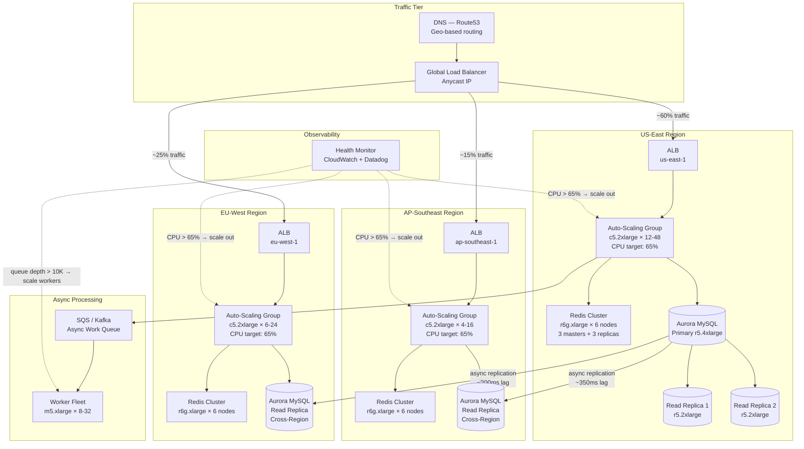
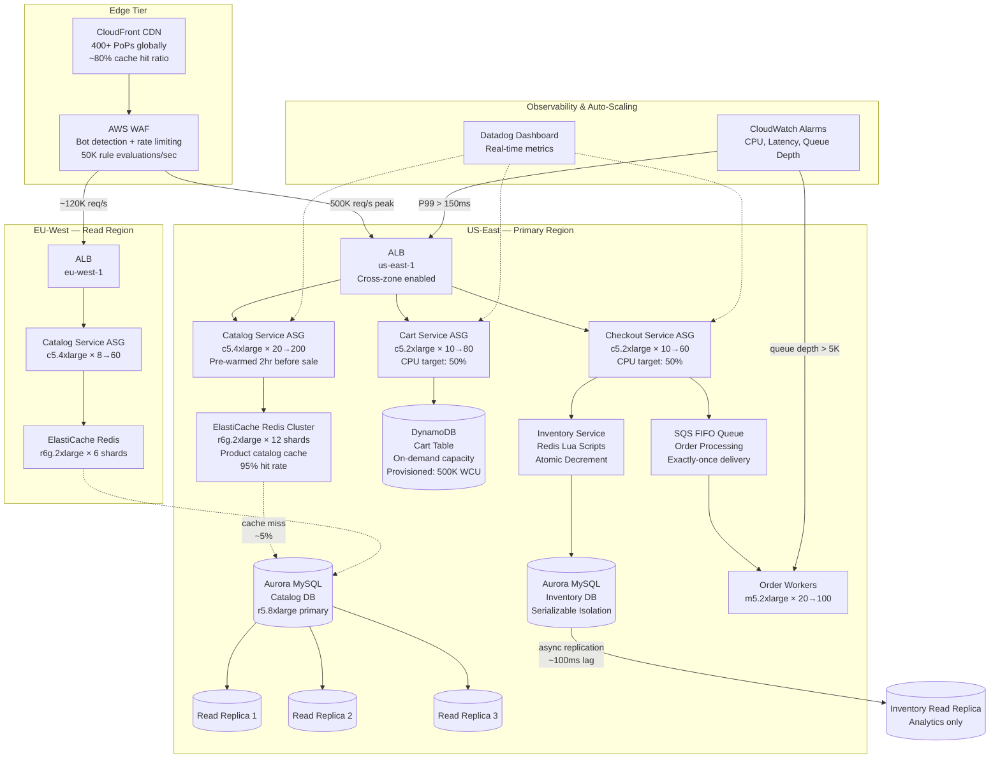
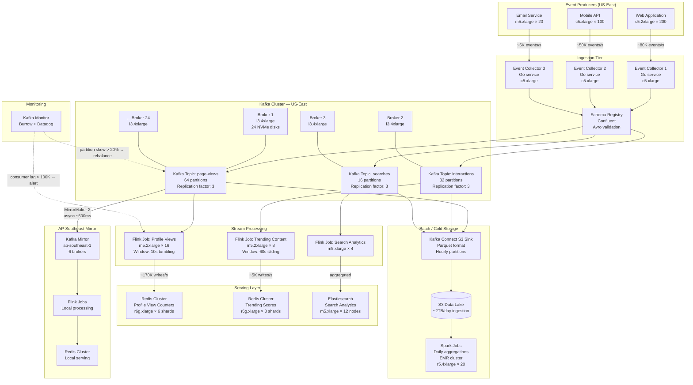
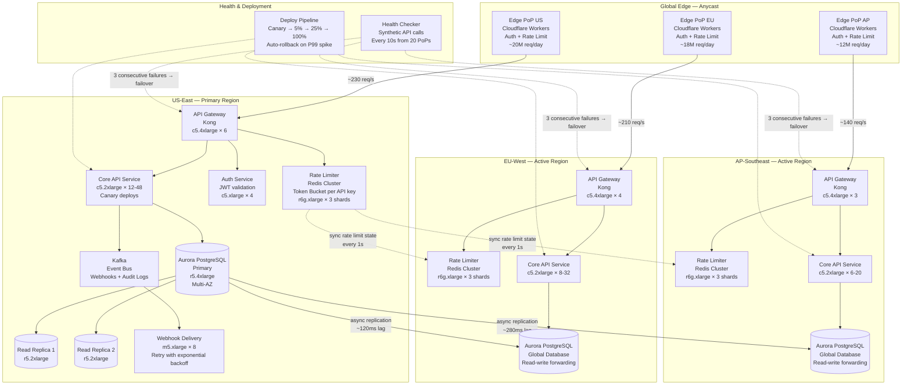

# Scalability

Scalability is a system's ability to handle growing amounts of work — more users, more data, more transactions — by adding resources rather than redesigning the architecture. A truly scalable system maintains its performance characteristics (latency, throughput, availability) as load increases by orders of magnitude. The two fundamental axes are **vertical scaling** (bigger machines) and **horizontal scaling** (more machines), but modern systems almost always rely on horizontal scaling because single-machine ceilings are real — you can't buy a server with 100TB of RAM or 10 million IOPS.

## Intent

- Grow capacity linearly (or better) with added resources: doubling servers should roughly double throughput.
- Avoid single points of failure that cap total system capacity.
- Enable independent scaling of different subsystems — the read path, write path, and background processing each have different bottlenecks.
- Support graceful degradation: when load exceeds capacity, shed load or queue work rather than crash.

## Architecture Overview

## Key Concepts

### Vertical vs. Horizontal Scaling

| Dimension        | Vertical Scaling                        | Horizontal Scaling                                   |
| ---------------- | --------------------------------------- | ---------------------------------------------------- |
| **Approach**     | Upgrade to a bigger machine             | Add more machines of the same size                   |
| **Ceiling**      | Hard — largest EC2 is 24TB RAM, 448 CPU | Soft — add nodes until network or coordination limit |
| **Complexity**   | Low — no code changes                   | High — need partitioning, routing, consistency       |
| **Failure mode** | Single point of failure                 | Partial failure; system stays up                     |
| **Cost curve**   | Superlinear (2x CPU ≠ 2x cost)          | Near-linear                                          |
| **Downtime**     | Usually required for upgrade            | Zero-downtime rolling deploys                        |

### Scalability Dimensions

| What Scales          | Technique                                      | Example                            |
| -------------------- | ---------------------------------------------- | ---------------------------------- |
| **Compute**          | Horizontal auto-scaling behind a load balancer | Kubernetes HPA, AWS ASG            |
| **Read throughput**  | Read replicas, caching layers                  | Aurora replicas, Redis, Memcached  |
| **Write throughput** | Sharding, partitioning, event sourcing         | Vitess, DynamoDB, Kafka partitions |
| **Storage**          | Distributed storage, object stores             | S3, HDFS, Cassandra                |
| **Network**          | CDNs, edge computing, connection pooling       | CloudFront, Cloudflare Workers     |

### Scaling Metrics to Watch

| Metric              | Warning Threshold | Action                          |
| ------------------- | ----------------- | ------------------------------- |
| CPU utilization     | > 65% sustained   | Add instances / scale out       |
| Memory utilization  | > 80%             | Increase instance size or count |
| Request queue depth | > 10K pending     | Scale worker fleet              |
| P99 latency         | > 2× baseline     | Investigate bottleneck          |
| DB connections      | > 80% of pool max | Add read replicas or shard      |
| Disk IOPS           | > 70% provisioned | Move to faster storage tier     |

---

## Industry Problem 1 — E-Commerce Flash Sale (Amazon Prime Day Scale)

**Why this example:** Flash sales are the canonical test of elastic scalability because traffic spikes are extreme (10-100× normal), perfectly predictable in timing but not in magnitude, and the cost of failure is directly measured in lost revenue. This scenario uniquely tests both pre-scaling (capacity planning) and reactive auto-scaling under a sustained, hours-long surge — unlike a brief viral spike that CDNs can absorb.

**Problem:** An e-commerce platform averages 15K requests/sec on normal days but needs to handle 500K requests/sec during a 48-hour flash sale. The product catalog has 350M items. Inventory counts must be accurate to prevent overselling (no SOLD-OUT items showing as available). Cart and checkout must respond in under 200ms p99 even at peak. Last year's sale resulted in a 12-minute outage that cost $8M in lost sales.

**Solution:**

**How this solves the problem:** CloudFront absorbs 80% of catalog reads at the edge, reducing origin traffic from 500K to ~100K req/s hitting the application tier. Pre-warming the Auto-Scaling Groups 2 hours before the sale eliminates the cold-start latency that caused last year's outage — instances are already running and health-checked. The inventory service uses Redis Lua scripts for atomic stock decrements, guaranteeing that two concurrent buyers cannot purchase the last unit of the same item. DynamoDB's on-demand mode for the cart table means there's no provisioned throughput ceiling to hit during the spike. The SQS FIFO queue decouples checkout from order processing, so even if downstream payment systems slow down, the customer gets an immediate confirmation and the order is processed asynchronously.

**Key decisions:**

- **Pre-warming + aggressive auto-scaling** — ASGs are scaled to 60% of expected peak 2 hours before the sale, with reactive scaling handling the remaining surge. Target CPU is set to 50% (not the usual 70%) to leave headroom.
- **Separate scaling groups per service** — catalog is read-heavy and scales on request count; cart is session-heavy and scales on memory; checkout is CPU-bound and scales on CPU utilization.
- **Redis Lua for inventory atomicity** — `DECR` in a Lua script is atomic and sub-millisecond. The Aurora inventory DB is the source of truth but is only hit for reconciliation, not on the hot path.
- **DynamoDB for carts** — carts are ephemeral, high-churn, key-value access. DynamoDB handles 500K WCU without pre-provisioning, and abandoned carts auto-expire via TTL.

---

## Industry Problem 2 — Real-Time Analytics Pipeline (LinkedIn Scale)

**Why this example:** Analytics pipelines face a fundamentally different scaling challenge from request-serving systems: the bottleneck is sustained throughput over massive data volumes rather than latency on individual requests. LinkedIn's scale — billions of events per day from 900M members — forces you to solve event ordering, exactly-once processing, and backpressure simultaneously. This example illustrates how streaming architectures scale independently from the serving tier.

**Problem:** A professional network with 900M members generates 15B events/day (profile views, content impressions, job applications, searches, messages). Each event must be processed within 30 seconds for real-time dashboards (who viewed your profile, trending content) and also persisted for batch analytics. Event schema evolves weekly — new fields are added without breaking downstream consumers. During product launches, event volume can spike 3× within minutes.

**Solution:**

**How this solves the problem:** The Kafka cluster acts as a durable, ordered buffer that decouples producers from consumers — when event volume spikes 3×, Kafka absorbs the burst (with 7 days of retention) while Flink consumers catch up at their own pace. Partitioning topics by member_id ensures events for the same user are processed in order within a single Flink task, enabling accurate sessionization and deduplication. The schema registry enforces backward compatibility so new fields don't break existing consumers. The dual-path architecture — real-time via Flink-to-Redis, batch via S3-to-Spark — means dashboards update in seconds while historical analytics jobs run on cheap storage without competing for streaming resources.

**Key decisions:**

- **Kafka as the central nervous system** — 24 brokers on i3.4xlarge (NVMe-optimized) sustain 2GB/s aggregate write throughput with 3× replication. Topics are partitioned by member_id for ordering guarantees.
- **Schema Registry with Avro** — producers register schemas before publishing. Schema evolution rules (backward compatible only) are enforced at the registry level, preventing accidental breaking changes.
- **Flink per use case** — separate Flink jobs for profile views, trending, and search. Each job scales independently. Profile views need 16 task managers because it processes 10× more events/sec than trending.
- **MirrorMaker 2 for cross-region** — AP-Southeast gets a full mirror of Kafka topics with ~500ms lag. Local Flink jobs process events locally, keeping dashboard latency under 50ms for Asian users.
- **Backpressure-aware ingestion** — collectors check Kafka metadata before sending. If a partition's ISR count drops below 2, the collector buffers locally and switches to the next healthy partition.

---

## Industry Problem 3 — Global API Platform (Stripe / Twilio Scale)

**Why this example:** API platforms face a unique scaling challenge: every API call is a revenue event for both you and your customer, making reliability non-negotiable. Unlike internal services where you control the traffic shape, public APIs must handle arbitrary traffic patterns from millions of external developers — sudden onboarding of a large customer can 10× traffic to a single endpoint overnight. This scenario tests rate limiting, multi-tenancy isolation, and global latency simultaneously.

**Problem:** A developer API platform serves 50M API calls/day from 500K developer accounts across 190 countries. P99 latency must be under 100ms regardless of the caller's location. The platform must enforce per-customer rate limits (ranging from 25 req/s for free tier to 10K req/s for enterprise), provide five-nines availability (99.999% = 5 minutes downtime/year), and deploy updates multiple times per day without any API downtime.

**Solution:**

**How this solves the problem:** Edge PoPs handle authentication and rate limiting within 5ms of the user, rejecting bad traffic before it reaches the origin — this alone drops P99 from 200ms to under 80ms for most callers. Aurora Global Database enables read-write forwarding so EU and AP regions can handle both reads and writes without routing to US-East, achieving sub-100ms latency in all three regions. The rate limiter uses a distributed token bucket: each region maintains local counters in Redis and syncs consumed tokens globally every second, which means a customer can't exceed their limit by spraying requests across regions. Canary deployments roll out to 5% of traffic first, with automatic rollback if P99 latency increases by more than 20% — this enables multiple deploys per day without risking availability.

**Key decisions:**

- **Edge-first architecture** — Cloudflare Workers at 300+ PoPs parse the API key, check a local rate-limit cache, and reject unauthorized or over-limit requests in <5ms. Only valid, within-limit requests reach the origin.
- **Distributed rate limiting with global sync** — each region's Redis cluster tracks per-key consumption locally. Every 1 second, a background process syncs consumed counts across regions. This allows slight over-limit bursts (up to 3× the 1-second window) but prevents sustained abuse.
- **Aurora Global Database** — a single primary in US-East with read-write forwarding to EU-West and AP-Southeast. Reads are local (sub-10ms); writes forward to the primary (~120-280ms) but the caller gets a response immediately with eventual consistency.
- **Canary deploys with automated rollback** — every deployment goes through 5% → 25% → 100% stages. At each stage, the deploy pipeline compares error rate and P99 latency against the baseline. A >20% regression triggers automatic rollback within 60 seconds.
- **Webhook delivery with retry** — API events are published to Kafka and delivered to customer webhook endpoints with exponential backoff (up to 72 hours of retries). Failed deliveries are surfaced in the developer dashboard.

---

## Scaling Patterns Summary

| Pattern                     | Description                                               | When to Use                                 |
| --------------------------- | --------------------------------------------------------- | ------------------------------------------- |
| **Horizontal auto-scaling** | Add/remove instances based on metrics                     | Stateless services with variable load       |
| **Read replicas**           | Replicate data to serve reads from multiple nodes         | Read-heavy workloads (>10:1 read-write)     |
| **Sharding**                | Split data across independent partitions                  | Write-heavy workloads exceeding single-node |
| **CQRS**                    | Separate read and write models for independent scaling    | Systems where read/write patterns diverge   |
| **Event-driven / async**    | Decouple producers from consumers via queues or streams   | Spiky workloads, long-running processing    |
| **Edge computing**          | Push computation to edge PoPs near users                  | Latency-sensitive global APIs               |
| **Pre-warming**             | Provision capacity ahead of known traffic spikes          | Predictable events (sales, launches)        |
| **Backpressure**            | Signal upstream to slow down when downstream is saturated | Streaming pipelines, queue-based systems    |

## Anti-Patterns

- **Scaling everything together:** If you have one monolith, a spike in the chat feature forces you to scale your billing code too. Decompose services so each scales independently on its own bottleneck.
- **Ignoring the database:** You can auto-scale to 1,000 app servers, but if they all hit a single database, you've just moved the bottleneck. Scale the data tier (replicas, sharding, caching) before scaling compute.
- **Reactive-only scaling:** Auto-scaling has a 2-5 minute lag (launch, boot, health check). For predictable traffic spikes, pre-warm capacity — don't rely solely on reactive policies.
- **Premature distribution:** Adding Kafka, Redis, and three microservices to handle 100 req/s is over-engineering. Start with a single server and a managed database; scale when metrics demand it.
- **Ignoring cost:** Scaling to handle a 1-hour daily peak by keeping peak capacity 24/7 wastes 90% of spend. Use scheduled scaling, spot instances, and serverless for variable workloads.

## Key Takeaway

> Scalability is not a single technique — it's a **layered strategy** where each tier (edge, compute, cache, database, async processing) scales independently using the right pattern. Start simple (vertical scaling, read replicas), add complexity only when metrics prove you need it, and always scale the data tier alongside the compute tier. The best architectures scale linearly with resources and degrade gracefully when they can't.
