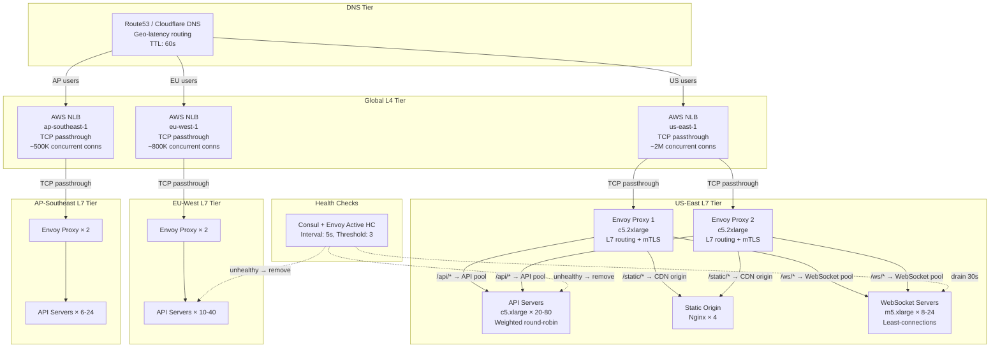
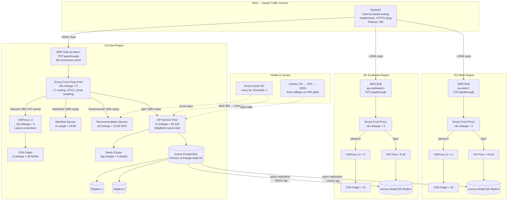

# Load Balancing

Load balancing is the practice of distributing incoming network traffic across multiple servers so that no single server bears too much demand. A well-designed load balancing layer is invisible to clients — every request gets routed to a healthy, appropriately loaded backend, latency stays consistent, and the system survives individual server failures without dropping a single connection. Modern architectures stack multiple layers of load balancing: DNS-level for geographic routing, L4 (TCP/UDP) for raw throughput, and L7 (HTTP/gRPC) for content-aware routing, health checking, and traffic shaping.

## Intent

- Distribute traffic evenly (or weighted) across backend servers to maximize throughput and minimize response time.
- Detect and route around unhealthy backends within seconds, providing seamless failover.
- Enable zero-downtime deployments by draining connections before removing instances.
- Support multi-region active-active architectures routing users to the nearest healthy region.

## Architecture Overview



## Key Concepts

### L4 vs L7 Load Balancing

| Dimension           | L4 (Transport)                                 | L7 (Application)                                  |
| ------------------- | ---------------------------------------------- | ------------------------------------------------- |
| **Operates on**     | TCP/UDP packets — IP + port only               | HTTP headers, URL paths, cookies, gRPC metadata   |
| **Speed**           | Very fast — kernel-level forwarding (DPDK/XDP) | Slower — must parse application protocol          |
| **Routing logic**   | Hash on IP/port tuple                          | Content-based: path, header, method, query string |
| **TLS termination** | No — passes encrypted bytes through            | Yes — terminates TLS, inspects payload            |
| **Use case**        | High-throughput TCP (databases, game servers)  | HTTP APIs, microservices, canary routing          |
| **Examples**        | AWS NLB, HAProxy (TCP mode), LVS               | AWS ALB, Nginx, Envoy, HAProxy (HTTP mode)        |

### Load Balancing Algorithms

| Algorithm                | How It Works                                                 | Best For                                          |
| ------------------------ | ------------------------------------------------------------ | ------------------------------------------------- |
| **Round Robin**          | Rotate through backends sequentially                         | Homogeneous instances, stateless services         |
| **Weighted Round Robin** | Rotate with weights (2:1 means server A gets 2× traffic)     | Mixed instance sizes in the same pool             |
| **Least Connections**    | Route to the server with fewest active connections           | Long-lived connections (WebSockets, gRPC streams) |
| **Consistent Hashing**   | Hash a key (user ID, session) to a server; minimal remapping | Caches, stateful services, sticky sessions        |

### Health Checking

| Check Type  | Mechanism                                           | Frequency   | Failure Threshold |
| ----------- | --------------------------------------------------- | ----------- | ----------------- |
| **Active**  | LB sends HTTP GET /health to each backend           | Every 5-10s | 3 consecutive     |
| **Passive** | LB monitors response codes/timeouts on real traffic | Per request | 5 errors in 30s   |
| **Deep**    | /health checks dependencies (DB, cache, queue)      | Every 30s   | 2 consecutive     |

---

## Industry Problem 1 — Video Streaming Platform (Netflix Scale)

**Why this example:** Video streaming is the definitive L7 load balancing challenge because each user session hits multiple backend services with radically different latency and throughput requirements. The load balancer must route a single user's requests to different pools based on content type, and a misconfiguration degrades streaming for millions of concurrent viewers.

**Problem:** A global streaming platform serves 250M subscribers across 190 countries. During peak evening hours, 15M concurrent streams generate 800K HTTP requests/sec (API + manifest) plus 8M active TCP connections for adaptive bitrate video delivery. The platform runs 20 microservices per request path. A 2-second routing delay causes buffering on screen — viewers abandon within 4 seconds. The team deploys 50+ times per day across all services and needs zero-downtime deployments even for the load balancers themselves.

**Solution:**



**How this solves the problem:** The two-tier design — NLB at L4 plus Envoy at L7 — delivers both raw connection capacity (millions of concurrent TCP connections) and intelligent content-based routing (URL path splitting to different service pools). Video streams route through HAProxy in L4 mode with least-connections, preventing the "hot server" problem where round-robin overloads nodes with long-lived connections. Envoy's circuit breaking automatically ejects slow backends within 15 seconds, containing failures before they cascade. Zero-downtime deploys use Envoy's traffic shifting: 5% canary → P99 validation → full rollout, while old instances drain connections over 30 seconds.

**Key decisions:**

- **NLB + Envoy two-tier** — NLB provides elastic L4 capacity without per-instance scaling (it's a managed service that auto-scales). Envoy provides L7 intelligence. Replacing either tier is independent.
- **Path-based routing to separate pools** — `/stream/*` goes to HAProxy L4 (optimized for long-lived connections), `/recommend/*` goes to GPU instances. Each pool auto-scales on its own metric.
- **Envoy circuit breaking** — if a backend's pending request count exceeds 1,024 or error rate exceeds 5%, Envoy opens the circuit and returns 503 immediately rather than queuing.

---

## Industry Problem 2 — Ride-Hailing Microservices (Uber Scale)

**Why this example:** Ride-hailing is the quintessential service mesh problem because a single request fans out to 20+ microservices, each with different latency budgets and failure modes. Every service must load-balance its outbound calls to every other service, making the LB layer distributed rather than centralized.

**Problem:** A ride-hailing platform processes 25M rides/day across 10K cities. A single ride request touches 22 microservices in sequence and parallel (matching, pricing, ETA, dispatch, payments, fraud detection, surge, notifications). Total end-to-end latency budget is 2 seconds, meaning each service hop has ~90ms budget. The fleet of 4,000 microservice instances spans three regions. Network failures between services cause 0.1% of ride requests to fail — each failure is a lost ride worth $15 average revenue. The team needs to reduce inter-service failures to 0.001% without adding latency.

**Solution:**

```mermaid
graph TB
    subgraph "Client Gateway"
        Mobile[Mobile App<br/>Rider/Driver] -->|"HTTPS"| EdgeLB[Nginx Ingress<br/>c5.4xlarge × 4<br/>TLS termination<br/>|25K req/s|]
    end

    subgraph "US-East Service Mesh — Envoy Sidecars"
        EdgeLB -->|"/v1/ride-request"| RideSvc[Ride Request Service<br/>c5.xlarge × 30<br/>+ Envoy sidecar]

        RideSvc -->|"|8K req/s| gRPC"| PricingSvc[Pricing Service<br/>c5.xlarge × 15<br/>+ Envoy sidecar<br/>P99: 25ms]
        RideSvc -->|"|8K req/s| gRPC"| MatchSvc[Matching Service<br/>c5.2xlarge × 20<br/>+ Envoy sidecar<br/>P99: 50ms]
        RideSvc -->|"|8K req/s| gRPC"| ETASvc[ETA Service<br/>c5.xlarge × 12<br/>+ Envoy sidecar<br/>P99: 40ms]

        MatchSvc -->|"|5K req/s|"| GeoIndex[Geo Index Service<br/>r5.2xlarge × 8<br/>+ Envoy sidecar<br/>H3 spatial index]
        MatchSvc -->|"|5K req/s|"| DriverLoc[Driver Location Service<br/>r5.xlarge × 10<br/>+ Envoy sidecar<br/>Redis Geo backing]

        PricingSvc -->|"|3K req/s|"| SurgeSvc[Surge Pricing<br/>c5.xlarge × 6<br/>+ Envoy sidecar]
        PricingSvc -->|"|3K req/s|"| FraudSvc[Fraud Detection<br/>c5.xlarge × 8<br/>+ Envoy sidecar<br/>ML model inference]

        RideSvc -->|"after match"| DispatchSvc[Dispatch Service<br/>c5.xlarge × 10<br/>+ Envoy sidecar]
        DispatchSvc -->|"|2K req/s|"| PaymentSvc[Payment Service<br/>c5.xlarge × 8<br/>+ Envoy sidecar<br/>PCI-DSS isolated]
        DispatchSvc -->|"|5K req/s|"| NotifySvc[Notification Service<br/>m5.xlarge × 6<br/>+ Envoy sidecar]
    end

    subgraph "Envoy Control Plane"
        Istio[Istio Control Plane<br/>xDS API server]
        Istio -.->|"endpoint updates every 1s"| RideSvc
        Istio -.->|"retry budget: 20%, timeout: 80ms"| ETASvc
    end

    subgraph "EU-West — Locality Zone"
        EdgeLBEU[Nginx Ingress × 2<br/>|10K req/s|]
        EdgeLBEU --> RideSvcEU[Ride Request × 15<br/>+ Envoy sidecar]
        RideSvcEU --> PricingEU[Pricing × 8]
        RideSvcEU --> MatchEU[Matching × 10]
    end

    subgraph "AP-Southeast — Locality Zone"
        EdgeLBAP[Nginx Ingress × 2<br/>|5K req/s|]
        EdgeLBAP --> RideSvcAP[Ride Request × 8<br/>+ Envoy sidecar]
        RideSvcAP --> PricingAP[Pricing × 4]
        RideSvcAP --> MatchAP[Matching × 6]
    end

    subgraph "Observability"
        Jaeger[Jaeger Distributed Tracing<br/>Every ride = 1 trace, 22+ spans]
        Jaeger -.->|"P99 per hop"| RideSvc
        Metrics2[Prometheus + Grafana<br/>Envoy L7 metrics per sidecar]
        Metrics2 -.->|"retry rate > 5% → alert"| PricingSvc
        Metrics2 -.->|"circuit open → page oncall"| FraudSvc
    end

    subgraph "Health & Failover"
        HC2[Envoy Active HC<br/>gRPC health protocol<br/>Interval: 2s<br/>Threshold: 2 failures]
        HC2 -.->|"eject unhealthy<br/>30s ejection window"| MatchSvc
        HC2 -.->|"zone-aware failover:<br/>prefer local, spill to remote"| PricingSvc
    end
```

**How this solves the problem:** Every microservice runs an Envoy sidecar that handles outbound load balancing — no centralized LB to become a bottleneck. Sidecars receive real-time endpoint updates via xDS from Istio, so when a Pricing instance crashes, all Ride Request sidecars stop routing to it within 1 second. Locality-aware routing keeps per-hop latency under 50ms by preferring same-zone backends. The retry budget (max 20% retries) prevents storms — if error rate hits 20%, the circuit breaker opens, returning fast failure rather than cascading timeouts across all 22 services.

**Key decisions:**

- **Sidecar-based load balancing** — each service decides where to route its own calls, using local Envoy with real-time endpoint data. This scales to 4,000 instances without a centralized bottleneck.
- **Locality-aware routing** — Envoy prefers same-zone, then same-region, then cross-region backends. This cuts median inter-service latency from 15ms (cross-AZ) to 2ms (same-AZ).
- **Retry budget, not retry count** — instead of "retry 3 times per request," the policy is "at most 20% of traffic can be retries." This prevents retry amplification that can turn a 5% failure rate into a 50% overload.
- **gRPC health checking** — the native gRPC health protocol gives richer signals than HTTP, enabling partial degradation without full ejection.

---

## Industry Problem 3 — Global Financial Trading Platform (Exchange Scale)

**Why this example:** Financial trading requires the most extreme load balancing — microseconds matter, packet loss is unacceptable, and duplicated or reordered trades cause financial loss. This tests L4 load balancing with connection affinity, deterministic routing under failure, and the challenge of balancing UDP multicast feeds alongside TCP order flows.

**Problem:** A global electronic trading platform handles 2M orders/sec across equities, options, and futures. The matching engine requires sub-100μs network latency within the data center. Market data feeds (UDP multicast) must reach 5,000 subscriber sessions with less than 10μs jitter. The platform operates in three regulatory regions (US, EU, APAC) with separate matching engines per region. During market open (9:30 AM), order flow spikes 20× in 500ms. A load balancer failure during market hours triggers regulatory reporting and potential fines.

**Solution:**

```mermaid
graph TB
    subgraph "US-East — NYSE Co-Location (Mahwah, NJ)"
        FIXGateway1[FIX Gateway 1<br/>FPGA-accelerated<br/>Solarflare NIC<br/>|500K orders/s|]
        FIXGateway2[FIX Gateway 2<br/>FPGA-accelerated<br/>Solarflare NIC<br/>|500K orders/s|]

        FIXGateway1 & FIXGateway2 -->|"TCP + kernel bypass<br/>|1M orders/s combined|"| L4LB_US[HAProxy L4<br/>Active-Passive pair<br/>Bare metal, DPDK<br/>10μs added latency]

        L4LB_US -->|"consistent hash on account_id<br/>|sticky sessions|"| ME_US1[Matching Engine 1<br/>Equities<br/>Bare metal, 256GB RAM<br/>Kernel bypass, busy-poll]
        L4LB_US -->|"consistent hash on symbol"| ME_US2[Matching Engine 2<br/>Options<br/>Bare metal, 256GB RAM]
        L4LB_US -->|"consistent hash on symbol"| ME_US3[Matching Engine 3<br/>Futures<br/>Bare metal, 128GB RAM]

        ME_US1 & ME_US2 & ME_US3 -->|"executions"| SeqWriter[Sequencer<br/>Aeron Cluster<br/>Raft consensus<br/>Total ordering]
        SeqWriter -->|"sequenced events"| MDFeed[Market Data Publisher<br/>UDP Multicast<br/>Solarflare OpenOnload<br/>|2M msgs/s|]

        MDFeed -->|"multicast 239.1.1.x<br/>|< 10μs jitter|"| MDDist[Market Data Distributor<br/>FPGA multicast replicator<br/>5,000 subscriber ports]

        ME_US1 --> RiskCheck[Pre-Trade Risk<br/>In-memory engine<br/>< 5μs per check]
        RiskCheck --> DropCopy[(Drop Copy<br/>Persistent journal<br/>sub-μs write)]
    end

    subgraph "EU-West — London (LD4)"
        FIXGW_EU[FIX Gateway FPGA<br/>|300K orders/s|] -->|"kernel bypass"| L4LB_EU[HAProxy L4<br/>Active-Passive, DPDK]
        L4LB_EU --> ME_EU1[EU Equities Engine] & ME_EU2[EU Derivatives Engine]
        ME_EU1 & ME_EU2 --> SeqEU[Sequencer] --> MDFeedEU[UDP Multicast]
    end

    subgraph "AP-Southeast — Tokyo (TY3)"
        FIXGW_AP[FIX Gateway FPGA<br/>|200K orders/s|] -->|"kernel bypass"| L4LB_AP[HAProxy L4<br/>Active-Passive, DPDK]
        L4LB_AP --> ME_AP[APAC Equities Engine]
        ME_AP --> SeqAP[Sequencer] --> MDFeedAP[UDP Multicast]
    end

    subgraph "Failover & Monitoring"
        Heartbeat[VRRP keepalived<br/>Failover: < 50ms]
        Heartbeat -.->|"VIP migration"| L4LB_US
        Heartbeat -.->|"VIP migration"| L4LB_EU
        Monitor[Latency Monitor<br/>PTP + hardware timestamps]
        Monitor -.->|"jitter > 10μs → alert"| MDFeed
    end

    subgraph "Cross-Region"
        OrderRouter[Smart Order Router<br/>US↔EU: 65ms, US↔AP: 170ms]
        OrderRouter -.->|"best venue"| L4LB_US
        OrderRouter -.->|"best venue"| L4LB_EU
        OrderRouter -.->|"best venue"| L4LB_AP
    end
```

**How this solves the problem:** The entire data path avoids the kernel — DPDK-based HAProxy and Solarflare NICs keep LB-added latency to 10μs, well within the 100μs budget. Consistent hashing on `account_id` and `symbol` ensures all orders for the same instrument reach the same matching engine, required for FIFO ordering without cross-engine coordination. The active-passive HAProxy pair with VRRP migrates the VIP in under 50ms; TCP connections stall briefly but aren't dropped thanks to FIX sequence number recovery. The UDP multicast market data path is fully separate from the order path, using FPGA replication so 5,000 subscribers receive identical data within 10μs of each other.

**Key decisions:**

- **Bare metal + DPDK, not cloud** — cloud load balancers (NLB, ALB) add 50-200μs of latency; bare-metal HAProxy with DPDK adds 10μs. For a trading platform, this 100μs difference is the margin between getting a fill and missing it.
- **Consistent hashing, not round-robin** — orders must be processed in arrival order per symbol. Consistent hashing guarantees symbol affinity. When a matching engine fails, only 1/N of symbols remap, not all traffic.
- **Active-passive, not active-active** — active-active LBs can reorder packets under asymmetric load; active-passive guarantees a single ordering point. The 50ms failover cost is acceptable.
- **Separate data paths for orders and market data** — TCP for orders (reliable, ordered), UDP multicast for market data (low-latency, one-to-many). Mixing them would add jitter to market data.

---

## Load Balancing Patterns Summary

| Pattern                          | Description                                                      | When to Use                                          |
| -------------------------------- | ---------------------------------------------------------------- | ---------------------------------------------------- |
| **DNS-based routing**            | Route at DNS resolution using geo, latency, or weighted policies | Multi-region active-active, coarse failover          |
| **L4 passthrough**               | TCP/UDP forwarding without protocol inspection                   | High-throughput, TLS passthrough, non-HTTP protocols |
| **L7 content routing**           | Route based on HTTP path, headers, cookies                       | Microservices, canary deploys, A/B testing           |
| **Sidecar proxy (service mesh)** | Each service has its own load balancer (Envoy sidecar)           | Microservices with many inter-service calls          |
| **Consistent hashing**           | Sticky routing based on a key; minimal remapping on node changes | Caches, stateful services, ordered processing        |
| **Connection draining**          | Stop sending new requests but let existing connections finish    | Zero-downtime deployments, graceful shutdown         |

## Anti-Patterns

- **Single load balancer, no redundancy:** A single LB is a single point of failure. Always run at least an active-passive pair with health-checked failover, or use a managed service (NLB/ALB) with built-in redundancy.
- **Health checks that lie:** A /health endpoint returning 200 while the database is down means the LB routes traffic to a broken server. Deep health checks that verify downstream dependencies catch this.
- **Sticky sessions without thinking:** Session affinity prevents effective load distribution and makes deployments harder. Externalize state to Redis instead.
- **Load balancing without observability:** If you can't see per-backend latency, error rate, and active connections in real time, you're load balancing blind. Instrument the LB and alert on divergence between backends.

## Key Takeaway

> Load balancing is not a single component — it's a **multi-layered routing strategy** where DNS handles geographic distribution, L4 handles raw throughput, and L7 handles content-aware routing and traffic shaping. The right architecture depends on the workload: round-robin for stateless APIs, least-connections for long-lived streams, consistent hashing for stateful services, and sidecar proxies for microservice meshes. Always pair load balancers with aggressive health checking, connection draining, and per-backend observability.
