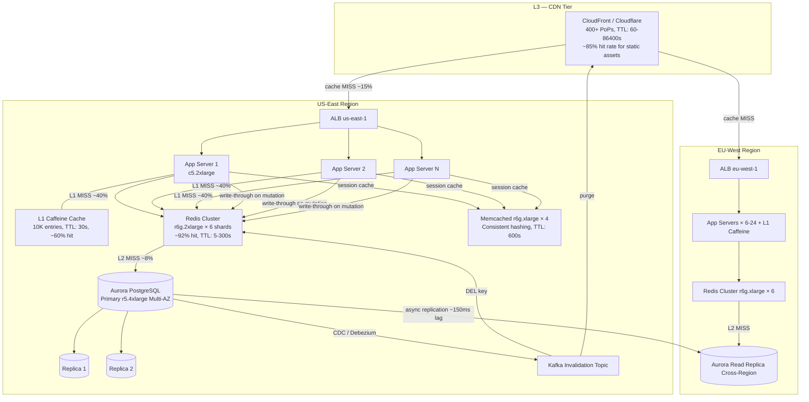

# Caching

Caching is the practice of storing copies of frequently accessed data in a faster storage layer so that future requests are served with lower latency and reduced load on the origin. Modern architectures stack multiple tiers of caching: application-level in-process caches for hot objects, distributed caches (Redis, Memcached) for shared state, and CDN edge caches for static and semi-static content. The key challenge is not caching itself — it's **cache invalidation**: ensuring stale data doesn't persist while maintaining the performance benefits of cached responses.

## Intent

- Reduce latency by serving requests from memory rather than disk or network round-trips to the origin.
- Protect backend databases from being overwhelmed by read-heavy traffic.
- Enable multi-region low-latency reads without replicating the entire database to every region.
- Support graceful degradation: when the origin is slow or unavailable, serve stale cached data rather than failing.

## Architecture Overview



## Key Concepts

### Cache Tiers

| Tier              | Technology               | Latency | Capacity            | TTL Range |
| ----------------- | ------------------------ | ------- | ------------------- | --------- |
| **L1 — Process**  | Caffeine, Guava, HashMap | ~100ns  | 10K-100K entries    | 10-60s    |
| **L2 — Shared**   | Redis Cluster, Memcached | 0.5-2ms | 10GB-500GB          | 30s-1hr   |
| **L3 — Edge/CDN** | CloudFront, Cloudflare   | 5-20ms  | Virtually unlimited | 60s-24hr  |

### Cache Write Strategies

| Strategy          | How It Works                                             | Consistency    | Use Case                             |
| ----------------- | -------------------------------------------------------- | -------------- | ------------------------------------ |
| **Write-Through** | Write to cache and DB synchronously on every mutation    | Strong         | Session stores, inventory counts     |
| **Write-Behind**  | Write to cache immediately, async flush to DB in batches | Eventual       | Analytics counters, view counts      |
| **Write-Around**  | Write only to DB; cache fills on next read               | Eventual (TTL) | Infrequently read data               |
| **Cache-Aside**   | App checks cache; on miss, reads DB and populates cache  | Eventual (TTL) | General-purpose, most common pattern |

### Cache Invalidation Strategies

| Strategy               | Mechanism                                           | Staleness | Complexity |
| ---------------------- | --------------------------------------------------- | --------- | ---------- |
| **TTL expiration**     | Key expires after a fixed duration                  | Up to TTL | Low        |
| **Event-driven purge** | CDC stream or app event triggers cache delete       | Seconds   | Medium     |
| **Versioned keys**     | Append version to key (e.g., `product:42:v7`)       | None      | Medium     |
| **Tag-based purge**    | Group related keys by tag; purge entire tag at once | Seconds   | High       |

### Cache Eviction Policies

| Policy     | Description                       | Best For                       |
| ---------- | --------------------------------- | ------------------------------ |
| **LRU**    | Evict least recently used entry   | General workloads              |
| **LFU**    | Evict least frequently used entry | Stable hot-set workloads       |
| **TTL**    | Evict when time-to-live expires   | Time-sensitive data (sessions) |
| **Random** | Evict a random entry              | Uniform access distributions   |

---

## Industry Problem 1 — Social Media Feed (Instagram / Twitter Scale)

**Why this example:** Social media feeds are the canonical caching problem because they combine extreme read amplification (one post is viewed millions of times but written once), a power-law distribution where 1% of content generates 50% of reads, and strict freshness requirements — users expect new posts within seconds. This uniquely tests multi-tier caching with aggressive invalidation under viral spikes.

**Problem:** A social media platform serves 2B daily active users generating 500M new posts/day. The home feed endpoint handles 1.2M requests/sec at peak. Each feed request fans out to 500+ followed accounts. Without caching, that's 600M reads/sec on the database. Feed must reflect new posts within 5 seconds. During viral events, a single post can generate 50M reads in 10 minutes.

**Solution:**

```mermaid
graph TB
    subgraph "L3 — CDN"
        CDN[CloudFront 400+ PoPs<br/>Cache: media/images TTL: 86400s<br/>|~90% hit for media|]
    end

    subgraph "US-East Region"
        CDN -->|"API requests"| LB[ALB |1.2M req/s peak|]

        LB --> Feed1[Feed Svc 1 c5.4xlarge] & Feed2[Feed Svc 2] & FeedN[Feed Svc N × 60-200]
        Feed1 --- L1F[L1 Caffeine 50K entries<br/>TTL: 10s |~45% hit|]

        Feed1 & Feed2 & FeedN -->|"L1 MISS ~55% |660K req/s|"| FeedRedis[Redis Cluster — Feed Cache<br/>r6g.4xlarge × 24 shards<br/>Sorted Sets per user_id, TTL: 300s<br/>|~88% hit rate|]
        Feed1 & Feed2 & FeedN -->|"post metadata"| PostRedis[Redis Cluster — Post Cache<br/>r6g.2xlarge × 12 shards<br/>JSON per post_id, TTL: 3600s |~95% hit|]
        Feed1 & Feed2 & FeedN -->|"viral posts"| ViralCache[Memcached — Hot Posts<br/>r6g.2xlarge × 8, TTL: 30s<br/>|~99% hit for top 1K posts|]

        FeedRedis -->|"L2 MISS ~12% |~80K req/s|"| FeedDB[(Cassandra i3.4xlarge × 36<br/>Partitioned by user_id)]
        PostRedis -->|"L2 MISS ~5%"| PostDB[(Aurora PostgreSQL r5.8xlarge)]
        PostDB --> PR1[(Replica 1)] & PR2[(Replica 2)]

        PublishSvc[Publish Svc × 20] -->|"write-through"| PostRedis
        PublishSvc -->|"fan-out event"| Kafka[Kafka Fan-out Topic 128 partitions]
        Kafka --> FanoutWorkers[Fan-out Workers c5.xlarge × 40-120]
        FanoutWorkers -->|"ZADD to follower feeds"| FeedRedis
        Kafka -->|"viral detection >10K reads/min"| ViralDetector[Flink] -->|"promote"| ViralCache
    end

    subgraph "EU-West Region"
        CDN -->|"API"| LB_EU[ALB |~400K req/s|]
        LB_EU --> FeedEU[Feed Svc × 20-80 + L1]
        FeedEU --> FeedRedisEU[Redis Feed r6g.4xlarge × 12] & PostRedisEU[Redis Post r6g.2xlarge × 6]
        FeedRedisEU -->|"L2 MISS"| FeedDB
        PostRedisEU -->|"L2 MISS"| PostRepEU[(Aurora Replica Cross-Region)]
    end

    PostDB -->|"async replication ~120ms lag"| PostRepEU
```

**How this solves the problem:** The three-tier strategy reduces 600M reads/sec database demand to ~80K — a 7,500× reduction. L1 Caffeine with 10-second TTL absorbs 45% of requests at sub-microsecond latency for the pull-to-refresh pattern. L2 Redis stores pre-computed sorted sets per user, so a feed request is a single `ZREVRANGE` (~0.5ms) instead of 500 DB lookups. The dedicated Memcached viral tier with 99% hit rate isolates celebrity posts from evicting regular feed caches. Fan-out-on-write pushes posts into follower caches within 2 seconds via Kafka.

**Key decisions:**

- **Fan-out-on-write + cache-aside hybrid** — users with <50K followers get immediate push; celebrities use deferred fan-out where followers pull from post cache on read.
- **Separate Redis clusters for feeds vs. posts** — feed caches are write-heavy (fan-out), post caches are read-heavy. Separate clusters prevent fan-out writes from evicting post data.
- **Dedicated viral content cache** — Flink detects posts exceeding 10K reads/min and promotes them to Memcached, isolating viral traffic from the main Redis cluster.

---

## Industry Problem 2 — E-Commerce Product Catalog (Amazon Scale)

**Why this example:** Product catalogs are the quintessential cache consistency challenge: high read volume on every page view, frequent price/inventory writes, and strict correctness requirements — displaying a stale price is a trust violation with legal implications. This uniquely tests write-through caching, event-driven invalidation, and multi-region cache coherence.

**Problem:** An e-commerce platform hosts 500M products. The product detail page receives 800K requests/sec at peak. Prices change ~12 times/day, inventory changes every second for popular items. Displaying a stale price for >10 seconds triggers complaints; showing out-of-stock as available causes failed checkouts. P99 latency must be <50ms globally.

**Solution:**

```mermaid
graph TB
    subgraph "L3 — CDN"
        CDN[CloudFront 400+ PoPs<br/>Static: TTL 86400s, Catalog API: TTL 30s<br/>stale-while-revalidate |~70% hit|]
    end

    subgraph "US-East Region"
        CDN -->|"MISS ~30% |~240K req/s|"| LB[ALB us-east-1]

        LB --> Cat1[Catalog Svc 1 c5.2xlarge] & Cat2[Catalog Svc 2] & CatN[Catalog Svc N × 30-100]
        Cat1 --- L1C[L1 Caffeine 100K products<br/>Versioned keys, TTL: 15s |~55% hit|]

        Cat1 & Cat2 & CatN -->|"L1 MISS ~45% |~108K req/s|"| ProductRedis[Redis Cluster — Products<br/>r6g.4xlarge × 18 shards<br/>Hash per product_id, TTL: 3600s |~94% hit|]
        Cat1 & Cat2 & CatN -->|"price/inventory"| PriceRedis[Redis Cluster — Price/Inventory<br/>r6g.2xlarge × 12 shards<br/>Write-through, TTL: 60s |~97% hit|]
        Cat1 & Cat2 & CatN -->|"search queries"| SearchCache[Memcached r6g.xlarge × 6<br/>Key: hash(query+filters), TTL: 120s |~80% hit|]

        ProductRedis -->|"L2 MISS ~6%"| CatalogDB[(Aurora PostgreSQL r5.8xlarge)]
        PriceRedis -->|"L2 MISS ~3%"| PricingDB[(DynamoDB On-demand)]
        PriceRedis -->|"L2 MISS"| InventoryDB[(Aurora MySQL r5.4xlarge)]
        SearchCache -->|"L2 MISS"| ES[Elasticsearch m5.2xlarge × 12]

        PricingEngine[Pricing Engine × 8] -->|"write-through HSET"| PriceRedis
        PricingEngine -->|"invalidation event"| InvKafka[Kafka Invalidation Topic 64 partitions]
        InventorySvc[Inventory Svc × 12] -->|"write-through atomic HSET"| PriceRedis
        InventorySvc --> InvKafka
        InvKafka -->|"purge stale"| ProductRedis
        InvKafka -->|"tag-based purge"| SearchCache
        InvKafka -->|"CDN purge API batch"| CDN
        CatalogCMS[Catalog CMS] -->|"version bump product:{id}:v{N+1}"| ProductRedis
    end

    subgraph "EU-West Region"
        CDN -->|"MISS"| LB_EU[ALB eu-west-1 |~180K req/s|]
        LB_EU --> CatEU[Catalog Svc × 15-50 + L1]
        CatEU --> ProductRedisEU[Redis Product r6g.2xlarge × 9] & PriceRedisEU[Redis Price r6g.xlarge × 6]
        InvKafka -->|"MirrorMaker 2 ~200ms lag"| InvKafkaEU[Kafka Mirror EU]
        InvKafkaEU -->|"purge + write-through"| ProductRedisEU & PriceRedisEU
        ProductRedisEU -->|"L2 MISS"| CatRepEU[(Aurora Replica Cross-Region ~150ms lag)]
    end

    CatalogDB -->|"async replication ~150ms"| CatRepEU
```

**How this solves the problem:** Write-through for prices and inventory ensures every change is reflected in Redis within milliseconds — never violating the 10-second staleness window. Separating product cache (stable metadata, long TTL) from price/inventory cache (rapidly changing, write-through refresh) prevents frequent updates from evicting descriptions. The Kafka invalidation bus propagates purges to all tiers including CDN within 2 seconds, with tag-based purges for search results. Cross-region coherence uses Kafka mirroring to EU-West, ensuring caches are purged within 200ms of a US write.

**Key decisions:**

- **Write-through for prices, cache-aside for descriptions** — prices must never be stale (write-through); descriptions change weekly (cache-aside with versioned keys is sufficient).
- **Kafka-driven invalidation** — services publish to Kafka; invalidation consumers handle per-tier purge logic. Adding a new cache tier only requires a new consumer.
- **Stale-while-revalidate at CDN** — CloudFront serves stale catalog pages for 30s while revalidating asynchronously. Price data bypasses CDN entirely.

---

## Industry Problem 3 — Global Gaming Leaderboard (Fortnite / League of Legends Scale)

**Why this example:** Gaming leaderboards are the ultimate test of distributed cache consistency under concurrent writes — millions of score updates arrive simultaneously, rankings must reflect within seconds, and players across regions must see a globally consistent board. This uniquely tests sorted-set caching with high write throughput and the thundering-herd problem when a season resets all scores.

**Problem:** A competitive game with 80M monthly players maintains real-time leaderboards across 200 game modes and 5 regions. During peak, 500K score updates/sec flow in. Players expect rank updates within 3 seconds. The global top-1000 page receives 200K reads/sec. At season start (every 3 months), all scores reset simultaneously — triggering 80M invalidations and 200K/sec read storms against empty caches. Last reset caused a 45-minute stampede outage.

**Solution:**

```mermaid
graph TB
    subgraph "L3 — CDN"
        CDN[Cloudflare 300+ PoPs<br/>Top-1000 JSON, TTL: 5s<br/>stale-while-revalidate: 30s |~92% hit|<br/>Varnish origin shield per region]
    end

    subgraph "US-East Region"
        CDN -->|"MISS ~8% |~16K req/s|"| LB[ALB us-east-1]

        LB --> LB1[Leaderboard Svc 1 c5.2xlarge] & LB2[Leaderboard Svc 2] & LBN[Leaderboard Svc N × 20-60]
        LB1 --- L1LB[L1 Caffeine Top-10K per mode<br/>TTL: 3s |~70% hit|]

        LB1 & LB2 & LBN -->|"L1 MISS ~30% ZREVRANK"| LeaderRedis[Redis Cluster — Leaderboards<br/>r6g.4xlarge × 30 shards<br/>Sorted Set per game_mode<br/>|~98% hit| Max: 500GB]
        LB1 & LB2 & LBN -->|"player metadata"| ProfileRedis[Redis Cluster — Profiles<br/>r6g.2xlarge × 12 shards<br/>TTL: 600s |~96% hit|]

        MatchSvc[Match Result Svc × 30] -->|"|500K updates/s|"| ScoreKafka[Kafka Score Topic<br/>256 partitions, keyed by player_id]
        ScoreKafka --> ScoreWorkers[Score Workers c5.2xlarge × 40-80<br/>Batch ZADD every 500ms]
        ScoreWorkers -->|"ZADD |~500K/s|"| LeaderRedis
        ScoreWorkers -->|"write-behind batch every 5s"| ScoreDB[(Aurora PostgreSQL r5.4xlarge<br/>Score history, partitioned by month)]

        ResetSvc[Season Reset] -->|"pre-warm new sorted sets"| LeaderRedis
        ResetSvc -->|"atomic RENAME<br/>leaderboard:mode:new → leaderboard:mode"| LeaderRedis
        LB1 & LB2 & LBN -->|"singleflight request coalescing"| LeaderRedis

        LeaderRedis -->|"L2 MISS ~2% (cold start only)"| ScoreDB
        ProfileRedis -->|"L2 MISS ~4%"| PlayerDB[(DynamoDB On-demand)]
    end

    subgraph "EU-West Region"
        CDN -->|"MISS"| LB_EU[ALB |~60K req/s|]
        LB_EU --> LBEU[Leaderboard Svc × 10-30 + L1]
        LBEU --> LeaderRedisEU[Redis Leaderboards r6g.4xlarge × 15]
        ScoreKafka -->|"MirrorMaker 2 ~300ms lag"| ScoreKafkaEU[Kafka Mirror EU]
        ScoreKafkaEU --> WorkersEU[Score Workers × 20] -->|"ZADD"| LeaderRedisEU
    end

    subgraph "AP-Southeast Region"
        CDN -->|"MISS"| LB_AP[ALB |~40K req/s|]
        LB_AP --> LBAP[Leaderboard Svc × 8-20 + L1]
        LBAP --> LeaderRedisAP[Redis Leaderboards r6g.2xlarge × 10]
        ScoreKafka -->|"MirrorMaker 2 ~500ms lag"| ScoreKafkaAP[Kafka Mirror AP]
        ScoreKafkaAP --> WorkersAP[Score Workers × 12] -->|"ZADD"| LeaderRedisAP
    end
```

**How this solves the problem:** Redis Sorted Sets provide O(log N) `ZADD` and `ZREVRANK` operations, handling 500K writes/sec across 30 shards with sub-millisecond latency. Write-behind batches DB writes every 5 seconds, so PostgreSQL absorbs aggregated writes rather than the full firehose. For the season reset stampede, three defenses combine: pre-warming generates new sorted sets before reset, atomic `RENAME` makes the transition instant with zero empty-cache window, and singleflight coalescing ensures 1,000 concurrent misses trigger only one actual Redis query. Cross-region consistency uses Kafka mirroring so local workers replay updates into regional Redis clusters — global rankings converge within 300-500ms.

**Key decisions:**

- **Redis Sorted Sets as primary store** — Redis is both cache and serving layer; PostgreSQL is the durable backup, not the read path. This eliminates cache-miss latency for rank lookups.
- **Write-behind to DB, write-through to Redis** — every score hits Redis immediately (3-second freshness) but batches to PostgreSQL every 5 seconds (manageable DB write load).
- **Stampede protection via pre-warm + atomic swap + singleflight** — the season reset never creates an empty cache. New sorted sets build under temporary keys, then atomically rename.
- **Per-region Redis via Kafka mirroring** — each region has independent Redis clusters fed by mirrored Kafka topics, giving local read latency with global write ordering.

---

## Caching Patterns Summary

| Pattern                       | Description                                                  | When to Use                                            |
| ----------------------------- | ------------------------------------------------------------ | ------------------------------------------------------ |
| **Cache-Aside (Lazy)**        | App checks cache; on miss reads DB and populates cache       | General-purpose, read-heavy workloads                  |
| **Write-Through**             | Every write updates both cache and DB synchronously          | Data that must never be stale (prices, inventory)      |
| **Write-Behind**              | Write to cache immediately, async batch flush to DB          | High write throughput (counters, scores, analytics)    |
| **Read-Through**              | Cache itself fetches from DB on miss (transparent to app)    | Simplify app code; works with cache libraries          |
| **Refresh-Ahead**             | Proactively refresh entries before TTL expiration            | Predictable access patterns, latency-sensitive reads   |
| **Request Coalescing**        | Deduplicate concurrent cache-miss requests to same key       | Thundering herd / stampede protection                  |
| **Tiered Caching**            | L1 (process) → L2 (distributed) → L3 (CDN) layered hierarchy | High-traffic systems needing sub-ms to global coverage |
| **Event-Driven Invalidation** | CDC or app events trigger targeted cache purges              | Strong consistency requirements with cached data       |

## Anti-Patterns

- **Cache everything with long TTLs:** Blindly caching with 24-hour TTLs feels safe until a price change doesn't show for hours. Match TTL to the data's acceptable staleness — seconds for prices, hours for images.
- **No invalidation strategy:** Relying solely on TTL means stale data persists for the full window. Use event-driven invalidation for data that changes frequently and must be consistent.
- **Cache stampede (thundering herd):** When a popular key expires, thousands of requests hit the database simultaneously. Use request coalescing, probabilistic early expiration, or locking.
- **Caching query results without decomposition:** Caching `SELECT * FROM products WHERE category='electronics'` means any product update invalidates the entire result. Cache individual entities and compose results.
- **Ignoring memory pressure:** Running Redis at 95% memory with no eviction policy means writes fail silently. Set `maxmemory-policy` to `allkeys-lru` and alert at 75%.
- **Same TTL for all data:** A uniform 5-minute TTL for both sessions and images wastes cache space and serves stale session data. Tune TTL per data type.

## Key Takeaway

> Caching is not a single layer — it's a **tiered strategy** where L1 in-process caches provide sub-microsecond access for hot data, L2 distributed caches (Redis, Memcached) provide shared millisecond-latency access across instances, and L3 CDN caches push content to the edge for global reach. The hardest part is invalidation: use write-through for data that must never be stale, event-driven purges for data that changes unpredictably, and TTL expiration as a safety net. Always separate caches by access pattern (read-heavy vs. write-heavy), protect against stampedes with request coalescing, and monitor hit rates per tier — a cache with a low hit rate is just extra infrastructure cost.
