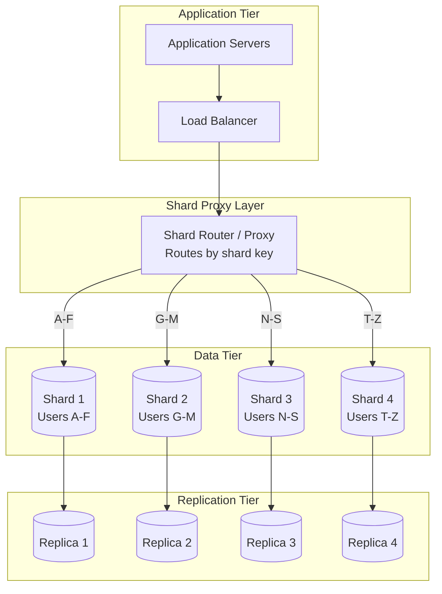

# Database Sharding

Sharding is the practice of splitting a large database into smaller, independent pieces called **shards**, each holding a subset of the total data. Every shard runs on its own server (or cluster), so reads and writes are distributed across machines rather than funneled through a single node. Without sharding, even the largest vertical machine eventually hits a ceiling — in IOPS, storage, or connection count. With sharding, you trade single-node simplicity for near-linear horizontal scalability.

## Intent

- Distribute data across multiple database instances so no single node becomes a bottleneck.
- Enable write scalability beyond what a single primary can handle.
- Isolate failure domains — one shard going down should not take the entire dataset offline.

## Architecture Overview



## Key Concepts

### Sharding Strategies

| Strategy            | How It Works                                          | Pros                                      | Cons                                           |
| ------------------- | ----------------------------------------------------- | ----------------------------------------- | ---------------------------------------------- |
| **Range Sharding**  | Partition by key range (e.g., user_id 1-1M → Shard 1) | Simple range scans stay on one shard      | Hot spots if access is skewed (recent data)    |
| **Hash Sharding**   | Hash the shard key, mod by shard count                | Even distribution regardless of key       | Range queries span all shards (scatter-gather) |
| **Directory-Based** | A lookup table maps each key to its shard             | Maximum flexibility, supports re-sharding | Lookup table is a SPOF and latency overhead    |
| **Geo-Based**       | Partition by geography (region, country)              | Data locality, compliance (GDPR)          | Uneven shard sizes across regions              |

### Re-Sharding Strategies

Re-sharding is needed when shards become unevenly sized or when you need to add capacity.

| Approach                   | Description                                                           | Downtime        |
| -------------------------- | --------------------------------------------------------------------- | --------------- |
| **Double-write migration** | Write to both old and new shard layout during transition              | Zero            |
| **Backfill + cutover**     | Copy historical data, switch reads, then switch writes                | Brief (seconds) |
| **Consistent hashing**     | Virtual nodes minimize data movement when adding shards               | Zero            |
| **Logical sharding first** | Many logical shards on few physical nodes; move entire logical shards | Zero            |

---

## Industry Problem 1 — Social Platform User Data at 2B Users (Meta Scale)

**Why this example:** Social platforms represent the extreme end of sharding challenges — billions of rows with a highly interconnected data model (friend graphs) where any user may need to reference data across multiple shards. This scenario uniquely illustrates the tension between uniform hash distribution for write scalability and the cross-shard scatter-gather problem that arises when relationships (friendships, followers) span shard boundaries.

**Problem:** A social platform stores profiles, friend lists, and posts for 2 billion users. A single PostgreSQL instance maxes out at ~50TB and 80K IOPS. Peak write load is 2M writes/sec during major events. Cross-shard friend lookups must stay under 50ms p99.

**Solution:**

```mermaid
graph TB
    subgraph US-East Region
        API1[API Server Pool<br/>50 instances] --> ConnPool1[ProxySQL<br/>Connection Pool<br/>10K connections]
        ConnPool1 --> ShardProxy[Vitess VTGate<br/>Shard Router]
    end

    subgraph Shard Routing Layer
        ShardProxy --> |"hash(user_id) % 8<br/>2M writes/sec total"| VTTablet1[VTTablet Controller]
        ShardProxy --> VTTablet2[VTTablet Controller]
        ShardProxy --> VTTablet3[VTTablet Controller]
        ShardProxy --> VTTabletN[VTTablet Controller]
    end

    subgraph Shard 1 — 250M Users / 6TB
        VTTablet1 --> Primary1[(MySQL 8.0 Primary<br/>r6g.4xlarge<br/>Writes: 250K/sec)]
        Primary1 --> |"async replication<br/>< 100ms lag"| Replica1a[(Read Replica 1<br/>r6g.2xlarge)]
        Primary1 --> |"async replication"| Replica1b[(Read Replica 2<br/>r6g.2xlarge)]
    end

    subgraph Shard 2 — 250M Users / 6TB
        VTTablet2 --> Primary2[(MySQL 8.0 Primary<br/>r6g.4xlarge)]
        Primary2 --> Replica2a[(Read Replica 1)]
        Primary2 --> Replica2b[(Read Replica 2)]
    end

    subgraph Shard N — 250M Users / 6TB
        VTTabletN --> PrimaryN[(MySQL 8.0 Primary<br/>r6g.4xlarge)]
        PrimaryN --> ReplicaNa[(Read Replica 1)]
        PrimaryN --> ReplicaNb[(Read Replica 2)]
    end

    subgraph Friend Graph Cache Layer
        API1 --> FriendCache[Redis Cluster<br/>6 shards / 512GB<br/>Friend Adjacency Lists]
        FriendCache -.-> |"cache miss<br/>5% of lookups"| ShardProxy
    end

    subgraph Monitoring and Topology
        ShardProxy -.-> Metrics[Vitess VTOrc<br/>Shard Health Monitor]
        Metrics -.-> |"failover triggers<br/>< 30s recovery"| Primary1
        Metrics -.-> TopoServer[etcd Topology Server<br/>Shard Map + Tablet Registry]
        TopoServer -.-> ShardProxy
    end
```

**How this solves the problem:** Vitess VTGate hashes each `user_id` and routes writes to the correct MySQL primary, spreading the 2M writes/sec peak evenly across 8 shards (~250K writes/sec per shard — well within a single MySQL instance's capacity on r6g.4xlarge hardware). Each shard holds ~6TB and 250M users, keeping individual instance storage manageable. The two async read replicas per shard absorb the 100:1 read-write ratio for profile lookups, ensuring the primary is dedicated to writes. The Redis friend-graph cache intercepts 95% of cross-shard friend lookups before they reach the database, keeping p99 latency under 50ms even when friends are spread across all 8 shards. ProxySQL connection pooling prevents the 50 API server instances from exhausting MySQL's connection limits. VTOrc continuously monitors shard health and triggers automatic primary failover in under 30 seconds if a node becomes unreachable.

**Key decisions:**

- **Hash-based sharding on user_id** — ensures uniform distribution. 8 shards of 250M users each, expandable to 64 via consistent hashing.
- **Vitess as the shard proxy** — handles routing, connection pooling, and schema migrations across shards without downtime.
- **Friend graph cached in Redis** — cross-shard friend lookups hit the cache first (95% hit rate), avoiding scatter-gather queries on every social action.
- **Each shard has 2 read replicas** — profiles are read-heavy (100:1 read-write ratio), so replicas absorb read load while the primary handles writes.

---

## Industry Problem 2 — Multi-Tenant SaaS with Tenant Isolation (Salesforce Scale)

**Why this example:** Multi-tenant SaaS is the canonical case for _heterogeneous workload sharding_ — the distribution of load across tenants follows a heavy-tailed power law, not a uniform curve. This makes naive hash or range sharding ineffective because a single "whale" tenant can saturate a shard while thousands of small tenants sit idle. It uniquely demonstrates directory-based routing and the tiered sharding pattern required when tenant sizes vary by 10,000x.

**Problem:** A multi-tenant SaaS platform hosts 150K tenants. The largest 100 tenants generate 60% of all database traffic while the smallest 100K tenants collectively generate 5%. A single shard for a large tenant might overwhelm the underlying hardware, while dedicating a shard per small tenant wastes resources.

**Solution:**

```mermaid
graph TB
    subgraph US-East Region
        API[API Gateway<br/>Rate-Limited per Tenant] --> TenantRouter[Tenant-Aware Router<br/>Citus Coordinator Node]
        TenantRouter --> Directory[(Tenant Directory<br/>PostgreSQL + pgbouncer<br/>150K mappings<br/>In-Memory Cache 60s TTL)]
    end

    subgraph Dedicated Tier — Top 100 Tenants
        TenantRouter --> |"tenant_id = A<br/>15K QPS"| Dedicated1[(Citus Worker — Tenant A<br/>r6g.8xlarge / 4TB<br/>Primary)]
        Dedicated1 --> |"sync replication"| DedRep1[(Tenant A Replica<br/>r6g.4xlarge)]
        TenantRouter --> |"tenant_id = B<br/>12K QPS"| Dedicated2[(Citus Worker — Tenant B<br/>r6g.8xlarge / 3TB<br/>Primary)]
        Dedicated2 --> |"sync replication"| DedRep2[(Tenant B Replica<br/>r6g.4xlarge)]
    end

    subgraph Shared Tier — 150K Small Tenants
        TenantRouter --> |"5K tenants/shard<br/>~200 QPS combined"| Shared1[(Citus Worker — Shared Shard 1<br/>r6g.2xlarge / 500GB<br/>Tenants 1-5000)]
        TenantRouter --> |"5K tenants/shard"| Shared2[(Citus Worker — Shared Shard 2<br/>r6g.2xlarge / 500GB<br/>Tenants 5001-10000)]
        TenantRouter --> SharedN[(Citus Worker — Shared Shard N<br/>r6g.2xlarge)]
        Shared1 --> |"async replication"| SharedRep1[(Shared Replica 1)]
        Shared2 --> |"async replication"| SharedRep2[(Shared Replica 2)]
    end

    subgraph EU-West Region — GDPR Tenants
        TenantRouter --> |"geo-routed<br/>EU tenants only"| EUDedicated[(EU Dedicated Shard<br/>Tenant C / 2TB)]
        TenantRouter --> EUShared[(EU Shared Shard<br/>8K tenants / 300GB)]
    end

    subgraph Tenant Promotion Pipeline
        Monitor[Usage Monitor<br/>Checks QPS + row count] -.-> |"threshold crossed<br/>>1M rows or >500 QPS"| Rebalancer[Citus Shard Rebalancer<br/>Online Migration]
        Rebalancer -.-> |"move tenant data<br/>zero-downtime"| Dedicated1
    end
```

**How this solves the problem:** The Citus coordinator node acts as a directory-based router, looking up each `tenant_id` to determine whether it belongs on a dedicated or shared worker node. Large tenants (top 100) each get an isolated Citus worker with synchronous replication, ensuring their 10K+ QPS workloads don't impact other tenants and providing per-tenant performance guarantees. Small tenants are packed 5,000 per shared shard, keeping hardware utilization high despite their individually low traffic — the combined ~200 QPS across 5,000 tenants easily fits on r6g.2xlarge instances. The EU-West subgraph ensures GDPR-regulated tenants' data never leaves the EU region, satisfying data residency requirements without a separate deployment. When a growing tenant crosses the promotion threshold (>1M rows or >500 QPS), the usage monitor triggers Citus's shard rebalancer to move their data to a dedicated worker with zero downtime, preventing "noisy neighbor" problems before they impact shared-shard co-tenants.

**Key decisions:**

- **Tiered sharding model** — large tenants (top 100) get dedicated shards; small tenants are co-located in shared shards (5,000 tenants per shard).
- **Directory-based routing** — a tenant directory service maps tenant_id → shard. Cached in memory with 60-second TTL; directory DB is replicated for durability.
- **Promote-on-growth** — when a small tenant's usage crosses a threshold (>1M rows or >500 QPS), automatically migrate to a dedicated shard.
- **Row-level security** within shared shards — every table includes a `tenant_id` column, every query is scoped. Defense in depth prevents data leakage.

---

## Industry Problem 3 — Financial Ledger with High Write Throughput (Stripe Scale)

**Why this example:** Financial ledgers combine the hardest constraints in distributed systems: strong consistency (no lost writes, no phantom balances), append-only auditability, and high write throughput with double-entry bookkeeping that doubles the write amplification. This scenario is chosen because it illustrates how sharding interacts with distributed transactions — the shard key must be selected to minimize cross-shard 2PC, which is the single biggest latency and correctness risk in a sharded financial system.

**Problem:** A payments platform processes 25M transactions/day. Each transaction involves double-entry bookkeeping (two ledger writes). Ledger data must be strongly consistent — no lost writes, no phantom balances. The ledger table grows by 500GB/month and must support fast balance queries.

**Solution:**

```mermaid
graph TB
    subgraph Application Tier
        PaySvc[Payment Service<br/>Idempotent Writes<br/>Idempotency Key per Request] --> LedgerGW[Ledger Gateway<br/>CockroachDB SQL Proxy<br/>Connection Pooling]
    end

    subgraph Shard Routing — CockroachDB
        LedgerGW --> |"hash(account_id)<br/>~580 writes/sec per shard"| Range1
        LedgerGW --> |"hash(account_id)"| Range2
        LedgerGW --> |"hash(account_id)"| Range3
        LedgerGW --> |"hash(account_id)"| RangeN
    end

    subgraph US-East — Shards 1-4
        Range1[(CockroachDB Node 1<br/>Ledger Shard 1<br/>Raft Leader<br/>r6g.4xlarge / 2TB)]
        Range1 --> |"Raft consensus<br/>sync replication"| Replica1a[(Raft Follower 1<br/>r6g.2xlarge<br/>US-East-1b)]
        Range1 --> |"Raft consensus<br/>sync replication"| Replica1b[(Raft Follower 2<br/>r6g.2xlarge<br/>US-East-1c)]
        Range2[(CockroachDB Node 2<br/>Ledger Shard 2<br/>Raft Leader / 2TB)]
        Range2 --> Replica2a[(Raft Follower<br/>US-East-1b)]
        Range2 --> Replica2b[(Raft Follower<br/>US-East-1c)]
    end

    subgraph US-West — Shards 5-8
        Range3[(CockroachDB Node 5<br/>Ledger Shard 5<br/>Raft Leader / 2TB)]
        Range3 --> Replica3a[(Raft Follower<br/>US-West-2b)]
        RangeN[(CockroachDB Node 8<br/>Ledger Shard 8<br/>Raft Leader / 2TB)]
        RangeN --> ReplicaNa[(Raft Follower<br/>US-West-2b)]
    end

    subgraph Cross-Shard Transaction Layer
        LedgerGW --> TwoPC[2PC Coordinator<br/>< 5% of transactions<br/>~10ms added latency]
        TwoPC -.-> |"prepare + commit<br/>cross-shard debit/credit"| Range1
        TwoPC -.-> |"prepare + commit"| Range3
    end

    subgraph Materialized Balance Layer
        Range1 --> |"CDC stream<br/>~580 events/sec"| BalCache[(Materialized Balance Store<br/>Redis + PostgreSQL<br/>O-1 balance lookups)]
        Range2 --> |"CDC stream<br/>~580 events/sec"| BalCache
        Range3 --> |"CDC stream"| BalCache
        RangeN --> |"CDC stream"| BalCache
    end

    subgraph Audit and Archival
        BalCache -.-> Archive[(Cold Storage — S3<br/>Ledger entries > 90 days<br/>Parquet format)]
        Archive -.-> |"compliance queries<br/>Athena / Presto"| AuditQuery[Audit Query Engine]
    end
```

**How this solves the problem:** By sharding on `account_id`, 95% of double-entry transactions (debit + credit for the same merchant) remain on a single shard, avoiding the latency and complexity of distributed 2PC. Each CockroachDB node uses Raft consensus with synchronous replication across three replicas spread across availability zones, guaranteeing strong consistency — no write is acknowledged until a majority of replicas confirm, eliminating phantom balances. The remaining <5% of cross-shard transfers (payer and payee on different shards) go through a lightweight 2PC coordinator that adds ~10ms latency but preserves atomicity. CDC streams push every committed ledger entry to a materialized balance store, converting balance queries from expensive `SUM(amount)` aggregations into O(1) key lookups. The append-only ledger design (no UPDATEs, corrections are reversal entries) simplifies replication and provides a complete audit trail, while ledger entries older than 90 days are archived to S3 in Parquet format to keep active shard sizes bounded.

**Key decisions:**

- **Shard by account_id** — most transactions debit/credit the same merchant account, keeping 95% of transactions single-shard (no distributed transactions).
- **Two-phase commit (2PC) for cross-shard transfers** — when payer and payee are on different shards, a lightweight 2PC coordinator ensures atomicity. Cross-shard rate is < 5%.
- **Materialized balance per account** — instead of `SUM(amount) WHERE account_id = X`, maintain a running balance updated on each write. Reduces balance queries from O(n) to O(1).
- **Append-only ledger with soft deletes** — no UPDATEs to ledger rows. Corrections are reversal entries. This simplifies replication and auditability.

---

## Sharding Patterns Summary

| Pattern                   | Description                               | Example                          |
| ------------------------- | ----------------------------------------- | -------------------------------- |
| **Hash sharding**         | Hash key mod N for even distribution      | User profiles by user_id         |
| **Range sharding**        | Assign key ranges to shards               | Time-series data by date range   |
| **Directory-based**       | Lookup table maps key → shard             | Multi-tenant SaaS                |
| **Geo sharding**          | Partition by geography                    | EU data stays in EU shards       |
| **Consistent hashing**    | Virtual nodes minimize re-sharding moves  | DynamoDB, Cassandra              |
| **Hierarchical sharding** | Shard → sub-shard for very large datasets | Shard by region, then by user_id |

## Anti-Patterns

- **Shard too early:** Sharding a database with 10GB of data adds complexity with no payoff. Start with read replicas and vertical scaling.
- **Choosing a bad shard key:** Sharding by `created_at` means all writes hit the latest shard. Pick a key with high cardinality and even distribution.
- **Cross-shard joins in the hot path:** If your most common query spans all shards, you've negated the benefit of sharding. Denormalize or cache.
- **Ignoring re-sharding from day one:** If you hardcode `shard = hash(key) % 4`, adding a 5th shard requires moving 80% of data. Use consistent hashing or logical shards.

## Key Takeaway

> Sharding unlocks horizontal write scalability, but the **shard key is the most important decision** you'll make. Pick a key that keeps related data together, distributes load evenly, and avoids cross-shard operations on the hot path. Start with logical shards on fewer physical nodes — you can split later without re-architecting.
