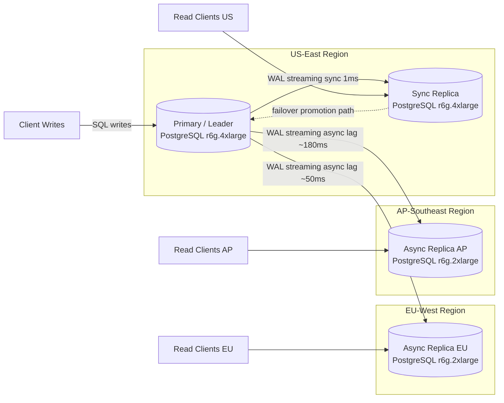
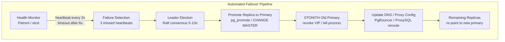
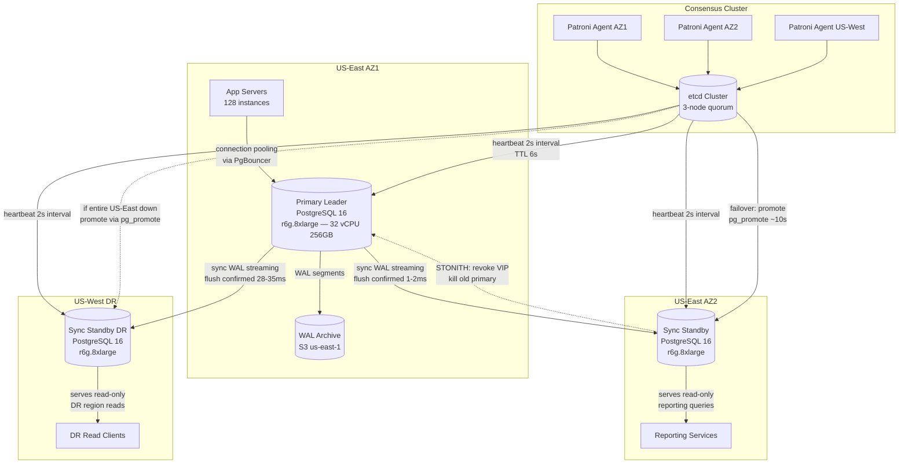
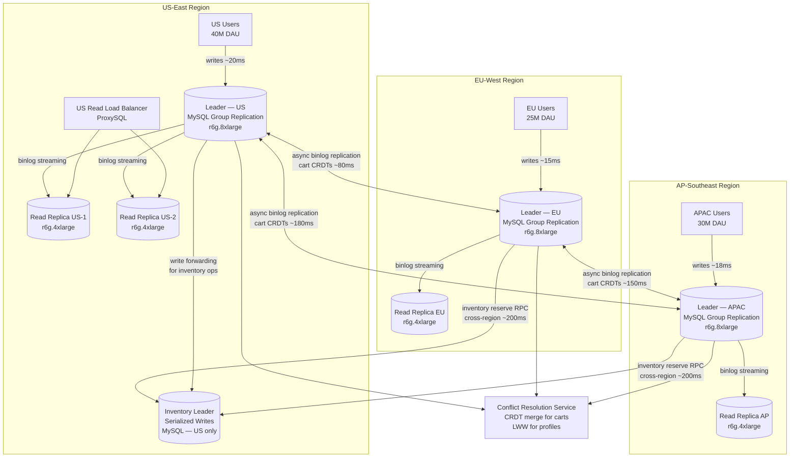

# Replication & Failover

Replication is the process of keeping copies of the same data on multiple machines. It serves three purposes: **high availability** (survive machine failures), **low latency** (serve reads from a geographically closer replica), and **read scalability** (distribute read load across followers). Failover is the mechanism that promotes a replica to primary when the current primary becomes unavailable. Together, replication and failover determine your system's durability guarantees and recovery time.

## Intent

- Maintain multiple copies of data so that no single machine failure causes data loss.
- Reduce read latency by serving from replicas closer to the user.
- Automate failover to minimize downtime when the primary node fails.

## Architecture Overview



## Key Concepts

### Replication Topologies

| Topology            | How It Works                                                   | Consistency                       | Write Scalability | Use Case                           |
| ------------------- | -------------------------------------------------------------- | --------------------------------- | ----------------- | ---------------------------------- |
| **Leader-Follower** | One leader accepts writes; followers replicate and serve reads | Strong (sync) or eventual (async) | Single leader     | Most OLTP databases                |
| **Multi-Leader**    | Multiple nodes accept writes; conflict resolution required     | Eventual                          | Multi-region      | Global apps, collaborative editing |
| **Leaderless**      | Any node accepts reads/writes; quorum determines success       | Tunable (W+R > N)                 | High              | Cassandra, DynamoDB                |

### Quorum Reads & Writes

For a cluster of **N** replicas, a write quorum **W** and read quorum **R** must satisfy **W + R > N** to guarantee the reader sees the latest write.

| Config (N=3) | W   | R   | Behavior                                          |
| ------------ | --- | --- | ------------------------------------------------- |
| Strong       | 2   | 2   | Every read sees latest write; tolerates 1 failure |
| Write-fast   | 1   | 3   | Writes are fast; reads must check all replicas    |
| Read-fast    | 3   | 1   | Reads are fast from any replica; writes are slow  |

### Failover Mechanisms



| Failover Type        | Description                                            | RTO             | Risk                          |
| -------------------- | ------------------------------------------------------ | --------------- | ----------------------------- |
| **Manual**           | Operator promotes a replica by hand                    | Minutes–hours   | Human error, slow response    |
| **Automated (Raft)** | Consensus-based election among healthy replicas        | 5–30 seconds    | Split-brain if misconfigured  |
| **Proxy-driven**     | Proxy (e.g., ProxySQL, PgBouncer) detects and reroutes | 10–60 seconds   | Proxy itself is a SPOF        |
| **DNS failover**     | Update DNS to point to new primary                     | 30s–5 min (TTL) | Cached DNS delays propagation |

---

**Why this example:** Banking is the canonical zero-data-loss scenario because financial regulators (OCC, PRA) legally mandate RPO=0 — a single lost transaction can trigger audit failures and monetary penalties. This problem forces synchronous replication across availability zones and regions, exposing the fundamental tension between durability guarantees and write latency that every replication design must navigate.

## Industry Problem 1 — Banking System Requiring Zero Data Loss on Failover

**Problem:** A core banking system processes 50K transactions/second. Regulatory requirements mandate **zero data loss** (RPO = 0) and **recovery within 30 seconds** (RTO < 30s). The primary database is in US-East; a disaster could take the entire datacenter offline.

**Solution:**



**How this solves the problem:** This architecture achieves RPO=0 by requiring synchronous WAL (Write-Ahead Log) streaming confirmation from both the local AZ2 standby and the US-West DR standby before acknowledging any transaction to the client — no committed transaction can be lost even if the entire US-East region goes offline. The local AZ2 standby adds only 1-2ms of latency (same datacenter), while the cross-region US-West standby adds 28-35ms — a deliberate trade-off that banking regulators consider acceptable for guaranteed durability. Patroni monitors health via etcd consensus with a 2-second heartbeat interval; after 3 missed heartbeats (6 seconds), it triggers an automatic leader election that completes replica promotion within ~10 seconds, well under the 30-second RTO requirement. The STONITH mechanism revokes the old primary's virtual IP and terminates its PostgreSQL process, eliminating any split-brain risk where two nodes could simultaneously accept writes. WAL segments are also archived to S3, providing a tertiary recovery path for point-in-time restoration if both standbys were somehow corrupted.

**Key decisions:**

- **Synchronous replication to two standbys** — every transaction is confirmed written to the local standby AND the DR standby before acknowledging the client. RPO = 0.
- **Patroni + etcd for automated failover** — heartbeat every 2 seconds; if 3 consecutive heartbeats are missed (6s), initiate election. Promotion completes in ~10 seconds.
- **Trade-off: higher write latency** — synchronous cross-region replication adds ~30ms to every write. Acceptable for banking; unacceptable for ad-serving.
- **Fencing the old primary** — after failover, STONITH (Shoot The Other Node In The Head) ensures the old primary cannot accept writes, preventing split-brain.

---

**Why this example:** Global e-commerce at Amazon-scale is the defining multi-leader replication challenge because it requires local writes in every continent for acceptable checkout latency, while simultaneously needing globally consistent inventory counts to prevent overselling. This scenario uniquely demonstrates how a single system can mix replication strategies — CRDTs for shopping carts, last-writer-wins for profiles, and single-leader serialization for inventory — based on the conflict tolerance of each data type.

## Industry Problem 2 — Global E-Commerce with Multi-Region Writes (Amazon Scale)

**Problem:** A global e-commerce platform operates in 5 regions. Users expect sub-100ms latency for cart and checkout operations. Routing all writes to a single US primary adds 200ms+ for APAC users. The platform needs local writes in each region while keeping inventory counts globally consistent.

**Solution:**



**How this solves the problem:** Each region has its own MySQL Group Replication leader accepting local writes at ~15-20ms latency, eliminating the 200ms+ cross-region round trip that would otherwise make checkout unusable for APAC and EU users. Shopping cart data uses CRDTs (Conflict-free Replicated Data Types) — specifically a grow-only set with remove tombstones — so concurrent cart modifications in different regions merge deterministically without coordination, converging automatically within 80-180ms of async replication lag. Read replicas within each region serve catalog browsing traffic via ProxySQL load balancers, offloading the leaders so they can focus on write throughput. Inventory is the one exception: all inventory decrements route to the dedicated US-based Inventory Leader via cross-region RPC (~200ms), serializing stock reservations to prevent overselling — a latency cost users accept during the checkout step. This hybrid approach delivers local-write speed for 95% of operations while maintaining strict consistency only where economic correctness demands it.

**Key decisions:**

- **Multi-leader replication** — each region has its own leader accepting writes locally (~20ms latency instead of 200ms+).
- **CRDTs for shopping cart** — cart is a grow-only set (add items) with a remove tombstone. CRDTs merge deterministically without coordination, so conflicting cart edits automatically converge.
- **Last-writer-wins (LWW) for user profile updates** — profile fields rarely conflict; when they do, the most recent timestamp wins. Acceptable because profile edits are infrequent.
- **Inventory uses a single-leader pattern** — inventory decrement must be serialized to prevent overselling. All inventory writes route to the US leader; other regions read a cached count. Checkout reserves stock via a cross-region RPC (~200ms, acceptable for checkout).

---

**Why this example:** IoT fleet telemetry is the quintessential edge replication problem because it combines extreme write throughput (500K writes/sec), intermittent connectivity (vehicles in tunnels, rural areas), and the non-negotiable requirement that safety-critical data must never be lost. This forces a store-and-forward replication model that no traditional leader-follower or multi-leader topology can handle, making it the ideal case to demonstrate leaderless replication with eventual cloud convergence.

## Industry Problem 3 — IoT Platform with Edge Data Collection (Tesla Scale)

**Problem:** An IoT platform collects telemetry from 5 million vehicles, each sending 1KB payloads every 10 seconds. That's 500K writes/sec. Vehicles operate in areas with intermittent connectivity — data must not be lost during network outages. The cloud must eventually receive all data for analytics and anomaly detection.

**Solution:**

```mermaid
graph TB
    subgraph Vehicle Fleet
        V1[Vehicle 1<br/>SQLite local buffer] -->|1KB every 10s<br/>MQTT QoS 1| EdgeGW
        V2[Vehicle 2<br/>SQLite local buffer] -->|1KB every 10s<br/>MQTT QoS 1| EdgeGW
        VN[Vehicle N<br/>5M total] -->|1KB every 10s| EdgeGW
    end

    subgraph US-East Edge Region
        EdgeGW[Edge Gateway Cluster<br/>12x c6g.4xlarge<br/>Leaderless — W=1 R=1]
        EdgeGW --> LocalDB[(Local Replica<br/>ScyllaDB — Write Buffer<br/>7-day retention ring buffer)]
        EdgeGW --> LocalAlerts[Edge Alerting Engine<br/>Flink Stateful Functions<br/>brake/collision < 100ms]
    end

    subgraph EU-West Edge Region
        EdgeGW_EU[Edge Gateway EU<br/>8x c6g.4xlarge<br/>Leaderless — W=1 R=1]
        EdgeGW_EU --> LocalDB_EU[(Local Replica EU<br/>ScyllaDB Write Buffer)]
        EdgeGW_EU --> LocalAlerts_EU[Edge Alerting EU<br/>Flink < 100ms]
    end

    subgraph Cloud — US-East
        CloudIngest[Cloud Ingestion Service<br/>Kafka Connect S3 Sink]
        Kafka[Apache Kafka<br/>partitioned by vehicle_id<br/>30-day retention]
        TSDB[(Time-Series DB<br/>ClickHouse Cluster<br/>3 shards x 2 replicas)]
        ML[ML Anomaly Detection<br/>Spark Streaming]
        Dashboard[Analytics Dashboard<br/>shows data freshness indicator]
    end

    LocalDB -->|async replication<br/>store-and-forward<br/>lag tolerance ~5min| CloudIngest
    LocalDB_EU -->|async replication<br/>store-and-forward<br/>lag tolerance ~5min| CloudIngest
    CloudIngest -->|idempotent writes<br/>keyed vehicle_id + ts| Kafka
    Kafka -->|streaming inserts<br/>~500K events/sec| TSDB
    Kafka -->|sliding window<br/>analysis| ML
    TSDB --> Dashboard
```

**How this solves the problem:** The leaderless edge gateways accept writes with W=1 (single acknowledgment), giving vehicles sub-10ms write latency regardless of cloud connectivity status — data lands in the local ScyllaDB ring buffer immediately. Each edge region maintains a 7-day retention ring buffer, ensuring that even prolonged cloud outages (natural disasters, submarine cable cuts) cannot cause data loss as long as connectivity resumes within a week. When connectivity is available, the store-and-forward replication layer asynchronously ships buffered data to the cloud Kafka cluster; idempotent writes keyed on `vehicle_id + timestamp` ensure that retransmissions after reconnection never create duplicates. Safety-critical signals (brake failures, collision warnings) bypass the cloud path entirely, processed by the edge Flink engine in under 100ms — this means life-safety alerts function even during complete cloud outages. The cloud eventually receives all telemetry within the 5-minute lag tolerance, feeding it into ClickHouse for time-series analytics and Spark for ML anomaly detection, with dashboards displaying a data-freshness indicator so analysts know exactly how current their view is.

**Key decisions:**

- **Leaderless replication at the edge** — each regional edge gateway stores data in a local replica. Vehicles write to the nearest gateway with W=1 (single write acknowledgment) for minimum latency.
- **Store-and-forward pattern** — the edge gateway buffers data locally when the cloud link is down. Once connectivity resumes, it replays buffered data in order. Idempotent writes (keyed on vehicle_id + timestamp) prevent duplicates.
- **Async replication to cloud** — edge-to-cloud replication is asynchronous with a lag tolerance of up to 5 minutes. Analytics dashboards display a "data freshness" indicator.
- **Edge alerting for safety-critical signals** — brake failure or collision warnings are processed at the edge with < 100ms latency, independently of cloud connectivity. The cloud receives the alert asynchronously for logging.

---

## Replication Patterns Summary

| Pattern                     | Description                                          | Example                        |
| --------------------------- | ---------------------------------------------------- | ------------------------------ |
| **Leader-follower (sync)**  | Writes confirmed on leader + sync replica            | Banking, financial ledgers     |
| **Leader-follower (async)** | Writes confirmed on leader only; replicas lag        | Read-heavy web apps            |
| **Multi-leader**            | Each region has a leader; conflict resolution needed | Global collaborative editing   |
| **Leaderless (quorum)**     | W+R > N guarantees read-your-writes                  | Cassandra, DynamoDB            |
| **Chain replication**       | Write flows through a chain of nodes in order        | Azure Storage, HDFS            |
| **Store-and-forward**       | Buffer locally, replicate when connectivity allows   | IoT edge, mobile offline-first |

## Replication Monitoring Checklist

| Metric                           | What to Monitor                                       | Alert Threshold              |
| -------------------------------- | ----------------------------------------------------- | ---------------------------- |
| **Replication lag (seconds)**    | Time difference between primary and replica WAL apply | > 30s for sync, > 5min async |
| **WAL send queue depth**         | Pending WAL bytes not yet shipped to replicas         | > 1GB                        |
| **Replica connection status**    | Is the streaming connection alive                     | Any disconnect               |
| **Failover event count**         | Number of automatic leader elections in a time window | > 1 per hour (flapping)      |
| **Conflict rate (multi-leader)** | Conflicts detected per second in CRDT / LWW merge     | Sudden spike > 2x baseline   |
| **Data freshness (edge)**        | Age of newest record received from edge               | > 10min                      |

## Anti-Patterns

- **Assuming replicas are instant:** Async replicas can lag by seconds or minutes. Reading from a stale replica right after a write causes confusion — use read-your-writes consistency.
- **No fencing on failover:** If the old primary recovers and still thinks it's the leader, both nodes accept writes → split-brain. Always STONITH or use a consensus protocol.
- **Synchronous replication everywhere:** Sync replication across 3 continents adds 300ms+ to every write. Reserve synchronous for the local standby; use async for cross-region.
- **Ignoring replication lag monitoring:** Without alerting on lag, you won't know a follower is 2 hours behind until a failover promotes it and you lose 2 hours of data.
- **No conflict resolution strategy for multi-leader:** Deploying multi-leader replication without defining how conflicts are resolved (LWW, CRDT, application-level merge) leads to silent data corruption where one region's writes silently overwrite another's.
- **Testing failover only in production:** Failover procedures that have never been exercised in staging will fail in unexpected ways under real pressure. Run chaos engineering drills (e.g., Chaos Monkey, Litmus) monthly to validate the entire promotion and fencing pipeline.

## Key Takeaway

> Replication buys you durability and read scalability, but the **replication mode defines your consistency guarantees**. Synchronous replication gives RPO=0 at the cost of write latency. Asynchronous gives speed at the risk of data loss on failover. Know your RPO/RTO requirements first, then choose the topology — not the other way around.
