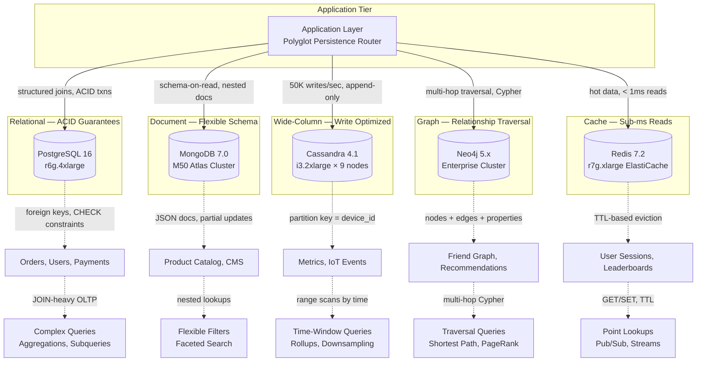
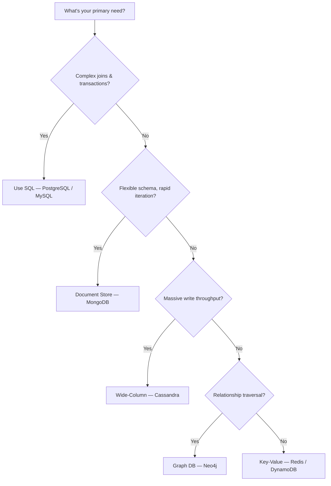
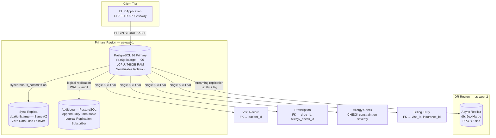
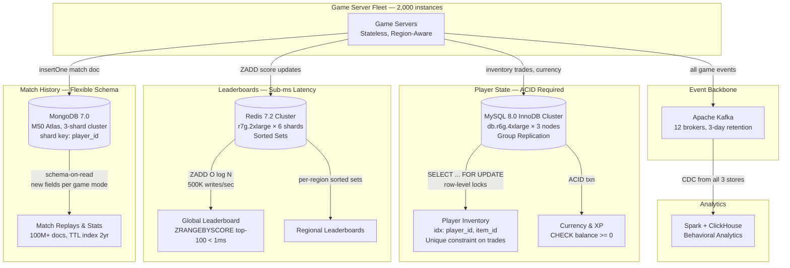
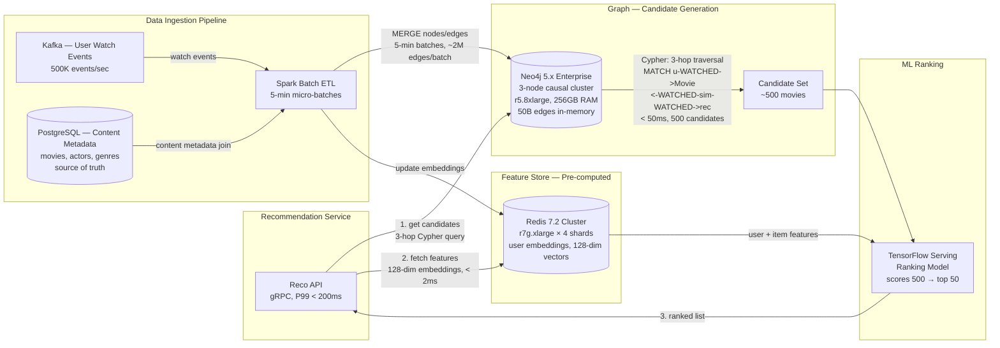

# SQL vs NoSQL

Choosing between SQL and NoSQL is not about which is "better" — it's about which data model, consistency guarantees, and scaling characteristics match your workload. SQL databases (PostgreSQL, MySQL) enforce schemas and ACID transactions, making them ideal for relational data with complex joins. NoSQL databases (MongoDB, Cassandra, Neo4j) trade some of those guarantees for flexible schemas, horizontal scalability, or specialized data models. Most real-world systems use both.

## Intent

- Understand the fundamental trade-offs between relational and non-relational data stores.
- Map workload characteristics (schema rigidity, query patterns, scale, consistency needs) to the right database type.
- Recognize that polyglot persistence — using multiple databases for different use cases — is the norm, not the exception.

## Architecture Overview

## Key Concepts

### ACID vs BASE

| Property        | ACID (SQL)                                 | BASE (NoSQL)                                |
| --------------- | ------------------------------------------ | ------------------------------------------- |
| **Atomicity**   | All-or-nothing transactions                | Partial writes possible                     |
| **Consistency** | Every read sees the latest committed write | Eventually consistent                       |
| **Isolation**   | Concurrent transactions don't interfere    | Conflicts may be visible                    |
| **Durability**  | Committed data survives crashes            | Durable (usually), but tunable              |
| **Trade-off**   | Higher latency, harder to scale writes     | Lower latency, easier to scale horizontally |

### NoSQL Data Models

| Type               | Data Model                 | Query Strength                | Example DBs                   | Best For                         |
| ------------------ | -------------------------- | ----------------------------- | ----------------------------- | -------------------------------- |
| **Document Store** | JSON/BSON documents        | Flexible queries, nested data | MongoDB, CouchDB, Firestore   | Catalogs, CMS, user profiles     |
| **Wide-Column**    | Row key → column families  | Fast writes, range scans      | Cassandra, HBase, ScyllaDB    | Time-series, IoT, event logs     |
| **Key-Value**      | Simple key → value         | Point lookups by key          | Redis, DynamoDB, Riak         | Caching, sessions, config        |
| **Graph**          | Nodes + edges + properties | Relationship traversal        | Neo4j, Amazon Neptune, Dgraph | Social networks, fraud detection |

### Decision Guide

---

**Why this example:** Healthcare is the canonical case where partial writes are not just a bug but a patient safety hazard — a half-committed prescription without its corresponding allergy check can be lethal. This scenario forces the strongest possible argument for ACID: when "eventually consistent" is medically unacceptable. It also illustrates why vertical scaling with a powerful relational instance often beats sharding when queries require cross-entity joins (patient → visits → prescriptions → drugs).

## Industry Problem 1 — Healthcare Records Requiring Strict ACID (Epic Scale)

**Problem:** A hospital information system manages electronic health records (EHR) for 10 million patients. A single patient visit may update allergies, prescriptions, lab orders, and billing in a single transaction. Partial updates are life-threatening — if a prescription is recorded but the allergy check is lost, the patient could receive a dangerous drug. Regulatory audits require full transaction history.

**Solution:**

**How this solves the problem:** Wrapping all visit updates — allergies, prescriptions, labs, billing — in a single `SERIALIZABLE` transaction guarantees that either every change commits or none do; a failed allergy check rolls back the entire visit, preventing dangerous partial state. Synchronous replication to a same-AZ replica ensures zero data loss on primary failure, while the async DR replica in us-west-2 provides geographic disaster recovery with < 5-second RPO. The append-only audit log, fed by PostgreSQL logical replication, creates an immutable HIPAA-compliant trail of every row change without impacting primary write performance. Vertical scaling on a 96-vCPU instance avoids sharding, preserving the cross-patient joins needed for population health analytics.

**Key decisions:**

- **PostgreSQL with serializable isolation** — all visit updates are wrapped in a single ACID transaction. If the allergy check fails, the entire visit update rolls back. Zero tolerance for partial writes.
- **Append-only audit log** — every row change is captured via PostgreSQL logical replication into an immutable audit table. Meets HIPAA audit trail requirements.
- **Schema-on-write enforcement** — strict foreign keys and CHECK constraints prevent bad data at the database level. Unlike a document store, invalid data is rejected, not silently stored.
- **Vertical scaling first** — EHR workloads are join-heavy (patient → visits → prescriptions → drugs). A single powerful PostgreSQL instance (96 vCPUs, 768GB RAM) handles 10M patients. Sharding would break cross-patient queries needed for population health analytics.

---

**Why this example:** Gaming is the quintessential polyglot persistence scenario — a single application with three radically different data access patterns that no single database can serve well. Player inventory demands ACID (duplicating a rare sword breaks the economy), leaderboards demand sub-millisecond sorted-set operations at 500K writes/sec, and match history demands a flexible schema that evolves with every new game mode. This forces three databases to coexist under one application, making it the ideal case study for when and how to split data across stores.

## Industry Problem 2 — Gaming Platform with Player State and Leaderboards (Riot Games Scale)

**Problem:** A multiplayer game has 100M registered players. During peak, 8M are online simultaneously. Player state (inventory, XP, currency) requires strong consistency — duplicating a rare item would destroy the game economy. Leaderboards must update in real-time and handle 500K score writes/sec. Match history needs flexible schemas as game modes evolve quarterly.

**Solution:**

**How this solves the problem:** MySQL InnoDB with `SELECT ... FOR UPDATE` provides row-level locking on inventory rows, ensuring that concurrent item trades are serialized and a rare sword can never be duplicated — protecting the game economy with ACID guarantees. Redis Sorted Sets handle 500K leaderboard writes/sec via `ZADD` with O(log N) complexity across 6 shards, returning top-100 rankings in under 1ms — a latency target impossible to hit with a relational database doing `ORDER BY score LIMIT 100` under write contention. MongoDB's schema-on-read model absorbs quarterly game-mode changes (new fields, new stat shapes) without migration downtime, while its shard key on `player_id` distributes 100M+ match documents evenly. Kafka ties the three stores together, providing a unified event stream for analytics without coupling the game servers to the analytics pipeline.

**Key decisions:**

- **MySQL InnoDB for player state** — inventory trades and currency transfers require ACID transactions. `SELECT ... FOR UPDATE` locks prevent item duplication during concurrent trades.
- **Redis Sorted Sets for leaderboards** — `ZADD` handles 500K writes/sec with O(log N) complexity. `ZRANGEBYSCORE` returns top-100 in < 1ms. Redis is authoritative for rankings; MySQL is authoritative for player state.
- **MongoDB for match history** — match schemas change frequently (new game modes add fields). MongoDB's flexible document model avoids schema migrations. 100M+ match documents, queried by player_id (indexed).
- **Polyglot persistence** — three databases, each chosen for its strength. The game server orchestrates, and Kafka provides an event stream for analytics to consume from all three.

---

**Why this example:** Recommendation engines expose the exact weakness of relational databases — multi-hop relationship traversals. A 3-hop collaborative filtering query ("users who watched X also watched Y") requires 3 self-joins on a 50B-edge table, which takes minutes in SQL but milliseconds in a native graph database. This scenario demonstrates that data model shape (graph vs. table) matters more than raw performance tuning, and shows how graph databases complement — rather than replace — relational stores in a larger ML pipeline.

## Industry Problem 3 — Recommendation Engine with Graph Relationships (Netflix Scale)

**Problem:** A streaming platform serves 250M subscribers. The recommendation engine must traverse relationships: "users who watched X also watched Y," "movies with actor A in genre B," and "friends of user who liked Z." These are multi-hop graph traversals. Storing this in a relational database requires expensive self-joins on a table with 50B+ edges. Query latency must be < 200ms.

**Solution:**

**How this solves the problem:** Neo4j's native graph storage represents the 50B user-movie-actor edges as adjacency lists, enabling a 3-hop Cypher traversal to return 500 collaborative-filtering candidates in under 50ms — the same query expressed as 3 self-joins in SQL would scan billions of rows and take minutes. Separating candidate generation (graph recall) from ranking (ML precision) means Neo4j only needs to find plausible candidates, while TensorFlow Serving scores and ranks them to the top 50, keeping end-to-end latency under 200ms at P99. The Redis feature store pre-computes 128-dimensional user embeddings, delivering them to the ML model in < 2ms and avoiding expensive feature computation at inference time. Batch ETL via Spark micro-batches (every 5 minutes) updates the graph from Kafka watch events and PostgreSQL content metadata, keeping the graph fresh without overwhelming Neo4j's write throughput with per-event updates.

**Key decisions:**

- **Neo4j for relationship traversal** — a Cypher query like `MATCH (u:User)-[:WATCHED]->(:Movie)<-[:WATCHED]-(similar:User)-[:WATCHED]->(rec:Movie) RETURN rec` finds collaborative-filtering candidates in < 50ms for 3-hop traversals. The same query in SQL requires 3 self-joins on a 50B-row table — minutes, not milliseconds.
- **Graph for candidate generation, ML for ranking** — Neo4j generates 500 candidates via graph traversal; the ML model scores and ranks them to 50. This separates recall (graph) from precision (ML).
- **Batch ETL updates the graph** — user watch events flow into Kafka → Spark → Neo4j in near-real-time (5-minute batches). The graph is not updated on every click — that would overwhelm write throughput.
- **Redis feature store for low-latency ML inference** — user features (watch history embedding, preferences) are pre-computed and cached in Redis. The ML model reads features in < 5ms.

---

## Comparison Summary

| Dimension          | SQL (PostgreSQL/MySQL)       | Document (MongoDB)                 | Wide-Column (Cassandra)          | Graph (Neo4j)                  |
| ------------------ | ---------------------------- | ---------------------------------- | -------------------------------- | ------------------------------ |
| **Schema**         | Rigid, enforced              | Flexible, schema-on-read           | Column families, semi-structured | Nodes, edges, properties       |
| **Transactions**   | Full ACID                    | Single-doc ACID, multi-doc limited | No multi-row transactions        | ACID within single graph       |
| **Scaling writes** | Vertical (or shard manually) | Built-in sharding                  | Peer-to-peer, linear scale       | Vertical; federation for scale |
| **Query power**    | SQL — joins, aggregations    | Rich query language, no joins      | Limited — primary key lookups    | Cypher — multi-hop traversals  |
| **Best for**       | OLTP, complex relationships  | Rapid prototyping, catalogs        | Time-series, IoT, high-write     | Social, fraud, recommendations |
| **Worst for**      | Massive write scale          | Complex multi-collection joins     | Ad-hoc queries, aggregations     | Tabular analytics, simple CRUD |

## Anti-Patterns

- **NoSQL because it's trendy:** Choosing MongoDB for a banking ledger because "NoSQL scales" ignores the need for multi-document ACID transactions.
- **SQL for everything:** Forcing a 50B-edge social graph into a relational schema results in queries that take minutes instead of milliseconds.
- **Ignoring polyglot persistence:** Using one database for all workloads means you optimize for none. It's fine to use 3 databases if each fits its workload.
- **Schema-on-read without validation:** "Flexible schema" doesn't mean "no schema." Without application-level validation, MongoDB collections drift into inconsistent shapes that break downstream consumers.

## Key Takeaway

> There is no universal best database. **SQL gives you correctness guarantees** (ACID, referential integrity) at the cost of scaling complexity. **NoSQL gives you scale and flexibility** at the cost of consistency and query power. Map each workload to the database whose strengths match its requirements — and don't be afraid to use more than one.
