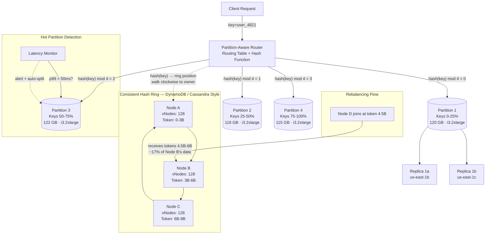
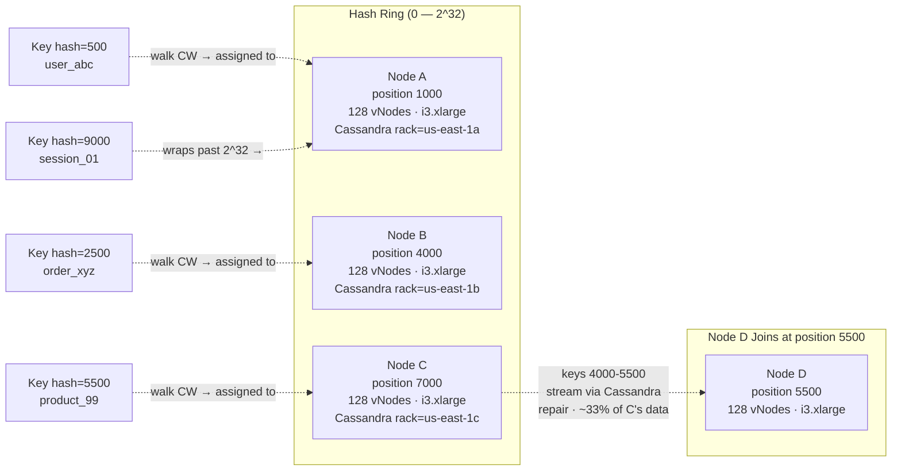
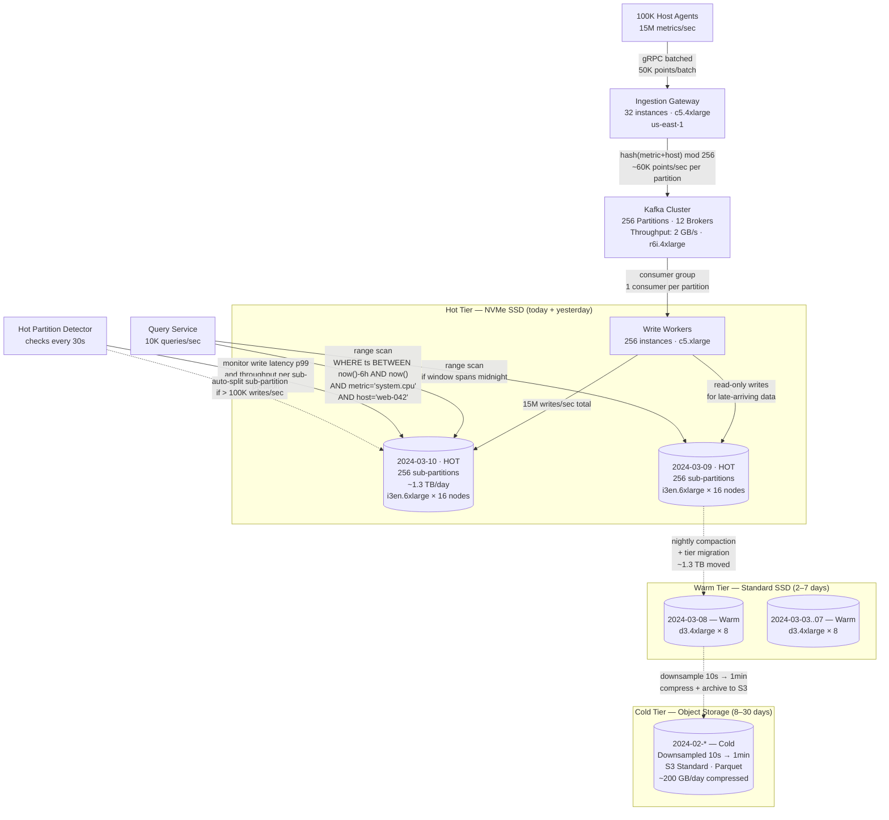
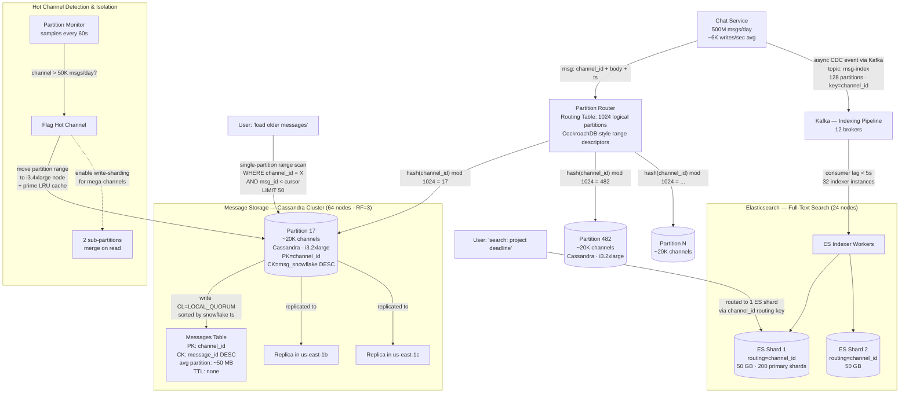
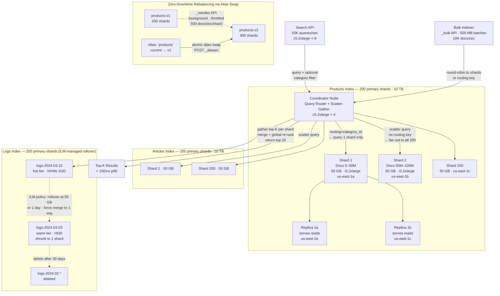

# Data Partitioning

Data partitioning (also called **partitioning** or **sharding** at the storage layer) divides a dataset into smaller chunks distributed across multiple nodes so that queries and writes can be parallelized. While sharding focuses on the database tier, partitioning is a broader concept that applies to message queues, search indices, file systems, and caches. The core challenge is the same: distribute data evenly, route queries efficiently, and rebalance gracefully as the cluster grows.

## Intent

- Split large datasets across multiple nodes to parallelize reads and writes.
- Minimize data movement when adding or removing nodes from the cluster.
- Avoid hot spots where one partition handles disproportionate traffic.

## Architecture Overview

The architecture above shows the two fundamental routing approaches side by side. The top half uses simple hash-mod routing where the router computes `hash(key) mod N` and sends the request directly to the owning partition — fast and stateless, but adding a 5th node would remap ~80% of keys. The bottom half shows consistent hashing (used by DynamoDB and Cassandra) where keys and nodes share a ring, and adding Node D only moves the keys in its token range from one neighbor. The hot partition detector watches write latency per partition and triggers automatic splitting before a hot spot becomes user-visible.

## Key Concepts

### Partitioning Strategies

| Strategy               | How It Works                                      | Pros                                     | Cons                                 |
| ---------------------- | ------------------------------------------------- | ---------------------------------------- | ------------------------------------ |
| **Range Partitioning** | Keys divided into contiguous ranges per partition | Efficient range scans within a partition | Hot spots on sequential writes       |
| **Hash Partitioning**  | Hash(key) mod N determines partition              | Even distribution                        | Range queries require scatter-gather |
| **Consistent Hashing** | Keys and nodes mapped to a hash ring              | Minimal data movement on node add/remove | Uneven load without virtual nodes    |
| **Compound Key**       | Partition by hash(pk), sort by secondary key      | Enables range scans within a partition   | More complex key design              |

### Consistent Hashing Deep Dive

When **Node D** is added at position 5500, only keys between 4000–5500 move from Node C to Node D — roughly 33% of Node C's data, and 0% from Nodes A and B. Without consistent hashing (simple mod N), adding a 4th node would redistribute ~75% of all keys across every node in the cluster.

**Virtual nodes** solve uneven distribution: each physical node owns 100–200 virtual positions on the ring, smoothing the load. In Cassandra, the `num_tokens` setting (default 256) controls how many virtual nodes each physical node claims on the ring. With virtual nodes, the data owned by a departing node is spread across many remaining nodes rather than dumped onto a single successor, making rebalancing both faster and more even.

### Hot-Spot Mitigation

| Technique                         | Description                                            | Example                                     |
| --------------------------------- | ------------------------------------------------------ | ------------------------------------------- |
| **Salted keys**                   | Append a random suffix to the key to spread writes     | `celebrity_id:07` instead of `celebrity_id` |
| **Split hot partition**           | Detect hot partition and subdivide it                  | Kafka partition splitting                   |
| **Write sharding + fan-out read** | Write to N random partitions, merge on read            | Like counters for viral posts               |
| **Time-bucketed keys**            | Include time window in key to rotate the hot partition | `metrics:2024-03-10T14:00` per hour         |

### Rebalancing Strategies

| Strategy                   | Data Movement                            | Downtime      | Complexity | Used By                      |
| -------------------------- | ---------------------------------------- | ------------- | ---------- | ---------------------------- |
| **Fixed partition count**  | Move entire partitions between nodes     | Zero (online) | Low        | Kafka, Elasticsearch         |
| **Dynamic splitting**      | Split large partitions, merge small ones | Zero          | Medium     | CockroachDB, DynamoDB, HBase |
| **Consistent hashing**     | Move only keys in the affected range     | Zero          | Low        | Cassandra, Memcached, Riak   |
| **Full reshuffle (mod N)** | Redistribute ~(N-1)/N of all data        | Significant   | Low        | Simple hash-mod schemes      |

The best strategy depends on whether you can tolerate data movement during rebalancing. **Fixed partition count** (used by Kafka and Elasticsearch) pre-allocates more logical partitions than physical nodes, so scaling up simply means reassigning logical partitions — no data splitting or key re-hashing. **Dynamic splitting** (CockroachDB and DynamoDB) monitors partition sizes at runtime and splits hot or oversized partitions automatically, at the cost of more complex metadata management. Avoid full reshuffle (mod N) in production — it's only acceptable for batch-rebuild jobs where you can afford to rewrite all data.

---

## Industry Problem 1 — Time-Series Metrics at Datadog Scale

**Why this example:** Time-series metrics are the canonical case for time-range partitioning because virtually every query includes a time window, making time the natural partition boundary. This scenario also forces you to solve the "hot partition" problem — all current writes hammer today's single partition — while simultaneously managing a tiered storage lifecycle from NVMe to S3. Few other workloads combine such extreme write throughput (15M points/sec) with such predictable query locality.

**Problem:** A monitoring platform ingests 15 million metrics per second from 100K hosts. Each metric is a `(metric_name, host, timestamp, value)` tuple. Queries are almost always time-bounded: "show CPU usage for host X in the last 6 hours." Data older than 30 days is downsampled. The write rate grows 40% year-over-year.

**Solution:**

**How this solves the problem:** Time-based range partitioning ensures that all current writes land on today's partition, while queries like "CPU usage for host X in the last 6 hours" touch at most two partitions (today + yesterday) instead of scanning the entire dataset. The 256 sub-partitions within each day, keyed by `hash(metric_name + host)`, prevent any single metric from creating a hot spot — even `system.cpu` across 100K hosts spreads evenly across sub-partitions. Automatic tiering moves aging data through NVMe → SSD → S3 without manual intervention, keeping storage costs proportional to data temperature. The 1:1 mapping between Kafka partitions and DB sub-partitions eliminates cross-partition coordination during writes, enabling the system to sustain 15M writes/sec with horizontal scaling.

**Key decisions:**

- **Time-based range partitioning** — each partition covers one day. All current writes hit today's partition. This keeps write I/O localized and makes archival simple: move yesterday's partition to cheaper storage.
- **Compound key: hash(metric_name + host) for sub-partitioning within a day** — prevents a single hot metric (e.g., `system.cpu` across 100K hosts) from overwhelming one node. 256 sub-partitions per day.
- **Automatic tiering** — hot partitions (today, yesterday) on NVMe SSDs. Warm partitions (2–7 days) on standard SSDs. Cold partitions (8–30 days) downsampled to 1-minute granularity and archived to S3.
- **Kafka partitions match DB sub-partitions** — each Kafka partition maps 1:1 to a DB sub-partition. Write workers consume in parallel with zero cross-partition coordination.
- **Pre-created future partitions** — partitions for the next 7 days are pre-created during off-peak hours, avoiding the latency spike of creating a partition at midnight when writes switch to the new day.

---

## Industry Problem 2 — Chat Platform Message Storage (Slack/Discord Scale)

**Why this example:** Chat message storage is a textbook case for hash-partitioning by entity ID because the dominant query — "load messages in channel X" — is always scoped to a single channel, yet write volume varies by 200x between channels. This scenario uniquely illustrates the tension between even data distribution (hash partitioning) and supporting two very different access patterns (chronological pagination vs. full-text search) on the same dataset, requiring dual partitioning strategies running in parallel.

**Problem:** A chat platform stores 500M messages/day across 20M channels. Messages must be queryable by channel in chronological order. Some channels (company-wide announcements) receive 10K messages/day while most receive < 50. The system must support "load older messages" pagination and full-text search within a channel.

**Solution:**

**How this solves the problem:** Hashing by `channel_id` ensures all messages for a given channel are co-located on a single Cassandra partition, making "load older messages" a simple, single-partition range scan with cursor-based pagination — no scatter-gather across nodes. The 1024 logical partitions distribute 20M channels evenly (~20K channels each), and physical nodes can host multiple logical partitions, so adding capacity means reassigning logical partitions without re-hashing any keys. Hot channels (>50K msgs/day) are automatically detected and isolated to higher-spec hardware, and mega-channels can be write-sharded into sub-partitions that merge on read, preventing a viral company-wide announcement channel from degrading performance for quieter channels. Full-text search is handled by a separate Elasticsearch tier with `channel_id` as a routing key, so search queries also hit a single shard, keeping both access patterns under 50ms p99.

**Key decisions:**

- **Hash partition by channel_id, sort by message_id (timestamp-based snowflake)** — all messages for a channel live on the same partition, sorted chronologically. "Load older messages" is a simple range scan with a cursor — no scatter-gather.
- **Fixed 1024 logical partitions** — 20M channels distributed across 1024 partitions (~20K channels each). Physical nodes host multiple logical partitions. Adding capacity means moving logical partitions, not re-hashing keys.
- **Hot channel detection and isolation** — channels exceeding 50K messages/day are flagged. Their partition gets placed on higher-spec hardware, or an in-memory LRU cache is primed.
- **Async indexing to Elasticsearch** — on each message write, an event is published to Kafka, consumed by Elasticsearch indexer. Search partitions are aligned to message partitions by channel_id for locality. Search lag is < 5 seconds.
- **TTL-based archival for inactive channels** — channels with no activity for 90 days have their messages migrated to cold storage (S3 + on-demand rehydration). This keeps the active Cassandra dataset under 50 TB, ensuring compaction and repair cycles complete within maintenance windows.

---

## Industry Problem 3 — Search Index Partitioning at Elasticsearch Scale

**Why this example:** Search index partitioning is fundamentally different from transactional database sharding because every query is inherently a scatter-gather operation across shards — there is no single "partition key" for free-text queries. This makes it the ideal scenario to explore how routing keys, index-per-type isolation, and shard sizing interact to minimize fan-out. It also demonstrates zero-downtime rebalancing through index aliases, a pattern unique to search systems that has no equivalent in traditional database partitioning.

**Problem:** A search platform indexes 10 billion documents (product listings, articles, logs). Users expect full-text search results in < 100ms p99. The index size is 30TB. A single Elasticsearch node can hold about 50GB per shard before performance degrades. Adding new document types (videos, podcasts) should not require re-indexing the entire corpus.

**Solution:**

**How this solves the problem:** The 600 primary shards (200 per index type) keep each shard at ~50 GB, the sweet spot for Elasticsearch performance, while 2 replicas per shard triple read throughput and provide fault tolerance across 60 data nodes in three availability zones. The index-per-type strategy means adding a "podcasts" document type is just creating a new index — zero impact on existing products or articles indices, no reindexing. For the most common query pattern (search within a product category), the `category_id` routing key directs the query to a single shard instead of fanning out to all 200, cutting latency by two orders of magnitude. The ILM-managed logs index automatically rolls over, shrinks, and deletes based on age, preventing unbounded index growth. When capacity needs to grow, the alias-based rebalancing creates a new index with more shards in the background and atomically swaps the alias pointer, achieving zero-downtime shard rebalancing without any query interruption.

**Key decisions:**

- **600 primary shards, 2 replicas each = 1800 total shards** — each primary shard holds ~50GB (30TB / 600). Distributed across 60 data nodes (10 primary shards per node). Replicas serve read traffic and provide fault tolerance.
- **Index-per-type strategy** — products, articles, and logs each have their own Elasticsearch index with independent shard counts and retention policies. Adding a "podcasts" index doesn't touch existing indices.
- **Routing key to avoid scatter-gather** — product searches include `category_id` as a routing key. Documents with the same category land on the same shard. A search within "Electronics" queries 1 shard instead of 600. For cross-category searches, the coordinator fans out to all shards but uses early termination to short-circuit once enough top-K results are found.
- **Rebalancing via index aliases** — to add capacity, create a new index with more shards, reindex in the background, then atomically swap the alias. Zero-downtime rebalancing with no query interruption.
- **ILM for logs lifecycle** — logs use Index Lifecycle Management with four phases: hot (NVMe, full replicas), warm (HDD, shrunk to 1 shard), cold (frozen tier, searchable snapshots), and delete (after 30 days). Each phase automatically triggers via age or size thresholds.

---

## Cross-Cutting Concerns

### Partition-Aware Query Routing

The most critical design decision in any partitioned system is how queries find the right partition. There are three common approaches:

1. **Client-side routing** — the client library knows the partition map and sends requests directly to the owning node. Used by Cassandra drivers and Redis Cluster. Lowest latency (no proxy hop) but requires smart clients.
2. **Proxy-based routing** — a stateless proxy layer holds the partition map and forwards requests. Used by MongoDB's `mongos`, Vitess's `vtgate`, and Kafka's consumer group coordinator. Simpler clients but adds a network hop.
3. **Coordinator-node routing** — any node can accept any request and internally routes it to the correct partition owner. Used by Elasticsearch and CockroachDB. Simplest client experience but requires inter-node communication.

### Monitoring Partition Health

Partition skew is inevitable over time. Monitor these signals continuously:

- **Size skew** — partition sizes should stay within 2x of the median. A partition 5x larger than average needs splitting.
- **Throughput skew** — one partition handling 10x the QPS of others indicates a hot partition key.
- **Latency skew** — if p99 latency on one partition is 3x higher than others, it's likely overloaded or on degraded hardware.

## Partitioning Patterns Summary

| Pattern                        | Description                                   | Example                             |
| ------------------------------ | --------------------------------------------- | ----------------------------------- |
| **Time-range partitioning**    | Partition by time windows (hour, day, month)  | Metrics, logs, event streams        |
| **Hash partitioning**          | Hash(key) mod N for even distribution         | User data, chat channels            |
| **Consistent hashing**         | Minimize data movement on cluster resize      | DynamoDB, Cassandra, Memcached      |
| **Index-per-type**             | Separate indices for different document types | Elasticsearch multi-type search     |
| **Compound partitioning**      | Hash(partition_key) + sort(range_key)         | DynamoDB, Cassandra                 |
| **Routing-aware partitioning** | Co-locate related data on the same partition  | Category-based search, tenant-based |

## Anti-Patterns

- **Too few partitions:** Starting with 4 partitions for a dataset that will grow to 10TB means each partition is 2.5TB — too large to move or rebalance. Start with more logical partitions than you need (e.g., 256 or 1024). Kafka defaults to 1 partition per topic — always override this for production topics.
- **Partition key with low cardinality:** Partitioning by `country` gives you ~200 partitions with wildly uneven sizes (US vs Luxembourg). Combine with a secondary key or use a hash of the low-cardinality field concatenated with a high-cardinality one.
- **Scatter-gather on every query:** If every user query fans out to all N partitions, latency scales with the slowest partition (tail-latency amplification). Design the partition scheme around the most common query pattern, and use routing keys to avoid fan-out where possible.
- **Manual rebalancing:** Relying on operators to manually move partitions is error-prone and slow. Use built-in rebalancing (Kafka partition reassignment, Elasticsearch shard allocation, CockroachDB automatic range splitting) or consistent hashing with virtual nodes.
- **Ignoring partition size skew:** Even with a good partition key, data can skew over time (e.g., one tenant grows 100x). Monitor partition sizes and set up automatic splitting thresholds — DynamoDB does this natively, but most systems require explicit configuration.

## Key Takeaway

> Partition your data around your **most common query pattern**, not your write pattern. If reads are time-bounded, partition by time. If reads are scoped to an entity, hash by that entity. The goal is to answer the majority of queries from a **single partition** — every scatter-gather query is a sign that the partitioning scheme doesn't match the access pattern.
