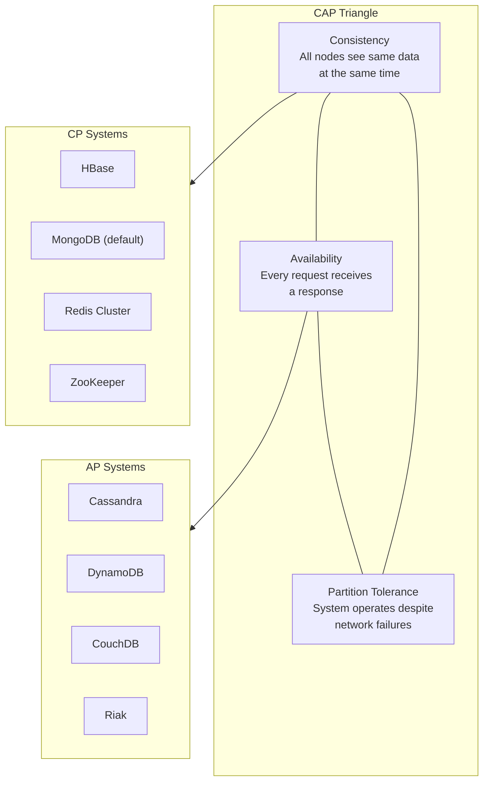
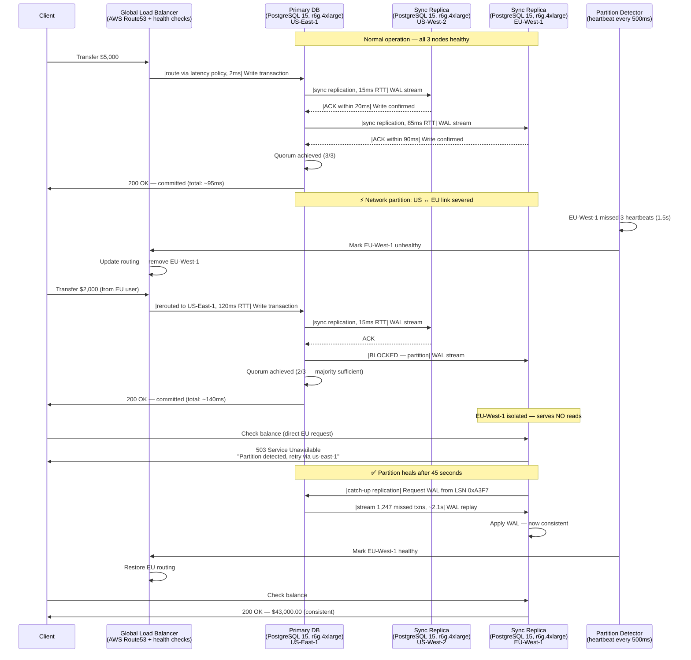
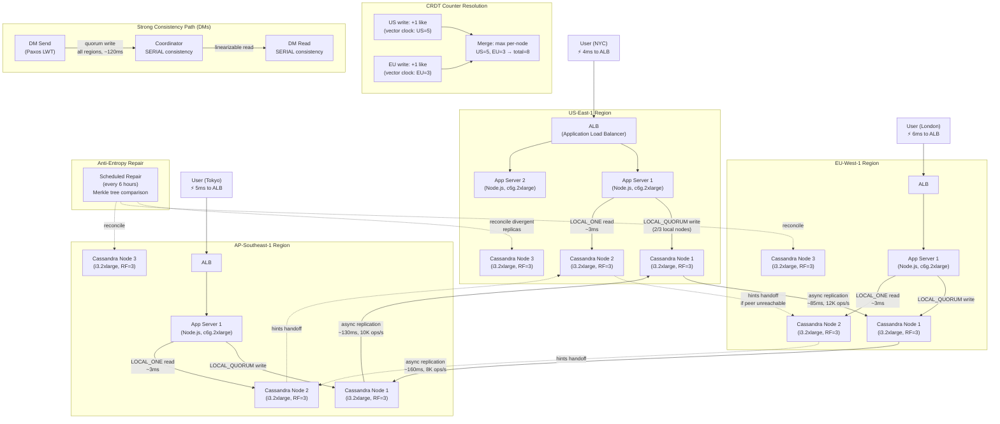
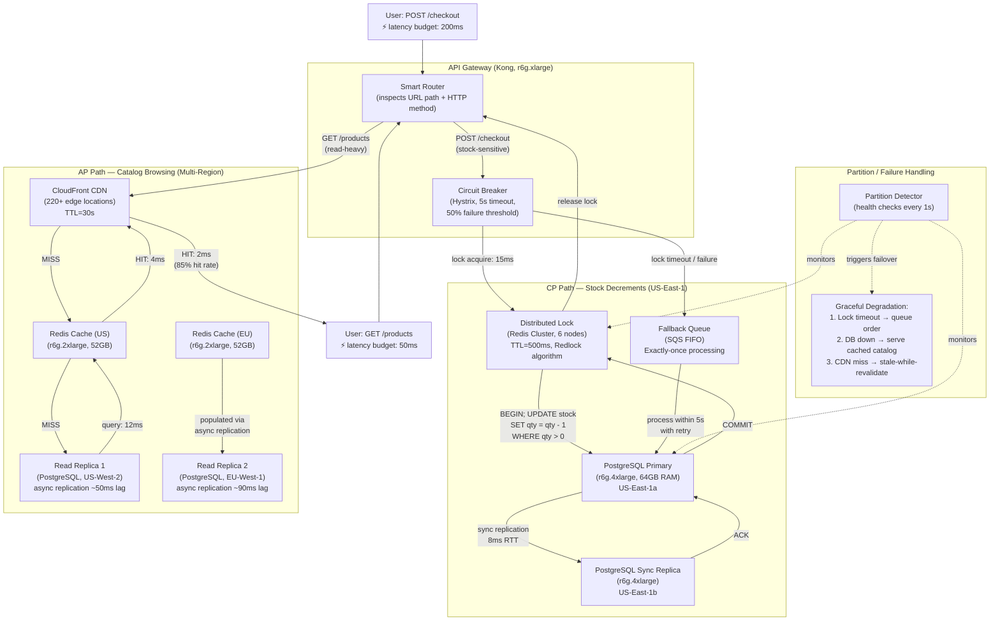

# CAP Theorem

The CAP theorem, formulated by Eric Brewer in 2000, states that a distributed data store can provide at most two out of three guarantees: Consistency, Availability, and Partition Tolerance. Since network partitions are inevitable in distributed systems, the real choice is between consistency and availability during a partition event.

## Intent

- Understand the trade-offs between consistency, availability, and partition tolerance in distributed systems
- Learn when to choose CP (consistent but may be unavailable) vs AP (available but may serve stale data) architectures
- Apply CAP reasoning to real-world system design decisions with quantifiable impact

## Architecture Overview

## Key Concepts

### CAP Properties

| Property            | Definition                               | During Partition                   | Example                |
| ------------------- | ---------------------------------------- | ---------------------------------- | ---------------------- |
| Consistency         | Every read returns the most recent write | Reject writes or block reads       | Bank balance query     |
| Availability        | Every request gets a non-error response  | Accept writes on all nodes         | Social media feed      |
| Partition Tolerance | System continues despite message loss    | Must be chosen — partitions happen | Any distributed system |

### Consistency Models Spectrum

| Model                 | Guarantee                          | Latency               | Use Case               |
| --------------------- | ---------------------------------- | --------------------- | ---------------------- |
| Strong (Linearizable) | Read always returns latest write   | 50-200ms cross-region | Financial transactions |
| Sequential            | Operations appear in program order | 20-100ms              | Distributed locks      |
| Causal                | Causally related ops are ordered   | 10-50ms               | Collaborative editing  |
| Eventual              | Replicas converge over time        | 1-10ms                | Social media likes     |

---

**Why this example:** Banking is the canonical CP scenario because financial transactions have zero tolerance for data inconsistency — a stale balance read can directly cause monetary loss through double-spending. This example uniquely illustrates how regulatory consequences (fines, audits) force architects to sacrifice availability in the minority partition, making the CP trade-off non-negotiable rather than preferential.

## Industry Problem 1: Banking System — Choosing CP

**How this solves the problem:** This architecture guarantees linearizable consistency by requiring a write quorum of 2/3 replicas before acknowledging any transaction. During the partition, EU-West-1 self-fences and returns 503 rather than serving potentially stale balance data — eliminating the double-spend risk entirely. The global load balancer detects the partition within 1.5 seconds via heartbeat failure and reroutes EU clients to the US-East majority partition, increasing latency to ~140ms but preserving correctness. The bank trades a brief availability gap (1.5s detection + DNS propagation) for absolute data integrity, which is the correct trade-off when a single inconsistent read can trigger $2M in regulatory fines.

**Problem**: A bank processes 12M transactions/day across 3 regions. During a 45-second network partition between US and EU, customers in EU must not see stale balances that could allow double-spending. A $50K overdraft incident costs the bank $2M in regulatory fines.

**Solution**: Deploy a CP architecture using synchronous replication with a quorum of 2/3 replicas. During partitions, the minority partition (EU) returns 503 rather than stale data. Clients retry against the majority partition via global load balancer failover within 3 seconds.

**Key Decisions**:

- Synchronous replication with write quorum of 2/3 nodes — adds 15ms latency but guarantees consistency
- EU clients get routed to US-East during partition via DNS failover (RTT ~120ms vs normal 8ms)
- Accept 0.01% request failure rate during partitions to prevent any inconsistent reads
- Implement read-your-writes consistency for balance checks using session stickiness

---

**Why this example:** Social media represents the purest AP use case because the cost of unavailability (lost ad revenue at $140K/hour) vastly outweighs the cost of temporary inconsistency (a like counter off by a few). This scenario highlights how eventual consistency is not just acceptable but strategically optimal when data naturally converges and users cannot perceive sub-second staleness in counters and feeds.

## Industry Problem 2: Social Media — Choosing AP with Eventual Consistency

**How this solves the problem:** This architecture achieves 99.99% availability by allowing every region to accept writes independently — even during inter-region partitions, no region becomes unavailable. The `LOCAL_QUORUM` write ensures durability within a region (2/3 local nodes must ACK) while `LOCAL_ONE` reads deliver sub-5ms latency at the cost of reading data up to ~200ms stale during cross-region propagation. Counter inconsistencies (10,203 vs 10,207 likes) are invisible to users and self-heal via asynchronous replication and periodic anti-entropy repair. The hinted handoff mechanism ensures that writes destined for temporarily unreachable nodes are buffered and replayed once connectivity restores, preventing data loss even during extended partitions.

**Problem**: A social platform serves 800M DAU across 3 regions. Users post 500K updates/minute. A like counter showing 10,203 vs 10,207 is acceptable, but returning an error page costs $140K/hour in ad revenue. Availability must be 99.99% (< 52 minutes downtime/year).

**Solution**: Use Cassandra with replication factor 3 and `LOCAL_QUORUM` for writes, `LOCAL_ONE` for reads. Each region accepts writes independently and replicates asynchronously. Conflict resolution uses last-write-wins (LWW) with vector clocks for counters.

**Key Decisions**:

- `LOCAL_ONE` reads give sub-5ms latency at the cost of reading stale data up to 200ms old
- CRDTs (Conflict-free Replicated Data Types) for counters — no merge conflicts, monotonically increasing
- Anti-entropy repair runs every 6 hours to fix divergent replicas
- Separate strong-consistency path for DMs using Paxos-based lightweight transactions

---

**Why this example:** E-commerce inventory is the most instructive CAP scenario because different operations within the same system demand opposite guarantees — checkout requires CP to prevent overselling a scarce item, while catalog browsing requires AP to handle 20M views/hour without latency spikes. This dual-path pattern demonstrates that CAP is a per-operation decision, not a system-wide one, which is the most practical takeaway for real-world architects.

## Industry Problem 3: Inventory Management — Balancing CP and AP per Operation

**How this solves the problem:** The smart router splits traffic by operation type, sending stock-sensitive checkout requests through the CP path (distributed lock → synchronous write → quorum commit) and read-heavy catalog requests through the AP path (CDN → cache → async replica). This gives checkout a 40ms latency with zero overselling via the Redlock algorithm and atomic `UPDATE ... WHERE qty > 0`, while catalog pages load in under 8ms at the CDN edge with 85% hit rate. When the CP path degrades (lock timeout or primary failure), the circuit breaker routes orders into an SQS FIFO queue for exactly-once processing within 5 seconds — converting a hard failure into a brief delay. The per-SKU consistency strategy adds further nuance: scarce items (<500 stock) always take the CP path, while bulk items (>10K stock) tolerate the AP path with periodic reconciliation, optimizing resource usage across the full inventory.

**Problem**: An e-commerce platform handles 50K orders/minute during flash sales. Overselling 100 units of a limited item (2,000 total stock) causes $300K in compensation costs. Meanwhile, product catalog pages (20M views/hour) must load in < 200ms or conversion drops 7%.

**Solution**: Implement a dual-path architecture. Checkout (stock decrement) uses a CP path with distributed locks and synchronous replication — 40ms latency but zero overselling. Catalog browsing uses an AP path with aggressive caching and async replicas — 8ms latency, data may be 30 seconds stale.

**Key Decisions**:

- Redis distributed lock with 500ms TTL for stock decrement — prevents double-sell across regions
- Catalog data cached in CDN with 30s TTL; stale stock counts are acceptable for browsing
- Circuit breaker on CP path: if lock service is down, queue the order and process within 5 seconds
- Per-SKU consistency: high-demand items (<500 stock) use CP; bulk items (>10K stock) use AP with periodic reconciliation

---

## Anti-Patterns

| Anti-Pattern                    | Problem                                  | Better Approach                                                  |
| ------------------------------- | ---------------------------------------- | ---------------------------------------------------------------- |
| Treating CAP as binary          | Applying one model to all operations     | Use per-operation consistency levels                             |
| Ignoring partition duration     | Designing for seconds but facing minutes | Plan for 30-min+ partitions with graceful degradation            |
| Strong consistency everywhere   | 200ms+ latency on every read             | Reserve strong consistency for writes that require it            |
| No conflict resolution strategy | Divergent data after partition heals     | Implement LWW, vector clocks, or CRDTs upfront                   |
| Ignoring PACELC                 | Only considering partition behavior      | Also optimize for latency vs consistency during normal operation |

---

> **Key Takeaway**: CAP is not a one-time architectural choice — it's a per-operation decision. The best distributed systems use CP for operations where inconsistency causes financial or safety harm, and AP for operations where availability and low latency drive business value. Design for the partition, but optimize for the common case.
