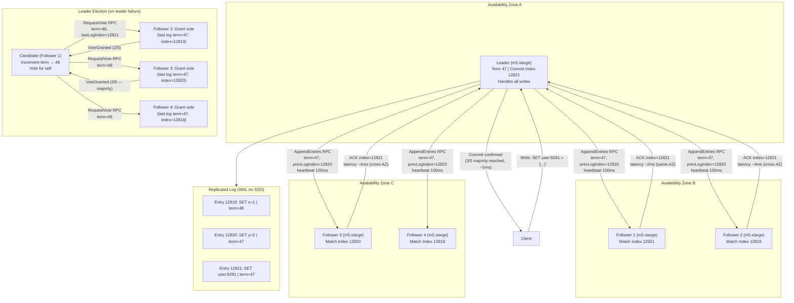
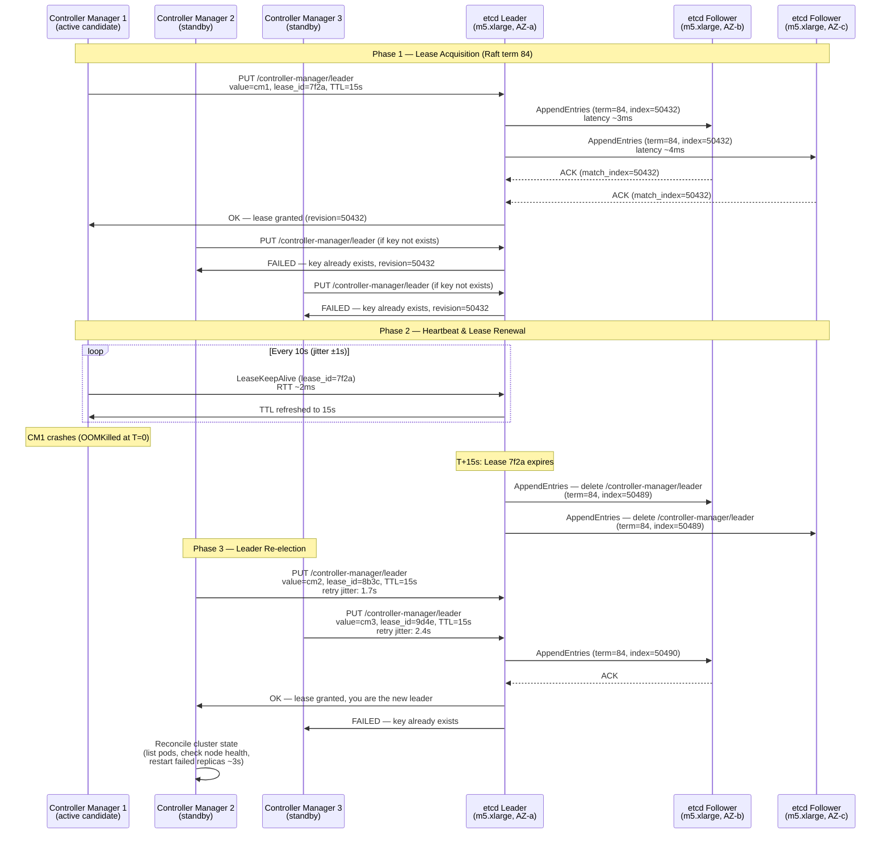
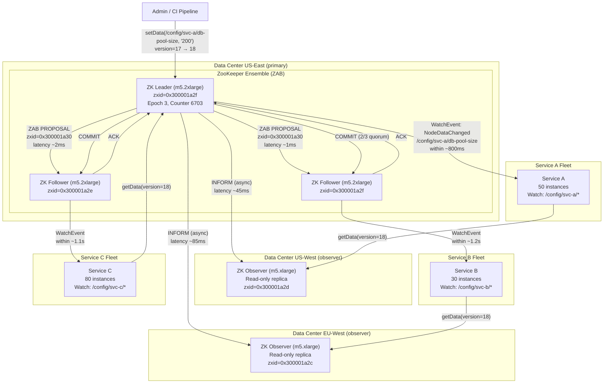
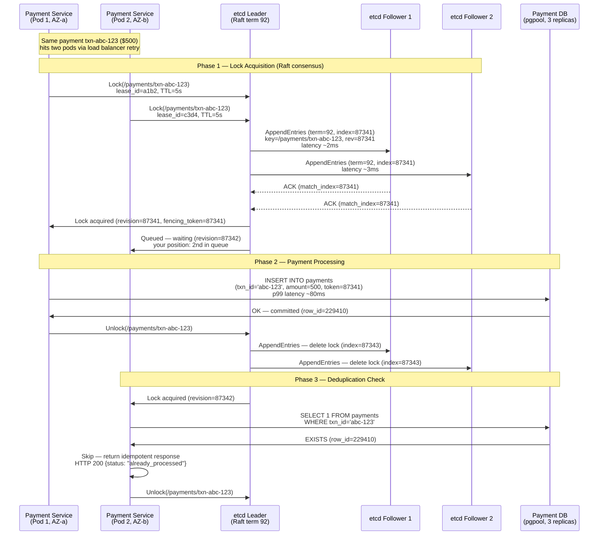

# Consensus Algorithms

Consensus algorithms allow a collection of distributed nodes to agree on a single value or sequence of operations, even when some nodes fail or messages are lost. They are the backbone of every reliable distributed system — from database replication to cluster coordination. Raft, Paxos, and their variants power systems like etcd, ZooKeeper, and CockroachDB.

## Intent

- Understand how distributed nodes reach agreement on state through leader election, log replication, and safety guarantees
- Compare Raft, Paxos, and ZAB algorithms in terms of complexity, performance, and real-world adoption
- Apply consensus mechanisms to solve practical problems like configuration management, distributed locks, and leader election

## Architecture Overview

The architecture spreads five Raft nodes across three availability zones so that the loss of any single AZ still leaves a majority (3 of 5) available to commit entries. The leader handles all client writes, replicates each entry via `AppendEntries` RPCs with term and index metadata, and commits only after a majority acknowledges. On leader failure, a follower with the most complete log wins the election via `RequestVote` RPCs, ensuring no committed entries are ever lost. Heartbeats at 100ms intervals prevent unnecessary elections, while randomized election timeouts (150-300ms) break symmetry so that two candidates rarely split the vote.

## Key Concepts

### Algorithm Comparison

| Algorithm   | Leader-Based    | Complexity | Latency (WAN) | Used By                  |
| ----------- | --------------- | ---------- | ------------- | ------------------------ |
| Raft        | Yes             | Moderate   | 50-150ms      | etcd, CockroachDB, TiKV  |
| Multi-Paxos | Yes             | High       | 50-200ms      | Google Spanner, Chubby   |
| ZAB         | Yes             | Moderate   | 40-120ms      | Apache ZooKeeper         |
| EPaxos      | No (leaderless) | Very High  | 30-80ms       | Research systems         |
| PBFT        | No              | Very High  | 100-500ms     | Blockchain (Hyperledger) |

### Raft Phases

| Phase             | Description                                         | Quorum Required                     | Timeout              |
| ----------------- | --------------------------------------------------- | ----------------------------------- | -------------------- |
| Leader Election   | Followers become candidates after election timeout  | Majority (N/2+1)                    | 150-300ms randomized |
| Log Replication   | Leader sends AppendEntries to followers             | Majority for commit                 | Heartbeat every 50ms |
| Safety            | Candidates with incomplete logs cannot win election | —                                   | —                    |
| Membership Change | Joint consensus for adding/removing nodes           | Majority of both old and new config | —                    |

---

**Why this example:** Kubernetes is the most widely deployed container orchestrator, and its control plane is a textbook case of single-leader coordination over a distributed cluster. This scenario uniquely illustrates lease-based leader election backed by Raft, where correctness (exactly one active controller) directly impacts thousands of running workloads and any violation causes cascading scheduling failures that are extremely difficult to recover from.

## Industry Problem 1: Kubernetes Control Plane Leader Election

**How this solves the problem:** The Raft consensus underneath etcd guarantees linearizable writes, meaning that among all competing controller managers, only one `PUT-if-not-exists` succeeds — eliminating the possibility of split-brain dual leadership. Lease TTL expiry is itself replicated through the Raft log, so all etcd nodes agree on precisely when a lease dies, even during network partitions. The jittered retry intervals on standby instances prevent election storms where multiple candidates simultaneously acquire and release leases. Total failover time (15s TTL expiry + ~2s acquisition) keeps the cluster within its 30-second recovery budget for the 99.9% SLA.

**Problem**: A Kubernetes cluster runs 2,000 pods across 50 nodes. The controller manager (responsible for pod scheduling, replication, and node monitoring) must have exactly one active leader. If two controller managers act simultaneously, conflicting scheduling decisions corrupt cluster state. If no leader exists for >30 seconds, failed pods are not restarted — impacting 99.9% SLA.

**Solution**: Use etcd's lease-based leader election backed by Raft consensus. The active controller manager holds a lease with a 15-second TTL and renews every 10 seconds. On leader failure, standby instances compete for the lease; etcd's linearizable writes guarantee exactly one winner. Failover completes in 15-20 seconds.

**Key Decisions**:

- Lease TTL of 15s balances fast failover vs false elections during transient network issues
- etcd cluster of 3 or 5 nodes — 3 nodes tolerate 1 failure, 5 tolerate 2 failures
- Stale reads prevented by requiring leader to confirm leadership with a quorum read before acting
- Jittered retry interval (1-3s) on standby instances prevents election storms

---

**Why this example:** Configuration management is the highest-frequency coordination task in microservice platforms — unlike leader election which is rare, config pushes happen dozens of times per day and must reach hundreds of instances consistently. This scenario exposes ZAB's ordered broadcast strength: partial config propagation (where some instances see the new value and others don't) causes resource exhaustion that is indistinguishable from a real outage, making atomic rollout a hard requirement.

## Industry Problem 2: Distributed Configuration Management

**How this solves the problem:** ZAB (ZooKeeper Atomic Broadcast) guarantees total order — every follower applies writes in exactly the same sequence, so all 160 service instances eventually see `db-pool-size=200` with no intermediate inconsistent state. The watch mechanism provides push-based notification, eliminating the need for polling and ensuring sub-second propagation to all registered watchers. Observer nodes in remote data centers absorb read traffic without participating in the write quorum, meaning that cross-DC config reads add zero latency to the commit path. The version field on each znode allows services to perform conditional reads, rejecting stale configs with version < 18 and guaranteeing that partial rollouts are detected and retried.

**Problem**: A platform runs 160 service instances across 3 data centers. A database connection pool size change must propagate to all instances atomically — if 50 instances use `pool=200` while 110 still use `pool=50`, the database hits its 10,000-connection limit and crashes. Configuration changes happen 20 times/day, and each must reach all instances within 5 seconds.

**Solution**: Store configuration in ZooKeeper znodes with watches. ZooKeeper's ZAB protocol guarantees that all followers see writes in the same order. Services register watches on config znodes and receive notifications within 1-2 seconds. A two-phase config rollout uses a version znode — services read new config only after the version is bumped.

**Key Decisions**:

- Ephemeral sequential znodes for service registration — automatic cleanup on disconnect
- Config versioning via znode version field — services reject stale configs with older versions
- Hierarchical namespace (`/config/service-a/db/pool-size`) for granular RBAC
- 3-node ZooKeeper ensemble per data center with cross-DC observer nodes for read scalability

---

**Why this example:** Payment deduplication is the canonical case where consensus correctness translates directly into monetary loss — every duplicate charge is measurable in dollars, making it the most concrete illustration of why distributed locks must be linearizable. Unlike config or leader election where brief inconsistency causes degraded service, a single lock failure here causes an irreversible financial error and a chargeback, demonstrating that consensus is not optional but a hard business requirement.

## Industry Problem 3: Distributed Lock for Payment Deduplication

**How this solves the problem:** The etcd lock leverages Raft's replicated log to assign a globally unique, monotonically increasing revision to each lock request — this revision doubles as a fencing token, meaning even if the lock holder crashes and a new holder takes over, the database can reject stale writes from a zombie process by comparing fencing tokens. Revision-based ordering ensures strict FIFO fairness: Pod 2 (revision 87342) will always wait for Pod 1 (revision 87341) to finish, eliminating race conditions entirely. The 5-second lease TTL is calibrated to be 60× the p99 DB write latency (80ms), providing ample headroom for processing while still recovering quickly from crashes. The database `UNIQUE` constraint on `txn_id` acts as a defense-in-depth layer, catching any edge case where consensus alone is insufficient (e.g., etcd cluster total failure during the write window).

**Problem**: A payment gateway processes 8,000 transactions/second across 12 pod replicas. Network retries and user double-clicks cause 0.3% duplicate requests (~24/sec). Without deduplication, duplicate charges cost $1.2M/month in chargebacks and customer trust erosion. The lock must be acquired in <10ms to avoid checkout latency SLA breaches.

**Solution**: Use etcd's distributed lock with revision-based ordering. Each payment gets a lock keyed by transaction ID. The first acquirer processes the payment; subsequent acquirers check the database and return an idempotent response. Lease-based TTL (5s) ensures locks are released even if the holder crashes.

**Key Decisions**:

- Lock granularity at transaction ID level — no contention between unrelated payments
- 5s lease TTL: long enough for a DB write (p99 = 80ms) but short enough for fast recovery
- etcd prefix-based range queries for monitoring lock contention per service
- Fallback to database unique constraint (`txn_id UNIQUE`) as a second deduplication layer
- Lock wait timeout of 3s — if lock not acquired, return 409 Conflict and let client retry

---

## Anti-Patterns

| Anti-Pattern                             | Problem                                          | Better Approach                                        |
| ---------------------------------------- | ------------------------------------------------ | ------------------------------------------------------ |
| Single-node consensus store              | No fault tolerance at all                        | Minimum 3 nodes; 5 for production                      |
| Storing large blobs in etcd/ZK           | Consensus stores are for metadata (< 1MB values) | Store data in S3/DB, store pointers in consensus store |
| Too-short election timeouts              | Frequent false leader elections under load       | Use randomized timeouts (150-300ms) with backoff       |
| Ignoring split-brain                     | Two leaders making conflicting decisions         | Fencing tokens — include leader epoch in every write   |
| Using consensus for high-throughput data | etcd handles ~10K writes/sec max                 | Use consensus for coordination, not data plane traffic |
| Even-numbered cluster (2 or 4 nodes)     | Cannot tolerate same failures as N+1 nodes       | Always use odd numbers: 3, 5, or 7 nodes               |
| No monitoring on leader changes          | Silent failovers hide instability                | Alert on leader change rate; >3/hour indicates issues  |
| Consensus across WAN without tuning      | High latency causes constant election timeouts   | Increase election timeout to 5-10× RTT; use witnesses  |
| Skipping fencing tokens on lock use      | Zombie lock holders can issue stale writes       | Always pass revision/epoch as fencing token to storage |

---

> **Key Takeaway**: Consensus algorithms solve the hardest problem in distributed systems — getting nodes to agree. Use them sparingly and for the right purpose: leader election, configuration, distributed locks, and metadata coordination. Keep the consensus data path small and fast, and build your high-throughput data plane on top of the guarantees consensus provides.
