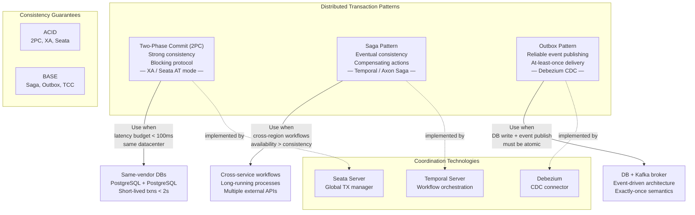
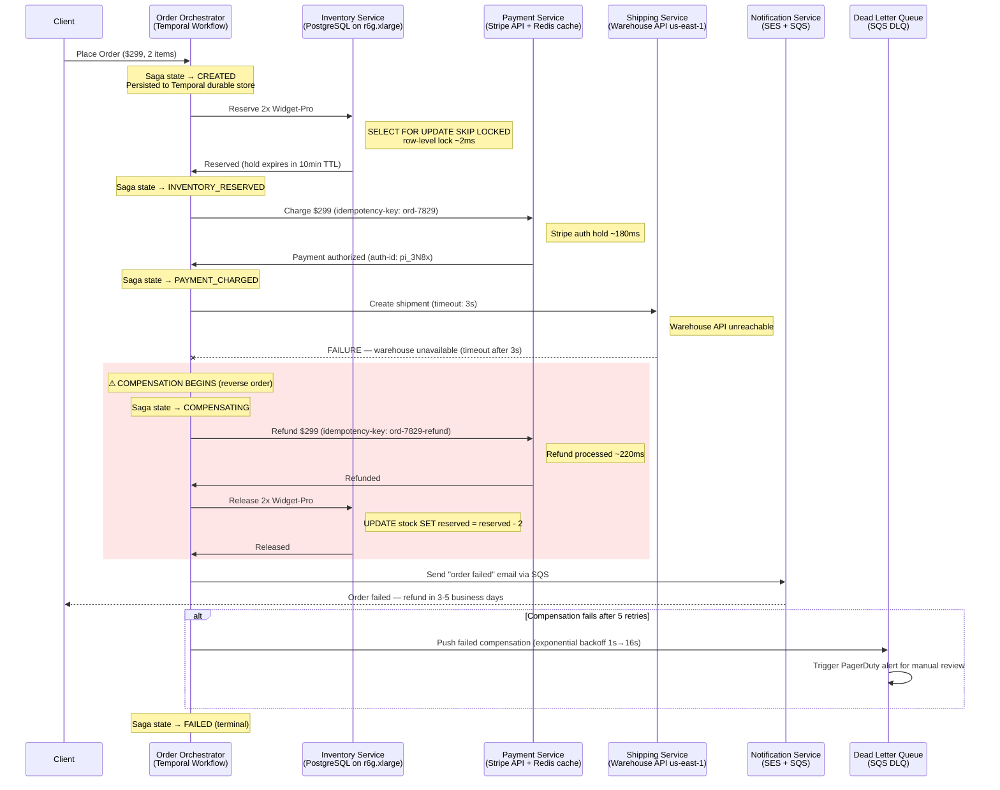
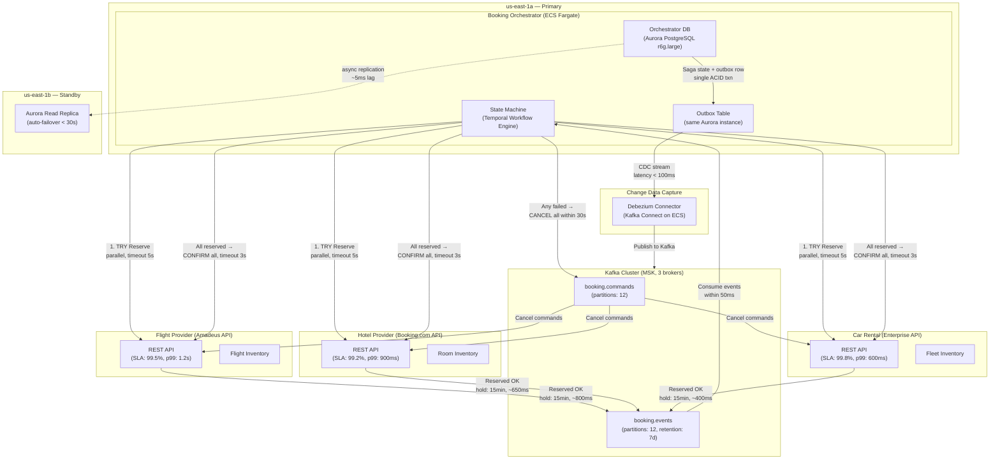
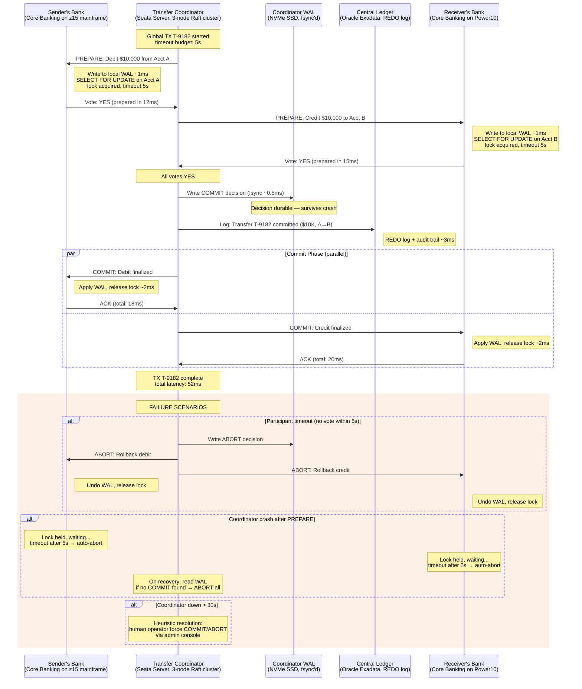

# Distributed Transactions

Distributed transactions coordinate state changes across multiple services or databases so that either all changes succeed or none do. In microservices architectures where each service owns its data, maintaining data consistency without a shared database requires patterns like two-phase commit, sagas, and the outbox pattern. The choice depends on consistency requirements, latency tolerance, and failure modes.

## Intent

- Understand the trade-offs between strong consistency (2PC) and eventual consistency (saga) in distributed transactions
- Learn practical patterns — outbox, compensating transactions, idempotency keys — for reliable cross-service operations
- Design transaction flows that handle partial failures, retries, and out-of-order delivery in production systems

## Architecture Overview

**How this solves the problem:** This architecture map provides a decision framework for choosing the right distributed transaction pattern based on specific system constraints. By mapping each pattern to its ideal use case — 2PC for same-datacenter strong consistency, sagas for cross-service eventual consistency, and outbox for atomic DB-write-plus-event-publish — teams avoid the common mistake of applying a single pattern everywhere. The inclusion of concrete technologies (Seata, Temporal, Debezium) bridges the gap between theoretical patterns and production implementation.

## Key Concepts

### Pattern Comparison

| Pattern                  | Consistency   | Availability        | Latency    | Complexity       | Use Case                      |
| ------------------------ | ------------- | ------------------- | ---------- | ---------------- | ----------------------------- |
| 2PC/XA                   | Strong (ACID) | Low during failures | 50-500ms   | Medium           | Same-DC database transactions |
| Choreography Saga        | Eventual      | High                | Varies     | High (debugging) | Simple 2-3 step workflows     |
| Orchestration Saga       | Eventual      | High                | Varies     | Medium           | Complex multi-step workflows  |
| Outbox + CDC             | Eventual      | High                | 100-2000ms | Medium           | DB write + event publish      |
| TCC (Try-Confirm-Cancel) | Strong-ish    | Medium              | 100-300ms  | High             | Reservation-based systems     |

### Saga Compensation Design

| Forward Action          | Compensating Action     | Idempotent?          | Notes                              |
| ----------------------- | ----------------------- | -------------------- | ---------------------------------- |
| Reserve inventory       | Release inventory       | Yes                  | Stock restored to original         |
| Charge payment          | Refund payment          | Yes                  | Refund via original payment method |
| Create shipment         | Cancel shipment         | Yes (if not shipped) | Time-window constraint             |
| Send confirmation email | Send cancellation email | Yes                  | Append-only — no undo              |
| Debit account           | Credit account          | Yes                  | Must match exact amount            |

---

**Why this example:** E-commerce order processing is the canonical distributed transaction problem because it spans four independently owned services — inventory, payment, shipping, notification — each with distinct failure modes and SLAs. It is representative because partial failures (e.g., payment succeeds but shipping fails) produce the most customer-visible and financially damaging inconsistencies. This scenario uniquely illustrates the orchestration saga pattern with reverse-order compensation under real production constraints like idempotency and TTL-based reservation holds.

## Industry Problem 1: E-Commerce Order Flow Across Services

**How this solves the problem:** The Temporal-based orchestration saga ensures that every forward step has a durable compensating action executed in reverse order, so a shipping failure after successful payment automatically triggers a refund and inventory release without human intervention. Saga state is persisted at each transition (CREATED → INVENTORY_RESERVED → PAYMENT_CHARGED → COMPENSATING → FAILED), meaning an orchestrator crash mid-compensation will resume from exactly the last completed step. The 10-minute inventory TTL acts as a safety net — even if the entire saga hangs, reserved stock auto-releases, preventing ghost reservations from accumulating. Failed compensations route to a dead letter queue with PagerDuty alerting, ensuring no inconsistency goes unnoticed.

**Problem**: An e-commerce platform processes 25K orders/hour across 4 independent services (inventory, payment, shipping, notification). Each service owns its database. If shipping fails after payment succeeds, the customer is charged $299 with no delivery. Manual reconciliation of 150 failed orders/day costs $45K/month in support overhead and delayed refunds.

**Solution**: Implement an orchestration saga with the Order Orchestrator as the coordinator. Each step is idempotent and has a defined compensating action. The orchestrator persists saga state to its own database (state machine: CREATED → INVENTORY_RESERVED → PAYMENT_CHARGED → SHIPPED → COMPLETED). On any step failure, it executes compensations in reverse order.

**Key Decisions**:

- Orchestrator persists saga state — survives orchestrator crashes and resumes from last completed step
- Idempotency keys on payment and refund — safe to retry without double-charging
- Inventory hold with 10-minute TTL — auto-releases if saga doesn't complete, prevents ghost reservations
- Compensations are fire-and-forget with retry queue (max 5 retries, exponential backoff)
- Dead letter queue for compensations that fail after retries — triggers PagerDuty alert for manual review

---

**Why this example:** Travel booking across independent external providers (flight, hotel, car) represents a uniquely challenging distributed transaction because the services are third-party APIs you don't control — each with different availability, timeout behavior, and cancellation policies. Unlike internal microservices where you can enforce idempotency contracts, external providers force you to handle tentative reservations with time-bounded holds. This scenario is the definitive illustration of the TCC (Try-Confirm-Cancel) pattern combined with the outbox pattern for reliable messaging.

## Industry Problem 2: Travel Booking — Flight + Hotel + Car Atomic Booking

**How this solves the problem:** The TCC pattern splits the booking into two phases — TRY (tentative reservation with 15-minute hold) and CONFIRM/CANCEL — so that all three providers are reserved before any booking is finalized. Parallel TRY requests reduce total latency to max(flight, hotel, car) ≈ 800ms instead of the sum. The outbox table ensures that the orchestrator's state change and the Kafka message are written in a single ACID transaction to Aurora, with Debezium CDC streaming the outbox rows to Kafka within 100ms — eliminating the dual-write problem where the DB commits but the message fails to publish. If any provider's TRY fails, CANCEL commands are dispatched to all already-reserved providers within 30 seconds, and the 15-minute auto-cancel acts as a safety net even if the orchestrator crashes.

**Problem**: A travel platform must book flight ($800) + hotel ($600) + car rental ($200) as a single transaction for 5K bookings/hour. Each provider is an external API with independent availability (flight: 99.5%, hotel: 99.2%, car: 99.8%). Combined success probability is 98.5%, meaning 75 bookings/hour partially fail. Customers left with a flight but no hotel file 200 support tickets/day.

**Solution**: Use the TCC (Try-Confirm-Cancel) pattern. Phase 1: send TRY requests to all three providers in parallel, which create tentative reservations held for 15 minutes. Phase 2: if all TRYs succeed, send CONFIRM to all; if any TRY fails, send CANCEL to those that succeeded. The outbox pattern with Debezium CDC ensures no messages are lost between the orchestrator and Kafka.

**Key Decisions**:

- Parallel TRY requests — total latency is max(flight, hotel, car) ≈ 800ms, not sum
- 15-minute reservation hold time — long enough for confirm round-trip, short enough to release inventory
- Outbox pattern: orchestrator writes state + outbox row in one DB transaction; Debezium streams to Kafka
- External provider idempotency: attach booking-ref to every TRY/CONFIRM/CANCEL call
- Timeout handling: if CONFIRM doesn't arrive within 15 min, providers auto-cancel (fail-safe default)

---

**Why this example:** Inter-bank fund transfers represent the most stringent distributed transaction requirement in the industry — regulatory mandates (PSD2, SOX) demand provable atomicity where money cannot be created or destroyed across system boundaries. Unlike e-commerce sagas where eventual consistency is acceptable, banking requires strong consistency via 2PC because a debit without a matching credit constitutes actual financial loss. This scenario demonstrates classic two-phase commit with a persistent coordinator, write-ahead logging, and the critical nuance of heuristic commit resolution when the coordinator itself fails.

## Industry Problem 3: Banking Fund Transfer Between Two Banks

**How this solves the problem:** The two-phase commit protocol with a Raft-replicated coordinator ensures that both the debit and credit are atomically committed — either both banks apply the transfer or neither does, eliminating the $17B daily exposure risk from unmatched operations. The coordinator's decision is fsync'd to NVMe WAL before sending commit messages, so even if the coordinator crashes immediately after deciding, the decision survives and participants can query it on recovery. The 5-second lock timeout on participant accounts bounds the worst-case blocking window, and the heuristic resolution path (human operator after 30 seconds) provides an escape hatch for the rare scenario where the coordinator cluster itself is unrecoverable. Batching small transfers into 100ms windows amortizes the 2PC overhead to achieve 50K TPS while maintaining per-transfer ACID guarantees.

**Problem**: A banking network processes 2M inter-bank transfers/day averaging $8,500 each. A debit without a matching credit (or vice versa) creates a $17B daily exposure risk. Regulatory requirements (PSD2, SOX) mandate that both sides of a transfer are atomically committed. Average transfer must complete in <2 seconds; accounts must not be locked for >5 seconds.

**Solution**: Use two-phase commit (2PC) with a persistent coordinator. Phase 1 (Prepare): both banks write to their write-ahead logs and lock the accounts. Phase 2 (Commit/Abort): coordinator decides based on votes. The coordinator's decision is durable — on coordinator crash, participants query the coordinator's log on recovery. A central ledger records every committed transfer for audit.

**Key Decisions**:

- Coordinator writes decision to durable log before sending commit/abort — survives coordinator crash
- Account locks with 5-second timeout — if coordinator doesn't respond, participants abort (pessimistic)
- Heuristic commit resolution: if coordinator is down >30 seconds, human operator can force commit/abort
- Idempotent commit/abort messages — safe to replay during recovery without double-crediting
- Batching: aggregate small transfers into 100ms windows to amortize 2PC overhead (throughput: 50K TPS)

---

## Anti-Patterns

| Anti-Pattern               | Problem                                                    | Better Approach                                          |
| -------------------------- | ---------------------------------------------------------- | -------------------------------------------------------- |
| 2PC across microservices   | Locks held across network — high latency, low availability | Use saga pattern with compensating transactions          |
| Saga without idempotency   | Retries cause duplicate side effects (double charges)      | Idempotency keys on every operation                      |
| Missing compensation logic | Forward action succeeds but no undo path defined           | Design compensations before implementing forward actions |
| Synchronous saga steps     | One slow service blocks the entire workflow                | Use async events with timeouts and dead letter queues    |
| No saga state persistence  | Orchestrator crash loses in-flight transaction state       | Persist saga state machine to durable storage            |
| Outbox without CDC         | Polling outbox table creates DB load and latency           | Use Debezium CDC for near-real-time event streaming      |

---

> **Key Takeaway**: There is no distributed transaction silver bullet. Use 2PC when you control both databases and need ACID guarantees within a datacenter. Use sagas for cross-service workflows where availability matters more than immediate consistency. Always design compensations, enforce idempotency, and persist saga state — because in distributed systems, partial failure is not the exception, it's the norm.
