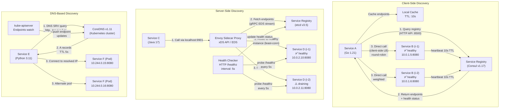
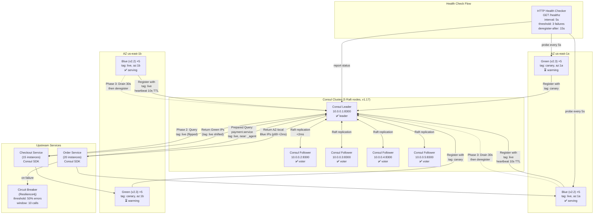
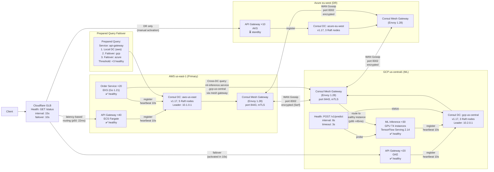
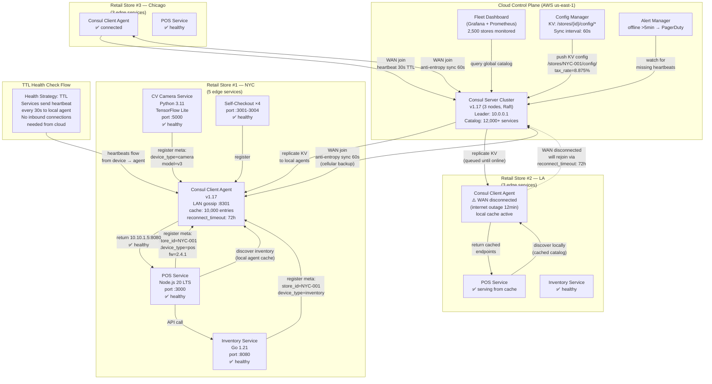

# Service Discovery

Service discovery is the mechanism by which services in a distributed system locate and communicate with each other. As microservices scale from 10 to 500+ services with thousands of instances spinning up and down, hardcoded addresses become impossible. Service discovery automates the registration, health checking, and lookup of service endpoints — enabling dynamic routing, load balancing, and zero-downtime deployments.

## Intent

- Understand client-side vs server-side discovery patterns and when each is appropriate
- Compare service registry tools (Consul, Eureka, etcd) and service mesh approaches (Istio/Envoy)
- Design service discovery for complex scenarios: blue-green deployments, multi-cloud, and edge computing

## Architecture Overview

## Key Concepts

### Discovery Pattern Comparison

| Pattern          | Pros                              | Cons                                  | Latency Overhead | Example                 |
| ---------------- | --------------------------------- | ------------------------------------- | ---------------- | ----------------------- |
| Client-Side      | No extra hop, flexible LB         | Client complexity, language-specific  | 0ms (cached)     | Netflix Ribbon + Eureka |
| Server-Side (LB) | Language-agnostic, simple clients | Extra network hop, LB as SPOF         | 1-3ms            | AWS ALB + ECS           |
| DNS-Based        | Universal, no SDK needed          | TTL caching delays, no health checks  | 0ms (cached)     | Kubernetes CoreDNS      |
| Service Mesh     | Full observability, mTLS, retries | Sidecar resource overhead (~50MB RAM) | 0.5-2ms          | Istio + Envoy           |

### Health Check Strategies

| Strategy        | Detection Speed | False Positives | Resource Cost | Best For                     |
| --------------- | --------------- | --------------- | ------------- | ---------------------------- |
| TCP check       | 1-2s            | Low             | Minimal       | Basic liveness               |
| HTTP endpoint   | 2-5s            | Low             | Low           | Application health           |
| gRPC health     | 1-3s            | Low             | Low           | gRPC services                |
| Script-based    | 5-30s           | Medium          | Medium        | Complex dependency checks    |
| Gossip protocol | 3-10s           | Very Low        | Minimal       | Large clusters (1000+ nodes) |

### Registry Tool Comparison

| Tool      | Consensus        | Health Checks        | KV Store | Multi-DC        | Language |
| --------- | ---------------- | -------------------- | -------- | --------------- | -------- |
| Consul    | Raft             | TCP/HTTP/gRPC/Script | Yes      | Native          | Go       |
| Eureka    | Peer replication | Client heartbeat     | No       | Via replication | Java     |
| etcd      | Raft             | TTL leases           | Yes      | Manual          | Go       |
| ZooKeeper | ZAB              | Ephemeral nodes      | Yes      | Observer nodes  | Java     |
| CoreDNS   | N/A (stateless)  | Via endpoints API    | No       | Per-cluster     | Go       |

---

**Why this example:** Blue-green deployments stress service discovery harder than any other deployment strategy because two complete sets of instances coexist simultaneously, and the routing switch must be atomic across hundreds of callers. This scenario exposes the exact failure mode — stale registry entries during cutover — that causes real revenue loss in payment systems, making it an ideal vehicle for illustrating tag-based discovery and graceful deregistration.

## Industry Problem 1: Microservices Platform with 500 Services — Blue-Green Deployments

**How this solves the problem:** The architecture uses Consul service tags as a virtual traffic switch — blue instances hold `tag: live` while green instances warm up under `tag: canary`. Upstream services issue prepared queries filtered by `tag: live`, so the cutover is a metadata operation (re-tagging) rather than a DNS or IP change, achieving sub-second routing shifts across all 35 calling services simultaneously. The 30-second drain period on blue instances ensures in-flight payment transactions complete before deregistration, eliminating the 150 req/sec failure window. Combined with health checks (5s interval, deregister-after 15s) and AZ-aware `near=_agent` routing, this design reduces cross-AZ latency from 4ms to 0.5ms while maintaining zero-downtime deployments.

**Problem**: A fintech platform runs 500 microservices with 4,000 total instances across 3 availability zones. The team deploys 80 times/day using blue-green deployments. During a 30-second cutover window, 0.5% of requests (150 req/sec) hit deregistered instances and fail with connection refused errors. Each failed payment request costs $12 in retry overhead and customer friction.

**Solution**: Use Consul with service tags for traffic routing. Blue instances register with `tag: live`, green with `tag: canary`. During deployment: (1) route 5% canary traffic to green via tag-based queries, (2) monitor error rates for 2 minutes, (3) atomically flip the `live` tag to green instances, (4) drain blue connections with a 30-second grace period before deregistering. Consul's HTTP health checks (every 5s, 3 failures to deregister) ensure only healthy instances receive traffic.

**Key Decisions**:

- Consul service tags for routing — no infrastructure changes needed per deployment
- 30-second connection drain on blue instances — in-flight requests complete before deregistration
- Health check interval of 5s with deregister-after 15s — balances detection speed vs false positives
- Prepared queries with `near=_agent` for AZ-aware routing — reduces cross-AZ latency from 4ms to 0.5ms
- Consul Connect (service mesh) for mTLS between services — zero-trust networking without app changes

---

**Why this example:** Multi-cloud is the ultimate test of service discovery because it forces cross-boundary resolution between entirely different networking stacks, identity systems, and latency profiles. This scenario is representative because it combines the most common real-world multi-cloud pattern — primary compute on AWS with specialized ML on GCP — and exposes the 5-minute DNS TTL failover gap that catches most teams off guard during regional outages.

## Industry Problem 2: Multi-Cloud Service Routing

**How this solves the problem:** Consul WAN federation connects three autonomous datacenters via encrypted gossip without requiring VPN or VPC peering, meaning each cloud retains independent operation. Cross-cloud service calls use explicit datacenter-qualified names (`ml-inference.service.gcp-us-central`) routed through mesh gateways with mTLS, achieving <50ms latency for AWS-to-GCP ML inference calls. The failover prepared query with a "fewer than 3 healthy instances" threshold triggers automatic cross-DC resolution, and combined with Cloudflare's 10-second health check detection, total failover time drops from the original 5 minutes to under 20 seconds. The mesh gateways handle cross-cloud mTLS negotiation at the boundary, so individual services need zero networking changes to participate in multi-cloud routing.

**Problem**: A SaaS company runs services across AWS (primary), GCP (ML workloads), and Azure (EU DR). They operate 120 services with 1,800 instances total. Service A on AWS needs to call ML inference on GCP with <50ms latency. During an AWS regional outage (4 times/year, avg 47 minutes), all traffic must failover to GCP within 60 seconds. Current DNS-based failover takes 5 minutes due to TTL caching.

**Solution**: Deploy Consul datacenters in each cloud, connected via WAN gossip federation. Services register in their local Consul DC. Cross-cloud calls use Consul's prepared queries with datacenter failover: `ml-inference.service.gcp-us-central` routes directly to GCP instances. For regional failover, Cloudflare health checks detect AWS outage in 15 seconds, and Consul's federated catalog provides GCP endpoints within 5 seconds — total failover in 20 seconds.

**Key Decisions**:

- Consul WAN federation over encrypted gossip — each DC is autonomous, no single point of failure
- Cross-DC service queries with `dc=gcp-us-central` — explicit routing for ML workloads, no guessing
- Failover prepared queries: try local DC first, fall back to remote DC if fewer than 3 healthy instances
- Consul Connect gateways at DC boundaries — route mesh traffic across clouds without VPN peering
- Health check thresholds tuned per cloud: AWS (5s interval), GCP (8s, higher baseline latency)

---

**Why this example:** Edge computing inverts the usual service discovery model — instead of a centralized cluster with reliable networking, you have thousands of tiny autonomous sites with intermittent connectivity. This scenario is uniquely challenging because service discovery must work in a partitioned state (offline stores) while still maintaining a global catalog for central fleet management, testing the limits of gossip protocols, TTL-based health checks, and anti-entropy synchronization.

## Industry Problem 3: Edge Computing with Dynamic Device Registration

**How this solves the problem:** Each store runs a local Consul client agent that maintains a cached copy of the store's service catalog, so POS-to-inventory discovery works entirely locally even during the daily 10-30 minute internet outages — Store #2 in the diagram shows this offline-capable pattern in action. The TTL-based health check strategy means edge devices push heartbeats outward to the local agent (every 30s), requiring no inbound network connections from the cloud, which is critical behind store firewalls and NAT. When connectivity resumes, the agent's anti-entropy sync (60s interval over cellular backup) reconciles the local and cloud catalogs, restoring fleet-wide visibility. The `reconnect_timeout=72h` setting ensures agents survive extended outages without being permanently evicted, while service metadata (`store_id`, `device_type`, `firmware_version`) enables fleet-wide queries like "find all stores running POS firmware < 2.4.0" from the central dashboard.

**Problem**: A retail chain operates 2,500 stores, each running 3-8 edge services (POS, inventory, camera analytics, self-checkout). That's 12,000+ service instances registering and deregistering as devices reboot, update, or fail. Store internet connections drop for 10-30 minutes daily. During offline periods, in-store services must still discover each other — POS must find the local inventory service to process sales. Central fleet visibility is needed for monitoring 2,500 stores.

**Solution**: Deploy Consul agents at each store in client mode, joined to cloud Consul servers via WAN. Local service discovery works even when the WAN link is down — the local agent caches the service catalog. Services register with the local agent, which replicates to the cloud when connectivity resumes. The cloud Consul provides a global catalog for fleet-wide dashboards and config push via KV store.

**Key Decisions**:

- Local Consul agent per store — service discovery continues during internet outages (autonomous operation)
- Gossip protocol with `reconnect_timeout=72h` — agents rejoin cloud automatically after long outages
- Consul KV store for config push — store-specific configs at `/stores/{store-id}/config/*`
- Service registration with meta: `store_id`, `device_type`, `firmware_version` for fleet-wide querying
- Health checks with TTL strategy (device heartbeats every 30s) — no inbound connections needed from cloud to edge
- Anti-entropy sync interval of 60s — balances bandwidth (cellular backup) with catalog freshness

---

## Anti-Patterns

| Anti-Pattern                        | Problem                                             | Better Approach                                          |
| ----------------------------------- | --------------------------------------------------- | -------------------------------------------------------- |
| Hardcoded service URLs              | Any IP change requires redeployment                 | Use service discovery with DNS or registry               |
| No health checks                    | Traffic routed to dead instances                    | HTTP/gRPC health checks with deregister-after            |
| Ignoring DNS TTL                    | Stale DNS cache routes to old instances             | Short TTLs (5-10s) or use registry-based discovery       |
| Registry as single point of failure | Registry outage = total service outage              | Cache last-known endpoints; use client-side caching      |
| Over-relying on service mesh        | Sidecar per pod = 50MB × 4000 instances = 200GB RAM | Use service mesh only where mTLS/observability is needed |
| No graceful shutdown                | In-flight requests fail during deregistration       | Deregister → drain (30s) → shutdown                      |

---

> **Key Takeaway**: Service discovery is the nervous system of a microservices architecture. Start with DNS-based discovery for simplicity, graduate to a registry (Consul/Eureka) when you need health checks and dynamic routing, and adopt a service mesh when you need mTLS, traffic shaping, and deep observability. Always design for the offline case — cache endpoints locally, implement graceful degradation, and never let the discovery layer become a single point of failure.
