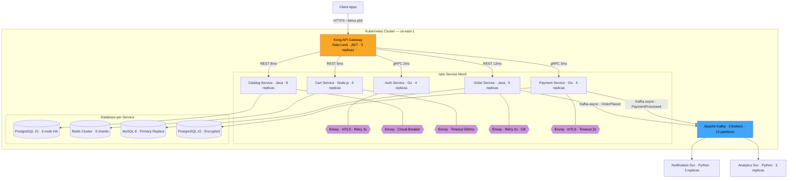
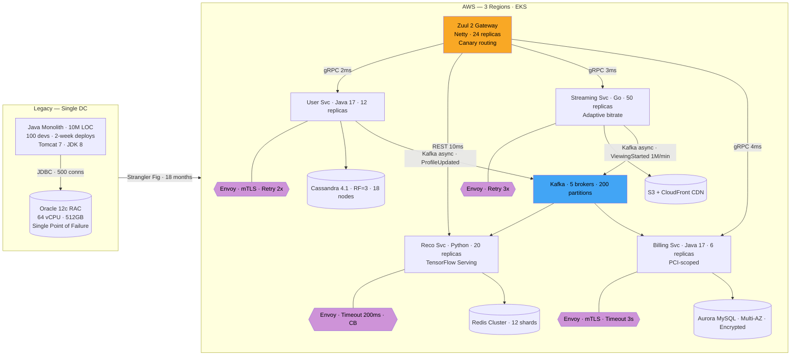
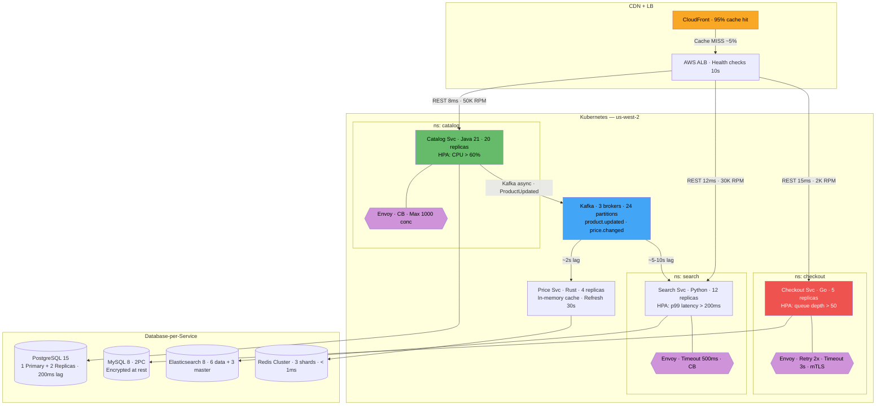
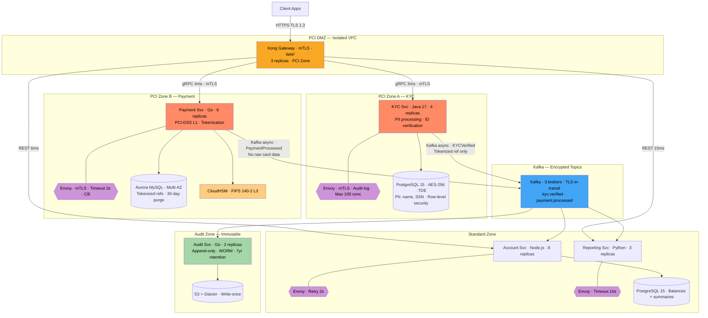

# Microservices Architecture

Microservices decompose a system into small, independently deployable services aligned with business domains. Each service owns its data, communicates over well-defined APIs, and can be developed, scaled, and released by autonomous teams. The approach trades operational simplicity for organizational scalability—enabling hundreds of teams to ship in parallel without stepping on each other.

## Intent

- **Domain isolation**: Align service boundaries with bounded contexts so each team owns a clear slice of business logic and data, reducing cross-team coordination overhead.
- **Independent deployment**: Ship any service without redeploying the entire system—enabling 100+ deploys/day at organizations like Netflix and Amazon.
- **Selective scaling**: Scale hot services (checkout, search) independently of cold ones (admin, reporting), optimizing infrastructure cost by 30-60%.

## Architecture Overview

## Key Concepts

### Communication Patterns

| Pattern                 | Latency   | Coupling              | Use Case                                 |
| ----------------------- | --------- | --------------------- | ---------------------------------------- |
| REST/HTTP               | ~5-50ms   | Higher (sync)         | CRUD operations, simple queries          |
| gRPC                    | ~1-10ms   | Medium (sync, schema) | Internal service-to-service, low latency |
| Async Messaging         | ~50-500ms | Lower (decoupled)     | Events, notifications, workflows         |
| Event Streaming (Kafka) | ~10-100ms | Lowest                | Real-time pipelines, audit logs          |

### Data Ownership Principles

Each service owns its database exclusively. No service reads another service's tables directly. Data is shared through APIs or events. This means accepting **eventual consistency** across service boundaries—a trade-off that enables independent deployability.

### Bounded Context Mapping

| DDD Concept           | Microservice Equivalent         |
| --------------------- | ------------------------------- |
| Bounded Context       | Service boundary                |
| Aggregate Root        | Primary entity within a service |
| Domain Event          | Async message between services  |
| Anti-Corruption Layer | API adapter / translator        |

---

## Industry Problem 1: Monolith Decomposition at Netflix Scale

**Why this example:** Netflix is the canonical monolith-to-microservices migration because the scale (200M+ subscribers, thousands of device types) makes monolithic coupling impossible to ignore. This scenario uniquely illustrates the Strangler Fig pattern—incrementally extracting services from a running system—and demonstrates how to sequence decomposition when modules have different risk profiles, change velocities, and compliance constraints.

**How this solves the problem:** The Strangler Fig approach migrates one bounded context at a time while the monolith continues serving production traffic—no big-bang cutover. Zuul gradually shifts traffic based on canary metrics. Each service selects a purpose-fit database (Cassandra for high write-throughput profiles, Redis for sub-millisecond recommendation lookups, Aurora MySQL for ACID billing), eliminating the single Oracle bottleneck. Envoy sidecars enforce circuit breakers so a failing recommendation service cannot cascade into billing outages. Kafka decouples high-volume streaming events (1M+/min) from downstream consumers, allowing retraining and reconciliation at their own pace.

**Problem**: Netflix's monolithic Java application served 200M+ subscribers. A single deployment took 2 weeks of integration testing. A bug in the recommendation engine brought down billing. The Oracle database hit 80% CPU during peak, throttling all features equally.

**Solution**: Decompose along domain boundaries using the Strangler Fig pattern. Extract high-value, high-change services first (streaming, recommendations). Each service gets polyglot persistence—Cassandra for user profiles (high write throughput), Redis for recommendations (low-latency reads), S3+CDN for content delivery. Deploy services independently via Spinnaker with canary releases (5% → 25% → 100%).

**Key decisions**:

- Started with the **highest-churn** module (recommendations—50 deploys/month vs 2 for billing)
- Used **client libraries** (Hystrix, Ribbon) instead of a service mesh initially—later migrated
- Accepted **eventual consistency** between user profile and recommendation updates (2-5s lag acceptable)
- Kept billing as the **last service extracted** due to compliance requirements

---

## Industry Problem 2: E-Commerce Independent Scaling

**Why this example:** E-commerce exhibits extreme traffic asymmetry—catalog browsing outnumbers checkout by 25:1, and Black Friday creates sudden spikes that differ per service. This makes it the ideal scenario to illustrate per-service auto-scaling with different HPA metrics, the cost savings of decoupling read-heavy from write-heavy paths, and async propagation between search indexes and source-of-truth databases.

**How this solves the problem:** Each service scales on the metric that reflects its actual load—CPU for stateless catalog reads, queue depth for bursty checkout writes, p99 latency for search quality. The CDN absorbs 95% of catalog traffic so only cache misses hit pods. Kafka decouples catalog writes from the search index; a 5-10s lag is invisible to users but eliminates synchronous coupling. Checkout uses 2PC with MySQL for atomic payment + inventory deduction, while catalog uses eventually-consistent read replicas—each service picks the right consistency trade-off.

**Problem**: An e-commerce platform handles 50K RPM to catalog (browsing) but only 2K RPM to checkout (purchasing). During Black Friday, catalog traffic spikes 10x while checkout spikes 3x. Running everything in a monolith means provisioning for the sum of all peaks—wasting 60% of infrastructure budget during normal hours.

**Solution**: Split catalog (read-heavy, cacheable) from checkout (write-heavy, transactional). Catalog runs 20 stateless replicas behind a CDN with 95% cache hit rate. Checkout runs 5 replicas with sticky sessions and strong consistency. Search is powered by Elasticsearch, fed asynchronously from catalog changes via Kafka. Each service auto-scales on different metrics: catalog on CPU, checkout on request queue depth, search on query latency p99.

**Key decisions**:

- **Catalog** uses PostgreSQL read replicas with a 200ms replication lag—acceptable for product browsing
- **Checkout** uses synchronous writes with 2PC for payment + inventory deduction
- Kafka decouples catalog writes from search index updates—search can lag 5-10s without user impact
- Infrastructure cost dropped **45%** by right-sizing each service independently

---

## Industry Problem 3: Fintech Regulatory Isolation

**Why this example:** Financial services face a unique microservices challenge: regulatory blast radius. In a monolith, if any component touches card data, the entire codebase falls under PCI-DSS audit scope. This demonstrates how service boundaries drawn to minimize compliance surface area—a non-functional decomposition driver most tutorials ignore—can cut audit costs by 70% while enabling independent regulatory update cycles.

**How this solves the problem:** Network segmentation via isolated VPCs and Kubernetes namespaces creates hard boundaries between PCI-scoped and standard services, reducing audit surface to just KYC and Payment. The Payment service tokenizes via CloudHSM and stores only opaque references with 30-day auto-purge, satisfying PCI-DSS retention rules. Kafka topics carry only tokenized references—messages reaching the Standard Zone never contain PII or card data, keeping downstream services out of scope. The immutable Audit Service writes to WORM storage with 7-year retention, satisfying regulatory trail requirements without coupling audit concerns into business services.

**Problem**: A fintech startup processes 500K daily transactions and must comply with PCI-DSS, GDPR, and local banking regulations. Mixing payment card data with general user data in a monolith means the **entire system** falls under PCI audit scope (typical audit: $200K+ annually). KYC regulations change quarterly per jurisdiction, requiring frequent updates that risk destabilizing payment flows.

**Solution**: Isolate payment and KYC into dedicated services running in hardened PCI-compliant zones with encrypted-at-rest databases, network segmentation, and separate CI/CD pipelines with additional security scanning. General services (accounts, reporting) run in standard zones with relaxed controls. Communication between zones is async via Kafka with encrypted topics—payment events carry tokenized references, never raw card data.

**Key decisions**:

- PCI audit scope reduced from **entire platform** to 2 services—cutting compliance cost by 70%
- KYC service deploys independently—quarterly regulatory updates ship in 2 days, not 2 weeks
- Payment service uses **synchronous gRPC** to the payment gateway (latency-critical) but **async events** for downstream consumers
- All inter-service calls carry correlation IDs for end-to-end audit trails (regulatory requirement)

---

## Anti-Patterns

| Anti-Pattern               | Description                                               | Consequence                                                    |
| -------------------------- | --------------------------------------------------------- | -------------------------------------------------------------- |
| **Distributed Monolith**   | Services share a database or require lockstep deployments | All the complexity of microservices with none of the benefits  |
| **Nano-services**          | Decomposing too finely (1 service per CRUD entity)        | Network overhead dominates; 100+ services for a 10-person team |
| **Shared Libraries Creep** | Common libraries grow to contain business logic           | Coupling returns through the back door; version hell           |
| **Sync Chain**             | Service A → B → C → D synchronously                       | Latency compounds; availability = 0.99^4 = 0.96                |
| **No API Versioning**      | Breaking changes without versioning                       | Cascading failures across consumers                            |

---

> **Key Takeaway**: Microservices are an organizational scaling strategy, not a technical one. If you don't have independent teams that need to ship independently, you're buying distributed systems complexity for no payoff. Start with a well-structured monolith, extract services at the seams where **deployment independence** or **scaling isolation** delivers measurable value—not because the architecture diagram looks impressive.
