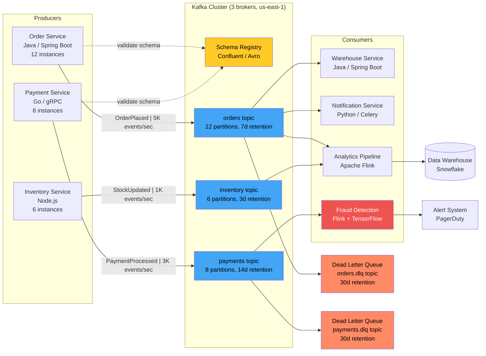
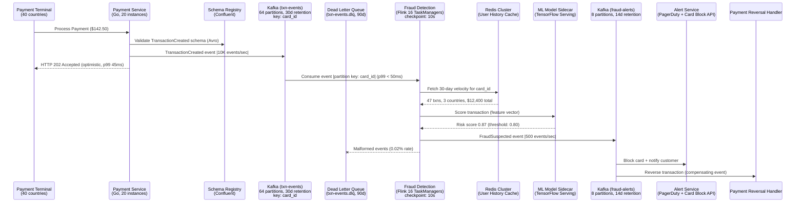
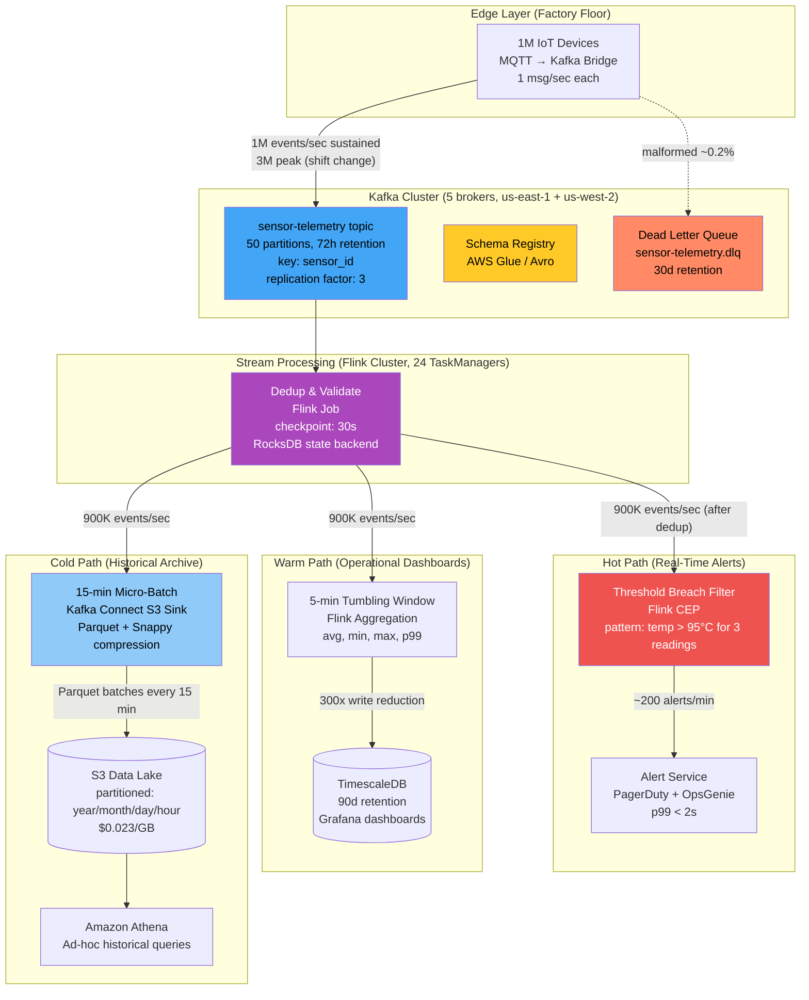
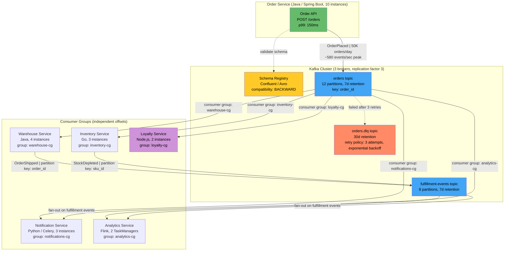

# Event-Driven Architecture

Event-Driven Architecture (EDA) structures systems around the production, detection, and reaction to events—immutable facts about something that happened. Instead of services calling each other directly, producers emit events and consumers react asynchronously. This inverts coupling: producers don't know who consumes their events, enabling systems that scale horizontally, degrade gracefully, and evolve without coordinated deployments.

## Intent

- **Temporal decoupling**: Producers and consumers don't need to be available simultaneously—events are buffered in brokers, enabling resilience to downstream failures and traffic spikes.
- **Fan-out without coordination**: A single event (e.g., "OrderPlaced") can trigger warehouse fulfillment, email notification, analytics, and fraud checks—all without the order service knowing about any of them.
- **Audit and replay**: An immutable event log serves as a system-of-record, enabling replay for debugging, rebuilding read models, or migrating to new consumers.

## Architecture Overview

**How this solves the problem:** The architecture overview shows a canonical three-layer EDA: typed producers, a partitioned Kafka broker cluster with schema governance, and independently deployable consumers. The schema registry enforces Avro contracts at the producer boundary, preventing malformed events from ever entering the system. Each topic's partition count and retention are tuned to its throughput and replay requirements—orders retain 7 days for consumer catch-up, while inventory keeps only 3 days since stock snapshots are disposable. Dead letter queues on critical topics ensure poison-pill messages are isolated without blocking healthy event flow.

## Key Concepts

### Messaging Patterns

| Pattern               | Delivery                    | Use Case                     | Example Broker                |
| --------------------- | --------------------------- | ---------------------------- | ----------------------------- |
| Pub/Sub               | Fan-out to all subscribers  | Notifications, analytics     | Kafka topics, SNS             |
| Point-to-Point        | Single consumer per message | Task processing, commands    | SQS, RabbitMQ queues          |
| Event Streaming       | Ordered, replayable log     | Audit trails, event sourcing | Kafka, Kinesis, Pulsar        |
| Request-Reply (async) | Correlated response         | Saga orchestration           | RabbitMQ with correlation IDs |

### Broker Comparison

| Feature    | Kafka                     | RabbitMQ         | SQS                           |
| ---------- | ------------------------- | ---------------- | ----------------------------- |
| Throughput | 1M+ msgs/sec              | 50K msgs/sec     | 3K msgs/sec (standard)        |
| Ordering   | Per-partition             | Per-queue        | Best-effort (FIFO: per-group) |
| Retention  | Days/weeks (configurable) | Until consumed   | 14 days max                   |
| Replay     | Yes (offset-based)        | No               | No                            |
| Ideal for  | Streaming, event sourcing | Task queues, RPC | Serverless, simple decoupling |

### Event Schema Evolution

Events are contracts. Use a schema registry (Confluent, AWS Glue) with **backward-compatible** evolution: add optional fields, never remove or rename required fields. Version events explicitly (`OrderPlacedV2`) when breaking changes are unavoidable.

---

**Why this example:** Real-time fraud detection is the quintessential "event-driven or nothing" problem—synchronous inline checks penalize every transaction with latency, but fraud windows close in milliseconds. This scenario uniquely illustrates the **optimistic acceptance** pattern, where the system returns success before validation completes, and the tension between latency SLAs and accuracy that only async event processing can resolve.

## Industry Problem 1: Real-Time Fraud Detection at 10K TPS

**How this solves the problem:** The architecture separates the latency-critical payment acceptance path from the compute-heavy fraud analysis. By emitting `TransactionCreated` events to a 64-partition Kafka topic keyed on `card_id`, the system guarantees in-order processing per card while distributing load across 16 Flink TaskManagers. The Redis sidecar lookup and ML inference happen entirely within the streaming pipeline—no synchronous network hops back to the payment service. Suspected fraud produces a downstream event that triggers card blocking and transaction reversal independently, keeping the reversal rate at 0.3% while maintaining sub-50ms consumer latency.

**Problem**: A payment processor handles 10,000 transactions/second across 40 countries. Fraud must be detected within 500ms to block the transaction before settlement. A synchronous fraud check in the payment path adds 200ms latency to every transaction—including the 99.7% that are legitimate. False positive rate must stay below 0.1% to avoid blocking valid customers.

**Solution**: Payment service emits `TransactionCreated` events to Kafka and returns an optimistic acceptance. A Flink streaming job consumes events with p99 latency under 50ms, enriches them with user history from a Redis cache, and scores via an ML model. High-risk transactions (score > 0.8) produce `FraudSuspected` events consumed by the alert service and payment reversal handler. Legitimate transactions flow through untouched—zero added latency for good payments.

**Key decisions**:

- **Optimistic acceptance** trades a small reversal rate (0.3%) for eliminating latency from the happy path
- Kafka partitioned by `card_id` ensures all events for a card arrive in order—critical for velocity checks
- ML model runs in a **sidecar** co-located with Flink workers—network hop eliminated, inference at 2ms p99
- 30-day event retention enables fraud analysts to replay and backtest new detection rules

---

**Why this example:** IoT telemetry is the highest-throughput event-driven workload most engineers will encounter, with sustained millions of events per second from unreliable producers on constrained networks. This scenario illustrates the **Lambda architecture split** (hot/warm/cold paths), where a single event stream must serve consumers with latency requirements spanning three orders of magnitude—from 2-second alerts to month-old batch analytics—while keeping storage costs sustainable.

## Industry Problem 2: IoT Sensor Data Pipeline from 1M Devices

**How this solves the problem:** The three-path architecture lets a single Kafka topic serve consumers with radically different latency and cost profiles. After deduplication removes sensor retries (~10% of traffic), Flink CEP on the hot path matches complex patterns (e.g., three consecutive overheating readings) and fires alerts within 2 seconds. The warm path's 5-minute tumbling windows reduce write volume 300x before hitting TimescaleDB, making dashboards affordable at scale. The cold path uses Kafka Connect's S3 sink with Parquet compression, storing raw telemetry at $0.023/GB—three orders of magnitude cheaper than database writes. The dead letter queue isolates the 0.2% of malformed events, preventing a single broken sensor from poisoning the entire pipeline.

**Problem**: An industrial IoT platform ingests telemetry from 1 million sensors at 1 message/second each—1M events/sec sustained, spiking to 3M during shift changes. Data must serve three consumers with different latency requirements: real-time alerts (< 2s), operational dashboards (5-min granularity), and historical analytics (batch). Storing raw events naively would cost $50K/month in database writes alone.

**Solution**: Kafka ingestion layer with 50 partitions handles 1M msgs/sec at 60% capacity (headroom for spikes). A Flink streaming job deduplicates (sensor retries), validates schemas, and routes events to three paths: (1) Hot path filters threshold breaches and emits alerts within 2s. (2) Warm path aggregates 5-minute windows to TimescaleDB for dashboards—reducing write volume 300x. (3) Cold path batches to S3 in Parquet format every 15 minutes for pennies/GB storage. Malformed events route to a dead letter queue for debugging.

**Key decisions**:

- **Lambda architecture** (hot + cold) chosen over pure streaming because historical queries need cost-efficient batch storage
- Kafka retention set to 72 hours—enough to replay and rebuild any downstream consumer without permanent storage cost
- Sensor ID as partition key ensures ordering per device; 50 partitions balance parallelism vs. overhead
- Dead letter queue captures ~0.2% of events—schema validation prevents poison pills from crashing pipelines

---

**Why this example:** Order fulfillment is the classic fan-out problem where a single business event must trigger N independent downstream reactions. This scenario was chosen because it clearly demonstrates the coupling inversion that defines EDA—going from a fragile 2.5-second synchronous chain where any service failure blocks orders, to a topology where the order service has zero knowledge of its consumers and new services attach without any producer changes.

## Industry Problem 3: Order Fulfillment Fan-Out

**How this solves the problem:** Each downstream service operates in its own Kafka consumer group, meaning every service independently tracks its offset and processes every `OrderPlaced` event at its own pace. When the loyalty service goes down, it simply stops committing offsets—Kafka retains events for 7 days, and the service replays missed events on recovery with no data loss. The order API's only responsibility is a database write and a Kafka produce, keeping latency at 150ms instead of the original 2.5 seconds. Secondary fan-out on the `fulfillment-events` topic lets `OrderShipped` and `StockDepleted` events trigger notifications and analytics updates without any coupling back to the warehouse or inventory services. The dead letter queue with exponential backoff retry (3 attempts) prevents transient failures from losing events while isolating persistent failures for manual inspection.

**Problem**: An e-commerce platform processes 50K orders/day. When an order is placed, 5 downstream systems must react: warehouse (pick/pack), notifications (confirmation email), analytics (revenue), inventory (stock deduction), and loyalty (points). In the original synchronous design, the order API calls all 5 services sequentially—API latency climbed to 2.5s, and if the loyalty service went down, orders failed entirely.

**Solution**: The order service publishes a single `OrderPlaced` event to Kafka. Each downstream service consumes independently with its own consumer group—adding a new consumer (e.g., loyalty) requires zero changes to the order service. Each consumer manages its own offset, retry logic, and failure handling. The warehouse service emits `OrderShipped` events, which trigger another fan-out to notifications and analytics. Total coupling: the order service knows about exactly zero downstream consumers.

**Key decisions**:

- **Consumer groups** ensure each service processes every event exactly once (at-least-once with idempotency)
- Order API latency dropped from 2.5s to 150ms—just a DB write and Kafka produce
- Loyalty service outage no longer affects order placement—it catches up when restored (Kafka retention: 7 days)
- Schema registry enforces `OrderPlaced` contract—producers can't break consumers by changing field types
- Added a **compensating event** pattern: `OrderCancelled` triggers reverse operations in all consumers

---

## Anti-Patterns

| Anti-Pattern                  | Description                                                                              | Consequence                                                     |
| ----------------------------- | ---------------------------------------------------------------------------------------- | --------------------------------------------------------------- |
| **Event Soup**                | Hundreds of fine-grained events with no clear domain meaning                             | Impossible to reason about system behavior; debugging nightmare |
| **Event as Command**          | Using events to tell services what to do ("SendEmail") vs. what happened ("OrderPlaced") | Tight coupling disguised as async; defeats the purpose of EDA   |
| **No Schema Governance**      | Events evolve without registry or versioning                                             | Consumer breakage on every producer deploy                      |
| **Missing Dead Letter Queue** | No handling for poison-pill messages                                                     | One bad event blocks an entire partition/queue permanently      |
| **Ignoring Ordering**         | Assuming events arrive in order across partitions                                        | Race conditions: "OrderShipped" processed before "OrderPlaced"  |

---

> **Key Takeaway**: Event-driven architecture shines when you need to decouple producers from an evolving set of consumers, or when you need to absorb traffic spikes without back-pressure on the source. The key cost is **eventual consistency**—if your business domain can't tolerate even seconds of stale data between services, synchronous calls may be simpler and more correct. Choose events for fan-out and resilience, not because async sounds modern.
