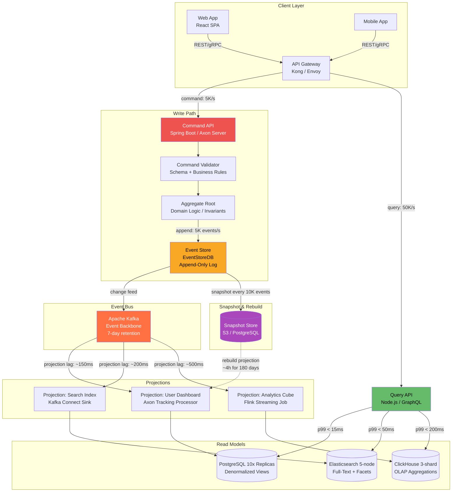
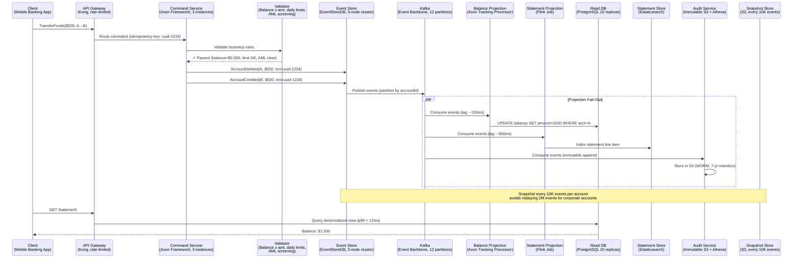
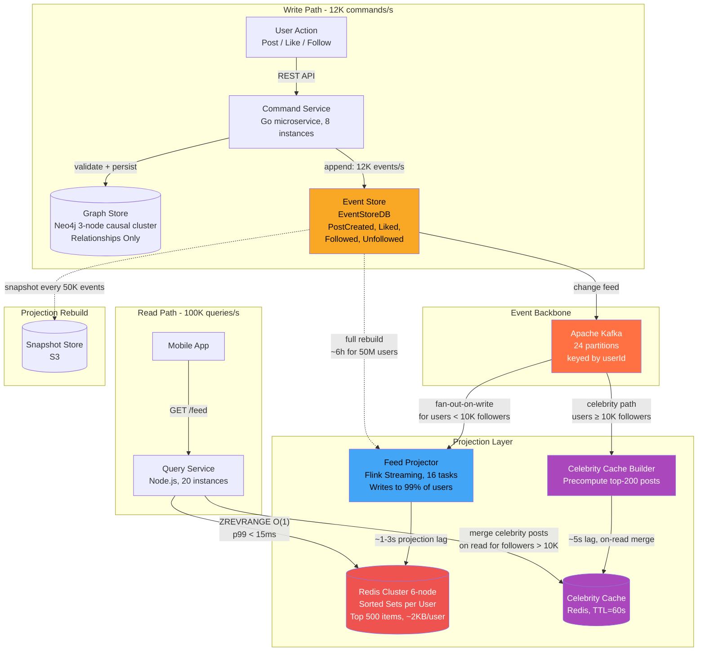
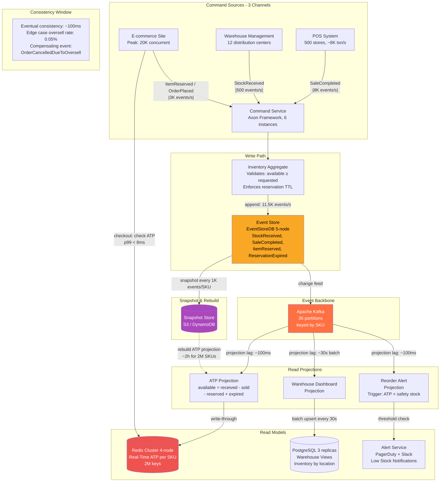

# CQRS — Command Query Responsibility Segregation

CQRS separates the write model (commands that change state) from the read model (queries that return data). Instead of a single data model serving both reads and writes, you maintain specialized models optimized for each purpose. Combined with event sourcing, CQRS enables complete audit trails, temporal queries, and independently scalable read/write paths—at the cost of increased complexity and eventual consistency.

## Intent

- **Optimize reads and writes independently**: Write models enforce invariants and business rules; read models are denormalized projections optimized for specific query patterns—no more N+1 queries or compromise schemas.
- **Scale asymmetrically**: Most systems are read-heavy (90:10 or 99:1 read/write ratio). CQRS lets you scale 20 read replicas without touching the write path.
- **Enable event sourcing**: Store every state change as an immutable event. Rebuild any read model by replaying the event log—full audit trail and time-travel debugging for free.

## Architecture Overview

**How this architecture works:**

The API gateway routes commands and queries to entirely separate services—commands hit Axon Server for validation and event persistence at 5K/s, while queries hit a GraphQL layer backed by three purpose-built read stores. Kafka acts as the event backbone, feeding projections that each run at different lag tolerances: dashboards at 150ms, search at 200ms, and analytics at 500ms. The snapshot store enables full projection rebuilds from the event store in ~4 hours, meaning any read model can be torn down and reconstructed without data loss. This separation means the write path can be optimized for consistency and durability while the read path scales horizontally to handle 10x the traffic. Each read model uses a different storage technology—PostgreSQL for relational queries, Elasticsearch for full-text search, ClickHouse for OLAP aggregations—chosen to match its specific access pattern rather than forcing a single compromise schema.

## Key Concepts

### Command vs. Query Model

| Aspect     | Command (Write) Side                | Query (Read) Side                          |
| ---------- | ----------------------------------- | ------------------------------------------ |
| Model      | Normalized, enforces invariants     | Denormalized, optimized for queries        |
| Storage    | Event store or relational DB        | Materialized views, caches, search indices |
| Scaling    | Fewer instances, strong consistency | Many replicas, eventual consistency        |
| Validation | Business rules, domain logic        | None—reads pre-computed data               |
| Latency    | Higher (validation + persist)       | Lower (direct lookups)                     |

### Event Sourcing + CQRS

| Concept        | Description                                                                   |
| -------------- | ----------------------------------------------------------------------------- |
| Event Store    | Append-only log of domain events (e.g., `AccountCredited`, `ItemAddedToCart`) |
| Projection     | Process that reads events and builds a read-optimized view                    |
| Snapshot       | Periodic checkpoint to avoid replaying millions of events on startup          |
| Projection Lag | Time between event written and read model updated (typically 50-500ms)        |

### When to Use CQRS

Use CQRS when read and write models diverge significantly, read/write ratios are highly asymmetric, or you need full audit trails. **Don't use it** for simple CRUD apps where a single model works fine—CQRS adds operational overhead (projections, eventual consistency, two data stores).

---

## Industry Problem 1: Banking with Full Audit Trail

**Why this example:** Banking imposes the strictest audit requirements found in any domain—regulators demand point-in-time reconstruction of financial state, making "update in place" fundamentally insufficient. This scenario illustrates CQRS at its most justified: immutable event sourcing is not optional but legally mandated, the read/write asymmetry is extreme (50:1), and the cost of getting consistency wrong is measured in regulatory fines and lost deposits.

**How this solves the problem:** Commands flow through a dedicated validation pipeline (AML screening, balance checks, daily limits) before appending immutable events to EventStoreDB—no row is ever updated or deleted, giving regulators a complete, tamper-proof history. The balance projection consumes events via Kafka and maintains denormalized views in PostgreSQL read replicas, achieving 12ms p99 reads at 50:1 read/write ratio. Auditors can reconstruct any account's state at any point in time by replaying the event stream up to that timestamp, eliminating the need to mine backup tapes. Snapshots every 10K events per account bound replay cost for high-volume corporate accounts to under 2 seconds.

**Problem**: A digital bank processes 2M transactions/day and must maintain a complete, immutable audit trail for regulatory compliance (SOX, PSD2). The traditional approach—updating account balances in-place—loses history. Auditors need to answer: "What was account A's balance at 3:47 PM on March 5th?" With mutable state, this requires log mining across backup tapes. Additionally, the read pattern (balance checks, statement generation) outnumbers writes 50:1.

**Solution**: Every financial operation is a command that produces immutable events (`AccountDebited`, `AccountCredited`) stored in an append-only event store (EventStoreDB). Current balances are projections—materialized views rebuilt by replaying events. Auditors query the event store directly for point-in-time state. Read-side projections run in PostgreSQL with denormalized account summaries, scaled to 10 read replicas for the 50:1 read ratio.

**Key decisions**:

- Event store is the **source of truth**; read DB can be rebuilt from scratch in ~4 hours by replaying 180 days of events
- **Snapshots** every 10,000 events per account—avoids replaying 2M events for a high-volume corporate account
- Projection lag is 200ms p99—acceptable for balance checks (regulatory allows T+1 for settlement)
- Commands are **idempotent** using client-generated IDs—retry-safe without double-crediting

---

## Industry Problem 2: Social Media Feed Generation

**Why this example:** Social media feeds expose the fan-out scaling dilemma that CQRS was practically designed to solve—a single write (one post) must propagate to millions of read-side views. This scenario is uniquely challenging because the read/write asymmetry is the most extreme in any domain (a celebrity's post triggers millions of feed updates), and the latency budget is brutally tight (sub-200ms). It forces the system to make a genuine architectural tradeoff between fan-out-on-write and fan-out-on-read that no single-model approach can serve.

**How this solves the problem:** The write path captures user actions as events while the feed projector asynchronously fans out each post to followers' precomputed feeds in Redis sorted sets—turning a read-time join across 500+ accounts into a single O(1) `ZREVRANGE` call with 15ms p99 latency. The celebrity carve-out prevents a single post from triggering millions of Redis writes; instead, celebrity content is cached separately and merged at read time for their followers. This two-tier projection strategy keeps 99% of feed writes bounded while honoring the sub-200ms latency budget even at 100K concurrent requests. Full projection rebuilds from the event store take ~6 hours but are scoped per partition, so individual projections can be rebuilt without affecting others.

**Problem**: A social platform with 50M users generates personalized feeds. Each feed aggregates posts from followed accounts, ranked by relevance. A naive approach—query all followed accounts' posts at read time—requires joining across 500+ accounts per user with ranking. At 100K concurrent feed requests, this query fan-out saturates the database at p99 > 3s latency. Users expect feeds to load in under 200ms.

**Solution**: CQRS with fan-out-on-write. The write side stores relationships in Neo4j (graph queries for "who follows whom") and emits events (`PostCreated`, `UserFollowed`). A feed projector consumes events and precomputes each user's feed into Redis sorted sets (score = relevance). Read path is a single Redis `ZREVRANGE`—O(1) per user, p99 under 15ms. Celebrity accounts (1M+ followers) use a hybrid: fan-out-on-read with cached results to avoid writing to 1M feeds.

**Key decisions**:

- **Fan-out-on-write** for users with < 10K followers (99% of users); fan-out-on-read for celebrities
- Redis sorted sets hold top 500 feed items per user—bounded memory at ~2KB/user = 100GB for 50M users
- Feed staleness is 1-3 seconds—acceptable for social media (not financial data)
- Graph store handles write-side relationship queries; **never** queried on the read path

---

## Industry Problem 3: Inventory Management with Real-Time Availability

**Why this example:** Inventory is the canonical "multiple writers, one truth" problem—POS terminals, warehouses, and e-commerce checkouts all compete to mutate the same quantity field, producing deadlocks and oversells in traditional architectures. This scenario uniquely demonstrates how event sourcing eliminates write contention entirely (append-only, no row locks) while projections serve radically different read shapes (real-time ATP for checkout, batch dashboards for warehouse ops, threshold-triggered alerts) from the same event stream.

**How this solves the problem:** All inventory mutations—POS sales, warehouse receipts, online reservations—are captured as immutable events appended to EventStoreDB, eliminating row-level contention and deadlocks entirely. The ATP projection maintains a real-time inventory count in Redis (`available = received - sold - reserved + expired`) with only 100ms lag, letting the e-commerce checkout verify stock in 8ms p99 instead of locking a shared quantity row. The reservation pattern with 15-minute TTLs prevents cart-hoarding; expired reservations emit `ReservationExpired` events that automatically restore available stock.
Separate projections serve warehouse dashboards (PostgreSQL, batch-updated every 30s) and reorder alerts (PagerDuty triggers when ATP drops below safety stock)—three radically different read shapes from one event stream, each optimized for its consumer.

**Problem**: A retailer with 500 stores and an e-commerce site manages 2M SKUs. Inventory is modified by POS sales, warehouse receiving, online orders, and reservation expirations. A single "quantity" column updated by all sources produces constant deadlocks and stale reads. The e-commerce site shows "In Stock" but by the time checkout completes, the last unit was sold in-store. Overselling costs $2M/year in cancellations and customer dissatisfaction.

**Solution**: Event-source all inventory changes: `StockReceived`, `SaleCompleted`, `ItemReserved`, `ReservationExpired`. The write side validates commands against the current aggregate state (e.g., can't sell more than available). The Available-to-Promise (ATP) projection maintains a real-time count in Redis: `available = received - sold - reserved + expired`. E-commerce checks ATP before allowing checkout. Separate projections power warehouse dashboards (PostgreSQL, updated every 30s) and reorder alerts (trigger when ATP drops below safety stock).

**Key decisions**:

- **Reservation pattern** with TTL: online carts reserve inventory for 15 minutes; `ReservationExpired` events auto-release
- ATP projection lag is 100ms—short enough to prevent most overselling; remaining edge cases handled by compensating events (`OrderCancelledDueToOversell`)
- Overselling dropped from $2M/year to $50K/year (97.5% reduction)
- Snapshots every 1,000 events per SKU—top-selling SKUs accumulate 10K+ events/day

---

## Anti-Patterns

| Anti-Pattern            | Description                                           | Consequence                                                   |
| ----------------------- | ----------------------------------------------------- | ------------------------------------------------------------- |
| **CQRS Everywhere**     | Applying CQRS to every service, including simple CRUD | 3x development cost for zero benefit on simple domains        |
| **Stale Read Denial**   | Pretending eventual consistency doesn't exist         | Users see inconsistent data with no explanation; trust erodes |
| **Projection Monolith** | Single projection service handles all read models     | One slow projection blocks all others; scaling bottleneck     |
| **Missing Snapshots**   | Replaying full event history on every aggregate load  | Startup takes minutes for high-volume aggregates              |
| **Bidirectional Sync**  | Read model writes back to event store                 | Infinite loops, data corruption, architectural chaos          |

---

> **Key Takeaway**: CQRS earns its complexity when reads and writes have fundamentally different shapes, scales, or consistency requirements. The sweet spot is domains with high read/write asymmetry (50:1+), audit requirements, or multiple read representations of the same data. If your read and write models look the same, a single model with read replicas is simpler and sufficient—don't reach for CQRS out of architectural ambition.
