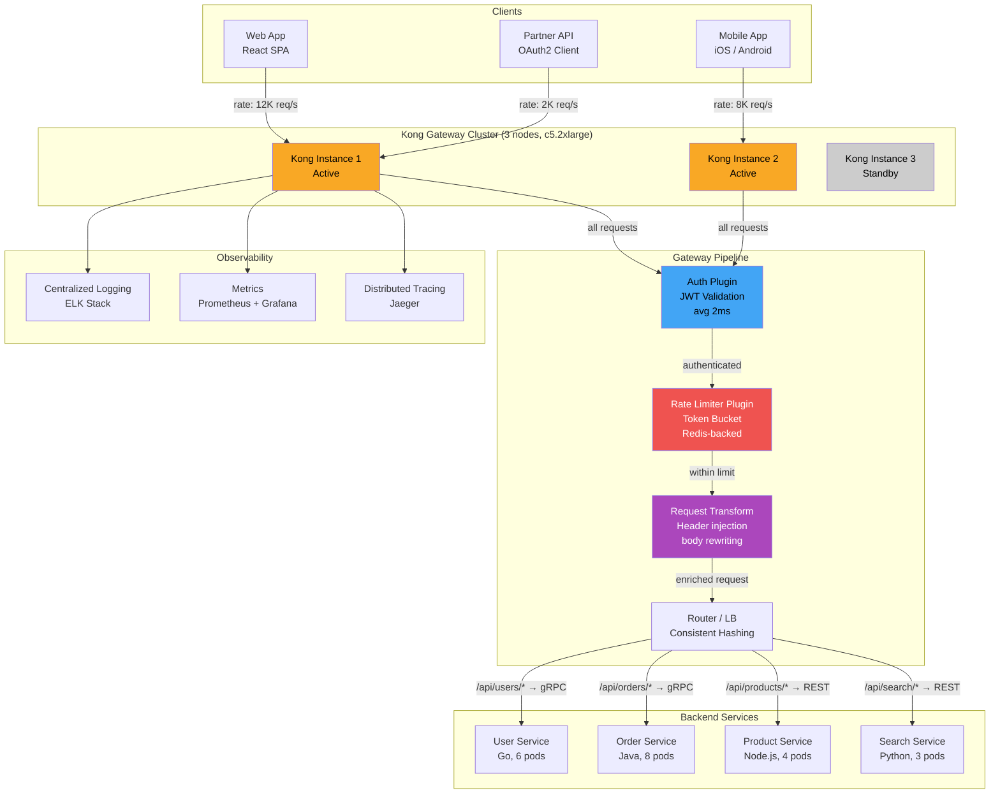
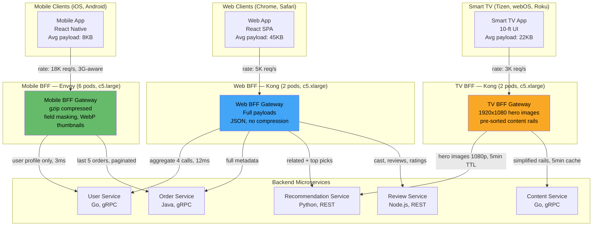
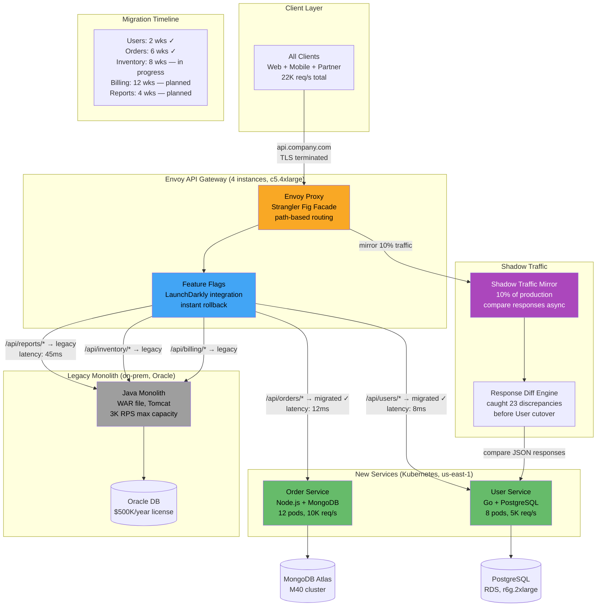

# API Gateway

An API Gateway is a single entry point for all client requests to a backend system. It handles cross-cutting concerns—routing, authentication, rate limiting, request aggregation, protocol translation, and observability—so individual services don't have to. In microservices architectures, the gateway decouples clients from the topology of backend services, enabling independent evolution of both sides.

## Intent

- **Unified entry point**: Clients call one domain (`api.company.com`) instead of discovering and managing connections to dozens of backend services—simplifying client logic and enabling centralized TLS termination.
- **Cross-cutting concerns**: Authentication, rate limiting, logging, and CORS are implemented once in the gateway instead of duplicated across every service.
- **Client-specific APIs (BFF)**: Different gateways or gateway routes serve different clients (web, mobile, TV) with tailored payloads—mobile gets compressed, minimal responses while web gets rich, nested data.

## Architecture Overview



## Key Concepts

### Gateway Responsibilities

| Capability           | Description                                      | Implementation Example                  |
| -------------------- | ------------------------------------------------ | --------------------------------------- |
| Routing              | Map URL paths to backend services                | `/api/users/*` → User Service           |
| Authentication       | Validate tokens, API keys                        | JWT verification, OAuth2 introspection  |
| Rate Limiting        | Throttle requests per client/plan                | Token bucket at 100 req/s for free tier |
| Request Aggregation  | Combine multiple backend calls into one response | Mobile `/dashboard` → 3 service calls   |
| Protocol Translation | Expose REST externally, use gRPC internally      | JSON↔Protobuf at gateway boundary       |
| Circuit Breaking     | Fail fast when backend is unhealthy              | Open circuit after 5 consecutive 503s   |
| Caching              | Cache GET responses at the edge                  | 60s TTL for product catalog             |

### Gateway Options Comparison

| Gateway              | Type                   | Throughput        | Best For                        |
| -------------------- | ---------------------- | ----------------- | ------------------------------- |
| Kong                 | Open-source, Lua/Nginx | 30K+ RPS          | Plugin ecosystem, Kubernetes    |
| AWS API Gateway      | Managed                | 10K RPS (default) | Serverless, AWS-native          |
| Envoy (Istio)        | Service mesh sidecar   | 50K+ RPS          | Kubernetes, gRPC-native         |
| NGINX                | Reverse proxy          | 100K+ RPS         | Raw performance, simple routing |
| Spring Cloud Gateway | Java framework         | 15K+ RPS          | Spring ecosystem                |

### BFF Pattern (Backend for Frontend)

Instead of one gateway for all clients, deploy separate BFF gateways per client type. Each BFF aggregates and shapes data for its specific client's needs, screen sizes, and network constraints.

---

## Industry Problem 1: Mobile-First BFF Pattern

**Why this example:** A streaming platform is the canonical BFF scenario because the payload requirements across web, mobile, and TV diverge so dramatically—image resolutions, data density, and network assumptions are fundamentally different for each surface. This problem exposes the core API Gateway challenge of serving multiple client types from the same backend services without degrading any client's experience or wasting bandwidth.



**How this solves the problem:** Each BFF gateway is independently deployed and owned by the respective client team, so mobile engineers iterate without coordinating with TV. The Mobile BFF applies gzip compression and field masking, cutting response size from 45KB to 8KB—an 82% reduction critical for 3G users. The TV BFF caches content rails with a 5-minute TTL (vs. 30s for web) keeping recommendation latency under 50ms. Each surface auto-scales independently: mobile BFF runs 6 pods during commute hours while TV BFF peaks at 8 PM.

**Problem**: A streaming platform serves 30M users across web, iOS, Android, and Smart TV. The web app needs rich metadata (cast, reviews, related content) while mobile needs compressed thumbnails and minimal payloads (users on 3G). The TV app needs large hero images and simplified navigation. A single API serves the lowest common denominator—web gets too little data (requiring extra round-trips), mobile gets too much (wasting 40% bandwidth on unused fields), and TV gets the wrong image formats entirely.

**Solution**: Deploy three BFF gateways, each tailored to its client. The **Web BFF** aggregates 4 backend calls (user, catalog, recommendations, reviews) into a single rich response. The **Mobile BFF** returns compressed payloads with pagination (20 items vs. 100 for web), WebP thumbnails, and field filtering—reducing average response size from 45KB to 8KB. The **TV BFF** serves 1920x1080 hero images and pre-sorted content rails. Each BFF is owned by the respective client team.

**Key decisions**:

- Each BFF is deployed and scaled independently—mobile BFF runs 3x instances during commute hours, TV BFF peaks at 8 PM
- Mobile BFF implements **response compression** (gzip) and **field masking**—40% bandwidth reduction
- GraphQL considered but rejected: BFF gives full control per platform without exposing query complexity to clients
- TV BFF caches aggressively (5-min TTL on content rails vs. 30s for web)—TV users tolerate staleness better

---

## Industry Problem 2: SaaS Tiered Rate Limiting

**Why this example:** Rate limiting is a gateway's most business-critical function, and a multi-tenant SaaS platform is the scenario where getting it wrong causes direct revenue loss. This example illustrates the challenge of enforcing per-customer, tier-aware limits across a horizontally scaled gateway fleet—requiring distributed state and careful algorithm choice to prevent both abuse and false rejections.

```mermaid
graph LR
    subgraph API Consumers
        Free[Free Tier Clients<br/>2,500 customers<br/>100 req/min each]
        Pro[Pro Tier Clients<br/>2,000 customers<br/>1,000 req/min each]
        Ent[Enterprise Tier<br/>500 customers<br/>10,000+ req/min each]
    end

    subgraph Kong Gateway Cluster ["Kong Gateway (8 instances, c5.2xlarge)"]
        GW_A[Kong Instance 1-4<br/>us-east-1]
        GW_B[Kong Instance 5-8<br/>us-west-2]
    end

    Free -->|"avg: 50 req/min per key"| GW_A
    Pro -->|"avg: 600 req/min per key"| GW_A
    Ent -->|"avg: 7K req/min per key"| GW_B

    subgraph Rate Limit Pipeline
        KeyExtract[API Key Extraction<br/>X-API-Key header<br/>avg 0.5ms]
        PlanLookup[Plan Lookup<br/>Cached tier table<br/>1-min TTL, avg 0.2ms]
        TokenBucket[Token Bucket Algorithm<br/>per API key + endpoint<br/>avg 1ms]
    end

    GW_A --> KeyExtract
    GW_B --> KeyExtract
    KeyExtract --> PlanLookup
    PlanLookup --> TokenBucket

    subgraph Distributed State
        Redis2[(Redis Cluster<br/>6 nodes, r6g.xlarge<br/>RATELIMIT:api_key:minute)]
        PlanCache[(Plan Cache<br/>In-memory, 1-min TTL)]
    end

    TokenBucket -->|"INCR + EXPIRE, 0.3ms"| Redis2
    PlanLookup -->|"tier lookup"| PlanCache

    subgraph Backend
        Backend[Backend Services<br/>Priority queue<br/>Enterprise first]
    end

    TokenBucket -->|"200 OK + X-RateLimit-Remaining"| Backend
    TokenBucket -->|"429 Too Many Requests<br/>Retry-After header"| Free

    style GW_A fill:#f9a825,color:#000
    style GW_B fill:#f9a825,color:#000
    style Redis2 fill:#ef5350,color:#fff
    style TokenBucket fill:#ab47bc,color:#fff
```

**How this solves the problem:** The distributed token bucket backed by a 6-node Redis cluster ensures counters are shared across all 8 Kong instances—requests hitting any instance decrement the same counter. Key extraction and plan lookup add only 0.7ms overhead, keeping total gateway latency under 3ms. Enterprise customers get per-endpoint rate keys (5K reads/min, 500 writes/min) with priority queuing that sheds free-tier traffic first during backend pressure. The `Retry-After` and `X-RateLimit-Remaining` headers enable well-behaved clients to self-throttle, reducing retry storms.

**Problem**: A B2B SaaS API platform serves 5,000 customers across three pricing tiers: Free (100 req/min), Pro ($99/mo, 1,000 req/min), and Enterprise (custom, 10,000+ req/min). Without rate limiting, a single free-tier customer running a misconfigured script consumed 50K req/min—starving paying customers and causing a 45-minute outage. The platform needs per-customer limits that are enforceable, observable, and changeable without redeployment.

**Solution**: The API Gateway implements a **distributed token bucket** algorithm backed by Redis. Each API request extracts the API key from the header, looks up the customer's tier and rate limit in a cached plan table (1-minute TTL), and checks/decrements a Redis counter (`RATELIMIT:{api_key}:{minute}`). Exceeded limits return `429 Too Many Requests` with `Retry-After` and `X-RateLimit-Remaining` headers. Enterprise customers get dedicated rate limit keys per endpoint (e.g., 5K req/min for reads, 500 req/min for writes).

**Key decisions**:

- **Redis** chosen over in-memory counters because the gateway runs 8 instances—counters must be shared, not per-instance
- Token bucket (not fixed window) prevents burst-at-boundary attacks where clients send 100 requests at :59 and 100 at :00
- Rate limit changes take effect within 60 seconds (plan cache TTL) without gateway redeployment
- **Response headers** (`X-RateLimit-Limit`, `X-RateLimit-Remaining`, `X-RateLimit-Reset`) enable clients to self-throttle
- Enterprise tier gets **priority queuing**—during backend pressure, free-tier requests are shed first

---

## Industry Problem 3: Legacy Migration via Strangler Fig

**Why this example:** The strangler fig migration is the highest-stakes use of an API Gateway because it involves live traffic rerouting with zero client changes and zero downtime. A logistics monolith is the ideal scenario because the domain is complex (users, orders, inventory, billing), the data is critical, and the legacy system cannot be paused—making incremental, gateway-mediated migration the only practical strategy.



**How this solves the problem:** The Envoy gateway acts as an opaque facade—clients call `api.company.com` with zero code changes while the gateway reroutes migrated paths to Kubernetes services. Feature flags enable instant rollback: if the new Order Service shows elevated errors, the flag flips in seconds and traffic returns to the monolith. The shadow traffic mirror feeds a diff engine that caught 23 discrepancies before the User cutover—bugs that would have been production incidents. After migrating Users and Orders (60% of load), Oracle licensing dropped from $500K to $150K/year, with only 3-5ms added gateway latency.

**Problem**: A logistics company runs a 15-year-old Java monolith on Oracle DB. It handles users, orders, inventory, billing, and reporting in a single WAR file. Rewriting everything at once is a 2-year, $5M project with high failure risk. Meanwhile, the monolith can't scale beyond 3K RPS (Oracle license cost: $500K/year) and deployments require 4-hour weekend maintenance windows.

**Solution**: Place an API Gateway in front of the monolith as a **strangler fig facade**. All clients hit the gateway; the gateway routes requests to either the legacy monolith or new microservices based on URL path. Migrate one module at a time: Users first (simplest, fewest dependencies), then Orders (highest business value). Unmigrated routes (`/reports`, `/inventory`, `/billing`) continue to hit the legacy monolith unchanged. Use **shadow traffic mirroring**—duplicate 10% of production requests to the new service and compare responses before cutting over.

**Key decisions**:

- Gateway as facade means **zero client changes** during migration—clients always call `api.company.com`
- Migration order: Users (2 weeks) → Orders (6 weeks) → Inventory (8 weeks) → Billing (12 weeks) → Reports (4 weeks)
- **Shadow traffic mirroring** caught 23 response discrepancies before the user service cutover—would have been production bugs
- Oracle license reduced from $500K/year to $150K/year after Orders and Users migrated off (60% of load)
- Gateway adds 3-5ms latency per request—acceptable trade-off for migration flexibility
- Feature flags in the gateway enable **instant rollback**: flip a route back to the monolith in seconds

---

## Anti-Patterns

| Anti-Pattern                   | Description                                                               | Consequence                                                      |
| ------------------------------ | ------------------------------------------------------------------------- | ---------------------------------------------------------------- |
| **God Gateway**                | Business logic in the gateway (validation, transformation, orchestration) | Gateway becomes a new monolith; team bottleneck for every change |
| **Single Point of Failure**    | One gateway instance, no redundancy                                       | Gateway down = entire system down                                |
| **Gateway as ESB**             | Complex routing rules, message transformation, protocol mediation         | Enterprise Service Bus reborn; latency and debugging nightmare   |
| **Auth Everywhere**            | Gateway validates tokens AND services re-validate                         | Double latency for auth; confused responsibility                 |
| **No Timeout/Circuit Breaker** | Gateway waits indefinitely for slow backends                              | Thread pool exhaustion; cascading failures                       |

---

> **Key Takeaway**: An API Gateway is the front door to your microservices—it should handle routing, security, and observability, then get out of the way. Keep it thin: no business logic, no data transformation beyond basic aggregation. The moment your gateway needs its own database or domain models, you've built a service, not a gateway. Use the BFF pattern when client needs genuinely diverge, and leverage the gateway as a strangler fig when migrating from monoliths—it's the safest incremental migration strategy available.
