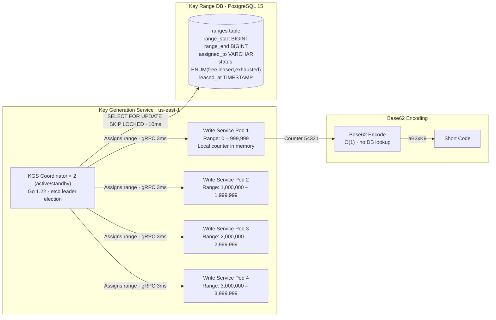
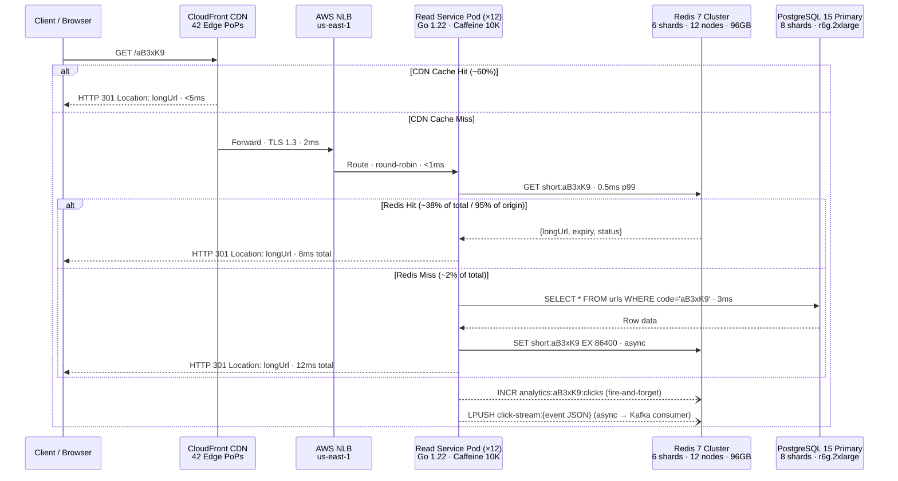
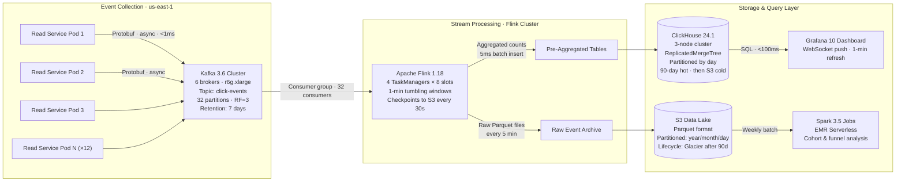
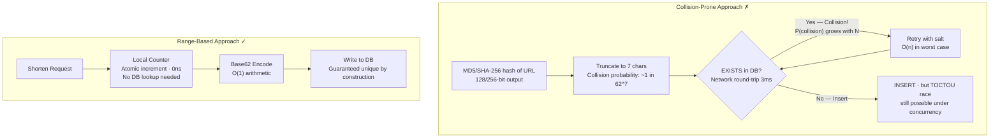
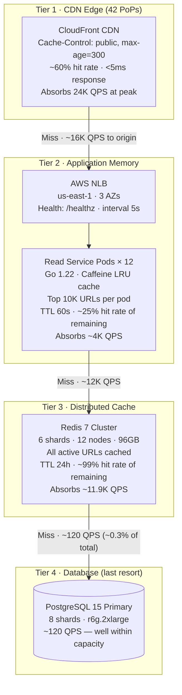
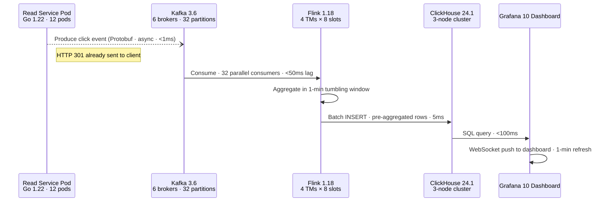
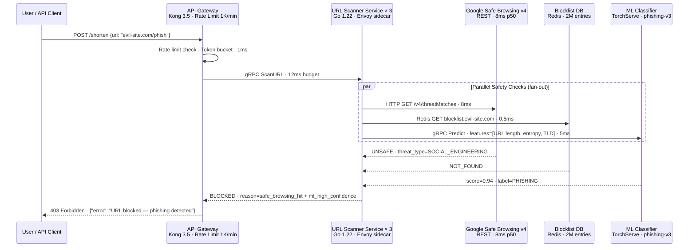
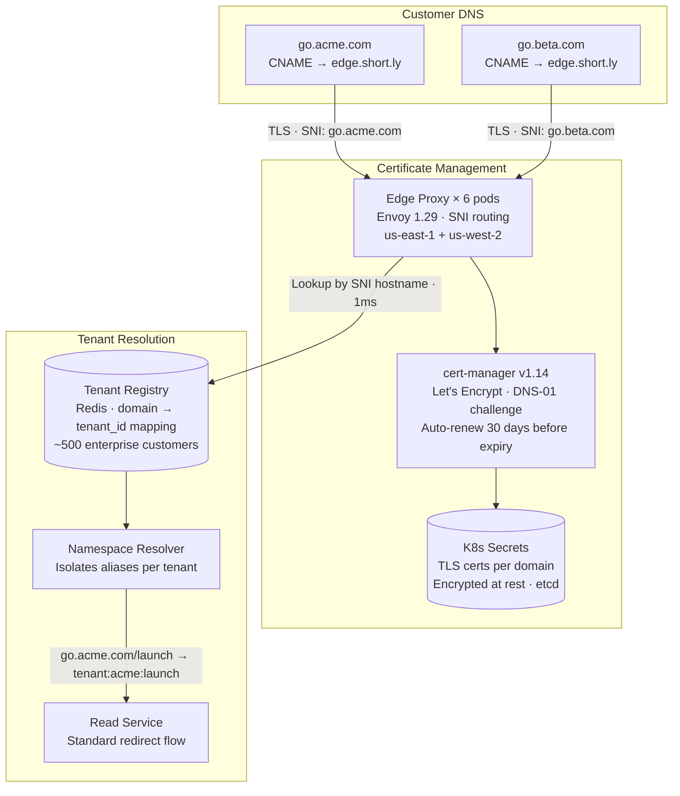

# Design a URL Shortener

URL shorteners like TinyURL and bit.ly seem deceptively simple — take a long URL, return a short one. But behind that simplicity lies a system that must generate globally unique keys at massive scale, redirect billions of requests with sub-10ms latency, track analytics in real time, and defend against abuse. This walkthrough designs a production-grade URL shortener from the ground up.

---

## Requirements

### Functional Requirements

- Shorten a long URL to a unique short URL (e.g., `https://short.ly/aB3xK9`)
- Redirect short URL to the original long URL (HTTP 301/302)
- Custom alias support (e.g., `short.ly/my-brand`)
- Link expiration (default 5 years, configurable)
- Click analytics (count, geo, device, referrer)
- API access for enterprise customers

### Non-Functional Requirements

| Metric                 | Target                                               |
| ---------------------- | ---------------------------------------------------- |
| URLs created/month     | 100M                                                 |
| Redirects/month        | 10B (~3,800 QPS avg, ~40K QPS peak)                  |
| Read:Write ratio       | 100:1                                                |
| Redirect latency (p99) | < 10ms                                               |
| Storage (5 years)      | ~6 TB (100M × 12 months × 5 years × ~1KB per record) |
| Availability           | 99.99%                                               |
| Short code length      | 7 characters (Base62 → 3.5 trillion combinations)    |

---

## High-Level Architecture

```mermaid
graph TB
    Client[Client / Browser] -->|"HTTPS · Anycast DNS"| CDN[CloudFront CDN<br/>42 Edge PoPs<br/>Cache 301 responses · TTL 5min]

    CDN -->|"Miss · TLS 1.3"| GLB[Global Load Balancer<br/>AWS NLB · us-east-1 / us-west-2<br/>Health: /healthz every 5s · 2 failures = drain]

    subgraph "us-east-1 (Primary Region)"
        GLB -->|"Round-robin · <1ms"| API_E[API Gateway × 6 pods<br/>Kong 3.5 · Rate Limit 1K/min/IP<br/>JWT Auth · mTLS]

        API_E -->|"REST POST /shorten · 15ms"| WS_E[Write Service × 4 pods<br/>Go 1.22 · 2 vCPU / 4GB<br/>Envoy sidecar · gRPC]
        API_E -->|"REST GET /:code · 8ms · 40K QPS"| RS_E[Read Service × 12 pods<br/>Go 1.22 · 2 vCPU / 4GB<br/>Caffeine local cache · 10K entries]

        WS_E -->|"gRPC · 3ms"| KGS_E[Key Generation Service × 2<br/>Range allocator · 1M keys/range]
        WS_E -->|"Write · 5ms"| PG_PRIMARY[(PostgreSQL 15<br/>Primary · r6g.2xlarge<br/>8 shards · 750M rows/shard)]
        WS_E -->|"Write-through · 1ms"| REDIS_W[Redis 7 Write-Through<br/>Cluster · 3 shards · 6 nodes]

        KGS_E -->|"Range lease · 10ms"| KEYDB[(Key Range DB<br/>PostgreSQL 15 · Single node<br/>Serializable isolation)]

        RS_E -->|"GET · 0.5ms p99"| REDIS_R[Redis 7 Cluster<br/>6 shards · 12 nodes (6 primary + 6 replica)<br/>96 GB total · 40K QPS capacity]
        REDIS_R -->|"Miss ~1%"| PG_PRIMARY

        RS_E -->|"Async fire-and-forget"| KAFKA_E[Kafka 3.6 Cluster<br/>6 brokers · 32 partitions<br/>Topic: click-events · RF=3]
    end

    subgraph "us-west-2 (DR / Read Replica Region)"
        GLB -->|"Failover · <500ms"| API_W[API Gateway × 4 pods<br/>Kong 3.5 · Read-only mode]
        API_W -->|"REST GET /:code · 10ms"| RS_W[Read Service × 8 pods<br/>Go 1.22 · Caffeine local cache]
        RS_W -->|"GET · 1ms"| REDIS_W2[Redis 7 Cluster<br/>4 shards · 8 nodes<br/>Cross-region replication from us-east-1]
        REDIS_W2 -->|"Miss"| PG_REPLICA[(PostgreSQL 15<br/>2 Streaming Replicas<br/>< 100ms replication lag)]
        PG_PRIMARY -->|"Streaming replication · <100ms lag"| PG_REPLICA
    end

    subgraph "Analytics Pipeline (us-east-1)"
        KAFKA_E --> FLINK[Apache Flink 1.18<br/>4 TaskManagers · 8 slots each<br/>1-min tumbling windows]
        FLINK -->|"Pre-aggregated · 5ms batch insert"| CH[(ClickHouse 24.1<br/>3-node cluster · ReplicatedMergeTree<br/>Partitioned by day · 90-day hot)]
        FLINK -->|"Raw events"| S3[(S3 Data Lake<br/>Parquet · lifecycle → Glacier 90d)]
        CH --> DASH[Analytics Dashboard<br/>Grafana 10 · WebSocket push]
    end

    subgraph "Abuse Prevention (us-east-1)"
        API_E -->|"Sync check · 12ms"| SCAN[URL Scanner Service × 3 pods<br/>Go 1.22 · Envoy sidecar]
        SCAN -->|"REST · 8ms"| SB[Google Safe Browsing v4 API]
        SCAN -->|"Lookup · 1ms"| BL[(Blocklist DB<br/>Redis · 2M entries<br/>Updated hourly from threat feeds)]
        SCAN -->|"Inference · 5ms"| ML[ML Classifier<br/>TorchServe · phishing model v3]
    end
```

**How this solves the problem:** This architecture separates concerns across two AWS regions to achieve 99.99% availability. The primary region (us-east-1) handles all writes and the bulk of reads through 12 stateless Read Service pods fronted by a 12-node Redis cluster capable of 40K QPS. CloudFront's 42 edge PoPs absorb ~60% of redirect traffic before it even reaches origin servers. The us-west-2 region maintains streaming replicas of both PostgreSQL and Redis, providing read capacity and automatic failover if the primary region goes down. The analytics pipeline is fully decoupled — Kafka buffers click events so the redirect hot path never blocks on analytics writes. Abuse prevention runs synchronously on the write path (URL creation) but never touches the read/redirect path, keeping p99 redirect latency under 10ms.

---

## Key Generation Service

The core challenge is generating unique 7-character codes at 100M/month without coordination overhead or collisions.

### Approach: Pre-Generated Key Ranges

Rather than computing keys on-the-fly (hash collisions) or using a single counter (bottleneck), we pre-generate key ranges and assign them to service instances.



**How this solves the problem:** The KGS coordinator runs as an active/standby pair with etcd-based leader election — if the active instance fails, the standby takes over in <2 seconds. Each Write Service pod receives a lease on 1M keys, which it can burn through using a simple in-memory counter with zero network calls. Base62 encoding is a pure arithmetic operation — O(1) with no external dependency. The `SELECT FOR UPDATE SKIP LOCKED` query on the ranges table ensures that even if multiple pods request ranges simultaneously, they never receive overlapping ranges. When a pod crashes, its partially-used range is simply abandoned (wasting at most 1M keys out of 3.5 trillion is negligible).

**Base62 Encoding:** Characters `[a-zA-Z0-9]` give 62 symbols. A 7-character code yields 62^7 ≈ 3.5 trillion unique codes — enough for centuries at 100M/month.

**Range Assignment:** Each application server requests a range of 1M keys. It increments a local counter and Base62-encodes it. When the range is exhausted, it requests a new one. This eliminates cross-node coordination during normal operation.

---

## Read Path & Caching

With a 100:1 read-to-write ratio and a 10ms latency target, the redirect path is cache-dominated.



**How this solves the problem:** The read path implements a three-tier caching strategy that ensures 98%+ of requests never touch the database. CloudFront absorbs ~60% of all redirect traffic at edge PoPs closest to the user (sub-5ms response). Of the remaining 40% that reach origin, the 12-node Redis cluster handles 95% with 0.5ms lookups. Only ~2% of total traffic reaches PostgreSQL. The fire-and-forget analytics increment and click-stream push happen after the HTTP response is sent, so they add zero latency to the redirect. Write-through caching on URL creation means newly created short URLs are immediately warm in Redis — there's no cold-start penalty.

**Cache Strategy:**

- **Redis Cluster** with 6 shards / 12 nodes handles ~40K QPS peak
- **Write-through** on creation ensures cache is warm immediately
- **TTL of 24 hours** — popular links stay cached, cold links evict naturally
- **Cache hit ratio target:** 99%+ (most redirects are to recently created or popular URLs)

---

## Data Model

| Table          | Column         | Type        | Notes                               |
| -------------- | -------------- | ----------- | ----------------------------------- |
| `urls`         | `id`           | BIGINT PK   | Auto-increment                      |
|                | `short_code`   | VARCHAR(7)  | Unique index, Base62 encoded        |
|                | `long_url`     | TEXT        | Original URL (max 2KB)              |
|                | `custom_alias` | VARCHAR(50) | Nullable, unique index              |
|                | `user_id`      | BIGINT      | FK to users, nullable for anonymous |
|                | `created_at`   | TIMESTAMP   | Creation time                       |
|                | `expires_at`   | TIMESTAMP   | Default: created_at + 5 years       |
|                | `is_active`    | BOOLEAN     | Soft delete / abuse flag            |
| `click_events` | `id`           | BIGINT PK   | ClickHouse, partitioned by day      |
|                | `short_code`   | VARCHAR(7)  |                                     |
|                | `timestamp`    | DATETIME    | Event time                          |
|                | `country`      | VARCHAR(2)  | GeoIP lookup                        |
|                | `device_type`  | ENUM        | mobile / desktop / tablet           |
|                | `referrer`     | TEXT        | HTTP referrer header                |

**Sharding Strategy:** Shard `urls` table by `short_code` hash. Consistent hashing with 256 virtual nodes across 8 PostgreSQL shards. Each shard holds ~750M rows over 5 years.

**Index Strategy:**

- `urls.short_code` — B-tree unique index, used by every redirect lookup. Fits in ~12 GB of RAM per shard, enabling index-only scans.
- `urls.custom_alias` — Partial unique index (`WHERE custom_alias IS NOT NULL`), avoids bloat from the 95% of rows without custom aliases.
- `urls.expires_at` — B-tree index for the nightly expiration sweep job that soft-deletes expired URLs and evicts them from Redis.
- `click_events` — ClickHouse primary key `(short_code, toStartOfHour(timestamp))` enables efficient range scans for per-URL analytics dashboards.

---

## Analytics Pipeline



**How this solves the problem:** Click events are serialized as compact Protobuf messages and pushed to Kafka asynchronously — the redirect path never waits for analytics. Kafka's 32 partitions (keyed by `short_code` hash) allow 32 parallel Flink consumers, providing ~320K events/second throughput — 8× the peak load. Flink aggregates events in 1-minute tumbling windows (total clicks, clicks-by-country, clicks-by-device) and batch-inserts into ClickHouse's ReplicatedMergeTree tables. ClickHouse is optimized for this exact workload — append-heavy, column-oriented, with sub-100ms analytical queries. Raw events flow to S3 in Parquet format for long-term retention and weekly Spark batch jobs that compute deeper analytics (funnels, cohorts) that don't need real-time freshness.

---

## Scaling & Bottlenecks

| Bottleneck                | Mitigation                                                                      |
| ------------------------- | ------------------------------------------------------------------------------- |
| Redis cluster failure     | Multi-region Redis with automatic failover; fallback to DB with circuit breaker |
| Database write throughput | Sharding by short_code; batch writes for analytics                              |
| Hot keys (viral links)    | Local in-memory cache (Caffeine) with 60s TTL in front of Redis                 |
| Key range exhaustion      | Monitor range consumption; alert at 80% utilization                             |
| DNS/CDN latency           | Deploy read services at edge locations; use Anycast DNS                         |

**Horizontal Scaling:**

- Read services: stateless, scale to 50+ pods behind a load balancer
- Redis cluster: add shards; 40K QPS is well within a 6-node cluster
- Database: add shards; re-hash with consistent hashing (minimal data movement)

**Capacity Planning (5-Year Projection):**

| Year | Total URLs | DB Size (8 shards) | Redis Memory | Kafka Daily Volume | ClickHouse Storage |
| ---- | ---------- | ------------------ | ------------ | ------------------ | ------------------ |
| 1    | 1.2B       | ~1.2 TB            | 24 GB        | 180 GB/day         | 2 TB (hot)         |
| 2    | 2.4B       | ~2.4 TB            | 38 GB        | 220 GB/day         | 4 TB (hot)         |
| 3    | 3.6B       | ~3.6 TB            | 52 GB        | 260 GB/day         | 6 TB (hot + cold)  |
| 5    | 6.0B       | ~6.0 TB            | 80 GB        | 340 GB/day         | 10 TB (hot + cold) |

Redis memory grows sub-linearly because old, unaccessed URLs naturally evict via TTL. The 96 GB cluster comfortably holds 3+ years of active URLs with headroom.

---

## Industry Problems

### Problem 1: Generating Globally Unique Short Codes Without Collisions at 100M/Month

**Why this example:** Key generation is the foundational challenge of any URL shortener and teaches a broadly applicable pattern — how to generate globally unique identifiers without centralized coordination. The lesson (pre-partitioned ranges with local counters) applies to distributed ID generation in databases (Twitter Snowflake), ticket systems, and any service that must assign unique identifiers across a fleet of stateless workers. It demonstrates that the best way to avoid contention is to eliminate it by design, not to manage it with retries.

At ~38 writes/second average (3,800/s peak), any approach involving "generate then check for collision" creates a thundering herd on the database.



**How this solves the problem:** The left side shows why hash-then-check fails at scale: each collision triggers a retry that hits the database again, and under peak load (3,800 writes/second) the collision probability compounds — with 6 billion existing URLs, a naive 7-char hash truncation collides ~0.17% of the time, causing thousands of unnecessary DB lookups per hour. Worse, there's a TOCTOU (time-of-check-time-of-use) race between the EXISTS check and INSERT. The right side eliminates this entirely: each server holds a pre-assigned range of integers and increments a local atomic counter — zero network calls, zero collision probability, and O(1) time complexity. The uniqueness guarantee is structural, not probabilistic.

**Solution:** Pre-allocated counter ranges eliminate collision checks entirely. Each server owns a monotonically increasing range — uniqueness is guaranteed by construction, not by verification.

### Problem 2: Handling 10B Redirects/Month With Sub-10ms Latency

**Why this example:** This problem teaches multi-tier caching architecture — arguably the most important pattern in read-heavy systems. URL shortener redirects are a near-perfect case study because the access pattern (massively skewed, power-law distribution, immutable data) makes caching extraordinarily effective. The architectural lesson — layering CDN, in-process memory, and distributed cache to progressively absorb traffic — applies directly to any system with a high read-to-write ratio: content delivery, session stores, product catalogs, and API gateways.

10B redirects/month is ~3,800 QPS sustained, with peaks reaching 40K QPS. The critical path must avoid network hops.



**How this solves the problem:** Each caching tier is sized to absorb a specific portion of traffic and has distinct latency characteristics. CloudFront (Tier 1) handles the heaviest lift — 60% of all redirects resolve at edge PoPs in <5ms with zero origin load. The in-process Caffeine cache (Tier 2) costs zero network latency and catches viral/hot URLs that are requested thousands of times per minute. Redis (Tier 3) covers the long tail of active URLs with sub-millisecond reads. By the time requests reach PostgreSQL (Tier 4), only ~120 QPS remain — a trivial load for even a single database instance. The math: 40K peak × 0.4 (CDN miss) × 0.75 (Caffeine miss) × 0.01 (Redis miss) ≈ 120 QPS to DB.

**Solution:** Three-layer caching — CDN for most popular links, local in-memory cache for hot URLs, Redis for the long tail. Only ~0.3% of requests ever touch the database.

### Problem 3: Real-Time Click Analytics Without Impacting Redirect Latency

**Why this example:** This problem demonstrates how to decouple a high-throughput write workload (analytics) from a latency-sensitive read path (redirects) — a pattern that recurs in every system where observability, logging, or event tracking coexists with a user-facing hot path. The lesson is broadly applicable: never let a "nice-to-have" feature (analytics) degrade a "must-have" feature (fast redirects). The Kafka + Flink + ClickHouse stack shown here is the modern standard for real-time event analytics at scale.

Counting clicks sounds trivial, but at 40K events/second with geo, device, and referrer data, naive approaches (increment a counter in the DB) would crush the write path.



**How this solves the problem:** The key insight is the dashed arrow (`--)`) from Read Service to Kafka — this is an asynchronous fire-and-forget call that happens _after_ the HTTP 301 redirect has already been sent to the client. The redirect latency is completely unaffected. Kafka absorbs bursts (its 32 partitions can handle 320K events/second) and Flink consumes at its own pace. The 1-minute tumbling windows mean analytics data appears in ClickHouse within ~60–90 seconds of the click. For the dashboard, this near-real-time delay is imperceptible to users while keeping the redirect hot path free of any write-heavy operations.

**Solution:** Asynchronous event streaming via Kafka. The redirect service fires a Kafka event and returns immediately. Flink processes events in 1-minute tumbling windows, writing pre-aggregated results to ClickHouse. Users see analytics with <2 minute delay.

### Problem 4: Abuse/Spam Prevention and Link Scanning

**Why this example:** URL shorteners are uniquely vulnerable to abuse because they deliberately obscure the destination — the exact property that makes them useful also makes them dangerous. This problem teaches a critical architectural pattern: how to add a synchronous security gate to the write path without degrading the read path. The multi-layer scanning approach (external API + local blocklist + ML classifier as parallel checks) is a defense-in-depth pattern used in any system that accepts user-generated content — file uploads, social media posts, comment systems, and email gateways.

URL shorteners are prime targets for phishing. Shortened URLs obscure the destination, making them ideal for malicious redirects.



**How this solves the problem:** Three independent classifiers run in parallel (fan-out pattern), so the total scanning latency is bounded by the slowest check (~8ms for Google Safe Browsing) rather than the sum of all checks. The Redis blocklist provides sub-millisecond lookups for known-bad domains. The ML classifier catches zero-day phishing URLs that haven't appeared in any blocklist yet — it analyzes URL features (character entropy, path depth, TLD reputation, lexical patterns) and flags suspicious URLs with high confidence. All checks happen on the write path (URL creation), so the redirect path is untouched. A background job re-scans existing URLs every 24 hours to catch URLs whose destinations changed post-creation.

**Solution:** Multi-layer defense — Google Safe Browsing API, internal blocklist (updated hourly from threat feeds), ML classifier for suspicious URL patterns, and periodic re-scanning of existing URLs. Rate limiting per IP/user prevents bulk creation.

### Problem 5: Custom Domains and Vanity URLs for Enterprise Customers

**Why this example:** This problem introduces infrastructure-level complexity that goes beyond application logic — DNS management, TLS certificate automation, and multi-tenant namespace isolation. It teaches how to support whitelabel/custom-domain features, which is a common enterprise upsell in any SaaS product (custom domains for link shorteners, email senders, CDN origins, etc.). The architectural lesson is how to combine SNI-based routing, automated certificate provisioning, and tenant isolation without multiplying infrastructure costs per customer.

Enterprise customers want `go.acme.com/launch` instead of `short.ly/aB3xK9`. This introduces DNS management, SSL certificate provisioning, and namespace isolation.



**How this solves the problem:** Envoy's SNI-based routing inspects the TLS ClientHello to identify which customer domain is being accessed — no need for separate IP addresses per customer (which wouldn't scale). The tenant registry in Redis maps each custom domain to a `tenant_id`, and the namespace resolver ensures that `/launch` under `go.acme.com` is completely independent from `/launch` under `go.beta.com`. cert-manager automates the entire TLS lifecycle — it provisions certificates via Let's Encrypt DNS-01 challenge (which works even before the customer's CNAME is fully propagated) and renews them 30 days before expiry. This entire flow adds only ~2ms to the redirect path (one Redis lookup for tenant resolution).

**Solution:** Customers configure a CNAME from their domain to our edge servers. We use SNI-based routing to identify the customer, look up their namespace, and resolve the alias. SSL certificates are auto-provisioned via Let's Encrypt with DNS-01 challenge. Each customer's aliases are isolated — `go.acme.com/launch` and `go.beta.com/launch` are independent.

---

## Anti-Patterns & Common Mistakes

- **Using MD5/SHA then truncating** — High collision rate at scale; O(n) retries under load
- **Single auto-increment counter** — Single point of failure; reveals creation order (security leak)
- **Synchronous analytics** — Adding click tracking to the redirect path doubles latency
- **301 (permanent) redirect everywhere** — Browsers cache 301s forever; you lose analytics visibility and can't update/expire URLs. Use 302 for tracked links, 301 for permanent ones
- **No rate limiting on creation** — Attackers can exhaust your key space or fill storage with garbage URLs
- **Storing analytics in the same DB as URLs** — Write-heavy analytics traffic degrades read-heavy redirect performance

---

> **Key Takeaway:** A URL shortener is a read-dominated system where the critical path — redirect — must be as close to a cache lookup as possible. The write path's main challenge isn't speed but uniqueness at scale, solved by pre-allocated key ranges that eliminate coordination. Everything else — analytics, abuse detection, custom domains — must be decoupled from the redirect hot path.
