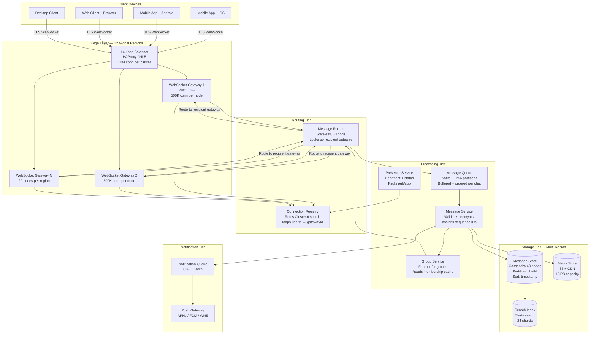
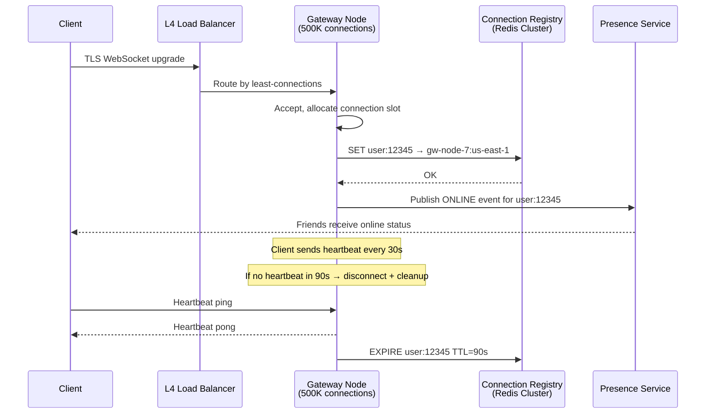
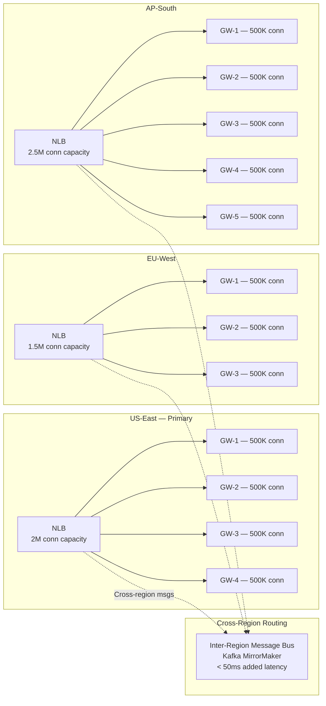
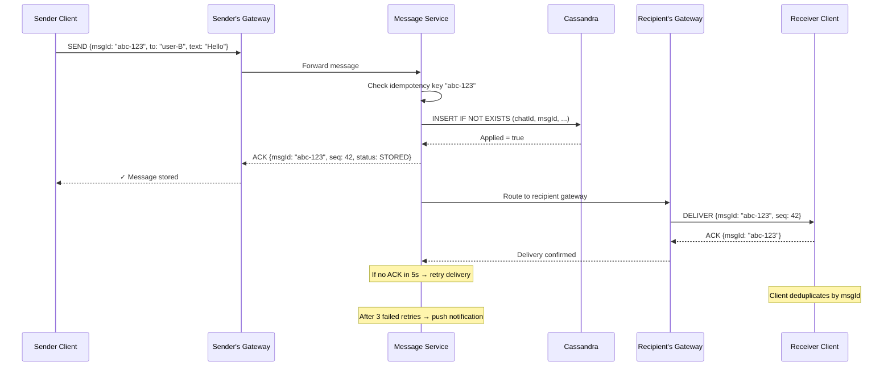
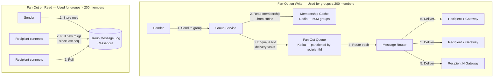
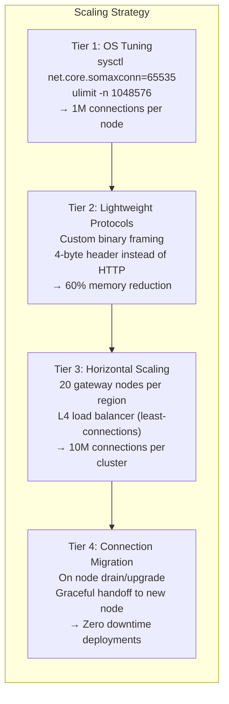
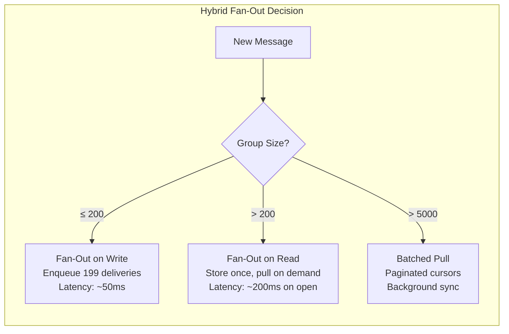
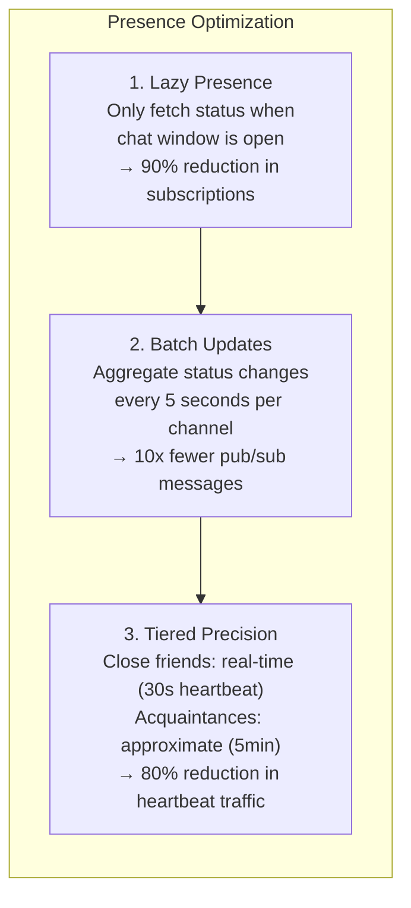

# Design a Chat System

Building a real-time messaging platform like WhatsApp or Slack requires solving some of the hardest problems in distributed systems — persistent connections at massive scale, guaranteed message delivery, group fan-out, and cross-device synchronisation. This case study walks through an end-to-end architecture handling **2 billion users**, **100 billion messages per day**, and **50 million active group chats**.

## Requirements

### Functional

| Requirement              | Detail                                    |
| ------------------------ | ----------------------------------------- |
| 1-to-1 messaging         | Real-time text messages between two users |
| Group messaging          | Groups up to 1 000 members                |
| Online/typing indicators | Presence system with real-time updates    |
| Read receipts            | Delivered, read status per message        |
| Media sharing            | Images, video, documents up to 100 MB     |
| Message history          | Synced across devices, searchable         |
| Push notifications       | Offline users receive push alerts         |

### Non-Functional

| Metric                           | Target                   |
| -------------------------------- | ------------------------ |
| Daily messages                   | 100 B                    |
| Peak messages/sec                | ~5 M                     |
| Concurrent WebSocket connections | 10 M per gateway cluster |
| Message delivery latency         | < 200 ms (same region)   |
| Durability                       | Zero message loss        |
| Storage (5 years)                | ~15 PB                   |

---

## High-Level Architecture

The architecture is split into **connection**, **routing**, **storage**, and **notification** tiers. Each tier scales independently to handle the massive throughput requirements.



**Why this architecture:** The connection registry (Redis) decouples "which gateway holds the user's socket" from message routing. When User A sends a message to User B, the router checks Redis to find B's gateway, then forwards directly. This avoids broadcasting to all gateways and keeps latency under 200 ms.

---

## WebSocket Connection Management

Each gateway server maintains up to **500K persistent WebSocket connections** using an event-driven architecture (epoll/kqueue). A single region has ~20 gateway nodes supporting 10M concurrent users.



**How this solves the problem:** Rather than polling for connection state, the heartbeat + TTL pattern lets Redis automatically expire stale connections. If a gateway crashes, all its user entries expire within 90 seconds and the presence service marks those users offline — no manual cleanup needed.

### Connection Scaling by Region



**Why these region sizes:** AP-South (India, Southeast Asia) has the highest WhatsApp usage density — 500M+ users — so it gets more gateway capacity. Cross-region messages add ~50ms via Kafka MirrorMaker, keeping total delivery under 250ms globally.

---

## Message Delivery Pipeline

### Exactly-Once Delivery

The core challenge: TCP can lose packets, clients can reconnect, servers can crash. We need **at-least-once transport** with **client-side deduplication** to achieve effectively exactly-once semantics.



**How this solves the problem:** Each message carries a client-generated UUID (`msgId`). Cassandra's `INSERT IF NOT EXISTS` ensures the same message is stored only once, even if the sender retries. On the receiving side, the client maintains a local set of seen `msgId` values and silently drops duplicates. Combined with server-side retry (3 attempts, then push notification), we guarantee zero message loss.

---

## Group Message Fan-Out

For a group with **N members**, the system must deliver the message to N−1 recipients. Two strategies exist: **fan-out on write** (pre-compute delivery list) vs **fan-out on read** (recipients pull on connect).



**Why the hybrid approach:** A 50-person family group uses fan-out on write — the latency of delivering to 49 inboxes is negligible. But a 1000-person company channel using fan-out on write would create 999 queue entries per message. At 100 messages/minute that's ~100K queue entries/minute for one group. Fan-out on read for large groups reduces write amplification by 1000x — recipients simply poll the group's message log when they open the app.

---

## Presence System

Showing "online", "last seen", and "typing..." indicators requires a lightweight pub/sub layer that doesn't overload the system with status updates.

```mermaid
graph TB
    subgraph "Presence Architecture"
        C1[Client A] -->|Heartbeat every 30s| GW[Gateway]
        GW -->|Update status| PS[Presence Service<br/>Redis Pub/Sub]
        PS -->|Publish to channel<br/>"friends:userA"| SUB1[Subscriber: Client B's Gateway]
        PS -->|Publish| SUB2[Subscriber: Client C's Gateway]
        SUB1 -->|Push status update| C2[Client B]
        SUB2 -->|Push status update| C3[Client C]
    end

    subgraph "Typing Indicator — Rate Limited"
        CT[Client typing] -->|TYPING event<br/>max 1 per 3s| GW2[Gateway]
        GW2 -->|Broadcast to chat<br/>participants only| PS2[Presence Service]
        PS2 -->|Ephemeral — no storage| RECV[Other participants]
    end

    subgraph "Status Storage"
        PS -->|Persist last_seen| LS[(Redis Hash<br/>user:status → timestamp<br/>TTL: 90s auto-expire)]
    end
```

**How this solves the problem:** Typing indicators are fire-and-forget (no storage), rate-limited to 1 event per 3 seconds to avoid flooding. Online status uses Redis key expiry — if a user's gateway crashes, their status key expires in 90 seconds and friends see "last seen X minutes ago" automatically. This avoids the need for an explicit "go offline" message that might never arrive during a crash.

---

## Data Model

### Cassandra Schema

```
Table: messages
  Partition Key: chat_id (UUID)
  Clustering Key: message_id (TimeUUID, DESC)
  Columns: sender_id, content (encrypted blob), media_url,
           created_at, delivered_at, read_at, message_type

Table: user_chats
  Partition Key: user_id
  Clustering Key: last_message_at (DESC)
  Columns: chat_id, chat_type, unread_count, last_message_preview

Table: group_members
  Partition Key: group_id
  Clustering Key: user_id
  Columns: role, joined_at, muted_until
```

**Why Cassandra:** The access pattern is perfectly suited — messages are always queried by `chat_id` sorted by time (most recent first). Cassandra's partition key + clustering key gives O(1) partition lookup and sequential disk reads within a partition. At 100B messages/day, we need a database that handles heavy write throughput — Cassandra's LSM-tree architecture excels here compared to B-tree databases like PostgreSQL.

---

## Industry Problems

### Problem 1: Maintaining 10M Concurrent WebSocket Connections

**Context:** WhatsApp's infrastructure handles over 2 billion monthly users with peak concurrent connections exceeding 10M per region.

**Why this example:** WebSocket connections are stateful and consume server memory (kernel buffers, TLS state, user context). A naive approach of "one server, many connections" hits OS file descriptor limits around 1M.



**How this solves the problem:** Each tier addresses a different bottleneck. OS tuning raises the per-process connection ceiling. Binary framing reduces per-connection memory from ~50KB to ~20KB. Horizontal scaling multiplies capacity linearly. Connection migration eliminates the "thundering herd" problem during deployments — instead of all 500K clients on a node reconnecting simultaneously, they're migrated one-by-one to a new node.

### Problem 2: Guaranteeing Exactly-Once Message Delivery

**Context:** Slack reports that even a 0.001% message loss rate at their scale (10B+ messages/day) would mean 100K lost messages daily.

**Why this example:** Network partitions, server crashes, and client disconnects all introduce failure modes. The sender might retry (causing duplicates) or give up (causing loss).

**Solution:** Three-layer guarantee:

1. **Client-generated UUID** — sender assigns `msgId` before sending, enabling dedup
2. **Server-side idempotency** — Cassandra `INSERT IF NOT EXISTS` prevents duplicate storage
3. **Delivery retry with push fallback** — 3 WebSocket retries → push notification → message available on next sync

### Problem 3: Group Message Fan-Out to 1000-Member Groups

**Context:** Slack's largest enterprise channels have 10K+ members. Telegram supports groups up to 200K.

**Why this example:** Naive fan-out for a 1000-member group generates 999 delivery operations per message. At 100 messages/minute, that's 99,900 deliveries/minute for one group.



### Problem 4: Cross-Device Message Sync

**Context:** Users expect to seamlessly switch between phone, tablet, desktop, and web — with all message history instantly available.

**Why this example:** Each device maintains its own local database. When a user reads a message on their phone, the "read" status must propagate to their desktop client. With 3+ devices per user, sync complexity multiplies.

**Solution:** Each device tracks a `last_sync_sequence` number. On reconnect, the client sends its sequence and the server returns all messages with higher sequence numbers. Read receipts are treated as messages themselves, flowing through the same delivery pipeline.

### Problem 5: Real-Time Presence at Scale

**Context:** Facebook showed "Active Now" status for 1.5B+ users, consuming significant infrastructure just for presence tracking.

**Why this example:** If every user's 500 friends each subscribe to their status, a single status change triggers 500 pub/sub notifications. For 100M concurrent users changing status 10 times/hour, that's 500B presence events/hour.



**How this solves the problem:** Rather than maintaining a global subscription mesh, presence is fetched on demand (when you open a chat). Combined with batched updates and tiered precision, the presence system handles 2B users with just a Redis cluster instead of requiring a dedicated presence infrastructure.

---

## Anti-Patterns

| Anti-Pattern              | Why It Fails                                 | Better Approach                                 |
| ------------------------- | -------------------------------------------- | ----------------------------------------------- |
| HTTP polling for messages | Wasted bandwidth, 1-3s latency               | WebSocket persistent connections                |
| Storing messages in SQL   | Write throughput ceiling at ~50K/s           | Cassandra or ScyllaDB for write-heavy workloads |
| Global presence broadcast | O(N²) message explosion                      | Lazy presence with on-demand fetch              |
| Single message queue      | Ordering bottleneck                          | Partition by chatId for parallelism             |
| Synchronous fan-out       | Sender blocked until all recipients notified | Async fan-out via message queue                 |

---

> **Key Takeaway:** A chat system is fundamentally a **routing problem** — connecting the sender's device to the recipient's device through a maze of gateways, regions, and queues. The connection registry (Redis) is the linchpin: it maps every online user to their gateway, enabling direct message routing without broadcast. Everything else — delivery guarantees, presence, group fan-out — builds on top of this routing layer.
