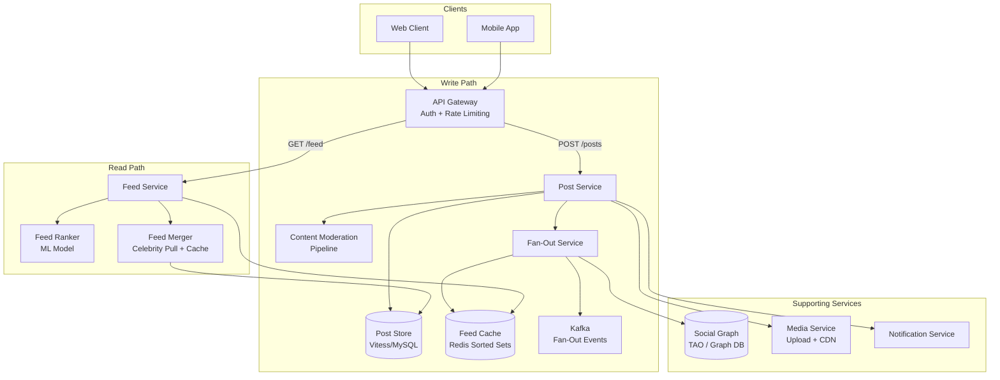
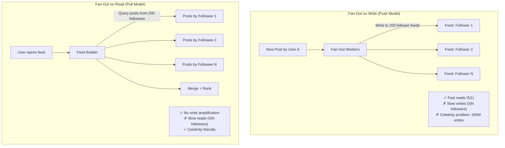
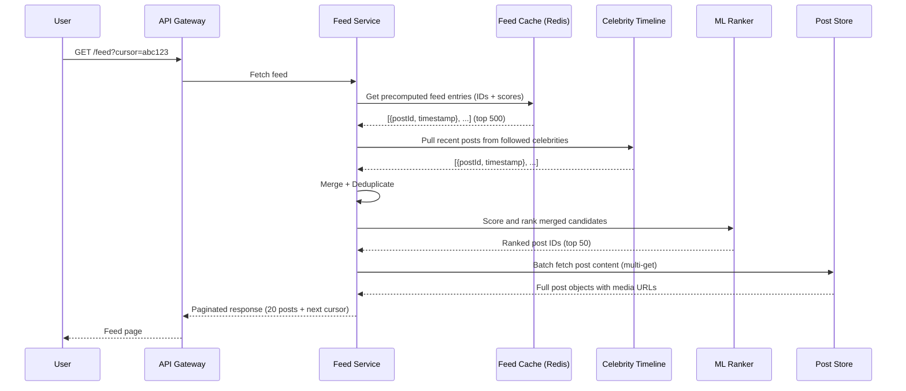
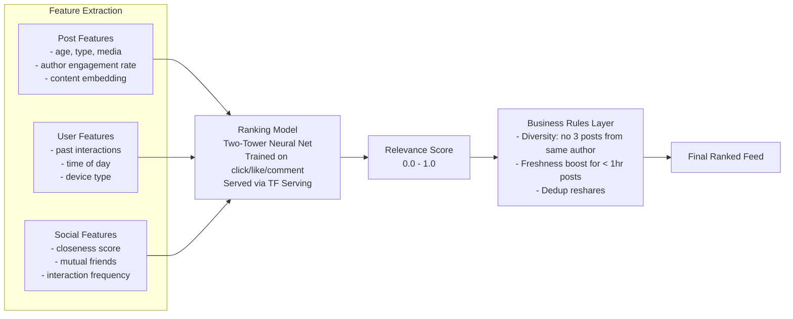
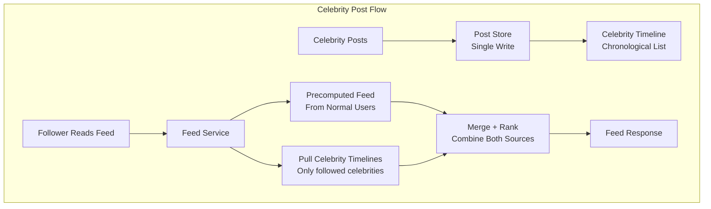
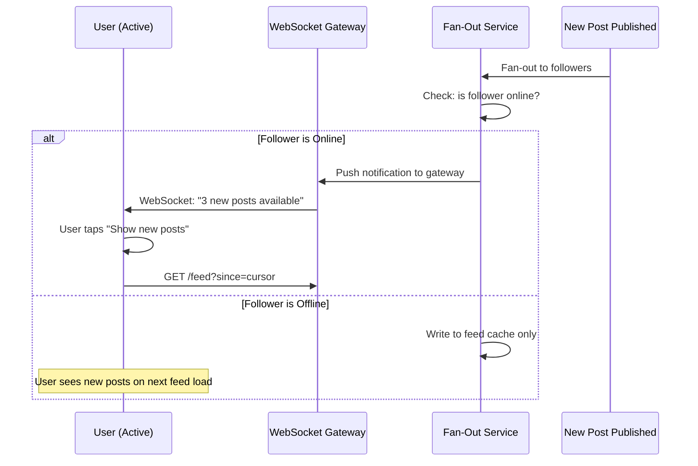
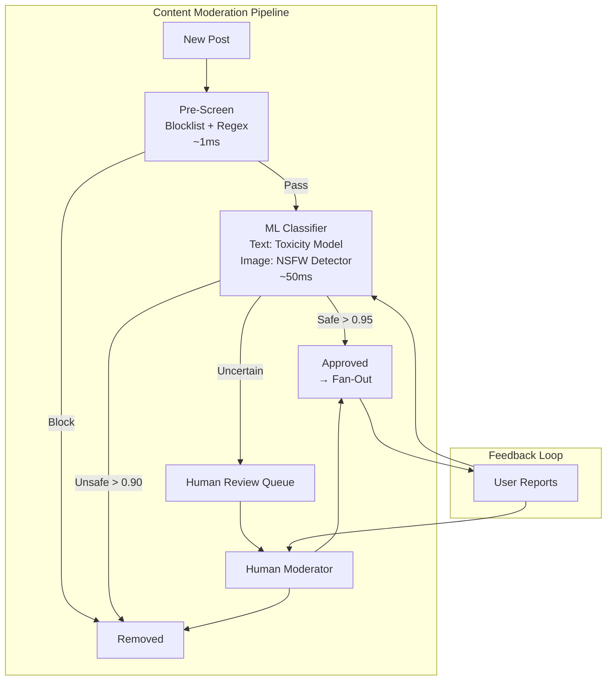

# Design a News Feed

The news feed — the central experience of Facebook, Twitter, and Instagram — is a personalized, ranked, real-time stream of content from people and pages a user follows. Designing it means solving fan-out at celebrity scale (100M followers), ranking billions of posts with ML models in real time, moderating content before it reaches users, and keeping the feed fresh without overwhelming the infrastructure. This is the quintessential system design problem because it touches every major distributed systems concept.

---

## Requirements

### Functional Requirements

- Users can publish posts (text, images, video, links)
- Users see a personalized, ranked feed of posts from their connections
- Feed updates in near-real-time (< 30s for new posts to appear)
- Support for likes, comments, shares with counts
- Cursor-based pagination for infinite scroll
- Content moderation (block harmful/spam content before it reaches feeds)

### Non-Functional Requirements

| Metric                          | Target                           |
| ------------------------------- | -------------------------------- |
| Daily Active Users (DAU)        | 500M                             |
| Posts created/day               | 2B                               |
| Feed reads/day                  | 10B (avg 20 feed loads per user) |
| Feed generation latency (p99)   | < 500ms                          |
| Post-to-feed propagation        | < 30s for 95th percentile        |
| Average followers per user      | 200                              |
| Celebrity users (>1M followers) | ~50K                             |
| Availability                    | 99.99%                           |

---

## High-Level Architecture

---

## Fan-Out Strategy: The Hybrid Approach

The fundamental design decision: when a user publishes a post, do we push it to all followers' feeds (fan-out on write) or compute the feed at read time (fan-out on read)?

**Hybrid Approach (Production Solution):**

- **Regular users (< 10K followers):** Fan-out on write. Post is pushed to all followers' precomputed feed caches.
- **Celebrity users (> 10K followers):** Fan-out on read. Post is stored in the celebrity's timeline. When a follower fetches their feed, the system merges the precomputed cache with a live pull from followed celebrities.

This caps write amplification while keeping reads fast.

---

## Feed Generation Pipeline

**Cursor-Based Pagination:** Each response includes a `next_cursor` — an opaque token encoding the last item's ranking score and timestamp. The next request uses this cursor to fetch the next page. This avoids the offset drift problem of traditional pagination (new posts shift pages).

---

## Data Model

| Table          | Column              | Type               | Notes                               |
| -------------- | ------------------- | ------------------ | ----------------------------------- |
| `posts`        | `post_id`           | BIGINT (Snowflake) | Globally unique, time-ordered       |
|                | `author_id`         | BIGINT             | FK to users                         |
|                | `content`           | TEXT               | Post text                           |
|                | `media_ids`         | JSON               | Array of media object IDs           |
|                | `type`              | ENUM               | text / image / video / link / share |
|                | `created_at`        | TIMESTAMP          |                                     |
|                | `moderation_status` | ENUM               | pending / approved / removed        |
| `feed_cache`   | (Redis Sorted Set)  |                    | Key: `feed:{userId}`                |
|                | `member`            | STRING             | post_id                             |
|                | `score`             | DOUBLE             | Timestamp or rank score             |
| `social_graph` | `follower_id`       | BIGINT             | Who follows                         |
|                | `followee_id`       | BIGINT             | Who is followed                     |
|                | `created_at`        | TIMESTAMP          |                                     |
| `engagements`  | `post_id`           | BIGINT             |                                     |
|                | `user_id`           | BIGINT             |                                     |
|                | `type`              | ENUM               | like / comment / share              |
|                | `created_at`        | TIMESTAMP          |                                     |

**Storage:** Posts in Vitess (sharded MySQL) by `author_id`. Feed cache in Redis sorted sets — each user's feed holds up to 500 post IDs sorted by relevance score. Social graph in TAO-like graph store or dedicated graph database.

---

## Feed Ranking (ML-Based)

The ranker is a two-stage system: a **candidate generator** (lightweight model selecting ~500 candidates) followed by a **precision ranker** (heavy model scoring the 500 candidates). This keeps inference under 100ms even at 500M DAU.

---

## Scaling & Bottlenecks

| Bottleneck                        | Mitigation                                                                       |
| --------------------------------- | -------------------------------------------------------------------------------- |
| Fan-out storm from celebrity post | Hybrid approach: celebrities use fan-out on read, never write to follower caches |
| Redis memory for 500M feed caches | 500M users × 500 IDs × 16 bytes ≈ 4TB; shard across 50+ Redis nodes              |
| ML ranking latency                | Two-stage ranking; precompute embeddings; serve via GPU inference pods           |
| Post store read amplification     | Multi-get with in-memory cache (Memcached) in front of Vitess                    |
| Social graph queries              | TAO-like system with aggressive caching; denormalize follower lists              |
| Real-time feed updates            | WebSocket push for active users; pull-on-refresh for inactive                    |

**Feed Cache Eviction:** Each user's sorted set is capped at 500 entries. When a new post is fan-out-written, the lowest-scored entry is evicted. Users who haven't logged in for 30+ days have their feed cache expired entirely — it's rebuilt on next login.

---

## Industry Problems

### Problem 1: Fan-Out for a Celebrity With 100M Followers

When a celebrity with 100M followers posts, fan-out on write means inserting into 100M Redis sorted sets — at ~50K writes/second per Redis shard, that's 2,000 seconds (33 minutes) just for one post.

**Solution:** Celebrity posts are never fanned out. They live in the celebrity's own timeline. When a follower loads their feed, the system pulls posts from followed celebrities (typically < 50 celebrity followees) and merges with the precomputed cache. The merge adds ~20ms to read latency — a worthwhile trade-off vs. 33 minutes of write propagation.

### Problem 2: Real-Time Feed Updates Without Polling

Users expect to see new posts without refreshing. Polling every 5 seconds from 500M users would generate 100M requests/second of mostly-empty responses.

**Solution:** Long-lived WebSocket connections for active users. When new posts are fanned out, the system checks if the follower is currently online (presence bit in Redis). If yes, a lightweight "new posts available" notification is pushed via WebSocket. The client then does a targeted fetch for just the new posts. This reduces polling to zero while keeping the feed fresh.

### Problem 3: ML-Based Feed Ranking at 500M DAU

With 10B feed reads/day and ~500 candidates to score per read, the ranking model must perform 5 trillion inferences per day — roughly 58M inferences per second.

**Solution:** Two-stage ranking. Stage 1 (candidate selection) uses a lightweight model (logistic regression) to narrow 500 candidates to 50. Stage 2 (precision ranking) uses a deep neural network to rank the final 50. Pre-computed user and item embeddings are cached in Redis, so inference only computes the interaction features. GPU inference pods with batching handle throughput. Feature logging to a feature store enables offline training.

### Problem 4: Content Moderation at 2B Posts/Day

At 2B posts/day (~23K posts/second), moderation must be automated, real-time, and accurate enough to catch harmful content before it reaches feeds.

**Solution:** Three-tier moderation. Tier 1: keyword blocklist and regex patterns (catches obvious spam, ~1ms). Tier 2: ML classifiers for toxicity, NSFW, and misinformation (runs asynchronously, ~50ms). Tier 3: human review for borderline cases. Posts flagged between 0.5–0.9 confidence enter a human queue. The system errs on the side of showing content and relying on user reports for false negatives — removing content is an asynchronous correction.

### Problem 5: Handling Mixed Media Types

A single feed page might contain text posts, images, videos, link previews, and reshares — each requiring different processing pipelines, storage, and rendering.

**Solution:** Unified post schema with a `type` field and extensible `media_ids` reference. Each media type has its own processing pipeline (image resizing, video transcoding, link preview extraction via Open Graph scraping) that runs asynchronously. The post is immediately available with a placeholder; media URLs are populated once processing completes. The feed response includes pre-computed layout hints (aspect ratios, durations, thumbnail URLs) so clients can render without additional fetches.

---

## Anti-Patterns & Common Mistakes

- **Pure fan-out on write** — Works for small-scale social networks but collapses under celebrity-follower power law distributions
- **Chronological-only feed** — Without ranking, users see the most recent posts, not the most relevant; engagement drops
- **Offset-based pagination** — New posts shift all offsets, causing duplicate or missed posts; always use cursor-based
- **Synchronous moderation in the write path** — Blocking post creation on ML inference adds 50ms+ latency; run moderation asynchronously with a short approval delay
- **Monolithic feed cache** — Storing the entire feed as a single blob prevents incremental updates; use sorted sets with individual post entries
- **Ignoring cold-start users** — New users with no connections see an empty feed; bootstrap with trending/recommended content

---

> **Key Takeaway:** The news feed is defined by the fan-out problem. Pure push (fan-out on write) is fast to read but crushes write infrastructure for celebrities. Pure pull (fan-out on read) scales writes but makes reads expensive. The hybrid approach — push for regular users, pull for celebrities, merge at read time — is the industry-standard solution. Ranking transforms a chronological stream into an engaging, personalized experience, but adds inference cost that demands two-stage architectures.
