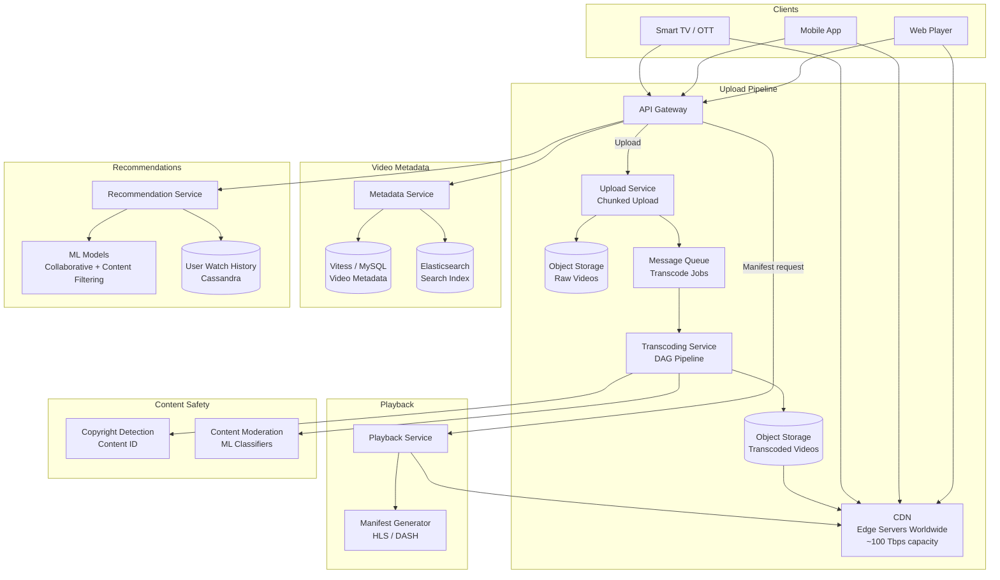
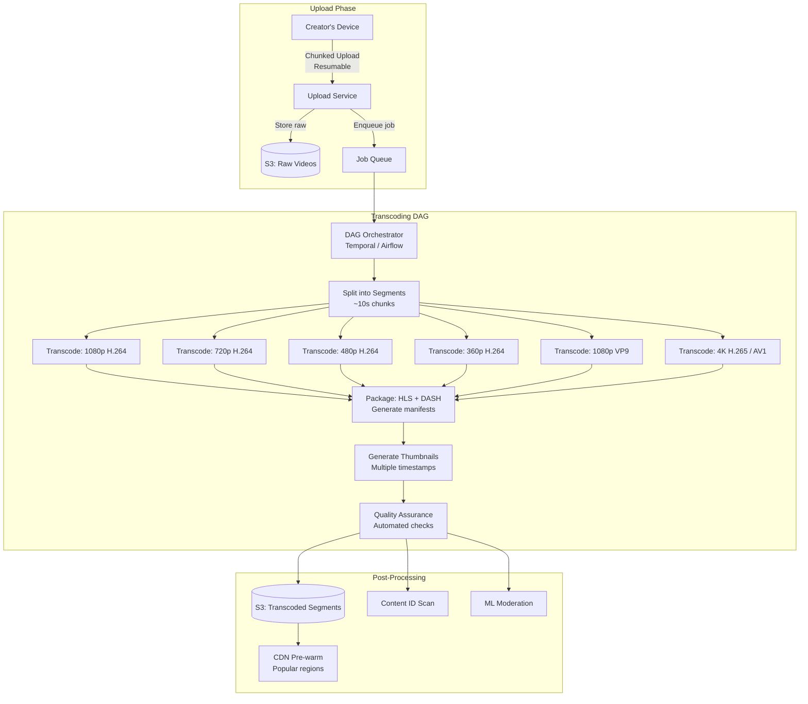
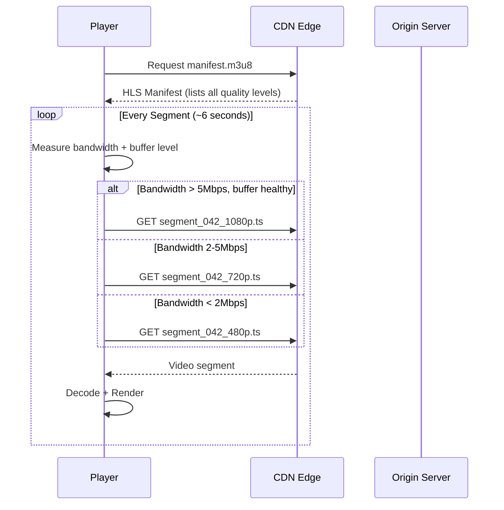
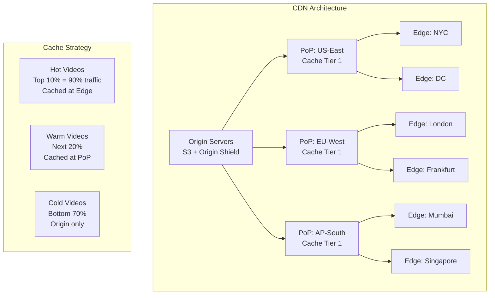
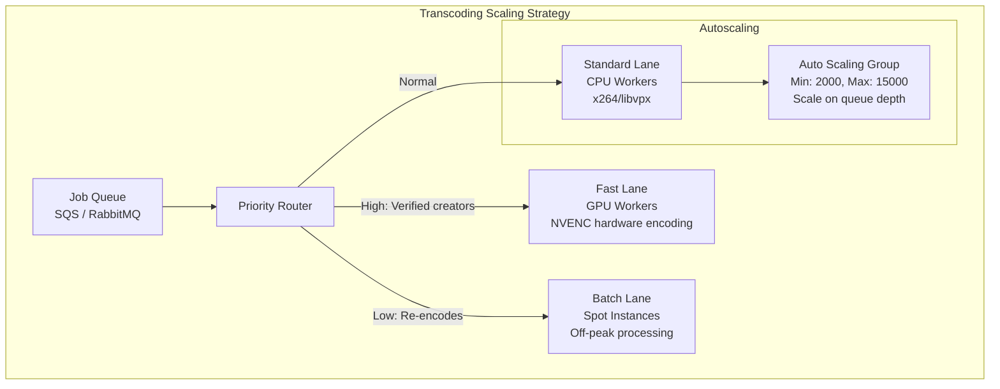
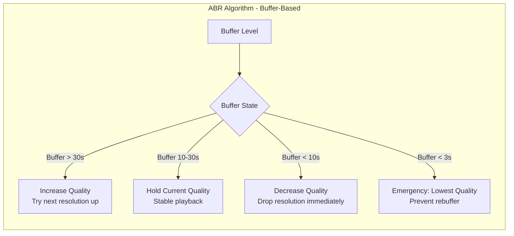
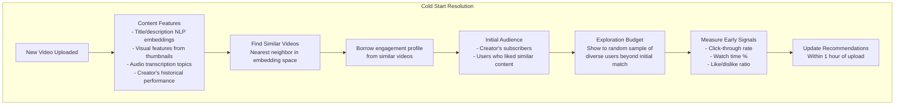
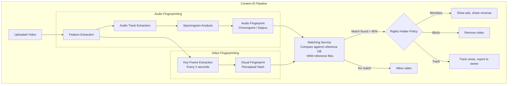

# Design a Video Streaming Platform

Building a video streaming platform like YouTube or Netflix means processing 500 hours of new video every minute, delivering 1 billion hours of playback daily to a global audience, adapting quality in real time to each viewer's network conditions, detecting copyrighted content within seconds of upload, and recommending the right video to the right user at the right time. Video is the hardest media type to serve at scale — it's bandwidth-intensive, latency-sensitive, and storage-hungry.

---

## Requirements

### Functional Requirements

- Video upload (up to 10GB per video)
- Video playback with adaptive bitrate streaming (multiple resolutions)
- Search by title, tags, and description
- Video recommendations (personalized home feed)
- Live streaming support
- Comments, likes, subscriptions
- Creator analytics (views, watch time, demographics)
- Content moderation and copyright detection

### Non-Functional Requirements

| Metric                                        | Target                              |
| --------------------------------------------- | ----------------------------------- |
| Monthly Active Users                          | 2B                                  |
| Video uploads                                 | 500 hours/minute (~720K videos/day) |
| Hours watched/day                             | 1B                                  |
| Average video size (raw)                      | 2GB                                 |
| Storage per minute of video (all resolutions) | ~300MB transcoded                   |
| Total storage growth                          | ~500PB/year                         |
| Playback start latency                        | < 2 seconds                         |
| CDN bandwidth                                 | ~100 Tbps peak                      |
| Availability                                  | 99.99%                              |

---

## High-Level Architecture

---

## Video Upload & Transcoding Pipeline

The upload pipeline is the most complex subsystem. Raw video must be split, transcoded into multiple resolutions and codecs, packaged for streaming, and then distributed to CDN — all within minutes.

**DAG Pipeline:** Transcoding is modeled as a directed acyclic graph. Splitting into segments enables parallel transcoding — a 10-minute video split into 60 segments (10s each) can be transcoded across 60 workers simultaneously. Each resolution/codec is an independent branch. This reduces total transcode time from hours to minutes.

**Resumable Uploads:** Large files (up to 10GB) use chunked, resumable uploads (tus protocol). If the upload fails at 80%, the client resumes from chunk 81 instead of restarting.

---

## Adaptive Bitrate Streaming

**HLS (HTTP Live Streaming):** Video is split into 6-second segments. A master manifest (`.m3u8`) lists all available quality levels. The player's adaptive algorithm selects the quality for each segment based on measured throughput and buffer occupancy. This means quality adapts every 6 seconds without rebuffering.

**DASH (Dynamic Adaptive Streaming over HTTP)** provides the same functionality with an `.mpd` manifest and is codec-agnostic. Most platforms support both HLS (Apple ecosystem) and DASH (everything else).

---

## Data Model

| Table            | Column               | Type               | Notes                                   |
| ---------------- | -------------------- | ------------------ | --------------------------------------- |
| `videos`         | `video_id`           | BIGINT (Snowflake) | Globally unique                         |
|                  | `creator_id`         | BIGINT             | FK to users                             |
|                  | `title`              | VARCHAR(500)       | Searchable                              |
|                  | `description`        | TEXT               |                                         |
|                  | `duration_sec`       | INT                |                                         |
|                  | `status`             | ENUM               | uploading / processing / live / removed |
|                  | `upload_url`         | TEXT               | S3 path to raw video                    |
|                  | `created_at`         | TIMESTAMP          |                                         |
| `video_segments` | `video_id`           | BIGINT             |                                         |
|                  | `resolution`         | ENUM               | 360p / 480p / 720p / 1080p / 4K         |
|                  | `codec`              | ENUM               | h264 / vp9 / av1                        |
|                  | `segment_num`        | INT                | Ordered segment index                   |
|                  | `s3_path`            | TEXT               | Path to segment file                    |
|                  | `size_bytes`         | BIGINT             |                                         |
| `watch_history`  | `user_id`            | BIGINT             | Partition key (Cassandra)               |
|                  | `video_id`           | BIGINT             |                                         |
|                  | `watched_at`         | TIMESTAMP          |                                         |
|                  | `watch_duration_sec` | INT                | For recommendations                     |
|                  | `completed`          | BOOLEAN            | Watched > 90%                           |
| `video_stats`    | `video_id`           | BIGINT             | Counter table (Cassandra)               |
|                  | `view_count`         | COUNTER            | Approximate count                       |
|                  | `like_count`         | COUNTER            |                                         |
|                  | `comment_count`      | COUNTER            |                                         |

**Storage Strategy:** Video metadata in Vitess (sharded MySQL). Segments stored in S3-compatible object storage with lifecycle policies (cold storage after 1 year for unpopular videos). Watch history in Cassandra for fast writes and time-range queries. View counts use Cassandra counters (eventually consistent, acceptable for display).

---

## CDN Distribution

**Cache Economics:** The top 10% of videos generate ~90% of traffic (Zipf distribution). These are cached at all edge locations. The next 20% are cached at regional PoPs. The long tail (70%) is served directly from origin. This keeps CDN costs manageable — caching everything would require exabytes of edge storage.

---

## Scaling & Bottlenecks

| Bottleneck                                        | Mitigation                                                                                                    |
| ------------------------------------------------- | ------------------------------------------------------------------------------------------------------------- |
| Transcoding compute (500 hrs/min × 6 resolutions) | Auto-scaling GPU/CPU fleet; segment-level parallelism; prioritize popular creators                            |
| Storage growth (~500 PB/year)                     | Tiered storage: hot (SSD), warm (HDD), cold (S3 Glacier); delete unpopular duplicate resolutions after 1 year |
| CDN bandwidth (100 Tbps peak)                     | Multi-CDN strategy (Akamai + Cloudflare + own CDN); smart routing based on cost and latency                   |
| Origin overload for viral videos                  | Origin shield (cache tier between CDN and origin); pre-warm CDN for trending videos                           |
| View count accuracy                               | Approximate counters for display; exact counts via Kafka + Flink pipeline for revenue                         |
| Recommendation freshness                          | Pre-compute candidates offline (hourly); re-rank in real-time at serving                                      |

---

## Industry Problems

### Problem 1: Processing 500 Hours of Video Per Minute Through the Transcoding Pipeline

500 hours/minute × 6 quality levels = 3,000 hours of transcoded video per minute. Each minute of 1080p transcoding takes ~3 minutes of CPU time. This means ~9,000 CPU-minutes of transcoding work per minute of wall-clock time — requiring a sustained fleet of 9,000+ transcoding workers.

**Solution:** Three-tier prioritization. Verified creators and live-to-VOD conversions get GPU-accelerated encoding (NVENC is 10× faster than CPU). Standard uploads use CPU workers on auto-scaling groups that scale based on queue depth. Re-encodes and format upgrades (e.g., AV1 migration) run on spot/preemptible instances during off-peak. Segment-level parallelism means a single video's transcode can span hundreds of workers.

### Problem 2: Adaptive Bitrate Streaming for Varying Network Conditions

Users switch between WiFi and cellular mid-stream, enter tunnels, or share bandwidth with other devices. The player must adapt without rebuffering.

**Solution:** Modern ABR algorithms (like BBA — Buffer-Based Approach) use buffer occupancy as the primary signal, with throughput estimation as secondary. The player maintains a 30-second buffer target. Quality increases are conservative (only after sustained high buffer), while quality decreases are aggressive (immediate on buffer drop). Players also use segment-level bitrate hints from manifests to make pre-fetch decisions.

### Problem 3: Cold Start Problem for New Video Recommendations

When a new video is uploaded, the recommendation system has no engagement data (views, likes, watch time). How do you decide who should see it?

**Solution:** Content-based features (NLP embeddings of title/description, visual features from thumbnail, creator history) bootstrap the recommendation. The video is initially shown to the creator's subscribers and users with affinity for similar content. An exploration budget (typically 5% of recommendation slots) ensures new videos get some exposure to diverse audiences. Early engagement signals (especially watch-time percentage, not just clicks) feed back into the model within 1 hour.

### Problem 4: Copyright Detection (Content ID System)

Creators upload copyrighted music, movie clips, and sports highlights. The platform must detect these within minutes to avoid legal liability.

**Solution:** Dual fingerprinting — audio (chromaprint-style spectral analysis) and video (perceptual hashing of key frames). Fingerprints are compared against a reference database of ~80M copyrighted works using locality-sensitive hashing for sub-second lookup. Rights holders define policies per work: monetize (run ads and share revenue), block (remove the video), or track (allow but report analytics). The system runs during transcoding so results are available before the video goes live.

### Problem 5: Live Streaming at Scale With Sub-Second Latency

Traditional HLS/DASH have 6-30 second latency (segment duration + encoding delay + CDN propagation). Live streaming for sports, gaming, and auctions needs sub-second latency.

**Solution:** Low-latency HLS (LL-HLS) and CMAF with chunked transfer encoding. Instead of waiting for a full 6-second segment, the encoder emits partial segments (200ms chunks) via chunked HTTP transfer. The CDN forwards chunks as they arrive rather than waiting for the complete segment. Combined with server push (HTTP/2) and preload hints, this achieves 1-3 second glass-to-glass latency. For sub-second requirements (e.g., live auctions), WebRTC-based delivery bypasses the segment model entirely but doesn't scale beyond ~10K concurrent viewers without a selective forwarding unit (SFU) mesh.

---

## Anti-Patterns & Common Mistakes

- **Transcoding all resolutions eagerly** — A video with 10 views doesn't need 4K AV1. Transcode 720p and 1080p immediately; add higher resolutions only if the video gains traction
- **Single CDN provider** — CDN outages happen. Multi-CDN with real-time quality-of-experience monitoring and automatic failover is essential
- **Using view count as the primary recommendation signal** — Optimizing for clicks leads to clickbait. Watch-time percentage is a much better signal for content quality
- **Synchronous copyright check before publishing** — Content ID scanning can take minutes. Allow the video to start processing while scanning runs in parallel; block publication only on match
- **Ignoring the long tail** — 70% of videos get minimal views but represent significant storage cost. Apply tiered storage and consider dropping redundant resolutions for cold content
- **Fixed bitrate segments** — Variable bitrate (VBR) encoding produces better quality per bit but makes ABR harder; use constrained VBR with bitrate caps

---

> **Key Takeaway:** Video streaming is fundamentally a storage and bandwidth problem. The transcoding pipeline is the most compute-intensive subsystem — segment-level parallelism and priority queues are essential. CDN architecture must exploit the Zipf distribution (cache the head, serve the tail from origin). Adaptive bitrate streaming and Content ID are the differentiating technical features. Every design decision trades off between cost (storage, compute, bandwidth), quality (resolution, latency), and scale (number of concurrent viewers).
